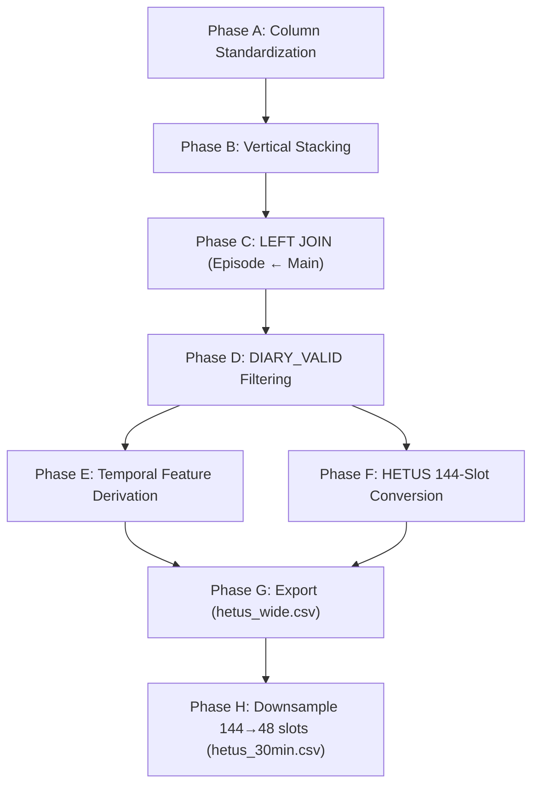

# Step 3 — Merge & Temporal Feature Derivation: Implementation Plan

## Goal

Merge the eight harmonized Step 2 CSV files (4 Main + 4 Episode) into a single unified occupancy dataset, derive temporal features for downstream modeling, convert variable-length episode data into the HETUS 144-slot wide format, and downsample to 30-minute resolution for direct use in the Conditional Transformer (Step 4) and BEM/UBEM integration (Step 7).

> **Status: COMPLETE** — 99% pass rate (81/82 checks), Phase H validated (V1–V8 all PASS).
> Primary outputs: `hetus_wide.csv` (10-min archival intermediate) and `hetus_30min.csv` (30-min Transformer input).

**Input directory**: `outputs_step2/`
**Output directory**: `outputs_step3/`

---

## Pre-Conditions (from Step 2)

### Available Harmonized Files

| File | Rows | Columns |
|------|------|---------|
| `main_2005.csv` | 19,597 | 25 |
| `main_2010.csv` | 15,390 | 36 |
| `main_2015.csv` | 17,390 | 36 |
| `main_2022.csv` | 12,336 | 32 |
| `episode_2005.csv` | 333,654 | 24 |
| `episode_2010.csv` | 283,287 | 24 |
| `episode_2015.csv` | 274,108 | 27 |
| `episode_2022.csv` | 168,078 | 25 |

Step 2 harmonized all four cycles into a unified schema: column names, category encodings, missing-value conventions, and metadata flags are consistent across cycles. Each cycle's file contains the harmonized core columns plus some cycle-specific extras (e.g., CTW checkbox columns, REGION in 2010) that are not needed for Step 3. Phase A below selects only the common harmonized columns and drops the extras.

---

## Architecture Overview

```
╔══════════════════════════════════════════════════════════════════════╗
║  Phase A — Column Standardization                                    ║
║  Select harmonized common columns from each Main/Episode file       ║
║  Drop cycle-specific extras; ensure identical schemas for stacking  ║
╠══════════════════════════════════════════════════════════════════════╣
║  Phase B — Vertical Stacking (Append All Cycles)                    ║
║  Stack 4 Main files → unified_main (~64,713 respondents)           ║
║  Stack 4 Episode files → unified_episode (~1.06M episodes)         ║
╠══════════════════════════════════════════════════════════════════════╣
║  Phase C — LEFT JOIN (Episode ← Main on occID + CYCLE_YEAR)        ║
║  Result: one row per episode, carrying full demographic context    ║
╠══════════════════════════════════════════════════════════════════════╣
║  Phase D — DIARY_VALID Filtering                                    ║
║  Remove respondents with DIARY_VALID == 0 (corrupted diaries)      ║
╠══════════════════════════════════════════════════════════════════════╣
║  Phase E — Temporal Feature Derivation                              ║
║  Derive: DAYTYPE, HOUR_OF_DAY, TIMESLOT_10                        ║
╠══════════════════════════════════════════════════════════════════════╣
║  Phase F — HETUS 144-Slot Wide Format Conversion                   ║
║  Variable-length episodes → 144 fixed 10-min slots per respondent  ║
║  Output: one row per respondent with slot_001–slot_144 columns     ║
╠══════════════════════════════════════════════════════════════════════╣
║  Phase G — Export                                                    ║
║  Save merged episode-level CSV + HETUS wide-format CSV             ║
╠══════════════════════════════════════════════════════════════════════╣
║  Phase H — Resolution Downsampling (144-slot → 48-slot)            ║
║  Majority-vote aggregation of 3 × 10-min slots → 1 × 30-min slot  ║
║  AT_HOME: binary majority (nansum ≥ 2); Activity: mode + BEM tie   ║
║  Output: hetus_30min.csv (64,061 rows × 96 temporal columns)       ║
╚══════════════════════════════════════════════════════════════════════╝
```

---

## Phase A — Column Standardization

### A1. Define Common Main Columns

Select only the harmonized common columns that exist across all 4 cycles. Drop cycle-specific extras (CTW checkboxes, REGION, raw employment codes, etc.).

```python
MAIN_COMMON_COLS = [
    "occID", "AGEGRP", "SEX", "MARSTH", "HHSIZE", "PR", "CMA",
    "WGHT_PER", "DDAY", "KOL", "LFTAG", "TOTINC", "HRSWRK",
    "MODE", "NOCS",
    # Metadata flags
    "TOTINC_SOURCE", "CYCLE_YEAR", "SURVYEAR",
    "COLLECT_MODE", "TUI_10_AVAIL", "BS_TYPE"
]
```

> **Note**: `HRSWRK_RAW` and `TOTINC_RAW` are preserved-for-reference columns from Step 2. They should be **dropped** at this stage — the harmonized `HRSWRK` and `TOTINC` are the analysis-ready versions. `NOCS` is only available in 2015/2022 — fill with `NaN` for 2005/2010.

### A2. Define Common Episode Columns

```python
EPISODE_COMMON_COLS = [
    "occID", "EPINO", "WGHT_EPI",
    "start", "end", "duration",
    "occACT_raw", "occACT", "occACT_label",
    "occPRE_raw", "occPRE", "AT_HOME",
    # Co-presence
    "Alone", "Spouse", "Children", "parents",
    "otherInFAMs", "otherHHs", "friends", "others",
    # QA
    "DIARY_VALID", "CYCLE_YEAR"
]
```

> **Note**: `TUI_07` (tech use) and `TUI_10`/`TUI_15` (wellbeing) are only in 2015/2022 episode files. Per pipeline design, `TUI_10` is an auxiliary variable flagged by `TUI_10_AVAIL`. We include `TUI_07` as an optional column — present for 2015/2022, `NaN` for 2005/2010.

### A3. Handle Missing Columns Gracefully

For each cycle's file, select only columns that exist. Fill missing columns with `NaN`. This avoids errors when a column (e.g., `NOCS`, `TUI_07`) is absent from certain cycles.

```python
def standardize_columns(df, target_cols):
    """Select target_cols from df; add NaN for any missing."""
    for col in target_cols:
        if col not in df.columns:
            df[col] = pd.NA
    return df[target_cols]
```

---

## Phase B — Vertical Stacking

### B1. Stack Main Files

```python
main_dfs = []
for cycle in [2005, 2010, 2015, 2022]:
    df = pd.read_csv(f"outputs_step2/main_{cycle}.csv")
    df = standardize_columns(df, MAIN_COMMON_COLS)
    main_dfs.append(df)
unified_main = pd.concat(main_dfs, ignore_index=True)
```

**Expected result**: ~64,713 rows (19,597 + 15,390 + 17,390 + 12,336)

### B2. Stack Episode Files

```python
episode_dfs = []
for cycle in [2005, 2010, 2015, 2022]:
    df = pd.read_csv(f"outputs_step2/episode_{cycle}.csv")
    df = standardize_columns(df, EPISODE_COMMON_COLS)
    episode_dfs.append(df)
unified_episode = pd.concat(episode_dfs, ignore_index=True)
```

**Expected result**: ~1,059,128 rows (333,654 + 283,287 + 274,108 + 168,079)

### B3. Post-Stack Integrity Checks

- Assert no duplicate `(occID, CYCLE_YEAR)` pairs in `unified_main`
- Assert `unified_episode.CYCLE_YEAR.value_counts()` matches per-cycle row counts

> **occID collision note**: occIDs are unique *within* each cycle but may collide *across* cycles (e.g., respondent 1 in 2005 ≠ respondent 1 in 2010). The merge key must be `(occID, CYCLE_YEAR)`, not `occID` alone.

---

## Phase C — LEFT JOIN (Episode ← Main)

### C1. Merge Strategy

```python
merged = unified_episode.merge(
    unified_main,
    on=["occID", "CYCLE_YEAR"],
    how="left",
    validate="many_to_one"   # Many episodes per respondent
)
```

**Join key**: `(occID, CYCLE_YEAR)` — required because occIDs are only unique within a cycle.

**Expected result**: Same row count as `unified_episode` (~1.06M rows). Each episode row now carries the respondent's full demographic profile.

### C2. Post-Merge Checks

- Assert `len(merged) == len(unified_episode)` (no row gain/loss from LEFT JOIN)
- Assert `merged.WGHT_PER.notna().all()` — every episode matched a Main record
- If any episodes fail to match (orphan episodes), log them and investigate

### C3. Weight Column Clarity

After merge, both `WGHT_EPI` (episode-level) and `WGHT_PER` (person-level) are present on every row:
- **Episode-level analyses** (activity distributions, time allocation): use `WGHT_EPI`
- **Person-level analyses** (demographic summaries, archetype clustering): use `WGHT_PER`

No weight derivation needed — both are carried forward as-is from Statistics Canada.

---

## Phase D — DIARY_VALID Filtering

### D1. Filter Corrupted Diaries

```python
n_before = merged.occID.nunique()
merged = merged[merged["DIARY_VALID"] == 1]
n_after = merged.occID.nunique()
print(f"Removed {n_before - n_after} respondents with invalid diaries")
```

Per Statistics Canada QA rules, respondents whose episodes do not sum to exactly 1440 minutes cannot be validly converted to HETUS 144-slot format.

### D2. Log Exclusions

Record per-cycle counts of excluded respondents. Expected exclusion rate: <5% per cycle (most diaries close correctly under CATI/EQ collection protocols).

---

## Phase E — Temporal Feature Derivation

### E1. DAYTYPE (from DDAY)

```python
# GSS DDAY: 1=Sunday, 2=Monday, ..., 7=Saturday
DAYTYPE_MAP = {
    1: "Weekend",   # Sunday
    2: "Weekday",   # Monday
    3: "Weekday",   # Tuesday
    4: "Weekday",   # Wednesday
    5: "Weekday",   # Thursday
    6: "Weekday",   # Friday
    7: "Weekend"    # Saturday
}
merged["DAYTYPE"] = merged["DDAY"].map(DAYTYPE_MAP)
```

> **DDAY methodological note**: DDAY is the diary reference day (the day BEFORE the interview). The 24-hour diary reconstructs this completed prior day (4:00 AM to 4:00 AM next day). Each sequence is a complete, verified 1440-minute record.

### E2. HOUR_OF_DAY (from start time)

The `start` column is in HHMM 24-hour format (e.g., 0400, 1330, 2350).

```python
def parse_hhmm_to_minutes(hhmm_series):
    """Convert HHMM integers to minutes from midnight."""
    hh = hhmm_series // 100
    mm = hhmm_series % 100
    return hh * 60 + mm

merged["startMin"] = parse_hhmm_to_minutes(merged["start"])
merged["HOUR_OF_DAY"] = merged["startMin"] // 60  # 0–23
```

### E3. TIMESLOT_10 — HETUS 10-Minute Slot Index

The HETUS standard uses 144 ten-minute slots starting at 4:00 AM (slot 1 = 04:00–04:09, slot 144 = 03:50–03:59 next day).

```python
def hhmm_to_slot(hhmm_series):
    """Convert HHMM to HETUS slot index (1–144), 4:00 AM origin."""
    hh = hhmm_series // 100
    mm = hhmm_series % 100
    total_min = hh * 60 + mm
    # Shift origin to 4:00 AM (240 minutes from midnight)
    shifted = (total_min - 240) % 1440
    slot = shifted // 10 + 1   # 1-indexed
    return slot

merged["TIMESLOT_10"] = hhmm_to_slot(merged["start"])
```

### E4. DDAY_STRATA

A day-of-week stratum identifier for downstream modeling:

```python
merged["DDAY_STRATA"] = merged["DDAY"].astype(int)  # values 1–7
```

### E5. Summary of Derived Columns

| Column | Source | Logic | Range |
|--------|--------|-------|-------|
| `DAYTYPE` | `DDAY` | Day → Weekday/Weekend | Weekday/Weekend |
| `startMin` | `start` | HHMM → minutes from midnight | 0–1439 |
| `HOUR_OF_DAY` | `startMin` | Minutes → hour | 0–23 |
| `TIMESLOT_10` | `start` | HHMM → HETUS slot (4 AM origin) | 1–144 |
| `DDAY_STRATA` | `DDAY` | Day-of-week stratum | 1–7 |

---

## Phase F — HETUS 144-Slot Wide Format Conversion

### F1. Purpose

Each respondent's variable-length episode sequence is redistributed into 144 fixed 10-minute slots. This produces the fixed-length input sequence required by the Conditional Transformer in Step 4.

**Input**: Episode-level merged data (~1.06M rows, variable episodes per respondent)
**Output**: One row per respondent with columns `slot_001` through `slot_144`, each containing the `occACT` activity code for that 10-minute interval.

### F2. Slot Assignment Algorithm

```python
def episodes_to_144_slots(respondent_episodes):
    """
    Convert a respondent's episodes to 144 ten-minute activity slots.

    Diary day runs from 4:00 AM (slot 1) to 3:59 AM next day (slot 144).
    Each slot is assigned the occACT of the episode covering that interval.

    Args:
        respondent_episodes: DataFrame of episodes for one occID,
                            sorted by EPINO (episode order).

    Returns:
        dict: {slot_001: occACT, slot_002: occACT, ..., slot_144: occACT}
    """
    slots = {}
    for _, ep in respondent_episodes.iterrows():
        start_hhmm = ep["start"]
        end_hhmm = ep["end"]
        act = ep["occACT"]

        start_min = (start_hhmm // 100) * 60 + (start_hhmm % 100)

        # Shift start to 4:00 AM origin (HETUS standard)
        start_shifted = (start_min - 240) % 1440

        # Duration-based end: avoids double-wrap errors for episodes crossing
        # both midnight AND the 4:00 AM diary boundary (e.g., sleep 23:35->04:00).
        # end HHMM cannot be used directly because two consecutive modulo operations
        # collapse the shifted end time to a value less than start_shifted.
        end_shifted = min(start_shifted + ep["duration"], 1440)

        # Assign activity to each 10-min slot covered
        slot_start = start_shifted // 10  # 0-indexed
        slot_end = (end_shifted - 1) // 10 + 1 if end_shifted > 0 else 0

        for s in range(slot_start, min(slot_end, 144)):
            slot_key = f"slot_{s+1:03d}"  # 1-indexed, zero-padded
            slots[slot_key] = act

    return slots
```

### F3. Build Wide-Format DataFrame

```python
hetus_rows = []
for (occ_id, cycle), group in merged.groupby(["occID", "CYCLE_YEAR"]):
    group_sorted = group.sort_values("EPINO")
    slot_dict = episodes_to_144_slots(group_sorted)
    slot_dict["occID"] = occ_id
    slot_dict["CYCLE_YEAR"] = cycle
    hetus_rows.append(slot_dict)

hetus_wide = pd.DataFrame(hetus_rows)
```

### F4. Attach Demographic & Temporal Context

Merge the respondent-level attributes back onto the wide-format rows:

```python
# Take one row per respondent from the merged episode data
respondent_attrs = merged.groupby(["occID", "CYCLE_YEAR"]).first().reset_index()

# Select person-level columns (not episode-level)
PERSON_COLS = [
    "occID", "CYCLE_YEAR", "AGEGRP", "SEX", "MARSTH", "HHSIZE", "PR",
    "CMA", "WGHT_PER", "DDAY", "KOL", "LFTAG", "TOTINC", "HRSWRK",
    "MODE", "NOCS", "TOTINC_SOURCE", "SURVYEAR",
    "COLLECT_MODE", "TUI_10_AVAIL", "BS_TYPE",
    # Derived temporal
    "DAYTYPE", "DDAY_STRATA"
]

hetus_final = hetus_wide.merge(
    respondent_attrs[PERSON_COLS],
    on=["occID", "CYCLE_YEAR"],
    how="left"
)
```

### F5. AT_HOME Slot Array (Parallel)

In addition to activity slots, create a parallel 144-slot array for home presence:

```python
def episodes_to_144_athome(respondent_episodes):
    """Same logic as episodes_to_144_slots but uses AT_HOME (0/1)."""
    slots = {}
    for _, ep in respondent_episodes.iterrows():
        # ... same time conversion ...
        for s in range(slot_start, min(slot_end, 144)):
            slot_key = f"home_{s+1:03d}"
            slots[slot_key] = ep["AT_HOME"]
    return slots
```

This produces columns `home_001`–`home_144` alongside `slot_001`–`slot_144`.

---

## Phase G — Export

### G1. Output Files

| File | Description | Approx Size |
|------|-------------|-------------|
| `outputs_step3/merged_episodes.csv` | Full episode-level merged dataset with derived features | 222 MB |
| `outputs_step3/merged_episodes.parquet` | Same as above in Parquet for efficient downstream loading | 14 MB |
| `outputs_step3/hetus_wide.csv` | 144-slot wide format + AT_HOME slots + demographics (archival intermediate, one row per respondent) | 79 MB |
| `outputs_step3/hetus_30min.csv` | **30-min downsampled format** — 48 activity + 48 AT_HOME slots + demographics (direct Step 4 input) | 19 MB |

> **Note**: `hetus_wide.csv` is the HETUS-compatible archival intermediate at 10-min resolution and is kept for auditability and potential HETUS-standard reporting. `hetus_30min.csv` is the primary input for all downstream steps (Step 4 Transformer, Step 7 BEM/UBEM). The AT_HOME slot columns (`home_001`–`home_144`) are included in the same `hetus_wide.csv` alongside `slot_001`–`slot_144`; similarly `hom30_001`–`hom30_048` are in `hetus_30min.csv` alongside `act30_001`–`act30_048`.

---

## Phase H — Resolution Downsampling (144-Slot → 48-Slot)

### H1. Purpose & Rationale

After `hetus_wide.csv` is written (Phase G), the 144-slot 10-minute representation is downsampled to **48 slots at 30-minute resolution**. This is the direct input format for Model 1 (Step 4 Transformer) and all downstream BEM/UBEM integration (Steps 6–7).

**Why 30-min instead of 10-min:**
- EnergyPlus and most BEM tools operate at hourly or 30-min timesteps; 10-min adds no useful simulation information.
- Transformer self-attention scales as O(L²): 144 → 48 tokens cuts attention cost ~9×.
- Estimated training time: ~1.5–3 hrs vs. ~4–8 hrs at 144-slot resolution.

**Slot grouping rule:** Each 30-min slot `s` (1–48) aggregates exactly 3 consecutive 10-min source slots from `hetus_wide.csv`:

```
source_slots(s) = [3*(s-1)+1, 3*(s-1)+2, 3*s]

e.g.  act30_001  ←  mode(slot_001, slot_002, slot_003)   # 04:00–04:29
      act30_002  ←  mode(slot_004, slot_005, slot_006)   # 04:30–04:59
      ...
      act30_048  ←  mode(slot_142, slot_143, slot_144)   # 03:30–03:59
```

### H2. Activity Downsampling — Majority Vote

```python
# Reshape (n × 144) → (n × 48 × 3) and apply mode across axis=2
act_arr = df[SLOT_ACT_COLS].to_numpy(dtype=float)
act_3d  = act_arr.reshape(n, 48, 3)
act_30  = _nanmode_axis2(act_3d)  # NaN sentinel where 3-way tie
```

`_nanmode_axis2` returns a NaN sentinel for positions where all 3 source slots carry distinct activity codes (3-way tie). These are resolved in H4.

**Observed tie rate:** 0.82% of all 3,074,928 slot-cells (25,236 ties) — well below the 5% caution threshold.

### H3. AT_HOME Downsampling — Binary Majority

Binary values over 3 slots cannot produce a true tie (odd number of votes):

```python
hom_3d      = hom_arr.reshape(n, 48, 3)
valid_count = np.sum(~np.isnan(hom_3d), axis=2)
sum_home    = np.nansum(hom_3d, axis=2)
hom_30      = np.where(valid_count == 0, np.nan,
              np.where(sum_home >= 2, 1.0, 0.0))
```

A 30-min slot is marked AT_HOME = 1 if ≥ 2 of its 3 source slots are AT_HOME = 1.

### H4. 3-Way Tie Resolution — BEM Priority Order

When all 3 source activity slots in a window carry distinct codes, the tie is resolved by assigning the code with the highest BEM energy-modeling importance (lowest rank in `BEM_PRIORITY`):

```python
BEM_PRIORITY: dict[int, int] = {
    5: 1,   # Sleep & Naps & Resting       ← highest BEM priority
    7: 2,   # Personal Care
    1: 3,   # Work & Related
    8: 4,   # Education
    2: 5,   # Household Work & Maintenance
    3: 6,   # Caregiving & Help
    6: 7,   # Eating & Drinking
    9: 8,   # Socializing
    10: 9,  # Passive Leisure
    11: 10, # Active Leisure
    12: 11, # Community & Volunteer
    4: 12,  # Purchasing Goods & Services
    13: 13, # Travel
    14: 14, # Miscellaneous / Idle         ← lowest BEM priority
}
```

Codes verified against `ACT_LABELS` in `02_harmonizeGSS.py`. All 14 categories covered.

### H5. Output Column Schema

```
# 24 identity / demographic columns (carried from hetus_wide.csv):
occID, CYCLE_YEAR, AGEGRP, SEX, MARSTH, HHSIZE, PR, CMA, WGHT_PER,
DDAY, KOL, LFTAG, TOTINC, HRSWRK, NOCS, COW, WKSWRK,
TOTINC_SOURCE, SURVYEAR, COLLECT_MODE, TUI_10_AVAIL, BS_TYPE,
DAYTYPE, DDAY_STRATA

# 48 activity slots (30-min, 4:00 AM origin, codes 1–14):
act30_001 … act30_048

# 48 AT_HOME slots (30-min, 4:00 AM origin, values 0/1):
hom30_001 … hom30_048
```

Total: 120 columns (24 meta + 96 temporal). Column naming `act30_NNN` / `hom30_NNN` distinguishes from the 10-min `slot_NNN` / `home_NNN` in `hetus_wide.csv`.

### H6. Confirmed Output Statistics (post-run)

| Metric | Value |
|--------|-------|
| Rows | 64,061 |
| Total columns | 120 (24 meta + 48 act + 48 home) |
| NaN in act30 | 0 |
| NaN in hom30 | 0 |
| 3-way tie rate | 0.82% (25,236 / 3,074,928 cells) |
| File size | 19 MB |

### H7. Validation Results (V1–V8, all PASS)

| Check | Result | Details |
|-------|--------|---------|
| V1 Shape | PASS | 64,061 rows × 48 act + 48 home cols |
| V2 Zero NaN | PASS | 0 NaN across all 3,074,928 temporal cells |
| V3 Activity distribution | PASS | Max diff vs hetus_wide = 0.43 pp (Travel); all 14 categories < 0.5 pp |
| V4 AT_HOME rate per cycle | PASS | Max diff vs hetus_wide slot-rate = 0.039 pp (2005) |
| V5 Night plausibility | PASS | Sleep 71.6% (≥70%); AT_HOME 87.4% (≥85%) for slots 1–8 |
| V6 Tie rate | PASS | 0.82% < 5% threshold |
| V7 DDAY_STRATA | PASS | Weekday=45,638 / Sat=8,821 / Sun=9,602 — exact match with hetus_wide |
| V8 Spot-check | PASS | 5 random respondents × 6 slots each — all majority votes verified correct |

> **V4 note:** The documentation values (62.7%, 62.3%, etc.) are respondent-level weighted rates from episode data. The slot-level AT_HOME rates in `hetus_wide` are already ~69–75% per cycle (because each respondent's time is spread across 144 slots, many of which are sleep/night AT_HOME=1). The downsampling preserves these slot-level rates to within 0.04 pp across all cycles — the correct comparison for this check.

---

## Implementation Details

### File Structure

```
2J_docs_occ_nTemp/
├── 03_mergingGSS.py           # Main merge & feature derivation script
├── 03_mergingGSS_val.py       # Validation & HTML report generation
├── 03_mergingGSS.md           # This implementation plan
├── 03_mergingGSS_val.md       # Validation implementation plan
├── outputs_step2/             # Input (from Step 2)
│   ├── main_2005.csv
│   ├── main_2010.csv
│   ├── main_2015.csv
│   ├── main_2022.csv
│   ├── episode_2005.csv
│   ├── episode_2010.csv
│   ├── episode_2015.csv
│   └── episode_2022.csv
└── outputs_step3/             # Output
    ├── merged_episodes.csv         # Episode-level with derived features
    ├── merged_episodes.parquet     # Same, Parquet format
    ├── hetus_wide.csv              # 10-min archival intermediate (144 slots)
    ├── hetus_30min.csv             # 30-min Transformer input (48 slots) ← Phase H
    └── step3_validation_report.html
```

### Script Structure: `03_mergingGSS.py`

```python
"""Step 3 — Merge & Temporal Feature Derivation.

Merges harmonized Step 2 outputs (Main + Episode) into a unified dataset,
derives temporal features, and converts to HETUS 144-slot wide format.
"""

# ── Constants ────────────────────────────────────────────────
INPUT_DIR, OUTPUT_DIR, CYCLES
MAIN_COMMON_COLS, EPISODE_COMMON_COLS

# ── Helper Functions ─────────────────────────────────────────
standardize_columns(df, target_cols)
parse_hhmm_to_minutes(hhmm_series)
hhmm_to_slot(hhmm_series)

# ── Phase A+B: Load & Stack ─────────────────────────────────
load_and_stack_main(input_dir) → unified_main
load_and_stack_episodes(input_dir) → unified_episode

# ── Phase C: Merge ───────────────────────────────────────────
merge_main_episode(unified_main, unified_episode) → merged

# ── Phase D: Filter ──────────────────────────────────────────
filter_invalid_diaries(merged) → merged_valid, exclusion_report

# ── Phase E: Derive ──────────────────────────────────────────
derive_temporal_features(merged) → merged_with_features

# ── Phase F: HETUS Conversion ────────────────────────────────
episodes_to_144_slots(respondent_episodes) → slot_dict
episodes_to_144_athome(respondent_episodes) → home_dict
build_hetus_wide(merged) → hetus_wide

# ── Phase G: Export ──────────────────────────────────────────
export_all(merged, hetus_wide, output_dir)

# ── Phase H: Resolution Downsampling ─────────────────────────
BEM_PRIORITY                                          # module-level constant
_nanmode_axis2(arr3d) → ndarray                       # mode helper, NaN sentinel for ties
downsample_to_30min(hetus_wide_df) → (DataFrame, int) # returns (hetus_30min, n_ties)
validate_30min(hetus_30min, n_ties) → None            # V1–V8 validation suite

# ── Main ─────────────────────────────────────────────────────
if __name__ == "__main__":
    main()
```

### Performance Considerations

The HETUS 144-slot conversion (Phase F) iterates over ~64K respondents, each with ~16 episodes on average. Naive row-by-row `iterrows()` will be slow.

**Optimization strategies**:
1. **Vectorized slot assignment**: Instead of iterating rows, compute slot indices for all episodes at once using vectorized operations, then pivot.
2. **GroupBy + apply**: Use `groupby(["occID", "CYCLE_YEAR"]).apply(episodes_to_144_slots)` with an optimized inner function.
3. **NumPy pre-allocation**: Pre-allocate a `(n_respondents, 144)` NumPy array and fill slots via index assignment.

Estimated runtime: ~2–5 minutes on a modern laptop (vectorized approach).

---

## Edge Cases & Known Issues

### 1. Midnight Wrap in Start/End Times
GSS diary days run from 4:00 AM to 3:59 AM. Episodes crossing midnight (e.g., sleep from 23:00 to 07:00) have `end < start` in HHMM format. The slot conversion must handle this wrap correctly by adding 1440 minutes to `end` when `end <= start`.

### 2. occID Collisions Across Cycles
Respondent IDs (occID) are assigned independently per survey cycle. The same integer ID may appear in multiple cycles referring to different people. All merge/groupby operations must use `(occID, CYCLE_YEAR)` as the composite key.

### 3. Episode Gaps in HETUS Slots
If an episode's start/end times don't perfectly tile the 10-minute grid, some slots may be assigned by the episode that *starts before* the slot boundary. The algorithm assigns based on which episode covers the slot's start time. This is standard HETUS practice.

### 4. Duration Column vs. HHMM Calculation
Duration is used as the **primary** input for end-slot computation, not `end` HHMM. The `end` HHMM column is not read during slot assignment. This decision was made to avoid double-wrap errors for episodes that cross both midnight (end < start in HHMM space) and the 4:00 AM diary boundary simultaneously. Using `end_shifted = min(start_shifted + duration, 1440)` is both correct and more robust.

---

## Dependency Diagram



> **Note**: Phases E and F are independent of each other (both depend on D). Phase H depends strictly on Phase G — it reads `hetus_wide.csv` from disk and writes `hetus_30min.csv`.

---

## Checklist (for progress tracking)

### Phase A — Column Standardization
- [x] A1. Define `MAIN_COMMON_COLS` constant
- [x] A2. Define `EPISODE_COMMON_COLS` constant
- [x] A3. Implement `standardize_columns()` helper

### Phase B — Vertical Stacking
- [x] B1. Stack 4 Main files
- [x] B2. Stack 4 Episode files
- [x] B3. Post-stack integrity checks

### Phase C — LEFT JOIN
- [x] C1. Merge on `(occID, CYCLE_YEAR)`
- [x] C2. Post-merge checks (row count, orphan check)

### Phase D — DIARY_VALID Filtering
- [x] D1. Filter `DIARY_VALID == 0` respondents
- [x] D2. Log exclusion counts per cycle

### Phase E — Temporal Feature Derivation
- [x] E1. Derive `DAYTYPE`
- [x] E2. Derive `startMin` / `HOUR_OF_DAY`
- [x] E3. Derive `TIMESLOT_10`
- [x] E4. Derive `DDAY_STRATA`

### Phase F — HETUS 144-Slot Conversion
- [x] F1. Implement `episodes_to_144_slots()`
- [x] F2. Build wide-format DataFrame
- [x] F3. Implement `episodes_to_144_athome()`
- [x] F4. Attach demographic context to wide format

### Phase G — Export
- [x] G1. Export `merged_episodes.csv` / `.parquet`
- [x] G2. Export `hetus_wide.csv`
- [x] G3. End-to-end dry run

### Phase H — Resolution Downsampling (Step 3E)
- [x] H1. Define `BEM_PRIORITY` constant (14 activity codes, verified against `02_harmonizeGSS.py`)
- [x] H2. Implement `_nanmode_axis2()` helper (majority vote, NaN sentinel for 3-way ties)
- [x] H3. Load `hetus_wide.csv`, assert 64,061 rows, separate META / SLOT_ACT / SLOT_HOME columns
- [x] H4. Extract activity matrix (n × 144) and reshape to (n × 48 × 3)
- [x] H5. Apply `_nanmode_axis2` → `act_30` with tie sentinels
- [x] H6. Extract AT_HOME matrix, reshape to (n × 48 × 3), compute binary majority (nansum ≥ 2)
- [x] H7. Detect 3-way tie positions; resolve via BEM priority; assert zero remaining NaN
- [x] H8. Build `act30_df` (Int16) and `hom30_df` (Int8) with columns `act30_001`–`act30_048` / `hom30_001`–`hom30_048`
- [x] H9. Concatenate META + act30 + hom30 → `hetus_30min` (64,061 × 120)
- [x] H10. Write `outputs_step3/hetus_30min.csv` (19 MB); return `(hetus_30min, n_ties)`
- [x] H11. Implement `validate_30min()` and call from `main()`
- [x] V1. Shape check: 64,061 rows, 48 act30 cols, 48 hom30 cols — **PASS**
- [x] V2. Zero NaN in act30 / hom30 — **PASS** (0 NaN)
- [x] V3. Activity distribution vs hetus_wide within ±1 pp — **PASS** (max diff 0.43 pp, Travel)
- [x] V4. Weighted AT_HOME rate per cycle vs hetus_wide slot-rate within ±1 pp — **PASS** (max diff 0.039 pp)
- [x] V5. Night slots 1–8: Sleep ≥ 70%, AT_HOME ≥ 85% — **PASS** (71.6%, 87.4%)
- [x] V6. 3-way tie rate < 5% — **PASS** (0.82%)
- [x] V7. DDAY_STRATA distribution unchanged — **PASS** (exact match)
- [x] V8. Manual spot-check 5 random respondents — **PASS**
