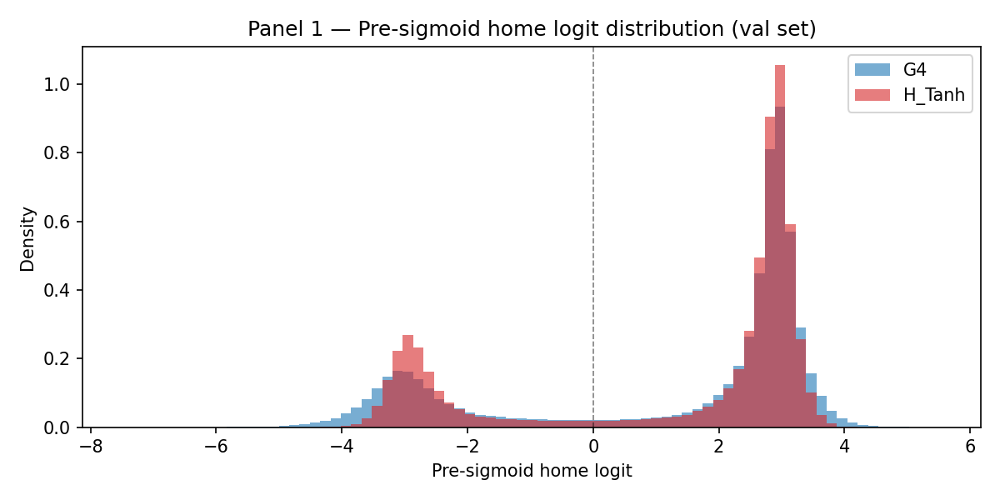
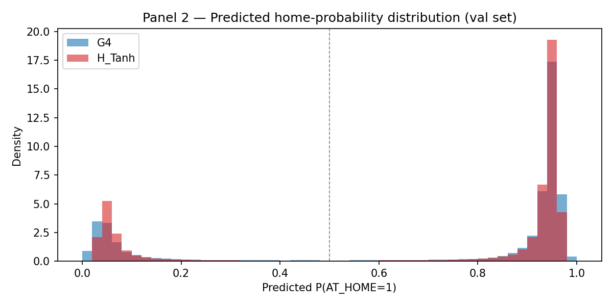
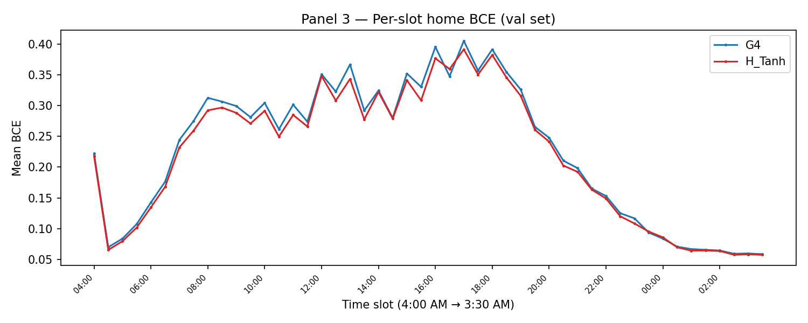
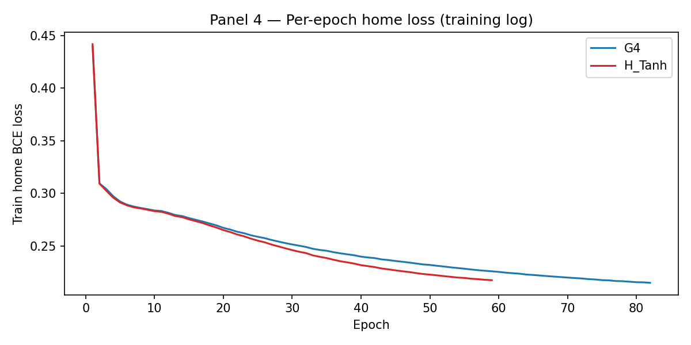

# H-Tier-1.5 — H_Tanh vs G4 diagnostic dump
Date: 2026-05-03

## Hypothesis

H_Tanh wraps `home_head` and `cop_head` as `nn.Sequential(nn.Tanh(), nn.Linear(d_model, n))`.
The Tanh bounds the incoming hidden state to `[−1, 1]`, so the resulting pre-sigmoid logit is
bounded to `[−|w|, +|w|]` where `w` is the Linear weight magnitude.
If `|w|` stayed small during training, predicted probabilities cluster around 0.5–0.7 instead
of G4's bimodal 0.05/0.95 — raising BCE even when the binarized AT_HOME gap holds.

**If CONFIRMED:** fix is a learnable scalar `α` before the Tanh (`α·tanh(h) → Linear`),
recovering G4's confident regime while staying bounded. Cheap, env-var-gated.
**If REFUTED:** composite regression is a deeper conditioning issue; advance to Tier-2 H_Time.

---

## Panel 1 — Pre-sigmoid logit distribution

| Stat | G4 | H_Tanh |
|------|-----|--------|
| min  | -7.472 | -4.505 |
| max  | 5.527 | 4.364 |
| mean | 1.290 | 1.300 |
| std  | 2.527 | 2.439 |

---

## Panel 2 — Predicted probability distribution

| Fraction | G4 | H_Tanh |
|----------|-----|--------|
| p < 0.05 or p > 0.95 (confident) | 0.428 | 0.380 |
| 0.4 < p < 0.7 (mid-range)         | 0.027 | 0.024 |

---

## Panel 3 — Per-slot home BCE

Top-3 slots where H_Tanh penalty exceeds G4 (Δ = H_Tanh − G4):

| Slot | Δ BCE |
|------|-------|
| 25 (16:30) | +0.0116 |
| 40 (00:00) | +0.0021 |
| 39 (23:30) | +0.0016 |

---

## Panel 4 — Per-epoch home loss

- G4 final-epoch home loss: **0.2151**  (82 epochs)
- H_Tanh final-epoch home loss: **0.2175**  (59 epochs)
- Gap (H_Tanh − G4): **+0.0025**

Overall mean val-set BCE gap (H_Tanh − G4):
  G4 = 0.2284  |  H_Tanh = 0.2209  |  Δ = -0.0075

---

## Verdict

> **LEAVE BLANK** — manager fills in after reading the panels:
> BOUNDING ARTEFACT CONFIRMED / REFUTED / INCONCLUSIVE

---

## Recommended next move

> **LEAVE BLANK** — manager fills in.
