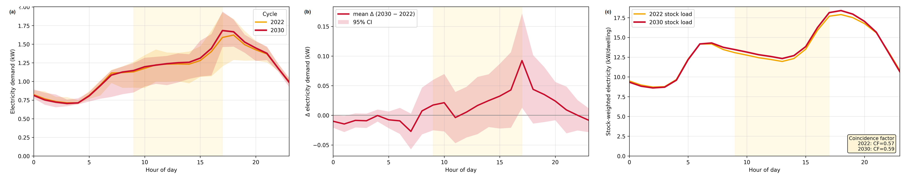
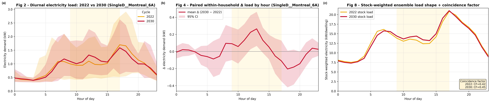
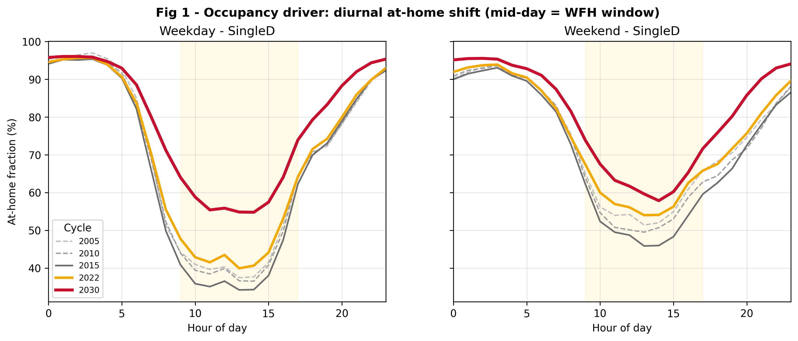
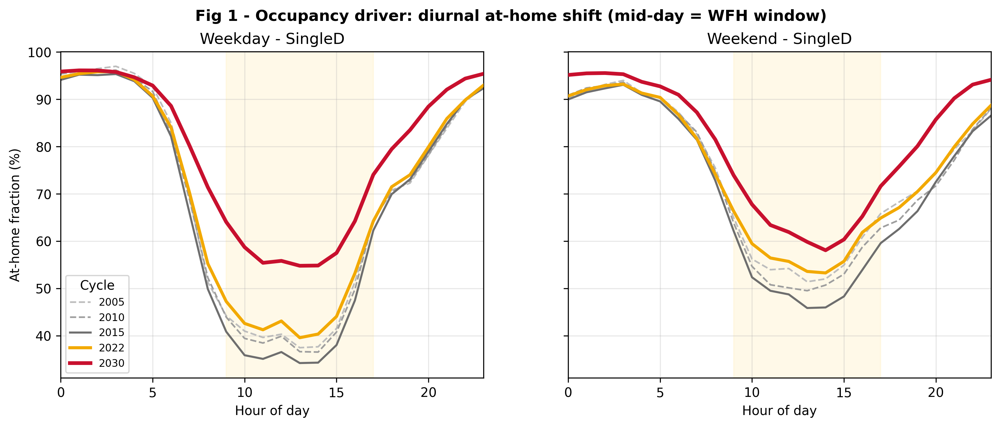

# Figure 6 / Figure 5 — regeneration preview

*2J manuscript · Bug-A closeout · Task #21 · 2026-07-15*

Side-by-side of what's currently in the manuscript against what the located compositing
mechanism produces from the Bug-A-fixed, Phase-5-corrected campaign. Nothing here has been
written to `writing/figures/` — previews only. Interactive version (same content, images
embedded inline): `fig6_fig5_regen_review.html` in this folder, or the published copy at
https://claude.ai/code/artifact/29aaf621-1f8f-4c5e-b710-bd3f05e08b0e

**Status:** Table 5 — applied · Fig S8 / S9 — applied · Step-9 gate — resolved, non-blocking ·
**Fig 6 / Fig 5 — awaiting decision** (see full trail in `../08_09_injection_bug_status.md`).

---

## 1. Figure 6 — stock load shape, 3-panel composite

Rebuilt from the located script (`build_composites.py`, currently only in an agent scratchpad,
not committed to the repo) using the fresh `fig02`/`fig04`/`fig08` outputs of the corrected
campaign. The compositing logic itself is trivial — paste three PNGs side by side, stamp
(a)/(b)/(c) — so the content underneath is what actually changed.

**Current manuscript copy** — 2026-07-13, pre-Bug-A-fix backup
`writing/figures/Figure_06_loadshape.png`

**Preview from corrected campaign** — 2026-07-15, scratchpad preview, not applied
`scratchpad/fig_previews/Figure_06_loadshape_PREVIEW.png`

### ⚠ Found while previewing, not present in the old figure

Each source panel (`fig02`/`fig04`/`fig08`) now carries its own bold plot title ("Fig 2 –
Diurnal electricity load…"). The composite script pastes panels as-is and only adds the small
(a)/(b)/(c) tag — it doesn't strip titles. The old manuscript copy has none, so a straight
rebuild today is visibly more cluttered than what's currently published, even though the
underlying data is correct.

**Options:**
- **Strip the titles before compositing** — closest match to the current published style. A
  few lines added to the compositing step (crop the title band, or re-render fig02/04/08 with
  `ax.set_title("")` for this specific export).
- **Keep the titles** — more self-explanatory as a standalone image, diverges from the
  journal's current figure style.
- **Something else** — different panel order, different representative cell (currently
  `SingleD__Montreal_6A` for panels a/b), etc.

---

## 2. Figure 5 — occupancy driver

Confirmed (byte-hash) to be a straight 1:1 copy of `fig01_occupancy_driver.png` — not a true
composite. That source reads `BEM_Schedules_{year}.csv` (Step 4–7 output), which sits entirely
upstream of Bug A's zone-injection defect, so this panel was never actually wrong — it was
reverted as a blanket precaution on 2026-07-13 along with the other three. Old and new should
look identical; shown for confirmation, not because a change is expected.

**Current manuscript copy** — 2026-07-13, pre-Bug-A-fix backup
`writing/figures/Figure_05_occupancy_driver.png`

**Preview (copy of fresh fig01)** — source unchanged since Bug A doesn't touch it
`scratchpad/fig_previews/Figure_05_occupancy_driver_PREVIEW.png`

---

Nothing in `writing/figures/`, `readySubmission.md`, or `.docx` was modified while building
this preview. Full trail: `2J_docs_occ_nTemp/Step8_docs/08_09_injection_bug_status.md`.
