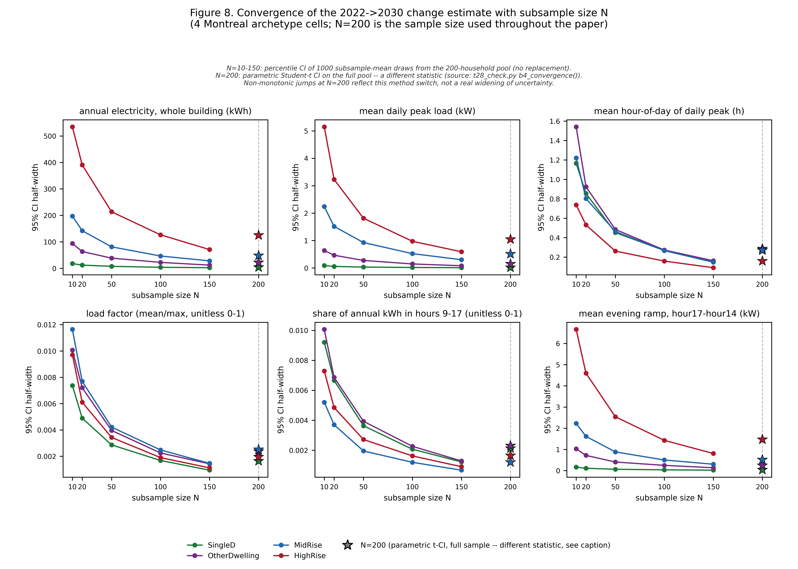
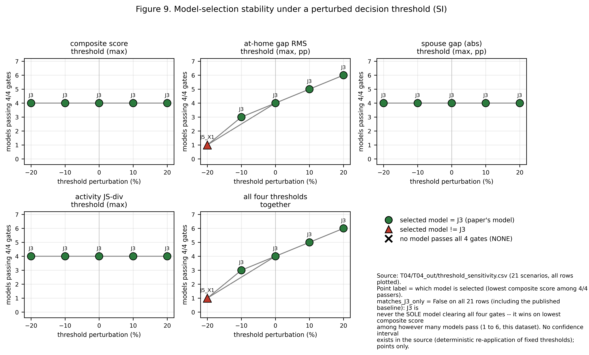

# Supplementary Information

Companion Supplementary Information to the main manuscript. Sections S1 to S11 cover the generative
occupancy model and its selection, diary validation, post-hoc calibration cost, schedule completion
and the donor draw, the sampling-pool caveat, annual schedule assembly, clustering-aware confidence
intervals, and the supplementary figures.

## S1 Generative model architecture

The day-type completion step needs a model that can take one observed diary per respondent and
produce the two missing day-types (the other days of the week not directly reported) for that
respondent, along with simple presence signals for the household. The chosen model has three parts
built on a shared encoder:

- A 6-layer Transformer encoder that reads the respondent's demographic and survey information
  (90 input variables after encoding: age group, sex, marital status, household size, province,
  labour-force variables, survey cycle-year, survey collection mode, school attendance, work-from-home
  status, and commute mode).
- A 6-layer decoder that generates the activity sequence (which of 14 activity types the person is
  doing) one half-hour slot at a time, for all 48 slots of the day.
- A separate, parallel set of small output heads that predict, for the same 48 slots, whether the
  person is at home and who else is present (9 co-presence channels: spouse, children, and so on).
  These heads are cut off from the activity decoder's training signal (a gradient-detach barrier),
  so training the activity sequence does not disturb the at-home/co-presence predictions and vice
  versa.

The model has about 29.25 million parameters and an internal width of 384. This separation of "what
the person is doing" from "whether they are home and with whom" is what let this model pass every
check described below, while several competing designs that mixed the two signals did not.
The architecture is summarized in Table S1 below, with the related activity codebook in Table S2.

**Table S1.** Calibrated generator model card.

*Plain-term gloss.* J3 is this project's internal name for the generator architecture specified in
this card: one shared Transformer encoder feeding an autoregressive activity decoder and a set of
parallel binary heads. It is the third variant of a family of related architecture trials and the one
used to produce the results in this paper; the name itself carries no other meaning. The main text
names the model in plain words ("the generator," "the chosen model") and keeps this label only in this
table and in the glossary (Table S3).

Shipped model: the chosen generator plus the post-hoc marginal raking calibration step described below.
J3 had the lowest composite score among the four candidates that cleared all four selection checks, out
of more than 40 candidates tried (see S2 for the full account, including the three other candidates
that also clear the four published checks).

*Architecture.*

| Component | Specification |
|------------------------|----------------------------------------------------------------------------|
| Encoder | Shared 6-layer Transformer encoder |
| Activity decoder | 6-layer autoregressive decoder, 14-category activity sequence, 48 half-hour slots |
| Binary heads | Parallel non-autoregressive binary heads: at-home flag plus 9 co-presence channels (colleagues masked for 2005/2010); a gradient-detach barrier separates these heads from the activity decoder |
| Model width | 384 |
| Attention heads | 8 |
| Feed-forward width | 1,536 |
| Dropout | 0.1 |
| Parameter count | About 29.25 million |

*Conditioning variables (90 inputs after encoding).*

| Variable group | Variables | Type |
|-------------------|-------------------------------------------------------------|-------------------|
| Demographics | age group, sex, marital status, household size, province, census metropolitan area, official-language knowledge, labour-force activity, hours worked, occupation, class of worker, day-type stratum (weekday, Saturday, Sunday) | 12 categorical variables, one-hot encoded |
| Additional demographics | school attendance, work-from-home status, commute mode | 3 categorical variables, one-hot encoded |
| Continuous | Household income, standardised | 1 continuous variable |
| Binary flags | Survey collection mode (whether the diary was collected by telephone interview or filled in online), income-source flag | 2 binary flags |
| Learned embedding (injected separately, not part of the 90-input vector) | Survey cycle-year | learned, 16-dimension |

Note: the collection-mode flag records the survey's shift from telephone interviews to online
self-completion; the work-from-home flag records the pandemic-era change directly.

*Training.*

| Item | Value |
|-------------------------------------|---------------------------------------------------------------|
| Data split (stratified by cycle and day type) | 70/15/15, giving 44,843 / 9,609 / 9,609 records |
| Nearest-neighbour supervision | 5 demographic neighbours; neighbour-disagreement floor 0.1888 |
| Learning rate | 1e-4, 2,000-step warm-up then cosine decay |
| Batch size | 256 |
| Early stopping | 10 epochs' patience |
| Loss weights | at-home weight 0.9, activity weight 0.5, co-presence weight 0.5 |
| Label smoothing | 0.05 |

*Selection-check results for the chosen model.*

| Check | Threshold | Chosen model's result | Result |
|---------------------------------|----------------------------------|-------------------|--------------|
| Activity-distribution distance | 0.05 or below | 0.0191 | PASS |
| At-home error | 5.3 percentage points or below | 4.57 pp | PASS |
| Worst co-presence channel gap | 5.0 percentage points or below | About 2.03 pp | PASS |
| Composite score | Below 1.045 | 0.6355 | PASS |

Two of the four thresholds equal an earlier baseline model's own scores, one threshold has no stated
independent basis, and the co-presence threshold was tightened from 10 to 5 percentage points during
development with no reason recorded (S2 gives the full account of the threshold provenance).

Two notable candidates that did not clear the checks: one masked-discrete-diffusion design scored the
best composite of the whole search (0.559) but failed two of the four checks (at-home error 7.81 pp;
activity-distance 0.0529); the best-training-loss cross-attention decoders broke down at generation
time, with co-presence errors of 20 or more percentage points.

*Post-hoc calibration.* A per-(cycle x day-type x slot) marginal raking step is applied after
inference; it makes each stratum's at-home marginal match its target exactly. The cost is that about
1.8 to 2.1 percent of slot-records end up with an activity label that no longer matches its own at-home
flag; this is harmless to the building energy model, which reads only the at-home flag. Before raking,
the raw per-cell at-home gap reached 15.37 percentage points.

*Inference.* Activities are sampled at temperature 0.8; the binary heads are thresholded at 0.5; two
consistency rules are applied afterward (sleep at night implies at home; work implies away when the
work-from-home flag is not set).

*Output.* About 192,183 diary-days (roughly 128,000 synthesized plus 64,000 observed).

**Table S2.** Activity codebook and co-presence columns.

*Activity categories.* Every diary slot is assigned one of 14 activity categories: work (paid work and
telework), household work and maintenance, caregiving, purchasing, sleep, eating and drinking, personal
care, education, socializing, passive leisure, active leisure, community or volunteer activity, travel,
and miscellaneous. The number of raw survey activity codes mapped onto this 14-category scheme differs
by survey cycle (182 raw codes in 2005, 264 in 2010, 64 in 2015, 121 in 2022), with zero disambiguation
conflicts across all four cycles; the underlying per-code crosswalk is not reproduced here.

*Co-presence columns.* Nine unified co-presence columns record who else is present with the respondent:
alone, spouse or partner, children under 15, parents or parents-in-law, other household members 15 or
over, other household members, friends, other persons, and work colleagues. These nine columns are
built from ten raw survey columns (colleagues is not collected in 2005 or 2010, so it is entirely
missing for those two cycles). Per-cycle non-missing rates are about 20 percent in 2005, 19.3 percent
in 2010, 0.1 percent in 2015 and 6.8 percent in 2022.

**Table S3.** Glossary of the project's own internal labels, in plain English. Most of the project's own
working labels were replaced outright by plain English everywhere they appear in this paper and do not
appear anywhere below on purpose; a term earns a row here only if a reader will still actually meet it,
in the main text or in a supplementary table.

| Term as it appears | Plain-English meaning | Where it is used in this paper |
|----------|-----------------------------------------------------------------------------|---------------|
| J3 | J3 is the project's own internal nickname for the specific generator design that produced the results reported here; the number 3 only means it was the third design tried in a family of related designs, and it carries no other meaning. The main text calls this model "the generator" or "the chosen model" and keeps the nickname only in the supplementary model-card table. | SI Table S1 (generator model card). |
| gate (also "hard gate") | A gate is a numeric pass/fail check that the study fixed in advance: a result either clears the fixed line or it does not, with no partial credit. | Supplementary scorecard tables. |
| PASS / WARN / INFO / FAIL | These four words are verdict labels used only in the supplementary scorecards. PASS means the check cleared its line; FAIL means it did not; WARN flags a minor issue that was not serious enough to fail the check; INFO is shown for background only and carries no pass/fail judgement at all. | Supplementary scorecard tables. |
| held-out-year test (also called "True-Future-Test" in some project records) | Testing the model on an entire survey year it never saw at all during training, the strictest of the checks used in this paper because nothing about that year was available while the model was being built. | SI Section S3; the main text's model-selection discussion. |
| Tier 1 / Tier 2 / Tier 3 / Tier 4 | These numbered tiers describe a four-step fallback search that gives each simulated person a matching real time-use diary: the search first tries an exact demographic match, and only moves to a looser match, one fixed step at a time, when no match exists at the stricter level. The main text describes this same fallback as a plain, numbered list of match rules, without the tier numbers. | Supplementary match-coverage tables. |
| FailSafe | FailSafe is the name of the last, loosest step in that same four-step matching search, used only when every closer match has already failed. The record shows this last-resort step was never actually triggered: every simulated person was matched at one of the three closer steps. | Supplementary match-coverage tables. |
| occACT | occACT is the internal name of the data column holding the activity code assigned to each half-hour diary slot (for example sleeping, working, or eating). | Supplementary harmonisation tables. |
| Step-8 / Step-9 | These are internal numbers for two stages of the project's own processing pipeline: Step-8 is the batch of building-energy simulations, and Step-9 is the stage that turns each diary into device-power and lighting schedules. The main text names the action directly rather than the step number. | Supplementary scorecards and deviation write-ups. |
| Collection-mode flag | This survey-design flag records whether a respondent's diary was collected by a telephone interviewer or filled in online by the respondent. | SI Table S1 (model conditioning variables). |
| Day-type-stratum flag | This flag records which of the three day types, a weekday, a Saturday, or a Sunday, a given diary belongs to. | SI Table S1 (model conditioning variables) and S6. |
| Structural-break check | The internal name of the check that measures how much each at-home percentage changed from one survey cycle to the next, used to check for the pandemic-era jump in time spent at home. | Supplementary scorecard tables. |
| C-VAE | C-VAE stands for conditional variational autoencoder, a type of generative model used in the authors' own earlier published work. It is kept here as a named point of comparison against the model chosen for this paper, not as a label coined for this paper. | Main text, defined at first use, then referenced again when the model search is discussed. |

## S2 Model selection search

**How many candidates.** Over 40 candidate model designs were tried in a staged search: first
trained on a small 2% slice of the data, then 20%, then the full data, so that clearly weak designs
could be dropped early without spending full training time on them. The candidates covered several
different families: simple statistical (Markov chain) models, autoregressive sequence models,
variational autoencoders, GAN-style models, cross-attention architectures, and masked
discrete-diffusion models.

**The four checks used to keep or reject a candidate.** A candidate had to pass all four of these to
be considered:
- How different the generated mix of activities is from the real mix (a distributional distance
  measure, "activity JS", capped at 0.05).
- How far off the generated at-home percentage is from observed data (an error measure in
  percentage points, capped at 5.3 pp).
- How far off the worst single co-presence channel is (capped at 5.0 percentage points).
- A single combined score blending several of the above (capped just under 1.045).

**Where the four checks came from.** All four thresholds were inherited from an earlier baseline
model run rather than derived independently. Two of the four (the combined-score cap of 1.045 and
the at-home error cap of 5.3 pp) are set exactly equal to that earlier baseline model's own observed
scores, not to an independent target. The activity-distance cap (0.05) is asserted alongside the
other three with no independent justification found in any project document. The co-presence cap was
tightened during the same revision from 10 percentage points to 5 percentage points, with no reason
recorded for the change. None of the four thresholds has a documented independent basis (for example
a survey sampling-error floor); this is reported here as a limitation of the selection procedure, not
as an error in the chosen model. See the number trace table for exact citations.

**Which candidates passed.** The project's own working notes describe the chosen model as the only design to pass all four checks. A re-check of the four published thresholds against
the individually reported scores of every candidate shows this is not quite right: three other
candidates (each a variant of the chosen model with parts of its head design changed) also clear all four
published thresholds when the thresholds are applied literally. The working notes had actually scored
those variants against a stricter, unpublished bar (beating the chosen model's own combined score, plus an
additional check not among the published four), which is why they read as failing in the notes even
though they clear the published thresholds. This does not change which model was chosen: among the
four candidates that pass the four published checks, the chosen model still has the best (lowest)
combined score, so the choice stands. What changes is only the sentence describing why: the model is
described as "the candidate with the best combined score among those that cleared all four checks,"
not as "the only candidate to clear all four checks."

**Why the chosen model was picked.** Passing was necessary but not sufficient among the four
qualifying candidates; the chosen model was picked because it had the lowest (best) combined score among them.
Some notable design choices did not clear the bar: one masked-diffusion candidate produced the single
best combined score of the entire search, but failed the activity-distance and at-home checks (its
at-home error was 7.81 percentage points, well above the 5.3 pp cap), showing that the combined score
alone is not a reliable stand-in for the four individual checks. Several cross-attention designs
achieved the best training performance of any family but broke down when asked to generate new
diaries, producing co-presence errors of 19 to 23 percentage points, nearly four times the 5.0 pp
cap; this shows that training performance does not guarantee that a generated diary will look right
when actually sampled.

**Threshold-sensitivity result.** A follow-up check moved each of the four thresholds up and down by
10% and 20%, one at a time and all four together, to see whether small changes to the checks would
have changed which model is picked. Across every one of the 21 tested variations, the same four
candidates (the chosen model and the three variants above) pass together except when the at-home-error check is
tightened by 20% (either alone or together with the other three), in which case only one other
variant still passes and would be selected instead. In every scenario where the chosen model is still
eligible, it remains the one selected. The selection is therefore not sensitive to small changes in
three of the four thresholds, and is sensitive to the fourth (the at-home-error check) only at the
most aggressive 20% tightening tested.

## S3 Diary validation on a held-out year

Two related checks assess whether the model's generated diaries for the most recent survey year
(2022) look like real 2022 behaviour.

**The ceiling.** Before either check was run, the project set one distributional distance ceiling of
0.10 for every day type: weekday, Saturday and Sunday. That is the ceiling we report against
throughout, for both checks.

**Held-out-year test.** The model, trained only through the second-most-recent survey year (2015),
was asked to generate diaries for the entirely unseen 2022 year. On weekdays the generated diaries
scored 0.0619, within the 0.10 ceiling.

**Backcast reconstruction.** Separately, the fully trained model (which has now seen 2022 data) was
asked to reconstruct 2022 diaries using the real 2022 respondent information. On weekdays this
scored 0.0630, also within the 0.10 ceiling.

**Weekends do not meet the ceiling.** On weekends both checks score well above 0.10: 0.1817
(Saturday) and 0.1843 (Sunday) in the held-out-year test, and 0.1637 and 0.1618 in the backcast. We
state this as a result, not as a pass. Two further points belong with it.

First, the ceiling was widened to 0.20 for weekends after these values were seen, and the weekend
results were then recorded as passing. We do not use the widened ceiling anywhere in this paper, and
no weekend result should be read as having met a pre-registered ceiling.

Second, the weekend gap is concentrated in one identifiable part of the evaluation set. That set
mixes two kinds of rows: diaries genuinely observed on that day type, and diaries the model had to
synthesize because the respondent reported a different day type. Scored on the genuinely observed
2022 weekend diaries alone, the distance is 0.036 (Saturday) and 0.040 (Sunday), well inside the
0.10 ceiling; the synthesized rows sit 0.138 to 0.175 from the observed distribution. Weekend
diaries are fewer and weekend behaviour is more varied, and raising the weekend training weight
twice moved the score by about 0.005, so the gap does not appear to be an optimisation shortfall.
We therefore treat the synthesized weekend days as a stated limitation of the diary completion step,
and weekend results are carried through the rest of the paper with that limitation attached.

## S4 Post-hoc calibration (raking) cost

After the model generates diaries, a calibration step ("raking") is applied that nudges the
generated at-home percentages, slot by slot, to match their target values exactly. This step is
needed because the raw generated output, while close, is not perfectly calibrated to the target
at-home percentages. The cost of this adjustment is that roughly 1.8-2.1% of individual
slot-records end up with an activity label that no longer matches its own at-home flag (for example,
a slot still labelled "away" activity after being nudged to "at home"). This is treated as harmless
for the building energy model, because the energy model reads only the at-home flag to decide
occupancy; it does not read the activity label for that purpose.

## S5 From one diary day to a full year of hourly values

**Two separate reductions turn one diary day into part of a year-long hourly schedule.** The
underlying diary is recorded in 48 half-hour slots per person per day. The first reduction folds each
person's day down to 24 hourly values by averaging each pair of half-hour slots (hour h takes the
average of slots 2h and 2h+1), then averages across every member of the household to get one
occupancy fraction and one metabolic rate per household per hour. Because the survey diary starts its
clock at 4 a.m. rather than midnight, the 24 hourly values are then shifted by 4 hours so that hour 0
lines up with real midnight, matching the weather file's clock. The full history of why that shift
matters (an early version of the pipeline injected schedules 4 hours early before the shift was
added) belongs to a different part of the supplementary material and is not repeated here; the shift
itself, applied at this stage, is confirmed at the source cited below.

The second reduction is the one this part is about: each household ends up with only two such
24-hour profiles, a Weekday profile and a Weekend profile, not seven separate days. How a household
gets both profiles when the survey only observed one day (the donor draw) is section S7. How those
two 24-hour profiles become 8,760 hourly values covering a full simulated year is section S9.

## S6 Day-type strata: why weekday, Saturday and Sunday are handled separately

Each survey respondent reports a diary for exactly one day, and that day is recorded as one of three
strata: a weekday, a Saturday, or a Sunday. These three are kept separate through the earlier stages
of the pipeline (the generative model, the raking step) because at-home behaviour genuinely differs
across all three, not just between weekdays and weekends. The size of that difference in the rebuilt
2022 stock is a daily at-home share of 74.1 percent on weekdays, 76.0 percent on Saturdays and 78.9 percent
on Sundays (per person, unweighted, averaged over the 48 half-hour slots of the day).

At the point where the schedule is handed to the building energy model, the three strata are reduced
to two: Saturday and Sunday are pooled into a single Weekend profile, and only Weekday and Weekend
profiles are carried forward. This is a deliberate simplification, not an oversight, and it has a
known cost: pooling loses the calibrated difference between Saturday and Sunday entirely, in both
years. The size of the difference that is lost is 2.9 percentage points in 2022 (Saturday 76.0 percent,
Sunday 78.9 percent) and 2.3 points in the 2030 main scenario (Saturday 77.9 percent, Sunday 80.2
percent), in the same unit as above; in both years people are at home more on Sunday. We state this
as a limitation of the two-day-type design,
not as an error, because the building energy model consumes only a Weekday/Weekend schedule and
carrying a third day type through to that stage would require changing the building energy model
itself, not just this pipeline.

## S7 The donor pool and the draw rule for completing a missing day type

**What problem this step solves.** Because each respondent reports only one day, most households
have a diary for only one of the two profiles a schedule needs (Weekday or Weekend), not both. Before
a household's schedule can be built, the missing profile has to be filled in from somewhere. This is
a separate, later step from the demographic donor-matching that assigns every household its first
diary (covered in the main text): that earlier step decides which diary a household starts with; this
step decides what happens to the day type that diary does not cover.

**The donor pool.** The pool a missing day type is filled from is simple: every person-record in the
same year's data that already carries the needed day type. A household missing its Weekend profile
draws from every record tagged Saturday or Sunday (the two are pooled into one donor pool, matching
the Weekend target); a household missing its Weekday profile draws from every record tagged weekday.
Unlike the earlier demographic donor-matching step, this donor pool is not narrowed by age, sex,
household size or any other demographic key: any record of the right day type is eligible. Only the
recipient household's own dwelling and household attributes (household size, dwelling type, province
and so on) are kept; the donor supplies only the activity sequence and at-home flags for the missing
day. For the 2030 scenario year, the donor pool is the already-assembled 2030 file itself, so a
donor's occupancy still reflects the 2030 scenario rather than 2022 behaviour.

**The draw rule.** The draw is made once per household member who needs the missing day type, not
once per household: each member independently draws its own donor row from the pool described above.
This means two members of the same household missing the same day type can end up with donors from
two different donor households. The draw is made with a fixed random-number seed (seed 42), so given
the same input file the same recipient always receives the same donor row; running the completion
step twice on the same input produces byte-identical output. A direct consequence of the per-member
draw is that the completed day's within-household presence pattern (who is home at the same time as
whom) is synthetic for imputed days, not observed. This is treated as harmless to the building energy
model specifically because that model reads only each household's overall occupancy fraction and
metabolic rate for each hour, not which individual members are home together.

**Method history: why donor-draw and not copy-day.** An earlier version of this step filled a missing
day by copying the household's own observed day onto the missing slot (a Weekday-only household's
Saturday and Sunday would simply repeat its Weekday diary). This was found to bias the calibrated
weekend average downward by 2.76 percentage points, because a household's own weekday diary carries
weekday behaviour into a weekend slot and weekend at-home rates are the higher of the two. That
2.76-point figure is recorded in the completion step's own code as the reason the method was replaced;
the supporting per-stratum rates behind it were measured on an earlier build of the person file and are
therefore not quoted here. The donor-draw method
described above was adopted specifically to remove this bias, and it does: because it draws a genuine
weekend (or weekday) diary rather than repeating the household's own day, the calibrated weekend
marginal is preserved rather than diluted.

**Historic years use the same mechanism, restricted to their own year.** The 2005, 2010 and 2015
schedule files are built by a separate copy of this same completion step, applied only after each
cycle's own diaries have already been assembled onto the analytical household frame. The donor pool
for a historic year is drawn only from that year's own diary pool; there is no path in the code by
which a 2015 household's missing day type could be filled from a 2005 or 2022 record. This detail is
carried from an earlier reading task on the historic files, cited in the trace table, and was not
re-derived from the raw code again in this task beyond the direct check noted there.

## S8 The sampling-pool caveat: a separate, later draw for the building simulation

**This is a third and different draw, not the donor draw above.** After the schedule files are
finished, 50 households are drawn (without repeats, unless a group has fewer than 50 households, in
which case draws with repeats are used) for each city-and-building-type group used in the building
simulation, so that the same 50 households can be run through the simulation for every year on the
same building and weather file. This household sample is unrelated to the day-type donor draw of
S7: it happens afterward, on the finished schedule files, and it decides which households are
simulated, not what those households' schedules contain.

**The sampling pool is not simply "every household in the file."** Before the 50-household sample is
drawn, the finished schedule file is passed through a sanity check that looks at each household's
24-hour Weekday and Weekend patterns and drops any household whose pattern looks physically
implausible. The two rules that do the work are a minimum of two occupied hours in a day type, and a
limit on how many times presence may switch on and off within the day. Only households that pass
this check are eligible to be sampled. This means the sampling pool depends on the exact numeric
content of the schedule file, not just on which households are listed in it.

**The two-hour rule interacts with the reversion scenarios, and the direction matters.** The rule
removes households shown as occupied for less than two hours in a day type, and the reversion
scenarios are precisely the ones in which time at home falls. It therefore removes, preferentially,
the households that reverted most, and what remains leans very slightly toward households that
reverted least. The effect was measured on all 144,465 households rather than argued: the ordinary
2030 file already excludes 983 households under these rules; the scenario files exclude a few more,
by 27 in the half-reversion scenario, 70 in one full-reversion arm and 161 in the other. The largest
excess is therefore 161 households, or 0.11 % of the stock, which bounds the arithmetically possible
shift in the national at-home share at 0.11 percentage points, inside the 0.5-point tolerance set
in advance, and the realised effect is a fraction of that. It is reported here rather than treated
as rounding, because it is several times larger than the 0.005 to 0.022 percentage-point margins by
which the scenarios are shown to reach their design targets. The two-hour rule was not relaxed.

**Why this matters for comparing the rebuilt schedules to the previously published ones.** The
schedule files rebuilt during this revision are numerically close to, but not byte-identical to, the
previously published files. Because the sanity check looks at the numbers, it can drop a slightly
different set of households from the rebuilt file than it dropped from the published file, even
though both files cover the same 144,465 households overall. In one audited group (single-detached
houses in the Quebec climate zone, city of Montreal), the sanity check drops 103 of 16,430 candidate
households from the rebuilt 2022 file and 104 from the rebuilt 2030 file, leaving a paired pool (only
households present and passing the check in both years) of 16,326; the same check applied to the
previously published files leaves a paired pool of 16,208. The two pools differ by 320 households
(the number of households in one pool but not the other), so the same fixed seed draws a different
50-household sample from each.

**What this does and does not affect.** It does not mean the sampling code is wrong: run on the
previously published files, the exact same code reproduces the exact previously published pair of
sampled households in that group; run on the rebuilt files, it reproduces its own new pair every time
it is repeated. Both are correct, deterministic draws from their respective pools; the pools
themselves are simply not identical, because the sanity check reads a file whose numbers changed
slightly during the rebuild. It also does not affect the donor-draw of S7, a separate and earlier
step, and it does not change the total 144,465-household frame the schedule files are built from in
the first place. What it does mean is that a before/after comparison built on the rebuilt files is
not using the exact same 50 households, in every group, as the comparison in the previously published
paper; the two samples overlap substantially but are not identical. We report this as a limitation of
comparing a rebuilt dataset to a previously published one, not as an error in either sampling run, and
the paper states plainly that the comparison is not household-paired across the two versions of the
stock.

The same check was then counted in every city and building type group. Kelowna and Vancouver share
one British Columbia household pool, so the stock holds 134,262 distinct candidate households. The check
drops 918 of them (0.68 percent) from the rebuilt 2022 file and 921 (0.69 percent) from the rebuilt 2030
file, against 797 (0.59 percent) and 1,043 (0.78 percent) from the previously published files. This
count reproduces the Montreal single-detached figures above exactly (103 and 104 of 16,430).

## S9 Assembly to the full year and the reduction to hourly resolution

Each household's finished Weekday and Weekend 24-hour profiles are written into the building energy
model as one schedule object per channel (occupancy, metabolic heat gain, and the equipment and
lighting channels added by the end-use layer), each carrying a single calendar block that runs from
January 1 through December 31 with two named sub-patterns: one for weekdays, one for weekends. The
building energy model's own calendar, not a separate step in this pipeline, is what expands those two
24-hour patterns into the 8,760 hourly values the simulation actually runs on: for each of the year's
calendar days it looks up whether that day is a weekday or a weekend day by the ordinary
Monday-through-Sunday calendar and repeats the matching 24-hour pattern for that day. No holidays are
distinguished, because the weather files used carry none, and the two artificial sizing days used to
size the building's heating and cooling equipment are forced onto the weekday pattern, so equipment
sizing is based on the busier of the two profiles rather than a fixed separate assumption.

The schedule is never handed to the building energy model at its original 30-minute diary resolution;
only the hourly reduction from S5 is presented at this stage. This means the finest temporal detail
the building simulation ever sees for occupancy, internal heat gain, plug loads or lighting is one
value per hour, for one of two day types per household, expanded to a full year by the calendar rule
above.

## S10 Does household clustering change the reported uncertainty?

Section 2.11's paired-difference interval (Eq. 16) pools every household's 2022-to-2030 change
together and treats each one as an independent observation. Households sharing a city or an
archetype are not independent in principle, so a genuine cluster bootstrap was run for comparison:
the 24 (archetype, city) cells are resampled with replacement (24 drawn from 24, repeats allowed),
each drawn cell's own paired household deltas are kept intact (no resampling within a cell, since
the cell is itself the resampling unit), and the pooled mean is recomputed over 10,000 replicates
(fixed seed 12345) to build a percentile interval.

Run on the rebuilt 2022/2030 paired simulation data (all 24 cells x 50 households, 2,400 rows, no
missing or short series), the two methods give:

**Table S4.** Clustering-aware versus plain paired-difference confidence intervals for midday share and load factor.

| Metric | Method | Point | 95% interval | Width | Change from plain interval |
|-------------|-------------------------------|-----------|--------------------|-----------|--------------|
| Midday share | Plain pooled (main text, Eq. 16) | 0.00732 | [0.00645, 0.00819] | 0.00174 | n/a |
| Midday share | Genuine cell-cluster bootstrap | 0.00732 | [0.00616, 0.00859] | 0.00243 | **39.8% wider** |
| Load factor | Plain pooled (main text, Eq. 16) | 0.00494 | [0.00412, 0.00577] | 0.00165 | n/a |
| Load factor | Genuine cell-cluster bootstrap | 0.00494 | [0.00413, 0.00574] | 0.00161 | 2.3% narrower |

(All values are raw fractions, i.e. multiply by 100 for percentage points.)

**Plain statement of what this means.** For midday share, accounting for clustering by city and
archetype widens the honest uncertainty band by about two-fifths (a real, non-trivial effect of
non-independence), but the interval still excludes zero under either method, so the conclusion that
the 2022-to-2030 change is separable from zero for this metric is unchanged. For load factor,
clustering makes almost no difference (2.3% narrower, i.e. within noise of the same order as the
Monte Carlo bootstrap's own replicate-to-replicate variation); the plain pooled interval is adequate
for this metric on its own. Neither metric's interval crosses zero either way. **This SI section
therefore does not overturn any conclusion reached with the plain interval, but it shows the two
metrics behave differently under clustering, so the plain interval alone understates uncertainty for
midday share specifically.**

## S11 Supplementary figures

**Figure S1.** Confidence-interval half-width against sample size, for the 2022-to-2030 change in six
load-shape and energy metrics (annual electricity, mean daily peak demand, mean peak hour, load factor,
midday share, evening ramp), each in its own panel and its own unit (kWh, kW, hour-of-day, or unitless
fraction as applicable). Each panel shows four lines, one per single-detached, other-dwelling,
mid-rise and high-rise archetype cell, all in Montreal (climate zone 6A); this check does not cover
the other five cities used elsewhere in this paper. Sample sizes tested are N = 10, 20, 50, 100, 150 and
200. For N below 200, the half-width is the 2.5th-to-97.5th-percentile spread of 1,000 bootstrap
subsample-mean draws taken from the same 200-household set; at N = 200 it switches to a parametric 95%
confidence interval on the real full 200-household sample, a different statistic, marked with a star
and a dashed guide line rather than joined by the same line as the smaller sample sizes. In all 24 of
24 cell-by-metric combinations the plotted half-width is larger at N = 200 than at N = 150, which
reflects this change of statistic, not an estimate that does not settle with more households.

**Figure S2.** Stability of model selection under a perturbed decision threshold. The underlying data
covers 21 scenarios: one baseline scenario at the published thresholds, plus four threshold families
(the activity-distribution cap, the at-home error cap, the worst co-presence gap cap, and the composite
score cap), each shifted by minus 20%, minus 10%, plus 10% and plus 20% one at a time, plus a fifth
family in which all four thresholds are shifted together at the same four levels. Each of the five
panels shows, for one threshold family, the number of candidate models that clear all four checks at
that scenario's thresholds (y-axis) against the size of the perturbation (x-axis); the marker for each
point is coloured by which candidate has the best (lowest) composite score among the models that pass:
green for the model chosen for this paper, red for a different candidate. At the published (baseline)
thresholds, four candidate models clear all four checks at once, and the chosen model is selected only
because it has the lowest composite score among them, not because it is the sole model that passes.
The chosen model remains selected in 19 of the 21 scenarios; it is replaced by a different candidate in
the remaining 2 (a 20% tightening of the at-home error threshold, applied alone or together with the
other three), where only one candidate still clears all four checks.
