# Abstract

Static, deterministic occupancy schedules in residential building energy simulation miss the timing of
demand, not only its annual total. Occupant behaviour became non-stationary through the COVID-19
pandemic. Future load shapes need an explicit, stated persistence assumption, not a single
prediction. This study builds a household-level, survey-based occupancy model for the Canadian housing
stock. Checked on a held-out survey year, the model drives paired, stock-scale building energy
simulation across several dwelling archetypes and climate zones. The study compares 2022 against four
stated 2030 scenarios. Three set how much of the pandemic shift persists: main persistence, partial
persistence and full reversion. The fourth is a standardized-reversion check. The model is also
compared with a simpler average-profile method on the same households. The simulated load shape is
checked, not validated, against a year of measured Toronto and Ontario electricity data. In 2022, the
weekday at-home rate sits 4.73 percentage points above its 2005-to-2015 trend. Under the main 2030
scenario, annual electricity is nearly flat, rising 0.12 percent. Midday share rises 0.73 and load
factor 0.49 percentage points. Both changes and the scenario spread are real. Full reversion falls 0.12
percent; the standardized-reversion check falls 0.44 percent. Partial persistence is indistinguishable
from zero. The average-profile method shifts one cell's annual total by about 9 percent. Yet it
collapses household-to-household peak-timing diversity almost to zero; only the household-level model
preserves it. For grid planning, this shift is mainly a timing question, not a sizing one.

# Highlights

- Survey-based household occupancy model runs from 2005 to 2030 across Canadian homes.
- For grid planning, work from home is mainly a timing question, not a sizing one.
- Annual electricity rises only 0.12 percent, but midday share and load factor rise.
- Three 2030 scenarios and a reversion check test how much of the pandemic shift lasts.
- Our household model keeps the peak-timing spread that average schedules erase.

# Keywords

Residential occupancy modelling; time-use survey data; stock-scale building energy simulation;
work-from-home scenarios; residential load shape; load factor; Canadian housing stock.

# 1. Introduction

## 1.1 The performance gap and static occupancy schedules

The performance gap is the persistent gap between predicted and measured building energy use. It
remains a central credibility problem for building performance simulation (de Wilde 2014). Occupant
behaviour is now the largest identified unexplained driver of this gap (Yan et al. 2015; Hong et al.
2017). IEA EBC Annex 66 and its successor Annex 79 took up this problem directly (Yan et al. 2017;
O'Brien et al. 2020). Routine practice still relies on static, deterministic occupancy schedules drawn
from reference standards. These schedules fit residential buildings poorly. In homes, daily life follows
individual routines rather than regulated operation (Mahdavi et al. 2021). Fixed schedules miss
day-to-day behavioural variability (Wilke, Haldi and Robinson 2011; Elsayed et al. 2023).
Survey-derived occupancy profiles differ from standard schedules by up to 41 percent at individual
hours. This is a timing discrepancy, not an annual-energy one (Mitra et al. 2020). Static schedules
therefore carry a timing error that an annual-total comparison cannot reveal.

Timing matters because a home's daily load shape counts, not only its yearly sum. The load shape sets
the home's contribution to grid peak demand, the evening ramp and demand-response suitability (Denholm
et al. 2015). This study uses 2030 as its scenario horizon for two reasons. First, 2030 sits beyond the
latest available survey data. It therefore requires an explicit assumption about how far the
pandemic-era change has settled or receded. Second, 2030 is a commonly used planning horizon (IEA
2021). The Canadian time-use survey runs roughly every five years, and no cycle after 2022 has been
announced (Statistics Canada 2024a).

## 1.2 Two research tracks and the gap they leave open

Two research traditions address occupancy in building energy modelling, and they rarely meet. The first
builds high-fidelity stochastic occupant models. These models are applied mostly to single buildings
and already-elapsed periods (Richardson, Thomson and Infield 2008; Widén and Wäckelgård 2010; Wilke et
al. 2013; Aerts et al. 2014). This track includes a growing Canadian strand (Armstrong et al. 2009;
Osman and Ouf 2021; Osman et al. 2023; Ferreira et al. 2024). The authors' own prior work also belongs
to this track. It used a conditional variational autoencoder, a generative model referred to here as a
C-VAE, paired with a cluster-based scheme. This prior C-VAE line synthesized longitudinally consistent
Canadian residential occupancy schedules from successive General Social Survey cycles. It then carried
these schedules into building energy simulation. The line spans a journal treatment across several
Montreal neighbourhood-unit typologies (companion manuscript, under review). It also includes a
companion conference study across three climate-zone cities (Iseri and Hachem-Vermette 2026). A related
population-statistics and machine-learning occupancy framework completes it (Iseri, Dino and Kalkan
2026).

The second track runs stock-scale and urban-scale energy engines across thousands of dwellings.
However, it feeds them simplified, single-period schedules (Reinhart and Cerezo Davila 2016). Chen et
al. (2022)'s paired stock-scale design is the closest precedent to this study.

Table A.1 in Appendix A scores nine external studies and the authors' own prior work against six
framework dimensions (C1 to C6). Each dimension is scored present, absent or partial. The score follows
a written criterion, not an unstated judgement call.

Chen et al. (2022) is the strongest external precedent and shares five of the six dimensions. It lacks
only C3. It evaluates an already-elapsed period rather than carrying occupancy through the pandemic
break to a future year. That is the one axis of difference, and no wider novelty claim is made.

The authors' own prior line scores present on C1 and C2, since it uses time-series, calibrated
occupancy. It scores partial on stock-scale and load-shape focus, with fewer typologies and only a
first look at peak timing. It scores absent on C3 and C4, with a same-period synthetic year and
presence-filtered end uses. The advance over that line lies in the pipeline stages set out in Section
1.4, not in one more column.

## 1.3 Occupant behaviour is non-stationary

The assumption that occupant behaviour is stationary did not hold through the COVID-19 pandemic. Work
from home rose sharply, to roughly four times its pre-pandemic level. It reached about 20 percent of
full workdays afterward, against 5 percent before (Barrero, Bloom and Davis 2021). Weekday electricity
profiles show a change associated with the pandemic and the shift to more work from home. They lose
their bimodal commuting peaks and take on a weekend-like weekday shape (Abdeen et al. 2021). A
weather-adjusted increase of about 7.9 percent in electricity use is associated with the pandemic
period (Cicala 2023). Occupancy-prediction models trained only on pre-pandemic data degrade sharply once
this period is crossed (Motuzienė et al. 2022). A projection anchored before the pandemic would inherit
this problem.

The evidence available to this study does not settle what happens to work from home after 2022. The
study therefore does not assume that the pandemic-era at-home level holds unchanged to 2030. Instead,
it treats the share of that shift retained in 2030 as an explicit, stated assumption. This share is
tested across more than one value, not given as a single predicted number (Barrero, Bloom and Davis
2023; Statistics Canada 2024b). A projection anchored before the pandemic would instead carry the
structural break as a systematic bias. It would misjudge not only how much energy is used, but also
when.

## 1.4 Aim and contributions of the present study

This paper asks whether, and how, occupancy-driven change reshapes the residential load curve at stock
scale, under explicit work-from-home scenarios carried to 2030. The prior C-VAE line showed that
survey-grounded, time-series occupancy can be built for Canadian building energy models. It also showed
that this occupancy moves predicted heating and cooling demand relative to default assumptions, with a
first look at diurnal and peak timing. This paper does not re-claim those results. The prior line asked
how much: it compared period-specific occupancy datasets against one default schedule in one climate
zone. This paper asks when: it compares survey cycles against each other within the same households,
rather than default against cycle. Its primary result is the diurnal load shape, not annual totals. The paper makes three scientific contributions. First, it uses a
generative occupancy model chosen from a broader architecture search (over 40 architectures searched).
The search applied distributional checks that the prior C-VAE line did not apply, and the chosen model
preserves sharper within-day activity timing. Second, it carries occupancy through the pandemic break
to 2030 under explicit scenarios. The generator is checked on a held-out year (trained through 2015,
tested on the unseen 2022 cycle) rather than on a same-period synthetic year. Third, it attributes
change with a paired, within-household, stock-scale design. This design holds the same households fixed
across each compared year pair, across multiple Canadian archetypes and climate zones (50 households
per panel, 5,997 simulation runs).

The paper also makes two practical contributions. First, equipment and lighting loads are resolved by
activity and checked against a national end-use energy survey by dwelling type. This is a
fitted-target check rather than an independent validation of the sub-daily shape. All 48
archetype-by-city-by-year cells fall within plus or minus 15 percent of the fitted target. Second, the
paper reports diurnal load-shape metrics directly for grid ramping and demand-response planning, rather
than only annual totals. These metrics are load factor, midday energy share and daily peak timing.

None of these advances is specific to Canada. The pipeline needs three inputs: a repeated national
time-use survey, a census-type household frame linking diaries to a dwelling stock, and a national
end-use benchmark. Elsewhere, the American Time Use Survey (Chiou et al. 2011) and the Harmonised
European Time Use Survey (Eurostat 2018) supply this trio. The activity vocabulary used here already
follows the Harmonised European Time Use Survey guidelines. What is country-specific is the calibration
data and its magnitudes. The generator, the held-out-year evaluation and the paired design carry over
unchanged.

Section 2 (Sections 2.1 to 2.6) sets out the framework that puts this aim into practice. Section 5
states its limitations in full. These include scope, the scenario treatment of 2030, and the 2022
survey's collection-mode confound with the pandemic-era shift.

# 2. Proposed modelling and simulation framework

The framework turns household time-use diaries into occupancy schedules for building energy
simulation (Figure 1). Time-use diaries and census households feed a generative occupancy model. The
resulting household schedules and activity-driven loads drive building simulations. These cover 2022
and three 2030 work-from-home scenarios.

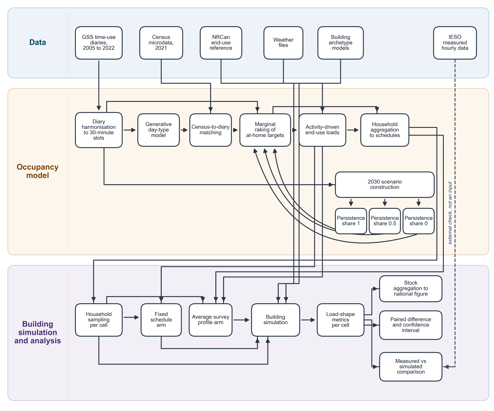{width=16cm}

**Figure 1.** Overview of the modelling and simulation framework. Drawn with Gemini (Google) from the authors' specification.

The framework is a chain of eleven stages. The first three stages are diary harmonization, a
generative day-type model and marginal raking to match independent targets. Diary donors are then
matched to a census-representative population. Household members are aggregated into hourly
schedules, and activity-driven end-use loads are added. A scenario-based projection moves the
schedules to a future year. Households are then sampled for simulation, and the simulation output is
aggregated to the national housing stock. The last two stages are load-shape metrics and a paired
statistical comparison. This comparison runs across years and across alternative scheduling methods.
Sections 2.1 to 2.6 define each stage. Table 1 lists the datasets and their role. Measured hourly
load is used only as an external check, not as a model input.

**Table 1.** Datasets and their role in the framework.

| Dataset | Years / vintage | What it provides | Framework stage(s) |
|-----------|------------|------------------------------------------|------------------------------------|
| GSS time-use diaries | 2005, 2010, 2015, 2022 cycles | Respondent-level 10-minute activity and location diaries, harmonized to a common activity code list | Source diaries for the generative model (2.1, 2.2) and for the raking targets (2.2) |
| Census public-use microdata | 2021 | Household composition, dwelling type, tenure and geography for a representative population of households | Recipient population for diary matching and the base population whose schedules are aggregated (2.3) |
| NRCan SHEU end-use reference | 2019 survey | National annual end-use energy totals by dwelling type (appliances, lighting) | Calibration target for the activity-driven end-use loads (2.4) |
| Weather files | typical-meteorological-year (TMYx) | Hourly outdoor conditions for each climate zone | Building simulation input alongside the injected schedules (2.3, 2.5) |
| Building archetype models | fixed archetype geometry and construction | Four dwelling archetypes at six city/climate-zone weather stations, the physical envelope each household's schedule is run against | Building simulation and stock aggregation (2.5) |
| IESO hourly consumption by postal area (IESO 2022) | 2022 | Measured hourly electricity use of residential customers, with premise counts, aggregated for Toronto and for Ontario as a whole; an external reference series, not a model input | External check of the simulated load shape (3.6); no simulation input role |

## 2.1 Data and diary preparation

Each respondent's diary starts at 10-minute resolution. It holds 144 activity codes and 144 binary
at-home indicators. Together they cover one full day from a 04:00 origin. The diary is downsampled
to 48 slots of 30 minutes, which the generative model and every later stage use. The activity code
of a 30-minute slot is the majority vote (mode) of its three 10-minute codes. The rare three-way ties
are resolved in a separate step. A 30-minute slot counts as at home when at least two of its three
10-minute slots are at home (Appendix B, Eqs. B.1 and B.2). Figure 2 shows this step with a small
example. In Figure 2, two of Person A's first three ten-minute slots are at home, so Person A's first
30-minute slot counts as at home. Only one of Person A's next three slots is at home, so the second
30-minute slot counts as away. The activity of the first slot is Cooking, the most frequent of its
three codes.

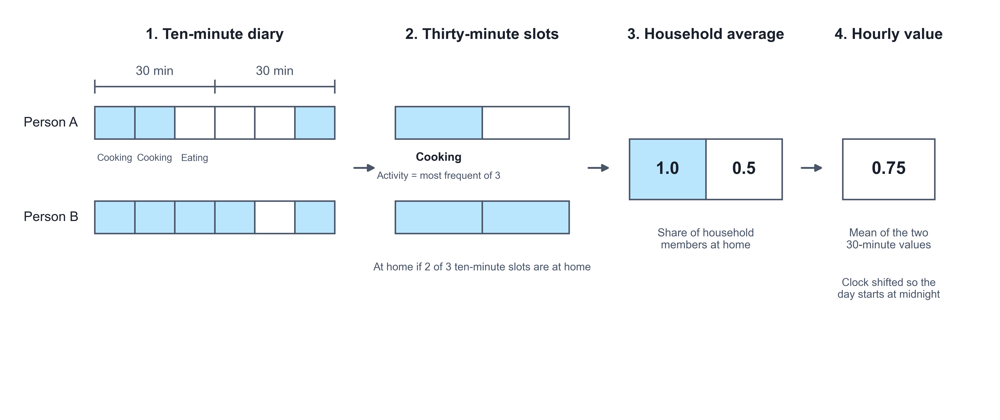{width=16cm}

**Figure 2.** Conversion of a ten-minute diary into an hourly household occupancy value. Drawn with Gemini (Google) from the authors' specification.

The resulting 48-slot series is the common unit of the framework. The training target of the
generative model uses this form. So do the raking target, the census-matched donor and the
household-schedule input to the building simulation. All of them are expressed as the same 48 slots
from a 04:00 origin.

## 2.2 Generative occupancy model and calibration

The generative model is a sequence model with an encoder-decoder structure (Vaswani et al. 2017). The encoder builds one
conditioning representation from three inputs. These are the respondent's demographic profile, the
survey cycle and the target day-type stratum (weekday, Saturday, Sunday). The demographic profile
covers age group, sex, marital status, household size and labour-force status. Sex is taken as each
source records it. The 2005, 2010 and 2015 survey cycles record the respondent's sex; the 2022 cycle
and the 2021 census record gender in two categories (men+ and women+). The two are joined into one
two-category variable, used only for conditioning and matching; no result is reported by sex or
gender. The decoder produces
the 48-slot day, conditioned on that representation through cross-attention. At each slot, the
decoder outputs three sets of logits. The first is a 14-way activity categorical. The second is a
binary at-home indicator. The third is a 9-channel co-presence indicator (who else is present).

Training minimizes a weighted combination of the per-slot negative log-likelihoods of these three
outputs, a standard multi-task loss (Caruana 1997; Goodfellow, Bengio and Courville 2016). Given the decoder state, the three distributions are treated as conditionally independent.
Two regularization terms are added to this loss (Appendix B, Eq. B.3). The first penalizes the gap
between the model's average at-home rate and the observed average at-home rate. The second is a small
auxiliary loss that predicts the target day-type stratum from the decoder state. The loss weights are
fixed training parameters, not fitted.

Raking then adjusts the at-home share to independent targets. It is applied after census-to-diary
matching (Section 2.3), to the matched population. There are two rakes, each run per day-type stratum
and 30-minute slot. For the survey year, the model-generated diary-days are raked to the at-home rate
of the real respondents. For 2030, the matched population is raked to the scenario target of Section
2.5. Both rakes use the same mechanism, which is a single deterministic pass.

For each stratum and slot, the target at-home rate times the number of diaries gives a target count.
This count is rounded to an integer and clipped to the valid range. The number of records to flip is
the gap between the target count and the current count of at-home records (Appendix B, Eqs. B.4 and
B.5). If the gap is positive, that many away records are flipped to at home. If it is negative, that
many at-home records are flipped to away. Candidates at an activity-transition boundary are chosen
first. At such a record, the neighbouring slot's value differs from the current slot. Remaining ties
are broken by a fixed random seed. Figure 3 shows this adjustment for one slot. In Figure 3, 4 of 10
records are at home and the target share is 0.6. The target count is therefore 6, so 2 records
change from away to at home.

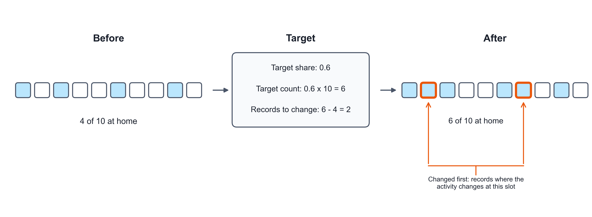{width=16cm}

**Figure 3.** Adjustment of the at-home count in one time slot to its target. Drawn with Gemini (Google) from the authors' specification.

The target count is met exactly by construction, up to the number of available candidate records.
There is therefore no convergence tolerance and no iteration count. One pass over every (stratum,
slot) pair reproduces the target count exactly, or as closely as the available candidates allow. The
procedure is thus a minimal-flip integer rake to an exact per-slot count. It is not the iterative
proportional fitting of classical raking (Deming and Stephan 1940). For the survey year, a floor guard follows. It applies to
single-person households whose daily at-home mean the rake pushed below a fixed floor. For these
households, night slots are restored to at home until the floor is met.

## 2.3 From diaries to household schedules

Each synthetic (census) household member receives a donor diary. The donor comes from a four-level
fallback search. The levels are tried in order until one gives a non-empty donor group for that
Census record:

1. an exact match on age group, sex, marital status, household size, labour-force status and
   province, within the same day-type stratum;
2. a match on age group, sex, labour-force status and province only, within the same day-type
   stratum;
3. a match on age group and sex only, within the same day-type stratum;
4. a random draw from every diary of the same day-type stratum, regardless of demographics. This
   level is used only when no donor shares even age group and sex.

Within the level that supplies the donor group, one donor is drawn uniformly at random. The day-type
stratum is assigned to each Census record first, because the census record carries no diary day. The
assignment uses a fixed 5:1:1 weekday-to-Saturday-to-Sunday probability split. All random draws use
a fixed seed. Survey cycle is not a matching key. The donor pool for a given year is built from that
year's own diaries only. The 2022 stock uses 2022 diaries, and each earlier cycle uses its own
diaries. Metropolitan area is not a key either. It is nested within province. It was dropped from
the first level so that more people keep household size as a matched attribute. As a consequence, a
donor shares the recipient's metropolitan area less often, which is a limitation.

Every household member now has a 48-slot activity and at-home series. The series comes from the
harmonized diary, the generative model or the matched donor, depending on the year. The household
schedule is built by averaging across members, for each day type and slot. The day types are weekday
and weekend, with Saturday and Sunday pooled into one weekend day type. The fraction of the household
at home is the mean of the members' at-home indicators. The household metabolic rate is the mean,
over the same records, of a fixed activity-to-watts lookup (Appendix B, Eqs. B.6 and B.7). A fixed
default applies to activity codes without an entry. The lookup values follow the 2024 Adult
Compendium of Physical Activities (Herrmann et al. 2024), converted at 70 W per metabolic equivalent (MET).

Both 48-slot series are then averaged in pairs into 24 hourly values (Appendix B). The result is
rolled by four hours, so that clock hour 0 (midnight) lines up with the weather file's clock. The
diary's own origin is 04:00, not midnight. Figure 2 shows these last two steps. Persons A and B are
both at home in the first 30-minute slot, so the household value is 1.0. In the second slot only
Person B is at home, so the value is 0.5. The hourly value is the mean of the two, 0.75.

The equipment and lighting fractions of Section 2.4 are attached to the same household, day-type and
hour rows. They receive the same four-hour roll. The output is one row per household, day type and
hour. Its column format is the one the schedule-injection function of the building simulation
consumes. Each household contributes exactly one weekday row set and one weekend row set. These form
the schedule file of that year's simulation.

## 2.4 Activity-driven end-use loads

End-use equipment power and lighting state are built slot by slot from the same household diary. This
step comes before the 48-to-24 averaging of Section 2.3. The equipment power of a slot depends on who
is at home and what they do (Figure 4). Some devices are shared by the household, and some are
personal. In Figure 4, Person 1 is cooking and Person 2 is watching TV, so both feed the shared
devices. Shared devices are used once per household. Person 3 is using a computer, which is a
personal device and adds up per person.

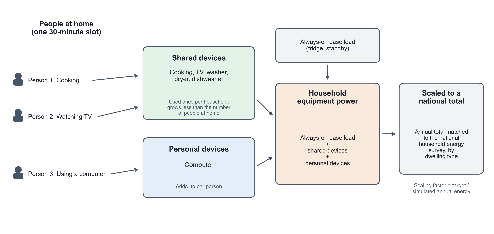{width=16cm}

**Figure 4.** Construction of household equipment power from the activities of the people at home. Drawn with Gemini (Google) from the authors' specification.

At slot $t$, $n_t$ household members are present (at home), with activities $a_1, \dots, a_{n_t}$.
The mapping from activities to appliance use follows activity-based load models (Widén and Wäckelgård
2010; Richardson et al. 2010). The raw equipment power is a baseload plus a sum over device categories:

$$
P_t = P_{\text{base}} + \sum_{b \in B_{\text{shared}}} \Big(\max_{i=1,\dots,n_t} w_b(a_i)\Big) P_b\, \eta(n_t)
\;+\; \sum_{b \in B_{\text{personal}}} \Big(\sum_{i=1,\dots,n_t} w_b(a_i)\Big) P_b
\;+\; P_{\text{dw}}(t)\, \eta(n_t)
\tag{1}
$$

Here, $B_{\text{shared}}$ is the set of appliance categories one household uses at a time (cooking,
washer, dryer, television). $B_{\text{personal}}$ is the set used per person (a personal computer).
$w_b(a)$ is a fixed weight giving how strongly activity $a$ implies use of category $b$. $P_b$ is a
fixed rated power for category $b$. $\eta(n_t)$ is a fixed, non-decreasing diminishing-returns factor
for shared-device co-occupancy. It has $\eta(0)=0$ and $\eta(1)=1$, and it saturates at a fixed cap
for five or more present members. Its form follows the effective occupancy of Richardson et al. (2009);
its values are set in this study. $P_{\text{dw}}(t)$ is a separate dishwasher term. Once a present
member's activity triggers it, it runs for a fixed number of slots. It then enforces a fixed cooldown
before it can trigger again. The lighting indicator is binary. $\text{light}_t = 1$ if any present
member's activity has a non-zero lighting weight, else 0.

The 48-slot raw series is averaged into 24 hourly values exactly as in Section 2.3. It is then scaled
to an external annual-energy target by dwelling type from the NRCan SHEU reference (Natural Resources Canada 2019). The equipment
target is net of the refrigerator load, which the building model already represents separately. This
avoids double-counting. $E_{\text{raw}}$ is the raw annual equipment energy. It follows from the
24-hour weekday/weekend profile and a fixed weekday/weekend day count. $E_{\text{tgt}}$ is the SHEU
target for that dwelling type. The calibration scalar is

$$
f_e = \frac{E_{\text{tgt}}}{E_{\text{raw}}}
\tag{2}
$$

The scalar is applied to the peak raw hourly power to obtain the design power of the building
simulation. It is also applied to the raw hourly series divided by its own peak. This gives an
equipment fraction schedule from 0 to 1. Lighting is scaled the same way, using total annual
lit-hours in place of raw energy. This SHEU agreement calibrates the design power and duty fraction to
an external annual total. It is not a validation of the sub-hourly shape. That shape is not compared
against any external end-use time series.

## 2.5 2030 scenarios, household sampling and stock weighting

The 2030 stock keeps the same households and the same raking mechanism as Section 2.2. Only the
at-home target changes. A linear trend $\text{slope}_{s,t}$ is fit through the stratum-slot at-home
means of the 2005, 2010 and 2015 cycles. The 2022 deviation from that trend line is
$\text{jump}_{s,t} = \text{obs}_{2022,s,t} - \text{trend}_{s,t}(2022)$. It is treated as a
pandemic-era level shift that may or may not persist (Barrero, Bloom and Davis 2023). The three scenarios differ only in the share
$\lambda$ of that shift assumed to remain in 2030 (Figure 5). In Figure 5, the blue line keeps all of
the 2022 jump and runs parallel to the trend. The green line keeps half of the jump. The orange line
goes back to the pre-pandemic trend by 2030.

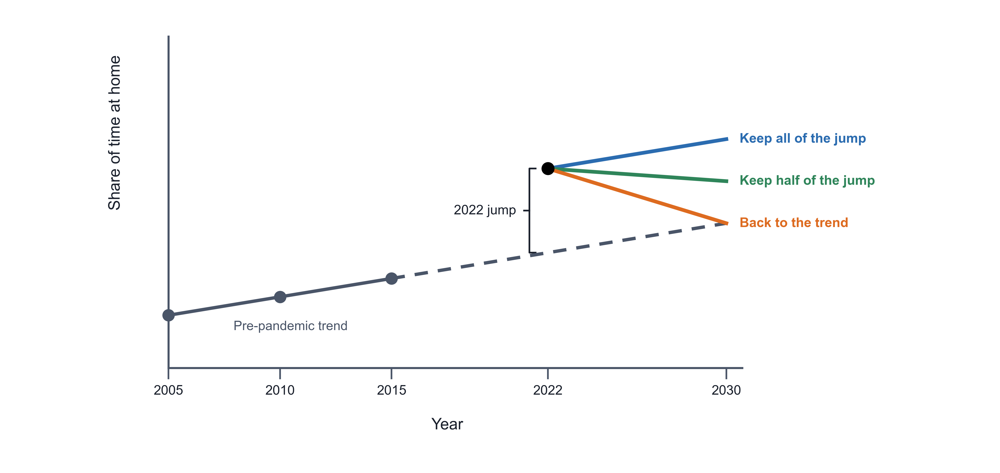{width=16cm}

**Figure 5.** Construction of the three 2030 scenarios from the pre-pandemic trend and the 2022 jump. Drawn with Gemini (Google) from the authors' specification.

The 2030 at-home target of each scenario is

$$
\text{target}_{\lambda}[s,t] = \operatorname{clip}\Big(
\text{stock}_{2022}[s,t] + 8 \cdot \text{slope}_{s,t} - (1-\lambda)\,\text{jump}_{s,t}
,\ 0,\ 1\Big),
\qquad \lambda \in \{1,\ 0.5,\ 0\}
\tag{3}
$$

Thus $\lambda = 1$ keeps the full 2022 shift, and $\lambda = 0.5$ assumes half of it has faded.
$\lambda = 0$ assumes it has fully faded, so 2030 sits on the pre-2022 trend line. A second,
standardized version of the same equation, $\text{target}_{\text{std}}$, serves as a sensitivity
check. Its trend and shift are computed after reweighting every cycle's diaries to the 2030 stock's
composition. This composition is by age group, sex and labour-force status. The standardized version
is reported alongside the primary version. The result is a target array in the same form as the
survey-year target, raked exactly as in Section 2.2. This is a scenario-based projection of a stated
persistence assumption, not a forecast. No scenario claims to predict which value of $\lambda$ will
occur.

The building simulations cover 24 modelled cells (4 dwelling archetypes $\times$ 6 city/climate-zone
stations). For each cell, the candidate pool holds every household identifier present in the schedule
files of all years simulated together. The pool is restricted to that cell's archetype and province.
It is further restricted to households whose loaded schedules pass a plausibility check on the daily
occupancy pattern. This check belongs to the integration layer itself. The pool therefore depends on
the numeric content of the schedule files, not only on which households they list. The Supplementary
Information states what this implies for comparing this study's schedule set against an earlier one.

From this pool, $N = 50$ households are drawn by simple random sampling without replacement
(Cochran 1977; Appendix B, Eq. B.8). Sampling
with replacement is a fallback, used only if the pool holds fewer than 50 households for that cell.
This case was not encountered in the campaign reported in this paper. The random generator of each
cell is seeded by a fixed base seed together with a deterministic offset. The offset is derived from a
hash of the cell's own label. The same base seed therefore reproduces the same 50 households for a
given cell on any machine. The same 50 households are used for every cycle-year simulated for that
cell, which makes a paired panel. Only the injected occupancy, equipment and lighting schedule changes
by year. The building archetype and weather file are held fixed.

A national figure summarizes the 24 simulated cells. Each cell's result is weighted by its dwelling
archetype's share of the national housing stock. This share is an external reference composition. It
is held fixed across all years and is not derived from this paper's own samples. The shares are
renormalized over the four modelled archetypes. Each archetype-level weight is then split equally
across the (up to six) cities that host that archetype:

$$
w_{a,c} = \frac{w_a}{\lvert C_a \rvert}, \qquad \sum_{a} w_a = 1
\tag{4}
$$

Here, $C_a$ is the set of cities simulated for archetype $a$. A national metric is then the weighted
average of the 24 cells' values, $\bar{x} = \sum_{a,c} w_{a,c}\, x_{a,c}$. The circular peak-hour
metric of Section 2.6 is averaged on its sine and cosine components. The mean angle is then computed
again from these averages. This is needed because circular quantities cannot be averaged directly,
due to the wrap from 23:00 to 00:00.

## 2.6 Load-shape metrics, statistics and comparison methods

All load-shape metrics are computed from the hourly whole-building electricity meter. The meter output
is first converted from the simulator's native energy units to kW. Annual energy is the sum of the
8,760 hourly kW values for the year. Daily peak is the mean, over the year's days, of that day's
maximum hourly kW. The peak hour of day is circular (0 to 23, wrapping at midnight). Its central
tendency therefore uses the circular mean. Its dispersion is Mardia's circular standard deviation
(Mardia and Jupp 2000; Appendix B, Eqs. B.9 and B.10).

Load factor is the ratio of the year's mean hourly load to its single annual peak hourly load,
$\text{LF} = \overline{P}/P_{\max}$. Midday share is the fraction of annual energy delivered in the
09:00 to 17:00 window, $\text{midday} = \sum_{h \in [9,17)} P_h \big/ \sum_h P_h$. Morning-leaning
share is the fraction of units whose circular mean peak hour falls in $[0,12)$. The units are
households or days, depending on the aggregation level. Evening ramp, a known concern for grid operation (Denholm et al. 2015), is the increase in whole-building
hourly load from the 14:00 hour to the 17:00 hour. It is averaged over the 365 days of the year,
$\text{ramp} = \sum_{d} (P_{d,17} - P_{d,14}) / 365$.

Every year-to-year or arm-to-arm comparison in this paper uses the same paired-difference
construction. Take a metric $M$ and two conditions A and B, for example two simulation years. The
household-level results are joined on the household's identifying key (archetype, city, household
identifier). Only households present under both conditions are kept. The paired difference is the
metric under B minus the metric under A. It is computed for each of the $n$ paired households
(Appendix B, Eq. B.11). The reported interval is the standard pooled paired Student-t 95% confidence
interval on the mean difference (Montgomery and Runger 2018):

$$
\bar{d} \;\pm\; t_{0.975,\,n-1}\ \frac{s_d}{\sqrt{n}}
\tag{5}
$$

Here, $s_d$ is the sample standard deviation of $d_i$ across the $n$ paired households. It is pooled
across every simulated cell, not computed separately per cell. A one-sample t-test of
$H_0: \bar{d}=0$ is reported alongside it. A difference is treated as separable from zero only when
this interval excludes zero. The interval treats households as independent. It does not account for
households sharing a city or an archetype. Section 3.8 and the Supplementary Information examine the
consequence of this clustering. For midday share, where it matters, the wider clustering-aware
interval is the one reported (Section 3.4).

Two simplified scheduling methods, the comparison arms, isolate what the framework's diary-based
schedule contributes. Both run against the same sampled households as the full framework. Both also
use the same per-household calibrated design powers. The fixed-schedule arm replaces the household's
own occupancy, equipment and lighting schedule with a single reference schedule. This is the standard
residential mid-rise weekday/weekend profile shipped with the building-model templates. The templates carry it from the
mid-rise apartment of the U.S. Department of Energy reference buildings (Deru et al. 2011). It does not
depend on the household, the archetype or the simulated year (Appendix B, Eq. B.12).

The average-survey-profile arm instead uses the framework's own diaries. It removes all
household-to-household variation within a cell. Every sampled household receives the same cell-level
average profile for that year. For cell $c$ and year $y$, $\text{Pool}_c$ is the full candidate
population of that cell, not only the 50 sampled households:

$$
S^{\text{avg}}_{c,y,d,k} = \frac{1}{\lvert \text{Pool}_c \rvert} \sum_{h \in \text{Pool}_c} S^{\text{full}}_{h,y,d,k}
\qquad \text{for every sampled household in } c
\tag{6}
$$

This average applies identically to the occupancy, equipment fraction, lighting fraction and metabolic
series. Each household keeps its own SHEU-calibrated design powers (Section 2.4). Only the sub-daily
shape is replaced, not the annual scale.

# 3. Results

The subsections below trace one path through the pipeline. Sections 3.1 and 3.2 show how the
at-home pattern itself differs between 2022 and three stated 2030 assumptions. Section 3.3 shows
what this does to annual electricity by end use. Section 3.4 shows how it reshapes the daily load
curve. Section 3.5 shows what a simplified average-profile scheduling method would have shown
instead on the same households. Section 3.6 compares the simulated load shape with a year of real
measured data for one city. Sections 3.7 and 3.8 report two robustness checks briefly, with full
detail in the Supplementary Information.

## 3.1 Occupancy change

The at-home occupancy series is built on a stock frame of 144,465 census households (Sections 2.3
and 2.5). It covers the 2022 survey cycle directly. It also covers four 2030 variants built from the
scenario construction of Section 2.5. The values below are read at one representative point, a
weekday at noon (hour 12).

At weekday noon in 2022, 47.8 percent of the stock is at home. For 2030, four variants were run side
by side rather than a single projection: three scenarios and one control. The main scenario assumes
the pandemic-era rise in at-home behaviour persists in full. Under it, the noon share moves from 47.8
percent to 50.1 percent. The partial-persistence scenario assumes half of that shift has faded by
2030 (46.2 percent). The full-reversion scenario assumes the shift has faded completely, so 2030 sits
back on the pre-pandemic trend (42.3 percent). The no-change control reproduces the 2022 pattern
unmodified (47.8 percent). This value is identical to the 2022 value to the last reported digit. It is
an acceptance check on the scenario-construction code, not a scenario in its own right. These four
numbers describe the household schedules built under each stated persistence assumption (Section
2.5). They are a designed comparison of assumptions. They do not claim that any single one of them is
what will actually occur in 2030.

Figure 6 shows the full 24-hour series by hour of day, for weekdays and weekends. It covers the 2022
stock baseline, the three 2030 scenarios (main persistence, partial persistence and full reversion)
and the no-change control. All lines use the 144,465-household stock frame. The no-change control
coincides with the 2022 line by construction.

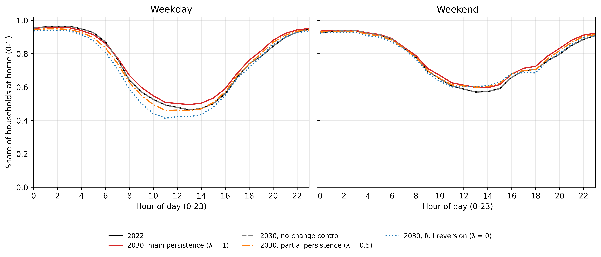{width=16cm}

**Figure 6.** At-home fraction by hour of day, weekday and weekend, 2022 and 2030.

Averaged over the whole weekday, 74.4 percent of household-hours are spent at home in 2022. The three
2030 scenarios move this whole-day weekday share by 1.49 percentage points (main scenario), negative
0.85 percentage points (partial persistence) and negative 3.21 percentage points (full reversion).
These are the designed steps from 2022, not attained targets. The scenarios carry forward or remove a
pandemic-era break. This break is measured on the survey respondents themselves. In 2022, the
national weekday at-home rate sits 4.73 percentage points above where the 2005 to 2015 trend would
have placed it. The gap is 7.67 percentage points when every survey cycle is first reweighted to the
housing stock's age, sex and labour-force mix. This standardized measure is the sensitivity behind
the standardized-reversion variant. The main scenario keeps that break and adds the 2005 to 2015
trend carried forward. This is why its step (1.49 percentage points) is positive. The full-reversion
scenario removes the break and keeps the trend. This is why its step is negative.

## 3.2 The 2030 scenarios

Three named 2030 scenarios, plus one standardized sensitivity variant, are compared on the
households they share. The four scenario arms were built and sampled independently. They do not all
cover the same households. The main scenario has 1,200 households, the full-reversion scenario
1,198, the partial-persistence scenario 1,200 and the standardized-reversion variant 1,199. Every
cross-scenario comparison in this subsection, and in the scenario load shapes of Section 3.4, uses
only the 1,198 households present in all four arms. All numbers below refer to this common set.

Under the full-reversion scenario, stock-weighted whole-building electricity use falls by 0.1225
percent from 2022 to 2030 (95 percent confidence interval negative 0.1480 to negative 0.0964
percent). This is a real change, since the interval excludes zero. Under the partial-persistence
scenario, the equivalent change is 0.0117 percent, with a confidence interval of negative 0.0065 to
0.0351 percent. Because that interval contains zero, this is no detectable change at this sample
size, not an increase. The standardized-reversion variant recomputes the trend and the pandemic-era
jump after reweighting every survey cycle to the housing stock's age, sex and labour-force mix. Under
this variant, whole-building electricity falls by 0.4408 percent (95 percent confidence interval
negative 0.4668 to negative 0.4136 percent). This is the largest change of the three scenario arms.
Of the eight end-use meters, fan electricity shows no change in any of the three arms (0.0 percent,
interval 0.0 to 0.0).

The same pattern holds for the load-shape metrics. Under the full-reversion scenario, midday energy
share changes by negative 0.127 percentage points (95 percent confidence interval negative 0.307 to
positive 0.061 percentage points). This is no detectable change at this sample size. Under the
partial-persistence scenario, load factor changes by 0.026 percentage points (95 percent confidence
interval negative 0.042 to positive 0.092 percentage points). This is also no detectable change.
Under the standardized-reversion variant, both shape metrics show a change that excludes zero. Midday
share falls by 1.383 percentage points (95 percent confidence interval negative 1.610 to negative
1.138). Load factor falls by 1.365 percentage points (95 percent confidence interval negative 1.475
to negative 1.253). This is the most clearly separable shape change among the three scenario arms.

## 3.3 Annual energy by end use

Under the main scenario, annual electricity is nearly flat. Whole-building electricity use, weighted
to the national housing stock, rises by 0.1209 percent from 2022 to 2030 (95 percent confidence
interval 0.0981 to 0.1407 percent). This is a small but real change, since the interval excludes
zero. Underneath that near-flat total, the mix of end uses moves more than the total does. So does
the timing of demand (Section 3.4). The rest of this Results section documents that pattern. Per
simulated building, weighted to the national stock, whole-building electricity use is 117,942.5 kWh
in 2022 and 118,049.8 kWh in 2030. These values come from 1,200 simulated buildings, 300 per
archetype. This level mixes single homes and multi-unit buildings. It is therefore a stock-weighted
building average, not a per-dwelling figure.

Among the individual meters, interior lighting falls by 0.0157 percent (95 percent confidence
interval negative 0.0274 to negative 0.0043 percent). Interior equipment falls by 0.0066 percent (95
percent confidence interval negative 0.0119 to negative 0.0012 percent). Both intervals exclude zero.
Fan electricity shows no change (0.0 percent, interval 0.0 to 0.0). Heating energy transfer falls by
0.2905 percent (95 percent confidence interval negative 0.4049 to negative 0.1746 percent). Cooling
energy transfer rises by 0.5947 percent (95 percent confidence interval 0.5235 to 0.6523 percent).
Water-systems energy transfer rises by 0.5806 percent (95 percent confidence interval 0.3419 to
0.7845 percent). The remaining HVAC-and-domestic-hot-water electricity rises by 0.3578 percent (95
percent confidence interval 0.2863 to 0.4166 percent). These three rises all exclude zero.

Heating, cooling, water systems, and the HVAC and domestic-hot-water remainder are reported only at
the whole-building level. No per-dwelling divisor exists for these meters. Per-dwelling annual energy
is reported only for equipment and lighting, the two meters with a defined per-dwelling divisor.
Stock-weighted interior lighting falls from 1,062.7 to 1,062.6 kWh per dwelling per year. Interior
equipment falls from 3,075.5 to 3,075.3 kWh per dwelling per year. These are levels, not a
bootstrapped change. Figure 7 shows these annual results for the main scenario, 2022 versus 2030.
Panel A shows stock-weighted whole-building annual energy by end use for all eight meters. Panel B
shows stock-weighted per-dwelling annual energy for interior equipment and interior lighting only.

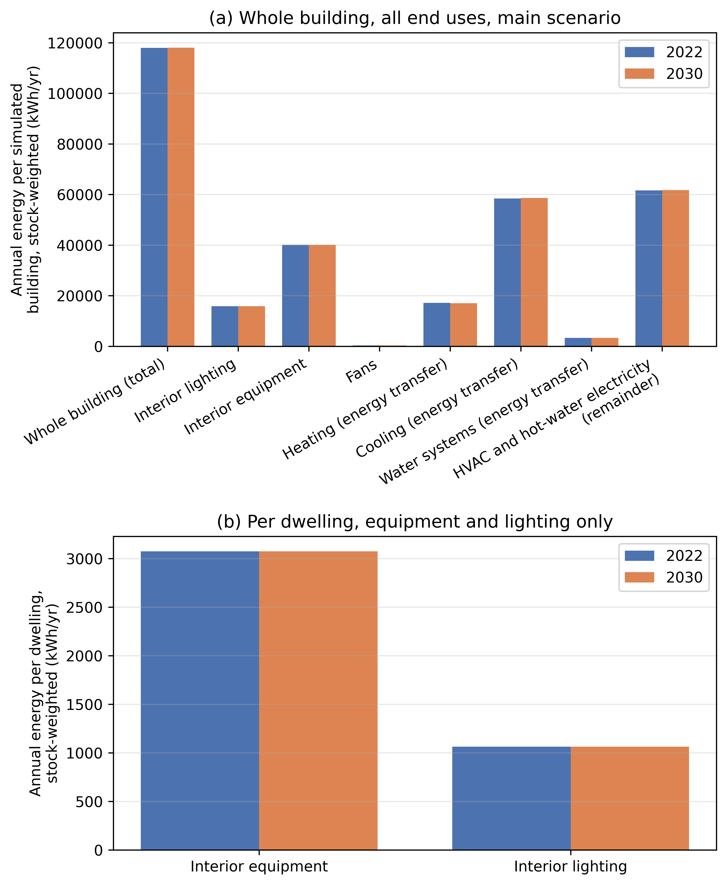{width=16cm}

**Figure 7.** Annual energy by end use, 2022 versus 2030, main scenario.

As an additional check, simulated equipment and lighting energy were compared against their fitted
SHEU calibration target. The check compares simulated and survey end-use totals. It is descriptive,
with a band of plus or minus 15 percent around the fitted target. It is not an independent validation
against outside data. All 48 archetype-by-city-by-year cells pass this check. Energy use intensity is
taken as total site energy of all fuels divided by net conditioned floor area. It is summed over the
50 simulated buildings of each archetype in all six cities, giving 300 simulations per archetype and
year. In 2022, it is 116.0 kWh/m² for single-detached houses, 100.5 kWh/m² for other dwellings, 107.8
kWh/m² for mid-rise and 78.6 kWh/m² for high-rise buildings. The 2030 main-scenario values are 116.3,
100.6, 107.8 and 78.6 kWh/m². These are simulated levels, not a tested change.

## 3.4 Load shape: peak, load factor, midday share, ramp

Figure 8 shows the stock-average weekday load shape for 2030 under all four scenario arms, on the
1,198 households common to all four. The curve reaches its maximum at hour 17 of the day under the
main scenario, the partial-persistence scenario and the full-reversion scenario. It peaks at hour 18
under the standardized-reversion variant. Hour 17 uses the same clock-aligned hour numbering as the
rest of the framework (the four-hour roll of Section 2.3). It corresponds to the late-afternoon hour
beginning around 5 p.m. The standardized-reversion variant also shows a visibly lower midday load and
a higher evening peak than the other three arms. Sections 3.5 and 3.6 report two other kinds of
peak-timing evidence. These are household-level circular-mean ranges from the full model, and a
measured-data comparison for one city.

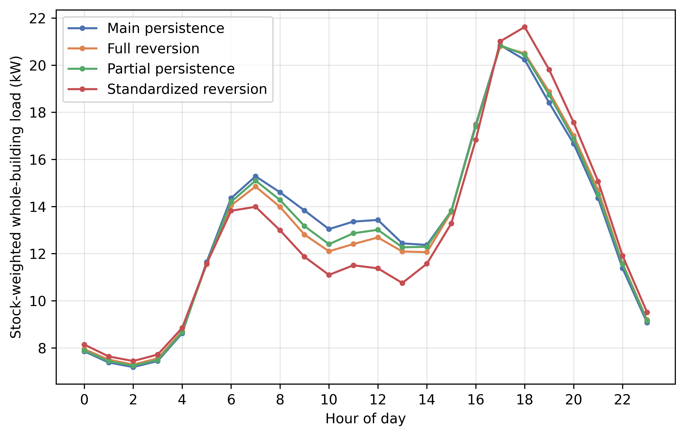{width=16cm}

**Figure 8.** Intraday weekday load shape in 2030 under all four scenario arms.

Load factor is the ratio of the year's mean hourly load to its single annual peak hourly load
(Section 2.6). Under the main scenario, it rises by 0.49 percentage points from 2022 to 2030 (95
percent confidence interval 0.41 to 0.57 percentage points). This change excludes zero. Midday share
is the fraction of annual energy delivered between 09:00 and 17:00. It rises by 0.73 percentage
points (95 percent confidence interval 0.62 to 0.86 percentage points). This interval accounts for
households sharing a city and an archetype. Section 3.8 reports how much wider this interval is than
one that ignores that clustering, and why the wider one is used here. Both changes exclude zero.

Peak demand and evening ramp are point estimates. Stock-weighted peak demand falls from 47.207 kW in
2022 to 46.332 kW in 2030. The stock-weighted evening ramp falls from 7.852 kW to 7.768 kW. Figure 9
shows peak demand, evening ramp and load factor for the main scenario, 2022 versus 2030, all
stock-weighted. The error bar on load factor is the 95 percent confidence interval on the 2022 to
2030 change.

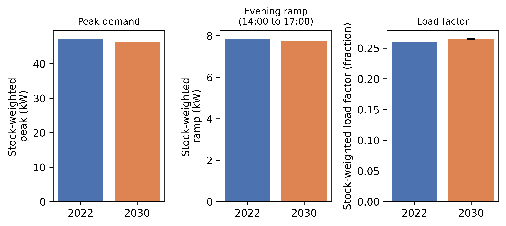{width=16cm}

**Figure 9.** Peak demand, evening ramp and load factor, 2022 versus 2030, main scenario.

Figure 10 shows the percent change for each of the eight end-use meters in each hour of the day. It
covers 2022 to 2030 under the main scenario, stock-weighted and averaged over all days of the year.
For whole-building electricity, consumption falls slightly in the overnight and late-evening hours.
It rises through the daytime hours, consistent with more of the stock being home during the day.
These hourly values are point estimates. They are read as a pattern rather than as individual
changes.

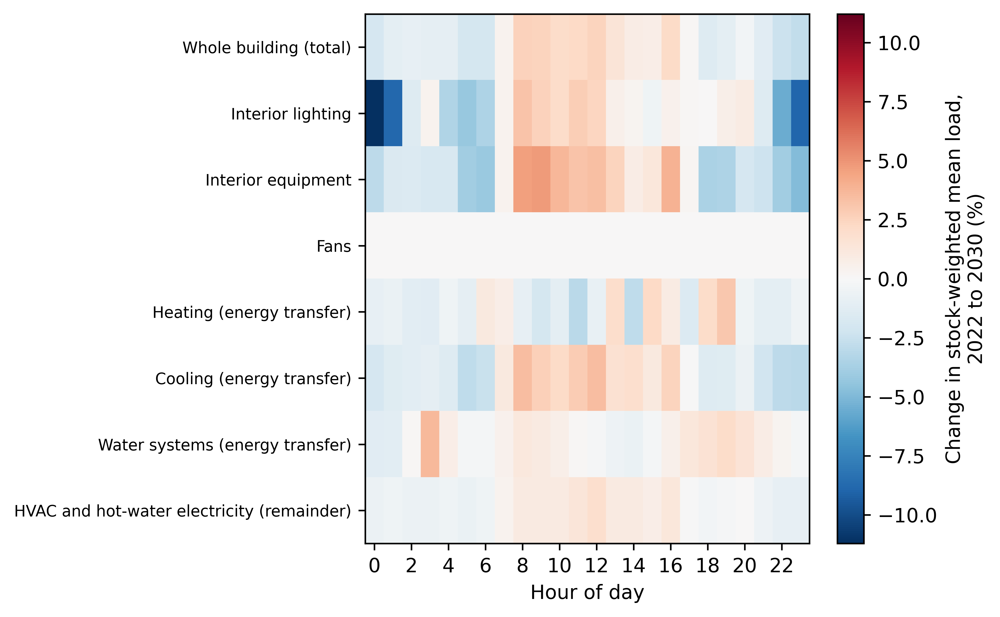{width=16cm}

**Figure 10.** Percent change by end use and hour of day, 2022 to 2030.

## 3.5 Comparison with an average-profile model

This comparison isolates what the household-level diary-based schedule contributes over a simpler
description of occupancy. The full model, used throughout Sections 3.1 to 3.4, was compared against
an average-profile arm. This arm keeps each household's own calibrated design power. It replaces the
household's individual schedule with the average schedule of its own archetype-and-city cell
(Section 2.6). A separate fixed-schedule arm is not part of this comparison, since it is not a
home-for-home comparison.

One illustrative cell is the single-detached archetype in Toronto in 2022. Whole-building electricity
use is 8,225.56 kWh under the full model and 8,951.40 kWh under the average-profile arm. This is a
difference of 725.84 kWh for this single cell. The two arms differ far more in household-to-household
diversity of peak timing than in this annual total. This diversity is measured as household-level
dispersion in peak hour. It uses a circular standard deviation, since peak hour wraps at midnight
(Section 2.6). For the same cell, it is 3.493 hours under the full model against 0.084 hours under
the average-profile arm in 2022. In 2030, it is 3.255 hours against 0.053 hours. The average-profile
arm thus collapses household-to-household diversity in peak timing almost to zero. This follows
directly from assigning every sampled household the same schedule by construction. It is not a data
finding. Across the six simulated cities, the full model's household-level circular mean peak hour
for the single-detached archetype ranges from 15.05 to 16.78 hours in 2022. It ranges from 15.24 to
16.62 hours in 2030.

Figure 11 shows the same comparison stock-weighted over all 24 cells, for 2022 and 2030. It covers
annual whole-building electricity, peak demand, load factor, midday share, evening ramp and the
household-to-household spread of peak hour. The error bars on load factor and midday share are 95
percent confidence intervals on the paired difference between the two arms.

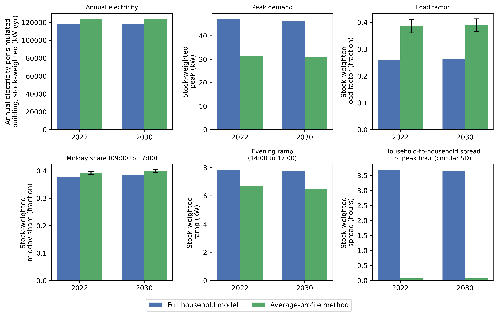{width=16cm}

**Figure 11.** Full model versus average-profile arm, stock-weighted, 2022 and 2030.

## 3.6 Independent measured check, Toronto/Ontario 2022

The simulated Toronto load shape was compared against a year of real measured hourly residential
electricity data for Toronto, and for Ontario as a whole, in 2022. Table 1 names the measured data
source. Section 2.6 defines load factor and midday share. Both sides use the same 09:00 to 17:00
midday window. On a shoulder-season weekday, the simulated load factor is 0.4680 against a measured
Toronto value of 0.4305, a difference of 0.0376. Simulated midday share is 0.3787 against a measured
0.3513. Simulated peak-to-average ratio is 2.1367 against a measured 2.3231. The simulated mean peak
hour is 17.0 against a measured 18.69, both on an hour-ending clock. The Ontario-wide measured series
gives the same reading for this period and day type (peak hour 18.42, peak-to-average ratio 2.2002).
The other Toronto period and day-type combinations cover winter, summer and the full year, and
weekends and holidays. They are read the same way. Figure 12 shows all twelve period and day-type
groups for four metrics: load factor, peak-to-average ratio, midday share and mean peak hour. All
values in this comparison are point statistics.

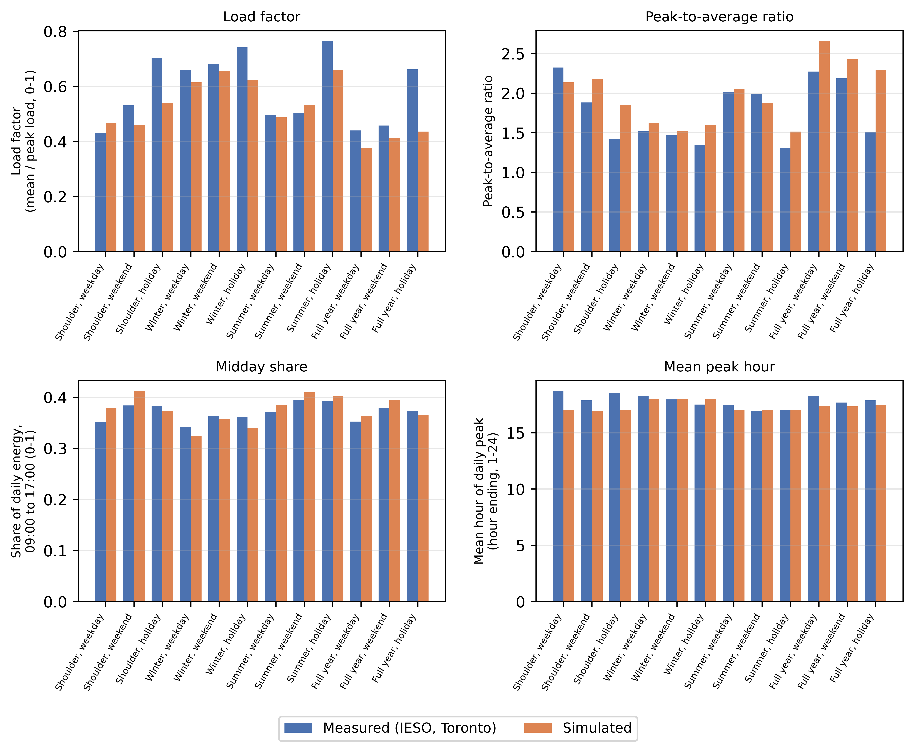{width=16cm}

**Figure 12.** Simulated versus measured load-shape metrics, Toronto, 2022.

Two further checks support the plausibility of these results. First, the Toronto 2022 annual
whole-building electricity of the present simulations was compared with the authors' earlier
simulation campaign on the same Toronto archetypes. That campaign used an earlier version of the
occupancy model. The change of occupancy model barely moved the annual total. The ratio of present
to earlier is 1.0075 for single-detached, 0.9997 for other-dwelling, 1.0017 for mid-rise and 1.0072
for high-rise. All four are within 0.8 percent of one. Second, the single-detached archetype holds
one dwelling per building. It uses 8,225.56 kWh of whole-building electricity per dwelling in 2022.
The other three archetypes hold several dwellings per building. They are compared through the
whole-building ratios above.

## 3.7 Sample-size check

A separate sampling check compares the confidence-interval half-width from the study's standard
50-household sample against larger samples of 150 and 200 households. It covers the four Montreal
archetype cells and six load-shape and energy metrics, giving 24 cell-by-metric combinations. Full
detail is in the Supplementary Information (Figure S1). The half-width is larger at 200 households
than at 150 households in all 24 of 24 tested combinations. This reflects a change in how the
interval is computed at each sample size. It is not evidence that the estimate does not settle with
more households. The 200-household interval uses a parametric interval on the real full sample. The
smaller sizes use a bootstrap of 1,000 subsamples drawn from that same 200-household set. The two
methods are not expected to produce the same half-width, even when the underlying estimate is
stable. One illustrative cell is the single-detached archetype in Montreal. For the 2022-to-2030
electricity change, it shows a half-width of 2.4475 kWh at 150 households against 4.2046 kWh at 200
households. The check covers Montreal only.

## 3.8 Robustness of model selection and intervals

**Model selection.** Four candidate models clear all four selection checks at their original
thresholds. The model used throughout this paper is the candidate with the best combined score among
these four. Its activity Jensen-Shannon divergence is 0.0191. Its at-home root-mean-square error is
4.57 percentage points. Its spousal co-presence gap is negative 2.03 percentage points. Its composite
score is 0.6355 (Supplementary Information Table S1). A threshold-sensitivity check varies each of
the four check thresholds individually, first by 10 percent and then by 20 percent. The selected
model changes in 2 of 21 tested scenarios. Both are a 20 percent tightening of the at-home
threshold. In these two, only one other candidate meets all four checks, and it is selected instead.
In the remaining 19 of 21 scenarios, the selected model stays eligible and is still chosen. Selection
is therefore not sensitive to moderate changes in three of the four thresholds. It is sensitive to
the fourth only at the most aggressive tightening tested (Supplementary Information Figure S2). The
thresholds were carried over from an earlier baseline version of the model. They were not derived
from an independent basis such as survey sampling error. This is a limitation of the selection
procedure (Supplementary Information Section S2).

**Clustering-aware intervals.** Households in this study share a city and an archetype. A resampling
method that accounts for that clustering (a cell-level cluster bootstrap) was therefore compared
against a plain pooled interval that ignores it. The comparison covers the two shape metrics used in
Section 3.4. For midday share, the cluster-aware interval is 0.00243 wide against 0.00174 for the
plain interval. It is about 40 percent wider, a real and material effect of clustering. The interval
used in Section 3.4 is this wider, cluster-aware one. For load factor, the cluster-aware interval is
0.00161 wide against 0.00165 for the plain interval. It is about 2 percent narrower, a negligible
difference within Monte Carlo noise. Both methods keep both metrics' intervals on the same side of
zero. No conclusion in this paper therefore flips depending on which interval is used. However, the
midday-share result shows that ignoring household clustering can understate uncertainty for some
metrics and not for others (Supplementary Information Table S3).

# 4. Discussion

Section 1.4 asked whether, and how, occupancy-driven change reshapes the residential load curve at
stock scale up to 2030. Under the main scenario, annual
whole-building electricity in 2030 is nearly unchanged from 2022 (Section 3.3). The timing of demand
and the mix of end uses move more than that total does. Only a change whose confidence interval
excludes zero is discussed as a change.

For grid planning, timing matters more than the annual total. Under the main scenario, midday share
rises by 0.73 percentage points and load factor by 0.49 percentage points, and both changes exclude
zero (Section 3.4). A grid operator plans for peak demand, the evening ramp and demand-response
programs from timing, not only from the annual total (Denholm et al. 2015).

The spread across the 2030 scenarios (Section 3.2) is this paper's main message about uncertainty.
Full reversion gives a small but real fall in annual electricity. Partial persistence gives no change
that the data can tell apart from zero. The standardized-reversion check gives the largest and
clearest fall. This spread rests on an open question: what happens to work from home after 2022
(Section 1.3). In Canada, 18.7 percent of employed people worked mostly from home in May 2024. This
was down 1.4 percentage points from May 2023 and 3.7 points from May 2022 (Statistics Canada 2024b).
If that fall continues, the partial-persistence and full-reversion scenarios are not less plausible
than the main, full-persistence scenario. The scenarios therefore form a range of outcomes, not a
central estimate with two side cases.

The paired, within-household design lets changes of this size be told apart from noise. Each
simulated household is compared against itself in 2022 and 2030, so the intervals reflect the
occupancy-driven signal (Section 1.4). Households also share a city and an archetype, so clustering
matters for some metrics (Section 3.8). For midday share, the clustering-aware interval used in
Section 3.4 is about 40 percent wider than a plain interval. No conclusion changes with the interval
method.

Section 3.5 shows what the household-level model adds over an average-profile method. That method
gives every household in a city-and-archetype cell the same schedule. In the illustrative cell, the
annual totals differ by about 9 percent. Household-to-household diversity in peak timing differs far
more, because the average-profile method collapses it almost to zero by construction. Only a
household-level model can represent this spread, and it sets how individual peaks combine into the
stock's load curve.

The measured-data comparison in Section 3.6 is a check on the simulated shape, not a validation of
the model as a whole. Simulated midday share sits reasonably close to the measured value. The
simulated shape peaks earlier and less sharply than the measured one (Figure 12).

The end-use survey check (Section 3.3) is a check against a fitted target, because the same survey
data also calibrates the model. All 48 archetype-by-city-by-year cells fall within plus or minus 15
percent of that target, so the calibration behaves as intended. This is not independent evidence that
the diurnal shape is correct. The measured comparison in Section 3.6 is that separate, second kind of
check.

One result runs against a simple intuition. Under the main scenario, interior lighting and interior
equipment both fall very slightly, and both changes exclude zero (Section 3.3). At the same time, the
at-home share and the midday share both rise. More time at home therefore does not mean more plug
load in these simulations, and no causal account is offered.

This study differs from its closest external precedent, Chen et al. (2022), on one axis. Their
stock-scale, paired simulation design evaluates an already-elapsed period. This paper carries
occupancy through the pandemic-era break to 2030, under more than one explicit persistence
assumption. The two studies otherwise share most of the framework dimensions in Table A.1.

Nothing in the pipeline is specific to Canada beyond its calibration data (Section 1.4). Any country
with a repeated national time-use survey, a census-type household frame and a national end-use energy
benchmark could build the same design. The American Time Use Survey and the Harmonised European Time
Use Survey already supply such time-use data. Only the resulting magnitudes would be expected to
differ.

# 5. Limitations

This work has twelve limitations. The first nine bear directly on the results. The last three concern
modelling assumptions.

**Scope.** The study covers six Canadian cities (Toronto, Kelowna, Vancouver, Montreal, Calgary and
Winnipeg) and four dwelling types (single-detached, other low-rise, mid-rise and high-rise). It uses
one country's time-use survey, Canada's General Social Survey, and the cities do not cover every
Canadian climate. The measured check uses residential electricity load shapes for Toronto and Ontario
in 2022 only. It excludes natural gas heating and the other cities, so it is a shape check, not a full
energy validation.

**Only home energy is inside the system boundary.** More time at home moves some activity, and its
energy use, out of offices, schools and other workplaces. Those buildings are not simulated. The
results describe the residential side of the shift, not its net effect on total building energy use.

**The comparison with the authors' earlier simulation campaign is not household-paired.** Diaries now
come only from the most recent survey year, so a different set of households passes the simulation
engine's data-quality check. The ratios against the earlier campaign (Section 3.6) therefore compare
model versions, not the same households. The 2022-to-2030 comparisons hold households fixed and are
not affected.

**Only one building envelope is used, for every city and dwelling type.** An existing-stock envelope
needed a published U-value and solar heat gain coefficient for the main existing window type. That
type is double-glazed clear glass with a 13 mm air gap, about 74% of single-detached window area. No
source prints these two values, so every building uses the current building-code envelope. This is
conservative in one respect, since older windows lose more heat than modelled.

**The simulated at-home level runs a little high against an independent benchmark.** The chosen 2022
stock spends 75.04% of time at home against a 72.3% observed anchor. The gap of 2.74 points is just
outside the allowed band of 2 percentage points, and the band was not widened. The gap comes mostly
from synthetic diaries and unweighted averaging; the real, weighted 2022 respondents sit at 72.31%.

**Weekend behaviour is harder to reproduce than weekday behaviour.** A distance ceiling of 0.10 was
fixed for every day type in advance. Weekdays pass, but Saturday and Sunday score 0.16 to 0.18 in both
validation checks. The gap sits almost entirely in weekend days the model filled in from other day
types; observed weekend diaries alone pass. Extra weekend training weight barely moved the gap. A wider ceiling of 0.20, considered after
these scores were seen, is not used (Section S3).

**The 2030 results are a scenario, not a forecast.** The 2030 schedules keep the same households and
diary assignments as 2022; only the at-home slots are re-raked (Section 2.5). The target is the 2022
level plus eight years of a linear trend fitted to 2005, 2010 and 2015 respondents, minus the part of
the pandemic-era shift assumed to fade. It is clipped to 0% to 100%. Population, policy and household
composition stay fixed, and no probabilistic range is given. The scenarios bracket one assumption:
how much of the 2022 shift persists.

**Saturday and Sunday are simulated as one day.** The building energy model reads only a weekday and
a weekend pattern per household. Saturday and Sunday are pooled into that weekend pattern, although
the diary model calibrates each day separately. This discards a measured difference between the two
days for every household and year, at the interface rather than in the occupant model (Section S6).

**The survey's method of collecting diaries changed in the same year that carries the pandemic
break.** Diaries for 2005, 2010 and 2015 came from telephone interviews; 2022 used a self-administered
electronic questionnaire. The collection-mode indicator is zero for the earlier cycles and one only
for 2022, so the method change and the pandemic-era shift are perfectly confounded. The direction of
the 2022 step (more time at home than in 2015) is supported by the wider pandemic literature. Its
exact size, and the 2030 scenarios built on it, carry a survey-design effect this study cannot
measure or remove.

**Three further limitations concern modelling assumptions.** First, 2030 uses the same typical-year
weather file as 2022, so the results isolate behaviour change from climate change. Second, matching
census households to diaries assumes the diary is independent of anything outside the matching
characteristics, which these data cannot test. Third, occupant metabolic heat comes from fixed
standard values per activity (Section 2.3) and is not calibrated against measured internal gains.

# 6. Conclusion

This paper asked whether, and how, occupancy-driven change reshapes the Canadian residential load
curve at stock scale under explicit work-from-home scenarios carried to 2030 (Section 1.4). The
timing of demand and the mix of end uses move more than the annual total does. The principal
findings are as follows.

1. In 2022 the national weekday at-home rate sits 4.73 percentage points above the 2005 to 2015
   trend. The three 2030 scenarios move the whole-day weekday at-home share by between 1.49 and
   negative 3.21 percentage points from 2022. The size of the move depends on how much of that break
   persists.
2. Under the main persistence scenario, annual whole-building electricity in 2030 is nearly unchanged
   from 2022, rising by 0.12 percent.
3. Under the main scenario, midday energy share rises by 0.73 percentage points and load factor by
   0.49 percentage points. Both changes exclude zero. This change matters most for grid planning, not
   the near-flat annual total.
4. The size, and even the direction, of the 2030 change depends on the persistence assumption. A full
   reversion to the pre-pandemic trend gives a small real fall in annual electricity. Partial
   persistence gives no change the data can tell apart from zero. A standardized-reversion check
   gives the largest fall of the three scenarios tested.
5. A household-level, diary-based schedule and a simpler average-profile method differ in annual
   total by about 9 percent in the illustrative cell. They give very different pictures of when
   different households reach their own peak. The average-profile method collapses
   household-to-household diversity in peak timing almost to zero by construction. The full model
   preserves it.
6. Against a year of measured Toronto and Ontario electricity data, the simulated load shape sits
   reasonably close to measured behaviour on some measures and not on others. The simulated peak
   arrives earlier in the day than the measured peak. The simulated peak-to-average ratio is lower
   than the measured one. This is a check on the simulated shape, not a validation of the model as a
   whole.

The practical message is that this behavioural shift is mainly a shaping question for the electricity
system, not a sizing one. Annual demand changes little under any of the scenarios tested. Under the
main scenario, the share of energy delivered in the middle of the day and the ratio of average to
peak load both rise. Grid and distribution planning that tracks only annual totals would miss this.

Three items from the limitations in Section 5 remain for future work. First, the 2030 scenarios use
the same typical-year weather file as 2022. A projected future-climate weather file would separate
behavioural change from climate change. Second, the measured check covers only Toronto and Ontario
electricity in one year. Extending it to other cities and years would show more fully where the
simulated shape matches measured behaviour. Third, a citable, Canada-specific account of the
work-from-home trend after 2022 could narrow the scenario range tested here. The range would then no
longer need to run from full persistence to full reversion.

# Nomenclature

- $s$: day-type stratum (weekday, Saturday, Sunday); in Eqs. B.1 and B.2 only, a 30-minute slot index.
- $t$: a 30-minute slot index, $t = 1,\dots,48$, 04:00 origin.
- $h$: a household index (Eqs. 6, B.6, B.7 and B.12).
- $h_i$: the peak hour of day $i$ (Eq. B.9).
- $d$: a day type, weekday or weekend (Eqs. 6, B.6, B.7 and B.12); in Section 2.6, a day of the year.
- $k$: an hour-of-day index, $k = 1,\dots,24$.
- $a$: a dwelling archetype (Section 2.5, Eq. 4); in Eq. 1, an activity.
- $c$: a city (Section 2.5, Eq. 4); in Eq. 6, a simulated cell.
- $C_a$: the set of cities simulated for archetype $a$ (Eq. 4).
- $\text{act30}_t$: the 48-slot activity code for one diary-day (Eqs. B.1 and B.7).
- $\text{hom30}_t$: the 48-slot at-home indicator for one diary-day (Eqs. B.2 and B.6).
- $M_h$: number of member diary-days of household $h$ pooled into one day type (Eqs. B.6 and B.7).
- $p_{s,t}$: an external target at-home rate for stratum $s$, slot $t$ (Eq. B.4).
- $N_s$: number of diary-days in stratum $s$ being raked (Eq. B.4).
- $\lambda$: the work-from-home persistence share retained in the 2030 scenario, $\lambda \in \{0, 0.5, 1\}$ (Eq. 3).
- $\lambda_{\text{act}}$: fixed training loss weight of the activity term (Eq. B.3).
- $\lambda_{\text{home}}$: fixed training loss weight of the at-home term (Eq. B.3).
- $\lambda_{\text{cop}}$: fixed training loss weight of the co-presence term (Eq. B.3).
- $\lambda_{\text{marg}}$: fixed training loss weight of the at-home rate penalty (Eq. B.3).
- $\lambda_{\text{aux}}$: fixed training loss weight of the auxiliary day-type loss (Eq. B.3).
- $w_a$: national dwelling-stock share of archetype $a$ (Eq. 4).
- $w_{a,c}$: the per-city split of $w_a$ (Eq. 4).
- $B_{\text{shared}}$: appliance categories used once per household (Eq. 1).
- $B_{\text{personal}}$: appliance categories used once per present person (Eq. 1).
- $w_b(a)$: fixed weight of activity $a$ toward appliance category $b$ (Eq. 1).
- $P_b$: fixed rated power of appliance category $b$ (Eq. 1).
- $P_{\text{base}}$: the fixed baseload power (Eq. 1).
- $\eta(n)$: fixed diminishing-returns factor for $n$ co-present members sharing a device (Eq. 1).
- $f_e$: the equipment calibration scalar, target annual energy divided by raw annual energy (Eq. 2).
- $R$: the resultant vector length of a circular mean (Eq. B.10).
- $\bar{h}$: circular mean of an hour-of-day quantity (Eq. B.9).
- $\text{sd}_{\text{circ}}$: circular standard deviation of an hour-of-day quantity (Eq. B.10).
- $R_{d,k}$: the fixed reference schedule of the fixed-schedule arm (Eq. B.12).
- $S$: an hourly schedule value (Eqs. 6 and B.12).
- $d_i$: the paired difference in a metric for household $i$ between two conditions (Eq. B.11).
- $\bar{d}$: mean of $d_i$ across the $n$ paired households (Eq. 5).
- $s_d$: standard deviation of $d_i$ across the $n$ paired households (Eq. 5).
- $n$: number of paired households in a comparison (Eq. 5); $t_{0.975,\,n-1}$: the Student-t quantile used for the 95 percent interval (Eq. 5).
- $n_t$: number of household members at home in slot $t$; $a_1, \dots, a_{n_t}$: their activities (Eq. 1).
- $P_t$: raw household equipment power in slot $t$ (Eq. 1); $P_{\text{dw}}(t)$: the dishwasher term (Eq. 1).
- $\text{light}_t$: binary lighting indicator in slot $t$ (Section 2.4).
- $E_{\text{raw}}$, $E_{\text{tgt}}$: raw simulated annual equipment energy and its national survey target (Eq. 2).
- $\text{slope}_{s,t}$: the 2005 to 2015 linear trend of the at-home rate for stratum $s$, slot $t$ (Eq. 3).
- $\text{jump}_{s,t}$: the 2022 deviation of the at-home rate from that trend (Eq. 3).
- $\text{stock}_{2022}[s,t]$, $\text{target}_{\lambda}[s,t]$: the 2022 at-home rate and the 2030 scenario target (Eq. 3).
- $x_{a,c}$, $\bar{x}$: a cell-level metric and its stock-weighted national average (Section 2.5).
- $y$: a simulated year (Eq. 6).
- $\text{Pool}_c$: the full candidate population of cell $c$ (Eq. 6).
- $S^{\text{full}}$, $S^{\text{avg}}$: the household schedule of the full model and of the average-profile arm (Eq. 6).
- $P_h$, $P_{d,h}$: hourly whole-building load, and the load in hour $h$ of day $d$ (Section 2.6).
- $\overline{P}$, $P_{\max}$: mean hourly load and annual peak hourly load (Section 2.6).
- $\text{LF}$, $\text{midday}$, $\text{ramp}$: load factor, midday share and evening ramp (Section 2.6).
- $\theta_i$: the peak hour of day $i$ expressed as an angle (Eq. B.9).

# Appendix A. Framework comparison with prior studies

Table A.1 compares nine external studies, the authors' own prior line and this study on six framework
dimensions (C1 to C6). Each dimension is scored present, absent or partial (P). The scoring follows the
written criteria given below the table, not an unstated judgement call.

**Table A.1.** Framework dimensions scored for prior studies, the authors' earlier work and this study.

| Study | C1 Time-series occupancy | C2 Calibrated model | C3 Future-year scenario (pandemic break) | C4 Activity/end-use resolved | C5 Stock-scale | C6 Load-shape/peak |
|------------------------------------|:-----------:|:------------:|:-----------:|:---------:|:--------:|:--------:|
| Chiou et al. (2011) | check | cross | cross | check | cross | check |
| Widén and Wäckelgård (2010) | check | check | cross | check | cross | check |
| Reinhart and Cerezo Davila (2016) | cross | cross | cross | cross | check | cross |
| Fischer et al. (2020) | check | check | cross | check | cross | check |
| Motuzienė et al. (2022) | check | check | cross (footnote c) | cross | cross | cross |
| Chen et al. (2022, ResStock) | check | check | cross | check | check | check |
| Osman et al. (2023, Canada) | check | check | cross | check | cross | check |
| Yin et al. (2024) | check | check | cross | cross | cross | cross |
| Jalilian and Kamel (2025) | cross | cross | check | cross | check | cross |
| Authors' own prior line: companion journal manuscript, under review, and companion conference study (Iseri and Hachem-Vermette 2026) | check | check | cross | cross | P | P |
| **This study** | **check** | **check** | **check** | **check** | **check** | **check** |

Column criteria (one footnote per column):

a. **C1.** Present when occupancy varies within the day, not only as one daily or annual value.
b. **C2.** Present when parameters are fitted or checked against measured or surveyed data. Chiou et
   al. (2011) derives loads directly from diaries with no fitted model, so C2 is absent. Yin et al.
   (2024) fits trend statistics to four decades of survey cycles, so C2 is present, despite no
   simulation.
c. **C3.** Present only when the study projects to a stated year beyond its own data window.
   Motuzienė et al. (2022) predicts short-horizon pandemic occupancy, not a future year, so C3 is
   absent.
d. **C4.** Present when the model distinguishes specific activities, or the equipment and lighting
   loads they imply. One presence indicator or one total does not count.
e. **C5.** Present when the study aggregates across many dwellings, not one or a few.
f. **C6.** Present when the study reports the sub-daily load curve or its peak, not only totals.

# Appendix B. Supporting equations

This appendix gives the supporting equations of Section 2. They are grouped by the section they
support. Equations B.1, B.2 and B.4 to B.6, and Eqs. 3, 4 and 6 of the main text, are definitions
introduced in this study. The other equations follow the sources cited with them in Section 2.

## Diary preparation (Section 2.1)

Each 10-minute diary holds the activity codes `slot_001` to `slot_144` and the at-home indicators
`home_001` to `home_144`. For 30-minute slot $s \in \{1, \dots, 48\}$, the activity code is the
majority vote (mode) of the three underlying 10-minute codes:

$$
\text{act30}_s = \operatorname{mode}\big(\text{slot}_{3s-2},\ \text{slot}_{3s-1},\ \text{slot}_{3s}\big)
\tag{B.1}
$$

Here, $\text{act30}_s$ is the 30-minute activity code, and each $\text{slot}$ term is one 10-minute
activity code. The rare three-way ties are resolved in a separate step.

The 30-minute at-home indicator is set to 1 when at least two of the three underlying slots are at
home:

$$
\text{hom30}_s = \mathbb{1}\!\left[\ \sum_{k=1}^{3} \text{home}_{3(s-1)+k} \ \ge\ 2\ \right]
\tag{B.2}
$$

Here, $\text{hom30}_s$ is the 30-minute at-home indicator, and each $\text{home}$ term is one
10-minute at-home indicator. The indicator $\mathbb{1}[\cdot]$ is 1 when its condition holds and 0
otherwise. The resulting series are `act30_001` to `act30_048` and `hom30_001` to `hom30_048`.

## Generative model and raking (Section 2.2)

The training loss of the generative model sums three per-slot terms over the 48 slots. Two
regularization terms are added:

$$
\mathcal{L} \;=\; \sum_{t=1}^{48}\Big[
\lambda_{\text{act}}\, \ell^{\text{act}}_t
\;+\; \lambda_{\text{home}}\, \ell^{\text{home}}_t
\;+\; \lambda_{\text{cop}}\, \ell^{\text{cop}}_t
\Big]
\;+\; \lambda_{\text{marg}}\, \ell_{\text{marg}}
\;+\; \lambda_{\text{aux}}\, \ell_{\text{aux}}
\tag{B.3}
$$

Here, $\ell^{\text{act}}_t$ is the categorical cross-entropy of the activity head against the
observed activity at slot $t$. $\ell^{\text{home}}_t$ is the binary cross-entropy of the at-home
head. $\ell^{\text{cop}}_t$ is the binary cross-entropy of the 9 co-presence channels. It is masked by
the availability of each co-presence channel for that respondent. For the colleagues channel, it is
zeroed for cycles that do not carry a colleagues category. $\ell_{\text{marg}}$ is a
direction-agnostic penalty on the gap between the model's average at-home rate and the observed
average at-home rate. $\ell_{\text{aux}}$ is a small auxiliary classification loss that predicts the
target day-type stratum from the decoder state. The $\lambda$ weights are fixed training parameters,
not fitted. A logic-consistency penalty between the at-home and co-presence heads and a
transition-rate penalty have zero weight, so they do not enter the trained model.

Raking sets an integer target count for each day-type stratum $s$ and 30-minute slot $t$. The target
at-home rate is $p_{s,t} \in [0,1]$, and $N_s$ diaries share stratum $s$. The target count is

$$
n^{\text{tgt}}_{s,t} = \operatorname{clip}\big(\operatorname{round}(p_{s,t}\, N_s),\ 0,\ N_s\big)
\tag{B.4}
$$

Here, the product is rounded to an integer and clipped to the range from 0 to $N_s$.

The number of records to flip at slot $t$ is the shortfall against the current count of ones:

$$
\Delta_{s,t} = n^{\text{tgt}}_{s,t} - n^{\text{cur}}_{s,t}
\tag{B.5}
$$

Here, $n^{\text{cur}}_{s,t}$ is the current count of ones. If $\Delta_{s,t} > 0$, that many
zero-valued records are flipped to one. If $\Delta_{s,t} < 0$, that many one-valued records are
flipped to zero.

## Household schedules (Section 2.3)

For household $h$, day type $d$ (weekday or weekend) and slot $t$, the fraction of the household at
home is the mean of the members' at-home indicators:

$$
\text{occ48}_{h,d,t} = \frac{1}{M_h}\sum_{m=1}^{M_h} \text{hom30}_{h,d,t}^{(m)}
\tag{B.6}
$$

Here, $M_h$ counts the member diary-days pooled into that day type. Saturday and Sunday records both
enter the weekend mean. The superscript $(m)$ marks one member diary-day.

The household metabolic rate is the mean, over the same records, of a fixed activity-to-watts lookup
applied to each activity code:

$$
\text{met48}_{h,d,t} = \frac{1}{M_h}\sum_{m=1}^{M_h} W_{\text{met}}\!\big(\text{act30}_{h,d,t}^{(m)}\big)
\tag{B.7}
$$

Here, $W_{\text{met}}$ is the fixed activity-to-watts lookup, based on Herrmann et al. (2024) at
70 W per MET. A fixed default applies to codes without
an entry. Both 48-slot series are then averaged in pairs into 24 hourly values. For hour
$k = 1,\dots,24$, $\text{occ24}_{h,d,k} = (\text{occ48}_{h,d,2k-1} + \text{occ48}_{h,d,2k})/2$.
The metabolic series is averaged in the same way.

## Household sampling (Section 2.5)

Each cell's sample is a simple random sample (SRS) drawn without replacement from its candidate pool:

$$
\text{sample} = \text{SRS}_{\text{without replacement}}(\text{pool}_{\text{cell}},\ N=50)
\tag{B.8}
$$

Here, $\text{pool}_{\text{cell}}$ is the candidate pool of the cell, and $N = 50$ is the number of
households drawn.

## Load-shape metrics and comparison methods (Section 2.6)

The peak hour of day $i$ is $h_i$, with angle $\theta_i = 2\pi h_i / 24$. The circular mean peak hour
is

$$
\bar{h} = \frac{24}{2\pi}\, \operatorname{atan2}\!\Big(\overline{\sin\theta},\ \overline{\cos\theta}\Big) \bmod 24
\tag{B.9}
$$

Here, $\overline{\sin\theta}$ and $\overline{\cos\theta}$ are the means of the sine and cosine of the
angles over the days.

The dispersion is Mardia's circular standard deviation. It uses the resultant length
$R = \sqrt{\overline{\sin\theta}^2 + \overline{\cos\theta}^2}$:

$$
\text{sd}_{\text{circ}} = \frac{24}{2\pi}\sqrt{-2\ln R}
\tag{B.10}
$$

Here, $\text{sd}_{\text{circ}}$ is the circular standard deviation of the peak hour.

For a metric $M$ and two conditions A and B, the paired difference of household $i$ is

$$
d_i = M_i^{(B)} - M_i^{(A)}
\tag{B.11}
$$

Here, $M_i^{(A)}$ and $M_i^{(B)}$ are the values of the metric for household $i$ under conditions A
and B.

The fixed-schedule arm gives every household the same reference schedule:

$$
S^{\text{fixed}}_{h,d,k} = R_{d,k} \qquad \text{for every household } h
\tag{B.12}
$$

Here, $R_{d,k}$ is the fixed reference schedule value for day type $d$ and hour $k$. $S$ is an hourly
schedule value.

# CRediT authorship contribution statement

**Orcun Koral Iseri:** Conceptualization, Methodology, Software, Formal analysis, Investigation, Data
curation, Validation, Visualization, Writing - original draft. **Caroline Hachem-Vermette:**
Conceptualization, Supervision, Funding acquisition, Resources, Writing - review and editing.

# Declaration of competing interest

The authors declare that they have no known competing financial interests or personal relationships
that could have appeared to influence the work reported in this paper.

# Funding

This work was supported by the Natural Sciences and Engineering Research Council of Canada (NSERC)
through a Discovery Grant, and by the Volt-Age Seed Fund, Concordia University. The funders had no role in the study design, in the
collection, analysis and interpretation of data, in the writing of the article, or in the decision to
submit it for publication.

# Data availability

This study uses the Statistics Canada General Social Survey time-use public-use microdata files (2005,
2010, 2015 and 2022 cycles) and the 2021 Census of Population public-use microdata file. These files
are available from Statistics Canada under its licence terms, which do not allow the authors to
redistribute them. The hourly electricity consumption data for Toronto and Ontario are publicly
available from the Independent Electricity System Operator (IESO 2022). The derived data, building
model files and scripts that support the findings of this study are available from the corresponding
author upon reasonable request.

# Declaration of generative AI and AI-assisted technologies in the manuscript preparation process

During the preparation of this work the authors used Claude (Anthropic) in order to improve the
grammar and readability of the text, and Gemini (Google) in order to prepare literature research
reports and to draw the schematic diagrams in Figures 1 to 5 from the authors' specifications. Every
source named in the research reports was checked by the authors against the publisher record before
use. After using these tools, the authors reviewed and edited the content as needed and take full
responsibility for the content of the published article.

# Acknowledgements

The authors gratefully acknowledge the financial support for this postdoctoral research provided by
the NSERC Discovery Grant and the Volt-Age Seed Fund, administered through the Department of Building, Civil and
Environmental Engineering, Gina Cody School of Engineering and Computer Science, Concordia University,
Montréal, Québec, Canada.

# References

[]{#ref-abdeen2021}Abdeen, A., Kharvari, F., O'Brien, W. and Gunay, B. (2021). The impact of the COVID-19 on households' hourly electricity consumption in Canada. *Energy and Buildings*, 250, 111280. https://doi.org/10.1016/j.enbuild.2021.111280.

[]{#ref-aerts2014}Aerts, D., Minnen, J., Glorieux, I., Wouters, I. and Descamps, F. (2014). A method for the identification and modelling of realistic domestic occupancy sequences for building energy demand simulations and peer comparison. *Building and Environment*, 75, pp. 67–78. https://doi.org/10.1016/j.buildenv.2014.01.021.

[]{#ref-armstrong2009}Armstrong, M.M., Swinton, M.C., Ribberink, H., Beausoleil-Morrison, I. and Millette, J. (2009). Synthetically derived profiles for representing occupant-driven electric loads in Canadian housing. *Journal of Building Performance Simulation*, 2(1), pp. 15–30. https://doi.org/10.1080/19401490802706653.

[]{#ref-barrero2021}Barrero, J.M., Bloom, N. and Davis, S.J. (2021). Why working from home will stick. *NBER Working Paper No. 28731*. https://doi.org/10.3386/w28731.

[]{#ref-barrero2023}Barrero, J.M., Bloom, N. and Davis, S.J. (2023). The evolution of work from home. *Journal of Economic Perspectives*, 37(4), pp. 23–50. https://doi.org/10.1257/jep.37.4.23.

[]{#ref-caruana1997}Caruana, R. (1997). Multitask learning. *Machine Learning*, 28(1), pp. 41–75. https://doi.org/10.1023/A:1007379606734.

[]{#ref-chen2022}Chen, J., Adhikari, R., Wilson, E., Robertson, J., Fontanini, A., Polly, B. and Olawale, O. (2022). Stochastic simulation of occupant-driven energy use in a bottom-up residential building stock model. *Applied Energy*, 325, 119890. https://doi.org/10.1016/j.apenergy.2022.119890.

[]{#ref-chiou2011}Chiou, Y.-S., Carley, K.M., Davidson, C.I. and Johnson, M.P. (2011). A high spatial resolution residential energy model based on American Time Use Survey data and the bootstrap sampling method. *Energy and Buildings*, 43(12), pp. 3528–3538. https://doi.org/10.1016/j.enbuild.2011.09.020.

[]{#ref-cicala2023}Cicala, S. (2023). JUE Insight: Powering work from home. *Journal of Urban Economics*, 133, 103474. https://doi.org/10.1016/j.jue.2022.103474.

[]{#ref-cochran1977}Cochran, W.G. (1977). *Sampling Techniques*, 3rd ed. New York: John Wiley & Sons.

[]{#ref-deming1940}Deming, W.E. and Stephan, F.F. (1940). On a least squares adjustment of a sampled frequency table when the expected marginal totals are known. *The Annals of Mathematical Statistics*, 11(4), pp. 427–444. https://doi.org/10.1214/aoms/1177731829.

[]{#ref-denholm2015}Denholm, P., O'Connell, M., Brinkman, G. and Jorgenson, J. (2015). *Overgeneration from Solar Energy in California: A Field Guide to the Duck Chart*. National Renewable Energy Laboratory, Technical Report NREL/TP-6A20-65023. https://doi.org/10.2172/1226167.

[]{#ref-deru2011}Deru, M., Field, K., Studer, D., Benne, K., Griffith, B., Torcellini, P., Liu, B., Halverson, M., Winiarski, D., Rosenberg, M., Yazdanian, M., Huang, J. and Crawley, D. (2011). *U.S. Department of Energy Commercial Reference Building Models of the National Building Stock*. National Renewable Energy Laboratory, Technical Report NREL/TP-5500-46861. https://doi.org/10.2172/1009264.

[]{#ref-dewilde2014}de Wilde, P. (2014). The gap between predicted and measured energy performance of buildings: A framework for investigation. *Automation in Construction*, 41, pp. 40–49. https://doi.org/10.1016/j.autcon.2014.02.009.

[]{#ref-elsayed2023}Elsayed, M., Pelsmakers, S., Pistore, L., Castaño-Rosa, R. and Romagnoni, P. (2023). Post-occupancy evaluation in residential buildings: A systematic literature review of current practices in the EU. *Building and Environment*, 236, 110307. https://doi.org/10.1016/j.buildenv.2023.110307.

[]{#ref-eurostat2018}Eurostat (2018). *Harmonised European Time Use Surveys (HETUS): 2018 Guidelines*. Luxembourg: Publications Office of the European Union (KS-GQ-19-003; re-edition 2020, KS-GQ-20-011). https://ec.europa.eu/eurostat/web/products-manuals-and-guidelines/-/ks-gq-19-003.

[]{#ref-ferreira2024}Ferreira, S., Gunay, B., Papineau, M. and Nojedehi, P. (2024). From time to energy use: shaping high-resolution residential Canadian appliance use models. *eSim 2024 (IBPSA-Canada)*. https://publications.ibpsa.org/proceedings/esim/2024/esim2024_149.pdf.

[]{#ref-fischer2020}Fischer, D., Surmann, A., Biener, W. and Selinger-Lutz, O. (2020). From residential electric load profiles to flexibility profiles — A stochastic bottom-up approach. *Energy and Buildings*, 224, 110133. https://doi.org/10.1016/j.enbuild.2020.110133.

[]{#ref-goodfellow2016}Goodfellow, I., Bengio, Y. and Courville, A. (2016). *Deep Learning*. Cambridge, MA: MIT Press.

[]{#ref-herrmann2024}Herrmann, S.D., Willis, E.A., Ainsworth, B.E., Barreira, T.V., Hastert, M., Kracht, C.L., Schuna, J.M., Cai, Z., Quan, M., Tudor-Locke, C., Whitt-Glover, M.C. and Jacobs, D.R. (2024). 2024 Adult Compendium of Physical Activities: A third update of the energy costs of human activities. *Journal of Sport and Health Science*, 13(1), pp. 6–12. https://doi.org/10.1016/j.jshs.2023.10.010.

[]{#ref-hong2017}Hong, T., Yan, D., D'Oca, S. and Chen, C. (2017). Ten questions concerning occupant behavior in buildings: The big picture. *Building and Environment*, 114, pp. 518–530. https://doi.org/10.1016/j.buildenv.2016.12.006.

[]{#ref-iea2021}International Energy Agency (2021). *Net Zero by 2050: A Roadmap for the Global Energy Sector*. Paris: IEA. https://doi.org/10.1787/c8328405-en.

[]{#ref-ieso2022}IESO, Independent Electricity System Operator (2022). *Hourly consumption by forward sortation area*, monthly data files, January to December 2022 [data set]. Toronto: IESO. https://reports-public.ieso.ca/public/HourlyConsumptionByFSA/ (accessed 15 September 2026).

[]{#ref-iseri2026}Iseri, O.K., Dino, I.G. and Kalkan, S. (2026). Occupancy modeling using population statistics and machine learning for urban residential built environment. *Energy and Buildings*, 357, 117155. https://doi.org/10.1016/j.enbuild.2026.117155.

[]{#ref-iseri2026-2}Iseri, O.K. and Hachem-Vermette, C. (2026). Longitudinal analysis of occupancy-driven energy demand in Canadian residential buildings (2005–2025). *eSim 2026 (IBPSA-Canada)*.

[]{#ref-jalilian2025}Jalilian, M. and Kamel, R. (2025). Urban-scale building energy modeling under future climate scenarios: a scalable workflow and insights from Nassau County, New York. *Frontiers in Energy Research*, 13, 1683787. https://doi.org/10.3389/fenrg.2025.1683787.

[]{#ref-mahdavi2021}Mahdavi, A., Berger, C., Amin, H., Ampatzi, E., Andersen, R.K., Azar, E., Barthelmes, V.M., Favero, M., Hahn, J., Khovalyg, D., Knudsen, H.N., Luna-Navarro, A., Roetzel, A., Sangogboye, F.C., Schweiker, M., Taheri, M., Teli, D., Touchie, M. and Verbruggen, S. (2021). The Role of Occupants in Buildings' Energy Performance Gap: Myth or Reality? *Sustainability*, 13(6), 3146. https://doi.org/10.3390/su13063146.

[]{#ref-mardia2000}Mardia, K.V. and Jupp, P.E. (2000). *Directional Statistics*. Chichester: John Wiley & Sons.

[]{#ref-mitra2020}Mitra, D., Steinmetz, N., Chu, Y. and Cetin, K.S. (2020). Typical occupancy profiles and behaviors in residential buildings in the United States. *Energy and Buildings*, 210, 109713. https://doi.org/10.1016/j.enbuild.2019.109713.

[]{#ref-montgomery2018}Montgomery, D.C. and Runger, G.C. (2018). *Applied Statistics and Probability for Engineers*, 7th ed. Hoboken, NJ: John Wiley & Sons.

[]{#ref-motuziene2022}Motuzienė, V., Bielskus, J., Lapinskienė, V., Rynkun, G. and Bernatavičienė, J. (2022). Office buildings occupancy analysis and prediction associated with the impact of the COVID-19 pandemic. *Sustainable Cities and Society*, 77, 103557. https://doi.org/10.1016/j.scs.2021.103557.

[]{#ref-nrcan2019}Natural Resources Canada (2019). *2019 Survey of Household Energy Use (SHEU-2019) Data Tables*. Ottawa: Office of Energy Efficiency. https://oee.nrcan.gc.ca/corporate/statistics/neud/dpa/menus/sheu/2019/tables.cfm (accessed 22 September 2026).

[]{#ref-obrien2020}O'Brien, W., Wagner, A., Schweiker, M., Mahdavi, A., Day, J., Kjærgaard, M.B., Carlucci, S., Dong, B., Tahmasebi, F., Yan, D., Hong, T., Gunay, H.B., Nagy, Z., Miller, C. and Berger, C. (2020). Introducing IEA EBC Annex 79: Key challenges and opportunities in the field of occupant-centric building design and operation. *Building and Environment*, 178, 106738. https://doi.org/10.1016/j.buildenv.2020.106738.

[]{#ref-osman2021}Osman, M. and Ouf, M. (2021). A comprehensive review of time use surveys in modelling occupant presence and behavior. *Building and Environment*, 196, 107785. https://doi.org/10.1016/j.buildenv.2021.107785.

[]{#ref-osman2023}Osman, M., Ouf, M., Azar, E. and Dong, B. (2023). Stochastic bottom-up load profile generator for Canadian households' electricity demand. *Building and Environment*, 241, 110490. https://doi.org/10.1016/j.buildenv.2023.110490.

[]{#ref-reinhart2016}Reinhart, C.F. and Cerezo Davila, C. (2016). Urban building energy modeling — A review of a nascent field. *Building and Environment*, 97, pp. 196–202. https://doi.org/10.1016/j.buildenv.2015.12.001.

[]{#ref-richardson2008}Richardson, I., Thomson, M. and Infield, D. (2008). A high-resolution domestic building occupancy model for energy demand simulations. *Energy and Buildings*, 40(8), pp. 1560–1566. https://doi.org/10.1016/j.enbuild.2008.02.006.

[]{#ref-richardson2009}Richardson, I., Thomson, M., Infield, D. and Delahunty, A. (2009). Domestic lighting: A high-resolution energy demand model. *Energy and Buildings*, 41(7), pp. 781–789. https://doi.org/10.1016/j.enbuild.2009.02.010.

[]{#ref-richardson2010}Richardson, I., Thomson, M., Infield, D. and Clifford, C. (2010). Domestic electricity use: A high-resolution energy demand model. *Energy and Buildings*, 42(10), pp. 1878–1887. https://doi.org/10.1016/j.enbuild.2010.05.023.

[]{#ref-statcan2024a}Statistics Canada (2024a). Time Use Survey. Statistical Data Documentation System, Record Number 4503. https://www23.statcan.gc.ca/imdb/p2SV.pl?Function=getSurvey&SDDS=4503.

[]{#ref-statcan2024b}Statistics Canada (2024b). More Canadians commuting in 2024. *The Daily*, 26 August 2024. https://www150.statcan.gc.ca/n1/daily-quotidien/240826/dq240826a-eng.htm.

[]{#ref-vaswani2017}Vaswani, A., Shazeer, N., Parmar, N., Uszkoreit, J., Jones, L., Gomez, A.N., Kaiser, Ł. and Polosukhin, I. (2017). Attention is all you need. In: *Advances in Neural Information Processing Systems 30 (NeurIPS 2017)*, pp. 5998–6008.

[]{#ref-widen2010}Widén, J. and Wäckelgård, E. (2010). A high-resolution stochastic model of domestic activity patterns and electricity demand. *Applied Energy*, 87(6), pp. 1880–1892. https://doi.org/10.1016/j.apenergy.2009.11.006.

[]{#ref-wilke2011}Wilke, U., Haldi, F. and Robinson, D. (2011). A model of occupants' activities based on time use survey data. *Proceedings of Building Simulation 2011 (IBPSA)*.

[]{#ref-wilke2013}Wilke, U., Haldi, F., Scartezzini, J.-L. and Robinson, D. (2013). A bottom-up stochastic model to predict building occupants' time-dependent activities. *Building and Environment*, 60, pp. 254–264. https://doi.org/10.1016/j.buildenv.2012.10.021.

[]{#ref-yan2015}Yan, D., O'Brien, W., Hong, T., Feng, X., Gunay, H.B., Tahmasebi, F. and Mahdavi, A. (2015). Occupant behavior modeling for building performance simulation: Current state and future challenges. *Energy and Buildings*, 107, pp. 264–278. https://doi.org/10.1016/j.enbuild.2015.08.032.

[]{#ref-yan2017}Yan, D., Hong, T., Dong, B., Mahdavi, A., D'Oca, S., Gaetani, I. and Feng, X. (2017). IEA EBC Annex 66: Definition and simulation of occupant behavior in buildings. *Energy and Buildings*, 156, pp. 258–270. https://doi.org/10.1016/j.enbuild.2017.09.084.

[]{#ref-yin2024}Yin, R., Yamaguchi, Y., Zajch, A.M., Uchida, H. and Shimoda, Y. (2024). Long-term changes in time use and impacts on residential energy demand. In: *Proceedings of ASim 2024: 5th Asia Conference of IBPSA*, Osaka, Japan, 8–10 December 2024 (Paper E17_asim2024_1285). Available at: https://publications.ibpsa.org/proceedings/asim/2024/papers/E17_asim2024_1285.pdf.
