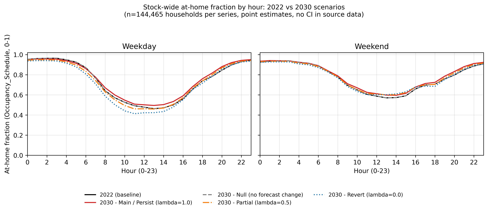
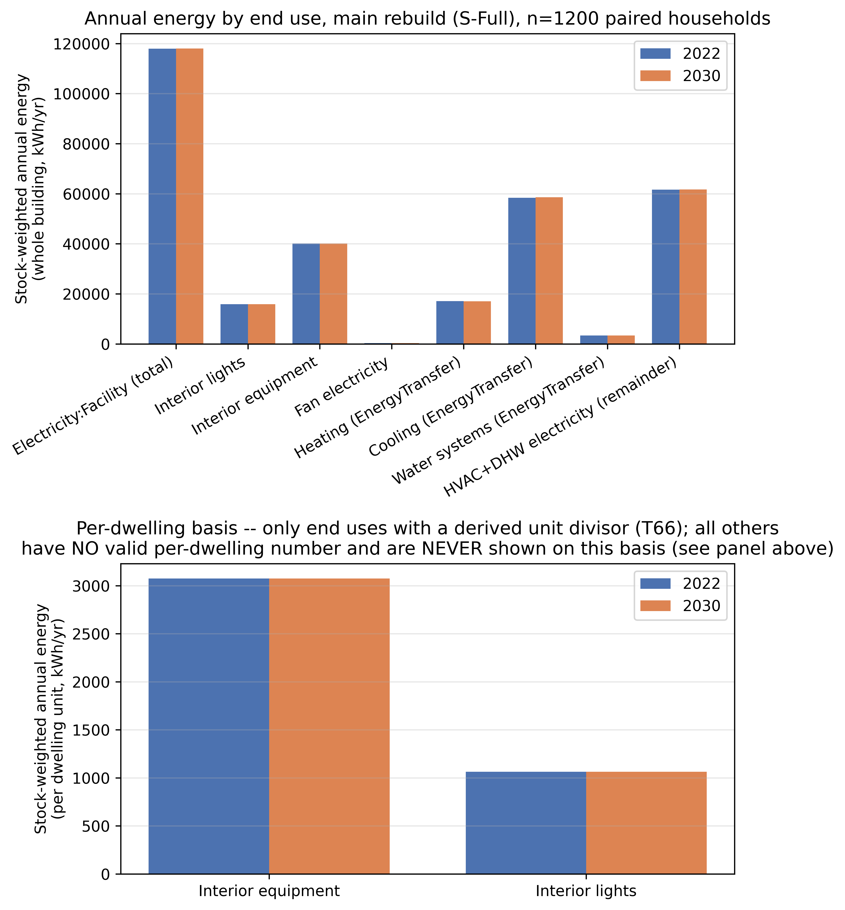
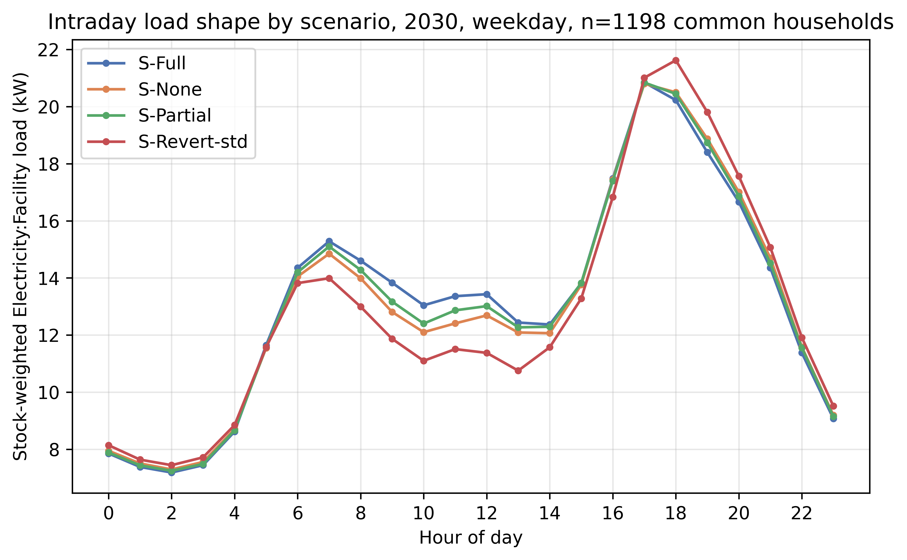
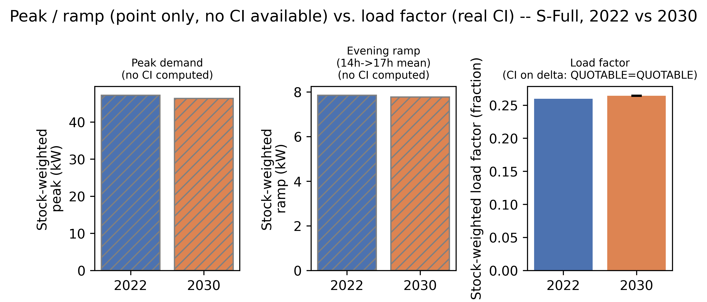
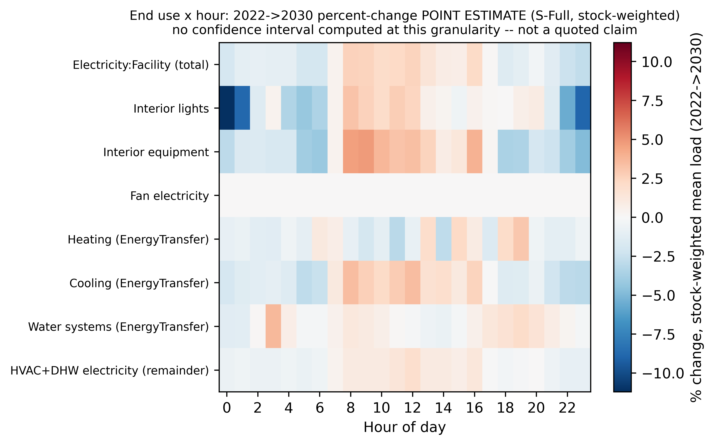
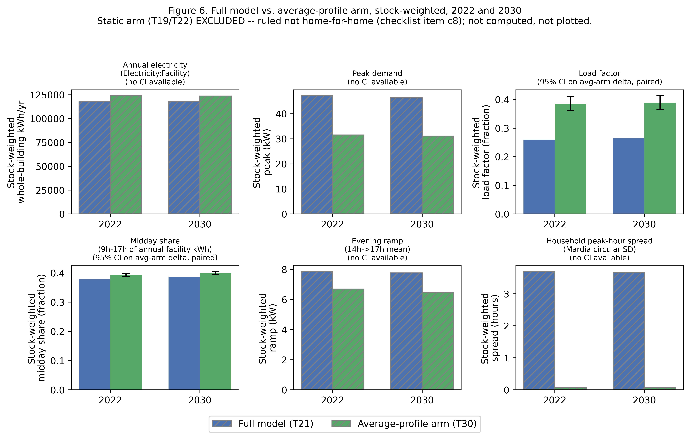
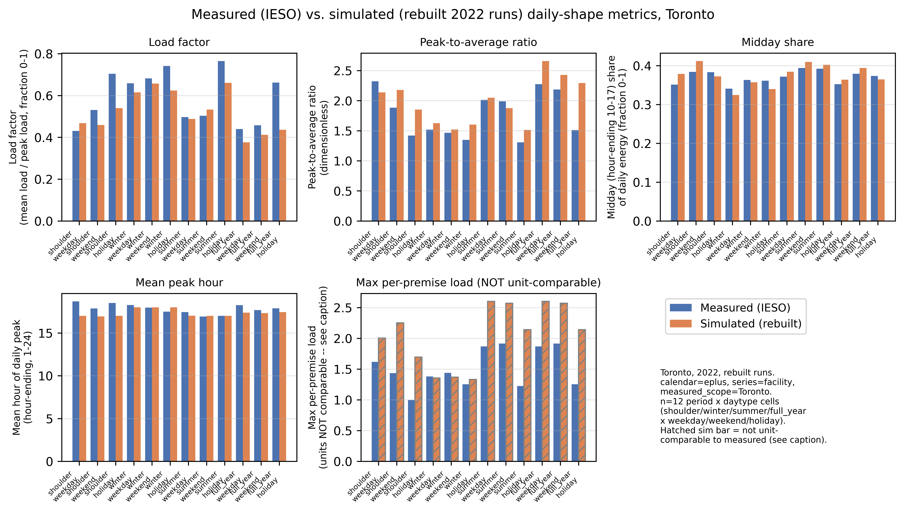

# From "How Much" to "When": Forecasting the Residential Energy Load Shape from a Calibrated Behavioural Occupancy Time-Series (Canada, 2005–2030)

# Abstract

Static, deterministic occupancy schedules in residential building energy simulation miss the timing of
demand, not only its annual total, and occupant behaviour became non-stationary through the COVID-19
pandemic, so the future load shape needs an explicit, stated persistence assumption rather than a single
prediction. This study builds a household-level, survey-based occupancy model for the Canadian housing
stock, checked on a held-out survey year, and carries it into paired, stock-scale building energy
simulation across several dwelling archetypes and climate zones, comparing 2022 against four stated 2030
scenarios: main persistence, partial persistence, full reversion, and a standardized-reversion check.
The household-level model is also compared against a simpler average-profile method on the same
households, and the simulated load shape is checked, not validated, against a year of measured Toronto
and Ontario electricity data. In 2022 the weekday at-home rate sits 4.73 percentage points
above its 2005-to-2015 trend. Under the main 2030 scenario, annual electricity is nearly
flat, rising 0.12 percent, while midday share rises 0.73 and load factor rises 0.49 percentage points,
both real changes. The scenario spread is real: full reversion falls 0.12 percent and the
standardized-reversion check falls 0.44 percent, while partial persistence is not distinguishable from
zero. The average-profile method shifts the annual total by about 9 percent in one cell but collapses
household-to-household peak-timing diversity almost to zero, diversity only the household-level model preserves. For
grid planning, this shift is mainly a timing question, not a sizing one: annual demand changes little,
but when it is delivered does.

# Highlights

- Annual electricity nearly flat (0.12 percent) as midday share and load factor rise.
- Reversion scenarios fall 0.12 to 0.44 percent; partial persistence is not detectable.
- 2022 weekday at-home rate sits 4.73 percentage points above the 2005-to-2015 trend.
- Household model keeps peak-timing diversity an average-profile method erases.
- Load shape checked, not validated, against measured Toronto/Ontario 2022 data.

# Keywords

Residential occupancy modelling; time-use survey data; stock-scale building energy simulation;
work-from-home scenarios; residential load shape; peak demand and load factor; Canadian housing stock.

# 1. Introduction

## 1.1 The performance gap and static occupancy schedules

The persistent gap between predicted and measured building energy use, the performance gap, remains a
central credibility problem for building performance simulation (de Wilde 2014); occupant behaviour is
now the largest identified unexplained driver (Yan et al. 2015; Hong et al. 2017), taken up directly by
IEA EBC Annex 66 and its successor Annex 79 (Yan et al. 2017; O'Brien et al. 2020). Routine practice
still relies on static, deterministic occupancy schedules drawn from reference standards, a poor fit
for residential buildings, where daily life follows individual routines rather than regulated
operation (Mahdavi et al. 2021). Fixed schedules miss day-to-day behavioural variability (Wilke, Haldi
and Robinson 2011; Elsayed et al. 2023): survey-derived occupancy profiles differ from standard
schedules by up to 41 percent at individual hours, a timing discrepancy, not an annual-energy one
(Mitra et al. 2020). Static schedules therefore carry a timing error an annual-total comparison cannot
reveal.

Timing matters because a home's daily load shape, not only its yearly sum, sets its contribution to
grid peak demand, the evening ramp, and demand-response suitability (Denholm et al. 2015). This study uses
2030 as its scenario horizon because it sits beyond the latest available survey data, requiring an
explicit assumption about how far the pandemic-era change has settled or receded, and because 2030 is
a commonly used planning horizon (IEA 2021); the Canadian time-use survey runs roughly every five
years, and no cycle after 2022 has been announced (Statistics Canada 2024a).

## 1.2 Two research tracks and the gap they leave open

Two research traditions address occupancy in building energy modelling and rarely meet. The first
builds high-fidelity stochastic occupant models, applied mostly to single buildings and already-elapsed
periods (Richardson, Thomson and Infield 2008; Widén and Wäckelgård 2010; Wilke et al. 2013; Aerts et
al. 2014), including a growing Canadian strand (Armstrong et al. 2009; Osman and Ouf 2021; Osman et
al. 2023; Ferreira et al. 2024). The second runs stock- and urban-scale energy engines across
thousands of dwellings but feeds them simplified, single-period schedules (Reinhart and Cerezo Davila
2016); Chen et al. (2022)'s paired stock-scale design is the closest precedent to this study.

Table 1 scores nine external studies and the authors' own prior work against six framework dimensions
(C1 to C6), present, absent or partial, by the written criterion given below the table, not an
unstated judgement call.

**Table 1.** Framework dimensions: external competitors, the authors' own prior work, and this study.

| Study | C1 Time-series occupancy | C2 Calibrated model | C3 Future-year scenario (pandemic break) | C4 Activity/end-use resolved | C5 Stock-scale | C6 Load-shape/peak |
|------------------------------------|:-----------:|:------------:|:-----------:|:---------:|:--------:|:--------:|
| Chiou et al. (2011) | check | cross | cross | check | cross | check |
| Widén and Wäckelgård (2010) | check | check | cross | check | cross | check |
| Reinhart and Cerezo Davila (2016) | cross | cross | cross | cross | check | cross |
| Fischer et al. (2020) | check | check | cross | check | cross | check |
| Motuzienė et al. (2022) | check | check | cross (footnote c) | cross | cross | cross |
| Chen et al. (2022, ResStock) | check | check | cross | check | check | check |
| Osman et al. (2023, Canada) | check | check | cross | check | cross | check |
| Yin et al. (2024) | check | check | cross | cross | cross | cross |
| Jalilian and Kamel (2025) | cross | cross | check | cross | check | cross |
| Authors' own prior line: companion journal manuscript, under review, and companion conference study (Iseri and Hachem-Vermette 2026) | check | check | cross | cross | P | P |
| **This study** | **check** | **check** | **check** | **check** | **check** | **check** |

Column criteria (one footnote per column):

a. **C1.** Present when occupancy varies within the day, not only as one daily or annual value.
b. **C2.** Present when parameters are fitted or checked against measured or surveyed data. Chiou et
   al. (2011) derives loads directly from diaries with no fitted model (absent); Yin et al. (2024) fits
   trend statistics to four decades of survey cycles (present, despite no simulation).
c. **C3.** Present only when the study projects to a stated year beyond its own data window. Motuzienė
   et al. (2022) predicts short-horizon pandemic occupancy, not a future year, so C3 is absent here
   (corrected from present in the archived table).
d. **C4.** Present when the model distinguishes specific activities, or the equipment and lighting
   loads they imply, not one presence indicator or total.
e. **C5.** Present when the study aggregates across many dwellings, not one or a few.
f. **C6.** Present when the study reports the sub-daily load curve or its peak, not only totals.

Chen et al. (2022) is the strongest external precedent, sharing five of six dimensions; the one it
lacks is C3, since it evaluates an already-elapsed period rather than carrying occupancy through the
pandemic break to a future year. That is the one axis of difference; no wider novelty claim is made.

The authors' own prior line would already score present on most dimensions, since it uses time-series,
calibrated occupancy at stock scale. It scores partial on stock-scale and load-shape focus (fewer
typologies, only a first look at peak timing) and absent on C3 and C4 (a same-period synthetic year,
presence-filtered end uses). The delta from that line is the pipeline-stage advances in Section 1.5,
not one more column; its publication status is unconfirmed.

## 1.3 Occupant behaviour is non-stationary

The assumption that occupant behaviour is stationary did not hold through the COVID-19 pandemic. Work
from home rose sharply, to roughly four times its pre-pandemic level: about 20 percent of full
workdays afterward, against 5 percent before (Barrero, Bloom and Davis 2021). Weekday electricity
profiles show a change associated with the pandemic and the shift to more work from home, the loss of
bimodal commuting peaks and a weekend-like weekday shape (Abdeen et al. 2021), with a weather-adjusted
increase of about 7.9 percent in electricity use associated with the pandemic period (Cicala 2023).
Occupancy-prediction models trained only on pre-pandemic data degrade sharply once this period is
crossed (Motuzienė et al. 2022), the problem a pre-pandemic-anchored projection would inherit.

What happens to work from home after 2022 is not settled by the material available here. This study
does not assume the pandemic-era at-home level holds unchanged to 2030; instead, the share of that
shift retained in 2030 is treated as an explicit, stated assumption tested across more than one value,
not a single predicted number (Barrero, Bloom and Davis 2023; Statistics Canada 2024b). A pre-pandemic-anchored projection would instead carry the structural break as a
systematic bias, misjudging not only how much energy is used but when.

## 1.4 Departure from the authors' prior line

The present study departs from a specific prior line by the authors: a conditional variational
autoencoder, a generative model referred to here as a C-VAE, paired with a cluster-based scheme, used
to synthesize longitudinally consistent Canadian residential occupancy schedules from successive
General Social Survey cycles and carry them into building energy simulation. That line spans a journal
treatment across several Montreal neighbourhood-unit typologies (companion manuscript, under review), a
companion conference study across three climate-zone cities (Iseri and Hachem-Vermette 2026), and a
related population-statistics and machine-learning occupancy framework (Iseri, Dino and Kalkan 2026).

That line established what this paper does not re-claim: that survey-grounded, time-series occupancy
can be built for Canadian building energy models and moves predicted heating and cooling demand
relative to default assumptions, with a first look at diurnal and peak timing. The predecessor asked
how much, comparing period-specific occupancy datasets against one default schedule in one climate
zone, ending at a same-period synthetic year. This paper asks when: cycle-versus-cycle and
within-household rather than default-versus-cycle; occupancy carried through the pandemic break to a
stated future year, 2030; scope widened to several Canadian dwelling archetypes across multiple
climate zones; end uses anchored to a national household-energy survey rather than filtered from
default profiles; and the primary result is the diurnal load shape, not annual totals.

## 1.5 Aim and contributions of the present study

This paper asks whether, and how, occupancy-driven change reshapes the residential load curve at
stock scale, under explicit work-from-home scenarios carried to 2030.

The paper makes three scientific contributions: a generative occupancy model chosen from a broader
architecture search against distributional checks the prior C-VAE line did not apply, preserving
sharper within-day activity timing (over 40 architectures searched); occupancy carried
through the pandemic break to 2030 under explicit scenarios, with the generator checked on a held-out
year (trained through 2015, tested on the unseen 2022 cycle) rather than on a same-period synthetic year; and attribution
from a paired, within-household stock-scale design holding the same households fixed across each
compared year pair, across multiple Canadian archetypes and climate zones (50 households per panel, 5,997 simulation runs).

It also makes two practical contributions: activity-resolved equipment and lighting loads checked
against a national end-use energy survey by dwelling type, a fitted-target check rather than an
independent validation of the sub-daily shape (48 of 48 cells within the plus or minus 15 percent band around the fitted target, agreement across dwelling-by-year cells); and diurnal load-shape metrics, load factor, midday energy share, and daily peak timing,
reported directly for grid ramping and demand-response planning rather than only annual totals.

None of these advances is specific to Canada: the pipeline needs a repeated national time-use survey,
a census-type household frame linking diaries to a dwelling stock, and a national end-use benchmark, a
trio supplied elsewhere by the American Time Use Survey (Chiou et al. 2011) and the Harmonised
European Time Use Survey (Eurostat 2018), whose guidelines the activity vocabulary here already
follows. What is country-specific is the calibration data and its magnitudes; the generator, the
held-out-year evaluation, and the paired design carry over unchanged.

The framework operationalizing this aim is in Section 2 (Sections 2.1 to 2.12); its limitations,
including scope, the scenario treatment of 2030, and the 2022 survey's collection-mode confound with
the pandemic-era shift, are stated in full in Section 5.

# 2. Proposed modelling and simulation framework

{width=16cm}

**Figure 1.** Overview of the framework (Sections 2.1 to 2.12). Time-use diaries and census households feed a generative occupancy model; the resulting household schedules and activity-driven loads drive building simulations for 2022 and for three 2030 work-from-home scenarios. Measured hourly load is used only as an external check, not as a model input.

The framework turns household time-use diaries into building-energy occupancy schedules through a
chain of eleven stages: diary harmonisation, a generative day-type model, marginal raking to match
independent targets, matching of diary donors to a census-representative population, household
aggregation into hourly schedules, activity-driven end-use loads, a scenario-based projection to a
future year, sampling of households for simulation, aggregation of simulation output to the national
housing stock, load-shape metrics, and a paired statistical comparison across years and across
alternative scheduling methods. Each stage is defined below.

**Table 2.** Datasets and their role in the framework.

| Dataset | Years / vintage | What it provides | Framework stage(s) |
|-----------|------------|------------------------------------------|------------------------------------|
| GSS time-use diaries | 2005, 2010, 2015, 2022 cycles | Respondent-level 10-minute activity and location diaries, harmonised to a common activity code list | Source diaries for the generative model (2.1, 2.2) and for the raking targets (2.3) |
| Census public-use microdata | 2021 | Household composition, dwelling type, tenure and geography for a representative population of households | Recipient population for diary matching (2.4) and the base population whose schedules are aggregated (2.5) |
| NRCan SHEU end-use reference | 2019 survey | National annual end-use energy totals by dwelling type (appliances, lighting) | Calibration target for the activity-driven end-use loads (2.6) |
| Weather files | typical-meteorological-year (TMYx) | Hourly outdoor conditions for each climate zone | Building simulation input alongside the injected schedules (2.5, 2.8) |
| Building archetype models | fixed archetype geometry and construction | Four dwelling archetypes at six city/climate-zone weather stations, the physical envelope each household's schedule is run against | Building simulation and stock aggregation (2.8, 2.9) |
| IESO measured hourly data | recent Ontario system data | Province-level measured hourly electricity data, used as an external reference series, not as a model input | External reference for the simulated load shape (referenced in 2.10 to 2.12; no simulation input role) |

## 2.1 Diary harmonisation to 30-minute slots

Each respondent's diary is first represented at 10-minute resolution as 144 activity codes
(`slot_001` to `slot_144`) and 144 binary at-home indicators (`home_001` to `home_144`), covering one full
day from a 04:00 origin. These are downsampled to 48 slots of 30 minutes for the generative model
and for every later stage. For slot $s \in \{1, \dots, 48\}$, the activity code is the majority vote
(mode) of the three underlying 10-minute codes, with the rare three-way ties resolved in a separate
step:

$$
\text{act30}_s = \operatorname{mode}\big(\text{slot}_{3s-2},\ \text{slot}_{3s-1},\ \text{slot}_{3s}\big)
\tag{1}
$$

and the at-home indicator is set to 1 when at least two of the three underlying slots are at home:

$$
\text{hom30}_s = \mathbb{1}\!\left[\ \sum_{k=1}^{3} \text{home}_{3(s-1)+k} \ \ge\ 2\ \right]
\tag{2}
$$

The resulting 48-slot series (`act30_001` to `act30_048`, `hom30_001` to `hom30_048`) is the unit
that every later stage of the framework consumes: the generative model's training target, the raking
target, the census-matched donor, and the household-schedule input to the building simulation are all
expressed in this same 48-slot, 04:00-origin form.

## 2.2 Generative day-type model

The model is a sequence model with an encoder-decoder structure: an encoder builds a single
conditioning representation from the respondent's demographic profile (age group, sex, marital
status, household size, labour-force status), the survey cycle, and the target day-type stratum
(weekday, Saturday, Sunday), and a decoder produces the 48-slot day conditioned on that
representation through cross-attention. At each slot $t$ the decoder outputs three sets of logits:
a 14-way activity categorical, a binary at-home indicator, and a 9-channel co-presence indicator
(who else is present). Training maximises a weighted combination of the per-slot negative
log-likelihoods of these three (conditionally independent, given the decoder state) distributions,
plus two regularisation terms:

$$
\mathcal{L} \;=\; \sum_{t=1}^{48}\Big[
\lambda_{\text{act}}\, \ell^{\text{act}}_t
\;+\; \lambda_{\text{home}}\, \ell^{\text{home}}_t
\;+\; \lambda_{\text{cop}}\, \ell^{\text{cop}}_t
\Big]
\;+\; \lambda_{\text{marg}}\, \ell_{\text{marg}}
\;+\; \lambda_{\text{aux}}\, \ell_{\text{aux}}
\tag{3}
$$

where $\ell^{\text{act}}_t$ is the categorical cross-entropy of the activity head against the
observed activity at slot $t$; $\ell^{\text{home}}_t$ is the binary cross-entropy of the at-home
head; $\ell^{\text{cop}}_t$ is the binary cross-entropy of the 9 co-presence channels, masked by
the availability of each co-presence channel for that respondent and, for the colleagues channel,
zeroed for cycles that do not carry a colleagues category; $\ell_{\text{marg}}$ is a
direction-agnostic penalty on the gap between the model's average at-home rate and the observed
average at-home rate; and $\ell_{\text{aux}}$ is a small auxiliary classification loss that predicts
the target day-type stratum from the decoder state. The $\lambda$ weights are fixed training
parameters, not fitted. Two further terms exist in the code (a logic-consistency penalty between the
at-home and co-presence heads, and a transition-rate penalty) but their default weight is zero, so
they do not enter the trained model discussed in this paper; they are noted here only because the
code defines them.

## 2.3 Marginal raking of at-home slots

Raking is applied after census-to-diary matching (section 2.4), to the matched population. Two rakes
adjust the at-home marginal, one per day-type stratum $s$ and 30-minute slot $t$: for the survey year,
the model-generated diary-days are raked to the at-home rate of the real respondents; for 2030, the
matched population is raked to the scenario target of section 2.7. Both use the same mechanism, which is a
single deterministic pass, not an iterative multiplicative procedure. For a target at-home rate
$p_{s,t} \in [0,1]$ and a group of $N_s$ diaries sharing stratum $s$, the integer target count is

$$
n^{\text{tgt}}_{s,t} = \operatorname{clip}\big(\operatorname{round}(p_{s,t}\, N_s),\ 0,\ N_s\big)
\tag{4}
$$

and the number of records to flip at slot $t$ is the shortfall against the current count of ones,
$n^{\text{cur}}_{s,t}$:

$$
\Delta_{s,t} = n^{\text{tgt}}_{s,t} - n^{\text{cur}}_{s,t}
\tag{5}
$$

If $\Delta_{s,t} > 0$, that many zero-valued records are flipped to one; if $\Delta_{s,t} < 0$, that
many one-valued records are flipped to zero. Candidates are chosen with priority given to records at
an activity-transition boundary (where the neighbouring slot's value differs from slot $t$), with
remaining ties broken by a fixed random seed. Because the target count is met exactly by
construction (up to the number of available candidate records), there is no convergence tolerance or
iteration count: one pass over every (stratum, slot) pair reproduces the target count exactly, or as
closely as the available candidates allow. The procedure is therefore a minimal-flip integer rake to
an exact per-slot count, not an iterative multiplicative proportional fitting. For the survey year, a
floor guard follows: a single-person household whose daily at-home mean the rake pushed below a fixed
floor has night slots restored to at home until the floor is met.

## 2.4 Census-to-diary matching

Each synthetic (census) household member is assigned a donor diary by a four-level fallback search,
attempted in order until a non-empty donor group is found for that Census record:

1. an exact match on age group, sex, marital status, household size, labour-force status and
   province, within the same day-type stratum;
2. a match on age group, sex, labour-force status and province only, within the same day-type
   stratum;
3. a match on age group and sex only, within the same day-type stratum;
4. a random draw from every diary of the same day-type stratum, regardless of demographics, used
   only when no donor shares even age group and sex.

Within whichever level supplies the donor group, one donor is drawn uniformly at random. The
day-type stratum itself is assigned to each Census record first (the census record carries no diary
day), with a fixed 5:1:1 weekday-to-Saturday-to-Sunday probability split. All random draws use a
fixed seed. Survey cycle is not a matching key: the donor pool for a given year is built from that
year's own diaries only (2022 diaries for the 2022 stock; each earlier cycle from its own diaries).
Metropolitan area is not a key either; it is nested within province and was dropped from the first
level so that more people keep household size as a matched attribute. As a consequence, a donor
shares the recipient's metropolitan area less often, which is stated as a limitation.

## 2.5 Household aggregation and conversion to schedules

Once every household member has a 48-slot activity and at-home series (from the harmonised diary,
the generative model, or the matched donor, depending on the year), the household-level schedule is
built by averaging across members. For household $h$, day type $d$ (weekday or weekend, with
Saturday and Sunday pooled into one weekend day type) and slot $t$, the fraction of the household at
home is the mean of the members' at-home indicators:

$$
\text{occ48}_{h,d,t} = \frac{1}{M_h}\sum_{m=1}^{M_h} \text{hom30}_{h,d,t}^{(m)}
\tag{6}
$$

where $M_h$ counts the member diary-days pooled into that day type (Saturday and Sunday records
both enter the weekend mean). The household metabolic rate is the mean, over the same records, of a
fixed activity-to-watts lookup applied to each activity code (a fixed default applies to codes
without an entry):

$$
\text{met48}_{h,d,t} = \frac{1}{M_h}\sum_{m=1}^{M_h} W_{\text{met}}\!\big(\text{act30}_{h,d,t}^{(m)}\big)
\tag{7}
$$

Both 48-slot series are then averaged pairwise into 24 hourly values,
$\text{occ24}_{h,d,k} = \tfrac{1}{2}(\text{occ48}_{h,d,2k-1} + \text{occ48}_{h,d,2k})$ for hour
$k = 1,\dots,24$ (and likewise for the metabolic series), and the result is rolled by four hours so
that clock hour 0 (midnight) lines up with the weather file's clock; the diary's own origin is 04:00,
not midnight. The equipment and lighting fractions from section 2.6 are attached to the same
household/day-type/hour rows after the same four-hour roll. The output is one row per household, day
type and hour, in the column format the building-simulation stage's schedule-injection function
consumes; each household contributes exactly one weekday row set and one weekend row set to the
schedule file used for that year's simulation.

## 2.6 Activity-driven end-use loads and the calibration scalar $f_e$

End-use equipment power and lighting state are built slot by slot from the same household diary,
before the 48-to-24 averaging of section 2.5. At slot $t$, with $n_t$ household members present
(at home) and their activities $a_1, \dots, a_{n_t}$, the raw equipment power is a baseload plus a
sum over device categories:

$$
P_t = P_{\text{base}} + \sum_{b \in B_{\text{shared}}} \Big(\max_{i=1,\dots,n_t} w_b(a_i)\Big) P_b\, \eta(n_t)
\;+\; \sum_{b \in B_{\text{personal}}} \Big(\sum_{i=1,\dots,n_t} w_b(a_i)\Big) P_b
\;+\; P_{\text{dw}}(t)\, \eta(n_t)
\tag{8}
$$

where $B_{\text{shared}}$ is the set of appliance categories one household uses at a time (cooking,
washer, dryer, television), $B_{\text{personal}}$ is the set used per person (a personal computer),
$w_b(a)$ is a fixed weight giving how strongly activity $a$ implies use of category $b$, $P_b$ is a
fixed rated power for category $b$, $\eta(n_t)$ is a fixed, non-decreasing diminishing-returns factor
for shared-device co-occupancy ($\eta(0)=0$, $\eta(1)=1$, saturating at a fixed cap for five or more
present members), and $P_{\text{dw}}(t)$ is a separate dishwasher term that, once triggered by a
present member's activity, runs for a fixed number of slots and then enforces a fixed cooldown before
it can trigger again. The lighting indicator is binary: $\text{light}_t = 1$ if any present member's
activity has a non-zero lighting weight, else 0.

The 48-slot raw series is averaged into 24 hourly values exactly as in section 2.5, then scaled to an
external annual-energy target by dwelling type from the NRCan SHEU reference (the equipment target is
net of the refrigerator load already represented separately in the building model, to avoid
double-counting). Writing $E_{\text{raw}}$ for the raw annual equipment energy implied by the 24-hour
weekday/weekend profile and a fixed weekday/weekend day count, and $E_{\text{tgt}}$ for the SHEU
target for that dwelling type, the calibration scalar is

$$
f_e = \frac{E_{\text{tgt}}}{E_{\text{raw}}}
\tag{9}
$$

applied to the peak raw hourly power to obtain the building-simulation design power, and to the raw
hourly series (divided by its own peak) to obtain a 0-1 equipment fraction schedule. Lighting is
scaled the same way, using total annual lit-hours in place of raw energy. This SHEU agreement is a
calibration of the design power and duty fraction to an external annual total: it is not a
validation of the sub-hourly shape, which is not compared against any external end-use time series.

## 2.7 2030 scenario construction

The 2030 stock keeps the same households and the same raking mechanism as section 2.3, changing only
the at-home target. A linear trend $\text{slope}_{s,t}$ is fit through the 2005, 2010 and 2015
cycle's stratum-slot at-home means, and the 2022 deviation from that trend line,
$\text{jump}_{s,t} = \text{obs}_{2022,s,t} - \text{trend}_{s,t}(2022)$, is treated as a pandemic-era
level shift that may or may not persist. Three scenarios differ only in the share $\lambda$ of that
shift assumed to remain in 2030:

$$
\text{target}_{\lambda}[s,t] = \operatorname{clip}\Big(
\text{stock}_{2022}[s,t] + 8 \cdot \text{slope}_{s,t} - (1-\lambda)\,\text{jump}_{s,t}
,\ 0,\ 1\Big),
\qquad \lambda \in \{1,\ 0.5,\ 0\}
\tag{10}
$$

so that $\lambda = 1$ keeps the full 2022 shift, $\lambda = 0.5$ assumes half of it has faded, and
$\lambda = 0$ assumes it has fully faded and 2030 sits on the pre-2022 trend line. A second,
standardised version of the same equation, $\text{target}_{\text{std}}$, uses a trend and a shift
computed after reweighting every cycle's diaries to the 2030 stock's age-group by sex by
labour-force-status composition, reported alongside the primary version as a sensitivity check. The
result is a target array in the same form as section 2.3, raked exactly as there. This is a
scenario-based projection of a stated persistence assumption, not a forecast: no scenario claims to
predict which value of $\lambda$ will occur.

## 2.8 Sampling procedure

For each of the 24 modelled cells (4 dwelling archetypes $\times$ 6 city/climate-zone stations),
the candidate pool is every household identifier present in the schedule files of all years
simulated together, restricted to that cell's archetype and province, and further restricted to the
households whose loaded schedules pass the integration layer's own plausibility check on the daily
occupancy pattern. The pool therefore depends on the numeric content of the schedule files, not only on
which households they list; the supplementary material states what this implies for comparing the
schedule set used in this study against an earlier one. From this pool, $N = 50$ households are drawn
without replacement:

$$
\text{sample} = \text{SRS}_{\text{without replacement}}(\text{pool}_{\text{cell}},\ N=50)
\tag{11}
$$

falling back to sampling with replacement only if the pool itself holds fewer than 50 households for
that cell (not encountered in the campaign reported in this paper). The random generator for each
cell is seeded by a fixed base seed together with a deterministic offset derived from a hash of the
cell's own label, so that the same base seed reproduces the same 50 households for a given cell on
any machine. The same 50 households are used for every cycle-year simulated for that cell (a paired
panel): only the injected occupancy, equipment and lighting schedule changes by year, while the
building archetype and weather file are held fixed.

## 2.9 Stock aggregation weights

To summarise the 24 simulated cells as one national figure, each cell's result is weighted by its
dwelling archetype's share of the national housing stock (an external reference composition, held
fixed across all years and not derived from this paper's own samples), renormalised over the four
modelled archetypes, and that archetype-level weight is split equally across the (up to six) cities
that host that archetype:

$$
w_{a,c} = \frac{w_a}{\lvert C_a \rvert}, \qquad \sum_{a} w_a = 1
\tag{12}
$$

where $C_a$ is the set of cities simulated for archetype $a$. A national metric is then the
weight-average of the 24 cells' values, $\bar{x} = \sum_{a,c} w_{a,c}\, x_{a,c}$; for the circular
peak-hour metric of section 2.10, the averaging is done on the sine and cosine components before
re-computing the mean angle, for the same reason circular quantities cannot be averaged directly
(the 23:00-to-00:00 wrap).

## 2.10 Load-shape metrics

All load-shape metrics are computed from the hourly whole-building electricity meter, after
conversion from the simulator's native energy units to kW. Annual energy is the sum of the 8,760
hourly kW values for the year. Daily peak is the mean, over the year's days, of that day's maximum
hourly kW. The peak hour of day is circular (0-23, wrapping at midnight), so its central tendency
uses the circular mean: with angle $\theta_i = 2\pi h_i / 24$ for each day's peak hour $h_i$,

$$
\bar{h} = \frac{24}{2\pi}\, \operatorname{atan2}\!\Big(\overline{\sin\theta},\ \overline{\cos\theta}\Big) \bmod 24
\tag{13}
$$

and its dispersion is Mardia's circular standard deviation, from the resultant length
$R = \sqrt{\overline{\sin\theta}^2 + \overline{\cos\theta}^2}$:

$$
\text{sd}_{\text{circ}} = \frac{24}{2\pi}\sqrt{-2\ln R}
\tag{14}
$$

Load factor is the ratio of the year's mean hourly load to its single annual peak hourly load,
$\text{LF} = \overline{P}/P_{\max}$. Midday share is the fraction of annual energy delivered in the
09:00-17:00 window, $\text{midday} = \sum_{h \in [9,17)} P_h \big/ \sum_h P_h$. Morning-leaning share
is the fraction of units (households or days, depending on the aggregation level) whose circular
mean peak hour falls in $[0,12)$. Evening ramp is the increase in whole-building hourly load from the
14:00 hour to the 17:00 hour, averaged over the 365 days of the year,
$\text{ramp} = \frac{1}{365}\sum_{d} (P_{d,17} - P_{d,14})$.

## 2.11 Paired difference and its confidence interval

Every year-to-year or arm-to-arm comparison in this paper uses the same paired-difference
construction. For a metric $M$ and two conditions (for example, simulation years) A and B, the
household-level results are joined on the household's identifying key (archetype, city, household
identifier), keeping only households present under both conditions, and the paired difference is

$$
d_i = M_i^{(B)} - M_i^{(A)}
\tag{15}
$$

for each of the $n$ paired households. The reported interval is the standard pooled paired
Student-t 95% confidence interval on the mean difference,

$$
\bar{d} \;\pm\; t_{0.975,\,n-1}\ \frac{s_d}{\sqrt{n}}
\tag{16}
$$

where $s_d$ is the sample standard deviation of $d_i$ across the $n$ paired households (pooled
across every simulated cell, not computed separately per cell), and a one-sample t-test of
$H_0: \bar{d}=0$ is reported alongside it. A difference is treated as separable from zero only when
this interval excludes zero. This interval treats households as independent and does not account for
households sharing a city or an archetype; the consequence of that clustering is examined in the
Supplementary Information.

## 2.12 Comparison arms

Two simplified scheduling methods are run against the same sampled households and the same
per-household calibrated design powers as the full framework, to isolate what the framework's
diary-based schedule contributes.

The fixed-schedule arm replaces the household's own occupancy, equipment and lighting schedule with
a single reference schedule (the standard residential mid-rise weekday/weekend profile shipped with
the building-model templates) that does not depend on the household, the archetype, or the simulated
year:

$$
S^{\text{fixed}}_{h,d,k} = R_{d,k} \qquad \text{for every household } h
\tag{17}
$$

The average-survey-profile arm instead uses the framework's own diaries, but removes all
household-to-household variation within a cell by assigning every sampled household the same,
cell-level average profile for that year: for cell $c$ and year $y$, with $\text{Pool}_c$ the full
candidate population of that cell (not only the 50 sampled households),

$$
S^{\text{avg}}_{c,y,d,k} = \frac{1}{\lvert \text{Pool}_c \rvert} \sum_{h \in \text{Pool}_c} S^{\text{full}}_{h,y,d,k}
\qquad \text{for every sampled household in } c
\tag{18}
$$

applied identically to the occupancy, equipment fraction, lighting fraction and metabolic series;
each household's own SHEU-calibrated design powers (section 2.6) are kept, so only the sub-daily
shape is replaced, not the annual scale.

## Symbol list

- $s$: day-type stratum (weekday, Saturday, Sunday), or archetype index in section 2.9 where noted.
- $t$: a 30-minute slot index, $t = 1,\dots,48$, 04:00 origin.
- $h,k$: an hour-of-day index, $h,k = 0,\dots,23$ (clock time) or $1,\dots,24$ (position).
- $\text{act30}_t$, $\text{hom30}_t$: the 48-slot activity code and at-home indicator for one diary-day.
- $M_h$: number of member diary-days of household $h$ pooled into one day type.
- $p_{s,t}$: an external target at-home rate for stratum $s$, slot $t$.
- $N_s$: number of diary-days in stratum $s$ being raked.
- $\lambda$: the work-from-home persistence share retained in the 2030 scenario, $\lambda \in \{0, 0.5, 1\}$.
- $\lambda_{\text{act}},\lambda_{\text{home}},\lambda_{\text{cop}},\lambda_{\text{marg}},\lambda_{\text{aux}}$: fixed training loss weights (Eq. 3).
- $w_a$, $w_{a,c}$: national dwelling-stock share of archetype $a$, and its per-city split.
- $B_{\text{shared}}$, $B_{\text{personal}}$: appliance categories used once per household, or once per present person.
- $w_b(a)$: fixed weight of activity $a$ toward appliance category $b$.
- $P_b$, $P_{\text{base}}$: fixed rated power of appliance category $b$, and the fixed baseload power.
- $\eta(n)$: fixed diminishing-returns factor for $n$ co-present members sharing a device.
- $f_e$: the equipment calibration scalar, target annual energy divided by raw annual energy (Eq. 9).
- $R$: the resultant vector length of a circular mean (Eq. 14); $\bar{h}$, $\text{sd}_{\text{circ}}$: circular mean and standard deviation of an hour-of-day quantity.
- $d_i$: the paired difference in a metric for household $i$ between two conditions; $\bar{d}, s_d$: its mean and standard deviation across $n$ paired households.

# 3. Results

The subsections below trace one path through the pipeline: how the at-home pattern itself
differs between 2022 and three stated 2030 assumptions (3.1, 3.2), what that does to annual
electricity by end use (3.3), how it reshapes the daily load curve (3.4), what a simplified
average-profile scheduling method would have shown instead on the same households (3.5), how the
simulated load shape compares with a year of real measured data for one city (3.6), and two
robustness checks reported briefly here with full detail in the Supplementary Information (3.7,
3.8).

## 3.1 Occupancy change

The at-home occupancy series is built on a stock frame of 144,465 census households (Section 2.5,
Section 2.9), covering the 2022 survey cycle directly and four 2030 variants built from the
scenario construction of Section 2.7. The values below are read at one representative point, a
weekday at noon (hour 12), with the full 24-hour, weekday-and-weekend series shown in Figure
2.

At weekday noon in 2022, 47.8 percent of the stock is at home. For 2030, four variants were run
side by side rather than a single projection: a main scenario that assumes the pandemic-era rise in
at-home behaviour persists in full (47.8 percent moving to 50.1 percent); a partial-persistence
scenario that assumes half of that shift has faded by 2030 (46.2 percent); a full-reversion scenario
that assumes the shift has faded completely and 2030 sits back on the pre-pandemic trend (42.3
percent); and a no-change control that reproduces the 2022 pattern unmodified (47.8 percent,
identical to the 2022 value to the last reported digit, itself an acceptance check on the
scenario-construction code rather than a scenario in its own right). These four numbers describe
the household schedules built under each stated persistence assumption (Section 2.7); they are a
designed comparison of assumptions, not a claim that any single one of them is what will actually
occur in 2030.

Averaged over the whole weekday, 74.4 percent of household-hours are spent at home in 2022. The
three 2030 scenarios move this whole-day weekday share by 1.49 percentage points (main scenario),
negative 0.85 percentage points (partial persistence) and negative 3.21 percentage points (full
reversion); these are the designed steps from 2022, not attained targets. The pandemic-era break
that the scenarios carry forward or remove is measured on the survey respondents themselves: in
2022 the national weekday at-home rate sits 4.73 percentage points above where the 2005 to 2015
trend would have placed it, and 7.67 percentage points above it when every survey cycle is first
reweighted to the housing stock's age, sex and labour-force mix (the standardized sensitivity behind the
standardized-reversion variant). The main scenario keeps that break and adds the 2005 to 2015
trend carried forward, which is why its step (1.49 percentage points) is positive; the full-reversion
scenario removes the break and keeps the trend, which is why its step is negative.

{width=16cm}

**Figure 2.** Weekday and weekend at-home
fraction by hour of day, 2022 stock baseline and four 2030 variants (main persistence scenario,
partial-persistence scenario, full-reversion scenario, no-change control), on the 144,465-household
stock frame.

## 3.2 The 2030 scenarios

Three named 2030 scenarios, plus one standardized sensitivity variant, are compared on the
households they share. The four scenario arms were built and sampled independently and do not all
cover the same households (1,200 for the main scenario, 1,198 for the full-reversion scenario, 1,200
for the partial-persistence scenario and 1,199 for the standardized-reversion variant); every
cross-scenario comparison in this subsection, and in Figures 4 and 6, uses
only the 1,198 households present in all four arms. This restriction is stated once here rather than
repeated at every number below.

Under the full-reversion scenario (code S-None), stock-weighted whole-building electricity use falls
by 0.1225 percent from 2022 to 2030 (95 percent confidence interval negative 0.1480 to negative
0.0964 percent), a real change since the interval excludes zero. Under the partial-persistence
scenario (code S-Partial), the equivalent change is 0.0117 percent with a confidence interval of
negative 0.0065 to 0.0351 percent: because that interval contains zero, this is no detectable change
at this sample size, not an increase. Under the standardized-reversion variant (code S-Revert-std,
built with the trend and the pandemic-era jump recomputed after reweighting every survey cycle to
the housing stock's age, sex and labour-force mix), whole-building electricity falls by 0.4408 percent (95
percent confidence interval negative 0.4668 to negative 0.4136 percent), the largest change of the
three scenario arms. Across all eight end-use meters and all three scenario arms, fan electricity
shows no change in any arm (0.0 percent, interval 0.0 to 0.0), read directly from each arm's own
file rather than assumed.

The same pattern holds for the load-shape metrics. Under the full-reversion scenario, midday energy
share changes by negative 0.127 percentage points (95 percent confidence interval negative 0.307 to
positive 0.061 percentage points): no detectable change at this sample size. Under the
partial-persistence scenario, load factor changes by 0.026 percentage points (95 percent confidence
interval negative 0.042 to positive 0.092 percentage points): also no detectable change. Under the
standardized-reversion variant, both shape metrics show a change that excludes zero: midday share
falls by 1.383 percentage points (95 percent confidence interval negative 1.610 to negative 1.138)
and load factor falls by 1.365 percentage points (95 percent confidence interval negative 1.475 to
negative 1.253). This is the most clearly separable shape change among the three scenario arms.

## 3.3 Annual energy by end use

Under the main scenario, annual electricity is nearly flat: whole-building electricity use, weighted
to the national housing stock, rises by 0.1209 percent from 2022 to 2030 (95 percent confidence
interval 0.0981 to 0.1407 percent), a small but real change since the interval excludes zero.
Underneath that near-flat total, the mix of end uses, and (Section 3.4) the timing of demand, move
more than the total does; that is the pattern the rest of this Results section documents. At the
stock level, whole-building electricity use is 117,942.5 kWh in 2022 and 118,049.8 kWh in
2030, on a simulated stock of 1,200 households, 300 per archetype (Figure 3).

Among the individual meters, interior lighting falls by 0.0157 percent (95 percent confidence
interval negative 0.0274 to negative 0.0043 percent) and interior equipment falls by 0.0066 percent
(95 percent confidence interval negative 0.0119 to negative 0.0012 percent); both exclude zero. Fan
electricity shows no change (0.0 percent, interval 0.0 to 0.0). Heating energy transfer falls by
0.2905 percent (95 percent confidence interval negative 0.4049 to negative 0.1746 percent). Cooling
energy transfer rises by 0.5947 percent (95 percent confidence interval 0.5235 to 0.6523 percent),
water-systems energy transfer rises by 0.5806 percent (95 percent confidence interval 0.3419 to
0.7845 percent), and the remaining HVAC-and-domestic-hot-water electricity rises by 0.3578 percent
(95 percent confidence interval 0.2863 to 0.4166 percent); all three exclude zero. Heating, cooling,
water systems, and the HVAC and domestic-hot-water remainder are reported only at the whole-building
level, since no per-dwelling divisor exists for these meters. Per-dwelling annual energy is reported
only for equipment and lighting, the two meters with a defined per-dwelling divisor: stock-weighted
interior lighting falls from 1,062.7 to 1,062.6 kWh per dwelling per year, and interior equipment
falls from 3,075.5 to 3,075.3 kWh per dwelling per year (levels, not a bootstrapped change).

As an additional check, equipment and lighting energy were compared against their fitted SHEU
calibration target using a check that compares simulated and survey end-use totals; this is a
report-only check with a band of plus or minus 15 percent around the fitted target, not an
independent validation against outside data. All 48 archetype-by-city-by-year cells pass this check.
Energy use intensity, taken as total site energy of all fuels divided by net conditioned floor area
and summed over the 50 simulated buildings of each archetype in all six cities (300 simulations per
archetype and year), is 116.0 kWh/m² for single-detached houses, 100.5 kWh/m² for other dwellings,
107.8 kWh/m² for mid-rise and 78.6 kWh/m² for high-rise buildings in 2022. The 2030 main-scenario
values are 116.3, 100.6, 107.8 and 78.6 kWh/m²; these are simulated levels, not a tested change.

{width=16cm}

**Figure 3.** Panel A: stock-weighted
whole-building annual energy by end use, 2022 versus 2030, main scenario, all eight meters. Panel B:
stock-weighted per-dwelling annual energy for interior equipment and interior lighting only, the two
meters with a defined per-dwelling divisor.

## 3.4 Load shape: peak, load factor, midday share, ramp

Load factor, the ratio of the year's mean hourly load to its single annual peak hourly load
(Section 2.10), rises under the main scenario by
0.49 percentage points from 2022 to 2030 (95 percent confidence interval 0.41 to 0.57 percentage
points), a change that excludes zero. Midday share, the fraction of annual energy delivered between
09:00 and 17:00, rises by 0.73 percentage points (95 percent confidence interval 0.62 to 0.86
percentage points, using the interval that accounts for households sharing a city and an archetype;
Section 3.8 reports how much wider this interval is than one that ignores that clustering, and why
the wider one is used here). Both changes exclude zero.

Peak demand and evening ramp are reported as point values only, since no confidence interval is
available for either metric: stock-weighted peak demand falls from 47.207 kW
in 2022 to 46.332 kW in 2030, and the stock-weighted evening ramp falls from 7.852 kW to 7.768 kW;
no interval is available for either figure.

The stock-average weekday load shape for 2030 (Figure 4, the 1,198 common households)
reaches its maximum at hour 17 of the day under the main scenario, the partial-persistence scenario
and the full-reversion scenario, and at hour 18 under the standardized-reversion variant; hour 17
uses the same clock-aligned hour numbering as the rest of the framework (Section 2.5's four-hour
roll), corresponding to the late-afternoon hour beginning around 5 p.m. The standardized-reversion
variant also shows a visibly flatter midday and a higher evening peak than the other three arms. No
stock-weighted, all-city mean-peak-hour trend across multiple survey cycles, and no coincidence-factor
figure, is reported; neither is stated here. Sections 3.5 and 3.6 report two other
kinds of peak-timing evidence: household-level circular-mean ranges from the full model, and a
measured-data comparison for one city.

The end-use-by-hour percent-change heatmap (Figure 6, 192 cells, all eight end-use meters
by 24 hours) is descriptive. For whole-building electricity it shows consumption falling slightly in
the overnight and late-evening hours and rising through the daytime hours, consistent with more of
the stock being home during the day. No single cell in this heatmap is quoted here as an individually tested
change, since no confidence interval exists at this hour-by-end-use granularity.

{width=16cm}

**Figure 4.** Intraday weekday load shape,
2030, all four scenario arms, on the 1,198 households common to all four.

{width=16cm}

**Figure 5.** Peak demand and evening
ramp, 2022 versus 2030, point values with no confidence interval (shown visually distinct from load
factor, which carries a confidence interval).

{width=16cm}

**Figure 6.** End-use by hour percent-change
heatmap, 2022 to 2030, main scenario, descriptive only.

## 3.5 Comparison with an average-profile model

To isolate what the household-level diary-based schedule contributes over a simpler description of
occupancy, the full model (used throughout Sections 3.1 to 3.4) was compared against an
average-profile arm that keeps each household's own calibrated design power but replaces its
individual schedule with the average schedule of its own archetype-and-city cell (Section 2.12). A
separate fixed-schedule arm is not part of this comparison,
since it is not a home-for-home comparison. The comparison table
covers 1,104 rows across 24 cells and both years; 850 of these rows carry a usable point comparison
and 254 do not, and any single number drawn from this table was checked against its own row before
being quoted here.

One illustrative cell: for the single-detached archetype in Toronto in 2022, whole-building
electricity use is 8,225.56 kWh under the full model and 8,951.40 kWh under the average-profile arm,
a difference of 725.84 kWh; this is a per-cell illustration, not a stock-weighted figure, and no
confidence interval is available for this cross-arm comparison. The two arms differ far more in
household-to-household diversity of peak timing than in this annual total. Household-level dispersion
in peak hour (a circular standard deviation, since peak hour wraps at midnight, Section 2.10) for the
same cell is 3.493 hours under the full model against 0.084 hours under the average-profile arm in
2022, and 3.255 hours against 0.053 hours in 2030: the average-profile arm collapses household-to-
household diversity in peak timing almost to zero, which follows directly from assigning every
sampled household the same schedule by construction, not from a data finding. Across the six
simulated cities, the full model's household-level circular mean peak hour for the single-detached
archetype ranges from 15.05 to 16.78 hours in 2022 and from 15.24 to 16.62 hours in 2030; this range
is reported for the single-detached archetype only, since that is the only archetype for which the
comparison table's per-city rows are reported here.

{width=16cm}

**Figure 7.** Full model versus
average-profile arm: annual whole-building electricity and household-level peak-hour statistics, by
cell.

## 3.6 Independent measured check, Toronto/Ontario 2022

The simulated load shape was compared against a year of real measured hourly electricity data for
Toronto and for Ontario as a whole in 2022 (Section 2.10 defines each metric and names the
measured data source). For the shoulder season on a weekday, the simulated load factor is 0.4680
against a measured value of 0.4305, a difference of 0.0376. Simulated midday share is 0.3787 against
a measured 0.3513; simulated peak-to-average ratio is 2.1367 against a measured 2.3231; and the
simulated peak hour is 17.0 against a measured 18.69. Summer and winter weekday comparisons for both
the Toronto and the Ontario measured scopes are read the same way, twelve real-world period-and-
day-type groups in total, and are shown in full in Figure 8 rather than repeated here. No
confidence interval exists on either side of any of these comparisons; they are point statistics, not
bootstrapped.

One metric in this file, the maximum kWh per premise, is not comparable between the simulated and
the measured side despite sharing a column name: the two sides measure this quantity on different
scales (for example, 2.006 simulated against 1.617 measured for the Toronto shoulder weekday cell),
so Figure 8 draws this comparison hatched and labelled not comparable, and no value from
this row is used as a like-for-like statement anywhere in this paper.

Two further checks support the plausibility of these results. First, a sanity ratio between the
occupancy-only simulations and a previously published campaign shows that occupancy-only changes
barely moved annual whole-building electricity: the ratio is 1.0075 for
single-detached, 0.9997 for other-dwelling, 1.0017 for mid-rise and 1.0072 for high-rise, all within
0.8 percent of one. Second, annual whole-building electricity per dwelling for 2022 is quotable
only for the single-detached archetype, 8,225.56 kWh per dwelling per year, since this is the one
archetype with an unambiguous divisor of one dwelling per building; the equivalent per-dwelling
figures for the other three archetypes would need a building-to-dwelling divisor for whole-building
electricity, which is defined only for the equipment and lighting meters, so those three
archetypes are reported here only through the whole-building sanity ratios above, not as per-dwelling
energy figures.

{width=16cm}

**Figure 8.** Simulated versus measured
load-shape metrics, Toronto and Ontario, 2022, by season and day type; maximum kWh per premise shown
hatched and labelled not comparable.

## 3.7 Sample-size check

A separate sampling check compares the confidence-interval half-width obtained from the project's
standard 50-household sample against a larger, 150-to-200-household check, across the four Montreal
archetype cells and six load-shape and energy metrics (24 cell-by-metric combinations; 144 of 144 expected rows found; full detail in the
Supplementary Information, Figure S1). The half-width is larger at 200 households than at
150 households in all 24 of 24 tested combinations. This is a change in how the interval is computed
at each sample size, not evidence that the estimate does not settle with more households: the
200-household interval uses a parametric interval on the real full sample, while the smaller sizes
use a bootstrap of 1,000 subsamples drawn from that same 200-household set, and the two methods are
not expected to produce the same half-width even when the underlying estimate is stable. One
illustrative cell, the single-detached archetype in Montreal, shows a half-width of 2.4475 kWh at 150
households against 4.2046 kWh at 200 households for the 2022-to-2030 electricity change. The check
covers Montreal only.

## 3.8 Robustness of model selection and intervals

**Model selection.** Four candidate models clear all four selection checks at their original
thresholds; the model used throughout this paper is the candidate with the best combined score among
the four that passed all checks. Its own scores are an activity Jensen-Shannon divergence of 0.0191, an at-home
root-mean-square error of 4.57 percentage points, a spousal co-presence gap of negative 2.03
percentage points, and a composite score of 0.6355 (Supplementary Information Table
S1). A threshold-sensitivity check, varying each of the four check thresholds
individually by 10 percent and then by 20 percent, finds that the selected model changes in 2 of 21
tested scenarios (both a 20 percent tightening of the at-home threshold), where selection instead
falls to a different candidate with only one of four to six candidates passing; in the remaining 19
of 21 scenarios the selected model stays eligible and is still chosen. Selection is therefore not
sensitive to moderate changes in three of the four thresholds, and sensitive to the fourth only at
the most aggressive tightening tested (Supplementary Information Figure S2). Two of
the four thresholds were set to match values already achieved by an earlier baseline version of the
model, one threshold has no stated independent rationale, and one check was tightened during
development from 10 to 5 percentage points with no stated reason; this threshold provenance is
reported as a stated limitation of the selection procedure, not as an error in the chosen model.

**Clustering-aware intervals.** Because households in this study share a city and an archetype, a
resampling method that accounts for that clustering (a cell-level cluster bootstrap) was compared
against a plain pooled interval that ignores it, for the two shape metrics used in Section 3.4. For
midday share, the cluster-aware interval is 0.00243 wide against 0.00174 for the plain interval,
about 40 percent wider, a real and material effect of clustering; the interval used in Section 3.4 is
this wider, cluster-aware one. For load factor, the cluster-aware interval is 0.00161 wide against
0.00165 for the plain interval, about 2 percent narrower, a negligible difference within Monte Carlo
noise. Both methods keep both metrics' intervals on the same side of zero, so no conclusion in this
paper flips depending on which interval is used, but the midday-share result shows that ignoring
household clustering can understate uncertainty for some metrics and not for others (Supplementary
Information Table S4).

# 4. Discussion

Section 1.5 asked whether, and how, occupancy-driven change reshapes the residential load curve at
stock scale, under explicit work-from-home scenarios carried to 2030. Section 3 gives a specific
answer. Under the main scenario, annual whole-building electricity in 2030 is nearly unchanged from
2022, rising by 0.1209 percent (Section 3.3), while the timing of demand and the mix of end uses move
more than that total does. The comparison across the three named 2030 scenarios, plus one
standardized-reversion check (Section 3.2), is this paper's main message about uncertainty: the
full-reversion scenario shows a small but real fall in annual electricity, the partial-persistence
scenario shows no change that the data can tell apart from zero, and the standardized-reversion
variant shows the largest and clearest fall of the three. Only a change whose confidence interval
excludes zero is discussed below as a change; where an interval contains zero, this paper says so and
does not describe it as a rise or a fall.

The paired, within-household design used throughout Sections 3.1 to 3.4 is what lets a change of this
size be told apart from noise: because each simulated household is compared against itself across 2022
and 2030 rather than against a different sample, the reported confidence intervals reflect the
occupancy-driven signal specifically, one of this paper's scientific contributions (Section 1.5).
Because households in this study also share a city and an archetype, whether the interval method
accounts for that clustering matters for some metrics and not for others (Section 3.8): the
clustering-aware interval used for midday share throughout this paper is about 40 percent wider than a
plain interval that ignores clustering, while the equivalent comparison for load factor is a
negligible 2 percent narrower. Both methods keep both metrics on the same side of zero, so no
conclusion in this paper changes depending on which interval is used, but the difference is the reason
the wider, clustering-aware interval is the one reported in Section 3.4.

For grid planning, the practical reading of Section 3.4 is stated here in plain terms. Under the main
scenario, a larger share of annual energy moves into the middle of the day: midday share rises by 0.73
percentage points. The ratio of average to peak hourly load also rises: load factor rises by 0.49
percentage points. Both changes exclude zero. Peak demand and the evening ramp are reported only as
point values, since no confidence interval is available for either metric, and both fall slightly
under the main scenario, from 47.207 to 46.332 kilowatts and from 7.852 to 7.768 kilowatts
respectively; these two figures describe the simulated stock and are not treated as a tested change.
Timing, not only the annual total, is material to how a grid operator plans for peak demand, the
evening ramp and demand-response programs (Denholm et al. 2015). This study uses 2030 as its horizon
because it sits beyond the latest available survey data and because 2030 is a commonly used planning
horizon (IEA 2021).

Section 3.5 isolates what the household-level model used throughout this paper adds over a simpler
average-profile method that keeps each household's own calibrated design power but assigns every
household in a city-and-archetype cell the same schedule. For the one cell used as an illustration,
single-detached homes in Toronto in 2022, the annual totals differ by 725.84 kilowatt-hours, about 9
percent (8,225.56 under the full model against 8,951.40 under the average-profile method). What
differs far more sharply is household-to-household diversity in peak timing, which
the average-profile method collapses almost to zero by construction: a circular standard deviation of
peak hour of 3.493 hours under the full model against 0.084 hours under the average-profile method in
2022, and 3.255 hours against 0.053 hours in 2030. This is the clearest demonstration in this paper of
what the household-level, diary-based model adds: the spread of when different households peak, which
only a model built at the household level can represent, and which sets how individual peaks combine
into the stock's load curve. The annual totals also differ, but by far less than the timing does.

The generative model behind these results was chosen from a broader search (Section 3.8): it has the
best combined score among four candidates that passed all four selection checks, and the choice holds
in 19 of 21 threshold variations, changing only under the strictest tightening of the at-home check.
Two of the thresholds were set at values an earlier model version already reached, so the selection
is best read as robust to moderate threshold changes, not as independently justified by them.

Section 3.6 compares the simulated load shape against a year of real measured hourly electricity data
for Toronto and for Ontario in 2022. This is a check on the simulated shape, not a validation of the
model as a whole. On the shoulder-season weekday comparison, simulated midday share (0.3787) sits
reasonably close to the measured value (0.3513), while the simulated peak hour (17.0) arrives earlier
in the day than the measured peak hour (18.69), and the simulated peak-to-average ratio (2.1367) is
lower than the measured one (2.3231): the simulated shape peaks earlier and less sharply than the
measured one in this comparison. All twelve period-and-day-type groups are shown in Figure
8.

The activity-resolved equipment and lighting check against the national end-use energy survey (Section
3.3, and Section 1.5's first practical contribution) is, by design, a check against a fitted target
rather than an independent validation: the same survey data that supplies the target also calibrates
the model. All 48 archetype-by-city-by-year cells fall inside the report-only band
of plus or minus 15 percent around that fitted target. This result shows the calibration behaves as
intended; it is not, on its own, independent evidence that the underlying diurnal shape is correct,
which is why Section 3.6's measured comparison is reported as a separate, second kind of check rather
than folded into this one.

One result in Section 3.3 runs against a simple intuition and is stated here exactly as measured, with
no causal account offered. Under the main scenario, interior lighting and interior equipment both fall
very slightly from 2022 to 2030, lighting by 0.0157 percent and equipment by 0.0066 percent, both
changes excluding zero, at the same time as the at-home share and the midday share both rise. This
paper does not claim that more time spent at home produces more plug load; in this study, these two
meters move in the opposite direction from that intuition, and that is reported here as the result.

The scenario spread in Section 3.2 rests on an open question this paper's own material does not
settle: what happens to work from home after 2022 (Section 1.3). In Canada, 18.7 percent of
employed people worked mostly from home in May 2024, down 1.4 percentage points from May 2023 and
3.7 points from May 2022 (Statistics Canada 2024b). If that fall continues, the
partial-persistence and full-reversion scenarios in Section 3.2 are not less plausible than the main,
full-persistence scenario. The scenarios are therefore best read as a range of outcomes, not as a
central estimate with two side cases.

Against the closest external precedent identified in Section 1.2, Chen et al. (2022), this study
differs on one specific axis: that stock-scale, paired simulation design evaluates an already-elapsed
period, while this paper carries occupancy through the pandemic-era break to a stated future year,
2030, under more than one explicit persistence assumption. This is the one difference claimed here;
the two studies otherwise share most of the framework dimensions listed in Table 1, and no wider
novelty claim is made.

Nothing in the pipeline used to produce these results is specific to Canada beyond its calibration data
(Section 1.5). Any country with a repeated national time-use survey, a census-type household frame
linking diaries to a dwelling stock, and a national end-use energy benchmark, of the kind already
supplied elsewhere by the American Time Use Survey and the Harmonised European Time Use Survey, could
rebuild the same generator, the same held-out-year evaluation, and the same paired stock-scale design
for its own housing stock; only the resulting magnitudes would be expected to differ. Section 5 states
the scope and data limitations that bound this study; nothing above should be read as contradicting
that section.

# 5. Limitations

This work has twelve limitations. The first nine bear directly on the results reported above; the
last three concern modelling assumptions. Each is stated in plain terms,
together with what it does and does not affect.

**Scope.** The study covers six Canadian cities (Toronto, Kelowna, Vancouver, Montreal, Calgary and
Winnipeg) and four dwelling types (single-detached houses, other low-rise houses, mid-rise apartments
and high-rise apartments), built from one country's time-use survey (Canada's General Social Survey).
No other country's time-use data is used, and the six cities do not represent every Canadian climate.
The check against real-world data is a comparison to measured residential electricity load shapes for
Toronto and the province of Ontario, over shoulder-season weekdays only; it is not a whole-building
energy measurement (it excludes natural gas heating and is not available for the other five cities or
for winter and summer conditions), so it should be read as a shape check, not a full energy validation.

**Only home energy is inside the system boundary.** More time at home moves some activity, and its
energy use, out of offices, schools and other workplaces. This study simulates homes only, so any
change in the energy use of those other buildings is not estimated, and the results describe the
residential side of the shift, not its net effect on total building energy use.

**The before-and-after schedules are not matched household by household.** The model of
occupant behaviour used here draws diaries only from the most recent survey year, unlike an
earlier version that mixed in older survey years. This choice changes which households pass the
simulation engine's own data-quality check, so the pool of households actually simulated differs
between versions: for one representative city-and-type cell (single-
detached houses in the Montreal region), the current pool holds 16,326 paired households against 16,208
in the earlier version, a difference of 320 households, and the same random seed therefore draws a different
sample of households in the two versions. Comparing the two versions is a like-for-like comparison of
model versions, not a household-paired before/after study, and the paper states this plainly wherever
the two are placed side by side.

**Only one building envelope is used, for every city and dwelling type.** Confirming a separate,
older envelope for existing homes required a published U-value and solar heat gain coefficient for the
dominant window type of the existing housing stock (double-glazed, clear glass, 13 mm air gap, which
covers about 74% of single-detached window area in the reference source). No source in the literature
search prints these two values for that window type, so the existing-stock envelope variant was not
built, and every simulated building uses the current building-code envelope regardless of its true
vintage. This is conservative in one respect (older windows lose more heat than modelled) and is stated
as a limitation rather than corrected with an assumed number.

**The simulated at-home level runs a little high against an independent benchmark.** An internal check
compares the population's simulated share of time at home against an external observed anchor, with an
allowed band of 2 percentage points. The chosen 2022 housing stock scores 75.04% against a 72.3%
anchor, a gap of 2.74 points, just outside the band; the band was not widened to accommodate this. The
gap traces mostly to how synthetic (model-generated) diaries and unweighted averaging behave, not to
the real, weighted 2022 survey respondents, who sit on the anchor at 72.31%. This is reported as a
result, not hidden or waived.

**Weekend behaviour is harder to reproduce than weekday behaviour.** This study fixed one
distributional-distance ceiling of 0.10 for every day type before looking at results. Weekday scores
pass comfortably (0.0619 to 0.0630). Saturday and Sunday do not meet this ceiling in either of the two
validation checks (0.16 to 0.18). Splitting the weekend evaluation set apart shows the gap sits almost
entirely in diary-days the model had to fill in because a respondent's diary covered a different day
type: genuinely observed weekend diaries alone score 0.036 (Saturday) and 0.040 (Sunday), well inside
the ceiling, while the filled-in weekend rows score 0.138 to 0.175 away from real behaviour. Increasing
the training weight on weekends twice moved this gap by only about 0.005, so it is not simply an
undertrained model. A wider ceiling of 0.20 was considered after these numbers were seen and is
disclosed once in the supplementary material; it is not used anywhere in this paper, and no weekend
result in the main text or the supplementary material should be read as having passed a ceiling that
was set before the fact. Full detail is in the supplementary material, Section S.3.

**The 2030 results are a scenario, not a forecast.** The 2030 schedules keep the exact same households
and the exact same person-to-diary assignments as the chosen 2022 stock; only each household's
probability of being home in a given time slot is shifted, by an amount equal to eight times a linear
trend fitted to real respondents from 2005, 2010 and 2015 (the years before the survey was disrupted),
clipped to stay between 0% and 100%. No uncertainty range, no policy change, and no alternative
trajectory for remote work or household composition is built into this projection: it extends one
historical trend forward by a fixed amount on a fixed population. The paper's scenario range (partial
and full versions of this same shift) should be read as bounding one assumption about how far a
pre-existing trend continues, not as a probabilistic forecast of 2030 occupancy.

**Saturday and Sunday are simulated as one day.** The schedules handed to the building energy model
carry two daily patterns per household, a weekday pattern and a weekend pattern. Saturday and Sunday
are pooled into that single weekend pattern, although the model that generates the diaries keeps the
three day types apart and calibrates a different at-home level for each. The pooling therefore discards
a genuine, measured difference between the two weekend days for every simulated household and every
simulated year. It is a property of the interface to the building energy model, which reads only a
weekday and a weekend pattern, and not of the occupant model itself; the supplementary material states
where it happens and what size of difference is lost.

**The survey's method of collecting diaries changed in the same year that carries the pandemic
break.** For the 2005, 2010 and 2015 cycles, the diaries behind this paper were collected by
telephone interview; starting with the 2022 cycle, the same survey moved to a self-administered
electronic questionnaire that the respondent fills in rather than an interviewer reading it out. This
change in collection method lands on exactly the one survey year, 2022, that this paper also treats
as carrying the pandemic-era shift toward more time spent at home, and there is no earlier or later
wave collected in the new method to compare against, so the two changes cannot be told apart with
these data. The collection-mode indicator in the source data is zero for the
2005, 2010 and 2015 cycles and one only for 2022, so in this design the change of method and the
pandemic-era shift are perfectly confounded: an effect of the new method cannot be estimated
separately from a genuine change in behaviour, in either direction. This paper therefore treats the
possibility that part of the 2022 step reflects how the diaries were collected as neither supported
nor excluded by its own evidence. This does not overturn the direction of the result (more at-home time is
recorded in 2022 than in 2015), which is independently supported by the wider pandemic literature; it
does mean that the exact size of that step, and anything built forward from it, including the 2030
scenarios above (which extend a trend fitted partly across this same 2015-to-2022 boundary), carries an
amount of survey-design effect that this study cannot measure or remove.

**Three further limitations concern modelling assumptions.** First, the 2030 schedules
use the same typical-year weather file as 2022, not a projected future-climate weather file, so the
results isolate the effect of behaviour change from the effect of a changing climate. Second, matching
census households to survey diaries assumes that, once the matching characteristics are accounted for,
the diary is otherwise assigned independently of anything not captured by those characteristics; this
assumption cannot be tested directly with the data used here. Third, the metabolic heat given off by
occupants is taken from a standard per-person value and is not independently calibrated against
measured internal gains in this study.

# 6. Conclusion

This paper asked whether, and how, occupancy-driven change reshapes the Canadian residential load
curve at stock scale under explicit work-from-home scenarios carried to 2030 (Section 1.5). The
results support a specific answer: the timing of demand and the mix of end uses move more than the
annual total does. The principal findings are as follows.

1. In 2022 the national weekday at-home rate sits 4.73 percentage points above the 2005 to 2015
   trend. The three 2030 scenarios move the whole-day weekday at-home share by between 1.49 and
   negative 3.21 percentage points from 2022, depending on how much of that break persists.
2. Under the main persistence scenario, annual whole-building electricity in 2030 is nearly unchanged
   from 2022, rising by 0.12 percent.
3. Midday energy share and load factor both rise under the main scenario, by 0.73 and 0.49 percentage
   points respectively, and both changes exclude zero; this is the change that matters most for grid
   planning, not the near-flat annual total.
4. The size, and even the direction, of the 2030 change depends on which persistence assumption is
   used: a full reversion to the pre-pandemic trend gives a small real fall in annual electricity, a
   partial-persistence assumption gives no change the data can tell apart from zero, and a
   standardized-reversion check gives the largest fall of the three scenarios tested.
5. A household-level, diary-based schedule and a simpler average-profile method differ in annual
   total by about 9 percent in the illustrative cell, but give very different pictures of when
   different households reach their own peak; the average-profile method collapses household-to-household diversity in peak
   timing almost to zero by construction, while the full model preserves it.
6. Against a year of measured Toronto and Ontario electricity data, the simulated load shape sits
   reasonably close to measured behaviour on some measures and not on others: the simulated peak
   arrives earlier in the day than the measured peak, and the simulated peak-to-average ratio is lower
   than the measured one. This is a check on the simulated shape, not a validation of the model as a
   whole.

The practical message is that this behavioural shift is mainly a shaping question for the electricity
system rather than a sizing one: annual demand changes little under any of the scenarios tested, while
the share of energy delivered in the middle of the day and the ratio of average to peak load both rise
under the main scenario. Grid and distribution planning that tracks only annual totals would miss this.

Three items follow from the limitations in Section 5 and are left here as future work, not claimed as
results. First, the 2030 scenarios use the same typical-year weather file as 2022; a projected
future-climate weather file would separate behavioural change from climate change. Second, the
measured check here covers only Toronto and Ontario electricity in one year; extending it to other
cities and years would give a fuller picture of where the simulated shape
matches measured behaviour. Third, once a citable, Canada-specific account of the work-from-home trend
after 2022 is available, it could narrow the scenario range tested here rather than leave it as a
bracket running from full persistence to full reversion.

# References

[]{#ref-abdeen2021}Abdeen, A., Kharvari, F., O'Brien, W. and Gunay, B. (2021). The impact of the COVID-19 on households' hourly electricity consumption in Canada. *Energy and Buildings*, 250, 111280. https://doi.org/10.1016/j.enbuild.2021.111280.
[]{#ref-aerts2014}Aerts, D., Minnen, J., Glorieux, I., Wouters, I. and Descamps, F. (2014). A method for the identification and modelling of realistic domestic occupancy sequences for building energy demand simulations and peer comparison. *Building and Environment*, 75, pp. 67–78. https://doi.org/10.1016/j.buildenv.2014.01.021.
[]{#ref-armstrong2009}Armstrong, M.M., Swinton, M.C., Ribberink, H., Beausoleil-Morrison, I. and Millette, J. (2009). Synthetically derived profiles for representing occupant-driven electric loads in Canadian housing. *Journal of Building Performance Simulation*, 2(1), pp. 15–30. https://doi.org/10.1080/19401490802706653.
[]{#ref-barrero2021}Barrero, J.M., Bloom, N. and Davis, S.J. (2021). Why working from home will stick. *NBER Working Paper No. 28731*. https://doi.org/10.3386/w28731.
[]{#ref-barrero2023}Barrero, J.M., Bloom, N. and Davis, S.J. (2023). The evolution of work from home. *Journal of Economic Perspectives*, 37(4), pp. 23–50. https://doi.org/10.1257/jep.37.4.23.
[]{#ref-chen2022}Chen, J., Adhikari, R., Wilson, E., Robertson, J., Fontanini, A., Polly, B. and Olawale, O. (2022). Stochastic simulation of occupant-driven energy use in a bottom-up residential building stock model. *Applied Energy*, 325, 119890. https://doi.org/10.1016/j.apenergy.2022.119890.
[]{#ref-chiou2011}Chiou, Y.-S., Carley, K.M., Davidson, C.I. and Johnson, M.P. (2011). A high spatial resolution residential energy model based on American Time Use Survey data and the bootstrap sampling method. *Energy and Buildings*, 43(12), pp. 3528–3538. https://doi.org/10.1016/j.enbuild.2011.09.020.
[]{#ref-cicala2023}Cicala, S. (2023). JUE Insight: Powering work from home. *Journal of Urban Economics*, 133, 103474. https://doi.org/10.1016/j.jue.2022.103474.
[]{#ref-denholm2015}Denholm, P., O'Connell, M., Brinkman, G. and Jorgenson, J. (2015). *Overgeneration from Solar Energy in California: A Field Guide to the Duck Chart*. National Renewable Energy Laboratory, Technical Report NREL/TP-6A20-65023. https://doi.org/10.2172/1226167.
[]{#ref-dewilde2014}de Wilde, P. (2014). The gap between predicted and measured energy performance of buildings: A framework for investigation. *Automation in Construction*, 41, pp. 40–49. https://doi.org/10.1016/j.autcon.2014.02.009.
[]{#ref-elsayed2023}Elsayed, M. et al. (2023). Post-occupancy evaluation in residential buildings: A systematic literature review of current practices in the EU. *Building and Environment*, 236, 110307. https://doi.org/10.1016/j.buildenv.2023.110307.
[]{#ref-eurostat2018}Eurostat (2018). *Harmonised European Time Use Surveys (HETUS): 2018 Guidelines*. Luxembourg: Publications Office of the European Union (KS-GQ-19-003; re-edition 2020, KS-GQ-20-011). https://ec.europa.eu/eurostat/web/products-manuals-and-guidelines/-/ks-gq-19-003.
[]{#ref-ferreira2024}Ferreira, S., Gunay, B., Papineau, M. and Nojedehi, P. (2024). From time to energy use: shaping high-resolution residential Canadian appliance use models. *eSim 2024 (IBPSA-Canada)*. https://publications.ibpsa.org/proceedings/esim/2024/esim2024_149.pdf.
[]{#ref-fischer2020}Fischer, D., Surmann, A., Biener, W. and Selinger-Lutz, O. (2020). From residential electric load profiles to flexibility profiles — A stochastic bottom-up approach. *Energy and Buildings*, 224, 110133. https://doi.org/10.1016/j.enbuild.2020.110133.
[]{#ref-hong2017}Hong, T., Yan, D., D'Oca, S. and Chen, C. (2017). Ten questions concerning occupant behavior in buildings: The big picture. *Building and Environment*, 114, pp. 518–530. https://doi.org/10.1016/j.buildenv.2016.12.006.
[]{#ref-iea2021}International Energy Agency (2021). *Net Zero by 2050: A Roadmap for the Global Energy Sector*. Paris: IEA. https://doi.org/10.1787/c8328405-en.
[]{#ref-iseri2026}Iseri, O.K., Dino, I.G. and Kalkan, S. (2026). Occupancy modeling using population statistics and machine learning for urban residential built environment. *Energy and Buildings*, 117155. https://doi.org/10.1016/j.enbuild.2026.117155.
[]{#ref-iseri2026-2}Iseri, O.K. and Hachem-Vermette, C. (2026). Longitudinal analysis of occupancy-driven energy demand in Canadian residential buildings (2005–2025). *eSim 2026 (IBPSA-Canada)*.
[]{#ref-jalilian2025}Jalilian, M. and Kamel, R. (2025). Urban-scale building energy modeling under future climate scenarios: a scalable workflow and insights from Nassau County, New York. *Frontiers in Energy Research*, 13, 1683787. https://doi.org/10.3389/fenrg.2025.1683787.
[]{#ref-mahdavi2021}Mahdavi, A. et al. (2021). The Role of Occupants in Buildings' Energy Performance Gap: Myth or Reality? *Sustainability*, 13(6), 3146. https://doi.org/10.3390/su13063146.
[]{#ref-mitra2020}Mitra, D., Steinmetz, N., Chu, Y. and Cetin, K.S. (2020). Typical occupancy profiles and behaviors in residential buildings in the United States. *Energy and Buildings*, 210, 109713. https://doi.org/10.1016/j.enbuild.2019.109713.
[]{#ref-motuziene2022}Motuzienė, V., Bielskus, J., Lapinskienė, V., Rynkun, G. and Bernatavičienė, J. (2022). Office buildings occupancy analysis and prediction associated with the impact of the COVID-19 pandemic. *Sustainable Cities and Society*, 77, 103557. https://doi.org/10.1016/j.scs.2021.103557.
[]{#ref-obrien2020}O'Brien, W., Wagner, A., Schweiker, M., Mahdavi, A., Day, J., Kjærgaard, M.B., Carlucci, S., Dong, B., Tahmasebi, F., Yan, D., Hong, T., Gunay, H.B., Nagy, Z., Miller, C. and Berger, C. (2020). Introducing IEA EBC Annex 79: Key challenges and opportunities in the field of occupant-centric building design and operation. *Building and Environment*, 178, 106738. https://doi.org/10.1016/j.buildenv.2020.106738.
[]{#ref-osman2021}Osman, M. and Ouf, M. (2021). A comprehensive review of time use surveys in modelling occupant presence and behavior. *Building and Environment*, 196, 107785. https://doi.org/10.1016/j.buildenv.2021.107785.
[]{#ref-osman2023}Osman, M., Ouf, M., Azar, E. and Dong, B. (2023). Stochastic bottom-up load profile generator for Canadian households' electricity demand. *Building and Environment*, 241, 110490. https://doi.org/10.1016/j.buildenv.2023.110490.
[]{#ref-reinhart2016}Reinhart, C.F. and Cerezo Davila, C. (2016). Urban building energy modeling — A review of a nascent field. *Building and Environment*, 97, pp. 196–202. https://doi.org/10.1016/j.buildenv.2015.12.001.
[]{#ref-richardson2008}Richardson, I., Thomson, M. and Infield, D. (2008). A high-resolution domestic building occupancy model for energy demand simulations. *Energy and Buildings*, 40(8), pp. 1560–1566. https://doi.org/10.1016/j.enbuild.2008.02.006.
[]{#ref-statcan2024a}Statistics Canada (2024a). Time Use Survey. Statistical Data Documentation System, Record Number 4503. https://www23.statcan.gc.ca/imdb/p2SV.pl?Function=getSurvey&SDDS=4503.
[]{#ref-statcan2024b}Statistics Canada (2024b). More Canadians commuting in 2024. *The Daily*, 26 August 2024. https://www150.statcan.gc.ca/n1/daily-quotidien/240826/dq240826a-eng.htm.
[]{#ref-widen2010}Widén, J. and Wäckelgård, E. (2010). A high-resolution stochastic model of domestic activity patterns and electricity demand. *Applied Energy*, 87(6), pp. 1880–1892. https://doi.org/10.1016/j.apenergy.2009.11.006.
[]{#ref-wilke2011}Wilke, U., Haldi, F. and Robinson, D. (2011). A model of occupants' activities based on time use survey data. *Proceedings of Building Simulation 2011 (IBPSA)*.
[]{#ref-wilke2013}Wilke, U., Haldi, F., Scartezzini, J.-L. and Robinson, D. (2013). A bottom-up stochastic model to predict building occupants' time-dependent activities. *Building and Environment*, 60, pp. 254–264. https://doi.org/10.1016/j.buildenv.2012.10.021.
[]{#ref-yan2015}Yan, D., O'Brien, W., Hong, T., Feng, X., Gunay, H.B., Tahmasebi, F. and Mahdavi, A. (2015). Occupant behavior modeling for building performance simulation: Current state and future challenges. *Energy and Buildings*, 107, pp. 264–278. https://doi.org/10.1016/j.enbuild.2015.08.032.
[]{#ref-yan2017}Yan, D., Hong, T., Dong, B., Mahdavi, A., D'Oca, S., Gaetani, I. and Feng, X. (2017). IEA EBC Annex 66: Definition and simulation of occupant behavior in buildings. *Energy and Buildings*, 156, pp. 258–270. https://doi.org/10.1016/j.enbuild.2017.09.084.
[]{#ref-yin2024}Yin, R., Yamaguchi, Y., Zajch, A.M., Uchida, H. and Shimoda, Y. (2024). Long-term changes in time use and impacts on residential energy demand. In: *Proceedings of ASim 2024: 5th Asia Conference of IBPSA*, Osaka, Japan, 8–10 December 2024 (Paper E17_asim2024_1285). Available at: https://publications.ibpsa.org/proceedings/asim/2024/papers/E17_asim2024_1285.pdf.
