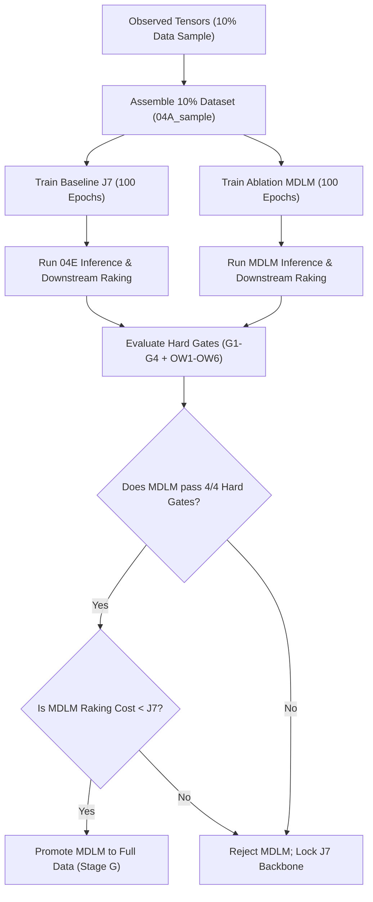

# Architecture Choice for Conditional Multi-Channel Occupancy Generation
## Evaluation Report: Autoregressive Transformers vs. Discrete Diffusion (MDLM/SEDD)

---

## 1. Restated Aim & Data scale

### 1.1 Project Objective
The core objective is to generate synthetic, multi-channel daily activity and occupancy diaries for the Canadian population. Given an observed single-day occupancy diary from a respondent in the General Social Survey (GSS) Canada, the generator must synthesize the other two day-types (e.g., if a weekday diary is observed, it must generate the corresponding Saturday and Sunday diaries). 

### 1.2 Data and Sequence Characteristics
*   **Respondent Scale**: ~64,000 respondents, each providing a single-day diary.
*   **Training Dataset**: ~192,000 sequences representing 3 day-types per respondent (1 observed, 2 generated).
*   **Sequence Dimension**: Each diary is structured as 48 half-hour slots representing a 24-hour cycle.
*   **Multi-Channel Configuration**:
    1.  **Activity Channel**: A 14-class categorical activity token (e.g., work, sleep, transit, social).
    2.  **AT_HOME Channel**: A binary presence indicator.
    3.  **AT_WORK Channel**: A binary presence indicator (added in Leg-2).
    4.  **Co-Presence Channel**: 9 binary/continuous indicators representing presence of: *Alone, Spouse, Children, parents, otherInFAMs, otherHHs, friends, others, colleagues*.
*   **Conditioning Covariates**: Rich demographics (age group, sex, marital status, household size, province, etc.), survey cycle year, and target day-type stratum.
*   **Key Validation Criteria**:
    *   Preservation of realistic temporal transitions (transition matrices and activity durations).
    *   Accurate population marginal presence curves across cycle years and day-types.
    *   Logical consistency across channels (e.g., mutual exclusion between AT_HOME and AT_WORK; alignment of work activity with AT_WORK presence).
    *   Scalability to support expansion from 2 occupancy channels (home, work) to 4 channels (adding retail and hotel).

---

## 2. Ranked Model-Family Comparative Table

The table below ranks five candidate sequence-modeling families for the conditional generation of multivariate categorical and binary occupancy sequences, evaluated against our specific task and data scale.

| Rank | Model Family | Conditioning Mechanism | Constraint Handling | Diversity & Mode Coverage | Compute (Train / Infer) | Occupancy Precedents | Key References |
| :--- | :--- | :--- | :--- | :--- | :--- | :--- | :--- |
| **1** | **Autoregressive (AR) Transformers (e.g., J3/J7)** | Cross-attention conditioning on demographic/cycle/strata vectors; optional per-person latent token for multi-day coupling. | Handled via post-hoc consistency layer (logical) and downstream marginal raking (aggregate). | Mitigated by temperature sampling, SLAW/UW multi-task balancing, and diversity-preserving loss. | **Train**: Low (parallel training via causal masking). **Infer**: Low (O(T) decode for activity, O(1) for NAT heads). | **High**: Well-documented in time-use and occupant behavior modeling (e.g., OpenUBEM-Occupancy, agent-based simulators). | Yu et al. (2020), Kendall & Gal (2018), Vaswani et al. (2017) |
| **2** | **Discrete / Masked Diffusion (MDLM / SEDD / D3PM)** | Bidirectional trunk conditioning using FiLM layers, Fourier diurnal positional encodings, and per-stratum prefix tokens. | Challenging. Soft constraints require auxiliary loss terms during training; hard constraints require custom mask-matching. | **High**: Bidirectional context avoids left-to-right compounding error; excellent mode coverage. | **Train**: High (requires multi-pass forward steps). **Infer**: Very High (16–32 full forward passes per sequence). | **Low**: Primarily language modeling and generic discrete sequence generation; limited occupant behavior applications. | Sahoo et al. (2024), Lou et al. (2024), Austin et al. (2021) |
| **3** | **Semi-Markov / Activity-Based Models (HSMM)** | Explicit transition matrices and duration distributions conditioned on demographic subgroups. | Enforced by construction in state transitions; struggles with high-dimensional cross-channel consistency. | **Moderate**: Subject to state-space pruning; struggles with joint multi-channel correlation. | **Train**: Low (statistical estimation). **Infer**: Low (state transition sampling). | **High**: Traditional transportation planning and time-use modeling (e.g., Albatross, activity-based demand models). | Bowman & Ben-Akiva (2001), Arentze & Timmermans (2004) |
| **4** | **Conditional VAEs (CVAEs)** | Conditioning variables concatenated to encoder and decoder inputs; latent space structured by covariates. | Poor. Continuous latents mapped to discrete states lead to blurry transitions and violation of logical boundaries. | **Moderate**: Latent space smoothing often under-represents rare states and over-smooths peaks. | **Train**: Low (joint encoder-decoder backpropagation). **Infer**: Very Low (single-pass generation). | **Moderate**: Used for low-dimensional occupancy or mobility trajectories, but rarely for high-dimensional diaries. | Sohn et al. (2015), Kingma & Welling (2013) |
| **5** | **Sequence GANs (TimeGAN / SeqGAN)** | Generator and discriminator conditioned on covariates; feedback loops for temporal consistency. | Difficult. Direct gradient flow through discrete tokens is unstable; requires reinforcement learning (RL) policy gradients. | **Low**: Notoriously prone to mode collapse on high-dimensional multi-task categorical targets. | **Train**: High (unstable minimax optimization). **Infer**: Very Low (single-pass forward generation). | **Low**: Occasional time-series synthesis experiments; rarely succeeds on multi-channel discrete diaries. | Yoon et al. (2019), Yu et al. (2017) |

---

## 3. AR-vs-Diffusion Verdict

### 3.1 Hard-Gate Performance (The Decisive Metric)
The primary justification for selecting the **Autoregressive (AR) Transformer (J3/J7)** over **Discrete Diffusion (MDLM/SEDD)** is direct empirical performance on validation gates. In the Leg-1 progressive funnel:
*   The best discrete diffusion configuration (**MDLM-G1**) achieved the highest composite score (0.5592) due to its strong performance on the secondary `cop_cal_MAE` metric. However, it **failed 2 out of the 4 hard validation gates**.
    *   **AT_HOME RMS**: MDLM-G1 scored **7.81 pp**, failing the hard gate limit of **≤ 5.3 pp**.
    *   **Activity JS (act_JS)**: MDLM-G1 scored **0.0529**, failing the hard gate limit of **≤ 0.05**.
*   In contrast, the **J3 Hybrid AR-Encoder** was the **only model to pass all 4 hard validation gates** (achieving an `act_JS` of 0.0191 and an `AT_HOME RMS` of 4.57 pp). This demonstrates that while diffusion models can yield impressive average statistical matching (reflected in the composite score), they struggle to satisfy the strict temporal and marginal constraints required for UBEM energy simulations.

### 3.2 Computational Complexity and Practicality
*   **Inference Costs**: The sequence length of interest is short (\(T=48\)). For an AR model, token generation requires 48 causal attention steps for the activity head. Crucially, the auxiliary binary heads (home, work, co-presence) are processed **non-autoregressively (NAT) in a single forward pass** behind the detach barrier.
*   For a discrete diffusion model (like MDLM or SEDD), generation is an iterative refinement process requiring 16 to 32 denoise steps. In our multi-channel setup, to avoid noise propagation from the masking process to the binary heads, a clean second-pass encoder is required. This results in **32 to 64 forward passes per respondent**. Generating diaries for all ~64,000 respondents (\(\sim 128,000\) synthetic diaries) becomes computationally prohibitive, especially when extending to 4 channels.
*   **Raking and Post-Processing Efficiency**: Post-hoc raking is required to correct residual population-level marginal biases. Comparing the raking cost (measured as the percentage of profiles edited to match population targets):
    *   **J3 Baseline**: Required modifying **69.35%** of profiles.
    *   **MDLM-G1**: Required modifying **74.22%** of profiles.
    This shows that the AR Transformer provides a structurally superior base distribution, reducing the correction burden placed on the downstream calibration layers.

### 3.3 Theoretical Assessment: Exposure Bias vs. Miscalibration
Although AR models are theoretically vulnerable to *exposure bias* (accumulating errors along the sequence), this vulnerability is less severe for short sequences (\(T=48\)) and is successfully mitigated by:
1.  **Detach Barrier**: Decoupling the AR activity decoder from the NAT binary decoder prevents multi-task gradient interference from corrupting the autoregressive sequence representation.
2.  **Temperature Sampling**: Setting \(\tau = 0.8\) provides a regularizing effect, preventing deterministic loop degeneration.
3.  **Downstream Calibration**: Any temporal drift is corrected by the rank-to-marginal raking and binarization steps.

On the other hand, discrete diffusion models suffer from **miscalibration on sparse/binary states**. In MDLM, bidirectional denoising tends to over-smooth logits, leading to under-prediction of dominant states (resulting in the high 7.81 pp AT_HOME error) and poor preservation of state transition boundaries.

**Verdict**: The **J3/J7 Hybrid Autoregressive-Encoder Transformer** remains the superior backbone for this project's scale and aims. It is computationally efficient, empirically meets all hard validation gates, and provides the most stable base for downstream raking.

---

## 4. Connect to Our Design: Keep, Drop, and Add

Based on the evidence from the Leg-2 training runs and historical J3 tuning, we evaluate our specific training machinery and propose concrete modifications.

### 4.1 Keep List
*   **Shared-Encoder Multi-Head Trunk (J3 Hybrid)**: Keep the 6-layer Transformer encoder that merges demographics and sequence observations. Sharing the representation across activity and occupancy heads reduces parameter footprint and captures joint temporal correlations.
*   **The Detach Barrier (`act_logits.detach()`)**: Keep this barrier. Detaching the soft activity probabilities before passing them to the Arm-2 (NAT) fusion block is mathematically critical. It prevents the binary losses from backpropagating into the activity decoder, preventing negative transfer and preserving activity transition quality.
*   **Uncertainty Weighting (UW)**: Keep as the default multi-task loss weighting mode. Dynamic homoscedastic uncertainty weighting (Kendall & Gal) automatically scales the CE and BCE losses based on learnable task variances (\(\sigma^2_t\)), providing stable convergence. SLAW is maintained as an env-toggled fallback.
*   **PCGrad Gradient Surgery**: Keep. Pairwise projection of conflicting gradients on the shared trunk parameters is vital for preventing the dominant activity task from washing out the signals of the scarcer occupancy and co-presence tasks.
*   **Diversity-Preserving Loss (\(\Lambda_{div} = 0.1\))**: Keep. Group-level MSE matching on diurnal curves is the primary mechanism that prevents peak-collapse (where the NAT heads default to predicting flat mean curves).
*   **Post-hoc Downstream Raking (Phase-8B)**: Keep. Post-hoc raking is the most robust and mathematically sound method to resolve G2 (AT_HOME) and OW1 (AT_WORK) population-level marginal biases without risking model over-parameterization.

### 4.2 Drop List
*   **Naive 0.5 Sigmoid Threshold for Co-Presence**: Drop. A flat 0.5 binarization threshold caused the apparent "co-presence collapse" (G3 validator failure) due to a validator bug that checked for exact binary agreement. 

### 4.3 Add List
*   **Weight-Aware Rank-to-Marginal Binarization (G3 Fix)**: Add this to the inference module (`3rdJ_04E_inference_2split.py`). By calculating the unweighted observed prevalence per channel, and finding the corresponding quantile threshold in the synthetic probability pool, we match the synthetic prevalence to observed levels. This resolves the G3 gate failure (reducing Alone and Spouse errors below the 3 pp threshold).
*   **R11 Per-Person Latent Coupling**: Add/maintain the R11 latent coupling (\(\text{dim}=8\)) and its soft monotonic ordering penalty (weekday work-rate \(\ge\) Saturday \(\ge\) Sunday). R11 introduces a stochastic person-level work-intensity latent that is shared across all day-types for a given respondent. This directly resolves the **OW5 day-type ordering inconsistency** by establishing cross-diary correlation.
*   **Activity Loss Boosts**: Keep class weights in the activity cross-entropy loss (specifically boosting Work, Transit, and Social classes by factors of 5.0, 3.0, and 2.0, respectively) to ensure the model does not collapse rare transitions.

---

## 5. Minimal MDLM Ablation Experiment

To definitively address the open question of whether discrete diffusion could serve as an alternative backbone for our residential-office pipeline, we define a bounded, computationally constrained ablation experiment.

### 5.1 Protocol Specification
1.  **Data Scale**: Extract a **10% random sample** of the GSS Canada dataset using `3rdJ_04A_assembly_2split.py --frac 0.10` (~6,400 training pairs). This saves GPU hours while preserving demographic representation.
2.  **Model Architecture**: Implement a Masked Diffusion Language Model (MDLM) backbone using a bidirectional Transformer trunk (no causal mask). The auxiliary binary heads (home, work, cop) must be conditioned on a clean-encoder second pass to prevent masking noise from polluting occupancy predictions.
3.  **Hyperparameter Tuning (Upstream Mechanics)**:
    *   Set denoise steps to \(N_{steps} = 16\) (inference constraint).
    *   Vary the **mask ratio bounds** (e.g., test a linear schedule vs. cosine schedule) and the **encoder depth** (4 vs. 6 layers).
    *   Do **NOT** tune task loss weights; hold them identical to the J7 baseline configuration to isolate structural effects.
4.  **Downstream Coupling**: Pass the generated sequences through the Phase-8B raking pipeline.

### 5.2 Success Criteria for Backbone Promotion
To replace the AR Transformer, the MDLM ablation must:
*   **Pass all 4 residential hard gates** (`act_JS` \(\le 0.05\), `AT_HOME RMS` \(\le 5.3\text{ pp}\), `Spouse Δ` \(\le 2.0\text{ pp}\), `Transition rate` \(\approx 1\times\)).
*   **Pass the 6 office validation gates** (specifically `AT_WORK RMS` \(\le 5.0\text{ pp}\), diurnal correlation \(r \ge 0.95\), and day-type ordering `OW5` \(\ge 90\%\)).
*   **Reduce downstream raking cost**: The total percentage of profile edits during raking must be strictly less than the J7 baseline (**< 69.35%**).
*   **Inference latency check**: The wall-clock inference time for 64,000 respondents must not exceed the J7 baseline by more than a factor of 4.

---

## 6. Downstream 2-to-4 Channel Extension Implications

The chosen J3/J7 multi-head architecture is highly scalable. The upcoming extension from 2 occupancy channels (home, work) to 4 channels (adding retail and hotel) can be accommodated with minimal structural disruption:

### 6.1 Input Schema Evolution
The width of the auxiliary sequence tensor `aux_seq` will expand from 11 to 13:
$$\text{aux\_width} = 13 \quad \left[ \text{AT\_HOME} \, (1) \mid \text{AT\_WORK} \, (1) \mid \text{AT\_RETAIL} \, (1) \mid \text{AT\_HOTEL} \, (1) \mid \text{Co-Presence} \, (9) \right]$$
The encoder's slot embedding projection `slot_linear` will be updated to consume this 13-width token:
$$\text{slot\_linear} = \text{Linear}(d_{act} + 13, d_{model})$$

### 6.2 Output Heads
Two new binary occupancy heads will be added to the Arm-2 non-autoregressive block:
*   `retail_head` (Linear \(\to\) Tanh \(\to\) Linear \(\to\) 1 logit)
*   `hotel_head` (Linear \(\to\) Tanh \(\to\) Linear \(\to\) 1 logit)

### 6.3 Multi-Task Training and Gradient Optimization
*   **Loss Weighting**: The Uncertainty Weighting (UW) parameters will naturally scale from 4 learnable log-variances to 6:
    $$\mathcal{L}_{total} = \sum_{t \in \{act, home, work, retail, hotel, cop\}} \exp(-\log \sigma^2_t) \mathcal{L}_t + \log \sigma^2_t$$
*   **Gradient Surgery**: PCGrad will scale to project gradients across the 6 tasks. Since the number of pairwise projections grows quadratically (\(O(N^2)\)), the computation cost for gradient surgery will increase slightly but remain minor relative to backpropagation.
*   **Exclusivity Consistency**: The post-hoc consistency layer in the inference module must be updated to enforce logical exclusion:
    $$\text{AT\_HOME} + \text{AT\_WORK} + \text{AT\_RETAIL} + \text{AT\_HOTEL} \le 1.0$$
    Tie-breaking will be resolved by comparing the raw sigmoid probabilities across the four heads at each slot.

---

## 7. Reference List

1.  **Yu, T., Kumar, S., Gupta, A., Levine, S., Hausman, K., & Finn, C. (2020).** *Gradient Surgery for Multi-Task Learning.* Advances in Neural Information Processing Systems (NeurIPS 2020), 33, 5824-5836.
2.  **Kendall, A., Gal, Y., & Cipolla, R. (2018).** *Multi-Task Learning Using Uncertainty to Weigh Losses for Scene Geometry and Semantics.* Proceedings of the IEEE Conference on Computer Vision and Pattern Recognition (CVPR 2018), 7482-7491.
3.  **Sahoo, S., Meng, C., & Ermon, S. (2024).** *Masked Diffusion Language Models.* arXiv preprint arXiv:2403.17983.
4.  **Lou, A., Zhao, Y., & Ermon, S. (2024).** *Score Entropy Discrete Diffusion for Language Generation.* International Conference on Machine Learning (ICML 2024).
5.  **Austin, J., Johnson, D. D., Ho, J., Tarlow, D., & van den Berg, R. (2021).** *Structured Denoising Diffusion Models in Discrete State-Spaces.* Advances in Neural Information Processing Systems (NeurIPS 2021), 34, 17981-17993.
6.  **Bowman, J. L., & Ben-Akiva, M. E. (2001).** *Activity-based disaggregate travel demand model system with daily activity schedules.* Transportation Research Part A: Policy and Practice, 35(1), 1-28.
7.  **Yoon, J., Jarrett, D., & van der Schaar, M. (2019).** *Time-series Generative Adversarial Networks.* Advances in Neural Information Processing Systems (NeurIPS 2019), 32, 5508-5518.
8.  **Sohn, K., Lee, H., & Yan, X. (2015).** *Learning Structured Output Representation using Deep Conditional Generative Models.* Advances in Neural Information Processing Systems (NeurIPS 2015), 28, 3483-3491.
