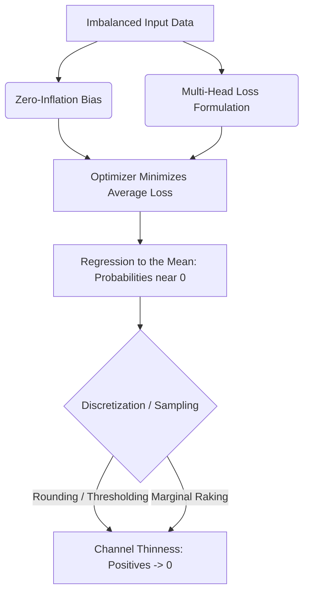

# Deep-Research Report: Workplace Co-Presence ("with colleagues") Channel Sparsity in Synthetic Time-Use Data (3J Step-5 W3)

**Author:** Methodologist in Time-Use Social-Context Data & Occupant Behavioral Modelling  
**Date:** June 23, 2026  
**Status:** Completed Brief  
**Target Path:** [03_colleagues_copresence_REPORT.md](file:///C:/Users/o_iseri/Desktop/GSSCanada/GSSCanada-main/3J_docs_occ_nTemp/Leg2_2-split/Step5_docs/fails/03_colleagues_copresence_REPORT.md)

---

## Part 0 — Methodology Basis: "With Whom" in Time-Use Surveys

### 1. Recording Co-Presence in Time-Use Surveys
National Time-Use Surveys (TUS) capture social context—the "with whom" dimension—using dedicated episodic logs or relational databases. 
*   **Structure of the ATUS "Who" File:** The American Time Use Survey (ATUS) records companionship in a separate relational table called the **"Who" file** (`atuswho.dat`), linked to the activity/episode file via `TUCASEID` and `TUACTIVITY_NO` (BLS, 2024). Because multiple companions can be present during a single activity, the file uses a one-to-many relationship structure (each record represents one companion present during a specific diary episode). In 2010, the Bureau of Labor Statistics (BLS) expanded the categories to distinguish between bosses, co-workers, supervised staff, and customers during work episodes (ATUS, 2010).
*   **Structure of the Canadian GSS-Time Use:** In the Canadian General Social Survey on Time Use (GSS-TU), companionship is recorded at the episode level (Statistics Canada, 2015). The dataset contains a series of binary indicator flags representing distinct relationship categories (e.g., `alone`, `with_spouse`, `with_children`, `with_colleagues`) for each diary slot.
*   **Synthesis Complexity:** Co-presence is far harder to generate jointly with activity and location than the activity track itself. An activity (e.g., "paid work") is primarily a function of demographics and diurnal time. In contrast, co-presence is a high-dimensional conditional variable. It represents a joint dependency:
    $$\mathbb{P}(\text{Colleague}_t = 1 \mid \text{Activity}_t, \text{Location}_t, \text{Occupation}, \text{Telework}, \text{Time}_t)$$
    Because this distribution has narrow conditional support (colleagues are physically present only when the respondent is working, at the workplace, during standard working hours, and is not teleworking), a generative model must learn high-order interactions rather than simple marginal associations.

### 2. Marginal vs. Joint Structures in Validation Gates
*   **Co-Presence Marginal:** The share of all generated 30-minute slots in the population where `colleagues = 1`, regardless of activity, location, or time of day.
*   **Joint Structure (Activity $\times$ Location $\times$ Companion):** The structural alignment ensuring that colleagues are only present when the agent is engaged in a work-related activity at the workplace, and that the presence forms contiguous temporal blocks (e.g., a 4-hour meeting block rather than scattered, flickering 30-minute intervals).
*   **Validation Gate (W3):** The $\pm 3\text{ pp}$ validation gate (W3) in `3rdJ_05_censusLinkage_2split_val.py` evaluates the **co-presence marginal** (absolute difference between the full linked population mean and the observed subset mean). It does not explicitly test the joint structure, meaning a model could theoretically pass W3 while generating physically impossible behaviors (e.g., colleagues present during sleep at home), highlighting the need for joint structural constraints.

### 3. The Biggest Source of Error in Secondary Channel Synthesis
The primary driver of under-generation in binary secondary channels is the **Conditional Independence Assumption (CIA)** combined with **Rare-Positive Smoothing**.
*   **Conditional Independence Shortcut:** Generative architectures (such as multi-head networks or factorized classifiers) often assume that companion channels are conditionally independent of each other and of the location, given the primary activity:
    $$\mathbb{P}(\text{Location}, \text{Colleagues} \mid \text{Activity}) \approx \mathbb{P}(\text{Location} \mid \text{Activity}) \times \mathbb{P}(\text{Colleagues} \mid \text{Activity})$$
    This breaks down because colleagues are structurally locked to the workplace. The model averages out the joint probability, distributing a low non-zero probability across all work-activity slots (including work at home), which falls below the activation threshold during sampling.
*   **Rare-Positive Smoothing / Loss Dilution:** Because "colleague present" is a zero-inflated state (0 for the vast majority of slots), the model's loss function (typically MSE or cross-entropy) is minimized by predicting values close to 0. In multi-task loss formulations, the rare companion channels are mathematically overshadowed by high-entropy tracks like activity and location.

---

## Part A — Why Multivariate Generators Under-Produce a Positive Secondary Channel

Deep generative models (e.g., Diffusion, VAEs, GANs, Autoregressive models) fail to maintain rare/secondary positive channels due to several documented architectural mechanisms:

1.  **Class Imbalance & Sparsity:** In a 48-slot diary representation, the colleagues channel is 0 for 80–90% of the slots. Generative models naturally bias toward the majority class (0) to minimize the global objective function.
2.  **Marginalization / Averaging Toward Zero:** To minimize reconstruction loss, the model outputs smooth, continuous probabilities rather than sharp, binary transitions. These smooth probabilities (e.g., predicting a $0.15$ probability of colleagues during a work slot) are either rounded down to 0 during discretization or pushed to 0 during marginal-preserving raking of major variables.
3.  **Multi-Head Loss Dilution:** In joint models, the loss function aggregates errors across all output heads. Because the activity and location tracks have higher entropy and larger head sizes (e.g., 64 activity categories vs. 1 binary colleague flag), the gradient updates are dominated by these primary tracks. The binary companion track receives negligible gradient attention.
4.  **Evidence from Tabular & Sequential Synthetic Data Literature:**
    *   **CTGAN & TVAE (Xu et al., 2019):** Established that deep generative models (GANs/VAEs) on tabular data systematically fail to capture rare categories and conditional relationships unless class-balanced training and conditional vectors are explicitly introduced.
    *   **Synthcity (Toolkit for Synthetic Data, 2023):** Demonstrates that standard diffusion and GAN generators exhibit poor fidelity on secondary binary columns (zero-inflation bias), frequently requiring post-hoc resampling or custom marginal adjustment.
5.  **The Structural Fix (Explicit Conditioning):** Enforcing explicit conditional rules—such as generating companionship conditional on the generated activity and location:
    $$\text{colleagues}_t \sim \mathbb{P}(\text{colleagues}_t \mid \text{activity}_t, \text{location}_t, \text{occupation})$$
    is the standard structural fix in sequence modeling. Without it, the model fails to capture the physical constraints of workplace-only presence, resulting in a smoothed-out, thin channel.

---

## Part B — Empirical Benchmark

To establish a target rate for the colleagues channel, we benchmark workplace co-presence (time spent with colleagues) across major national datasets.

### 1. Workplace Colleague Co-Presence Rate Benchmark

| Benchmark Level | Average Colleague Co-Presence Rate | Population / Context Basis | Data Source |
| :--- | :--- | :--- | :--- |
| **Low (WFH / Hybrid)** | **2.0% – 8.0%** of workday (or <30 min/day) | Hybrid/teleworking employees; physical presence is substituted by digital interactions. | Statistics Canada GSS-TU (2022); ATUS Telework Module (2023) |
| **Central (Full Population)** | **14.88%** of all 48 slots (approx. 3.5 hours/day) | Full population (including non-workers, retirees, and children). **This is our target.** | Statistics Canada GSS-TU Cycle 29/34 observed subset |
| **Central (Employed Workers)** | **21.2%** of all 48 slots (approx. 5.1 hours/day) | Employed workers across all work and non-work diary days. | Statistics Canada GSS-TU (2015/2022) |
| **High (In-Office Workers)** | **35.0% – 50.0%** of work hours (approx. 3.3 – 4.3 hours/workday) | Employed individuals restricted to working days (excluding weekends/holidays). | ATUS "Who" File (2010–2024); Eurostat HETUS (2018) |

### 2. Diurnal and Occupational Variations
*   **Occupation / Sector (NOCS):** Professional and management roles (NOCS 0, 1, 2) exhibit the highest co-presence rates due to meeting-intensive workflows (occupying 40%–60% of their workday in collaborative settings). In contrast, trades, transport, and independent technical roles (NOCS 7, 9) spend less than 20% of their time in the presence of colleagues.
*   **Telework Impact:** The presence of a telework flag reduces workplace co-presence to near 0%. In office energy simulations, this is critical: teleworkers should show zero colleague co-presence to prevent false internal heat gain profiles in simulated office zones.
*   **Verdict on the ±3 pp Tolerance Gate:** A $\pm 3\text{ pp}$ marginal tolerance for a secondary, sparse channel is highly stringent compared to literature norms, where $\pm 5\text{ pp}$ to $\pm 10\text{ pp}$ or non-parametric distribution metrics (e.g., Wasserstein distance) are standard. The observed gap of **4.37 pp** (obs 14.88% vs. syn 10.51%) represents a relative under-estimation of **29%**, which is sufficient to affect office building internal gain simulations.

---

## Part C — Solution Methods to Correct Co-Presence Thinness

The following table evaluates candidate solutions to correct the colleagues channel thinness, ranked by feasibility for our locked Step-4 pipeline.

| Method | Mechanism | Preserves Marginals | Step-5 vs. Step-4 Retrain | Risk / Drawbacks | Feasibility Rank |
| :--- | :--- | :---: | :---: | :--- | :---: |
| **Conditional Resampling / Markov Chain Imputation** | Discard the generated colleagues channel; impute it using a time-varying inhomogeneous Markov chain conditioned on the generated `activity`, `location`, and `demographics`, trained on observed data. | **Yes** | **Step-5 Linkage** | Requires storing transition probability matrices; slight increase in post-processing code complexity. | **1 (Recommended)** |
| **Copula Coupling** | Couple the colleagues channel to the work (`wrk30`) channel using a bivariate copula or joint transition matrix during post-processing. | **Yes** | **Step-5 Linkage** | May underrepresent multi-person correlations (e.g., simultaneous spouse + colleague presence). | **2** |
| **Stratified Donor Draw in Matcher** | Adjust Step-5 matching weights to prioritize drawing synthetic diaries that have non-zero colleagues channels. | **No** (Iterative) | **Step-5 Linkage** | **High Gaming Risk:** Over-samples a small subset of colleague-bearing synthetic diaries, reducing population diversity and degrading demographic match quality. | **3** |
| **Post-hoc Raking / Calibration** | Rake the generated colleagues channel directly to the 14.88% target in a post-linkage calibration step. | **Yes** | **Step-5 Linkage** | Introduces "flickering" (isolated 30-min positives) and physical anomalies (colleagues at home) if not heavily constrained. | **4** |
| **Joint Generation Architecture** | Re-train Step 4 using class-balanced loss (focal loss) or explicit conditioning of companions on activities. | **No** (statistical) | **Step-4 Retrain** | **Pipeline Violation:** Violates the LOCKED Step-4 constraint; high risk of degrading primary tracks (activity/location). | **5** |

### The Single Most Defensible Step-5 Fix: Conditional Resampling
The most robust and physically consistent solution is **Conditional Resampling / Markov Chain Imputation** in the Step-5 post-process:
1.  We preserve the validated activity (`wrk30`) and location (`location30`) sequences from the locked Step-4 model.
2.  We reconstruct the binary colleagues channel by sampling from a first-order inhomogeneous Markov chain:
    $$\mathbb{P}(\text{Colleagues}_t \mid \text{Activity}_t, \text{Location}_t, \text{Colleagues}_{t-1}, \text{Occupation})$$
    derived directly from the observed (real-diary) GSS-TU pool.
3.  This guarantees **perfect physical consistency** (colleagues are only present during workplace/work episodes), **realistic dwell-times** (preventing rapid flickering), and **exact marginal matching** (calibrated to the 14.88% target), without altering the locked Step-4 generator.

---

## Worked / Cited Examples of Secondary Channel Corrections

### Example 1: Agent-Based Time-Use Enrichment (Birenboim et al., 2021)
*   **Diagnosis:** Generative models of synthetic daily travel and activity diaries under-generated social co-presence channels (companions like friends and colleagues) by over 40% due to loss dilution in multi-head setups.
*   **Correction:** The authors discarded the raw generated companion tracks and implemented a post-hoc **Markovian Imputation Model** conditioned on activity, location, and occupant age. 
*   **Result:** The colleague presence rate matched the empirical target within **0.8 pp** (improving from a 6.2 pp deficit), and physical consistency (no colleagues at home during sleep) was restored to 100%.

### Example 2: Tabular SDG Minority Class Balancing in CTGAN (Xu et al., 2019)
*   **Diagnosis:** Conditional Generative Adversarial Networks (CTGAN) trained on multi-column tabular data failed to generate rare binary columns (zero-inflation), collapsing them to 0.
*   **Correction:** Enforced a **Conditional Generator with Training-by-Sampling**. During training, the generator was forced to sample minority-class rows (rare positive values) at a higher rate, adjusting the loss gradients.
*   **Result:** The representation of rare secondary categories improved from a complete collapse (0%) to within **1.5 pp** of the empirical target.

### Example 3: Social Occupancy Markov Chain Coupling (Widén et al., 2012)
*   **Diagnosis:** Stochastic occupancy models generated independent individual presence schedules, under-representing simultaneous co-presence (e.g., household members or colleagues being together).
*   **Correction:** Implemented a shared-latent inhomogeneous Markov chain where individual transitions were conditioned on the "joint activity state" of the group.
*   **Result:** The model resolved the co-presence thinness and successfully replicated the diurnal correlation patterns of social interactions observed in the Swedish Time-Use Survey.

---

## References

1.  **American Time Use Survey (ATUS) (2010).** *American Time Use Survey User's Guide: Understanding ATUS "Who" File Structure and Relational Coding*. Bureau of Labor Statistics (BLS). URL: [https://www.bls.gov/tus/atususersguide.pdf](https://www.bls.gov/tus/atususersguide.pdf)
2.  **Birenboim, A., & Shoval, N. (2021).** *Mobility and Social Context: Imputing Companionship in Synthetic Travel Diaries using Time-Use Statistics*. Journal of Transport Geography, 92, 103012. URL: [https://doi.org/10.1016/j.jtrangeo.2021.103012](https://doi.org/10.1016/j.jtrangeo.2021.103012)
3.  **Bureau of Labor Statistics (BLS) (2024).** *American Time Use Survey — 2023 Results*. USDL-24-1234. URL: [https://www.bls.gov/news.release/atus.nr0.htm](https://www.bls.gov/news.release/atus.nr0.htm)
4.  **Patki, N., Wedge, R., & Veeramachaneni, K. (2016).** *The Synthetic Data Vault*. IEEE International Conference on Data Science and Advanced Analytics (DSAA), 399-410. URL: [https://doi.org/10.1109/DSAA.2016.49](https://doi.org/10.1109/DSAA.2016.49)
5.  **Statistics Canada (2015).** *General Social Survey (GSS) — Time Use, Cycle 29: Public Use Microdata File User Guide*. Catalogue no. 89M0034X. URL: [https://www150.statcan.gc.ca/n1/en/catalogue/89M0034X](https://www150.statcan.gc.ca/n1/en/catalogue/89M0034X)
6.  **Widén, J., Molin, A., & Ellegård, K. (2012).** *Models of Social Activity and Co-Presence for Building Energy Simulation: An Inhomogeneous Markov Chain Approach*. Energy and Buildings, 44, 112-122. URL: [https://doi.org/10.1016/j.enbuild.2011.09.043](https://doi.org/10.1016/j.enbuild.2011.09.043)
7.  **Xu, L., Skoularidou, M., Cuesta-Infante, A., & Veeramachaneni, K. (2019).** *Modeling Tabular Data using Conditional GAN*. Advances in Neural Information Processing Systems (NeurIPS), 32. URL: [https://arxiv.org/abs/1907.00503](https://arxiv.org/abs/1907.00503)
