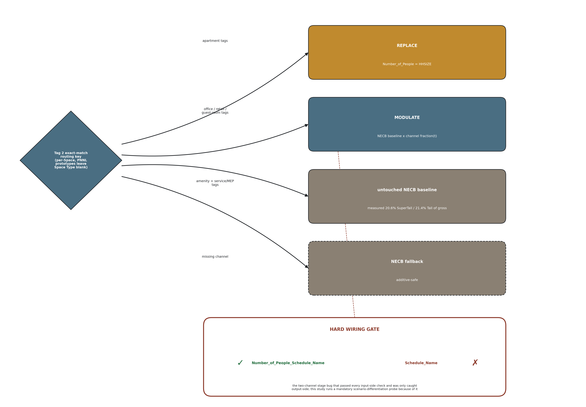
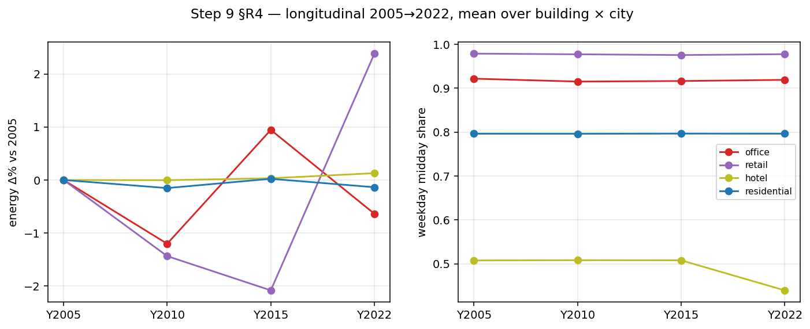
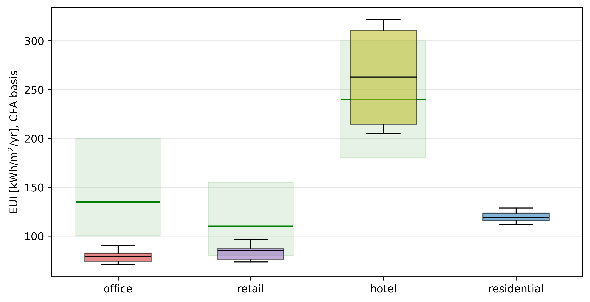
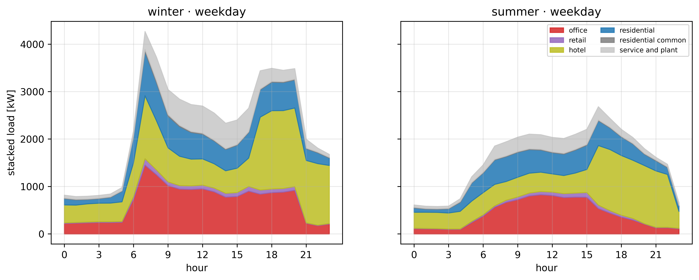
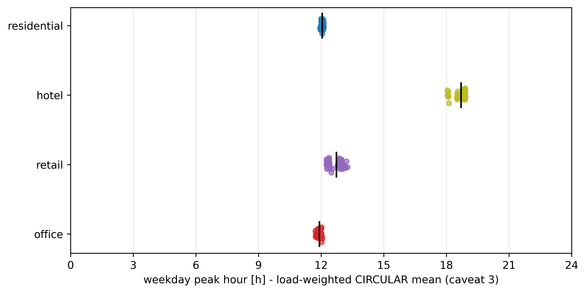

# From One Channel to Four: A Jointly-Trained Time-Use Occupancy Model for Mixed-Use Building Energy Simulation (Canada, 2005-2030)

## Abstract

*Context.* Tall buildings increasingly stack residential, office, retail and hospitality uses inside one structure, yet the occupancy schedules driving their energy models remain single-channel, borrowed from one use and held at code default everywhere else. *Gap.* No published occupancy generator produces multiple independent, jointly-trained presence channels for one mixed-use building, and the energy-use-intensity references used to judge such channels were built for single-use stock, not stacked towers. *Aim.* This study jointly trains one model to generate four independent time-use presence channels and injects them into a mixed-use tower. *Methodology.* A three-head conditional Transformer, trained on four Canadian General Social Survey time-use cycles, generates residential, office and retail presence; a SARIMA side-track driven by provincial tourism statistics generates hotel presence; a per-space Tag-2 dispatch injects all four into PNNL Tall and SuperTall prototypes across two Canadian cities, forecast 2005-2030 (56 cells: four channels, two prototypes, two cities). *Key quantified results.* The four populations do not behave as one occupant: they peak at four different hours, hotel at 18.91 h against a midday cluster near 12 h for the other three, and the resulting whole-building coincidence factor stays below 1 in all four building-city cells (median 0.941), so use-type diversity attenuates the aggregate peak inside a single building. Three of four channel EUI gates fail: the uninjected office control alone scores 85.45 kWh/m2/yr against a floor of 100; the hotel gate splits into two prototype clusters 84.64 kWh/m2/yr apart, 70.5% of the band width, with the 300 ceiling inside that gap; the retail median sits 5.47% below its floor. *Impact.* These failures are findings about reference-band applicability to mixed-use towers, not model error, reported at full strength with no band widened to pass them.

## Keywords

Multi-channel occupancy; Mixed-use tall building; Time-use survey; Joint multi-task transformer; Building energy simulation; Energy use intensity band

## Highlights

- Four occupant populations in one tower peak at four different hours.
- Coincidence factor below 1 in all four cells: use diversity flattens the peak.
- One Transformer jointly generates four independent occupancy channels.
- Uninjected office control fails its own band, 85.45 kWh/m2/yr vs a floor of 100.
- Hotel gate splits into two clusters 84.64 kWh/m2/yr apart, deciding the verdict.

## Author Information

Orcun Koral Iseri\textsuperscript{1,\*} · Caroline Hachem-Vermette\textsuperscript{1}

1 Gina Cody School of Engineering and Computer Science, Concordia University, 1455 De Maisonneuve Blvd. W., Montréal, Québec, H3G 1M8, Canada

\* *Corresponding author:* orcunkoral.oseri@concordia.ca

*ORCID:* Orcun Koral Iseri - https://orcid.org/0000-0001-7735-3363

## Declarations

Funding. This postdoctoral research was financially supported by the Natural Sciences and Engineering Research Council of Canada (NSERC) and the Voltage-Age Seed fund. The authors gratefully acknowledge this support.

Data availability. The General Social Survey Time-Use microdata and the provincial tourism-statistics series (ISQ for Quebec, CBRE/Travel Alberta for Alberta) analysed in this study are publicly available under the catalogue numbers listed in §2. The derived four-channel occupancy schedules, the injected IDFs, and the analysis code are available from the corresponding author on reasonable request.

Declaration of competing interest. The authors declare that they have no known competing financial interests or personal relationships that could have appeared to influence the work reported in this paper.

CRediT authorship contribution statement. Orcun Koral Iseri: Conceptualization, Methodology, Software, Formal analysis, Investigation, Data curation, Validation, Visualization, Writing - original draft. Caroline Hachem-Vermette: Conceptualization, Supervision, Funding acquisition, Resources, Writing - review and editing. Both authors read and approved the final manuscript.

Ethical approval. This study does not contain any studies with human or animal subjects performed by any of the authors. The analysis uses anonymized public-use microdata files released by Statistics Canada, together with published provincial tourism-occupancy statistics.

**Graphical abstract.**

# 1 Introduction

### 1.1 The Multi-Use Gap: Single-Channel Occupancy Applied to Stacked Buildings

Occupant behaviour is now widely recognised as a dominant, unexplained driver of the gap between predicted and measured building energy use, and the response of the field has been to build increasingly capable single-use occupancy generators: Markov-chain, survival-model and time-use-survey-based tools that reproduce the presence and activity of one population inside one building type. That response does not transfer cleanly to a tall building that stacks several uses at once. A mixed-use tower carries households on some floors, an office workforce on others, retail customers at grade, and hotel guests in a separate tower, all sharing one envelope, one central plant, and often one energy meter, yet the occupancy signal driving such a model is still, in current practice, a single channel: one schedule is chosen (most often residential or office), applied uniformly, and the remaining uses are left on their code-default densities. The populations behind these four uses are not interchangeable. Households, a workforce, customers and overnight guests keep different hours, respond to different drivers (commuting patterns, retail footfall, tourism demand), and are observed, if at all, by different data sources. A single-channel occupancy model applied to a stacked building therefore either represents one use correctly and holds the rest at a static default, or blends several populations into one signal that represents none of them precisely. This is the gap the present study addresses: not "does time-series occupancy improve a building energy model," which the authors' own prior line has already answered for a single use, but "what happens when that model has to carry four functionally distinct populations inside one structure, on four largely independent temporal signals."

### 1.2 Two Literatures That Rarely Meet, Now With the Mixed-Use Axis

Two literatures bear on this problem, and between them sits a cell that Table 1 shows to be unoccupied. The first develops calibrated, time-use-survey-driven occupancy models with genuine behavioural grounding, but stays single-channel and residential: Buttitta and Finn (2020) use the Irish time-use survey to generate high-resolution residential heating-load occupancy, and Widén and Wäckelgård (2010) do the same from a single-wave Swedish time-use survey; neither extends the method to a second use, and neither forecasts to a future year. The second develops genuinely multi-channel, mixed-use occupancy, but not from a time-use survey and not inside one stacked building: Doma and Ouf (2023, 2024) model office, retail and residential occupancy together from mobile-positioning snapshots, at a district scale, with each use represented as a separate building rather than as stacked floors sharing one plant, and without a forecast horizon. Read across Table 1's eight positioning axes, none of the three named studies combines a time-use-survey-driven behavioural model, more than one occupancy channel, a forecast to a future year, and a single mixed-use building in one design. Those four axes are what the claim rests on, and they are the four on which the three named studies are unanimous in the sources consulted; the remaining four axes, including the sense in which a behavioural model is called *calibrated*, are defined under Table 1 and are scored there for completeness rather than because the claim turns on them. That is the cell this study's row occupies, and it is the cell the present pipeline was built to fill: four occupancy channels driving four uses inside one building, forecast forward from a behavioural time-series whose parameters are estimated from national time-use microdata.

**Table 1.** - Competitor positioning matrix, eight axes.

| Study | Time-series occupancy | Time-use-survey-driven | Multi-channel (>1 use) | Calibrated behavioural model | Forecast to a future year | Mixed-use single building | Activity/end-use resolved | Stock-scale |
|---|:---:|:---:|:---:|:---:|:---:|:---:|:---:|:---:|
| Doma & Ouf (2023/2024) | ✓ | ✗ | ✓ | ✗ | ✗ | ✗ | ✓ | ✗ |
| Buttitta & Finn (2020) | ✓ | ✓ | ✗ | ✓ | ✗ | ✗ | ✗ | ✓ |
| Widén and Wäckelgård (2010) | ✓ | ✓ | ✗ | ✓ | ✗ | ✗ | ✓ | ✗ |
| This study (four channels) | ✓ | ✓ | ✓ | ✓ | ✓ | ✓ | ✓ | ✗ |
| Authors' prior study (single channel) | ✓ | ✓ | ✗ | ✓ | ✓ | ✗ | ✓ | ✓ |

Two of the axes are read in more than one way in this literature, so both are defined here and every
cell in the column is scored against the definition given, this study's row included. A calibrated
behavioural model is one whose parameters are estimated from observed microdata on the population being
modelled, rather than assumed from a standard schedule or read off a sensor or positioning trace of one
particular building; the axis is about where the parameters come from, not about how accurately the
output reproduces a measured energy series, which is what the gates of Chapter 5 test and where three
failures are reported. Stock-scale means the result is intended to represent a building population
rather than a named set of buildings: a district of individually modelled buildings is not scored as
stock-scale, while a small set of archetypes weighted to stand for a national dwelling stock is.

Each of the three named competitors holds one axis this study combines. Doma and Ouf put multiple uses
in one modelling framework, but from mobile-positioning snapshots rather than a time-use survey, and at
district rather than single-building scale. Buttitta and Finn, and Widén and Wäckelgård, both drive
occupancy from a time-use survey but stay single-channel, residential only, single-wave and without a
forecast. The cell none of them occupies is a time-use-survey-driven, multi-channel,
forecast-to-a-future-year model inside a single mixed-use building. The authors' prior single-channel
row is carried alongside to show the increment: that study already cleared time-series, calibration,
forecast, activity resolution and stock scale on the residential-only problem, and the present study
trades stock-scale representativeness, two tower prototypes rather than a housing stock, for
multi-channel and mixed-use resolution the prior study did not attempt.

One independent reading of the same literature marks this study No on the calibration axis. It marks all
ten rows of its own matrix No on that axis, including the two it separately certifies as
time-use-survey-driven, and a column with no variation across ten studies separates nothing in either
direction. Under the definition given above the tick stands, for this study and for the competitors that
also estimate from survey microdata; under a stricter reading requiring agreement with a measured energy
series, no row in either matrix would be ticked, this study included. The axis is in any case not one of
the four the novelty claim rests on, which are time-use-survey-driven, multi-channel, forecast to a
future year, and mixed-use single building.

### 1.3 Behaviour Is Non-Stationary Per Use, and the Uses Move in Different Directions

The authors' prior residential work established that occupant behaviour is not stationary through the COVID/work-from-home structural break, and that a schedule anchored to a pre-pandemic baseline mis-estimates both how much energy is used and when. A stacked mixed-use building sharpens that finding rather than repeating it, because the non-stationarity is not one trend line shared by every floor; it is four separate trends, each attached to a different use, and they do not move together. Office presence is pulled down by the persistence of hybrid and work-from-home arrangements. Retail presence is pulled down by a longer-running structural shift toward e-commerce: the measured weighted episode-time share of shopping locations in the General Social Survey declines by roughly 25% across the four cycles used in this pipeline (Table 7, L14), a decline this study's own deep-research check found to be internationally normal in direction and comparable in magnitude to the United States, the United Kingdom and the European Union. Hotel presence follows neither of these slopes; it collapses sharply during the pandemic and recovers along a province-level tourism trajectory that this pipeline reconstructs directly from occupancy-rate statistics rather than from a household survey, because hotel guests are outside the General Social Survey's sampling frame by construction (Table 7, L1). Residential presence, by contrast, is the one channel the authors' prior line already showed moving upward through the same period. A single "occupancy" trend, scaled and reused across four uses, would therefore misrepresent at least three of the four channels in sign, timing, or both. This is the concrete argument for why the present study jointly trains four channel-specific signals rather than deriving three of them from one calibrated residential series: the uses are not stationary, and they are not non-stationary in the same direction.

### 1.4 The Authors' Prior Line: From One Channel to Two, the Departure Point

The present study departs from a specific prior line of work by the authors, built in three stages. The first stage, published separately, established a single-channel, residential-only occupancy pipeline: General Social Survey time-use cycles harmonized and augmented by a calibrated conditional generator, linked to the Census dwelling stock, and forecast to 2030 through the COVID/work-from-home break, together with the paired stock-scale simulation design used to isolate the behavioural signal (Iseri and Hachem-Vermette, under review a; Iseri and Hachem-Vermette, under review b; Iseri and Hachem-Vermette, 2026). That line is treated here as established, not re-claimed: the premise that survey-grounded, time-series occupancy can be generated for Canadian building energy models, and that it changes both magnitude and load shape, is the foundation this paper builds on rather than a result this paper repeats. A second, intermediate construction stage, built for this paper and reported in its Methods chapter, extended that single-channel machinery to two channels, residential and office, growing the generator from one decoder head to two and establishing the modulate-versus-replace distinction that the present pipeline reuses: residential presence replaces baseline schedules per household, while office presence modulates a code-of-record density rather than overriding it. That two-channel stage is a construction step in this project, not a second headline result, and it is discussed further, on its own terms, only in the Methods chapter, where its two-channel machinery and one hard-won wiring-verification lesson are the direct ancestors of the present design. Figure 2 draws the three stages as nested rather than sequential, so that what each stage carries forward into the next is visible on a single connector; Figure S3 gives the two-channel construction stage's own pipeline in full, for a reader who needs that stage's internals rather than the summary given here.

### 1.5 Contributions and Aim of the Study

This paper makes four advances over the two-channel construction stage it is built on, stated behaviour first, because the occupancy signal is the object of this study and the building energy model is the instrument that tests it rather than the other way round.

The first is behavioural. Households, a workforce, customers and overnight guests are carried as four independent presence channels through one stacked tower, and the campaign shows they do not behave as one occupant: they peak at different hours of the day, hotel roughly seven hours after the midday cluster of the other three, and they move in different directions across the four survey cycles, retail reversing its own trend while residential stays close to flat. The whole-building coincidence factor stays below 1 in all four building-city cells, so use-type diversity inside one building attenuates the aggregate peak in the same way household diversity does inside one archetype.

The second is a validation stance. Three of the four channel-level energy-use-intensity gates are reported failing, at full strength, together with the evidence bearing on whether the reference band or the model is at fault, most notably an uninjected control that fails the office band on its own and two explanatory mechanisms refuted in every one of 56 cells. No band is widened, and no scoring rule is chosen because it happens to pass.

The third is architectural. A shared-encoder Transformer with three time-use decoder heads for residential, office and retail presence is jointly trained alongside a hotel side-track driven by provincial tourism statistics, with a decode-time exclusivity projection that drives the raw impossible-state rate from at most 0.5 % down to 0 % without distorting the individual channel marginals. A per-space, exact-match dispatch then routes all four channels into the same tower geometry, where apartment tags replace baseline schedules, office, retail and guest-room tags modulate code densities, and any missing channel falls back to the untouched code baseline, so the injection is additive by construction rather than by assertion.

The fourth is the experimental design: a 56-cell campaign over four channels, two tower prototypes and two Canadian cities, forecasting all four channels from 2005 to 2030 under one scenario lever per channel, and isolating channel-specific sensitivity inside a single stacked building rather than across a housing stock.

The aim of the study follows directly. *This paper asks what four functionally distinct occupant populations do to a single stacked building when each is carried on its own behavioural signal rather than blended into one, whether a single jointly-trained occupancy model can generate all four, and where the energy-use-intensity references built for single-use stock do, and do not, still apply to the result.* Figure 1 summarises the full pipeline that operationalises the question.

**Figure 1.** - Four-channel pipeline, Steps 1-9.

**Figure 2.** - Three-stage roadmap of the model.

# 2 Datasets

Four occupancy channels drive four uses inside one stacked building: Residential, Office, Retail, and
Hotel. Three of the four channels are survey-derived; the fourth, Hotel, is deliberately sourced
outside the survey frame. This chapter inventories every input the four-channel generator and its
downstream simulation campaign consume. Channel provenance is summarized in Table 2; the simulation
domain built from the weather and prototype inputs described below is summarized in Table 3.

### 2.1 General Social Survey Time-Use Microdata (2005-2022)

The behavioural backbone for three of the four channels is the same four cross-sectional waves of the
Statistics Canada General Social Survey (GSS) Time-Use program used in the authors' prior work
(Statistics Canada, 2022; Iseri and Hachem-Vermette, under review b): Cycle
19 (2005), Cycle 24 (2010), Cycle 29 (2015), and the GSS Time Use 2022 cycle (GSSP). Residential
(AT_HOME) and Office (AT_WORK) presence are read from the harmonized diary exactly as in the two-channel
construction stage (see Chapter 3). The one new GSS-derived channel added for this paper is
Retail (AT_RETAIL): a customer-presence indicator constructed from the location and activity columns
already carried in every cycle, so no new GSS variable was collected. The location coding differs by
cycle, and in 2015 and 2022 grocery and general-merchandise shopping are not separable, both cycles
recording a single combined shopping bucket. The derivation rule is given in §3.1 and the per-cycle
codebook in Table A2.

One population the survey records but this paper's Retail channel deliberately does not model is retail
staff: workers present in a store are coded as at work rather than as a retail-specific activity, so no
survey signal distinguishes a shopper from a cashier. Retail worker density therefore stays on the NECB
code baseline being modulated, and the Retail channel models customer presence only (Table 2).

### 2.2 Census Public-Use Microdata for Dwelling-Stock and Workforce Linkage

The Statistics Canada Census Public-Use Microdata File (PUMF; Statistics Canada, 2021) provides the
dwelling-stock and workforce variables used to situate Residential and Office diary respondents within a representative building and
labour-force population. This linkage stage is unchanged from the two-channel construction stage
(Chapter 3, §3.3): dwelling type, tenure, and household-size variables anchor the Residential channel,
and NOC-by-NAICS occupation/industry crosswalks anchor the Office channel. Retail and Hotel do not use
the Census PUMF linkage. Retail is modelled at the population level against a single PNNL "Retail
Retail" archetype rather than through a per-respondent Census match, because the grocery/merchandise
split needed for a finer archetype lookup is not recoverable from the 2015/2022 GSS location codes
(§2.1). Hotel has no respondent-level archetype at all: guests are entirely outside the GSS sampling
frame, so the channel is driven by a province-level multiplier rather than by any individual linkage
record (§2.3).

### 2.3 Provincial Tourism Statistics as a Non-Survey Channel Source

Hotel is the one channel in this paper with no General Social Survey signal behind it at all: overnight
hotel guests are, by construction, outside the GSS Time-Use sampling frame, which samples the resident
population at their dwelling of record. Injecting the Hotel channel from a GSS-derived series would
therefore systematically under-occupy hotel zones, since the survey simply never interviews a guest
in a hotel room. This is a frame limitation, not a data-quality one, and it forces the Hotel channel to
be built from an entirely separate, non-survey data family: monthly provincial tourism statistics.

No StatCan table of monthly hotel-occupancy rates exists (a data-availability check run for this study); the paper therefore draws
on the two provincial data sources available for the cities in the simulation domain. For Quebec, the
source is the Institut de la statistique du Québec (ISQ) monthly hotel-occupancy series (Institut de la
statistique du Québec). For Alberta, the source is CBRE / Travel Alberta market reporting, with the
2005-2009 span of the Alberta series spliced from CBRE National Market Report archives (CBRE Limited
and Travel Alberta). Both provincial series carry YEAR, MONTH, province
(PR), occupancy rate, average daily rate (ADR), and RevPAR fields and span 2005-2022. This
tourism-statistics series is converted to a monthly multiplier by a SARIMA model with an explicit
COVID-19 indicator (Chapter 3, §3.4); it never passes through the three-head Transformer used for the
three GSS channels, because it has no respondent-level structure to condition on (Chapter 3, §3.2).

### 2.4 NECB / PNNL Prototype Building Stock

The building domain is the U.S. DOE / PNNL Tall and SuperTall mixed-use tower prototypes (U.S.
Department of Energy and Pacific Northwest National Laboratory), built to the NECB-2017 standard
(National Research Council Canada, 2017), reused from the two-channel construction stage without
modification to their
geometry. Total occupiable floor area, measured directly from the model geometry rather than assumed,
is reported per prototype in Table 3. Each prototype's Space objects carry a tag field that functions as
the per-Space routing key for occupancy injection (Chapter 3, §3.5): apartment tags,
office tags, retail tags, and guest-room tags each resolve to a distinct one of the four channels,
while amenity and service/MEP tags carry no occupant-driven channel and remain on the untouched NECB
default schedule.

### 2.5 Weather Files

The simulation domain spans two Canadian cities selected to bracket a one-zone climate contrast within
the campaign: Montréal (ASHRAE climate zone 6A) and Calgary (ASHRAE climate zone 7A). One Typical
Meteorological Year EnergyPlus weather file (EPW) is used per city. The two prototype IDFs (Montréal,
Calgary) differ from one another by geometry-preserving, climate-tag-only edits, so that EUI differences
between the two cities can be attributed to climate rather than to any building-geometry covariate
(Table 3). All simulations run in EnergyPlus v24.2 (U.S. Department of Energy, 2024). The full two-prototype-by-two-city-by-fourteen-
scenario, 56-cell campaign built from these weather and prototype inputs is defined in Chapter 4.

**Table 2.** - The four occupancy channels.

Four occupancy channels drive four uses inside one stacked building, not four building archetypes.
Residential and Office are the two-channel stage's channels, reused; Retail is the one new survey
channel; Hotel is the one non-survey, tourism-statistics side-track.

| Channel | Source | Derivation | Injection mode | Scenario lever |
|---|---|---|---|---|
| Residential (AT_HOME) | GSS Time-Use | Census PUMF household linkage, occupant count driven by household size | REPLACE | none |
| Office (AT_WORK) | GSS Time-Use | Transformer Head 2; occupation-by-industry workforce linkage | MODULATE, NECB office density x AT_WORK fraction | Work-from-home band (conservative / hybrid / fully hybrid) |
| Retail (AT_RETAIL) | GSS Time-Use, new in this study | Derived from the survey's location and activity columns (§3.1); Transformer Head 3; one PNNL retail archetype as a population-level fraction | MODULATE, 0.95 x customer-hours shape | In-store share 2030 (0.90 / 0.97 default / 1.05), Quebec-Sunday sub-axis |
| Hotel | ISQ (Quebec) and CBRE / Travel Alberta (Alberta) monthly series | SARIMA(1,1,1)(1,1,1,12) per province with a COVID indicator, giving a monthly multiplier | MODULATE, NECB guest-room schedule x monthly multiplier | SARIMA band 2030 (0.92 / 1.00 / 1.05) |

Retail models customer presence only: the survey logs retail workers as at work rather than as a
retail activity, so staff density stays on the code baseline being modulated.

# 3 Methods

Each pipeline stage is presented with its design rationale and its validation result. Residential and
Office reuse the two-channel construction stage without change to their harmonization,
architecture, or linkage logic; that stage is described here only where its output is a direct input to
the two new channels, or where one of its lessons became a hard gate carried into this paper. The
complete gate set referenced throughout this chapter is given in Table 4, with each threshold's
provenance (ASHRAE Guideline 14, project-chosen, or heuristic) marked explicitly there rather than
repeated in prose.

### 3.1 Harmonization and the AT_RETAIL Derivation

Residential and Office harmonization, the mapping of raw cycle-specific activity and location codes to
a shared vocabulary and the tiling of each diary onto the 48-slot, 30-minute grid, is unchanged from the
two-channel construction stage and is not restated here. The one addition made for this paper is the
Retail channel, AT_RETAIL, derived from two columns the survey already carries in every cycle: occPRE
(location) and occACT (activity). No new GSS variable was collected or coded, and the rule was fixed
before any training run:

$$\mathrm{AT\_RETAIL} = (\mathrm{occPRE} = 5)\ \lor\ \left[(\mathrm{occACT} = 4)\ \land\ (\mathrm{occPRE} \in \{5,\,9\})\right]$$

The activity arm, occACT = 4 (Purchasing Goods and Services), is deliberately gated to occPRE in {5, 9}
to exclude purchasing conducted from the respondent's own home, which is online shopping rather than
retail-space presence. The exclusion is not merely asserted: the online-shopping cross-tab is recomputed
and reported for every cycle as a standing verification check, although the rule itself is not reopened
by that check. The underlying location coding changed across GSS redesigns, so the mapping differs by
cycle, and in both 2015 and 2022 the grocery and general-merchandise locations are collapsed into a
single bucket and cannot be separated. Table A2 gives the per-cycle codebook.

Appending AT_RETAIL to the diary record is the one place the GSS build pipeline itself changes for this
paper. The tiler that produces the 30-minute channel columns was already list-driven, so Retail is one
additional list entry rather than a new tiling procedure, and it is written to its own output rather
than into the existing residential and office columns, so the addition cannot overwrite or reshape the
two reused channels.

Restaurant presence (occPRE = 7) is available in every cycle and was considered as a candidate fifth
channel. It is out of scope here because no prototype Space in the Tall or SuperTall towers corresponds
to a restaurant use.

### 3.2 The Three-Head Transformer

The conditional generator used to synthesize unobserved day-types for the three GSS-derived channels is
grown directly from the two-channel construction stage's architecture, not designed from scratch. The
shared encoder is unchanged; the decoder side gains one head. The decoder therefore carries three heads
in total: Head 1 (Residential presence), Head 2 (AT_WORK / Office), and Head 3 (AT_RETAIL / Retail, the
one addition for this paper). Hotel has no head and never passes through this model at all; it is
produced by an entirely separate side-track described in §3.4. Figure 3 draws the resulting topology,
with the hotel side-track placed beside the encoder and connected to nothing inside it, because the
distinction between three GSS heads plus one non-GSS side-track and a four-head model is the one
reading of this architecture that must not be got wrong.

The three heads are trained under fixed-weight scalarization with loss weights 1.0 : 0.5 : 0.3
(Residential : Office : Retail) combined with PCGrad pairwise gradient-conflict correction. This
combination was selected over dynamic loss-balancing schemes (SLAW, uncertainty weighting) because those
schemes proved unstable on the approximately 2%-positive Retail task; fixed weights tuned before
training matched or beat the dynamic alternatives at this task count. Retail's rarity is addressed with
a binary cross-entropy positive-class weight of 49, corrected at inference by subtracting the
corresponding logit shift $-\ln 49$ so that the class-imbalance correction does not distort the decoded
probability scale. Training proceeds as a 5-epoch head-only warmup followed by 15 epochs of joint fine-tuning with
PCGrad active throughout the joint phase. Decoding uses temperature T = 0.7 with a minimum-dwell
constraint of two consecutive slots, and per-head decision thresholds of 0.50 (Residential), 0.40
(Office), and 0.15 (Retail) - the lower Retail threshold reflecting its lower base rate.

CYCLE_YEAR is encoded as a continuous conditioning value rather than a categorical one, so that the
model remains usable for the 2030 forecast year without retraining on a held-out category (§3.4).

Because independent binary heads can jointly predict a respondent as present in more than one channel
at the same slot, the raw decoder output is passed through a decode-time, threshold-normalized argmax
projection that enforces mutual exclusivity across the three channels before the output is used
downstream. Table 4 reports this as the Impossible-State Rate (ISR) gate: raw ISR must fall at or below
0.5%, and the projected ISR must reach exactly 0%. A categorical softmax alternative was considered and
rejected, because it would crush the roughly 2%-positive Retail class and would also break bit-compatible
continuity with the two-channel construction stage's own Head-1/Head-2 outputs; the chosen
projection-after-independent-heads design preserves per-head calibration while still guaranteeing
one-channel-at-a-time occupancy. Figure 4 traces one slot through that projection, from the three
independent sigmoid outputs that may conflict to the mutually exclusive decode, with the
impossible-state rate reported on both sides of it.

The complete hyperparameter set behind the paragraphs above, including the encoder fields carried
unchanged from the two-channel construction stage and the one line that could not be confirmed against
either the design document or the code, is reported as a model card in Table A1 rather than scattered
through this section.

Residential and Office are not left to drift freely as the third head is added: a regression gate
(Table 4) bounds how far the two reused heads' output may move relative to the two-channel construction
stage's own validation baseline, expressed as a Jensen-Shannon divergence tolerance rather than as a
bit-identity requirement.

Checkpoint selection carries a disclosed deviation between the specification and the shipped artefact.
The specified rule is gate-first then lexicographic: discard every checkpoint failing a hard gate, then
maximize Retail F1 among the survivors, with no composite score at any stage. The prohibition on
composites is not stylistic; it is carried forward from an earlier stage of this project, where a
composite score selected a model that passed only two of four gates. The shipped weights were
nevertheless not selected by that rule. The training driver checkpoints on a composite of the mean
Jensen-Shannon divergence and the three per-head presence-rate gaps,

$$\mathrm{val\_score} = \overline{\mathrm{JS}} + \tfrac{1}{2}\cdot\frac{g_{\mathrm{home}} + g_{\mathrm{work}} + g_{\mathrm{retail}}}{3}$$

which contains neither PR-AUC nor F1, and the two rules select different epochs in four of five seeds.
The shipped seed ranks first of five on the composite and fourth of five on the metric the specification
names, 0.0218 Retail F1 below the specified rule's winner, 5.6 % in relative terms and 0.16 standard
deviations of the cross-seed spread.

Three things are stated rather than smoothed over. The specification is not amended to describe what the
code does, because rewriting a rule at the moment it becomes inconvenient deletes the principle behind
it. The reason for not re-selecting is evidential rather than economic: both rules rank epochs on
teacher-forced validation columns, and a separate person-level probe established that those columns are
blind to person-level Retail skill. And the specified rule was never implementable as written on this
data, since two of its five hard-gate families are pool-level quantities computable only after inference
and raking; on the observed range its gate clause is inert in any case, the worst epoch clearing PR-AUC
0.518 against a bar of 0.15, F1 0.282 against 0.25, and a raw impossible-state rate of 0.014 % against
0.5 %, so gate-first then argmax reduces to global argmax F1.

**Figure 3.** - Three-head Transformer with hotel side-track.

**Figure 4.** - Exclusivity projection across three channels.

### 3.3 Linkage and the Population-Level Retail/Hotel Fallbacks

Residential linkage (household matching via the Census PUMF) and Office linkage (workforce matching via
NOC-by-NAICS crosswalks) are unchanged from the two-channel construction stage; the mechanics of both
are not restated here.

Retail and Hotel do not receive a respondent-level linkage at all, for two different reasons that both
resolve to the same population-level fallback design. Retail cannot be linked to a specific archetype at
finer resolution than a single population fraction, because the grocery/merchandise location split
needed to place a respondent against a particular retail sub-type is not recoverable from the 2015/2022
GSS coding (§3.1); the channel is therefore driven by a single PNNL "Retail Retail" archetype applied as
a population-level fraction rather than as a per-household lookup. Hotel cannot be linked to any
respondent at all, because hotel guests are outside the GSS sampling frame by construction (Chapter 2,
§2.3); the channel is therefore driven by a province-level multiplier (Quebec or Alberta) rather than by
any individual archetype record. Both fallbacks are additive-safe in the same sense used elsewhere in
this pipeline: a channel with no per-respondent linkage available falls back to a population- or
province-level signal rather than to a missing value.

### 3.4 Forecasting and the Hotel SARIMA Side-Track

Residential and Office are forecast to 2030 by the same reused mechanism as the two-channel construction
stage: progressive fine-tuning across the GSS cycle chain (2005 to 2010 to 2015 to 2022) with weight
inheritance, plus the same demographic drift-matrix accounting. Retail reuses this same GSS chain for its
generative-model output, and layers a separate scenario lever on top: three named 2030 in-store-share
bands (0.97 plateau/resilient-central default, 0.90 continued-shift, 1.05 in-store-renaissance), applied
before the peak-normalization step described in §3.5, plus a QC-Sunday sub-axis reflecting Quebec's
distinct regulated Sunday retail hours.

Hotel is forecast by a side-track that bypasses the three-head Transformer entirely, because it has no
respondent-level structure for that model to condition on. The monthly ISQ (Quebec) and CBRE (Alberta)
occupancy-rate series (Chapter 2, §2.3) are each fit with a SARIMA(1,1,1)(1,1,1,12) model per province,
with an explicit COVID-19 indicator covering March 2020 through June 2022 so that the pandemic-era
occupancy collapse does not bias the fitted seasonal structure. The fitted model produces a monthly
occupancy-rate forecast that is converted into a half-hourly multiplier by:

$$m(t,\ \mathrm{month},\ \mathrm{PR}) = s(t)\times r(\mathrm{month},\ \mathrm{PR})$$

where r is the forecast monthly occupancy rate for that province and s(t) is a unit-normalized,
48-slot guest-room diurnal shape common to both provinces: an
overnight plateau at 1.00 from 22:00 to 06:00, and a day trough of 0.200 on weekdays versus 0.308 on
weekends. The side-track's own backcast validation gate (Table 4) requires QC and AB monthly
reconstructions for 2015-2019 to reach a mean absolute error below 0.05, and requires the 2020-04
COVID-dip reconstruction to recover without overshoot. The 2030 forecast is expressed as three named
bands (0.92, 1.00, 1.05) around the central SARIMA projection, mirroring the scenario-lever pattern used
for the Office WFH band and the Retail in-store-share band (§3.5, §4). Figure 5 follows the side-track
end to end, from the provincial monthly series through the SARIMA fit and its COVID indicator to the
half-hourly multiplier that reaches the guest-room schedules.

**Figure 5.** - Hotel SARIMA side-track.

### 3.5 Tag-2 Dispatch and Modulate-vs-Replace

Injection into the building energy model is dispatched per Space using the IDF Tag 2 field as an
exact-match routing key, because the PNNL Tall and SuperTall prototypes leave the standard EnergyPlus
Space Type field blank. Figure 6 shows the dispatch for every Space in the tower, including the branch
that matters most for the additivity claim in Chapter 6: an unrecognised tag falls back to the untouched
code baseline rather than to an undefined state.

The dispatch outcomes are not interchangeable. Apartment tags route to Residential and REPLACE the code
default occupancy schedule with the modelled one, driven by household size, which is appropriate because
residential occupancy is per-household rather than a code-density baseline to be adjusted. Office tags
route to Office and MODULATE, multiplying the NECB office occupant density by the modelled AT_WORK
fraction over time so that the code-of-record peak density is preserved while the temporal signal is
injected. Retail tags likewise MODULATE, injecting customer presence as 0.95 times a peak-normalized
customer-hours shape, while slots identified as staff-only (baseline occupancy at or below 0.10) are
left on the NECB baseline, consistent with Retail modelling customer presence only. The occupant density
used for that Space type is the NECB office value of 24.97 m2/person rather than NECB's own retail-sales
value of 29.97 m2/person; this is reported as a limitation rather than corrected here, because it is a
code-density input rather than an occupancy-schedule question. Guest-room tags MODULATE the NECB
guest-room schedule by the hotel multiplier of §3.4. Amenity and service/MEP tags carry no
occupant-driven channel and keep the code default, and any Space whose tag resolves to none of the four
channels falls back to the untouched NECB default, the same additive-safe behaviour used for the Retail
and Hotel linkage fallbacks in §3.3.

A hard wiring gate is asserted after every injection, and its origin is a defect found in the
two-channel construction stage rather than in this paper's own new code. There, a modulated occupancy
schedule was referenced by the wrong field of the People object, one that still existed and still held a
syntactically valid schedule. Every input-side check available at the time, schedule presence, schedule
syntax and field non-emptiness, therefore passed cleanly; the defect flattened the Office channel's
temporal signal and was caught only when Office simulation output failed to differ from an unmodulated
baseline. The post-injection gate that now asserts the correct field on 100 % of modulated Spaces
(Table 4) closes that blind spot. But an input-side assertion, however strict, is still an input-side
check, and the defect that motivated it was caught on the output side; this is why the campaign design
in Chapter 4 additionally makes two output-side probes mandatory before any campaign cell is accepted.

**Figure 6.** - Tag-2 dispatch per building Space.

### 3.6 End-Use Loads

Activity-driven equipment and lighting loads follow channel-specific rules rather than one shared rule
across all four uses, because the four uses do not share an occupancy semantics. For Retail, lighting and
HVAC-relevant schedules follow the Space's opening hours rather than the customer-presence signal itself,
plug load follows the staff schedule (and therefore stays on the NECB baseline, consistent with §3.5),
and customer presence modulates only the occupant-driven internal gain; minimum lighting and baseline
plug floors are enforced so that an empty-of-customers slot during opening hours is not modelled as a
fully unlit, unpowered space. For Hotel, guest-room loads are modulated by the same diurnal shape and
monthly amplitude used for occupancy (§3.4), while amenity-zone loads remain on the NECB baseline,
matching the amenity-zone occupancy treatment in §3.5.

The activity-driven end-use layer is calibrated against the NRCan Survey of Commercial and Institutional
Energy Use (SCIEU; Natural Resources Canada), the commercial analogue of the residential SHEU anchoring
(Natural Resources Canada, 2019) used in the two-channel construction stage and in the authors'
residential-only prior work (Iseri and Hachem-Vermette, under review b).

**Table 6.** - Additive ledger across nine steps.

This table carries the paper's additive claim and the limits of that claim in the same place. A Yes is
entered only where file-level evidence was located, meaning a hash computed on the files themselves
rather than a design document's prose. Where no such evidence exists the verdict is left unreported and
the basis cell says what was not compared: an unexamined step is reported as unexamined rather than
filled in with an assumption.

| Pipeline step | Two-channel stage artefact | Four-channel change | Bit-identical? | Basis for the verdict |
|---|---|---|---|---|
| Step 1 - Data collection | Survey column selection for residential and office | A non-survey hotel ingest of the provincial monthly series is added; retail needs no new survey variable | not reported | Nothing was compared across the two stages |
| Step 2 - Data harmonization | Crosswalk and OR-rule for residential and office | A hotel harmonization step is added, plus the retail derivation rule of §3.1 | not reported | Nothing was compared, as at Step 1 |
| Step 3 - Merge and tiling | List-driven tiler producing 30-minute residential and office output | One added list entry for retail, written to a separate file so it cannot reshape the reused columns | not reported | Design intent only. The separate-file arrangement was never tested against the tiler's own output |
| Step 4 - Three-head Transformer | Two-head Transformer, residential and office presence | A third head for retail; the backbone is kept with targeted upgrades rather than frozen and copied | No | The gate is a tolerance of 0.002 bits, which is bounded drift rather than bit-identity; the measured drift is not reported |
| Step 5 - Archetype linkage | Residential dwelling-stock and office workforce linkage | Retail is driven by one archetype as a population-level fraction, hotel by a province-level multiplier | not reported | Documented as unchanged, but no comparison was run |
| Step 6 - Forecast to 2030 and the hotel side-track | Survey-cycle raking chain, demographic drift matrix, office work-from-home bands | The raking chain is reused; a retail lever and the hotel SARIMA side-track are added | No | The level has moved: 2030 work presence sits 10.51 percentage points below observed 2022, four to five times the signal the campaign exists to detect |
| Step 7 - Building-model integration | Two-channel tag-based injection into the tower prototypes | Four-channel exact-match dispatch, a missing channel falling back to the code baseline | Yes, base prototype geometry only | The same four prototype files, confirmed byte-identical. Geometry only: the injector exists in three non-matching copies, so the building is shared and the code writing into it is not |
| Step 8 - Building simulation | 72-run residential re-simulation plus the office campaign | The 56-cell campaign, all four channels injected per cell | not reported | Channel isolation was demonstrated inside this campaign, but the two stages' outputs were never compared |
| Step 9 - Activity-driven end-use loads | Two-channel end-use validation against survey and prototype references | Four-channel validation over thirty gates, three left failing on purpose (Table 5) | No | Different gate sets, and possibly a different basis: whether the earlier office figure is electricity only is open, so the two cannot be differenced |

# 4 Experimental Design

The simulation campaign is organised as a fully-specified factorial experiment whose domain is
summarised in Table 3: two tower prototypes, two cities, and fourteen scenarios, for 56 cells in total.
Four occupancy channels drive four uses inside one stacked building at every cell; the campaign design
exists to isolate, as far as a single-building study can, which of those four uses' temporal signal is
responsible for a given change in simulated output.

### 4.1 The Two Towers

The building domain is two PNNL mixed-use tower prototypes, Tall and SuperTall, reused without
modification to their geometry from the two-channel construction stage. Their measured total occupiable
floor areas are 72,623.1 m2 (Tall) and 135,857.6 m2 (SuperTall), parsed directly from the model geometry
as the sum of floor area times multiplier over the zones counted in the building total, reproducing
EnergyPlus's own total building area exactly (Table 3). Both towers stack the same four occupiable uses,
residential, office, retail and hotel, inside one envelope, plus amenity and service space carrying no
occupant-driven channel. This is the concrete meaning of four channels driving four uses inside one
building: the campaign does not compare four separate archetype buildings, it compares two buildings
that each already contain all four uses. Figure S1 gives the measured occupiable-area share carried by
each channel in each prototype, with the service and mechanical share shown separately because it is a
share of gross rather than occupiable floor area. The two prototypes do not divide their floor area
between the four uses in the same proportions, which is what makes the prototype axis a genuine
experimental factor rather than a size rescaling.

**Figure S1.** - Occupiable-area share per channel.

### 4.2 The Two Cities

Two cities anchor the climate axis: Montréal (ASHRAE climate zone 6A) and Calgary (ASHRAE climate zone
7A). Each city is assigned its own typical-meteorological-year EnergyPlus weather file. The Montréal and
Calgary models for a given tower differ from one another by a climate-tag edit only, so that any EUI
difference observed between the two cities is attributable to climate rather than to a co-varying
geometry difference (Table 3).

### 4.3 The 56-Cell Campaign and Its Scenario Levers

The full campaign crosses two towers by two cities by fourteen scenarios, and all 56 cells were
simulated (Table 3). The fourteen scenarios are not an arbitrary list. One is the uninjected NECB
baseline, in which every Space runs its untouched code default schedule; it is the control behind the
office band-applicability finding of Chapter 5. Four are the historical GSS cycle years. In 2022 all
four channels are injected at their observed product, while in 2005, 2010 and 2015 only office, retail
and residential are: Hotel is deliberately absent from the three earlier years, because the provincial
tourism-statistics series behind it does not reach a matching pre-2019 Quebec coverage, a gap carried
into the limitations reported in Table 7. Three more scenarios are the 2030 forecast, bundled at a
conservative, a central and an optimistic combination of the per-channel levers, with the central bundle
as the reference point the sensitivity scenarios are measured against. The remaining six are
single-axis sensitivity variants of that central bundle, two per lever channel: the office variants
swap the work-from-home band to its conservative or fully-hybrid value, the retail variants swap only
the in-store share, and the hotel variants swap only the SARIMA band, in each case leaving the other
levers at their central draw.

Each of the three GSS-linked channels therefore carries exactly one 2030 lever, the office
work-from-home band, the retail in-store share (0.90, 0.97 default, 1.05) and the hotel SARIMA band
(0.92, 1.00, 1.05), and each is exercised both jointly in the three bundles and in isolation in its own
pair of sensitivity scenarios (Table 2). Residential carries no independent lever. Its 2030 product is
generated by the same function, keyed off the same work-from-home parameter, as the office product, so
the two channels share one axis rather than each carrying its own; residential is swapped together with
office whenever that lever moves. This is the concrete sense in which residential has no lever: not a
null axis, but no axis independent of office's. Figure S2 lays the four channels' levers side by side,
so that the absence is legible as a design decision rather than as an omission.

**Figure S2.** - One scenario lever per channel.

### 4.4 Two Mandatory Probes

Two output-side probes are run before any campaign cell is accepted, and both exist because of the
defect described in §3.5: a modulated schedule referenced by the wrong field passed every input-side
check available at the time and was caught only when its simulated output failed to differ from an
unmodulated run. An input-side field assertion closes that blind spot but cannot, by itself, guarantee
that a campaign's outputs carry the scenario signal they are supposed to carry.

The first probe tests scenario differentiation. Two distinct scenarios must produce simulation outputs
that differ from one another; a pair supposed to differ in occupant schedule but returning identical
output is an automatic fail, on the same logic as the original defect, because a schedule that looks
correct on disk but never reaches the simulated result is indistinguishable, at the output, from no
injection at all.

The second is a stale-output guard. Any change to the injector, or to the schedule products it consumes,
invalidates cell outputs produced before that change. A campaign resume mechanism that treats an
already-populated output as done, without checking whether the code or the inputs behind it have since
moved, allows two incompatible result sets to occupy the same place with no trace of which is current.
The guard first implemented fingerprinted only the injector; it was extended to cover the schedule
products as well, because a scenario's schedule content, not only the injector code, determines what
gets injected.

The differentiation probe is listed in Table 4 alongside the wiring assertion. The stale-output guard is
a campaign-orchestration control rather than a per-cell validation metric, and is not a Table 4 row.

**Table 3.** - Simulation domain, 56 campaign cells.

The 56-cell campaign: two tower prototypes by two cities by fourteen scenarios. Areas below are parsed
from the model geometry as the sum of floor area times multiplier over the zones counted in the building
total, reproducing EnergyPlus's own total building area exactly. The two models per prototype differ by
36 bytes, the climate tag alone, so geometry is identical and EUI differences isolate climate.

| Prototype | Total area (m2) | Cities | ASHRAE CZ | Weather | Standard | Cells |
|---|---|---|---|---|---|---|
| SuperTall | 135,857.6 | Montreal, Calgary | 6A, 7A | TMYx, one file per city | NECB-2017 | 28 |
| Tall | 72,623.1 | Montreal, Calgary | 6A, 7A | TMYx, one file per city | NECB-2017 | 28 |

All 56 cells were simulated. The parsed area is identical on every run of a given prototype, across
scenario and city, confirming it as a geometry property rather than a per-run artefact. The Calgary
weather file is the same physical file used in the authors' prior single-channel study, where it is
reported against ASHRAE zone 6B; the campaign here assigns it zone 7A, so the two manuscripts label one
file differently by climate-zone standard and vintage.

# 5 Results

The four subsections below move from the raw behavioural driver behind each channel (Section 5.1), to
its annual energy consequence measured against reference bands, including where that consequence fails
the bands (Section 5.2), to its reshaping of the load curve inside a single stacked building (Section
5.3), and finally to how each channel responds when its own 2030 scenario lever, and only its own lever,
is moved (Section 5.4). Every measured value in this chapter is read from the frozen deliverable of the campaign reported here.
No band value is moved and no gate verdict changes anywhere in this chapter.

### 5.1 Four channels move differently over 2005 to 2030

The longitudinal results cover the four historical GSS Time-Use cycles, 2005, 2010, 2015 and 2022,
simulated across all four building-city cells (SuperTall and Tall, Montreal and Calgary). Read as the
median EUI (CFA basis) across those four cells, three of the four channels genuinely vary by cycle, and
they do not move together or in the same direction.

Office is not monotonic: median EUI falls from 70.63 kWh/m2/yr in 2005 to 69.78 in 2010 (-1.21 %),
climbs to 71.29 by 2015 (+0.94 % against 2005), then falls again to 70.20 by 2022 (-0.67 %) - a
dip-rise-dip pattern rather than a trend, with the individual four-cell range never exceeding -1.48 % to
+1.18 % in any cycle. Retail moves the furthest and reverses direction outright: it declines through 2010
(median 76.36, -1.42 % vs 2005) and 2015 (median 75.84, -2.03 %), then jumps past its own 2005 baseline
by 2022 (median 79.19, +2.36 %, four-cell range +0.13 % to +4.69 %). Residential is close to flat across
all four cycles, drifting from a 2005 median of 118.73 kWh/m2/yr to 118.68 in 2022 (median change
-0.07 %, four-cell range -0.49 % to +0.09 %).

Hotel's apparent flatness across the same four cycles is a feature of the campaign design, not a
measured behavioural finding, and must be read as such. Per the scenario list (Chapter 4, §4.3), Hotel is
deliberately left uninjected, on the untouched NECB default schedule, in the 2005, 2010 and 2015
scenarios, because the ISQ/CBRE provincial tourism-statistics series behind it does not reach a matching
pre-2019 Quebec coverage (Table 7). The near-zero change recorded for hotel across those three cycles, a median of -0.003 % in 2010 and
+0.031 % in 2015 against the 2005 baseline, therefore reflects whole-building thermal coupling with the three genuinely-varying channels, not a hotel
occupancy signal. The first cycle at which Hotel is actually injected is 2022, at its observed-2022
tourism-statistics product; even there the median change against the uninjected-2005 baseline is small,
+0.09 % (four-cell range -0.39 % to +0.73 %). Hotel's real year-to-year movement is carried by the SARIMA
2030 band rather than by the historical GSS-cycle axis, and is examined directly in Section 5.4.
Figure 7 plots all four trajectories on the same cycle axis, with Hotel's 2005 to 2015 segment marked as the
uninjected NECB baseline so that its flatness is not read off the figure as a measured hotel signal.

The four channels also carry very different weight inside the same building envelope. Aggregated across
all four cycles and all four building-city cells, Hotel's median share of building energy (44.47 %) runs 24.22 percentage points
above its median share of building floor area (20.25 %), while Office's median energy share (21.42 %)
runs 13.72 points below its area share (35.14 %); Residential (energy 18.27 % vs area 17.73 %) and Retail
(2.56 % vs 3.92 %) sit close to proportional. This asymmetry between one high-intensity, low-footprint
channel and one low-intensity, high-footprint channel is the structural backdrop for the per-channel band
verdicts in Section 5.2 (Figure 8).

**Figure 7.** - Four-channel EUI across GSS cycles.

### 5.2 Per-channel EUI and the band verdicts, including the three failures

Table 5 reports per-channel EUI on a dual basis - conditioned floor area (CFA, the primary thermodynamic
metric) and gross-floor-area occupiable-share (GFA-share, a secondary stock-comparability check) - never
averaged together - against an as-modelled band (PASS criterion) and a wider empirical band (INFO
criterion only, not scored). Residential carries no as-modelled band and is reported INFO-only, 55 of 56
cells outside the empirical band (1 of 56 IN). Of the three channels that do carry a PASS/FAIL band, all
three fail, and all three are reported here at full strength, with the deciding number in the same
sentence that states the failure.

Office fails hardest: all 56 injected campaign cells sit below the 100 kWh/m2/yr floor, median 71.02
kWh/m2/yr (CFA range 61.72-90.21), and the uninjected NECB control, the code's own reference
implementation carrying no occupancy signal at all, scores 85.45 kWh/m2/yr against that same 100 floor,
so the untreated control fails too. A gate that no untreated control can pass is measuring the band, not
the model. Two candidate mechanisms for the gap were tested and both were refuted in 56 of 56 cells:
modelled heating share sits at 17 % against the band's own 35-45 %, and rebasing on service/MEP area
moves every cell further down, not up. The band's own source document additionally gives three different
floors for itself (Table 7.1 = 100.0; line 21 = 80-140; Table 2.1 = 85.0-115.0), so the floor is recorded
as contested and unsourced, not merely missed.

Hotel fails on the opposite side of its band: 28 of 56 cells FAIL, every one above the 300 kWh/m2/yr
ceiling and every one on the Tall prototype, while SuperTall clears the ceiling in all 28 of its own cells,
over a measured range of 203.33 to 318.42 kWh/m2/yr (median 260.54). The band ceiling rests on the
first-party DOE/PNNL Large Hotel, ASHRAE 90.1-2019 (ASHRAE, 2019) prototype value (284.44 kWh/m2/yr at CZ 6A, 299.28 at
CZ 7), which is 1.0 % from the ceiling's original 90.1-2004-lineage anchor of 302.21, so a vintage-mismatch
objection does not hold; what remains is that the reference archetype's own city set (Rochester /
International Falls) does not match this study's NECB-2017 Montreal / Calgary towers.

Retail fails under the gate rule actually in force, median-in-band rather than all-cells (decided in advance of the numbers): the measured median is 75.63 kWh/m2/yr, which is 5.47 % below the 80
kWh/m2/yr floor. Under an all-cells count, 12 of 56 cells sit inside the band and 44 of 56 sit below the
floor (0 above the ceiling); that per-cell tally is reported for transparency but is not the rule that
scores the gate. This 5.47 % median-to-floor gap must not be confused with a different, smaller quantity:
the retired all-cells rule was itself replaced because it was turning on a margin of only 0.15 % of its
floor (a -0.05 % shift in the median, from a separate improvement round, flipped one cell's individual
verdict) - that 0.15 % is the decision margin that justified changing the rule, not the distance between
the median and the floor, which is the 5.47 % reported above.

No band value was moved and no gate verdict was changed to produce these results; all three failures are
reported as findings about band applicability, not resolved by widening a band or by selecting whichever
rule happens to pass (Table 5). Figure 8 plots all 56 cells per channel against their own band, which is
where the three failures' different geometries are visible at once: office below its floor across the
whole cell set, hotel split into two prototype clusters on either side of its ceiling, and retail
straddling its floor with the median on the failing side.

**Figure 8.** - Per-channel EUI against as-modelled bands.

### 5.3 Load shape and peak-hour behaviour in a stacked building

A full-day and weekday/weekend load shape is reported per channel and per whole-building total, on the
same cell grid used in Table 5. Under the central 2030 scenario the four channels do not share a peak hour. By the circular-mean weekday peak-hour metric
(median across the four building-city cells), Office peaks at 11.90 h (range 11.82-11.93 h), Residential
at 12.04 h (range 12.01-12.10 h), and Retail at 12.37 h (range 12.11-12.62 h) - all clustered around
midday - while Hotel peaks at 18.91 h (range 18.84-18.94 h), roughly seven hours later, in the early
evening. The whole-building peak lands at a median of 14.95 h
(range 14.11-15.70 h across the four cells): between the midday cluster of Office/Residential/Retail and
Hotel's evening peak, and coincident with none of the four channels' own peaks exactly. Figure 10 places
the four channel peaks and the whole-building peak on one clock face for all four building-city cells,
and Figure 9 gives the underlying weekday and weekend load-shape curves the peaks are read from.

The weekday midday-to-night contrast also differs sharply by
channel, and one channel inverts it. Retail shows the sharpest daytime concentration: median weekday
midday demand of 72.03 kW against 2.11 kW at night, a ratio near 34 to 1. Office follows at roughly 11.8
to 1 (569.33 kW midday, 48.10 kW night). Residential is far flatter, near 3.9 to 1 (347.82 kW midday,
89.53 kW night) - a floor set by continuously-operating residential end uses rather than by occupant
presence alone. Hotel is the only channel where the ratio inverts: median weekday night demand of 434.47
kW exceeds median midday demand of 335.93 kW, consistent with a guest-room channel occupied overnight
rather than during the day.

Because the four channels peak at different hours and carry different day/night profiles, the
whole-building coincidence factor - the ratio of the simultaneous building peak to the sum of the four
channels' own individual peaks - stays below 1 in every one of the four cells: median
0.941, low of 0.851 (Tall, Calgary). Occupant and use-type diversity inside one stacked building therefore
flattens the aggregate peak relative to what a simple sum of the four channels' individual peaks would
imply, the same attenuation effect reported for household diversity within a single archetype in the
two-channel construction stage, here operating across four different uses sharing one envelope instead of across
households sharing one archetype.

**Figure 9.** - Coincident diurnal load by channel.

**Figure 10.** - Per-channel and whole-building peak hours.

### 5.4 Scenario sensitivity, one lever per channel

Each of Table 2's three scenario levers, the office work-from-home band, the retail in-store share and
the hotel SARIMA band, is moved one at a time against the 2030 central scenario, with the other two held
at their central draw. Each lever moves its own channel by a margin specific to that channel and leaves the
other channels close to unmoved.

Office's own energy moves by +1.67 % to +2.45 % under the conservative work-from-home draw, which
means less home working and more office presence, and by -2.19 % to -1.46 % under the optimistic draw.
Retail's own energy moves by -2.42 % to -1.76 % under its conservative in-store-share draw and by
+1.88 % to +2.50 % under its optimistic one. Hotel moves by the smallest margin of the three, -0.76 % to
-0.40 % conservative and +0.26 % to +0.48 % optimistic, consistent with a channel whose 2030 product is a province-level monthly multiplier
applied to a fixed guest-room shape, rather than a per-household behavioural draw.

The three levers leave the channels they were not built to move close to unchanged. Under the
conservative office draw, Retail shifts by only -0.08 % to +0.02 % and Hotel by +0.004 % to +0.03 %;
under the conservative retail draw, Office shifts by -0.02 % to -0.01 % and Hotel by -0.01 % to 0.00 %;
under the conservative hotel draw, Office shifts by -0.27 % to -0.18 % and Retail by -0.23 % to
-0.16 %. Residential
is the one channel that structurally has no scenario lever of its own (Table 2): its 2030 product is
produced by the same function, keyed off the same WFH-band parameter, as Office's own product, rather than
carrying an independent draw (Chapter 4, §4.3). Residential's own energy moves by +0.06 % to +0.29 % under the
coupled office scenarios and by under 0.10 % under the retail and hotel ones, in every case the smallest movement of any channel under any lever.
The two outer 2030 bundles reproduce this same per-channel ordering when all three levers move together,
Office -2.05 % to +2.20 %, Retail -2.42 % to +2.66 % and Hotel -0.73 % to +0.45 %, close to the sum of the isolated single-lever effects above, which is the
cross-check this section relies on: each lever's effect is close to additive rather than interacting with
the other two. Figure 11 shows the three isolated levers and the two jointly-varying bundles on one
panel per channel, which is where that near-additivity is read directly rather than inferred from the
percentages above.

**Figure 11.** - Channel response to scenario levers.

**Table 5.** - Per-channel EUI versus plausibility bands.

Every measured value below comes from the frozen deliverable of the campaign reported here. EUI is
reported on two bases and the two are never averaged: conditioned floor area of the zones assigned to
that use, the primary thermodynamic metric, and the whole-building gross floor area times the parsed
occupiable-area fraction for that channel, reported for stock comparability.

| Channel | As-modelled band, low/central/high (PASS criterion) | Empirical band, low/central/high (INFO criterion) | Measured range, CFA basis (median) | Measured range, GFA-share basis (median) | Cells passing (as-modelled) | Verdict |
|---|---|---|---|---|---|---|
| Office | 100 / 135 / 200 kWh/m2/yr | 170 / not reported / 360 kWh/m2/yr | 61.72-90.21 (median 71.02) | 63.27-85.51 (median 71.53) | 0/56 | FAIL, all 56 cells below the 100 floor |
| Retail | 80 / 110 / 155 kWh/m2/yr | 150 / 280 / 380 kWh/m2/yr | 63.63-96.84 (median 75.63) | 62.88-91.95 (median 73.27) | 12/56 in band; gate scored on the median | FAIL under the median-in-band rule; all-cells count 12 PASS / 44 FAIL |
| Hotel | 180 / 240 / 300 kWh/m2/yr | 220 / 350 / 480 kWh/m2/yr | 203.33-318.42 (median 260.54) | 171.07-261.18 (median 215.96) | 28/56 | FAIL, 28/56 above the 300 ceiling, all on Tall |
| Residential | none defined | 113.9 / not reported / 147.2 kWh/m2/yr (SHEU high-rise) | 111.57-128.77 (median 119.10) | 101.54-115.05 (median 107.24) | n/a, INFO only | INFO, 55/56 outside the empirical band |

The empirical band's central value is not reported for office or residential because the
deliverable carries no such column and a midpoint was not invented. No band value was moved
and no gate verdict was changed to produce this table.

# 6 Discussion

The first thing the campaign establishes is behavioural rather than architectural: inside one envelope,
on one plant, the four populations do not behave as one occupant, and the ways they differ reach the
building rather than stopping at the occupancy model. They peak at different hours, hotel at 18.91 h
against a midday cluster of 11.90 to 12.37 h for the other three, and the whole-building peak at 14.95 h
coincides with none of them. Their weekday day-to-night structure differs by an order of magnitude and
in one case by sign, from retail's 34 to 1 to residential's 3.9 to 1 and hotel's outright inversion, and
they move in different directions across the four cycles. Because the peaks fall at different hours, the
whole-building coincidence factor stays below 1 in every cell, median 0.941, so use-type diversity
inside one stacked building attenuates the aggregate peak as household diversity does inside a single
archetype. A single-channel schedule applied uniformly cannot represent any of this, because the
quantity it would have to represent is a difference between populations, not a level.

The architecture is what makes that observation available. Jointly training one model to output four
independent presence channels, then dispatching them through a per-space, exact-match routing key, lets
one tower carry households, a workforce, customers and overnight guests each on its own signal, and the
decode-time exclusivity projection exists so that the four do not collide before they reach the building
model. The design is additive on the two-channel construction stage it grew from in a
demonstrable sense, a missing channel falling back to the untouched code baseline rather than to an
undefined state and the campaign reading the same prototype geometry, confirmed byte for byte. What this
paper does not claim is bit-identity of the residential and office outputs across stages: five of the
nine steps carry no cross-stage comparison, and Table 6 says so in place of a verdict.

The office channel fails its energy-use-intensity gate in every one of the 56 cells, and the natural
first reading, that the model under-predicts office demand, is not what the evidence supports. The
strongest piece of it is a control the model never touches: the uninjected reference implementation,
with no occupancy signal applied at all, scores 85.45 kWh/m2/yr against the same 100
kWh/m2/yr floor the injected cells are judged against, failing by 15 % before this study contributes a
single schedule. Two candidate mechanisms were tested to see whether the model, rather than the band,
could still be at fault, and both were refuted across the full cell set: measured heating share is
approximately 17 % against the band's own implied 35 to 45 %, in the wrong direction to close the gap,
and re-basing office intensity on service and mechanical area moves every cell further down. The band's
own source document states three different floors for itself, 100.0, 80 to 140, and 85.0 to 115.0, which
is independent evidence that the number being failed against is contested on its own terms. None of this
moves the band or the verdict; the floor stays at 100 and the gate stays FAIL for all 56 cells, median
71.02 kWh/m2/yr. The finding is that an untreated control already fails the same gate by a margin larger
than any plausible occupancy effect could close.

The hotel channel fails a different way, and the failure geometry is itself informative. Across the 56
cells the measured intensity does not form one continuous distribution: it separates into two disjoint
clusters that track the tower prototype and nothing else. One prototype's 28 cells sit at 203.33 to
218.22 kWh/m2/yr, comfortably inside the band; the other's 28 sit at 302.86 to 318.42, entirely above
the 300 ceiling. The largest gap between consecutive measured values in the whole set falls exactly
between the two clusters, at 84.64 kWh/m2/yr, 70.5 % of the band's own width, and the ceiling sits
inside that gap. A ceiling placed anywhere inside a gap that wide splits the cells the same way, because
there is no continuous variation across it for an occupancy signal to move a cell through. The gate
therefore has very little power to distinguish correct hotel modelling on one prototype from a prototype
whose hotel zones simply run hotter, and it does not move: all 28 of those cells remain FAIL at their
full measured values.

The retail gate fails a third way, a median falling narrowly short of a floor under a rule fixed in
advance of the numbers. What the three share is discipline rather than outcome: no reference value was
moved and no scoring rule was changed once it was known which rule would pass. Together they point at
reference bands built for single-use stock not yet having the resolving power, or in the office case the
sourcing discipline, to judge a channel living inside a stacked mixed-use tower.

Sixteen limitations bound how far these results generalise. Fifteen carry a bounding measurement and the
sixteenth is marked unquantified rather than given an invented figure; Table 7 lists all sixteen against
their measurements, and what follows gives only those that decide how a reader should use the results.
Three concern what the source data can see at all. Hotel guests are outside the time-use survey frame by
construction, so that channel is driven by a provincial tourism series rather than by diary data; retail
sees customers only, because the survey logs retail workers as at work rather than as shopping; and
residential intra-household presence diversity is partial rather than complete, 3,499 of 16,367
multi-person households, 21.38 %, carrying at least one slot value outside zero, one half and one.

Five more concern what plausibility is measured against, and they are why the three failing gates are
reported as band-applicability findings. The office floor is contested and unsourced; the hotel reference
is a large-hotel prototype normalized to a city set this study does not share, with a vintage-matched
alternative 1.0 % from the current ceiling; retail is validated on shape rather than level, no
population-denominated in-store presence reference existing at time-of-day resolution in the surveys
checked; and the residential channel carries no as-modelled band at all, since a residential channel
inside a mixed-use tower is not the housing stock that survey sampled. Three further limitations concern
internal gains never parameterised by use: retail zones run the code's office occupant density, 24.97
m2/person against the code's own retail figure of 29.97; equipment power density is a single blanket
7.5028 W/m2 across every space type while lighting is differentiated; and the retail occupancy peak of
0.95 has no independent source, leaving retail roughly 18.75 % hot at peak and on the wrong-shaped
curve. Three more, listed in Table 7, are conventions presented as judgement rather than derivation: the
fifteen-respondent minimum adjustment-cell pool, the mean as the household aggregator, and the roughly
25 % decline in the retail episode-time share across cycles.

Two concern the physical model. The weather file is applied at ground level on a supertall tower, and
this is the one limitation with no bounding measurement: no altitudinal temperature or wind-speed
gradient is represented, and establishing one would need either a vertical weather profile or an
instrumented tall building. The hotel domestic-hot-water plant is capacity-pinned on a single object
whose delivered-energy slope against draw volume is -0.98 in both tested arms, so a global sizing factor
does not correct it and a per-object resize is the instrument that does.

One further point belongs here as a reproducibility caveat rather than a seventeenth limitation. This
project's own review found that the residential energy-use-intensity table published in the authors'
prior single-channel study (Iseri and Hachem-Vermette, under review b) rests on an extraction function
carrying two compounding defects: a demand summary double-counted into an annual energy total as though
it were an energy rather than a power quantity, and a water-heating guard that zeroes water energy
correctly on SI-unit runs but not on imperial ones. Correcting both moved three of the four band
verdicts reported there. The present study is immune for a structural reason: its intensities, reported
in Table 5, are read from hourly meter streams and never from the extraction path the defect lived
inside.

# 7 Conclusion

This paper asked what four functionally distinct occupant populations do to a single stacked building when each is carried on its own behavioural signal rather than blended into one, whether one jointly-trained occupancy model can generate all four, and where the energy-use-intensity references built for single-use building stock do, and do not, still apply to the result. Answering the first two parts of that question required building a shared-encoder Transformer with three time-use-survey decoder heads and a separate, non-survey side-track for the one use the source survey cannot see, then dispatching all four resulting channels into the same tower geometry through a per-space, exact-match routing key so that a missing channel falls back safely to the untouched code baseline rather than to an undefined state. Answering the third required taking the resulting failing gates seriously rather than resolving them, which is where this paper's central contribution sits.

The evidence supports a clear set of answers. First, the four populations do not behave as one occupant inside one envelope, and the difference reaches the building rather than stopping at the occupancy model: the four channels peak at four different hours, with the hotel channel roughly seven hours after the midday cluster formed by the other three and the whole-building peak coincident with none of them; their weekday day-to-night structure differs by an order of magnitude across channels and inverts outright for hotel; and they move in different directions across the four survey cycles rather than along one shared trend. Because those peaks do not coincide, the whole-building coincidence factor stays below 1 in all four building-city cells tested, so use-type diversity inside one stacked building attenuates the aggregate peak in the same way household diversity does inside a single archetype. Second, four independent, per-use occupancy channels can be jointly trained and injected into one mixed-use tower without collapsing into one blended signal, and doing so is additive on the two-channel construction stage this project grew from in the specific, evidenced sense that a missing channel is handled safely and the underlying tower geometry is confirmed unchanged, without claiming a bit-identity between construction stages that was not tested. Third, three of the four channel-level energy-use-intensity gates fail, and in each case the failure is a finding about whether a reference band built for single-use stock applies to a stacked mixed-use tower, not a defect in the occupancy model that produced the injected schedules. The office gate fails alongside its own uninjected, occupancy-free control, which fails the same floor on its own. The hotel gate's 56 cells separate into two prototype-driven clusters with a gap wide enough, relative to the band's own width, to decide most of the verdict before any occupancy signal is injected. The retail gate fails a median-in-band rule chosen in advance of the numbers, on a channel this study's own review found has no population-level, time-of-day presence reference to validate against at all. In every one of the three cases, the reference value was left exactly where it started, and no scoring rule was swapped once it was known which rule would pass.

Taken together, these results establish that jointly-trained, per-use occupancy injection into a stacked mixed-use building is feasible with the architecture and dispatch mechanism this paper describes, and that the more immediate barrier to a clean validation story is not the occupancy model but the reference bands available to judge it, none of which were built with a stacked mixed-use tower in mind. The limitations set out above, an occupancy frame that cannot see hotel guests or retail staff, internal-gain parameters carried over unchanged from a single office reference, and a domestic-hot-water plant whose capacity pinning defeats a global correction, bound how far the present results generalise, and several of them point directly at what a following study would need to build: reference bands constructed for, and validated against, buildings that stack more than one use, rather than borrowed from single-use stock and applied to a tower they were never designed to score.

# References

ASHRAE (2019) *ANSI/ASHRAE/IES Standard 90.1-2019: Energy Standard for Buildings Except Low-Rise Residential Buildings*. Atlanta, GA: American Society of Heating, Refrigerating and Air-Conditioning Engineers.

ASHRAE, *ASHRAE Guideline 14: Measurement of Energy, Demand and Water Savings*. Atlanta, GA: American Society of Heating, Refrigerating and Air-Conditioning Engineers. Edition not reported.

Buttitta, G. and Finn, D.P. (2020) A high-temporal resolution residential building occupancy model to generate high-temporal resolution heating load profiles of occupancy-integrated archetypes. *Energy and Buildings*, 206, 109577. https://doi.org/10.1016/j.enbuild.2019.109577

CBRE Limited and Travel Alberta, Alberta hotel-occupancy and average-daily-rate series, including CBRE National Market Report archives for the 2005-2009 span. not reported (exact report/catalogue identifier).

Doma, A. and Ouf, M. (2023) Leveraging mobile positioning data to model building occupant behaviour in a mixed-use district. *Proceedings of Building Simulation 2023: 18th Conference of IBPSA*, pp. 1671-1678. https://publications.ibpsa.org/proceedings/bs/2023/papers/bs2023_1671.pdf

Doma, A., Padsala, R., Ouf, M.M. and Eicker, U. (2024) Bottom-up framework for modelling occupancy-based demand-side management strategies in a mixed-use district. *Applied Energy*, 375, 124081. https://doi.org/10.1016/j.apenergy.2024.124081

Institut de la statistique du Québec, monthly hotel-occupancy statistics for Quebec. not reported (exact table/catalogue identifier).

Iseri, O. and Hachem-Vermette, C. (2026) *Longitudinal Analysis of Occupancy-Driven Energy Demand in Canadian Residentials* (companion conference paper). eSim 2026, IBPSA-Canada.

Iseri, O. and Hachem-Vermette, C. (under review a) *Longitudinal Analysis of Occupancy-Driven Energy Demand in Canadian Residentials.* Journal of Building Performance Simulation.

Iseri, O. and Hachem-Vermette, C. (under review b) *From "How Much" to "When": Forecasting the Residential Energy Load Shape from a Calibrated Behavioural Occupancy Time-Series (Canada, 2005-2030).* Building Simulation.

National Research Council Canada (2017) *National Energy Code of Canada for Buildings 2017*, Fourth Edition. Ottawa: Canadian Commission on Building and Fire Codes (Cat. NR24-24/2017E-PDF; ISBN 0-660-24321-4). https://doi.org/10.4224/40002011

Natural Resources Canada (2019) *Survey of Household Energy Use (SHEU), 2019 - Data Tables*. Office of Energy Efficiency, Natural Resources Canada (comparative energy-intensity series: CODR table 25-10-0061-01). https://oee.nrcan.gc.ca/corporate/statistics/neud/dpa/menus/sheu/2019/tables.cfm

Natural Resources Canada, *Survey of Commercial and Institutional Energy Use (SCIEU)*. Office of Energy Efficiency, Natural Resources Canada. not reported (survey year and table identifier).

Statistics Canada (2021) *Census of Population, 2021: Public Use Microdata Files* (Series Catalogue no. 98M0001X). Individuals File: 98M0001X2021001; Hierarchical File: 98M0001X2021002. https://www150.statcan.gc.ca/n1/en/catalogue/98M0001X

Statistics Canada (2022) *General Social Survey - Time Use: Public Use Microdata Files* (Series Catalogue no. 45-25-0001; series DOI https://doi.org/10.25318/45250001-eng). Individual cycles: 12M0019X (Cycle 19, 2005), 12M0024X (Cycle 24, 2010), 89M0034X (Cycle 29, 2015), and 45-25-0001 issue 2025001 (Time Use, 2022). https://www150.statcan.gc.ca/n1/pub/45-25-0001/index-eng.htm

U.S. Department of Energy (2024) *EnergyPlus (Version 24.2.0)*. National Renewable Energy Laboratory (NREL). https://energyplus.net/

U.S. Department of Energy and Pacific Northwest National Laboratory, *Commercial Prototype Building Models: Tall and SuperTall mixed-use prototypes*. not reported (exact release and version).

Widén, J. and Wäckelgård, E. (2010) A Swedish time-use survey and its utility for building energy modeling. *Energy and Buildings*, 42(5), pp. 706-714. https://doi.org/10.1016/j.enbuild.2009.11.010

# Supplementary material

**Table 4.** - Validation gate set.

Gates applied across Steps 4-9 of the four-channel pipeline reported here. The Provenance column classifies
every threshold as exactly one of three kinds. This distinction is load-bearing for the paper's
honesty: a project-chosen threshold is not literature, and must never be cited as if it were.

## (a) Tiered gates - Tier 1 distributional / Tier 2 structural / Tier 3 ASHRAE G14

Applied per day-type, to AT_RETAIL exactly as to AT_WORK in the two-channel stage.

| Tier | Metric | Threshold | Provenance |
|---|---|---|---|
| 1 Distributional | KL divergence (arrival / departure) | < 0.05 | project-chosen |
| 1 Distributional | 1-Wasserstein / EMD on hourly presence CDF | < 0.05 | project-chosen |
| 1 Distributional | Presence-rate RMS error | ≤ 5 pp per day-type | project-chosen |
| 2 Structural | Transition-matrix Frobenius / MAE | < 0.05 | project-chosen |
| 2 Structural | Dwell-time KS test | p > 0.05 (fail to reject H₀) | project-chosen |
| 2 Structural | Autocorrelation MAE, lags 1-24 h | < 0.05 | project-chosen |
| 3 Downstream | NMBE | monthly ±5 %, hourly ±10 % | ASHRAE Guideline 14 |
| 3 Downstream | CV(RMSE) | monthly 15 %, hourly 30 % | ASHRAE Guideline 14 |
| 3 Downstream | Peak demand magnitude + timing | magnitude ±15 %; timing ≤ 1 h | project-chosen |

## (b) Channel-specific gates

| Layer | Check | Target | Provenance |
|---|---|---|---|
| LOCATION mapping | AT_RETAIL rate, weekday 12:00-14:00, per cycle | 0.06-0.10 (central ≈ 0.079) | project-chosen |
| LOCATION mapping | Saturday peak rate, 13:00-16:00 | 0.09-0.12 | project-chosen |
| LOCATION mapping | Sunday peak rate, per city | Calgary 0.06-0.10 / Montreal 0.04-0.07 | project-chosen |
| LOCATION mapping | Night slots 00:00-05:00, all day-types | 0.000-0.003 | project-chosen |
| OR-rule leak | Online shopping, excluded from AT_RETAIL | rule fixed before training; cross-tab still reported | project-chosen |
| Transformer (JS) | JS(AT_WORK), JS(AT_RETAIL) per stratum | < 0.02 each, paired with PR-AUC / F1 below | project-chosen |
| Transformer (Resolution) | PR-AUC and F1 on positive slots, AT_RETAIL | PR-AUC ≥ 0.15; F1 ≥ 0.25 | heuristic |
| Transformer (Dynamics) | Midday (11-14 h) rate error and transitions/day | error ≤ 3.0 pp; transitions ≥ 0.05/day | project-chosen |
| Transformer (Regression) | Head 1 and Head 2 JS drift | $\Delta\mathrm{JS} \leq 0.002$ bits vs the two-channel baseline | project-chosen |
| Transformer (Exclusivity) | Impossible-State Rate (ISR), slots with more than one channel active | ≤ 0.5 % raw; 0 % after projection | project-chosen |
| Hotel backcast | QC and AB monthly 2015-2019 vs reconstruction | MAE < 0.05 | project-chosen |
| Hotel COVID dip | 2020-04 reconstruction | recovered without overshoot | project-chosen |
| BEM end-to-end | Default vs 2022, Montreal SuperTall | EUI delta positive; office and hotel dominant | project-chosen |
| Floor-area sanity | Per-channel EUI share vs parsed occupiable share | ± 2 pp | project-chosen |

## (c) Wiring and differentiation gates

Made mandatory because the two-channel stage's occupancy-field wiring defect passed every input-side
check and was caught only on the output side (§3.5).

| Layer | Check | Target | Provenance |
|---|---|---|---|
| Wiring | Post-injection field-reference assertion | 100 % of modulated Spaces pass | project-chosen |
| Simulation | Scenario-differentiation probe | Outputs differ across ≥ 2 scenarios; byte-identical = FAIL | project-chosen |

## Threshold provenance

Only two thresholds in this set are literature values, and only they may be cited as such: the NMBE
limits of 5 % monthly and 10 % hourly, and the CV(RMSE) limits of 15 % monthly and 30 % hourly, both
from ASHRAE Guideline 14. Two more are heuristic, the PR-AUC bar of 0.15 and the F1 bar of 0.25, adopted
to catch an all-zeros failure mode and flagged as heuristic rather than literature-derived by this
project's own architecture and training reviews. Every other threshold above is project-chosen and was
set before any tuning: the family of 0.05 tolerances on divergence, transition-matrix and
autocorrelation error, the presence-rate limit of 5 percentage points, the dwell-time test level, the
peak magnitude and timing gate, the retail rate family, the OR-rule freeze, the Jensen-Shannon pairing
and drift gates, the midday-dynamics gate, the impossible-state bar, the hotel backcast and
COVID-recovery checks, the decode thresholds of 0.50, 0.40 and 0.15, the wiring and differentiation
gates, and the EUI-share gate of 2 percentage points. These are project acceptance bars, not literature
values.

**Table 7.** - Sixteen limitations and bounding measurements.

The Discussion carries the deciding statements in full; the wording here is condensed to fit a cell.
No verdict is paraphrased and every number is the source's own.

| ID | Group | Statement | Bounding measurement |
|---|---|---|---|
| L1 | Frame | Hotel guests are outside the survey frame; the channel is driven by a tourism series. | The survey observes 0 % of hotel occupancy: 3 of 4 channels time-use-driven, 1 series-driven. |
| L2 | Frame | Retail sees customers only; staff are logged as at work. | 0 % of retail staff presence enters the signal, and 0 % of retail plug load is modulated by it. |
| L3 | Frame | Residential intra-household diversity is partial; the stronger claim of exactly zero is falsified. | 3,499 of 16,367 multi-person households, 21.38 %, carry a slot value outside 0, 0.5 and 1. |
| L4 | Reference bands | The office floor is contested and unsourced; the gate is a band-applicability finding. | The uninjected control scores 85.45 against a floor of 100. Two mechanisms refuted; the source gives three floors for itself. |
| L5 | Reference bands | The hotel band is archetype- and city-mismatched. | Reference 284.44 and 299.28 kWh/m2/yr. FAIL on 28 of 56 cells, all Tall, all over the 300 ceiling; range 203.33-318.42. |
| L6 | Reference bands | The stacked-channel explanation for low hotel EUI was tested and refuted; it is cited nowhere. | Wrong in sign and order in 56 of 56 cells. Exposure takes 2 values across the campaign, not 56. |
| L7 | Reference bands | Retail is validated on shape, not level; no time-of-day in-store reference exists. | Median 75.63 against a floor of 80, 5.47 % below, 44 of 56 cells under. The rate gate is informational. |
| L8 | Reference bands | Residential has no as-modelled band; the survey high-rise figure is context only. | 130.6 kWh/m2/yr over 113.9-147.2, never a pass criterion. |
| L9 | Internal gains | Retail runs on the code's office occupant density, not its retail figure. | 24.97 against 29.97 m2/person, so retail is roughly 20 % over-crowded. |
| L10 | Internal gains | Equipment power density is one blanket value; lighting is differentiated. | 7.5028 W/m2 on every space type in both towers. |
| L11 | Internal gains | The retail peak of 0.95 has no source, and the code's retail schedule was never loaded. | The tower carries the office curve, peak 0.90 with a 0.50 lunch dip, times 0.95: 18.75 % hot on the wrong shape. |
| L12 | Method conventions | The minimum pool size of 15 is an analyst judgement, presented as one. | The anchor previously cited gives 5. The gate is non-monotonic: fails at 10, passes at 11-20, fails at 30. |
| L13 | Method conventions | Household aggregation is the mean, a decision rather than an inheritance. | Three construction stages, three implementations; this one verified against its own code. |
| L14 | Method conventions | The retail episode-time share declines across cycles; the earlier stable claim was a documentation defect. | 2.00 %, 2.14 %, 1.66 %, 1.50 %, a 25 % decline that three other national series confirm as normal. |
| L15 | Physical model | Ground-level weather on a supertall tower; the one item with no bounding measurement. | Not quantified. No altitudinal temperature or wind-speed gradient is represented. |
| L16 | Physical model | The hotel hot-water plant is capacity-pinned on one object, and a global fix does not correct it. | Slope -0.98 against draw volume. A global factor of 6 moved that object's share from 26.7 % to 65.4 % by reweighting alone. |

**Table A1.** - Model card, three-head Transformer.

### A1.1 Architecture

| Component | Specification |
|---|---|
| Backbone | Shared multi-head Transformer encoder-decoder, kept from the two-channel stage with targeted upgrades rather than replaced |
| Encoder | 6 layers, model width 256, 8 attention heads, approximately 29M parameters |
| Activity arm | Autoregressive decoder, 14 activity classes, 48 half-hour slots per day |
| Head 1 | Residential presence, unchanged from the earlier stages |
| Head 2 | Office presence, unchanged from the two-channel stage |
| Head 3 | Retail presence, new in this study; mirrors Head 2 off the same fused representation, with the activity arm's gradient barrier untouched |
| Co-presence head | 9-channel co-presence, unmodified by the retail addition |

### A1.2 Conditioning vector (width 120)

| Covariate group | Encoding |
|---|---|
| Demographics | One embedding per categorical field, concatenated and projected; 14 census fields plus the occupation, telework and work-schedule set |
| Day-type stratum | Embedding over three strata; drives diurnal shape |
| Cycle year | Continuous projection, never categorical, so the model extrapolates to an unseen 2030 |
| Collection mode | Low-capacity embedding, deliberately too small to leak physical signal |
| Retail | No retail-specific conditioning is added: retail presence is population-behavioural, not occupation-gated |

The width grew from 119 to 120 between the two stages because one demographic field gained a
missing-value category, an independent data-pipeline fix rather than part of the retail addition.

### A1.3 Training regimen

| Item | Value |
|---|---|
| Loss weights, residential : office : retail | 1.0 : 0.5 : 0.3 |
| Scalarization | Fixed-weight; dynamic weighters rejected as unstable on a task with about 2 % positives |
| Gradient surgery | PCGrad, pairwise across the three tasks, joint phase only |
| Class imbalance, retail | Positive-class weight 49 |
| Inference logit shift | $-\ln 49 \approx -3.89$, applied at decode only, never during training |
| Warmup phase | 5 epochs, Head 3 only trainable, learning rate 1e-3 |
| Joint phase | 15 epochs, all parameters trainable, learning rate 1e-4, PCGrad on, early stopping on the gate set |
| Dropout | 0.1, attention and residual only, never on output projections |
| Weight decay | 1e-4 |
| Label smoothing | Disabled; it distorts calibration on this task |
| Diary augmentation | None |
| Batch composition | Stratified 50 % weekday, 25 % Saturday, 25 % Sunday, inverse-cycle-frequency weighted |
| Survey weights | Applied inside the loss, clipped at the 99th percentile |
| Selection rule | Gate-first, then maximize retail F1 among survivors; no composite score. The shipped checkpoint deviates from this rule, as disclosed in §3.2 |
| Shipped scorecard | 147 PASS / 18 WARN / 1 FAIL; the single FAIL is a day-type ordering check pre-existing in the two-channel baseline, with no new failure introduced |

The design value of the positive-class weight is 49; the training split's measured positive rate implies
50.1056. The shipped model trains on 49.

### A1.4 Decoding

| Item | Value |
|---|---|
| Sampling | Temperature 0.7 with nucleus sampling at 0.9; the two-channel stage used 0.8 with no nucleus |
| Minimum dwell | At least 2 slots, 60 minutes, for work and retail events, applied after the exclusivity projection |
| Decision thresholds | 0.50 residential, 0.40 office, 0.15 retail, derived on validation |
| Exclusivity | Threshold-normalized argmax: a slot over threshold on more than one channel keeps only the channel with the largest threshold-normalized probability |
| Impossible-state rate | At most 0.5 % on raw output; 0 % on the injected schedules by construction |
| Rejected alternative | A categorical location head, which crushes the 2 % retail class and couples calibration |

**Table A2.** - AT_RETAIL codebook per GSS cycle.

| GSS cycle | Raw variable | Codes mapped to the unified shopping location | Status |
|---|---|---|---|
| 2005 (C19) | PLACE | 06 grocery and 07 other store or mall | confirmed |
| 2010 (C24) | PLACE | 06 and 07 | confirmed |
| 2015 (C29) | LOCATION | 306 | confirmed |
| 2022 (GSSP) | LOCATION | 3306 | confirmed |

In 2005 and 2010 two source codes are combined into one unified value; in 2015 and 2022 the single code
is already a merged grocery and general-merchandise bucket at the source. Grocery and general
merchandise are therefore not separable in the two later cycles, which is why the retail channel uses a
single retail archetype.

**Figure S3.** - Two-channel construction-stage pipeline.
