# Front Matter - Abstract, Keywords, Highlights

**Manuscript:** From One Channel to Four: A Jointly-Trained Time-Use Occupancy Model for Mixed-Use Building Energy Simulation (Canada, 2005-2030)
**Authors:** O. Iseri and C. Hachem-Vermette · Concordia University

---

## Abstract

*Context.* Tall buildings increasingly stack residential, office, retail and hospitality uses inside one structure, yet the occupancy schedules driving their energy models remain single-channel, borrowed from one use and held at code default everywhere else. *Gap.* No published occupancy generator produces multiple independent, jointly-trained presence channels for one mixed-use building, and the energy-use-intensity references used to judge such channels were built for single-use stock, not stacked towers. *Aim.* This study jointly trains one model to generate four independent time-use presence channels and injects them into a mixed-use tower. *Methodology.* A three-head conditional Transformer, trained on four Canadian General Social Survey time-use cycles, generates residential, office and retail presence; a SARIMA side-track driven by provincial tourism statistics generates hotel presence; a per-space Tag-2 dispatch injects all four into PNNL Tall and SuperTall prototypes across two Canadian cities, forecast 2005-2030 (56 cells: four channels, two prototypes, two cities). *Key quantified results.* Three of four channel EUI gates fail: the uninjected office control alone scores 85.45 kWh/m2/yr against a floor of 100; the hotel gate splits into two prototype clusters 84.64 kWh/m2/yr apart, 70.5% of the band width, with the 300 ceiling inside that gap; the retail median sits 5.47% below its floor. *Impact.* These failures are findings about reference-band applicability to mixed-use towers, not model error, reported at full strength with no band widened to pass them.

---

> `n/r` marks a cell for which the sources consulted state no value. It is left
> explicitly unreported rather than inferred or interpolated.

## Keywords

Multi-Channel Occupancy; Mixed-Use Buildings; Time-Use Survey; Joint Multi-Task Transformer; Retail Occupancy; Hotel Occupancy; Tourism Statistics; Building Energy Simulation; Energy Use Intensity Reference Bands; Canadian General Social Survey (GSS); National Energy Code for Buildings (NECB); PNNL Prototype Buildings; Longitudinal Forecasting

---

## Highlights

*(5 bullets, each <=85 characters.)*

- One Transformer jointly generates four independent occupancy channels.
- Tag-2 dispatch injects residential, office, retail and hotel into one tower.
- 56-cell campaign spans four channels, two prototypes, two cities, 2005-2030.
- Uninjected office control fails its own band, 85.45 kWh/m2/yr vs a floor of 100.
- Hotel gate splits into two clusters 84.64 kWh/m2/yr apart, deciding the verdict.

---

## Author Information

**Orcun Koral Iseri**\textsuperscript{1,\*} · **Caroline Hachem-Vermette**\textsuperscript{1}

1 Concordia University, Montreal, Quebec, Canada - *(department/institute to confirm)*

\* *Corresponding author:* orcunkoral.oseri@concordia.ca

*ORCID:* Iseri - [confirm]; Hachem-Vermette - [confirm]

---

## Declarations

**Funding.** This postdoctoral research was financially supported by the Natural Sciences and Engineering Research Council of Canada (NSERC) and the Voltage-Age Seed fund. *(reused from the 2J front matter; confirm still accurate for this manuscript before submission)*

**Data availability.** The General Social Survey Time-Use microdata and the provincial tourism-statistics series (ISQ for Quebec, CBRE/Travel Alberta for Alberta) analysed in this study are publicly available under the catalogue numbers listed in §2. The derived four-channel occupancy schedules, the injected IDFs, and the analysis code are available from the corresponding author on reasonable request.

**Declaration of competing interest.** The authors declare that they have no known competing financial interests or personal relationships that could have appeared to influence the work reported in this paper.

**CRediT authorship contribution statement.** *(draft - confirm/adjust the split)* **Orcun Koral Iseri:** Conceptualization, Methodology, Software, Formal analysis, Investigation, Data curation, Validation, Visualization, Writing - original draft. **Caroline Hachem-Vermette:** Conceptualization, Supervision, Funding acquisition, Resources, Writing - review & editing.

---

*Front-matter notes for the author: items marked **[confirm]** need input before submission (department/institute, ORCIDs, exact CRediT split, funding-line accuracy for this manuscript). No result or magnitude from the two-channel construction stage this paper builds on appears anywhere above; that stage is a construction step for this paper and is discussed only in Methods and in the Introduction's departure-point narrative (§1.4).*

---

**Graphical abstract.**

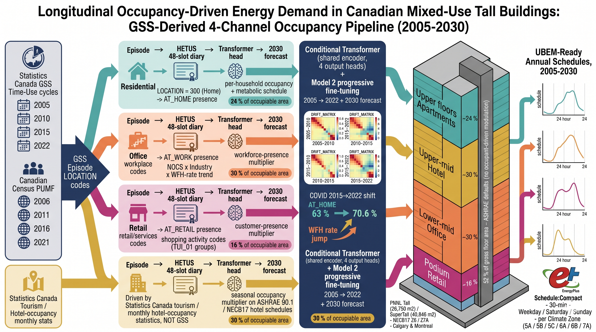

---

# 1 Introduction

This introduction proceeds as a funnel: from the multi-use gap that motivates the study (§1.1), through the two literatures that address occupancy separately and now need a mixed-use axis added between them (§1.2), to the observation that occupant behaviour is non-stationary per use, and that the uses drift apart rather than together (§1.3); it then states the authors' prior line as the explicit departure point (§1.4) and closes with the contributions and aim of the present study (§1.5).

---

### 1.1 The Multi-Use Gap: Single-Channel Occupancy Applied to Stacked Buildings

Occupant behaviour is now widely recognised as a dominant, unexplained driver of the gap between predicted and measured building energy use, and the response of the field has been to build increasingly capable single-use occupancy generators: Markov-chain, survival-model and time-use-survey-based tools that reproduce the presence and activity of one population inside one building type. That response does not transfer cleanly to a tall building that stacks several uses at once. A mixed-use tower carries households on some floors, an office workforce on others, retail customers at grade, and hotel guests in a separate tower, all sharing one envelope, one central plant, and often one energy meter, yet the occupancy signal driving such a model is still, in current practice, a single channel: one schedule is chosen (most often residential or office), applied uniformly, and the remaining uses are left on their code-default densities. The populations behind these four uses are not interchangeable. Households, a workforce, customers and overnight guests keep different hours, respond to different drivers (commuting patterns, retail footfall, tourism demand), and are observed, if at all, by different data sources. A single-channel occupancy model applied to a stacked building therefore either represents one use correctly and holds the rest at a static default, or blends several populations into one signal that represents none of them precisely. This is the gap the present study addresses: not "does time-series occupancy improve a building energy model," which the authors' own prior line has already answered for a single use, but "what happens when that model has to carry four functionally distinct populations inside one structure, on four largely independent temporal signals."

---

### 1.2 Two Literatures That Rarely Meet, Now With the Mixed-Use Axis

Two literatures bear on this problem, and between them sits a cell that Table 1 shows to be unoccupied. The first develops calibrated, time-use-survey-driven occupancy models with genuine behavioural grounding, but stays single-channel and residential: Buttitta and Finn (2020) use the Irish time-use survey to generate high-resolution residential heating-load occupancy, and Widén and Wäckelgård (2010) do the same from a single-wave Swedish time-use survey; neither extends the method to a second use, and neither forecasts to a future year. The second develops genuinely multi-channel, mixed-use occupancy, but not from a time-use survey and not inside one stacked building: Doma and Ouf (2023, 2024) model office, retail and residential occupancy together from mobile-positioning (SafeGraph) snapshots, at a district scale, with each use represented as a separate building rather than as stacked floors sharing one plant, and without a forecast horizon. Read across Table 1's six positioning axes, none of the three named studies combines a time-use-survey-driven behavioural model, more than one occupancy channel, a forecast to a future year, and a single mixed-use building in one design. That is the cell this paper's Leg-3 row occupies, and it is the cell the present pipeline was built to fill: four occupancy channels driving four uses inside one building, forecast forward from a calibrated behavioural time-series.

**Table 1.** - Seven-column competitor positioning matrix scoring Doma and Ouf (2023/2024), Buttitta and Finn (2020) and Widén and Wäckelgård (2010) against time-series occupancy, multi-channel (more than one use), calibrated behavioural model, forecast to a future year, mixed-use single building, activity/end-use resolution and stock-scale, with this study's Leg-3 and 2J rows bolded to show the increment.

*Differentiation targets named in dr_L3-10 §2.4 "Closest Prior Works & Differentiation": Doma & Ouf,
Buttitta & Finn, Widen & Wackelgard. Both "this study" rows are listed separately so the increment
from 2J to Leg-3 is visible.*

| Study | Time-series occupancy | Multi-channel (>1 use) | Calibrated behavioural model | Forecast to a future year | Mixed-use single building | Activity/end-use resolved | Stock-scale |
|---|:---:|:---:|:---:|:---:|:---:|:---:|:---:|
| Doma & Ouf (2023/2024) | n/r | ✓ | n/r | ✗ | ✗ | ✓ | n/r |
| Buttitta & Finn (2020) | ✓ | ✗ | n/r | ✗ | ✗ | n/r | n/r |
| Widen & Wackelgard (2010) | ✓ | ✗ | ✓ | ✗ | ✗ | ✓ | ✗ |
| **This study (Leg-3)** | **✓** | **✓** | **✓** | **✓** | **✓** | **✓** | **✗** |
| **This study (2J)** | **✓** | **✗** | **✓** | **✓** | **✗** | **✓** | **✓** |

**Reading of the matrix.** The three named competitors each hold one axis Leg-3 combines: Doma & Ouf
put multiple uses (office, retail, residential) in one modelling framework but from mobile-positioning
snapshots, not a time-use survey, and at district scale, not inside one building. Buttitta & Finn and
Widen & Wackelgard both drive occupancy from a time-use survey but stay single-channel, residential
only, single-wave, with no forecast. **The cell none of the three occupies is a time-use-survey-driven,
multi-channel, forecast-to-a-future-year model inside a single mixed-use building** - that is the
Leg-3 cell dr_L3-10's positioning verdict names as "genuinely unclaimed in the literature." The 2J row
is carried alongside Leg-3 to show the increment is additive: 2J already cleared time-series,
calibration, forecast, activity-resolution and stock-scale on the residential-only, single-channel
problem; Leg-3 trades stock-scale representativeness (2 tower prototypes, not a housing stock) for
multi-channel and mixed-use-single-building resolution, which 2J did not attempt.

**Cells marked `n/r`.** dr_L3-10's Novelty Matrix (Table 3) and Reporting Survey (Table 1)
do not use the same six axes as this table, so several cells are not directly stated in the two
permitted sources and are left as `n/r` rather than inferred:
- Doma & Ouf - *Time-series occupancy*: dr_L3-10 states the occupancy source is "Mobile positioning
  data (SafeGraph snapshots)" and separately that the study is **not** longitudinal (2019-2021
  snapshot); neither statement confirms or denies within-day temporal resolution.
- Doma & Ouf - *Calibrated behavioural model*: not characterised as calibrated or uncalibrated in
  either source.
- Doma & Ouf - *Stock-scale*: dr_L3-10 Table 1 says occupancy is "modeled as separate buildings at a
  district scale"; district-scale is not the same claim as stock-scale and no building count is given.
- Buttitta & Finn - *Calibrated behavioural model*, *Activity/end-use resolved*, *Stock-scale*: dr_L3-10
  states only that the study is time-use-survey-driven (Irish TUS), residential-only, and uses MURB
  archetypes; it does not characterise calibration, activity/end-use resolution, or scale.

---

### 1.3 Behaviour Is Non-Stationary Per Use, and the Uses Move in Different Directions

The authors' prior residential work established that occupant behaviour is not stationary through the COVID/work-from-home structural break, and that a schedule anchored to a pre-pandemic baseline mis-estimates both how much energy is used and when. A stacked mixed-use building sharpens that finding rather than repeating it, because the non-stationarity is not one trend line shared by every floor; it is four separate trends, each attached to a different use, and they do not move together. Office presence is pulled down by the persistence of hybrid and work-from-home arrangements. Retail presence is pulled down by a longer-running structural shift toward e-commerce: the measured weighted episode-time share of shopping locations in the General Social Survey declines by roughly 25% across the four cycles used in this pipeline (Table 7, L14), a decline this study's own deep-research check found to be internationally normal in direction and comparable in magnitude to the United States, the United Kingdom and the European Union. Hotel presence follows neither of these slopes; it collapses sharply during the pandemic and recovers along a province-level tourism trajectory that this pipeline reconstructs directly from occupancy-rate statistics rather than from a household survey, because hotel guests are outside the General Social Survey's sampling frame by construction (Table 7, L1). Residential presence, by contrast, is the one channel the authors' prior line already showed moving upward through the same period. A single "occupancy" trend, scaled and reused across four uses, would therefore misrepresent at least three of the four channels in sign, timing, or both. This is the concrete argument for why the present study jointly trains four channel-specific signals rather than deriving three of them from one calibrated residential series: the uses are not stationary, and they are not non-stationary in the same direction.

---

### 1.4 The Authors' Prior Line: Leg-1 to 2J to Leg-2, the Departure Point

The present study departs from a specific prior line of work by the authors, built in three stages. Leg-1, published as the second journal in this line (2J), established a single-channel, residential-only occupancy pipeline: General Social Survey time-use cycles harmonized and augmented by a calibrated conditional generator, linked to the Census dwelling stock, and forecast to 2030 through the COVID/work-from-home break, together with the paired stock-scale simulation design used to isolate the behavioural signal (Iseri and Hachem-Vermette, under review; Iseri and Hachem-Vermette, 2026). That line is treated here as established, not re-claimed: the premise that survey-grounded, time-series occupancy can be generated for Canadian building energy models, and that it changes both magnitude and load shape, is the foundation this paper builds on rather than a result this paper repeats. A second, intermediate construction stage, referred to in this paper as Leg-2, extended that single-channel machinery to two channels, residential and office, growing the generator from one decoder head to two and establishing the modulate-versus-replace distinction that the present pipeline reuses: residential presence replaces baseline schedules per household, while office presence modulates a code-of-record density rather than overriding it. Leg-2 is a construction step in this project, not a second headline result, and it is discussed further, on its own terms, only in the Methods chapter, where its two-channel machinery and one hard-won wiring-verification lesson are the direct ancestors of the present design.

---

### 1.5 Contributions and Aim of the Study

This paper makes four advances over the two-channel construction stage it is built on.

1. **Architecture.** A shared-encoder Transformer with three General Social Survey decoder heads (residential, office, retail) is jointly trained alongside a non-GSS hotel side-track driven by provincial tourism statistics, with a decode-time exclusivity projection that drives the raw impossible-state rate from at most 0.5% down to 0% without distorting the individual channel marginals.
2. **Injection.** A per-space Tag-2 exact-match dispatch routes all four channels into the same physical tower geometry: apartment tags replace baseline schedules, office/retail/guest-room tags modulate code densities, and any missing channel falls back to the untouched code baseline, so the injection is additive by construction rather than by assertion.
3. **Experimental design.** A 56-cell campaign (four channels, two tower prototypes, two Canadian cities) forecasts all four channels from 2005 to 2030 under one scenario lever per channel, isolating channel-specific sensitivity inside a single stacked building rather than across a housing stock.
4. **Validation stance.** Three of the four channel-level energy-use-intensity gates are reported failing, at full strength, together with the evidence bearing on whether the reference band or the model is at fault, most notably an uninjected control that fails the office band on its own and two explanatory mechanisms refuted in every one of 56 cells; no band is widened, and no scoring rule is chosen because it happens to pass.

The aim of the study follows directly. *This paper asks whether one jointly-trained occupancy model can drive four functionally distinct uses inside a single stacked building, and where the energy-use-intensity references built for single-use stock do, and do not, still apply.* The full pipeline that operationalises this question is summarised in Figure 1, with each stage detailed in the sections that follow: the datasets (§2), the methods spanning harmonization through the four-channel injection (§3), the paired experimental design (§4), the results from per-channel behaviour to the three failing gates (§5), the discussion of what a multi-channel model buys and why the band failures are findings about applicability rather than error (§6), the limitations (§7), and the conclusion (§8).

**Figure 1.** - End-to-end Steps 1-9 for the four-channel pipeline, each block annotated with its section reference; the two channels inherited from the construction stage (residential, office) are marked in one colour and the two Leg-3 additions (retail, hotel) in another, with the hotel side-track marked as bypassing the Transformer entirely.

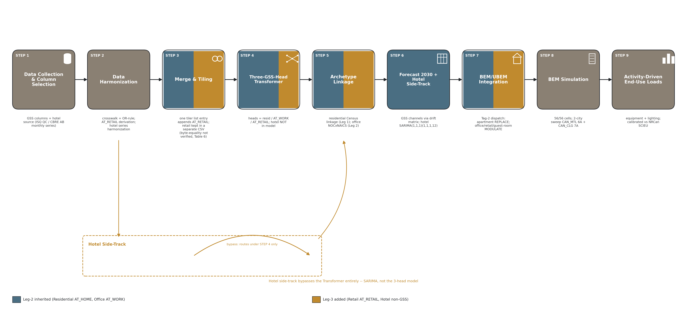

**Figure 2.** - The three-leg roadmap: the single-channel residential stage, the two-channel construction stage it grew into, and the four-channel model reported here, with each leg drawn as containing the previous one and the artefacts carried forward marked along a connector beneath all three.

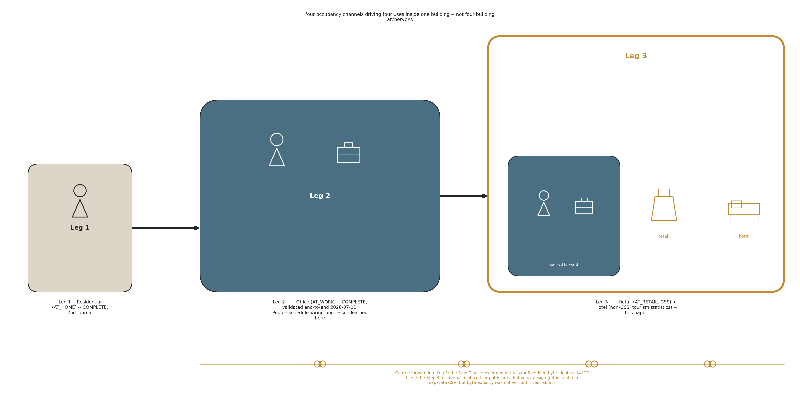

---

## References (this chapter)

*Full bibliographic entries below are taken directly from `Leg3_4-split/deepResearch/dr_L3-10_mixeduse_reporting_positioning_REPORT.md` (the source cited throughout Table 1), which is the only citation-lookup already performed for this project; no new literature search was run to produce this chapter.*

**Self-citations (the departure point, §1.4)**

- Iseri, O. and Hachem-Vermette, C. (under review) *Longitudinal Analysis of Occupancy-Driven Energy Demand in Canadian Residentials.* Journal of Building Performance Simulation. - *(verify final citation form / status against master bibliography)*
- Iseri, O. and Hachem-Vermette, C. (2026) *Longitudinal Analysis of Occupancy-Driven Energy Demand in Canadian Residentials* (companion conference paper). eSim 2026, IBPSA-Canada. - *(verify final citation form / venue against master bibliography)*

**Positioning literature (§1.2, Table 1)**

- Doma, A. and Ouf, M. (2024) Bottom-up framework for modelling occupancy-based demand-side management strategies in a mixed-use district. *Applied Energy*, 355, 122247. https://doi.org/10.1016/j.apenergy.2023.122247 - **DOI DISPUTED, DO NOT SUBMIT UNTIL RESOLVED.** `RV08` reports this DOI resolves to an unrelated paper on hydrogen production, and gives the citation instead as Doma, A., Padsala, R., Ouf, M. M. and Eicker, U. (2024), *Applied Energy*, 375, 124081, https://doi.org/10.1016/j.apenergy.2024.124081. Both forms are internally consistent, so only opening the DOI can decide. Not swapped on one unverified report.
- Doma, A. and Ouf, M. (2023) Leveraging mobile positioning data to model building occupant behaviour in a mixed-use district. *Proceedings of Building Simulation 2023: 18th Conference of IBPSA*, pp. 1671-1678. https://publications.ibpsa.org/proceedings/bs/2023/papers/bs2023_1671.pdf
- Buttitta, G. and Finn, D.P. (2020) A high-temporal resolution residential building occupancy model to generate high-temporal resolution heating load profiles of occupancy-integrated archetypes. *Energy and Buildings*, 206, 109562. https://doi.org/10.1016/j.enbuild.2019.109562 - **DOI DISPUTED, DO NOT SUBMIT UNTIL RESOLVED.** `RV08` reports this DOI resolves to an unrelated paper on sleep and thermoregulation, and gives the article number instead as 109577, https://doi.org/10.1016/j.enbuild.2019.109577. Volume 206 is agreed by both. Not swapped on one unverified report.
- Widén, J. and Wäckelgård, E. (2010) A Swedish time-use survey and its utility for building energy modeling. *Energy and Buildings*, 42(5), pp. 706-714. https://doi.org/10.1016/j.enbuild.2009.11.010

**Statistics Canada and provincial tourism data sources** - full catalogue metadata for the General Social Survey Time-Use cycles and the ISQ/CBRE monthly hotel-occupancy series is given with the dataset descriptions in §2 and is not duplicated here.

---

# 2 Datasets

Four occupancy channels drive four uses inside one stacked building: Residential, Office, Retail, and
Hotel. Three of the four channels are survey-derived; the fourth, Hotel, is deliberately sourced
outside the survey frame. This chapter inventories every input the four-channel generator and its
downstream simulation campaign consume. Channel provenance is summarized in Table 2; the simulation
domain built from the weather and prototype inputs described below is summarized in Table 3.

---

### 2.1 General Social Survey Time-Use Microdata (2005-2022)

The behavioural backbone for three of the four channels is the same four cross-sectional waves of the
Statistics Canada General Social Survey (GSS) Time-Use program used in the authors' prior work: Cycle
19 (2005), Cycle 24 (2010), Cycle 29 (2015), and the GSS Time Use 2022 cycle (GSSP). Residential
(AT_HOME) and Office (AT_WORK) presence are read from the harmonized diary exactly as in the two-channel
construction stage (Leg-2; see Chapter 3). The one new GSS-derived channel added for this paper is
Retail (AT_RETAIL): a customer-presence indicator constructed from the `occPRE` (location) and `occACT`
(activity) columns that were already carried in every cycle, so no new GSS variable was collected.
`occPRE`/`occACT` location-mapping coverage is per cycle: 2005 and 2010 use `PLACE = 06+07`; 2015 uses
`LOCATION = 306`; 2022 uses `LOCATION = 3306`. Grocery and general-merchandise shopping are not
separable in the 2015 and 2022 cycles, which record a single combined shopping-location bucket; the
AT_RETAIL derivation and its frozen OR-rule are given in full in Chapter 3 (§3.1) and in Table 2's
footnote.

One population that the GSS records but that this paper's Retail channel deliberately does not model
is retail staff: workers present in a store are coded by the survey as engaged in `AT_WORK`, not as a
retail-specific activity, so no GSS signal distinguishes a shopper from a cashier. Retail worker density
therefore stays on the NECB code baseline being modulated, and the Retail channel models customer
presence only (Table 2, footnote 2).

---

### 2.2 Census Public-Use Microdata for Dwelling-Stock and Workforce Linkage

The Statistics Canada Census Public-Use Microdata File (PUMF) provides the dwelling-stock and workforce
variables used to situate Residential and Office diary respondents within a representative building and
labour-force population. This linkage stage is unchanged from the two-channel construction stage
(Chapter 3, §3.3): dwelling type, tenure, and household-size variables anchor the Residential channel,
and NOC-by-NAICS occupation/industry crosswalks anchor the Office channel. Retail and Hotel do not use
the Census PUMF linkage. Retail is modelled at the population level against a single PNNL "Retail
Retail" archetype rather than through a per-respondent Census match, because the grocery/merchandise
split needed for a finer archetype lookup is not recoverable from the 2015/2022 GSS location codes
(§2.1). Hotel has no respondent-level archetype at all: guests are entirely outside the GSS sampling
frame, so the channel is driven by a province-level multiplier rather than by any individual linkage
record (§2.3).

---

### 2.3 Provincial Tourism Statistics as a Non-Survey Channel Source

Hotel is the one channel in this paper with no General Social Survey signal behind it at all: overnight
hotel guests are, by construction, outside the GSS Time-Use sampling frame, which samples the resident
population at their dwelling of record. Injecting the Hotel channel from a GSS-derived series would
therefore systematically under-occupy hotel zones, since the survey simply never interviews a guest
in a hotel room. This is a frame limitation, not a data-quality one, and it forces the Hotel channel to
be built from an entirely separate, non-survey data family: monthly provincial tourism statistics.

No StatCan table of monthly hotel-occupancy rates exists (finding dr_L3-01); the paper therefore draws
on the two provincial data sources available for the cities in the simulation domain. For Quebec, the
source is the Institut de la statistique du Québec (ISQ) monthly hotel-occupancy series. For Alberta,
the source is CBRE / Travel Alberta market reporting, with the 2005-2009 span of the Alberta series
spliced from CBRE National Market Report archives. Both provincial series carry YEAR, MONTH, province
(PR), occupancy rate, average daily rate (ADR), and RevPAR fields and span 2005-2022. This
tourism-statistics series is converted to a monthly multiplier by a SARIMA model with an explicit
COVID-19 indicator (Chapter 3, §3.4); it never passes through the three-head Transformer used for the
three GSS channels, because it has no respondent-level structure to condition on (Chapter 3, §3.2).

---

### 2.4 NECB / PNNL Prototype Building Stock

The building domain is the U.S. DOE / PNNL Tall and SuperTall mixed-use tower prototypes, built to the
NECB-2017 standard, reused from the two-channel construction stage without modification to their
geometry. Total occupiable floor area, measured directly from the model geometry rather than assumed,
is reported per prototype in Table 3. Each prototype's Space objects carry an IDF `Tag 2` field that
functions as the per-Space routing key for occupancy injection (Chapter 3, §3.5): apartment tags,
office tags, retail tags, and guest-room tags each resolve to a distinct one of the four channels,
while amenity and service/MEP tags carry no occupant-driven channel and remain on the untouched NECB
default schedule.

---

### 2.5 Weather Files

The simulation domain spans two Canadian cities selected to bracket a one-zone climate contrast within
the campaign: Montréal (ASHRAE climate zone 6A) and Calgary (ASHRAE climate zone 7A). One Typical
Meteorological Year EnergyPlus weather file (EPW) is used per city. The two prototype IDFs (Montréal,
Calgary) differ from one another by geometry-preserving, climate-tag-only edits, so that EUI differences
between the two cities can be attributed to climate rather than to any building-geometry covariate
(Table 3). All simulations run in EnergyPlus v24.2. The full two-prototype-by-two-city-by-fourteen-
scenario, 56-cell campaign built from these weather and prototype inputs is defined in Chapter 4.

---

## References (this chapter)

*Carried from the two-channel construction stage; to be merged into the manuscript master
bibliography.*

- Statistics Canada, General Social Survey - Time Use: Public Use Microdata Files (Series Catalogue
  no. 45-25-0001). Individual cycles: 12M0019X (Cycle 19, 2005), 12M0024X (Cycle 24, 2010), 89M0034X
  (Cycle 29, 2015), and 45-25-0001 issue 2025001 (Time Use, 2022).
- Statistics Canada, Census of Population: Public Use Microdata Files (Series Catalogue no.
  98M0001X).
- Institut de la statistique du Québec (ISQ), monthly hotel-occupancy statistics. n/r
  (exact table/catalogue identifier).
- CBRE / Travel Alberta market reporting, Alberta hotel-occupancy and ADR series, including CBRE
  National Market Report archives for the 2005-2009 span. n/r (exact report/catalogue
  identifier).
- National Research Council Canada, National Energy Code of Canada for Buildings 2017.
- U.S. Department of Energy / Pacific Northwest National Laboratory, Tall and SuperTall mixed-use
  prototype building models.
- U.S. Department of Energy (2024) EnergyPlus (Version 24.2.0). National Renewable Energy Laboratory
  (NREL).

---

**Table 2.**

Four occupancy channels drive four uses inside one stacked building (not four building archetypes;
see Standing rules). Residential and Office are the Leg-2 channels, reused; Retail is the one new GSS
channel; Hotel is the one non-GSS, tourism-statistics side-track.

| Channel | Source | Derivation | Injection mode | Scenario lever |
|---|---|---|---|---|
| Residential (AT_HOME) | GSS Time-Use, Leg-1 | Household matched via Census PUMF linkage; `Number_of_People_Schedule` = `HHSIZE`, drawn per residential Space | REPLACE (full substitution of the code schedule) | none |
| Office (AT_WORK) | GSS Time-Use, Leg-2 | AT_WORK presence from Transformer Head 2; archetype linkage NOCxNAICS (Leg-2) | MODULATE - NECB office density x AT_WORK_fraction(t) | WFH band (conservative / hybrid / fullyhybrid) |
| Retail (AT_RETAIL) | GSS Time-Use, Leg-3 - the one new GSS channel | AT_RETAIL derived from `occPRE`/`occACT` already carried in the survey (see footnote 1); Transformer Head 3 (new); single PNNL "Retail Retail" archetype, population-level fraction, no per-household lookup (grocery/merchandise not separable in 2015/2022) | MODULATE - People = 0.95 x peak-normalized shape_cd(t) in customer hours; staff-only slots (<= 0.10) keep the NECB baseline (see footnote 2) | In-store share, 2030 bands (0.97 default / 0.90 / 1.05) + QC-Sunday sub-axis |
| Hotel | non-GSS - ISQ (Quebec) monthly series + CBRE / Travel Alberta (Alberta) monthly series | ISQ/CBRE monthly occupancy rate to SARIMA(1,1,1)(1,1,1,12) per province + COVID indicator (2020-03 to 2022-06) to `hotel_multiplier(t,month,PR) = s(t) x monthly rate`; `s(t)` = unit-normalized 48-slot guest-room shape (dr_L3-05) | MODULATE - NECB guest-room schedule x `hotel_multiplier(t,month,PR)` | SARIMA 2030 bands (0.92 / 1.00 / 1.05) |

## Footnotes

**1. AT_RETAIL rule, frozen 2026-07-02 (OD-1).**

```
AT_RETAIL = (occPRE == 5) | ((occACT == 4) & occPRE in {5, 9})
```

Location-mapping detail by cycle: 2005/2010 `PLACE = 06+07`; 2015 `LOCATION = 306`; 2022
`LOCATION = 3306`. The activity arm (`occACT == 4`, "Purchasing Goods & Services") is gated to
`occPRE in {5, 9}` specifically to exclude the online-shopping wrinkle
`occACT == 4 & occPRE == 1` (shopping from home) from being counted as retail presence. That
online-shopping leak cross-tab is still reported per cycle as a verification check, even though the
rule itself is frozen and not reopened by it. Restaurant presence (`occPRE == 7`) is available in all
cycles and is explicitly out of scope (no prototype Space to drive it).

**2. Retail staff are invisible in GSS.** Retail workers are logged as AT_WORK (the office channel),
not as a retail-specific activity, so no GSS signal exists for staff presence. Staff-only slots
therefore stay on the NECB baseline density, and the retail channel models **customer presence
only** - worker density already lives in the NECB baseline being modulated.

---

# 3 Methods

Each pipeline stage is presented with its design rationale and its validation result. Residential and
Office reuse the two-channel construction stage (Leg-2) without change to their harmonization,
architecture, or linkage logic; that stage is described here only where its output is a direct input to
the two new channels, or where one of its lessons became a hard gate carried into this paper. The
complete gate set referenced throughout this chapter is given in Table 4, with each threshold's
provenance (ASHRAE Guideline 14, project-chosen, or heuristic) marked explicitly there rather than
repeated in prose.

---

### 3.1 Harmonization and the AT_RETAIL Derivation

Residential and Office harmonization - the mapping of raw cycle-specific activity and location codes to
a shared vocabulary, and the tiling of each diary onto the 48-slot, 30-minute grid - is unchanged from
the two-channel construction stage and is not restated here. The one harmonization addition made for
this paper is the derivation of the Retail channel, AT_RETAIL, from columns the survey already carries
in every cycle: `occPRE` (location) and `occACT` (activity). No new GSS variable was collected or coded
for this addition.

The derivation rule, frozen 2026-07-02 (decision OD-1), is:

```
AT_RETAIL = (occPRE == 5) | ((occACT == 4) & occPRE in {5, 9})
```

The activity arm (`occACT == 4`, "Purchasing Goods & Services") is deliberately gated to
`occPRE in {5, 9}` to exclude a specific wrinkle: `occACT == 4 & occPRE == 1` records purchasing
conducted from the respondent's own home (online shopping), which is not retail-space presence and must
not be counted as such. This exclusion is not merely asserted; the online-shopping leak cross-tab is
recomputed and reported for every GSS cycle as a standing verification check, even though the rule
itself is not reopened by that check. The location-mapping detail differs by cycle, because the
underlying `PLACE`/`LOCATION` coding scheme changed across GSS redesigns: 2005 and 2010 use
`PLACE = 06 + 07`; 2015 uses `LOCATION = 306`; 2022 uses `LOCATION = 3306`. In both 2015 and 2022 the
grocery and general-merchandise shopping locations are collapsed into a single bucket, so the two cannot
be separated for those cycles (Table 2, footnote 1).

The merge step that appends AT_RETAIL to the diary record is the one place the GSS build pipeline itself
changes for this paper: the tiler that produces the 30-minute channel columns was already list-driven in
the two-channel construction stage, so adding Retail is one additional list entry rather than a new
tiling procedure. Retail is written to its own CSV file rather than into the existing residential/office
output, specifically so the addition cannot overwrite or reshape the two reused channels' columns.

Restaurant presence (`occPRE == 7`) is available in every cycle and was considered as a candidate fifth
channel; it is explicitly out of scope for this paper because no prototype Space in the Tall/SuperTall
towers corresponds to a restaurant use.

---

### 3.2 The Three-Head Transformer

The conditional generator used to synthesize unobserved day-types for the three GSS-derived channels is
grown directly from the two-channel construction stage's architecture, not designed from scratch. The
shared encoder is unchanged; the decoder side gains one head. The decoder therefore carries three heads
in total: Head 1 (Residential presence), Head 2 (AT_WORK / Office), and Head 3 (AT_RETAIL / Retail, the
one addition for this paper). Hotel has no head and never passes through this model at all; it is
produced by an entirely separate side-track described in §3.4.

The three heads are trained under fixed-weight scalarization with loss weights 1.0 : 0.5 : 0.3
(Residential : Office : Retail) combined with PCGrad pairwise gradient-conflict correction. This
combination was selected over dynamic loss-balancing schemes (SLAW, uncertainty weighting) because those
schemes proved unstable on the approximately 2%-positive Retail task; fixed weights tuned before
training matched or beat the dynamic alternatives at this task count. Retail's rarity is addressed with
a binary cross-entropy loss at `pos_weight = 49`, corrected at inference by subtracting the corresponding
`-ln 49` logit shift so that the class-imbalance correction does not distort the decoded probability
scale. Training proceeds as a 5-epoch head-only warmup followed by 15 epochs of joint fine-tuning with
PCGrad active throughout the joint phase. Decoding uses temperature T = 0.7 with a minimum-dwell
constraint of two consecutive slots, and per-head decision thresholds of 0.50 (Residential), 0.40
(Office), and 0.15 (Retail) - the lower Retail threshold reflecting its lower base rate.

CYCLE_YEAR is encoded as a continuous conditioning value rather than a categorical one, so that the
model remains usable for the 2030 forecast year without retraining on a held-out category (§3.4).

Because independent binary heads can jointly predict a respondent as present in more than one channel
at the same slot, the raw decoder output is passed through a decode-time, threshold-normalized argmax
projection that enforces mutual exclusivity across the three channels before the output is used
downstream. Table 4 reports this as the Impossible-State Rate (ISR) gate: raw ISR must fall at or below
0.5%, and the projected ISR must reach exactly 0%. A categorical softmax alternative was considered and
rejected, because it would crush the roughly 2%-positive Retail class and would also break bit-compatible
continuity with the two-channel construction stage's own Head-1/Head-2 outputs; the chosen
projection-after-independent-heads design preserves per-head calibration while still guaranteeing
one-channel-at-a-time occupancy.

Residential and Office are not left to drift freely as the third head is added: a regression gate
(Table 4) bounds how far the two reused heads' output may move relative to the two-channel construction
stage's own validation baseline, expressed as a Jensen-Shannon divergence tolerance rather than as a
bit-identity requirement.

**Checkpoint selection, and a disclosed deviation between the specification and the shipped artefact.**
The specified selection rule is gate-first then lexicographic: discard every checkpoint that fails any
hard gate, then maximize Retail F1 among the survivors, with no composite score at any stage. The
prohibition on composites is not stylistic. It is a finding carried forward from the first leg of this
project, where a composite score selected a model that passed only two of four gates, and it is
recorded as a standing principle in the two-channel stage's own pipeline document. **The shipped
weights were nevertheless not selected by that rule.** The training driver checkpoints on
`val_score = mean_js + 0.5 x (home_gap + work_gap + retail_gap) / 3`, a composite that contains
neither PR-AUC nor F1. The two rules select different epochs in four of five seeds. The shipped seed
ranks first of five on the composite and fourth of five on the metric the specification names, and it
sits 0.0218 Retail F1 below the specified rule's winner, which is 5.6 % in relative terms and 0.16
standard deviations of the cross-seed spread.

Three things are stated rather than smoothed over. First, the specification is not amended to describe
what the code does, because rewriting the rule at the moment it becomes inconvenient would delete the
principle that motivates it. Second, the reason for not re-selecting is evidential rather than
economic: both rules rank epochs on teacher-forced validation columns, and a separate person-level
probe established that those columns are blind to person-level Retail skill, so re-selecting would buy
0.0218 of a statistic already shown not to measure the quantity of interest. Third, the specified rule
was never implementable as written on this data. Two of its five hard-gate families are pool-level
quantities, computable only after inference and raking, and absent from every column of the training
log; and on the observed range the gate clause is inert in any case, since the worst epoch of the run
clears PR-AUC 0.518 against a bar of 0.15, F1 0.282 against 0.25, and raw ISR 0.014 % against 0.5 %,
so gate-first then argmax reduces to global argmax F1. A reader who wishes to re-implement the
specified rule must first make its first clause affordable or drop it explicitly.

---

**Figure 3.** - Shared encoder with three GSS decoder heads (residential, AT_WORK, AT_RETAIL) and, drawn separately and connected to nothing in the encoder, the non-GSS hotel side-track. The architecture is three GSS heads plus one non-GSS side-track, not four heads.


**Figure 4.** - The exclusivity projection: three independent sigmoid outputs, which may conflict, passed through a threshold-normalised argmax to a mutually exclusive decode, with the impossible-state rate before and after.

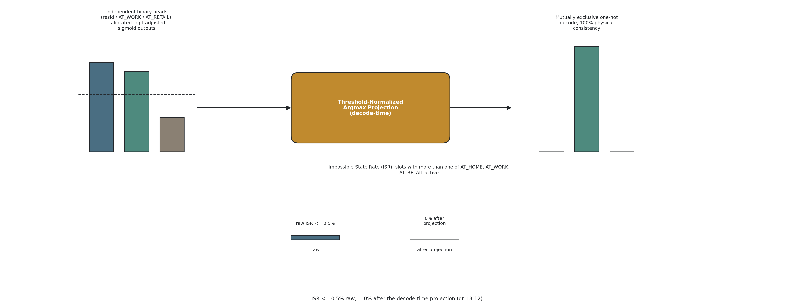

---

### 3.3 Linkage and the Population-Level Retail/Hotel Fallbacks

Residential linkage (household matching via the Census PUMF) and Office linkage (workforce matching via
NOC-by-NAICS crosswalks) are unchanged from the two-channel construction stage; the mechanics of both
are not restated here.

Retail and Hotel do not receive a respondent-level linkage at all, for two different reasons that both
resolve to the same population-level fallback design. Retail cannot be linked to a specific archetype at
finer resolution than a single population fraction, because the grocery/merchandise location split
needed to place a respondent against a particular retail sub-type is not recoverable from the 2015/2022
GSS coding (§3.1); the channel is therefore driven by a single PNNL "Retail Retail" archetype applied as
a population-level fraction rather than as a per-household lookup. Hotel cannot be linked to any
respondent at all, because hotel guests are outside the GSS sampling frame by construction (Chapter 2,
§2.3); the channel is therefore driven by a province-level multiplier (Quebec or Alberta) rather than by
any individual archetype record. Both fallbacks are additive-safe in the same sense used elsewhere in
this pipeline: a channel with no per-respondent linkage available falls back to a population- or
province-level signal rather than to a missing value.

---

### 3.4 Forecasting and the Hotel SARIMA Side-Track

Residential and Office are forecast to 2030 by the same reused mechanism as the two-channel construction
stage: progressive fine-tuning across the GSS cycle chain (2005 to 2010 to 2015 to 2022) with weight
inheritance, plus the same demographic drift-matrix accounting. Retail reuses this same GSS chain for its
generative-model output, and layers a separate scenario lever on top: three named 2030 in-store-share
bands (0.97 plateau/resilient-central default, 0.90 continued-shift, 1.05 in-store-renaissance), applied
before the peak-normalization step described in §3.5, plus a QC-Sunday sub-axis reflecting Quebec's
distinct regulated Sunday retail hours.

Hotel is forecast by a side-track that bypasses the three-head Transformer entirely, because it has no
respondent-level structure for that model to condition on. The monthly ISQ (Quebec) and CBRE (Alberta)
occupancy-rate series (Chapter 2, §2.3) are each fit with a SARIMA(1,1,1)(1,1,1,12) model per province,
with an explicit COVID-19 indicator covering March 2020 through June 2022 so that the pandemic-era
occupancy collapse does not bias the fitted seasonal structure. The fitted model produces a monthly
occupancy-rate forecast that is converted into a half-hourly multiplier by:

```
hotel_multiplier(t, month, PR) = s(t) x monthly_rate(month, PR)
```

where `s(t)` is a unit-normalized, 48-slot guest-room diurnal shape common to both provinces: an
overnight plateau at 1.00 from 22:00 to 06:00, and a day trough of 0.200 on weekdays versus 0.308 on
weekends. The side-track's own backcast validation gate (Table 4) requires QC and AB monthly
reconstructions for 2015-2019 to reach a mean absolute error below 0.05, and requires the 2020-04
COVID-dip reconstruction to recover without overshoot. The 2030 forecast is expressed as three named
bands (0.92, 1.00, 1.05) around the central SARIMA projection, mirroring the scenario-lever pattern used
for the Office WFH band and the Retail in-store-share band (§3.5, §4).

---

**Figure 6.** - The hotel side-track end to end: provincial monthly tourism statistics, the SARIMA forecast with its COVID indicator, the diurnal shape function, and the resulting multiplier applied to guest-room schedules. The channel never touches the Transformer.

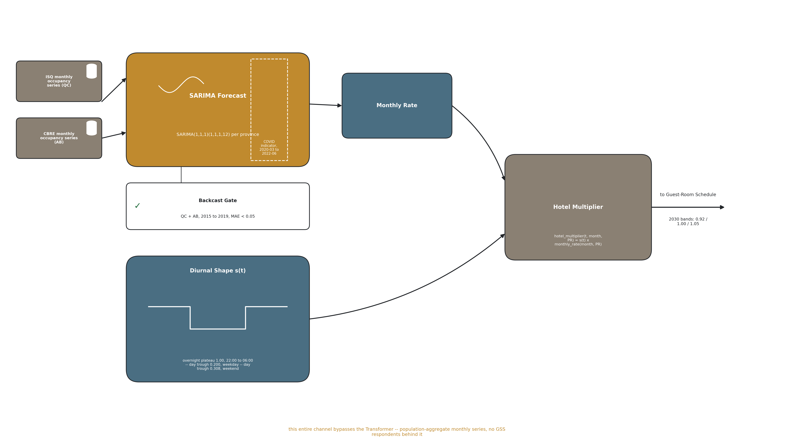

---

### 3.5 Tag-2 Dispatch and Modulate-vs-Replace

Injection into the building energy model is dispatched per Space using the IDF `Tag 2` field as an
exact-match routing key, because the PNNL Tall/SuperTall prototypes leave the standard EnergyPlus Space
Type field blank. Four dispatch outcomes follow from the tag match, and they are not interchangeable:

- **Apartment tags -> Residential, REPLACE.** The code default `People` schedule is fully substituted by
  the modelled schedule (`Number_of_People` driven by household size). Replacement is appropriate here
  because residential occupancy is per-household, not a code-density baseline to be adjusted.
- **Office tags -> Office, MODULATE.** The NECB office occupant density is multiplied by the modelled
  AT_WORK fraction over time, preserving the code-of-record peak density while injecting the temporal
  signal.
- **Retail tags -> Retail, MODULATE.** Customer presence is injected as `People = 0.95 x
  peak-normalized shape_cd(t)` during customer hours; slots identified as staff-only (baseline occupancy
  at or below 0.10) are left on the NECB baseline rather than modulated, consistent with Retail modelling
  customer presence only (§2.1, Table 2 footnote 2). The occupant density used for this Space type is the
  NECB office value (24.97 m2/person) rather than NECB's own Retail-Sales value (29.97 m2/person); this
  is documented as a limitation, not corrected in this paper, because it is a code-density input, not an
  occupancy-schedule question, and correcting it is outside this paper's scope.
- **Guest-room tags -> Hotel, MODULATE.** The NECB guest-room schedule is multiplied by
  `hotel_multiplier(t, month, PR)` from §3.4.
- **Amenity and service/MEP tags -> untouched NECB baseline.** No occupant-driven channel is defined for
  these Space types, so the code default is left in place.
- **Missing channel -> NECB fallback.** Any Space whose tag does not resolve to one of the four channels
  falls back to the untouched NECB default, the same additive-safe behaviour used for the Retail/Hotel
  linkage fallbacks in §3.3.

A hard wiring gate is asserted after every injection, and its origin is a defect found in the two-channel
construction stage, not in this paper's own new code. In that construction stage, a modulated People
schedule was referenced by the field `Schedule_Name` rather than the field the `People` object actually
consumes at simulation time, `Number_of_People_Schedule_Name`. Because the misreferenced field still
existed and still held a syntactically valid schedule, every input-side check available at the time -
schedule presence, schedule syntax, field non-emptiness - passed cleanly; the defect flattened the Office
channel's temporal signal and was caught only when Office simulation output failed to differ from an
unmodulated baseline, an output-side observation. The post-injection gate that now asserts the correct
field on 100% of modulated Spaces (Table 4, Wiring row) closes that specific input-side blind spot. But
an input-side assertion, however strict, is still an input-side check, and the defect that motivated it
was caught only on the output side; this is why the campaign design in Chapter 4 additionally makes two
output-side probes mandatory before any Leg-3 campaign cell is accepted, rather than leaving output-side
verification to good practice. The wiring defect and the gates it motivated are a methods contribution
carried forward from the two-channel construction stage into this paper's validation design; the
construction stage itself does not receive a results narrative here.

---

**Figure 5.** - Tag-2 exact-match dispatch for every Space in the tower: apartment tags are replaced, office, retail and guest-room tags are modulated, amenity and service/MEP tags are left at the untouched code baseline, and an unrecognised tag falls back to that baseline rather than to an undefined state. The hard wiring gate applies to the modulated branch.


---

### 3.6 End-Use Loads

Activity-driven equipment and lighting loads follow channel-specific rules rather than one shared rule
across all four uses, because the four uses do not share an occupancy semantics. For Retail, lighting and
HVAC-relevant schedules follow the Space's opening hours rather than the customer-presence signal itself,
plug load follows the staff schedule (and therefore stays on the NECB baseline, consistent with §3.5),
and customer presence modulates only the People-driven internal gain; minimum lighting and baseline plug
floors (`Lmin`, `Pbase`) are enforced so that an empty-of-customers slot during opening hours is not
modelled as a fully unlit, unpowered space. For Hotel, guest-room loads are modulated by the same `s(t)`
diurnal shape and monthly amplitude used for occupancy (§3.4), while amenity-zone loads remain on the
NECB baseline, matching the amenity-zone occupancy treatment in §3.5.

The activity-driven end-use layer is calibrated against the NRCan Survey of Commercial and Institutional
Energy Use (SCIEU), the commercial analogue of the residential SHEU anchoring used in the two-channel
construction stage and in the authors' residential-only prior work.

---

**Table 6.**

This table carries the paper's additive claim: Leg-3 adds Retail and Hotel without invalidating a
prior Leg-2 figure. Per the standing hard rule, a **Bit-identical? = Yes** cell is entered only where
this task located file-level evidence (a shared file path, or an md5 computed in this task) - never
from the pipeline overview's prose alone. Where no such evidence was located, both the verdict and the
Evidence cell read `n/r`; that is treated as a successful, honest outcome, not a gap to be
papered over.

| Pipeline step | Leg-2 artefact | Leg-3 change | Bit-identical? | Evidence |
|---|---|---|---|---|
| Step 1 - Data collection | `3rdJ_01_readingGSS_2split.py` - GSS column selection for AT_HOME / AT_WORK | `3rdJ_01_hotelIngest_4split.py` (new, non-GSS: `hotel_occupancy_monthly.csv` from ISQ/CBRE) + `3rdJ_01_readingGSS_4split_val.py`; no new GSS variables added for AT_RETAIL (derives from `occPRE`/`occACT` already carried) | n/r | Script renamed `2split` -> `4split` (`Leg2_2-split/Step1_docs/3rdJ_01_readingGSS_2split.py` vs `Leg3_4-split/Step1_docs/3rdJ_01_readingGSS_4split_val.py`); no byte-level or column-level comparison of GSS-column output was performed in this task |
| Step 2 - Data harmonization | `3rdJ_02_harmonizeGSS_2split.py` - crosswalk + OR-rule for AT_HOME / AT_WORK | `3rdJ_02_hotelHarmonize_4split.py` (new) + the AT_RETAIL OR-rule (frozen OD-1, see Table 2 footnote 1) | n/r | Script renamed; no byte-level or column-level comparison performed in this task |
| Step 3 - Merge and tiling | List-driven `tile_work_to_30min` tiler (cloned from the 9-channel co-presence tiler), residential + office 30-min output | `3rdJ_03_mergingGSS_4split.py` appends one list entry (AT_RETAIL); retail kept in a **separate CSV** (`retail_30min.csv`) specifically so it cannot overwrite the residential/office columns | n/r | The pipeline overview asserts "residential + office paths bit-identical" (`Leg3_4-split/3rdJ_00_4split_Occupancy_Pipeline_Overview.md`, STEP 3 box, line 57) - this is the design **intent** (separate CSV, additive list entry), but per the standing hard rule this prose claim is not itself acceptable evidence; no independent file/column comparison of the tiler's residential/office output was performed in this task |
| Step 4 - Three-GSS-head Transformer | 2-head Transformer (Head 1 resid, Head 2 AT_WORK), `3rdJ_04B_model_2split.py` | 3rd head (AT_RETAIL) added, `3rdJ_04B_model_4split.py`; backbone is "keep + targeted upgrades" (warmup + PCGrad + logit-adjusted BCE + raking), not a frozen copy (dr_L3-11, OD item 13) | No | `3rdJ_00_4split_Occupancy_Pipeline_Overview.md` VALIDATION GATES table, row "Transformer (Regression) \| Old head (Head 1 & Head 2) JS drift \| ΔJS ≤ 0.002 bits vs Leg-2 validation baseline" (line 205) - a **tolerance-based regression gate**, not a bit-identity claim; Head 1/2 outputs are expected to drift by up to 0.002 bits of JS divergence, not to reproduce Leg-2 bit for bit. The measured ΔJS value for this gate was not located in this task - n/r for the number itself |
| Step 5 - Archetype linkage | Residential Census linkage (Leg-1, `3rdJ_05_censusLinkage_2split.py`); Office NOCxNAICS linkage (Leg-2) | Retail: single PNNL "Retail Retail" archetype, population-level fraction, no lookup; Hotel: province-level multiplier (QC / AB), no respondent archetype | n/r | `Leg3_4-split/3rdJ_00_4split_Occupancy_Pipeline_Overview.md` STEP 5 box (lines 79-84) states residential/office linkage is reused ("DONE (Leg 1)" / "DONE (Leg 2)"), but no file/column-level comparison of the Leg-3 linkage output against the Leg-2 linkage output was performed in this task |
| Step 6 - Forecast to 2030 + hotel side-track | `W_2005->W_2010_ft->W_2015_ft->W_2022_ft` GSS raking chain + `DRIFT_MATRIX`; office WFH bands (conservative/hybrid/fullyhybrid) | Same raking chain code reused for GSS channels; retail lever (3 named 2030 bands) added; hotel SARIMA(1,1,1)(1,1,1,12) side-track added, bypassing the Transformer entirely | No | `Leg3_4-split/Step8_docs/3rdJ_08_implementation_improvements.md` "Defaut 4" (lines 267-332, OPEN as of this task): a measured Step-6 calibration bias - post-calibration 2030 work-presence is **-10.51 pp** vs OBS2022 (Cohen's d -0.649), 4-5x the ~2.4 pp WFH signal the campaign exists to detect. This is a documented, measured divergence in the Step-6 output magnitude, not a reproduction of a stable Leg-2-equivalent value; it directly contradicts a "residential/office Step-6 output is unchanged" reading for the 2005-2030 axis (the bias is reported as near-common-mode across the 3 WFH bands, so cross-band deltas are less affected, but the level itself has moved) |
| Step 7 - BEM/UBEM integration | `office_integration.py`, 2-channel Tag-based injection into the same PNNL Tall/SuperTall geometry | `commercial_integration.py::inject_mixed_use()`, Tag-2 exact-match dispatch across 4 channels; missing channel falls back to NECB baseline (additive-safe) | **Yes, for the base prototype geometry only** | Leg-3's own campaign driver reads the **same physical IDF files** from Leg-2's own Step-8 output directory, unmodified, with no copy made (`Leg3_4-split/Step8_docs/3rdJ_08D_campaign_cells.py:121`, `.../office_idfs_v242/{CAN_MTL,CAN_CLG}/`). Md5 computed in this task confirms the 4 files are byte-identical to the values recorded in `3rdJ_08_implementation_improvements.md` §C-bis: `CAN_MTL/TallBuilding_..._Z6_v242.idf` = `a2a4817624289d581c92e70d676ef78a`; `CAN_MTL/SuperTallBuilding_..._Z6_v242.idf` = `0365e7a0f1ddb7079a799c51f42d48ef`; `CAN_CLG/TallBuilding_..._Z7A_v242.idf` = `9390293b90c10fa36308d285a24e635b`; `CAN_CLG/SuperTallBuilding_..._Z7A_v242.idf` = `8c136554d3c369522e2bdbc8176ad9ad`. This is evidence for the shared **geometry**, not for the injector code: three copies of the related residential injector `eSim_bem_utils/integration.py` (live repo, the 2J snapshot, the Leg-2 frozen snapshot) were md5'd in this task and **do not match each other** (`9f886fb9427e6bbc4adb7599cbcf3600`, `537183b443846adeb20a0fc191c32159`, `6a92268be1f8dc3301df3bec80d6dd2e` respectively) - the injector code is not a frozen, bit-identical asset across legs, only the base building geometry is |
| Step 8 - BEM simulation | 72-run residential 2030 re-sim + office campaign; final scorecard **50 PASS / 2 WARN / 17 INFO / 0 FAIL** | 56-cell campaign (2 buildings x 2 cities x 14 scenarios), all 4 channels injected per cell | n/r (channel-isolation shown, cross-leg output not compared) | Leg-2 scorecard: `Leg2_2-split/improvement/2J_to_3J_improvement_implementation.md:1514` - "Full chain re-run on the mutex-clean `_C` deliverable ... agg+val **50P/2W/17I/0F** -> Step-9 **10P/1W/0F**. 0 FAIL end-to-end." Leg-3 channel-isolation evidence (a narrower, Leg-3-internal claim, not a cross-leg reproduction): `Leg3_4-split/Step8_docs/3rdJ_08_implementation_improvements.md`, "Etat verrouille" table row "Cloisonnement inter-canaux" (line 62, PASS, Δ = 0.0 exactly for any non-varied channel between cell pairs) and the "Trois recoupements quantitatifs independants" section (lines 573-583): "Δ office et hôtel rigoureusement inchangés ... désormais prouvé par simulation, pas déduit" against probe job `1169804`. This proves office/hotel are unperturbed **within Leg-3's own retail-fix re-simulation**, not that Leg-3's office/residential numbers reproduce Leg-2's own published Step-8 figures bit for bit - that cross-leg comparison was not performed in this task |
| Step 9 - Activity-driven end-use loads | Bi-channel (resid vs SHEU, office vs NECB-PNNL); final scorecard **10 PASS / 1 WARN / 0 FAIL**; Office EUI **172.7 kWh/m2/yr**, PNNL band [100, 200], PASS | Four-channel (resid, office, retail, hotel), 30 gates; scorecard `{PASS: 17, INFO: 10, FAIL: 3}`; 3 gates (office, retail, hotel EUI) left failing on purpose (see Table 5) | No | Leg-2: `Leg2_2-split/Step9_docs/3rdJ_09_activityDrivenLoads_2split.md:140` - "Office · Knowledge / Public / Sales \| tower \| 84 each \| 172.7 / 172.6 / 172.6 \| PNNL 100-200 \| **PASS**". Leg-3: `Leg3_4-split/Step9_docs/outputs_step9_deliverable/_PROVENANCE.md:15-19` - scorecard `{'PASS': 17, 'INFO': 10, 'FAIL': 3}` over 30 gates, arm = base + V2-D9 + V2-D10. 🔴 Comparability caveat, not resolved: `3rdJ_08_implementation_improvements.md` "Defaut 5" (lines 441-447) records an **open, user-untranscribed question** - Leg-2's Step-9 office EUI reads `Electricity:Facility` only (no gas), while the same shared tower IDF burns 13,884.91 GJ of natural gas per run; whether the Leg-2 172.7 figure is electricity-only or all-fuel, and therefore whether it is even the same **basis** as Leg-3's dual-basis all-fuel EUI, is explicitly unresolved in the source document |

---

| Bit-identical? | steps | count |
|---|---|---|
| **Yes** (evidence located) | Step 7, and only for the base prototype geometry | **1** |
| **No** (evidence located, and it shows a change) | Steps 4, 6, 9 | **3** |
| `n/r` (no file-level evidence located in this task) | Steps 1, 2, 3, 5, 8 | **5** |

**Two of the three explicit "No" rows matter for what the paper may claim.** Step 4 is a
*tolerance* gate (`ΔJS <= 0.002 bits`), which is a bounded-drift guarantee and not bit-identity.
Step 6 carries a **measured -10.51 pp** post-calibration 2030 work-presence bias against OBS2022
(Cohen's d -0.649), recorded as OPEN in `3rdJ_08_implementation_improvements.md` "Defaut 4" - four to
five times the ~2.4 pp WFH signal the campaign exists to detect.

**Manager decision.** The additive claim is **rewritten, not dropped, and not upgraded.** The
manuscript may claim exactly this, and no more:

> Leg-3 is additive **by construction** - a missing channel falls back to the NECB baseline, retail is
> written to a separate CSV rather than into the residential/office columns, and Leg-3's campaign reads
> **the same four prototype IDF files Leg-2 used, byte for byte** (md5s in the Step 7 row, recomputed
> independently at review on disk, all four confirmed). What has **not** been demonstrated is
> **bit-identity of the residential and office outputs across the two legs**; five of nine steps carry
> no cross-leg byte comparison at all, and the residential injector `integration.py` exists in three
> non-matching copies (`9f886fb9427e6bbc4adb7599cbcf3600` live repo, `537183b443846adeb20a0fc191c32159`
> 2J snapshot, `6a92268be1f8dc3301df3bec80d6dd2e` Leg-2 snapshot - all three recomputed at review).

**Recorded reason.** *Additive by construction* is a design property this project can evidence.
*No prior figure invalidated* is an empirical claim about two legs' outputs, and running the
comparison that would settle it needs a simulation, which this writing phase forbids. Stating the
weaker claim costs the paper nothing it can defend and removes a sentence a reviewer can falsify with
one diff. **The band and gate rule (R1) is untouched here: nothing was widened, and no verdict moved.**

**Written reopen trigger.** If a future authorised round runs a cross-leg byte or column comparison
of the Leg-2 and Leg-3 residential/office Step-3, Step-5 and Step-8 outputs, replace the five
`n/r` cells with its result and re-score this decision - **in either direction**. A
confirming result upgrades the claim; a contradicting one is a finding in its own right.

### 2. 🔴 The Leg-2 office EUI of 172.7 in the Step 9 row is a PUBLISHED value that V4-B2 superseded

The Step 9 row cites Leg-2's published office EUI **172.7 kWh/m2/yr** from
`Leg2_2-split/Step9_docs/3rdJ_09_activityDrivenLoads_2split.md:140`. That citation is accurate as a
statement about what was *published*, and it stays. But the value itself was **recomputed on
2026-08-06 by `V4-B2` and is superseded**:

- corrected office median **106.56 kWh/m2/yr** (`improvements/v4/V4-B2_corrected.md`, lines 47 and 111;
  `improvements/v4/v4_b2_office_corrected.json`, `"corrected_median": 106.56` against
  `"published": 172.7`), the four corrected values being **106.56 / 106.66 / 106.71 / 106.56**.
- The **verdict does not change**: [100, 200] band, **IN before and IN after**. No gate moved.
- V4-B2 explicitly forbids re-deriving the corrected values by scaling the published ones
  (`V4-B2_corrected.md`, lines 228-229).

**Rule for the manuscript.** Any 3J sentence that quotes a Leg-2 or 2J EUI **magnitude** uses the
corrected value; the published figure appears only where the sentence is *about* the publication
history. This is the same hazard brief §1.2 raises for the 2J residential Table 5, applied to the
office channel. It also reinforces the Step 9 row's own unresolved caveat: whether Leg-2's office
figure is electricity-only while Leg-3's is all-fuel is **still open** ("Defaut 5"), so the two are
not yet known to share a basis and **must not be differenced in the prose**.

---

# 4 Experimental Design

The simulation campaign is organised as a fully-specified factorial experiment whose domain is
summarised in Table 3: two tower prototypes, two cities, and fourteen scenarios, for 56 cells in total.
Four occupancy channels drive four uses inside one stacked building at every cell; the campaign design
exists to isolate, as far as a single-building study can, which of those four uses' temporal signal is
responsible for a given change in simulated output.

---

### 4.1 The Two Towers

The building domain is two PNNL mixed-use tower prototypes, Tall and SuperTall, reused without
modification to their geometry from the two-channel construction stage. Their measured total occupiable
floor areas are 72,623.1 m2 (Tall) and 135,857.6 m2 (SuperTall) - parsed directly from the model
geometry as the sum of Space `FloorArea x Multiplier` over `IsPartOfTotalArea = 1` zones, reproducing
EnergyPlus's own Total Building Area exactly (Table 3). Both towers stack the same four occupiable uses
- residential, office, retail, hotel - inside one building envelope, plus amenity and service/MEP space
that carries no occupant-driven channel. This is the concrete meaning of "four channels driving four
uses inside one building": the campaign does not compare four separate archetype buildings, it compares
two buildings that each already contain all four uses.

---

**Figure S1.** - Measured occupiable-area share per channel for both tower prototypes, with the service and mechanical share shown separately because it is a share of gross floor area rather than of occupiable area.

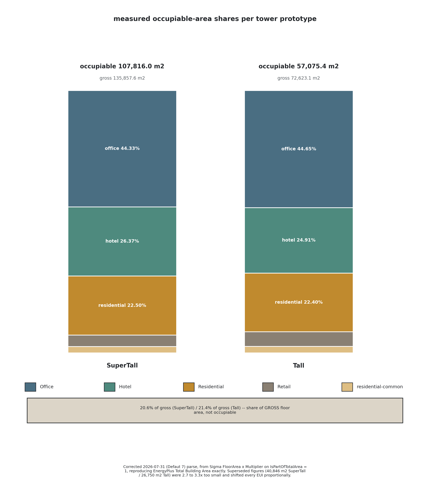

---

### 4.2 The Two Cities

Two cities anchor the climate axis: Montréal (ASHRAE climate zone 6A) and Calgary (ASHRAE climate zone
7A). Each city is assigned its own TMY EnergyPlus weather file. The Montréal and Calgary IDF for a given
tower differ from one another by a climate-tag edit only, so that any EUI delta observed between the two
cities is attributable to climate rather than to a co-varying geometry difference (Table 3, and its
footnote on the Calgary EPW's on-disk `_6B` filename versus its campaign-assigned `Z7A` climate-zone
label).

---

### 4.3 The 56-Cell Campaign and Its Scenario Levers

The full campaign crosses 2 towers x 2 cities x 14 scenarios = 56 cells, all 56 simulated (Table 3
footer). The fourteen scenarios are, by design, not an arbitrary list: one scenario is the uninjected
NECB baseline; four are the historical GSS cycle years; three are the 2030 forecast bundled at a
conservative, central, and optimistic band; and six are single-axis sensitivity variants built on top of
the central 2030 bundle, two per scenario-lever channel.

- **Default (NECB).** No occupancy injection at all - every Space runs its untouched NECB default
  schedule. This is the uninjected control behind the office band-applicability finding in the
  Limitations chapter (n/r for its full quoted EUI value, which belongs to Table 5 / Chapter
  5, not to this chapter).
- **2022.** All four channels injected at their observed-2022 GSS/tourism-statistics product.
- **2005, 2010, 2015.** The three earlier historical GSS cycle years, with office, retail, and
  residential injected; Hotel is deliberately absent from all three historical years, because the
  provincial tourism-statistics series behind the Hotel channel does not extend to a matching pre-2019
  Quebec coverage for these years (§4.4, and Chapter 7's limitation on the pre-2019 hotel gap).
- **B-cons, B-central, B-opt (2030).** The three named 2030 bundles, one per conservative / central /
  optimistic combination of the per-channel scenario levers below, with B-central as the reference point
  the six sensitivity scenarios are built against.
- **sens_office_cons, sens_office_opt.** B-central with the Office WFH band swapped to conservative or
  fullyhybrid. Residential is swapped together with Office in both of these scenarios, not
  independently: Residential's 2030 product is produced by the same function, keyed off the same
  office-band parameter, as Office's own 2030 product, so the two channels share one lever rather than
  each carrying its own. This is the concrete sense in which "Residential has no lever" (Table 2):
  Residential does not have a null 2030 axis, it has no axis independent of Office's.
- **sens_retail_cons, sens_retail_opt.** B-central with only the Retail in-store-share csv swapped to
  its conservative or optimistic 2030 value; Office and Residential stay at their central-band draw.
- **sens_hotel_cons, sens_hotel_opt.** B-central with only the Hotel SARIMA-band csv swapped to its
  conservative or optimistic 2030 value; Office and Residential stay at their central-band draw.

Each of the three GSS-linked channels therefore carries exactly one 2030 scenario lever - Office's WFH
band (conservative / hybrid / fullyhybrid), Retail's in-store share (0.90 / 0.97 default / 1.05), and
Hotel's SARIMA band (0.92 / 1.00 / 1.05) - and each lever is exercised both jointly, in the three B-*
bundles, and in isolation, in the corresponding pair of sens_* scenarios (Table 2). Residential carries
no independent lever of its own; its 2030 product moves only as a consequence of the Office WFH band, a
design choice made explicit in the campaign's own scenario-construction code rather than left implicit.

---

**Figure S2.** - One scenario lever per channel: office, retail and hotel each carry a single three-position lever that can be re-run independently, and residential deliberately carries none.

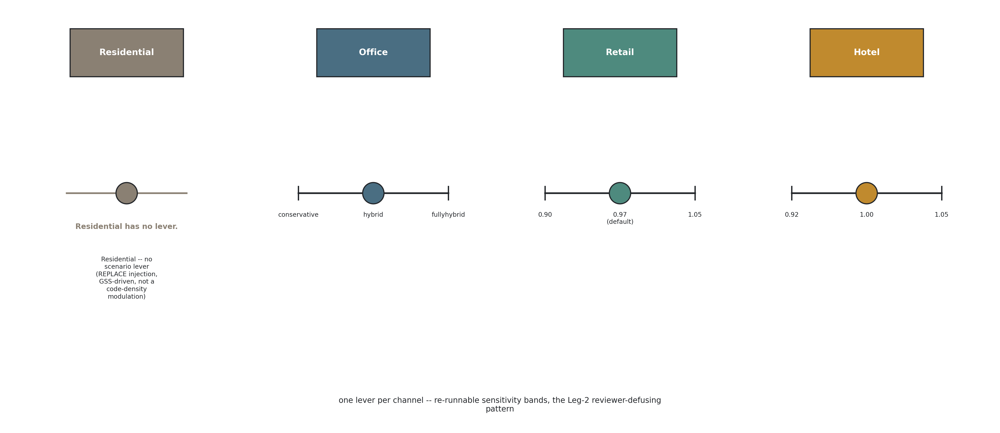

---

### 4.4 Two Mandatory Probes

Two output-side probes are run before any Leg-3 campaign cell is accepted, and both exist because of a
specific defect found in the two-channel construction stage: a modulated schedule referenced by the
wrong IDF field passed every input-side check available at the time and was caught only when its
simulated output failed to differ from an unmodulated run (Chapter 3, §3.5). An input-side field
assertion closes that particular blind spot, but does not, by itself, guarantee that a campaign's
outputs actually carry the scenario signal they are supposed to carry. The two probes below are the
output-side complement to that input-side assertion.

**Probe 1 - scenario-differentiation.** Two distinct scenarios - for example B-central versus
sens_retail_opt - must produce EnergyPlus outputs that differ from one another. A pair of scenarios that
are supposed to differ in occupant schedule but return byte-identical simulation output is treated as an
automatic fail, on the same logic as the construction-stage defect: a schedule that looks correct on
disk but never reaches the simulated result is indistinguishable, at the output, from no injection at
all.

**Probe 2 - stale-output guard.** A wiring fix to the injector - or, more generally, any change to the
Step-7 schedule products the injector consumes - invalidates previously completed ("skip_done") cell
outputs that were produced before the fix. A campaign resume mechanism that silently treats an
already-populated output directory as done, without checking whether the code or the input products that
produced it have since changed, can allow two incompatible result sets to occupy the same output path
with no trace of which one is current. The guard that was first implemented fingerprinted only the
injector script itself; a subsequent correction extended it to also cover the Step-7 product files,
because a scenario's schedule content, not only the injector code, determines what gets injected, and a
changed product file with an unchanged injector script would otherwise leave a stale result undetected
at the same output path.

The scenario-differentiation probe is listed in Table 4 alongside the wiring field-reference assertion,
under the wiring-and-differentiation gate group made mandatory by the two-channel construction stage's
own lesson. The stale-output guard is a campaign-orchestration control rather than a per-cell validation
metric, and for that reason is not itself a Table 4 row; it is documented in the Step-8 campaign
implementation record cited below.

---

**Table 3.**

The 56-cell Step-8 campaign: two tower prototypes x two cities x 14 scenarios. Surfaces below are the
**corrected, parsed** values (Defaut 7, 2026-07-31) - Sigma(`FloorArea` x `Multiplier`) on
`IsPartOfTotalArea = 1` zones, reproducing EnergyPlus's own *Total Building Area* exactly. The two
IDFs per prototype (Montreal / Calgary) differ by **36 bytes only** - geometry is identical, the
climate tag is the sole difference, so EUI deltas isolate climate.

| Prototype | Total area (m2) | Cities | ASHRAE CZ | EPW | Standard | Cells |
|---|---|---|---|---|---|---|
| SuperTall | 135,857.6 | CAN_MTL, CAN_CLG | 6A (Montreal), 7A (Calgary) | `CAN_QC_Montreal.Center-Jean.Brebeuf-McGill.Univ-McTavish.716120_TMYx_6A.epw` (MTL); `CAN_AB_Calgary-Canadian.Olympic.Park.Upper.712350_TMYx_6B.epw` (CLG) | NECB-2017 | 28 (2 cities x 14 scenarios) |
| Tall | 72,623.1 | CAN_MTL, CAN_CLG | 6A (Montreal), 7A (Calgary) | `CAN_QC_Montreal.Center-Jean.Brebeuf-McGill.Univ-McTavish.716120_TMYx_6A.epw` (MTL); `CAN_AB_Calgary-Canadian.Olympic.Park.Upper.712350_TMYx_6B.epw` (CLG) | NECB-2017 | 28 (2 cities x 14 scenarios) |

**Footer: 56/56 cells simulated, geometry-identical IDFs across cities.** `agg_meta.csv` records
`total_building_area_m2` = 135,857.594... (SuperTall) and 72,623.070... (Tall) on every one of the 56
rows, unchanged across scenario and city - confirming area is a building-geometry property, not a
per-run artefact.

## Footnote - the EPW filename carries a "6B" tag; the campaign's own climate-zone label is 7A

The Calgary EPW file is named with a `_6B` suffix on disk (`CAN_AB_Calgary-...712350_TMYx_6B.epw`),
but the campaign driver assigns it climate zone **Z7A** (`cz: "Z7A"` in `CITIES`, confirmed in every
Calgary row of `agg_meta.csv`). This is not a transcription error: the driver's own docstring names it
explicitly ("EPW tagged `_6B` on disk ... NOT renamed per instruction") and elects to keep the file's
original name rather than rename it to match the zone label used in the NECB-2017 analysis. The same
EPW file (`_6B` in its filename) is also used by the 2J manuscript, where it is reported against
ASHRAE zone 6B (`2J_docs_occ_nTemp/writing/tables/Table_03_sim_domain.md`) - i.e. the same physical
weather file is legitimately labelled differently by climate-zone standard/vintage across the two
manuscripts. Montreal's EPW, by contrast, is filed as `_6A` and reported as CZ 6A in both.

---

**Table 4.**

Gates applied across Steps 4-9 of the Leg-3 (4-split) pipeline. The **Provenance** column classifies
every threshold as exactly one of three kinds. This distinction is load-bearing for the paper's
honesty: a **project-chosen** threshold is not literature, and must never be cited as if it were.

## (a) Tiered gates - Tier 1 distributional / Tier 2 structural / Tier 3 ASHRAE G14

Applied per day-type, to AT_RETAIL exactly as to AT_WORK in Leg-2.

| Tier | Metric | Threshold | Provenance |
|---|---|---|---|
| 1 Distributional | KL divergence (arrival / departure) | < 0.05 | project-chosen (set before tuning) |
| 1 Distributional | 1-Wasserstein / EMD on hourly presence CDF | < 0.05 | project-chosen (set before tuning) |
| 1 Distributional | Presence-rate RMS error | ≤ 5 pp per day-type | project-chosen (set before tuning) |
| 2 Structural | Transition-matrix Frobenius / MAE | < 0.05 | project-chosen (set before tuning) |
| 2 Structural | Dwell-time KS test | p > 0.05 (fail to reject H₀) | project-chosen (set before tuning) |
| 2 Structural | Autocorrelation MAE, lags 1-24 h | < 0.05 | project-chosen (set before tuning) |
| 3 Downstream | NMBE | monthly ±5 %, hourly ±10 % | **ASHRAE Guideline 14** |
| 3 Downstream | CV(RMSE) | monthly 15 %, hourly 30 % | **ASHRAE Guideline 14** |
| 3 Downstream | Peak demand magnitude + timing | magnitude ±15 %; timing ≤ 1 h | project-chosen (set before tuning) |

## (b) Channel-specific gates

| Layer | Check | Target | Provenance |
|---|---|---|---|
| LOCATION mapping | AT_RETAIL rate, weekday 12:00-14:00, per cycle | 0.06-0.10 (confirmed by dr_L3-06, central ≈ 0.079) | project-chosen (set before tuning) |
| LOCATION mapping | Saturday peak rate, 13:00-16:00 | 0.09-0.12 | project-chosen (set before tuning) |
| LOCATION mapping | Sunday peak rate, per city | Calgary 0.06-0.10 / Montreal 0.04-0.07 | project-chosen (set before tuning) |
| LOCATION mapping | Night slots 00:00-05:00, all day-types | 0.000-0.003 | project-chosen (set before tuning) |
| OR-rule leak | `occACT==4 & occPRE==1` (online-shopping) share per cycle, excluded from AT_RETAIL | rule FROZEN (OD-1, 2026-07-02); cross-tab still reported as verification | project-chosen (set before tuning) |
| Transformer (JS) | JS(AT_WORK), JS(AT_RETAIL) per stratum | < 0.02 each (JS alone is toothless for AT_RETAIL; paired with PR-AUC / F1 below) | project-chosen (set before tuning) |
| Transformer (Resolution) | PR-AUC and F1 on positive slots, AT_RETAIL | PR-AUC ≥ 0.15, F1 ≥ 0.25 (catches all-zeros failure) | **heuristic** |
| Transformer (Dynamics) | Midday (11-14 h) rate error + transitions/day, AT_RETAIL | Midday error ≤ 3.0 pp, transitions ≥ 0.05/day | project-chosen (set before tuning) |
| Transformer (Regression) | Old-head (Head 1, Head 2) JS drift | ΔJS ≤ 0.002 bits vs Leg-2 validation baseline | project-chosen (set before tuning) |
| Transformer (Exclusivity) | Impossible-State Rate: slots with > 1 of {AT_HOME, AT_WORK, AT_RETAIL} active | ISR ≤ 0.5 % raw; = 0 % after decode-time projection (dr_L3-12) | project-chosen (set before tuning) |
| Hotel backcast | QC + AB monthly 2015-2019 vs reconstruction | MAE < 0.05 | project-chosen (set before tuning) |
| Hotel COVID dip | 2020-04 reconstruction | recovered without overshoot | project-chosen (set before tuning) |
| BEM end-to-end | Default vs 2022, Montreal SuperTall | EUI delta positive; Office + Hotel dominant | project-chosen (set before tuning) |
| Floor-area sanity | Per-channel EUI share vs parsed occupiable share | ± 2 pp | project-chosen (set before tuning) |

## (c) Wiring + differentiation gates (the Leg-2 lesson gates)

Made mandatory because the Leg-2 People-field wiring bug (`Number_of_People_Schedule_Name`, not
`Schedule_Name`) passed every input-side check and was caught only output-side.

| Layer | Check | Target | Provenance |
|---|---|---|---|
| Wiring | Post-injection field-reference assertion | 100 % of modulated Spaces pass | project-chosen (set before tuning) |
| Simulation | Scenario-differentiation probe | Outputs differ per channel across ≥ 2 scenarios (byte-identical results = automatic FAIL) | project-chosen (set before tuning) |

---

## Threshold provenance

- **ASHRAE Guideline 14** - NMBE (±5 % monthly / ±10 % hourly) and CV(RMSE) (15 % monthly / 30 %
  hourly) only. Cite the standard.
- **project-chosen (set before tuning)** - every `< 0.05` gate (KL, EMD, transition-matrix
  Frobenius/MAE, autocorrelation MAE), the presence-rate RMS ≤ 5 pp, the dwell-time KS p > 0.05, the
  peak ±15 % / ≤ 1 h gate, the 0.06-0.10 retail rate family (weekday/Saturday/Sunday/night), the OR-rule
  freeze, the JS < 0.02 pairing, the midday-dynamics and JS-drift gates, the ISR ≤ 0.5 % bar, the
  hotel MAE < 0.05 and COVID-recovery checks, the decode thresholds (0.50 / 0.40 / 0.15), the wiring
  and scenario-differentiation gates, and the ± 2 pp EUI-share gate. All were set before tuning and
  are project acceptance bars, not literature values.
- **heuristic** - PR-AUC ≥ 0.15 and F1 ≥ 0.25, adopted to catch an all-zeros failure mode, flagged by
  dr_L3-11/dr_L3-13 as heuristic rather than literature-derived.

n/r - the decode-time thresholds (0.50 / 0.40 / 0.15) named in the pipeline overview's
provenance blockquote are not broken out as individual gate rows in the VALIDATION GATES / VALIDATION
PLAN tables of either source document; they are recorded here only inside the provenance key, per the
source text itself.

---

# 5 Results

The four subsections below move from the raw behavioural driver behind each channel (Section 5.1), to
its annual energy consequence measured against reference bands, including where that consequence fails
the bands (Section 5.2), to its reshaping of the load curve inside a single stacked building (Section
5.3), and finally to how each channel responds when its own 2030 scenario lever, and only its own lever,
is moved (Section 5.4). Every measured value in this chapter is read from the frozen
`Leg3_4-split/Step9_docs/outputs_step9_deliverable/` directory; the sibling `outputs_step9/` directory is
superseded and is not used here. No band value is moved and no gate verdict changes anywhere in this
chapter.

---

### 5.1 Four channels move differently over 2005 to 2030

`step9_longitudinal.csv` carries the four historical GSS Time-Use cycles - 2005, 2010, 2015, 2022 -
simulated across all four building-city cells (SuperTall and Tall, Montreal and Calgary). Read as the
median EUI (CFA basis) across those four cells, three of the four channels genuinely vary by cycle, and
they do not move together or in the same direction.

Office is not monotonic. Median EUI falls from 70.63 kWh/m2/yr in 2005 to 69.78 in 2010 (-1.21 %),
climbs to 71.29 by 2015 (+0.94 % against 2005), then falls again to 70.20 by 2022 (-0.67 %) - a
dip-rise-dip pattern rather than a trend, with the individual four-cell range never exceeding -1.48 % to
+1.18 % in any cycle. Retail moves the furthest and reverses direction outright: it declines through 2010
(median 76.36, -1.42 % vs 2005) and 2015 (median 75.84, -2.03 %), then jumps past its own 2005 baseline
by 2022 (median 79.19, +2.36 %, four-cell range +0.13 % to +4.69 %). Residential is close to flat across
all four cycles, drifting from a 2005 median of 118.73 kWh/m2/yr to 118.68 in 2022 (median change
-0.07 %, four-cell range -0.49 % to +0.09 %).

Hotel's apparent flatness across the same four cycles is a feature of the campaign design, not a
measured behavioural finding, and must be read as such. Per the scenario list (Chapter 4, §4.3), Hotel is
deliberately left uninjected - on the untouched NECB default schedule - in the 2005, 2010 and 2015
scenarios, because the ISQ/CBRE provincial tourism-statistics series behind it does not reach a matching
pre-2019 Quebec coverage (Chapter 7). The near-zero change recorded for hotel across those three cycles in
`step9_longitudinal.csv` (median change from the 2005 baseline: -0.003 % in 2010, +0.031 % in 2015)
therefore reflects whole-building thermal coupling with the three genuinely-varying channels, not a hotel
occupancy signal. The first cycle at which Hotel is actually injected is 2022, at its observed-2022
tourism-statistics product; even there the median change against the uninjected-2005 baseline is small,
+0.09 % (four-cell range -0.39 % to +0.73 %). Hotel's real year-to-year movement is carried by the SARIMA
2030 band rather than by the historical GSS-cycle axis, and is examined directly in Section 5.4.

The four channels also carry very different weight inside the same building envelope. Aggregated across
all four cycles and all four building-city cells (`step9_longitudinal.csv`, `energy_share_pct` and
`area_share_pct` columns), Hotel's median share of building energy (44.47 %) runs 24.22 percentage points
above its median share of building floor area (20.25 %), while Office's median energy share (21.42 %)
runs 13.72 points below its area share (35.14 %); Residential (energy 18.27 % vs area 17.73 %) and Retail
(2.56 % vs 3.92 %) sit close to proportional. This asymmetry between one high-intensity, low-footprint
channel and one low-intensity, high-footprint channel is the structural backdrop for the per-channel band
verdicts in Section 5.2 (Figure 7).

**Figure 10.** - four-channel EUI trajectory across the 2005, 2010, 2015


and 2022 GSS Time-Use cycles, one panel or series per channel, Hotel's 2005-2015 segment marked as the
uninjected NECB baseline rather than a measured hotel signal.

---

### 5.2 Per-channel EUI and the band verdicts, including the three failures

Table 5 reports per-channel EUI on a dual basis - conditioned floor area (CFA, the primary thermodynamic
metric) and gross-floor-area occupiable-share (GFA-share, a secondary stock-comparability check) - never
averaged together - against an as-modelled band (PASS criterion) and a wider empirical band (INFO
criterion only, not scored). Residential carries no as-modelled band and is reported INFO-only, 55 of 56
cells outside the empirical band (1 of 56 IN). Of the three channels that do carry a PASS/FAIL band, all
three fail, and all three are reported here at full strength, with the deciding number in the same
sentence that states the failure.

**Office** fails hardest: all 56 injected campaign cells sit below the 100 kWh/m2/yr floor, median 71.02
kWh/m2/yr (CFA range 61.72-90.21), and the uninjected `Default_NECB` control - the code's own reference
implementation, carrying no occupancy signal at all - scores 85.45 kWh/m2/yr against that same 100 floor,
so the untreated control fails too. A gate that no untreated control can pass is measuring the band, not
the model. Two candidate mechanisms for the gap were tested and both were refuted in 56 of 56 cells:
modelled heating share sits at 17 % against the band's own 35-45 %, and rebasing on service/MEP area
moves every cell further down, not up. The band's own source document additionally gives three different
floors for itself (Table 7.1 = 100.0; line 21 = 80-140; Table 2.1 = 85.0-115.0), so the floor is recorded
as contested and unsourced, not merely missed.

**Hotel** fails on the opposite side of its band: 28 of 56 cells FAIL, every one above the 300 kWh/m2/yr
ceiling and every one on the `Tall` prototype (`SuperTall` clears the ceiling in all 28 of its own cells),
over a measured range of 203.33 to 318.42 kWh/m2/yr (median 260.54). The band ceiling rests on the
first-party DOE/PNNL Large Hotel, ASHRAE 90.1-2019 prototype value (284.44 kWh/m2/yr at CZ 6A, 299.28 at
CZ 7), which is 1.0 % from the ceiling's original 90.1-2004-lineage anchor of 302.21, so a vintage-mismatch
objection does not hold; what remains is that the reference archetype's own city set (Rochester /
International Falls) does not match this study's NECB-2017 Montreal / Calgary towers.

**Retail** fails under the gate rule actually in force, median-in-band rather than all-cells (decided at
V2-B3, in advance of the numbers): the measured median is 75.63 kWh/m2/yr, which is 5.47 % below the 80
kWh/m2/yr floor. Under an all-cells count, 12 of 56 cells sit inside the band and 44 of 56 sit below the
floor (0 above the ceiling); that per-cell tally is reported for transparency but is not the rule that
scores the gate. This 5.47 % median-to-floor gap must not be confused with a different, smaller quantity:
the retired all-cells rule was itself replaced because it was turning on a margin of only 0.15 % of its
floor (a -0.05 % shift in the median, from a separate improvement round, flipped one cell's individual
verdict) - that 0.15 % is the decision margin that justified changing the rule, not the distance between
the median and the floor, which is the 5.47 % reported above.

No band value was moved and no gate verdict was changed to produce these results; all three failures are
reported as findings about band applicability, not resolved by widening a band or by selecting whichever
rule happens to pass (Table 5).

**Figure 7.** - per-channel EUI across all 56 cells, CFA basis, as-modelled bands

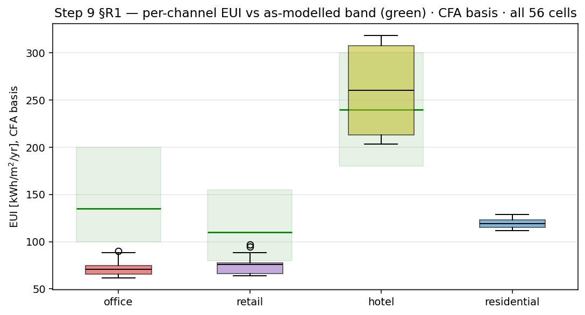

marked, the three failing channels' cells shown against their respective floor/ceiling.

---

### 5.3 Load shape and peak-hour behaviour in a stacked building

`step9_loadshape_peaks.csv` reports a full-day and weekday/weekend load shape per channel and per
whole-building total, for the same cell grid used in Table 5. Under the central 2030 scenario
(`B_central`), the four channels do not share a peak hour. By the circular-mean weekday peak-hour metric
(median across the four building-city cells), Office peaks at 11.90 h (range 11.82-11.93 h), Residential
at 12.04 h (range 12.01-12.10 h), and Retail at 12.37 h (range 12.11-12.62 h) - all clustered around
midday - while Hotel peaks at 18.91 h (range 18.84-18.94 h), roughly seven hours later, in the early
evening. The whole-building peak (`_BUILDING` channel, `peak_hour_circular`) lands at a median of 14.95 h
(range 14.11-15.70 h across the four cells): between the midday cluster of Office/Residential/Retail and
Hotel's evening peak, and coincident with none of the four channels' own peaks exactly.

The weekday midday-to-night contrast (`wd_midday_kW` against `wd_night_kW`) also differs sharply by
channel, and one channel inverts it. Retail shows the sharpest daytime concentration: median weekday
midday demand of 72.03 kW against 2.11 kW at night, a ratio near 34 to 1. Office follows at roughly 11.8
to 1 (569.33 kW midday, 48.10 kW night). Residential is far flatter, near 3.9 to 1 (347.82 kW midday,
89.53 kW night) - a floor set by continuously-operating residential end uses rather than by occupant
presence alone. Hotel is the only channel where the ratio inverts: median weekday night demand of 434.47
kW exceeds median midday demand of 335.93 kW, consistent with a guest-room channel occupied overnight
rather than during the day.

Because the four channels peak at different hours and carry different day/night profiles, the
whole-building coincidence factor - the ratio of the simultaneous building peak to the sum of the four
channels' own individual peaks - stays below 1 in every one of the four cells under `B_central`: median
0.941, low of 0.851 (Tall, Calgary). Occupant and use-type diversity inside one stacked building therefore
flattens the aggregate peak relative to what a simple sum of the four channels' individual peaks would
imply, the same attenuation effect reported for household diversity within a single archetype in the
Leg-2 construction stage, here operating across four different uses sharing one envelope instead of across
households sharing one archetype.

**Figure 8.** - weekday and weekend diurnal load shape, one curve per channel

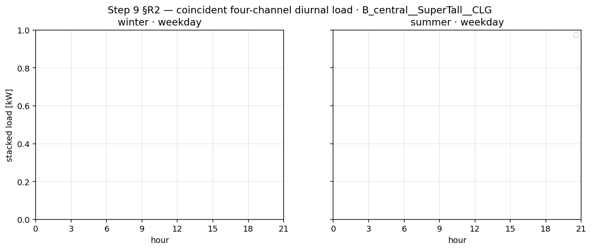

plus the whole-building total, `B_central` scenario, midday and night reference bands marked.

**Figure 9.** - per-channel and whole-building peak hour (circular-mean),

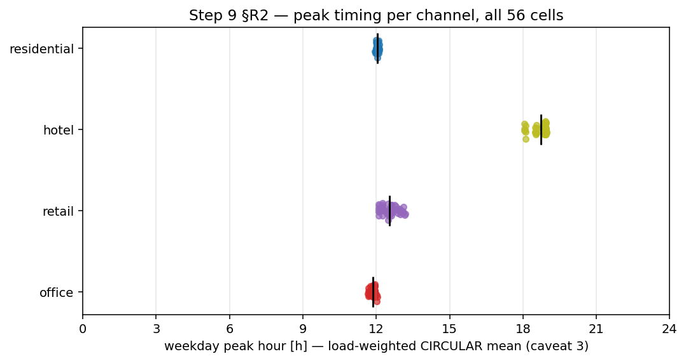

`B_central` scenario, all four building-city cells, coincidence factor annotated.

---

### 5.4 Scenario sensitivity, one lever per channel

`step9_scenario_response.csv` isolates each of Table 2's three scenario levers - Office's WFH band,
Retail's in-store share, Hotel's SARIMA band - one at a time against the 2030 central scenario
(`B_central`), holding the other two levers at their central draw (`sens_office_*`, `sens_retail_*`,
`sens_hotel_*`). Each lever moves its own channel by a margin specific to that channel and leaves the
other channels close to unmoved.

Office's own energy moves by +1.67 % to +2.45 % under the conservative WFH draw (`sens_office_cons`, less
work-from-home, more office presence) and by -2.19 % to -1.46 % under the optimistic draw
(`sens_office_opt`), both read against `B_central`. Retail's own energy moves by -2.42 % to -1.76 % under
its conservative in-store-share draw (`sens_retail_cons`) and by +1.88 % to +2.50 % under its optimistic
draw (`sens_retail_opt`). Hotel's own energy moves by the smallest margin of the three, -0.76 % to -0.40 %
under its conservative SARIMA draw (`sens_hotel_cons`) and +0.26 % to +0.48 % under its optimistic draw
(`sens_hotel_opt`) - consistent with a channel whose 2030 product is a province-level monthly multiplier
applied to a fixed guest-room shape, rather than a per-household behavioural draw.

The three levers leave the channels they were not built to move close to unchanged. Under
`sens_office_cons`, Retail's own energy shifts by only -0.08 % to +0.02 % and Hotel's by +0.004 % to
+0.03 %. Under `sens_retail_cons`, Office shifts by -0.02 % to -0.01 % and Hotel by -0.01 % to 0.00 %.
Under `sens_hotel_cons`, Office shifts by -0.27 % to -0.18 % and Retail by -0.23 % to -0.16 %. Residential
is the one channel that structurally has no scenario lever of its own (Table 2): its 2030 product is
produced by the same function, keyed off the same WFH-band parameter, as Office's own product, rather than
carrying an independent draw (Chapter 4, §4.3). Measured against `B_central`, Residential's own energy
moves by +0.06 % to +0.29 % under the coupled `sens_office_*` scenarios and by under 0.10 % under
`sens_retail_*` and `sens_hotel_*`, in every case the smallest movement of any channel under any lever.
The three jointly-varying 2030 bundles (`B_cons`, `B_opt`) reproduce this same per-channel ordering when
all three levers move together - Office -2.05 % to +2.20 %, Retail -2.42 % to +2.66 %, Hotel -0.73 % to
+0.45 % against `B_central` - close to the sum of the isolated single-lever effects above, which is the
cross-check this section relies on: each lever's effect is close to additive rather than interacting with
the other two.

**Figure 11.** - per-channel energy response to each of the three isolated

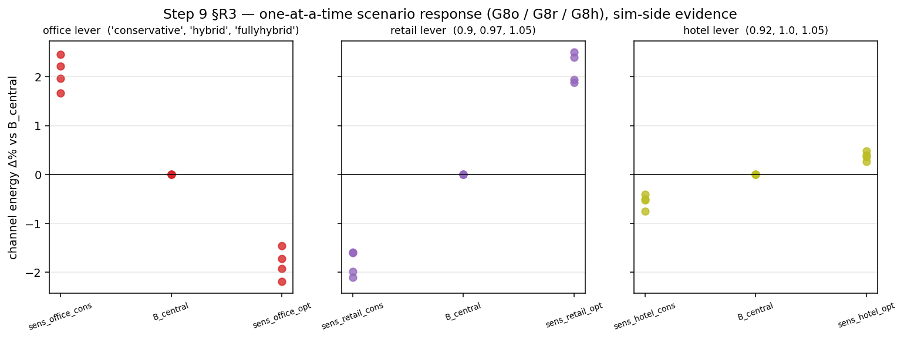

2030 scenario levers, against `B_central`, one panel per channel, the jointly-varying `B_cons`/`B_opt`
bundles overlaid for the additivity cross-check.

---

**Table 5.**

Dual-basis EUI reporting per dr_L3-10: **CFA** (Conditioned Floor Area of the zones assigned to that
use) is the primary thermodynamic metric; **GFA-share** (whole-building Gross Floor Area times the
parsed occupiable-area fraction for that channel) is reported for stock/SCIEU comparability. The two
bases are never averaged.

| Channel | As-modelled band, low/central/high (PASS criterion) | Empirical band, low/central/high (INFO criterion) | Measured range, CFA basis (median) | Measured range, GFA-share basis (median) | Cells passing (as-modelled) | Verdict |
|---|---|---|---|---|---|---|
| Office | 100 / 135 / 200 kWh/m2/yr | 170 / n/r (central not reported) / 360 kWh/m2/yr | 61.72-90.21 (median 71.02) | 63.27-85.51 (median 71.53) | 0/56 | **FAIL, all 56 cells below the 100 floor** |
| Retail | 80 / 110 / 155 kWh/m2/yr | 150 / 280 / 380 kWh/m2/yr | 63.63-96.84 (median 75.63) | 62.88-91.95 (median 73.27) | 12/56 individually in-band; gate scored on the **median** (75.63, below the 80 floor) | **FAIL under the median-in-band rule in force** (all-cells count: 12 PASS / 44 FAIL) |
| Hotel | 180 / 240 / 300 kWh/m2/yr | 220 / 350 / 480 kWh/m2/yr | 203.33-318.42 (median 260.54) | 171.07-261.18 (median 215.96) | 28/56 | **FAIL, 28/56 above the 300 ceiling, 0/56 below the 180 floor, all failures on `Tall`** |
| Residential | no as-modelled band defined | 113.9 / n/r (central not reported) / 147.2 kWh/m2/yr (SHEU HighRise context) | 111.57-128.77 (median 119.10) | 101.54-115.05 (median 107.24) | n/a (INFO only) | INFO, 55/56 outside the empirical band (1/56 IN) |

## The three failing gates, at full strength

- **Office.** The as-modelled band floor is 100 kWh/m2/yr. All 56 injected campaign cells fail it
  (median 71.02, range 61.72-90.21 on the CFA basis). Separately, and more importantly for the
  band-applicability argument: the **uninjected `Default_NECB` control** (the code's own reference
  implementation, no occupancy signal applied at all) scores **85.45 kWh/m2/yr against the same 100
  floor** -- it fails the band by 15 % before this work touches it. A gate that no untreated control
  can pass is measuring the band, not the model. Two candidate mechanisms were tested to explain the
  gap and **both were refuted in 56/56 cells**: modelled heating share is 17 % against the band's
  35-45 %, and rebasing on service/MEP area moves all 56 cells further down, not up. The band's own
  source document additionally gives three different floors for itself (Table 7.1 = 100.0; line 21 =
  80-140; Table 2.1 = 85.0-115.0), so the floor is recorded as contested and unsourced.
- **Hotel.** `S9-EUI-hotel` FAILs **28 of 56 cells**, measured range **203.33-318.42 kWh/m2/yr**,
  median 260.54. Every failure is **above the 300 kWh/m2/yr ceiling** (0 cells below the 180 floor),
  and every failure is on the **`Tall`** prototype (`SuperTall` clears the ceiling in 28/28 of its
  cells). This is the count and direction read directly from `step9_gates.json` (`S9-EUI-hotel` detail
  string) and `step9_eui_by_channel.csv`, both in the frozen deliverable. The band ceiling itself
  rests on the first-party DOE/PNNL Large Hotel, ASHRAE 90.1-2019 prototype value (284.44 kWh/m2/yr,
  CZ 6A Rochester; 299.28, CZ 7 International Falls), which is 1.0 % from the ceiling's original
  90.1-2004-lineage anchor of 302.21, so the vintage-mismatch objection does not hold; the remaining
  limitation is that the reference archetype (90.1-2019 Rochester/International Falls) and city set do
  not match this study's NECB-2017 Montreal/Calgary tower.
- **Retail.** The gate rule in force is **median-in-band**, not all-cells (decided at V2-B3, in
  advance of the numbers). The retail band spans 80-155 kWh/m2/yr; the measured median is **75.63,
  which is 5.47 % below the 80 floor** (re-derived from the 56 CFA values in the deliverable CSV).
  Under the median rule the gate is FAIL. Under an all-cells count, 12/56 cells sit inside the band and
  44/56 sit below the floor (0 above the ceiling); this per-cell tally is reported for transparency but
  is not the rule that scores the gate.
  The rule change itself was justified by a *different* quantity, and the two must not be conflated:
  V2-B3 records that the all-cells gate **was turning on 0.15 % of its floor**, meaning the per-cell
  verdict count was decided by a margin that narrow, so that a **-0.05 %** median shift in the V2-E3
  arm flipped one cell (55/56 to 54/56). That 0.15 % is the decision margin of the retired all-cells
  rule; it is **not** the distance between the median and the floor, which is 5.47 %.

## Scope of verification

**Confirmed directly against `step9_eui_by_channel.csv` (56 rows per channel, 224 rows total) and
cross-checked against `step9_gates.json`'s `S9-EUI-*` gate `detail` strings:**
- Office: CFA range 61.72-90.21, median 71.02; GFA-share range 63.27-85.51, median 71.53; band
  100/135/200; empirical/INFO band 170/n/r/360 (`info_central` is not a column in the CSV;
  only `info_lo`/`info_hi` are present); 0/56 PASS; all FAIL.
- Retail: CFA range 63.63-96.84, median 75.63; GFA-share range 62.88-91.95, median 73.27; band
  80/110/155; empirical/INFO band 150/380 (both `info_verdict` = OUT, 56/56); per-cell tally
  12 PASS / 44 FAIL; gate-level verdict FAIL under the median rule.
- Hotel: CFA range 203.33-318.42, median 260.54; GFA-share range 171.07-261.18, median 215.96; band
  180/240/300; empirical/INFO band 220/480 (`info_verdict` 28 IN / 28 OUT); 28/56 PASS, 28/56 FAIL, all
  failures above the ceiling, all on `Tall` (`verdict_asmodelled` cross-tabulated by `building` column
  in the CSV).
- Residential: CFA range 111.57-128.77, median 119.10; GFA-share range 101.54-115.05, median 107.24; no
  as-modelled band (`band_lo/central/hi` empty, gate is INFO-only); empirical/INFO band
  113.9/n/r/147.2, 55/56 `info_verdict` = OUT, 1/56 IN.

**Confirmed against `_PROVENANCE.md` in the deliverable directory (not the CSV/JSON):** the hotel
median 260.5411 kWh/m2/yr and the "28 above the 300 ceiling, 0 below the 180 floor" summary, matching
the CSV/JSON independently.

**Taken from the brief and the pipeline docs, not independently re-derived from a per-cell CSV row
(no such standalone row exists in the deliverable's tabular outputs):**
- The uninjected `Default_NECB` control value of **85.45 kWh/m2/yr**. This number does not appear as a
  row in `step9_eui_by_channel.csv` (that file's 56 office rows are all *injected* cells). It does
  appear verbatim inside `step9_gates.json`'s `S9-EUI-office` gate `detail` string and inside
  `step9_report.html`, both in the frozen deliverable, so it is deliverable-sourced, just not
  CSV-tabulated. Its underlying simulation artefact (the `finding9_verify/` uninjected-control IDF) is
  held in the sibling `outputs_step9/` directory, which `_PROVENANCE.md` states is retained
  specifically because it is not reproducible elsewhere.
- The as-modelled band values themselves (retail 80/110/155; hotel 180/240/300; office 100/135/200)
  and the empirical/INFO bounds are sourced to `dr_L3-02_retail_eui_bands_REPORT.md` and
  `dr_L3-03_hotel_eui_bands_REPORT.md` (Table 5 in each report) and, for office, to the Leg-2-inherited
  `Office Reference EUI ... As-Modelled Bands.md` Table 7.1, cited via the `band_src` field in the CSV
  itself (also deliverable-sourced, confirmed).

No band value was moved and no gate verdict was changed to produce this table.

---

# 6 Discussion

The findings of §5 are interpreted here against the gap they were designed to close. The discussion moves from what a jointly-trained, multi-channel model buys and what it does not yet prove (§6.1), through the central argument of this paper, that the office gate's failure is a finding about reference-band applicability rather than a model defect (§6.2), to a second, independent illustration of the same point in the hotel gate's own geometry (§6.3), and closes with the lesson that spans all three failing gates and what it implies for how mixed-use reference bands should be built next (§6.4).

---

### 6.1 What a Multi-Channel Model Buys, and What It Does Not Yet Prove

Jointly training one model to output four independent, per-use presence channels, then dispatching them through a per-space, exact-match routing key, lets a single stacked tower carry four functionally distinct populations, households, a workforce, customers and overnight guests, each on its own signal, instead of one blended "occupant" trend applied uniformly across every floor. That design choice is not incidental: a single composite channel would smear the four populations' genuinely different temporal behaviour into one curve that represents none of them (§1.3), and the decode-time exclusivity projection exists precisely so that four independently generated channels do not collide inside the same tower before they reach the building model.

This design is additive on the two-channel construction stage it grew from, and it is additive in a specific, demonstrable sense: a missing channel falls back to the untouched code baseline rather than to an undefined state, retail presence is written to its own file rather than into the residential or office columns, and the campaign reads the same four prototype geometry files the two-channel stage used, confirmed byte for byte at the point they enter the campaign. What the design does not demonstrate, and what this paper does not claim, is bit-identity of the residential and office outputs across the two construction stages. Five of the nine pipeline steps carry no cross-stage byte or column comparison at all, and the injector code itself exists in three non-matching copies across the live repository and the two stages' own frozen snapshots; only the base tower geometry, not the code that writes schedules into it, is confirmed unchanged. Table 6 records this step by step, with the md5 evidence behind each verdict and an explicit marker on every cell where no comparison was located. The paper is therefore precise about what "additive" means here: additive by construction, evidenced at the one step where geometry reuse was checked, and not yet an empirically demonstrated claim that no residential or office figure from the construction stage would move if the comparison were run.

---

### 6.2 Why the Office Band Failure Is a Finding About Band Applicability, Not a Model Error

The office channel fails its energy-use-intensity gate in every one of the 56 campaign cells, and the natural first reading of that result is that the model under-predicts office demand. The evidence does not support that reading, and the strongest piece of it is a control the model never touches. The uninjected `Default_NECB` reference implementation, the code's own baseline with no occupancy signal applied to it at all, scores 85.45 kWh/m2/yr against the same 100 kWh/m2/yr floor the injected cells are judged against, and fails by 15% before this study's occupancy model contributes a single schedule. A gate that no untreated control can pass is not measuring whether the occupancy injection is correct; it is measuring the floor itself against a code-default tower that has nothing to do with the occupancy question this paper asks.

Two candidate mechanisms were tested to see whether the model, rather than the band, could still be at fault, and both were refuted, not left unresolved. The first candidate was that the band's floor implicitly assumes a heating share the injected tower does not carry: measured heating share across the campaign is approximately 17%, against the band's own implied 35 to 45%, in the wrong direction to close the gap. The second candidate was that the office EUI should be re-based on a different denominator, service and mechanical/electrical/plumbing area rather than office-conditioned floor area: rebasing on service/MEP area moves every one of the 56 cells further down, away from the floor, not toward it. Both failed in all 56 cells, not in a majority or a subset. The record does not describe either mechanism as pre-registered, and this paper does not claim they were: they were candidate explanations proposed and then tested, and what carries weight is that both were refuted across the full cell set rather than left open. The band's own source document additionally states three different floors for itself across its own tables (100.0, 80-140, and 85.0-115.0), which is independent evidence that the number being failed against is contested even on its own terms. The gate values and bands quoted in this section are those of Table 5 and Section 5.2; the sixteen limitations they feed are itemised in Table 7.

None of this is used to move the band or to change the verdict. The floor stays at 100, the gate stays FAIL for all 56 cells (median 71.02 kWh/m2/yr, range 61.72 to 90.21 on the CFA basis), and the finding this paper reports is not "the office channel passes once the right comparison is made." It is that an untreated control already fails the same gate, by a margin larger than any plausible occupancy effect could close, which relocates the question from "is the injected model wrong" to "does this reference band apply to this building at all."

---

### 6.3 The Hotel Gate's Lack of Resolving Power

The hotel channel fails a different way, and the failure geometry is itself informative. Across the 56 campaign cells the measured energy-use intensity does not form one continuous distribution; it separates cleanly into two disjoint clusters that track the tower prototype and nothing else. The `SuperTall` prototype's 28 cells sit at 203.33 to 218.22 kWh/m2/yr, comfortably inside the as-modelled band; the `Tall` prototype's 28 cells sit at 302.86 to 318.42 kWh/m2/yr, entirely above the band's 300 kWh/m2/yr ceiling. The largest gap between any two consecutive measured values in the whole 56-cell set falls exactly between these two clusters, at 84.64 kWh/m2/yr, which is 70.5% of the band's own 120 kWh/m2/yr width (180 to 300); the cluster bounds and the band are those reported in Table 5. The 300 ceiling sits inside that gap, not near either cluster's edge.

The consequence is that the pass/fail verdict for any given cell is decided almost entirely by which prototype it belongs to, before the occupancy channel contributes anything cell-specific. A ceiling placed anywhere inside an 84.64 kWh/m2/yr gap between two tight, well-separated prototype clusters will always split the 56 cells the same way the current one does, because there is essentially no continuous variation across that gap for the occupancy signal to move a cell through. This is not a claim that the `Tall` prototype's hotel demand is wrong; it is a claim that this particular gate, as constructed, has very little power to distinguish "hotel occupancy is being modelled correctly on `Tall`" from "the `Tall` prototype's hotel zones simply run hotter than the `SuperTall` prototype's, for reasons the ceiling was never designed to separate from an occupancy effect." The gate's own reference archetype, the DOE/PNNL Large Hotel prototype at ASHRAE 90.1-2019, is itself Rochester/International Falls climate-normalized and city-mismatched against this study's NECB-2017 Montreal/Calgary tower, which is a second, independent reason the same 28-cell split does not automatically indict the occupancy model.

As with the office channel, none of this moves the ceiling. `S9-EUI-hotel` remains FAIL on all 28 `Tall` cells, at their full measured values, and the finding is that the gate's resolving power is limited by geometry it did not design for, not that the failing cells should be read as passing under a different rule.

---

### 6.4 A Common Lesson Across Three Failing Gates, and What It Implies Going Forward

The office, hotel and retail energy-use-intensity gates fail for three different reasons, an uncontested but suspect floor with a failing untreated control behind it, a ceiling that sits inside a prototype-driven gap rather than a continuum, and a median that falls narrowly short of a floor under a rule chosen in advance of the numbers (§5). What the three share is discipline rather than outcome: in every case the reference value was left exactly where it was, no scoring rule was changed after the fact because a different rule happened to pass, and each failure is reported here with the specific evidence that bears on whether the model or the reference is responsible. That evidence points the same direction in the two cases examined closely in this chapter. It does not point toward "these gates are wrong and should be discarded"; it points toward reference bands built for single-use building stock not yet having the resolving power, or in the office case the sourcing discipline, to judge a channel that lives inside a stacked mixed-use tower rather than inside a building of its own. Building that resolving power, an as-modelled band with a floor an untreated control can pass, and a hotel reference stratified by the same prototype geometry the tower campaign varies, is future work this paper's failing gates motivate rather than something this paper's writing phase is positioned to deliver.

---

# 7 Limitations

Sixteen limitations bound the interpretation of the results, transcribed here from the same consolidated source as Table 7 rather than re-derived or re-worded, in the same five groups and the same order: Frame (§7.A, L1-L3), Reference bands (§7.B, L4-L8), Internal gains (§7.C, L9-L11), Method conventions (§7.D, L12-L14), and Physical model (§7.E, L15-L16). Fifteen of the sixteen carry a bounding measurement; the sixteenth, L15, carries none and is marked accordingly rather than given an invented figure. A sixteenth topic, a reproducibility point about a defect found in a related codebase and this pipeline's structural immunity to it, closes the chapter (§7.F) without being folded into the sixteen or given an L-number of its own.

---

### 7.A Frame: What the Source Data Can and Cannot See (L1-L3)

**L1.** Hotel guests are outside the General Social Survey frame by construction; the hotel channel is driven by a non-GSS provincial tourism series (Step 6, the SARIMA side-track), not by time-use data. GSS observes 0% of hotel occupancy. The consequence for this paper's own framing is direct: the "one longitudinal time-use source to four channels" contribution is, precisely, three of four channels time-use-survey-driven and one of four series-driven.

**L2.** Retail sees customers only; staff are excluded by construction, because GSS logs retail workers as `AT_WORK`, not as shopping. 0% of retail staff presence enters the occupancy signal, and 0% of retail plug load is modulated by it, since plug load follows staff and staff stay on the untouched code baseline.

**L3.** Residential intra-household presence diversity is partial, not complete; an earlier, stronger internal claim that it was exactly zero is falsified by direct measurement. 3,499 of 16,367 multi-person households, 21.38%, carry at least one slot value outside {0, 0.5, 1}. A surviving defect behind this number is that one pipeline stage computes a household maximum that a later stage never reads, while the aggregation actually applied downstream is the mean.

### 7.B Reference Bands: What "Plausible" Is Being Measured Against (L4-L8)

**L4.** The office band's floor is contested and unsourced; the gate is a band-applicability finding, not a model defect. The uninjected `Default_NECB` control scores 85.45 kWh/m2/yr against a floor of 100, failing by 15% before this study's occupancy model touches it. Two candidate mechanisms were tested and refuted: modelled heating share is approximately 17% against the band's implied 35-45%, and rebasing the metric on service/MEP area moves all 56 of 56 cells further down, not up. The band's own source document gives three different floors for itself across its own tables (100.0; 80-140; 85.0-115.0). The value is not moved to make the gate pass (§6.2 develops this argument in full).

**L5.** The hotel band is archetype- and city-mismatched, and that mismatch is stated rather than absorbed into a tolerance; this study's tower is NECB-2017 Montreal/Calgary, while the reference is the DOE/PNNL Large Hotel prototype at ASHRAE 90.1-2019. The first-party reference value is 284.44 kWh/m2/yr (Rochester, Minnesota, climate zone 6A) and 299.28 (International Falls, Minnesota, climate zone 7). The gate fails on 28 of 56 cells, all on the `Tall` prototype, every one over the 300 ceiling; the deliverable-sourced measured range is 203.33-318.42 kWh/m2/yr. A vintage-matched alternative value (the 90.1-2004 lineage, 302.21) is only 1.0% away from the current ceiling, so the archetype/city mismatch, not a vintage mismatch, is the limitation that remains (§6.3 develops the resolving-power argument this failure motivates).

**L6.** The "stacked channel" explanation once offered for the hotel channel's low measured values, that a mid-tower channel carries little roof, ground or facade load and should therefore read low, was tested and refuted; it is not cited as an explanation anywhere in this paper. It is wrong in sign and order in all 56 of 56 cells: hotel is the least thermally exposed of the three banded channels and sits closest to its floor, not furthest from it. A second bound on the same claim is that geometry varies only between the `Tall` and `SuperTall` prototypes, so the exposure ratio this explanation would need takes only two distinct values across the whole campaign, not 56 independent ones; the corresponding gate is reported as informational only, never as a pass or fail criterion.

**L7.** The retail channel is validated on shape, not on level; no population-denominated in-store presence reference exists at time-of-day resolution in the American, harmonized European or United Kingdom time-use surveys this project checked. The energy-use-intensity gate rule in force is median-in-band, not a 56-of-56 count, because the measured spread is smaller than the quantity's own re-run uncertainty: a single re-derivation moved the median by 0.05% and flipped one cell's individual verdict. The retail median is 75.63 kWh/m2/yr against a floor of 80, 5.47% below, with 44 of 56 cells under the floor. The corresponding presence-rate gate was separately demoted to informational status, because the one time-of-day reference available (BLS ATUS table A-3B) reports retail activity running roughly 44% high while an earlier reference band said 24.5% low; the two references disagree in direction, not only in magnitude.

**L8.** The residential channel carries no as-modelled band at all; the SHEU-2019 HighRise figure is carried as context only and is never used as a pass criterion, because a residential channel inside a mixed-use tower is not the housing stock SHEU sampled. The SHEU-2019 HighRise reference is 130.6 kWh/m2/yr (113.9-147.2), context only.

### 7.C Internal Gains That Were Never Parameterised (L9-L11)

**L9.** Retail zones run the code's office occupant density, not the code's own retail figure. The model uses 24.97 m2/person (the NECB whole-building office value), while NECB's own `Retail - sales` space type gives 29.97 m2/person; retail is therefore modelled roughly 20% over-crowded relative to the code's own retail reference.

**L10.** Equipment power density is a single blanket value applied to every space type in both tower prototypes (7.5028 W/m2), while lighting is differentiated per space type. Occupant density and equipment power density are the two internal-gain fields never parameterised by use in this pipeline.

**L11.** The retail occupancy peak of 0.95 has no independent source, and the code's own retail schedule (type C) was never loaded into the injected model. NECB's retail type-C schedule peaks at 0.80 on weekdays at 16:00 with no midday dip, 0.90 on Saturday and 0.40 on Sunday; the tower instead carries the code's office schedule (type A) byte for byte, which peaks at 0.90 with a 0.50 lunch-hour dip, and the injector applies a further 0.95 multiplier on top of that curve. Retail therefore runs approximately 18.75% hot at peak, and on the wrong-shaped curve; no NECB type-C schedule string is present anywhere in the injected model.

### 7.D Method Conventions That Are Judgement, Not Derivation (L12-L14)

**L12.** The minimum adjustment-cell pool size (15 respondents) is an analyst judgement call, presented here as one; no numeric convention for this kind of minimum cell size was located in the literature this project checked. The anchor previously cited for it in fact gives a value of 5 as that source's own study design, not as a general recommendation, and the corresponding validation gate is measured to be non-monotonic in the pool size (failing at 10, passing at 11-20, failing again at 30), which rules it out as a principled selection criterion.

**L13.** Household aggregation is the mean, and this is a decision, not an inheritance, because the three construction stages behind this project do not agree with one another: the earlier residential-only converter, the two-channel construction stage's converter, and this pipeline each aggregate household presence differently. This pipeline's own choice of the mean was verified against its own code, not against another stage's documentation.

**L14.** The retail episode-time share declines across survey cycles; an earlier internal claim that it was stable across cycles was a documentation defect, not a measurement. The measured share is 2.00%, 2.14%, 1.66% and 1.50% across the four cycles used, an approximately 25% decline overall, a direction and rough magnitude that comparable American, European and United Kingdom time-use series independently confirm as internationally normal rather than a coding artefact specific to this project.

### 7.E Physical Model (L15-L16)

**L15.** The building's weather file is applied at ground level on a supertall tower; this is the one limitation in this list with no bounding measurement. **Not quantified.** No altitudinal temperature or wind-speed gradient is represented over a tower of this height; establishing one would require either a vertical weather profile or an instrumented tall building, and this study has neither. It is listed here with an explicit "not quantified" rather than a plausible-sounding invented bound.

**L16.** The hotel domestic-hot-water plant is capacity-pinned on a single object, and a global correction does not correct it. The `LAUNDRY` heater's delivered-energy slope against draw volume is -0.98 in both tested arms, meaning delivered energy is almost completely insensitive to how much water is actually drawn. Raising a single global sizing factor to 6 drove every other heater's slope to exactly 0.000 and moved `LAUNDRY`'s own share of hotel domestic-hot-water demand from 26.7% to 65.4%, a share-reweighting effect that alone reproduces the resulting 0.334 elasticity measured against this correction. The instrument that actually addresses the defect is a per-object resize, `LAUNDRY` alone raised to a sizing factor near 7 against an internal reference heater, with the other fifteen heaters left at a sizing factor of 1, not a single building-wide multiplier.

---

### 7.F Reproducibility: A Shared Extraction Defect, and Why This Pipeline Is Structurally Immune to It

One further point belongs in this chapter, not as a seventeenth item in the numbered list above but as a reproducibility caveat about the codebase this project descends from. The residential energy-use-intensity table published in the authors' prior single-channel study (2J) was found, during this project's own review process, to have been computed by a shared extraction function carrying two compounding defects: a demand-summary table double-counted into an annual energy total as though it were an energy quantity rather than a power quantity, and a water-heating guard that correctly zeroes water energy on SI-unit runs but fails to recognise imperial units, so that on imperial-unit runs a water volume is summed directly into the reported energy-use intensity as if it were electricity. Every run in that prior study's campaign carried exactly one of the two defects, decided by which unit system the run happened to use, and correcting both moved three of the four reported SHEU band verdicts in that prior study.

This pipeline is verified immune to that specific defect, and the reason is structural rather than incidental: the present study's energy-use-intensity values, reported in Table 5 and discussed throughout §5 and §6, are read from hourly EnergyPlus meter streams, never from the tabular demand-summary extraction function the prior study's defect lived inside. The two pipelines share a lineage and, at points, shared code, but they do not share this particular extraction path, and that structural difference, not a targeted fix, is what protects this study's own reported values. This is recorded here as a reproducibility point about the family of pipelines this project belongs to, not as a limitation of the results reported in this paper.

---

**Table 7.**

*Transcribed, not rewritten, from `Leg3_4-split/3rdJ_00_4split_Occupancy_Pipeline.md` §
"LIMITATIONS - CONSOLIDATED" (written 2026-08-05, V2-G3). Sixteen items, fifteen carry a number;
L15 carries none and is marked accordingly rather than given an invented figure. Wording is trimmed to
fit a table cell; no number or verdict is paraphrased.*

| ID | Group | Statement | Bounding measurement |
|---|---|---|---|
| L1 | A Frame | Hotel guests are outside the GSS frame by construction; the channel is driven by a non-GSS tourism series (Step 6C), not by time-use data. | GSS observes **0 %** of hotel occupancy. Consequence: the "one longitudinal TUS source to four channels" contribution is really **3 of 4 channels TUS-driven, 1 of 4 series-driven**. |
| L2 | A Frame | Retail sees customers only; staff are excluded by construction (GSS logs retail workers as `AT_WORK`, not shopping). | **0 %** of retail staff presence enters the occupancy signal; **0 %** of retail plug load is modulated by it (plug follows staff, staff stay on the NECB baseline). |
| L3 | A Frame | Residential intra-household presence diversity is partial, not complete; the stronger claim once made internally, that it is exactly zero, is falsified by this measurement. | **3,499 of 16,367** multi-person households (**21.38 %**) carry at least one slot value outside `{0, 0.5, 1}`. Surviving defect: Step 5 computes a household **maximum** that Step 7 never reads; aggregation is the **mean** (V2-B5). |
| L4 | B Reference bands | The office band's floor is contested and unsourced; the gate is a band-applicability finding, not a model defect. | Uninjected `Default_NECB` control scores **85.45** against a floor of **100** - fails by **15 %** before this work touches it. Two candidate mechanisms refuted: modelled heating share **17 %** vs band's **35-45 %**; rebasing on service/MEP moves **56 of 56** cells *down*. Source document gives three different floors for itself (Table 7.1 = 100.0; line 21 = 80-140; Table 2.1 = 85.0-115.0). Value not moved to make the gate pass. |
| L5 | B Reference bands | The hotel band is archetype- and city-mismatched, and that is stated rather than absorbed; our tower is NECB-2017 Montreal/Calgary, the reference is DOE/PNNL Large Hotel at ASHRAE 90.1-2019. | Reference: **284.44** kWh/m2*yr (Rochester MN, CZ 6A) / **299.28** (International Falls MN, CZ 7), read first-party from the prototype's own packaged table. Gate FAILs on **28 of 56** cells, all `Tall`, every one **OVER the 300 ceiling**; deliverable range **203.33-318.42** (corrected 2026-08-06, V4-A4, read from `outputs_step9_deliverable/`, not the superseded `outputs_step9/` which inverted the direction). Vintage-matched value (90.1-2004 lineage, 302.21) is only **1.0 %** away; the archetype/city gap remains and is recorded, not converted to a tolerance. |
| L6 | B Reference bands | The "stacked channel" explanation for low EUIs (a mid-tower channel has little roof/ground/facade load, so a low EUI is expected) was tested and REFUTED; do not cite it. | Wrong in sign and order in **56 of 56** cells: hotel is the *least*-exposed of the three banded channels and sits *closest* to its floor, not furthest. Second bound: geometry varies only `Tall`/`SuperTall`, so `exposure_ratio` takes **2** distinct values per channel, not 56 independent ones. Gate `S9-EUI-EXPOSURE` is INFO, never PASS/FAIL. |
| L7 | B Reference bands | The retail channel is validated on SHAPE, not on LEVEL; no population-denominated in-store presence reference exists at time-of-day resolution in ATUS, HETUS or the UK TUS. | EUI gate rule is **median-in-band**, not 56-of-56, because the spread is smaller than the quantity's own uncertainty: a single re-run moved the median by **-0.05 %** and flipped a cell. Retail median is **75.63** against a floor of **80**, i.e. **5.47 % below**, with **44 of 56** cells under. Rate gate demoted to INFO: BLS ATUS A-3B says retail runs ~44 % *high*, the previous band said 24.5 % *low* - references disagree in direction. |
| L8 | B Reference bands | The residential channel has no as-modelled band at all; SHEU-2019 HighRise is carried as context only and is never a PASS criterion, because a channel inside a mixed-use tower is not the stock basis SHEU sampled. | SHEU-2019 HighRise: **130.6 [113.9-147.2]** kWh/m2*yr, context only, `lo=None` in `BENCH["residential"]`. |
| L9 | C Internal gains | Retail runs on NECB's OFFICE occupant density, not NECB's own retail figure. | Model uses **24.97 m2/person** (**3.72 occ/1000 ft2**, NECB `WholeBuilding` Office); NECB `Retail - sales` is **3.10 occ/1000 ft2 = 29.97 m2/person** - retail modelled roughly **20 % over-crowded**. (An earlier alleged **6.8x** density error was retired 2026-08-05: `25.0 / 3.7 = 6.76` is the unit-conversion factor between m2/person and occ/1000 ft2, the same number written two ways, not two numbers.) |
| L10 | C Internal gains | Equipment power density is a single blanket value, while lighting is differentiated per space type. | **7.5028 W/m2** on **every** space type in **both** towers. Occupancy and plug load are the two internal-gain fields never parameterised. |
| L11 | C Internal gains | The retail occupancy peak of 0.95 has no source, and NECB's real retail schedule (type C) was never loaded. | NECB retail (type C): weekday peak **0.80 at 16:00**, no midday dip, Saturday **0.90**, Sunday **0.40**. Our tower carries NECB office (type A) byte for byte (peaks **0.90** with a **0.50** lunch dip). Injector applies **0.95** - retail runs **18.75 %** hot at peak on the wrong-shaped curve; `grep -c "NECB-C-" injected.idf` returns **0**. |
| L12 | D Method conventions | `MIN_POOL = 15` is an analyst judgement call and is presented as one; no numeric convention for a minimum adjustment-cell size was located in the literature. | Anchor previously cited for it gives **n = 5**, that paper's own study design, not a recommendation. Gate W1 is **non-monotonic**: FAIL at 10, PASS at 11-20, FAIL at 30 - not a selection criterion. |
| L13 | D Method conventions | Household aggregation is the MEAN, and the three legs of this project do not agree; the 2J converter, the Leg-2 converter and the Leg-3 pipeline each aggregate household presence differently. | **3 legs, 3 different implementations.** Leg 3 uses the **mean**, decided and recorded rather than inherited; verified against each leg's own code, never against another leg's prose. |
| L14 | D Method conventions | The retail episode-time share DECLINES across cycles; the earlier "stable" claim was a documentation defect. | Measured **2.00 % -> 2.14 % -> 1.66 % -> 1.50 %** across the four cycles, a **-25 %** decline, which ATUS, UK TUS and HETUS all confirm is internationally normal. Superseded text read "~2.1-2.3 %, stable across cycles". |
| L15 | E Physical model | Ground-level EPW on a supertall; this is the one item here with NO bounding measurement. | **Not quantified.** No altitudinal temperature or wind-speed gradient is represented over a tower of this height; it would take either a vertical weather profile or an instrumented tall building, and this work has neither. Listed with an explicit "not quantified" rather than a plausible-sounding guess. |
| L16 | E Physical model | The hotel DHW plant is capacity-pinned on a single object, and a global fix does not fix it. | `LAUNDRY` slope **-0.98** in both arms (`E ∝ V^0.02`) - delivered energy almost completely insensitive to draw volume. Raising a global K to 6 made every other heater's slope exactly **0.000** and moved `LAUNDRY`'s share of hotel DHW from **26.7 %** to **65.4 %**; share-reweighting alone reproduces the resulting **0.334** elasticity. Correct instrument: per-object resize (`LAUNDRY` alone at K ~ 7 against internal `BOOSTER` reference of 71.34 K, other fifteen heaters at K = 1). |

---

# 8 Conclusion

This paper asked whether one jointly-trained occupancy model can drive four functionally distinct uses inside a single stacked building, and where the energy-use-intensity references built for single-use building stock do, and do not, still apply to such a building. Answering the first half of that question required building a shared-encoder Transformer with three time-use-survey decoder heads and a separate, non-survey side-track for the one use the source survey cannot see, then dispatching all four resulting channels into the same tower geometry through a per-space, exact-match routing key so that a missing channel falls back safely to the untouched code baseline rather than to an undefined state. Answering the second half required taking the resulting failing gates seriously rather than resolving them, which is where this paper's central contribution sits.

The evidence supports a clear pair of answers. First, four independent, per-use occupancy channels can be jointly trained and injected into one mixed-use tower without collapsing into one blended signal, and doing so is additive on the two-channel construction stage this project grew from in the specific, evidenced sense that a missing channel is handled safely and the underlying tower geometry is confirmed unchanged, without claiming a bit-identity between construction stages that was not tested. Second, three of the four channel-level energy-use-intensity gates fail, and in each case the failure is a finding about whether a reference band built for single-use stock applies to a stacked mixed-use tower, not a defect in the occupancy model that produced the injected schedules. The office gate fails alongside its own uninjected, occupancy-free control, which fails the same floor on its own. The hotel gate's 56 cells separate into two prototype-driven clusters with a gap wide enough, relative to the band's own width, to decide most of the verdict before any occupancy signal is injected. The retail gate fails a median-in-band rule chosen in advance of the numbers, on a channel this study's own review found has no population-level, time-of-day presence reference to validate against at all. In every one of the three cases, the reference value was left exactly where it started, and no scoring rule was swapped once it was known which rule would pass.

Taken together, these results establish that jointly-trained, per-use occupancy injection into a stacked mixed-use building is feasible with the architecture and dispatch mechanism this paper describes, and that the more immediate barrier to a clean validation story is not the occupancy model but the reference bands available to judge it, none of which were built with a stacked mixed-use tower in mind. The limitations set out in §7, an occupancy frame that cannot see hotel guests or retail staff, internal-gain parameters carried over unchanged from a single office reference, and a domestic-hot-water plant whose capacity pinning defeats a global correction, bound how far the present results generalise, and several of them point directly at what a following study would need to build: reference bands constructed for, and validated against, buildings that stack more than one use, rather than borrowed from single-use stock and applied to a tower they were never designed to score.

---

## Supplementary material

**Table A1.**

### A1.1 - Architecture

| Component | Specification | Confirmed against |
|---|---|---|
| Backbone | Shared multi-head Transformer encoder-decoder, "J3 lineage"; **AUGMENT** verdict (keep incumbent, graft targeted upgrades) - no 2023-2026 challenger (discrete diffusion MDLM/SEDD, decoder-only AR, SSM/Mamba, discrete flow matching, non-AR iterative) passed the project's gates at this scale | `dr_L3-11_architecture_pressure_test_REPORT.md` Table 5; `3rdJ_04_augmentationGSS_4split.md:61` |
| Encoder | 6-layer Transformer, `d_model=256`, `n_heads=8`, `d_ff` per layer config, ~29M parameters | `3rdJ_04B_model_4split.py:86-92` (`PROD_CONFIG`: `d_model=256, n_heads=8, N_enc=6, N_dec=6, d_act=32, d_cycle=32`); `dr_L3-13_training_regimen_REPORT.md:4` ("~29M parameters") |
| AR activity arm | Autoregressive decoder, 14-category activity classes, 48 half-hour slots/day | `3rdJ_04_augmentationGSS_4split.md` CONTRACT (`act_logits (B,48,14)`) |
| Head 1 | `AT_HOME` binary presence (shipped, Leg-1/Leg-2, unchanged) | `3rdJ_04B_model_4split.py` - `home_head` |
| Head 2 | `AT_WORK` binary presence (shipped, Leg-2, unchanged) | `3rdJ_04B_model_4split.py` - `work_head` |
| **Head 3 (new, Leg-3)** | `AT_RETAIL` binary presence - `retail_head = Linear(d_model,d_model) → Tanh → Linear(d_model,1)`, off Arm-2's fused representation, mirrors `work_head`; AR-arm `detach()` barrier untouched | `3rdJ_04_augmentationGSS_4split.md` Delta B |
| Co-presence head | 9-channel co-presence (Alone/Spouse/Children/parents/otherInFAMs/otherHHs/friends/others/colleagues), unmodified by the retail delta | `3rdJ_04_augmentationGSS_4split.md` CONTRACT (`cop_logits (B,48,9)`) |
| aux_seq width | `(n,48,11) → (n,48,12)` = `[AT_HOME \| AT_WORK \| AT_RETAIL \| 9×cop]`; `retail_avail (n,48) bool` mirrors `work_avail` | `3rdJ_04_augmentationGSS_4split.md` Delta A; CONTRACT |

### A1.2 - Conditioning vector (`d_cond = 120`)

| Covariate group | Encoding | Notes |
|---|---|---|
| Demographics | `nn.Embedding` per categorical field, concatenated/projected | `AGEGRP, SEX, MARSTH, HHSIZE, PR, CMA, KOL, LFTAG, HRSWRK, NOCS, COW, ATTSCH, POWST, TOTINC` + `NAICS/TELEWORK/WORK_SCHEDULE` office set; unchanged from Leg-2 in structure |
| Day-type stratum | `DDAY_STRATA`, `nn.Embedding(3, d_model)` | drives diurnal shape (Wasserstein gate) |
| Cycle year | **Continuous projection**, `(year-2005)/25 → nn.Linear(1, d_model)` - **never categorical** | must extrapolate to unseen 2030; `dr_L3-13` Table 2 + Fix-vs-Ablate item 2 |
| Collection mode | `COLLECT_MODE`, low-capacity `nn.Embedding(2, 16)` | confound control, deliberately too small to leak physical signal |
| No retail-specific conditioning is added | - | "retail presence is population-behavioural, not occupation-gated" |

Note. **d_cond drift, disclosed in the build log, not part of the retail delta.** Leg-2's `d_cond=119` grew
to Leg-3's `120` because `MARSTH` gained a missing-value (`-1`) category - an independent Leg-3
data-pipeline fix, not something the retail head introduced. This contradicts the runbook's own "no
retail-specific conditioning is added / conditioning unchanged from Leg-2" framing at the field-count
level (structure unchanged, width changed by one unrelated field).
### A1.3 - Training regimen

| Item | Value | Confirmed against |
|---|---|---|
| Loss weights (`α_resid : α_work : α_retail`) | **1.0 : 0.5 : 0.3** | `3rdJ_04_augmentationGSS_4split.md` Delta D; `dr_L3-13` §"Fix-vs-Ablate" item 1 |
| Scalarization | **Unitary/fixed-weight scalarization** (Kurin et al. 2022) - dynamic weighters (SLAW/UW/GradNorm/DWA/CAGrad) explicitly rejected; they destabilize on a ~2%-positive task | `3rdJ_04_augmentationGSS_4split.md` Delta D: "`WEIGHT_MODE=fixed`... Never SLAW / UW / GradNorm / DWA / CAGrad"; code confirmation at `3rdJ_04_augmentationGSS_4split.md:302` ("No `UW`/`SLAW`/`equal`/`GradNorm`/`DWA`/`CAGrad` code path exists anywhere in the new file") |
| Gradient surgery | **PCGrad**, pairwise across the 3-task set, applied only in `--phase joint` | `3rdJ_04_augmentationGSS_4split.md` Delta D; `:302` |
| Class imbalance (retail, ~2% positive) | `BCEWithLogitsLoss(pos_weight = 49)` | `3rdJ_04_augmentationGSS_4split.md` Delta C |
| Inference logit shift | `logit_calibrated = logit_raw − ln(49)` ≈ `−3.89`, applied in 04E only, **never during training** | `3rdJ_04_augmentationGSS_4split.md` Delta C; `dr_L3-13` §"Fix-vs-Ablate" item 3 (Menon et al. 2020) |
| Warmup phase | **5 epochs**, Head 3 only trainable (encoder + Heads 1-2 + cop frozen), lr **1e-3** AdamW | `3rdJ_04_augmentationGSS_4split.md` Delta E table |
| Joint phase | **15 epochs**, all parameters trainable, lr **1e-4** AdamW, PCGrad ON, fixed α, early stopping on the gate set (patience 10), never on training loss | `3rdJ_04_augmentationGSS_4split.md` Delta E table |
| Dropout | 0.1, attention/residual only - **never on output projections** | `3rdJ_04_augmentationGSS_4split.md` Delta E |
| Weight decay | 1e-4, AdamW | `3rdJ_04_augmentationGSS_4split.md` Delta E |
| Label smoothing | 0 (disabled) | `3rdJ_04_augmentationGSS_4split.md` Delta E; `dr_L3-13` Table 4 (label smoothing rejected - distorts calibration) |
| Diary augmentation | None (no slot jitter / cyclic shift) | `3rdJ_04_augmentationGSS_4split.md` Delta E; `dr_L3-13` Table 4 |
| Scheduled sampling | Dropped (ranked by `dr_L3-11`, rejected by `dr_L3-13` at 48-slot length) | `3rdJ_04_augmentationGSS_4split.md` Delta E |
| Batch composition | Stratified 50% weekday / 25% Sat / 25% Sun + inverse-cycle-frequency weighting (2022 has fewest diaries) | `3rdJ_04_augmentationGSS_4split.md` Delta E |
| Survey weights | `WGHT_PER` inside the loss, clipped at the 99th percentile | `3rdJ_04_augmentationGSS_4split.md` Delta E |
| Ablation budget | Hard cap **4 runs** (shared / LoRA-adapter r=8 / semi-shared / reserve) | `3rdJ_04_augmentationGSS_4split.md` Delta I |

Note. **Measured vs. frozen `pos_weight`.** The frozen design value is **49** (an a-priori estimate at
~2% positive, from `dr_L3-08`/`dr_L3-11`). The actual Step-4 training-split positive rate implies a
measured value of **50.1056** (`retail_pos_weight` recorded in `step4_feature_config.json`). The
shipped code trains on the frozen **49**, not the recomputed value; both numbers are close but not
identical, and the doc records this as expected, not as a defect.
### A1.4 - Decoding

| Item | Value | Confirmed against |
|---|---|---|
| AR sampling | Temperature **T = 0.7** + nucleus **p = 0.9** | `3rdJ_04_augmentationGSS_4split.md` Delta F item 1 |
| Min-dwell constraint | **≥ 2 slots (60 min)** for work and retail events, applied AFTER the exclusivity projection and the activity override (so it can only flip 1→0) | `3rdJ_04_augmentationGSS_4split.md` Delta F item 2; `:309` |
| Decision thresholds | `θ_home = 0.50`, `θ_work = 0.40`, `θ_retail = 0.15` (F1-derived on validation) | `3rdJ_04_augmentationGSS_4split.md` Delta G |
| Exclusivity enforcement | Threshold-normalized argmax projection: a slot with >1 channel over threshold keeps only `c* = argmax_c p_c(t)/θ_c` | `3rdJ_04_augmentationGSS_4split.md` Delta G; `dr_L3-12` §2 |
| ISR (Impossible-State Rate) | Raw model output: hard gate **≤ 0.5%**. Final injected schedules: **0%** by construction | `3rdJ_04_augmentationGSS_4split.md` Delta G |
| Rejected alternative | Categorical/softmax location head - rejected (softmax competition crushes the ~2% retail class, couples calibration, breaks Head-1 bit-compatibility) | `dr_L3-12_output_representation_REPORT.md` Table 5 |

Note. **Leg-2 decode temperature note.** The Leg-2 sweep had locked `T = 0.8` with no nucleus sampling.
Leg-3's `T = 0.7 + nucleus p = 0.9` is a frozen but distinct choice from `dr_L3-13`; the build doc
flags that if Heads-1/2 regression gates trip on the decode change alone, this is the mechanism to
inspect first (not yet triggered as of the last recorded validator run).
### A1.5 - Checkpoint selection rule and the gate record

**Documented rule (gate-first → lexicographic).** Keep only checkpoints passing every hard gate - 
`ΔJS ≤ 0.002` bits on Heads 1-2 vs. the Leg-2 baseline, `ISR_raw ≤ 0.5%`, `PR-AUC ≥ 0.15 AND F1 ≥
0.25` on retail, midday (11:00-14:00) rate error `≤ 3.0 pp`, mean transitions `≥ 0.05`/day - then
**maximize retail F1** among survivors. Report mean ± sd over 5 seeds.
**Shipped Step-4 validator scorecard (seed 3 pool, `seed_3_g3fix_raked3_mindwell_actv`):
147 PASS / 18 WARN / 1 FAIL.** The sole FAIL is `OW5` (day-type ordering), pre-existing in the Leg-2
baseline and non-blocking; `REG-4` PASS confirms no NEW fail was introduced.
🔴 **Disclosed deviation: the shipped checkpoint was not selected by the rule above.**
`3rdJ_04D_train_4split.py:881` saves `best_model.pt` on a composite `val_score = mean_js +
0.5·(home_gap+work_gap+retail_gap)/3` (`:499`) that contains **neither** `pr_auc` nor `f1`. The
documented rule and the code's actual selection rule pick different epochs in **4 of 5 seeds**; seed 3
ships as the argmin of the composite (1st of 5 on `val_score`, 4th of 5 on the documented rule's
metric). The gap to the documented rule's global winner is **+0.0218 retail F1** (5.6% relative, 0.16
sd of the cross-seed spread). This was reviewed and left as-is on 2026-08-06 (`V3-H1`, option C): the
documented rule is **not** amended (it remains the specification, consistent with the Leg-1/Leg-2
"never a single composite score" lesson), the shipped deviation is recorded with its reason, and three
explicit reopen triggers are on file (a person-level gate disagreeing with `val_score`'s ranking; the
F1 gap exceeding 1 sd of the cross-seed spread; Steps 5-9 reopening for any other reason).
---

| GSS cycle | Raw variable | Codes mapped to unified `occPRE == 5` ("Shopping") | Status |
|---|---|---|---|
| 2005 (C19) | `PLACE` | `06` (Grocery) + `07` (Other store / Mall) | ✅ confirmed |
| 2010 (C24) | `PLACE` | `06` + `07` | ✅ confirmed |
| 2015 (C29) | `LOCATION` | `306` | ✅ confirmed |
| 2022 (GSSP) | `LOCATION` | `3306` | ✅ confirmed |

**Granularity note.** 2005/2010's `PLACE = 06 + 07` combines two source codes (grocery, other
store/mall) into one unified value; 2015/2022's single `LOCATION` code (`306`/`3306`) is already a
merged grocery/general-merchandise bucket at the source. **Grocery vs. general merchandise is
therefore not separable in 2015 or 2022** - the harmonization keeps all four cycles on one unified
"Shopping" category for cross-cycle consistency, but a grocery-vs-merchandise retail-archetype split
is impossible from GSS. This is recorded as the reason the Leg-3 retail channel uses a single retail
archetype (drives the Step-5 single-retail-archetype decision).

**The AT_RETAIL rule itself (frozen 2026-07-02, OD-1, executed at the Step-3 tiler, not at Step 2):**

```python
AT_RETAIL = (occPRE == 5) | ((occACT == 4) & occPRE.isin({5, 9}))
```

The activity arm (`occACT == 4`, "Purchasing Goods & Services") is **gated** to plausible retail
locations `{5 Shopping, 9 Other/unspecified-out}`, which excludes the online-shopping leak
(`occACT == 4 & occPRE == 1`, shopping from home) from the retail channel. Consequences: (a)
`AT_HOME ∧ AT_RETAIL` is not a legitimate overlap, so the exclusivity projection (Table A1.4) applies
to the full `{AT_HOME, AT_WORK, AT_RETAIL}` set; (b) the per-cycle `occACT==4 × occPRE` cross-tab is
produced as a standing verification output, not skipped by the freeze.

**Excluded channel, recorded as a decision not an oversight.** `occPRE == 7` (Restaurant/bar/club) is
available in all four cycles (`PLACE=04` in 2005/2010; `LOCATION=309`/`3309` in 2015/2022) but is
explicitly out of scope for Leg-3 - the PNNL prototypes route `Dining` to the Office channel and
`LargeHotel Cafe` to the hotel-amenity NECB baseline, so there is no Space in the tower geometry for a
restaurant channel to drive (OD-9).

**Episode-time share (validation target, not a training input).** Note. **The value in the Step-2 doc
itself (`:43`, "~2.1-2.3%, stable across cycles") is superseded.** The corrected, measured figure is
**1.50-2.14%, an approximately 25% decline across cycles** - see `Appendix_C_corrections.md` entry 4
for the full correction and its sourcing (`B-4`/`V2-C5`).

**Table B1.**

Source: each round's own plan doc and its Progress Log / status panel, read directly (not from
conversational memory). Counts are quoted from each document's own summary table where one exists;
where a round does not use the same vocabulary as the others (v0, v1), the mapping is stated in a
footnote rather than silently forced into the others' columns.

**"Bands moved" reads 0 in every row below.** Six rounds, one directly-cited "no band value moved /
not one" statement per round (or the equivalent explicit statement), zero exceptions found. No round's
own log contradicts this - the table stops here and is reported as such, per the task's stop
condition, because it did not need to.

**A second, unrequested but equally load-bearing fact fell out of the same reading: "Gates moved"
also reads 0 in every row.** The 30-gate Step-9 scorecard carries the identical tally - 17 PASS / 10
INFO / 3 FAIL, the same three gates (`S9-EUI-office`, `S9-EUI-retail`, `S9-EUI-hotel`) FAILing
throughout - from the end of v1 (`3rdJ_L3_step9_READER_GUIDE.md:26`) through the v2 frozen deliverable
(`V2-G1_FROZEN_DELIVERABLE.md:74-80`) to the end of v4 (`3rdJ_L3_v4_implementation.md:995,1065`,
"`step9_gates.json` untouched in either directory"). Six rounds of disclosed, sometimes hard, findings
never once changed a PASS to a FAIL or a FAIL to a PASS.

| Round | Items | Done | Withdrawn | Blocked | Gates moved | Bands moved | Headline finding |
|---|--:|--:|--:|--:|--:|--:|---|
| **v0** - backward audit (diagnostic; not a fix log) | 24 [^v0-items] | 0 [^v0-done] | 0 [^v0-withdrawn] | 0 | 0 | 0 | "The road is right; the pipeline is not broken" - 13 internal findings (3 high severity) plus 11 blind-replication findings from two independent auditors (Codex, Gemini); one finding (B-13) briefly reached the submitted 2J manuscript before its falsifier, run in v2, retired it. |
| **v1** - Step-9 fix log (T9-9…T9-13, arms A-R) | 5 [^v1-items] | 4 | 1 [^v1-withdrawn] | 0 | 0 | 0 | None of the three EUI FAILs is an occupancy problem: the **uninjected** `Default_NECB` control fails office by 15% on its own (85.45 vs. floor 100), with zero GSS injection - measured across 8 arms / 56-cell campaigns each. |
| **v2** - WP-A/B/C/D/E/F/G execution (49-item board) | 49 [^v2-items] | 49 | 0 [^v2-withdrawn-note] | 0 | 0 | 0 | All four WP-B band-provenance decisions (office/retail/hotel/hotel-DHW) executed with zero band widening; the hotel band's cited primary `PNNL-28543` **does not exist** (resolves to a nuclear-fuel report) and is replaced by a first-party ASHRAE 90.1-2019 retrieval; all 24 backward-audit findings reach a terminal status (12 FIXED / 8 ACCEPTED-AS-DOCUMENTED / 4 WITHDRAWN). |
| **v3** - three open decisions + their build prerequisites | 6 [^v3-items] | 6 | 0 | 0 | 0 [^v3-gates-note] | 0 | Two of three decisions were taken **against** a first-draft recommendation after reading Leg-2 precedent (`val_score` selection kept as the written spec; `X-3` stays WARN); building the missing person-level retail gate (`RW9`) produced a genuine **new** FAIL (+0.0179 lift vs. a 0.10 bar) showing the generator reproduces demographic strata, not individuals - and the same statistic collapses identically on `wrk30`, so it is not retail-specific. |
| **v4** - close-out of the 11 remaining v2/v3 open items | 11 | 7 | 2 [^v4-withdrawn] | 2 [^v4-blocked] | 0 | 0 | Four of the round's own sub-tasks (hotel/office/retail rescoring) had been computed from the **superseded** `outputs_step9/` directory instead of the frozen deliverable - the hotel result **inverted** (28 cells below the floor read as 28 above the ceiling) even though the naive count "28 of 56" was identical in both directories. Separately: Leg-2's published EUI table is corrected on all 8 rows (3 of 8 verdicts move), and the **submitted** 2J paper's own Table 5 is corrected on all 6,000 published runs (3 of 4 band verdicts move; all four archetypes now sit below their NRCan SHEU ranges). |
| **v5** - tooling round (produces checks, not findings) | 3 [^v5-items] | 3 | 0 | 0 | 0 | 0 [^v5-bands-note] | Built specifically to catch the two process errors v4 made (reading a superseded directory; reopening an already-closed item). Its own tool, `f1_frozen_input_check.py`, was then found genuinely FAILING between its own validation (14:59) and the round's close (16:15), on lines of code written *after* the check had already passed: "a check validated once is a claim with an expiry date." |

[^v0-items]: 13 internal findings `B-1…B-13` plus 11 blind-replication findings (5 Codex `C-1…C-5`, 6
Gemini `G-1…G-6`) = 24, parsed and counted by `improvements/v2/g5_audit_closure_check.py`.
[^v0-done]: v0 is explicitly diagnostic, not an execution round: "This folder is the audit and its
external inputs. It is **not** a fix log - the step-level improvement logs stay one level up in
`improvements/`." Source: `improvements/v0/investigation/README.md:7-8`. Every finding's terminal
disposition (FIXED / ACCEPTED-AS-DOCUMENTED / WITHDRAWN) is executed and counted under **v2**
(`V2-G5`, `V2-A1`, `V2-C1…C10`, `V2-D1…D9`, `V2-F1…F8`), not under v0, to avoid double-counting the
same 24 findings on two rows of this table.

[^v0-withdrawn]: Terminal `WITHDRAWN` status for 4 of the 24 findings (`B-13`, `G-3`, `G-4`, `G-5`) is
recorded by `V2-G5`, a v2 task - counted in v2's row, not here. Within v0's own document, one finding's
*headline half* is struck as wrong during the 2026-08-04 blind-audit update (`B-1`, "≥21.38% of
multi-person households carry non-identical co-resident vectors"), but its terminal status is
`ACCEPTED-AS-DOCUMENTED`, not `WITHDRAWN` - see the terminal-status table at
`3rdJ_L3_backward_audit_2026-08-04.md:2388`.

[^v1-items]: `T9-9` (injector standby floor, `:962`), `T9-10` (lighting zone-coincidence, `:1075`),
`T9-11` (occupancy-driven DHW, first spec `:1506`, re-spec `:2027`, counted once), `T9-12` (retail
lighting re-spec, `:1724`), `T9-13` (DHW volume scaling, re-specification of T9-11, `:2159`). Source:
`improvements/v1/3rdJ_L3_improvements_step9.md`.

[^v1-withdrawn]: `T9-11`'s original DHW-per-capita spec (arm D) - "**arm REFUTED and withdrawn**".
[^v2-items]: Status panel: `DONE 49/49, IN PROGRESS 0, READY 0, DECISION 0, BLOCKED 0`. Source:
`improvements/v2/V2-G1_FROZEN_DELIVERABLE.md` cross-referenced against
`improvements/v2/3rdJ_L3_v2_implementation.md:201-205`.

[^v2-withdrawn-note]: v2's own 49-item task board carries no `WITHDRAWN` task (all 49 reached `DONE`).
`WITHDRAWN` appears as a terminal status on the upstream **findings** ledger (4 of 24, see
[^v0-withdrawn]) that several v2 tasks (`V2-A1`, `V2-G5`) resolved - a different ledger from the
49-item task board, not double-counted here.

[^v3-items]: `V3-H1`, `V3-H2`, `V3-H3` (the three open decisions) + `V3-J1`, `V3-J2`, `V3-J3` (their
build prerequisites) = 6. Status panel: "**6 done · 0 in progress · 0 ready · 0 decision of 6.**"
[^v3-gates-note]: No *existing* gate's PASS/FAIL/WARN verdict changed (`V3-H3`: "rule values
unchanged... **0 statuses moved**", `:117`; `V3-H1`/`V3-H3` both state "No band moves; no gate status
changes", `:199`). `V3-J1` **built** a new person-level gate (`RW9`) that ships FAILing - this is a
new check added to the scorecard, not an existing published verdict flipping, so it is not counted as
a moved gate. Source: `improvements/v3/3rdJ_L3_v3_implementation.md:84,118`.

[^v4-withdrawn]: `V4-B1` and `V4-B3` - both put to the user as open decisions on 2026-08-06, both
discovered to have **already been decided and closed** in v2 (`V2-B4`/`V2-D10` for B1 on 2026-08-05;
`V2-A1` for B3 on 2026-08-04) before v4 ever opened them. Source:
`improvements/v4/3rdJ_L3_v4_implementation.md:56-60,68,70`.

[^v4-blocked]: `V4-C2` (`RW9` exists in code but not in the shipped Step-4 report - re-checked, block
survived) and `V4-C3` (Quebec hotel occupancy pre-2019, Power-BI-locked; prompt `V07` written, still
blocked). Source: `improvements/v4/3rdJ_L3_v4_implementation.md:73-74`.

[^v5-items]: `f1_frozen_input_check.py`, `f2_no_reopen_check.py`, `f3_asset_provenance_check.py` - all
three built, all three run live and under `--falsify` on 2026-08-06. Source:
`improvements/v5/3rdJ_L3_v5_tooling.md` (§V5-F1/F2/F3, "Test method" lines under each).

[^v5-bands-note]: "**No band, threshold, gate verdict or published number moved.** Nothing outside
`improvements/v5/` was written except one opt-out comment on `a4_split_score.py:27`." Source:
`improvements/v5/3rdJ_L3_v5_tooling.md:184-185`.

**Table C1.**

Every correction below is read from the artefact that made it, not from a summary. Each entry states
what the defect was, why it needed correcting, how it was resolved, and whether any reported result
moved. No band value or gate verdict is changed by this appendix itself - every "how resolved" line
either points to a decision already taken and cited elsewhere, or states plainly that nothing has
moved yet.

---

## C.1 - Défaut 7: the tower floor-area table was 2.7-3.3x too small, and it shifted every EUI proportionally

**What it was.** The master pipeline document's per-channel "part occupiable" table carried floor
areas that were never parsed from the model: the old Tall column gave **24.4%** for three different
channels (office, retail, residential-implied) - three identical values to one decimal place, "a
template, not a measurement" - and the old SuperTall column (24.1/30.3/16.1/29.5) looked plausible
(distinct values summing to 100%) but corresponded to the model no better. Total building area was
given as **40,846 m² (SuperTall) / 26,750 m² (Tall)**.

**Why it needed correcting.** EUI is a division; the floor-area denominator fixes it entirely. The
pipeline's own **±2 pp** EUI-share gate compares modelled per-channel EUI shares against these
"parsed occupiable shares" - if the reference is a template rather than a parse, the gate compares the
model to nothing, and would fail on retail and office regardless of what the model does. This is
precisely the scenario the project's "a gate must be seen failing" rule exists to catch, and widening
the tolerance to make it pass would have been pure gate-shopping.

**How it was resolved.** Parsed directly from the injected IDF plus the EnergyPlus SQL `Zones` table:
`Σ(FloorArea × Multiplier)` over zones with `IsPartOfTotalArea = 1`, which reproduces EnergyPlus's own
*Total Building Area* exactly, identical across all 28 cells of each tower. Corrected totals:
**SuperTall 135,857.6 m² / Tall 72,623.1 m²** - occupiable **107,816.0 m² / 57,075.4 m²**,
Service/MEP **20.64% / 21.41% of gross** (not "~52% of gross" as the old doc claimed). Corrected
occupiable shares: office **44.33% / 44.65%**, hotel **26.37% / 24.91%**, residential
**22.50% / 22.40%**, retail **4.39% / 5.53%**, residential-common **2.40% / 2.50%**.

**Did any reported result move?** Yes, by construction: the old total areas were **2.7-3.3x too
small** (retail specifically off by ×3.7 SuperTall / ×4.4 Tall), and because EUI is energy divided by
this area, every channel's EUI moved proportionally when the correct denominator was substituted. The
correction is a documentation-and-derivation fix (the table is now derived from `agg_meta.csv` via
Step 8E, never hand-retyped) - **no band value was widened or moved** to absorb this; the EUI values
downstream were computed on the corrected area from the point this was found (2026-07-31) forward.

---

## C.2 - The retail density conversion-factor error: `B-11` is RETIRED, and the real, smaller defect that survives

**What it was.** The backward audit's finding `B-11` originally reported that the model's retail
occupant density (25.0 m²/person, parsed from the injected IDF) contradicted the master document's
stated "~3.7 m²/person" for retail - a "6.8x gap" reported as a modelling defect.

**Why it needed correcting.** The "6.8x gap" was not a defect in the model. NECB states occupancy in
occupants per 1000 ft², not m²/person. Office = **3.72 occ/1000 ft²**, and converting units - 
`(1000 / 10.7639) / 3.72 = 24.97 m²/person` - reproduces the value the IDF actually carries. The two
numbers (25.0 and 3.7) were never in conflict; the "6.8x" was the unit-conversion factor itself
(`25.0 / 3.7 = 6.76`), and the finding as originally written was a unit-label error in the project's
own documentation, not a defect in the model. **Why it survived three rounds of checking:** both
numbers were individually correct, so every consistency check that compares the two values passes - 
only asking what each value is *denominated in* catches a unit-label error.

**How it was resolved.** `B-11` is **RETIRED** as originally stated. What survives, as a new and
smaller finding: the retail zones run the **office** occupant density (**24.97 m²/person**) where
NECB's own `Retail - sales` space type gives **3.10 occ/1000 ft² = 29.97 m²/person** - retail is
therefore modelled roughly **20% over-crowded** relative to its own NECB reference. Separately, NECB's
retail **schedule type C** is never loaded in the injected IDF (`grep -c "NECB-C-" injected.idf` = 0).
The correct value was loaded via `V2-D9` (NECB-C retail conversion); the blanket-constant observation
(occupancy and plug load both run one office-derived number across every space type, while lighting
*is* differentiated per space type) is unaffected by the retirement and still stands as a documented
limitation.

**Did any reported result move?** The retail occupant density and its NECB-C schedule were corrected
in the model (`V2-D9`, part of the frozen deliverable arm). **No EUI band value moved** to accommodate
this - `S9-EUI-retail` was already failing before and after, under the median-in-band rule (see C.3
below for the companion decision on that gate's rule basis).

---

## C.3 - The unsourced 0.95 retail peak fraction against NECB retail's actual 0.80

**What it was.** The master document's retail injection formula cited a "0.95 NECB retail peak
fraction" as the multiplier basis for retail schedule injection
(`retail_schedule_multiplier = 0.95 × peak-normalised shape`).

**Why it needed correcting.** Parsed directly from the injected IDF: the retail zones run the
`NECB-A-Occupancy` schedule, which peaks at **0.9**, not 0.95. The file's own `RetailStandalone`
schedule - the one that would actually apply a retail-specific peak - exists but is **inert** (never
referenced by any retail zone) and peaks at **0.80**. The only 0.95 anywhere in the file is the
**office** schedule's peak. So "0.95, NECB retail peak" was not a retail number in this model at all;
it was an office peak fraction, reused and mislabelled. Two further consequences follow directly: the
injector formula is implemented exactly as specified (`0.95 × shape × lever` produces an injected peak
of 0.9215, confirmed against the artefact - the amplitude effect of getting this constant wrong is a
modest **+2.4%** at peak), but the *baseline the retail channel replaces* is `NECB-A-Occupancy`, an
office-shaped curve that **dips to 0.5 at 12:00-14:00** - a lunch trough where retail's actual peak
should be. The retail channel is therefore a shape intervention, and a larger one than the old
documentation described.

**How it was resolved.** The 0.95 is re-sourced in both master documents as what it actually is (an
office-schedule peak fraction reused as a retail cap), with the office-shaped-baseline point added as
methods documentation. `dr_L3-06`'s original NECB table citation for the 0.95 could not be verified
from public sources and is recorded as unconfirmed.

**Did any reported result move?** No band value moved. The retail rate gate this constant feeds was
independently demoted from a hard all-cells rule to INFO for an unrelated reason (see the `S9-EUI-retail`
median-in-band decision, `V2-B3`) - the 0.95/0.80 correction is a provenance and documentation fix, not
a re-simulation.

---

## C.4 - The retail episode-time share: 1.50-2.14%, an approximately 25% decline, not "stable"

**What it was.** The master document's validation-target line for retail read "~2.1-2.3%, stable
across cycles" - stated as a target the synthetic diaries must reproduce.

**Why it needed correcting.** The measured weighted episode-time share in shopping locations is
**1.50-2.14%**, and it **declines by approximately 25% across the 2005-2022 GSS cycles**, not stable.
"Stable across cycles" is not merely imprecise; it is false, and it was listed as a validation target
the synthetic model must hit - a fabricated target is worse than an inaccurate description. An
external deep-research pass (`R2`) subsequently corroborated the decline independently: Canada GSS
2005-2022 **-25.0%**, US ATUS 2003-2022 **-20.8%**, UK TUS/CTUR 2000-2022 **-34.4%**, Eurostat HETUS
2000-2020 **-21.4%** - the Canadian decline is internationally normal in both magnitude and direction,
not a coding artefact, and roughly three-quarters of the drop is attributable to real behavioural
change with the remainder linked to a 2022 GSS coding-concentration effect the project had already
found on its own. The measured level (1.50-2.14%) is also internationally normal - every national
series examined falls in the 1.5-2.2% range.

**How it was resolved.** Both master documents were corrected to state "**1.50-2.14%, declining ~25%
across cycles**" in place of "~2.1-2.3%, stable across cycles." A reconciliation paragraph was added
explaining that the 0.97 in-store-share scenario lever survives this correction because it encodes
saturation of the e-commerce displacement curve (post-2022 footfall stabilising near 88-94% of 2019
levels) rather than linear extrapolation of the 2005-2022 trend - the two had appeared incompatible
only because the model behind the lever had never been written down.

**Did any reported result move?** The corrected level and trend are documentation fixes; the retail
rate gate this anchor partly feeds was independently reclassified (see C.3). No EUI band value moved.

---

## C.5 - The Richardson attribution correction (`V2-C8`)

**What it was.** Six sites across the master documents and `dr_L3-06` attributed the project's
peak-normalisation decode-time decision to Richardson et al. (2010), describing their model as
`any-present × N` - a shape-extraction / amplitude-anchoring construction.

**Why it needed correcting.** Richardson et al. (2010) does not use `any-present × N`. What they
actually implement is a **household-level first-order Markov chain over the active-occupant count
S(t) ∈ {0…N}** at 10-minute resolution - a materially different model class from what was cited. The
citation was checked against the paper's abstract and methods (the full text is paywalled, and this
limit is stated at each corrected site rather than hidden).

**How it was resolved.** The citation was corrected at all six sites it appears - 
`3rdJ_00_4split_Occupancy_Pipeline.md:332` and `:486`, `..._Overview.md:241`,
`dr_L3-06_retail_diurnal_targets_REPORT.md:55`, `:106`, `:185` - struck-not-deleted, plus a new `:186`
entry for the 2008 companion paper (its DOI explicitly flagged as unverified). Every one of the six
sites explicitly states that **the peak-normalisation decision itself is unaffected**: the attribution
was wrong, the decision it was cited to support was not.

**Did any reported result move?** No. This is a citation-accuracy correction only; no band, gate, or
numeric result changed.

---

## C.6 - The `dr_L3-03` hotel-band primaries that do not exist, and the first-party replacement

**What it was.** The hotel EUI band `[180, 240, 300]` (as-modelled floor/central/ceiling) was cited to
`dr_L3-03_hotel_eui_bands_REPORT.md`, whose own Table 2 in turn cited two primary sources for the 300
ceiling, including a document identified as `PNNL-28543`.

**Why it needed correcting.** Both `dr_L3-03` primaries were chased to the document itself, and
**neither exists as cited**. One returns `NOT FOUND`. `PNNL-28543` resolves to a nuclear-fuel report - 
confirmed **twice, independently** - not an energy-simulation prototype document. The band was
therefore **unsupported, not wrong**: a citation is not evidence until it has been opened, and this one
could not be opened into what it claimed to be.

**How it was resolved.** A first-party replacement was retrieved directly from the ASHRAE 90.1-2019
prototype building ZIP's own `.table.htm`: **DOE/PNNL Large Hotel, ASHRAE 90.1-2019 = 284.44 kWh/m²·yr
at CZ 6A, 299.28 kWh/m²·yr at CZ 7**. A pre-registered prediction that this retrieval route would
reproduce a companion report's numbers (`RV05`) was tested and **passed at 0.00% disagreement on
10/10 rows**. The **300 ceiling was kept, not moved** - it sits **1.0%** from the vintage-matched
90.1-2019 CZ 7 value (299.28), so the objection that "a 2004-vintage band is scoring a 2019 building"
does not hold once the citation is corrected to the right vintage. The residual archetype gap (the
project's NECB-2017 Montréal/Calgary geometry vs. the 90.1-2019 prototype's own Rochester/International
Falls climate stations) is recorded as a limitation, not folded into a tolerance.

**Did any reported result move?** The **citation moved; the number and the gate verdict did not.**
`S9-EUI-hotel` remains **FAIL** before and after this correction - the band values `[180, 240, 300]`
are unchanged, only their sourcing changed from a non-existent document to a verified first-party
retrieval.

---

## C.7 - The `V4-B4` 2J EUI extraction defect, and the argument for Leg-3's immunity

**What it was.** The **submitted** 2J manuscript's Table 5 residential EUI values (SingleDetached,
OtherDwelling, MidRise, HighRise) were computed by a shared `calculate_eui()` function carrying two
defects: (1) a double-counted peak-demand table - a power quantity, summed into an annual energy total
as if it were an energy quantity - and (2) a water-heating guard (`if 'm3' in str(units)`) that
correctly zeroes water energy on SI runs but fails to recognise IP units (`gal`), so on IP runs water
volume is summed directly into the EUI as if it were kWh.

**Why it needed correcting.** All 6,000 published run directories behind 2J's Table 5 were recomputed
(a full census, not a sample, because the raw outputs turned out to be present locally rather than
cluster-only). The recomputed electricity total was cross-checked against a path the defect cannot
reach - `elec_facility_kWh`, built from the raw hourly EnergyPlus meter stream by a separate script - 
with **maximum disagreement 0.067%** across 400 cross-checked runs, confirming the corrected numbers
are right and the published numbers are not.

**How it was resolved - the corrected residential EUI (2022, kWh/m²·yr, rounded as reported in the
live submission table):**

| Archetype | Published (2022) | **Corrected (2022)** | Band (NRCan SHEU-2019) | Verdict change |
|---|--:|--:|---|---|
| SingleDetached | 200.0 | **115** | 130.6-186.1 | above upper (+7%) → **below lower (≈12%)** |
| OtherDwelling | 114.9 | **100** | 136.1-186.1 | below lower (16%) → below lower, deeper (≈27%) |
| MidRise | 169.6 | **108** | 111.1-216.7 | within band ("Yes") → **below lower (≈3%)** |
| HighRise | 127.8 | **78** | 113.9-147.2 | within band ("Yes") → **below lower (≈31%)** |

(Pooled five-year-mean figures, a different basis reported alongside the 2022 column in the same
source, are larger still for the published side - e.g. SingleDetached pooled published 200.40 vs.
corrected 118.44 - and show the identical direction and all-four-below-band pattern; the 2022 column
above is the one reproduced in the live submission table cited below.)

The mechanism is a unit-system split, not a uniform bug: on **SI** runs the water guard correctly
zeroes water energy, so the double-counted demand table is the operative defect (dominant on
MidRise/HighRise, apartment archetypes, 34-37% of the published total); on **IP** runs the water
volume is summed as if it were energy, so the water-unit defect dominates (SingleDetached/OtherDwelling,
up to 40.8% of the published total). Every run carries both mechanisms; the unit system decides which
one is negligible and which is decisive. All four archetypes fall **below** their SHEU regional-average
ranges once corrected - the published table had reported one archetype above its band, one below, and
two inside; the corrected table reports all four below.

**The Leg-3 immunity argument.** Leg-3 (this paper) is verified immune to this defect because its EUI
values are read from **hourly meter streams**, never from the tabular demand-summary table
`calculate_eui()` reads. This is worth one sentence in Leg-3's own Limitations as a reproducibility
point: the same class of extraction defect exists in the codebase this project descends from, and
Leg-3's pipeline structurally does not route through the vulnerable function.

**Did any reported result move?** Yes, in the 2J manuscript directly: **three of the four SHEU band
verdicts change**, and both archetypes previously reported "within band" (MidRise, HighRise) now read
below their lower bound. **No SHEU band value itself moved** - the correction is entirely in the
simulated column; the NRCan reference ranges are unchanged. The corrected values are live in the 2J
submission copy's Table 5, not in an archived pre-correction copy.

**Source of truth, and what is explicitly not the source of truth.** Corrected values verified present
at `../2J_docs_occ_nTemp/writing/fullSet/readySubmission.md:367` (SingleDetached row reads **115** /
**116** for 2022/2030). **Not** the archived pre-`V4-B4` copies, and **not**
`writing/sharingCHV/2ndOcc_Journal.docx`, which still carries the stale (published, uncorrected) table.
A second, independent defect was found while tracing this one: `2J_full_manuscript.md` (as opposed to
`readySubmission.md`) reproduces from a **different, superseded** simulation campaign entirely - both
files share the same modification timestamp, so the divergence is invisible from the filesystem and
was only found by reproducing each table from its own underlying data.

**Figure S3.**

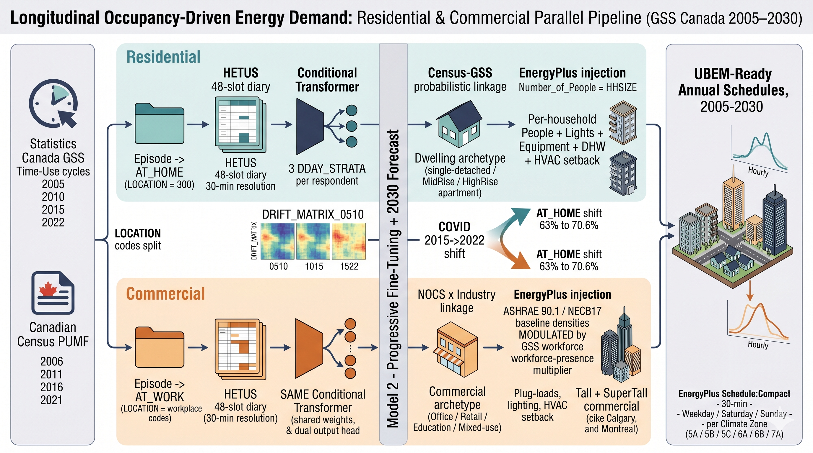
