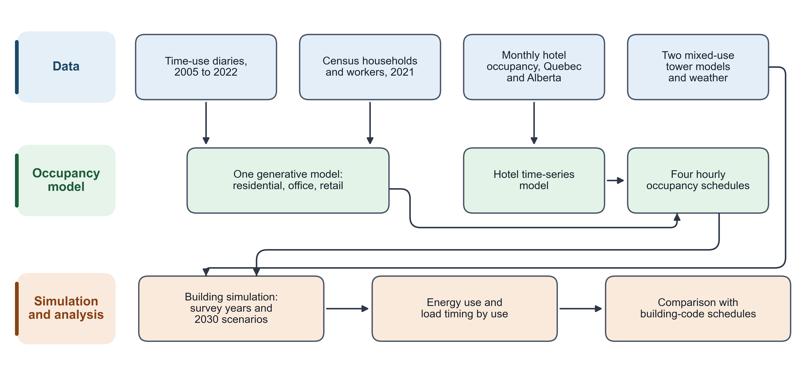
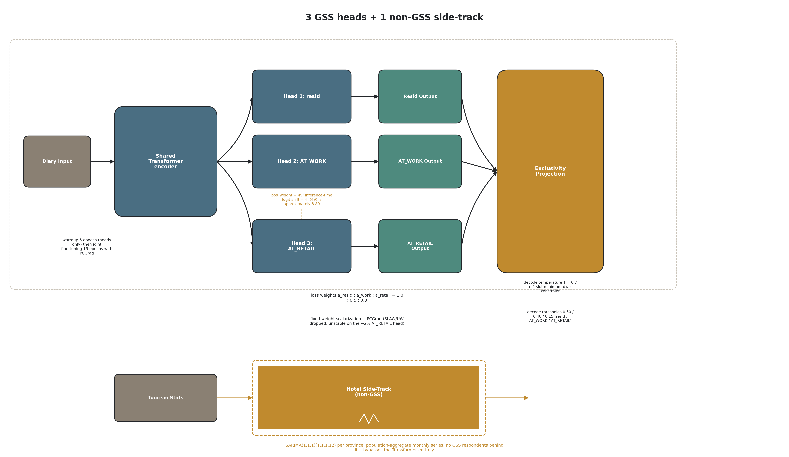
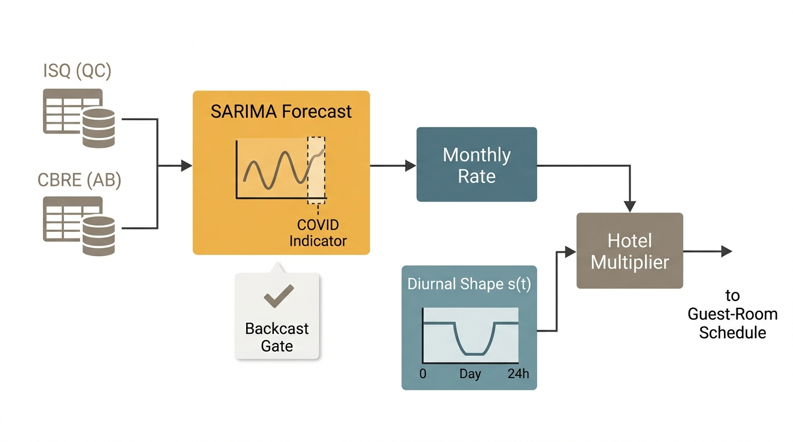
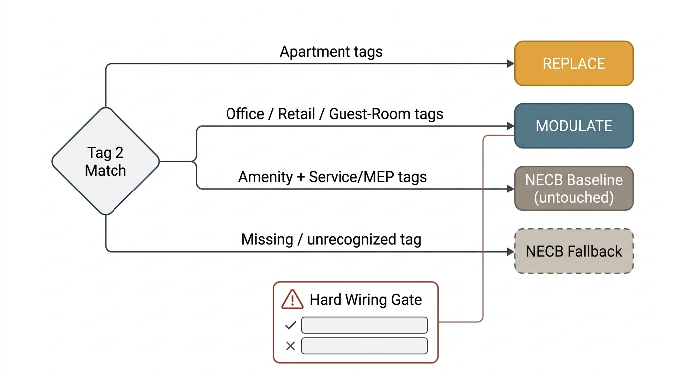
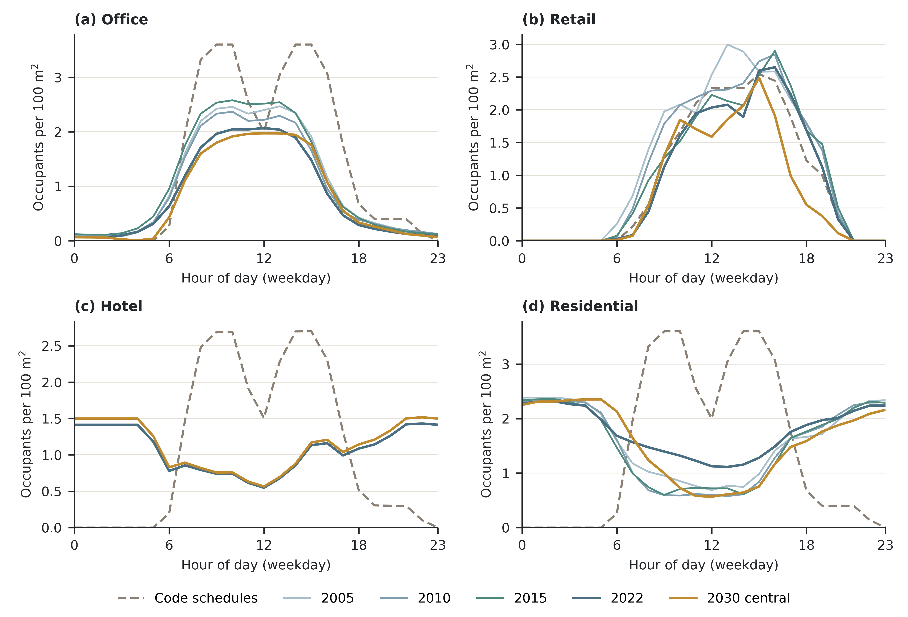
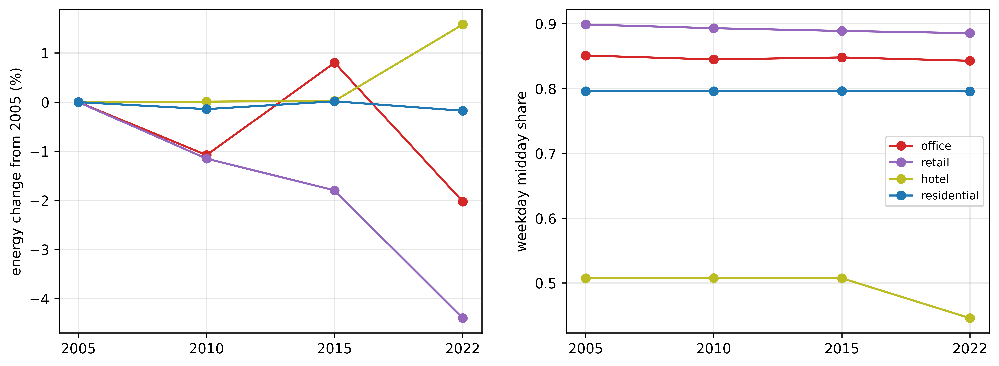
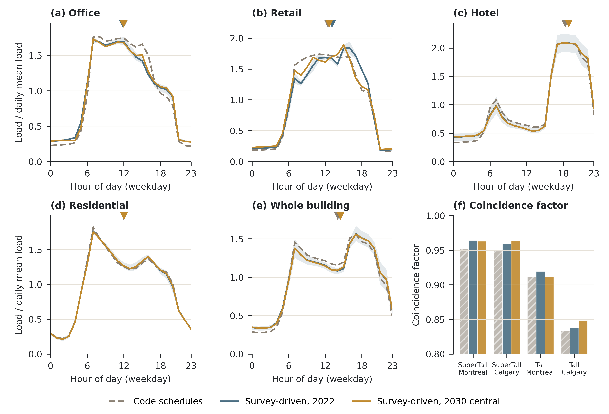

Orcun Koral Iseri^a,\*^, Caroline Hachem-Vermette^a^

^a^ Gina Cody School of Engineering and Computer Science, Concordia University, 1455 De Maisonneuve Blvd. W., Montréal, Québec, H3G 1M8, Canada

\* Corresponding author: orcunkoral.oseri@concordia.ca. ORCID (Iseri): https://orcid.org/0000-0001-7735-3363

# Abstract

Mixed-use towers stack apartments, offices, shops and hotel rooms above one central plant. Their energy models still run most uses on code schedules. This study builds a separate occupancy schedule for each of the four uses and asks what that changes. One Transformer model, trained on four cycles of the Canadian General Social Survey time-use diaries (2005 to 2022), generates residential, office and retail presence. A seasonal time-series model of provincial hotel statistics generates hotel presence. The four schedules drive EnergyPlus models of two prototype towers in Montreal and Calgary, for four survey years and nine scenarios to 2030. The survey-based schedules change who is in the tower and when. Office presence is well below the code schedule, and hotel guests and residents are present at night, as a dwelling-unit code schedule also assumes. This change reaches energy only where lighting and equipment follow occupancy. Against the same towers on code schedules, office and retail intensity change by -7 to -10 % and about -9 %, and their day-to-night contrast becomes smaller. Whole-building timing hardly moves. The daily load centroid shifts by less than 0.5 h, and the annual peak remains a winter-morning plant start-up. Reference intensity ranges built for single-use buildings judge the tower poorly. The office floor is missed even by the code-schedule tower, and hotel verdicts split by prototype. Detailed occupancy matters for tenant energy, but the building peak is set by plant and equipment schedules.

# Highlights

- Four uses, four occupancy schedules: one mixed-use tower modelled from 2005 to 2030.
- Survey occupancy cuts office and retail energy 7 to 10 % against code schedules.
- In mixed-use towers, occupancy detail is a tenant-energy question, not a peak one.
- Load timing shifts under 0.5 h; a winter-morning plant start-up sets the peak.
- Single-use benchmarks misjudge stacked towers; even code-schedule offices miss.

# Keywords

Multi-channel occupancy; Mixed-use tall building; Time-use survey; Occupancy schedule; Building energy simulation; Energy use intensity

# 1. Introduction

## 1.1 Background

Occupant behaviour is a major source of the gap between predicted and measured building energy use (de Wilde, 2014; Mahdavi et al., 2021). The field has responded with detailed occupancy models for single uses. These include Markov-chain, survival and time-use-survey models that reproduce the presence of one population in one building type (Richardson et al., 2008; Widén and Wäckelgård, 2010; Wilke et al., 2013).

Tall mixed-use buildings do not fit that pattern. A single tower can hold households on some floors, an office workforce on others, shops at grade and hotel guests in a separate block. All of them share one envelope and often one central plant. In common practice, one schedule is chosen for such a model, usually residential or office. The remaining uses keep their code-default schedules.

These populations are not interchangeable. Households, workers, shoppers and overnight guests keep different hours and respond to different drivers. Commuting, retail footfall and tourism demand each follow their own trend. They are also observed by different data sources, when they are observed at all. A tower model that carries one of them well and holds the others at a default therefore describes most of its floor area with schedules written for another population.

Knowing who is in a tower, and when, matters for more than annual energy. Central plant sizing, shared-system operation and the building's contribution to district and grid peaks all depend on how the uses overlap in time (Weissmann et al., 2017; Happle et al., 2020; Vecchi and Berardi, 2024). Whether a better occupancy model changes that overlap is an open, testable question.

## 1.2 Existing work and the gap

Two lines of work bear on this problem, and they rarely meet. The first builds time-use-survey occupancy models with a behavioural basis, but for one residential population. Buttitta and Finn (2020) used a national time-use survey to generate high-resolution residential occupancy for heating-load profiles. Widén and Wäckelgård (2010) did the same from a single wave of the Swedish time-use survey. Neither extends the method to a second use or to a future year.

The authors' own prior work belongs to this first line. It built survey-grounded residential occupancy for Canada from successive General Social Survey cycles and carried it into building energy simulation (a companion journal manuscript, in revision; Iseri and Hachem-Vermette, 2026). A related study carried the same residential line through the pandemic to 2030 scenarios and examined the daily load shape (a second companion journal manuscript, in revision). All of this work models one use.

The second line models several uses together, but not from a time-use survey and not inside one building. Doma and Ouf (2023) and Doma et al. (2024) modelled office, retail and residential occupancy from mobile-positioning data at district scale. Each use sat in a separate building, and no future year was modelled. The closest study therefore differs from the present one in its data source, its scale and its time horizon.

Appendix A (Table A.1) scores these studies on eight axes. None combines a time-use-survey behavioural model, more than one occupancy channel, a future-year scenario and a single mixed-use building. The present study fills that combination.

## 1.3 Non-stationary behaviour per use

The authors' residential work found that occupant behaviour changed through the pandemic and the shift to working from home. A schedule anchored to a pre-pandemic baseline therefore misjudged both how much energy was used and when. A mixed-use tower adds a further complication. Each use follows its own trend, and the trends need not move together.

Lower office presence is associated with the persistence of hybrid and remote work (Barrero et al., 2023; Statistics Canada, 2024). Lower retail presence is associated with a longer shift towards online shopping. The weighted share of diary time spent in shopping locations falls by about 25 % across the four survey cycles used here. Hotel presence follows neither trend. It collapsed during the pandemic and recovered along a provincial tourism path. Hotel guests are also outside the survey's sampling frame, so their presence must come from another source. A single occupancy trend, rescaled and reused for four uses, would misstate at least some of them in direction, timing or both.

## 1.4 Aim and contributions

This paper asks what changes in a mixed-use tower when each of its four uses carries its own survey-based occupancy schedule instead of a code schedule. It also asks where single-use reference intensity ranges can still judge the result. The comparison is made on the same two towers run once on code schedules and once on the survey-based schedules.

The paper makes three scientific contributions. First, one jointly trained model generates residential, office and retail presence from four survey cycles, and a separate time-series model generates hotel presence from tourism statistics. All four are routed into the spaces of one tower model. Second, a like-for-like comparison with the code-schedule tower separates what survey-based occupancy changes from what it does not. It changes who is in the tower and when, and it changes office and retail energy, where lighting and equipment follow occupancy. It leaves whole-building load timing and coincidence where the plant start-up and equipment schedules put them. Third, the paper shows where single-use intensity ranges cannot judge the uses of a stacked tower. The code-schedule tower itself falls below the office range, and the hotel verdict splits by tower prototype.

The paper also makes two practical contributions. First, for plant sizing and peak studies in towers of this kind, the building peak is set by plant start-up and equipment schedules, not by occupancy detail. Effort aimed at the peak should therefore go to those schedules. Second, for tenant-level energy, survey-based schedules change office and retail intensity against code schedules by 7 to 10 %. That difference matters for tenant sub-metering and benchmarking.

Section 2 sets out the framework, and Section 5 states its limitations.

# 2. Proposed modelling and simulation framework

The framework turns time-use diaries and tourism statistics into four occupancy schedules and runs them in two mixed-use tower models (Figure 1). Survey diaries feed a generative occupancy model for the residential, office and retail uses. A separate time-series model supplies hotel presence. The four schedules are routed into the tower spaces, and the towers are simulated for four survey years, nine scenarios to 2030 and one code-schedule control.

{width=16cm}

**Figure 1.** Framework overview.

## 2.1 Data and the four occupancy channels

Three of the four channels come from the Statistics Canada General Social Survey (GSS) time-use program (Statistics Canada, 2022). The study uses the 2005, 2010, 2015 and 2022 cycles, the same four used in the authors' residential work. Each diary is placed on a common grid of 48 half-hour slots per day. Residential presence is read as time at home, and office presence as time at work.

The retail channel is new in this study. It marks a respondent as present in a store when the diary location is a store, or when the activity is purchasing goods and services at one of two away-from-home location codes (Appendix B, Eq. B.1). Purchases made from home are excluded, since they are online shopping rather than store presence. The location codes changed between cycles. In 2015 and 2022, grocery and general-merchandise stores share one code and cannot be separated. The retail channel therefore uses one retail space type and covers customers only. Store staff are recorded as at work, so their presence stays on the code schedule.

Residential and office diaries are linked to the 2021 Census public-use microdata file (Statistics Canada, 2021). Households are matched on dwelling type, tenure and size. Workers are matched on occupation and industry. Retail and hotel use no individual linkage.

Hotel guests are outside the GSS sampling frame, which interviews residents at their home address. The hotel channel is therefore built from monthly provincial hotel-occupancy statistics. The Quebec series comes from the Institut de la statistique du Québec (2026), and the Alberta series from the Government of Alberta's tourism market monitor (Government of Alberta, 2022). The Alberta series covers 2011 to 2022 and the Quebec series 2019 to 2022. Table 1 lists the role of each data source.

**Table 1.** Data sources and the four occupancy channels.

| Channel | Source | How presence is derived | How it enters the model | 2030 scenario lever |
|---|---|---|---|---|
| Residential | GSS time-use diaries; 2021 Census households | Residential decoder head; household matched on dwelling type, tenure and size | Replaces the apartment occupant schedule; count set by household size | None of its own (coupled to the office lever) |
| Office | GSS time-use diaries; 2021 Census workers | Office decoder head; worker matched on occupation and industry | Scales the NECB office occupant density by the modelled presence fraction | Work-from-home band: conservative, hybrid (central), fully hybrid |
| Retail | GSS time-use diaries (new channel) | Retail decoder head; location and activity rule (Eq. B.1) | Scales the retail occupant schedule by 0.95 times a normalised customer-hours shape | In-store share: 0.90, 0.97 (central), 1.05; Quebec Sunday hours |
| Hotel | Monthly hotel-occupancy series, Quebec and Alberta | Observed monthly rate for 2022; 2019 monthly pattern scaled to a recovery level for 2030 | Scales the NECB guest-room schedule by a monthly multiplier | Hotel band: 0.92, 1.00 (central), 1.05 |

## 2.2 Generative occupancy model and hotel model

The residential, office and retail channels come from one conditional Transformer (Vaswani et al., 2017) with a shared encoder and three decoder heads, one per channel (Figure 2). The encoder reads the respondent's demographic and calendar attributes, including the survey cycle year as a continuous value. That choice lets the model generate a 2030 year without a new category. The model was grown from an earlier two-channel version with residential and office heads, and the retail head is the one addition. A regression check limits how far the two reused heads may drift from that earlier version, measured as a Jensen-Shannon divergence.

The three heads are trained with fixed loss weights of 1.0, 0.5 and 0.3 for residential, office and retail. A gradient-projection method removes the part of each head's gradient that conflicts with another head (Yu et al., 2020). Retail presence is rare, at about 2 % of slots. Its loss therefore carries a positive-class weight of 49, and the matching logit shift is removed at inference (Appendix B, Eqs. B.2 and B.3). Training runs five epochs on the heads alone, then 15 epochs jointly. Decoding uses a temperature of 0.7, a minimum stay of two slots and presence thresholds of 0.50, 0.40 and 0.15 for residential, office and retail.

Independent heads can place one person in two channels in the same slot. A decode-time exclusivity step assigns each slot to at most one channel by comparing each head's probability with its own threshold (Appendix B, Eq. B.4). The share of slots with more than one channel active is at most 0.5 % before this step and zero after it (Supplementary Figure S5). The full hyperparameter set is given in the Supplementary material (Table S3), with the checkpoint-selection record.

{width=16cm}

**Figure 2.** Occupancy model with three decoder heads and the separate hotel model.

The hotel channel does not pass through the Transformer. Its monthly rate r comes from the provincial series. For 2022, r is the observed monthly rate; the last three months of 2022, missing from the Alberta series, repeat its September value. For 2030, r is the 2019 monthly pattern rescaled to a post-pandemic recovery level equal to the mean observed occupancy of 2023 to 2025: 0.597 in Alberta (Government of Alberta, 2026) and 0.610 in Quebec (Institut de la statistique du Québec, 2026). A seasonal ARIMA model, SARIMA(1,1,0)(0,1,0,12) (Hyndman and Athanasopoulos, 2021), is fitted to each series with a pandemic pulse from March 2020 to June 2022 and a level shift from March 2020 (Box and Tiao, 1975). Its order was selected on Alberta's pre-pandemic months and reused for Quebec, whose series is too short to select its own. The model checks the seasonal pattern and the pandemic dip. Its long-range forecast is not used, because it drifts above full occupancy by 2030. The monthly rate r is turned into a half-hourly multiplier,

$$m(t, \mathrm{month}, \mathrm{PR}) = s(t)\, r(\mathrm{month}, \mathrm{PR}) \qquad (1)$$

where PR is the province and s(t) is a guest-room daily shape shared by both provinces. The shape holds 1.00 from 22:00 to 06:00 and falls to 0.200 on weekdays and 0.308 on weekends during the day (Figure 3).

{width=16cm}

**Figure 3.** Hotel occupancy model, from monthly provincial series to the half-hourly multiplier.

## 2.3 Scenarios to 2030

Each 2030 channel is built from the model conditioned on the 2030 cycle year. The generated diaries are then adjusted to 2022 survey targets. Weekday work presence outside business hours, weekend work and home presence, and retail presence are held at their 2022 levels within each labour-force group. Inside weekday business hours, the work-from-home band sets the change.

Each non-residential channel carries one scenario lever (Table 1). Office uses a work-from-home band with conservative, hybrid and fully hybrid values, the hybrid band being central. Retail uses an in-store share of 0.90, 0.97 or 1.05, applied before the customer-hours shape is normalised, with a Quebec Sunday sub-case for that province's regulated opening hours. Hotel uses a band of 0.92, 1.00 or 1.05 around the central seasonal projection. Residential has no lever of its own. Its 2030 schedules come from the same function and work-from-home parameter as the office schedules, so the two move together.

The three levers form three 2030 bundles: conservative, central and optimistic. Six further scenarios each move one lever to its conservative or optimistic value and hold the other two at central. Each lever is thus tested both jointly and in isolation.

## 2.4 Injection into the tower and end-use loads

The prototype towers leave the standard EnergyPlus space-type field blank. Each space instead carries a tag that names its use, and that tag is used as an exact-match key for routing (Figure 4). Apartment spaces receive the residential channel, and office, retail and guest-room spaces receive their own channels. Amenity and service spaces keep the prototype schedules. Any space whose tag matches no channel also keeps its prototype schedule.

The residential channel replaces the apartment occupant schedule with the modelled household schedule. Each tower draws one set of distinct synthetic households without replacement, 27 for the Tall tower and 41 for the SuperTall tower, one per apartment, with one fixed random seed. Montreal and Calgary models of the same tower and scenario receive the identical household set. The office schedule is also the same national product in both cities. Only the retail and hotel inputs differ by province. Differences between the cities therefore reflect climate and the retail and hotel inputs, not a new household draw.

The other three channels scale a code schedule rather than replace it. Office presence multiplies the NECB office occupant density (National Research Council Canada, 2017) by the modelled presence fraction. Retail presence is 0.95 times a normalised customer-hours shape, and slots with baseline occupancy at or below 0.10 are treated as staff-only and left unchanged. Retail spaces use the NECB office occupant density of 24.97 m2 per person rather than the retail value of 29.97 m2 per person. Guest-room occupancy is the NECB guest-room schedule times the hotel multiplier of Eq. (1).

In office, retail and guest-room spaces, lighting and plug loads follow occupancy above the prototype's standby floor (Appendix B, Eq. B.5). In apartments, only the occupant schedule changes, and lighting and plug loads stay on the prototype schedules. This split decides where occupancy can reach energy.

{width=16cm}

**Figure 4.** Routing of the four channels to the tower spaces by space tag.

## 2.5 Buildings, climates and simulation campaign

The building models are the Tall and SuperTall mixed-use prototypes that Lawrence Berkeley National Laboratory developed in the OpenStudio-Standards library, adapted to the National Energy Code of Canada for Buildings (NECB) 2017 (National Renewable Energy Laboratory, 2020; National Research Council Canada, 2017). Their total floor areas, parsed from the model geometry, are 72,623.1 m2 (Tall) and 135,857.6 m2 (SuperTall). Both towers hold all four uses plus amenity and service space, in different proportions (Supplementary Figure S1). The prototype axis is therefore a real experimental factor, not a size rescaling.

The two cities are Montreal (ASHRAE climate zone 6A) and Calgary (zone 7A), each with one typical meteorological year weather file. The Montreal and Calgary models of each tower share the same geometry and differ in their climate location and design-day sizing data. All runs use EnergyPlus 24.2 (U.S. Department of Energy, 2024).

The campaign crosses two towers, two cities and 14 scenarios, for 56 simulations (Table 2). One scenario is the code-schedule control, in which no schedule is injected. Four are the survey years 2005, 2010, 2015 and 2022. The remaining nine are the three 2030 bundles and the six one-lever variants. Hotel is injected from 2022 onwards only. In 2005, 2010 and 2015 the guest rooms stay on the code schedule, because the provincial series do not cover those years in both provinces.

**Table 2.** Simulation domain.

| Prototype | Total floor area (m2) | Cities | ASHRAE climate zone | Weather | Standard | Simulations |
|---|---|---|---|---|---|---|
| SuperTall | 135,857.6 | Montreal, Calgary | 6A, 7A | Typical year, one file per city | NECB 2017 | 28 |
| Tall | 72,623.1 | Montreal, Calgary | 6A, 7A | Typical year, one file per city | NECB 2017 | 28 |

The code-schedule control must be read exactly. In it, apartment and hotel guest-room occupants follow the NECB office occupancy schedule (NECB-A). Retail occupants follow the NECB retail schedule (NECB-C). Lighting keeps the prototype schedules for apartments and for the hotel. The control is therefore the tower as a practitioner would receive it, with residents and guests on office hours. A second control, run once for each of the four models, moves apartment and guest-room occupants to the NECB dwelling-unit schedule (NECB-G) and changes nothing else. In both controls, office and retail lighting and plug loads stay on the prototype schedules, while in the survey-based runs they follow occupancy above a standby floor.

Two checks guard the injection itself. After each injection, every modulated occupant object is checked for a reference to the injected schedule. Before a simulation is accepted, scenarios that should differ must give different outputs. The history of both checks is given in the Supplementary material.

## 2.6 Metrics, fitted parts and independent checks

Annual energy use intensity (EUI) is reported per channel on two floor-area bases, never averaged: the conditioned floor area of that use, and the gross floor area times that use's share of occupiable area (Appendix B, Eq. B.6). Load shape is described by three measures. The peak hour of a channel is the load-weighted circular mean of its average weekday profile (Eq. B.7) (Mardia and Jupp, 2000). The midday-to-night ratio is the mean weekday demand from 11 to 14 h divided by the mean from 22 to 04 h. The coincidence factor of the building is

$$\mathrm{CF} = \frac{\max_t \sum_{c} P_c(t)}{\sum_{c} \max_t P_c(t)} \qquad (2)$$

where P_c(t) is the hourly demand of channel c over the year (Weissmann et al., 2017). The sum runs over six load channels: the four uses plus residential common space and service and mechanical space. CF is at most 1 by construction and equals 1 only when all channels peak in the same hour. Its level alone therefore says nothing; only its change between schedule sets does.

**Fitted or calibrated parts.** The Transformer is fitted to the GSS diaries of 2005 to 2022. The 2030 schedules are adjusted to 2022 survey targets (Section 2.3). The hotel model is fitted to the provincial series. Its reconstruction is checked against the same series over 2015 to 2019 for Alberta and over 2019 only for Quebec, and it reproduces the direction of the April 2020 dip but not its full depth. The activity-driven end-use layer is calibrated against the Survey of Commercial and Institutional Energy Use (Natural Resources Canada). None of these is an independent validation.

**Independent checks.** Three comparisons use information the model never saw. The first is the code-schedule control run on the same towers (Section 3.2). The second is a set of reference intensity ranges for each use, taken from published prototype results and literature (Section 3.4). An office, retail or hotel range is scored as met or not met. For retail, the rule is that the median of all 56 simulations must lie inside the range. For office and hotel, every simulation must lie inside. The 2019 survey means for offices, retail and hotels from the Survey of Commercial and Institutional Energy Use (Natural Resources Canada, 2019b), and the residential range from the Survey of Household Energy Use (Natural Resources Canada, 2019a), are shown as context only. The ranges were not changed after the results were known. The retail median rule was adopted after an earlier run's numbers had been seen, and it was written down before the reported runs were read. Retail meets its range under the median rule but not under the all-simulations rule, where 19 of 56 simulations fall below the floor. The third check is the pair of injection checks in Section 2.5. The full list of thresholds and their sources is given in the Supplementary material (Table S1).

# 3. Results

## 3.1 Who is in the tower, and when

Figure 5 shows weekday occupants per 100 m2 for each channel by hour, for the code schedules, the four survey cycles and the central 2030 scenario. Values are medians across the four tower-city models.

{width=16cm}

**Figure 5.** Weekday occupants per 100 m2 by hour and channel, code schedules against the survey cycles and the central 2030 scenario.

The code schedules put every use on daytime hours. Apartments and guest rooms follow the NECB office occupancy schedule, so residents peak at 09:00 and guests at 15:00, and both are absent at night. The survey-based channels reverse this for the two uses where people sleep. Residents are present overnight, at about 2.2 to 2.3 occupants per 100 m2 from midnight to 06:00 in every cycle. Their weekday daytime presence (09:00 to 17:00) is much lower, at 0.90, 0.71 and 0.75 in 2005, 2010 and 2015 and 1.26 in 2022. Hotel guests peak at 22:00 in the 2022 survey cycle, against 15:00 on the code schedule.

Office presence keeps its daytime shape but at a lower level than the code schedule. Weekday daytime office presence is 3.14 occupants per 100 m2 on the code schedule. It is 2.19, 2.02 and 2.24 in the first three cycles, 1.80 in 2022 and 1.80 in the central 2030 scenario. Retail customer presence is close to the code schedule in the daytime level and falls to zero at night in every cycle. It is 2.45 in 2005 and 2.07 in 2015, then 1.99 in 2022 and 1.85 in the central 2030 scenario.

The channel energy intensities do not move together across the survey cycles (Figure 6). The office median is 79.43 kWh/m2/yr in 2005, 78.58 in 2010 (-1.07 %), 80.07 in 2015 (+0.81 %) and 77.85 in 2022 (-1.99 %). The retail median is 86.18 in 2010 (-1.15 %), 85.60 in 2015 (-1.79 %) and 83.30 in 2022 (-4.40 %, four-model range -4.52 to -4.29 %). Any change between 2015 and 2022 coincides with the change of survey collection mode (Section 5). The residential median is 118.95 kWh/m2/yr in 2005 and 118.83 in 2022.

Guest rooms stay on the code schedule from 2005 to 2015, so hotel intensity is flat in those years by design. Its small changes, +0.012 % in 2010 and +0.029 % in 2015, come from thermal coupling with the other uses. In 2022, the first injected year, the hotel median changes by +1.54 % against 2005.

{width=16cm}

**Figure 6.** Channel energy use intensity across the survey cycles. Hotel follows the code schedule until 2022.

The four uses carry very different weight in the building. Across the four survey cycles and four models, hotel takes a median 43.51 % of building energy on 20.25 % of floor area. Office takes 23.24 % of energy on 35.14 % of floor area. Residential (17.76 % of energy, 17.73 % of area) and retail (2.76 %, 3.92 %) sit close to proportional.

## 3.2 Against code schedules

Table 3 compares the same towers on code schedules and on the survey-based channels of the 2022 survey cycle. Figure 7 shows the normalised weekday energy profiles.

**Table 3.** Code schedules against survey-based channels, 2022 survey cycle.

| Channel | Measure | Code schedules | Survey-based, 2022 cycle |
|---|---|---|---|
| Office | Occupant peak hour (h) | 9 | 12 |
| Office | Energy peak hour, circular mean (h) | 12.02 | 11.81 |
| Office | Midday-to-night energy ratio | 7.21 | 5.37 |
| Office | EUI, conditioned area (kWh/m2/yr) | 85.36 | 77.85 |
| Retail | Occupant peak hour (h) | 15 | 15.5 |
| Retail | Energy peak hour, circular mean (h) | 12.46 | 13.09 |
| Retail | Midday-to-night energy ratio | 9.27 | 7.75 |
| Retail | EUI, conditioned area (kWh/m2/yr) | 91.74 | 83.30 |
| Hotel | Occupant peak hour (h) | 15 | 22 |
| Hotel | Energy peak hour, circular mean (h) | 18.32 | 18.88 |
| Hotel | Midday-to-night energy ratio | 1.03 | 0.80 |
| Hotel | EUI, conditioned area (kWh/m2/yr) | 260.23 | 264.20 |
| Residential | Occupant peak hour (h) | 9 | 1 |
| Residential | Energy peak hour, circular mean (h) | 11.98 | 12.02 |
| Residential | Midday-to-night energy ratio | 3.78 | 3.86 |
| Residential | EUI, conditioned area (kWh/m2/yr) | 120.12 | 118.83 |
| Building | Load centroid, all days (h) | 14.62 | 15.04 |
| Building | Coincidence factor, six load channels | 0.930 | 0.939 |
| Building | Coincidence factor, four uses | 0.963 | 0.964 |
| Building | Midday-to-night energy ratio | 2.94 | 2.40 |

Note: values are medians across the four tower-city models, for weekdays except where noted.

{width=16cm}

**Figure 7.** Code schedules against survey-based channels: (a) to (e) normalised weekday energy profiles by channel and for the whole building; (f) coincidence factor of each model.

The survey-based channels change presence timing far more than energy timing. Hotel guests move from a 15:00 peak to a 22:00 peak, and residents from 09:00 to 01:00. Yet no channel's energy peak hour moves by more than 0.8 h, and the residential one by less than 0.1 h. The whole-building load centroid moves by 0.34 to 0.47 h across the four models.

The survey-based channels do not add diversity between uses. The code schedules already stagger the uses, with the hotel energy peak in the early evening and the others near midday. The coincidence factor is 0.930 on code schedules and 0.939 with the survey-based channels, a change of +0.005 to +0.012 per model. The annual building maximum falls at 07:00 on a January morning in every code-schedule model, and at the same hour with the survey-based channels. It is a plant start-up peak. In the SuperTall Montreal model on code schedules, all four uses reach their annual maximum in that same hour.

Presence reaches energy where lighting and plug loads follow occupancy, that is, in office, retail and guest-room spaces. Against the code schedules, office intensity changes by -7.4 to -10.3 % and retail intensity by -8.9 to -9.4 %. Their weekday midday-to-night ratios move from 7.2 to 5.4 and from 9.3 to 7.8. The hotel ratio moves from 1.03 to 0.80. On code schedules, hotel energy is higher at night than at midday in two of the four models, and with the survey-based channels in all four.

Residential energy responds least, with an intensity change of -0.8 to -1.4 % and a midday-to-night ratio of 3.86 against 3.78. In this model the residential channel sets occupant heat gains only, while apartment lighting and plug loads stay on the prototype schedules. Hotel intensity rises by 1.1 to 2.1 % in every model, a small change given that guest presence moves from day to night.

## 3.3 Scenarios to 2030

Each lever was moved alone against the central 2030 scenario, with the other two held at central (Figure 8). Each lever mainly moves its own channel.

Office energy changes by +1.08 to +1.66 % under the conservative work-from-home band, which means more office presence. It changes by -2.17 to -1.43 % under the fully hybrid band. Retail energy changes by -1.84 to -1.58 % under the conservative in-store share and by +1.87 to +2.26 % under the optimistic one. Hotel changes by -0.64 to -0.33 % under the conservative band and +0.23 to +0.39 % under the optimistic band. The hotel lever acts through a provincial monthly multiplier on a fixed guest-room shape.

The levers barely touch the channels they were not built to move. Under the conservative office band, retail shifts by +0.07 to +0.16 % and hotel by +0.011 to +0.03 %. Under the conservative retail share, office and hotel shift by less than 0.01 %. Under the conservative hotel band, office shifts by -0.17 to -0.12 % and retail by -0.14 to -0.08 %. Residential moves by -0.29 to -0.07 % under the office variants, with which it is coupled, and by less than 0.11 % under the others.

The two outer bundles move all three levers together. Office then ranges from -2.08 to +1.48 %, retail from -1.90 to +2.29 % and hotel from -0.64 to +0.40 %. These ranges lie within 6 % of the sums of the single-lever effects, at most 0.12 percentage points, so the levers act nearly additively.

{width=16cm}

**Figure 8.** Channel energy response to each scenario lever alone and to the two outer bundles.

## 3.4 Energy intensity against reference ranges

The timing results above do not depend on the absolute intensity level, which the reference ranges judge. Table 4 compares each channel with its reference range over all 56 simulations, and Figure 9 plots every simulation against its range.

**Table 4.** Channel energy use intensity against reference ranges, 56 simulations (kWh/m2/yr).

| Channel | Scored range, low / central / high | Survey value (context) | Conditioned-area basis, range (median) | Gross-area-share basis, range (median) | Simulations in range | Verdict |
|---|---|---|---|---|---|---|
| Office | 100 / 135 / 200 | 231 | 70.86-90.21 (79.47) | 69.91-85.51 (77.56) | 0/56 | FAIL |
| Retail | 80 / 110 / 155 | 281 | 73.45-96.84 (84.82) | 70.40-91.95 (80.62) | 37/56 | PASS (median rule) |
| Hotel | 180 / 240 / 300 | 356 | 204.83-321.55 (262.86) | 172.32-263.48 (217.70) | 28/56 | FAIL |
| Residential | none | 113.9-147.2 | 111.70-128.77 (119.21) | 101.55-115.05 (107.29) | not scored | INFO |

Note: survey values are 2019 means for offices over 18,580 m2, non-food retail and hotels (Natural Resources Canada, 2019b), and the 2019 residential range (Natural Resources Canada, 2019a); they are not scored.

{width=16cm}

**Figure 9.** Channel energy use intensity of every simulation against its reference range.

Office falls below its range in all 56 simulations, with a median of 79.47 kWh/m2/yr. The code-schedule control carries no survey occupancy and still falls below the floor of 100, at a median of 85.36 kWh/m2/yr. A range that the unmodified code tower cannot meet says more about the range than about the occupancy model. Modelled heating is about 17 % of office energy in the code-schedule models and 22 % across the 56 simulations, below the 35 to 45 % the range implies. Rebasing office area on service and mechanical space lowers every value further. The source of the office range also gives three different floors for itself: 100, 80 to 140 and 85 to 115 kWh/m2/yr. The floor is therefore contested.

Hotel exceeds its range on the other side. The 28 simulations outside the range all lie above the 300 kWh/m2/yr ceiling, and all are Tall-tower models, while the SuperTall models stay inside in every case. The values form two separate clusters by tower, 204.83 to 221.31 and 304.41 to 321.55 kWh/m2/yr. The gap between them, 83.10 kWh/m2/yr, is 69.2 % of the range width, and the ceiling falls inside it. Any ceiling within that gap would split the models in the same way. The hotel verdict therefore reflects the tower prototype more than hotel occupancy. The ceiling rests on the DOE/PNNL Large Hotel prototype under ASHRAE 90.1-2019 (ASHRAE, 2019), at 284.44 kWh/m2/yr for zone 6A and 299.28 for zone 7. That value is within 1.0 % of the older anchor of 302.21, so the vintage of the standard does not explain the result. The reference cities, Rochester and International Falls, do differ from Montreal and Calgary.

Retail meets its range by the median rule. The median of the 56 simulations is 84.82 kWh/m2/yr, above the floor of 80. 37 simulations lie inside the range and 19 lie below it, so retail would not meet its range on a count of individual simulations. The code-schedule control places retail at a median of 91.74 kWh/m2/yr, also inside the range. The difference from the control comes from the survey-based customer schedule (Section 3.2), and no measured in-store presence reference exists to say which level is right.

Residential has no scored range. 55 of 56 simulations lie outside the context range from the household energy survey, which is shown for information only.

# 4. Discussion

The main finding separates occupancy from load timing. Survey-based schedules change who is in the tower and when. Residents and hotel guests are present at night, and office presence is lower than the code schedule assumes. These changes reach energy only in the uses whose lighting and plug loads follow occupancy. In the towers studied here, the effect shows in office and retail. Whole-building timing stays where the plant start-up and the equipment schedules put it.

This outcome narrows a claim that is easy to make. Four uses with different hours might be expected to spread the building's demand over the day. The comparison with code schedules shows that the prototype already does this. Its code schedules place the hotel energy peak in the early evening and the other uses near midday. A coincidence factor below 1 is therefore a property of any building whose uses do not all peak in the same hour. The survey-based channels raise it slightly rather than lower it. A study that reports channel peak hours or a coincidence factor without a code-schedule control cannot credit the occupancy model with them.

The annual peak explains why load timing is so stable. In every model, the building peaks at 07:00 on a January morning under both schedule sets, when the plant brings the tower up to temperature. Occupancy has little influence on that hour. For plant sizing and grid-peak studies of towers like these, a better occupancy model will not move the design peak. The start-up strategy and the equipment schedules will. This practical result is worth stating plainly, because occupancy detail is often assumed to matter most for peaks (Doma et al., 2024).

Where occupancy does reach energy, it changes the tenant's level and daily profile. Against code schedules, office and retail intensity change by -7 to -10 % and about -9 %, and their midday-to-night ratios fall with them. For tenant sub-metering, leasing and benchmarking, these are the numbers that matter. The code schedules overstate the energy of office and retail tenants and sharpen the contrast between their midday and night loads.

Residential energy hardly responds, and the reason is structural rather than behavioural. The residential channel sets occupant heat gains only. Apartment lighting and plug loads stay on the prototype schedules. A model that linked apartment lighting and appliances to the household schedule, as the authors' residential work does through activity-driven loads (second companion journal manuscript, in revision), would likely respond more. The present result should not be read as evidence that residential occupancy does not matter.

The code-schedule control also needs careful reading. It places residents and hotel guests on office hours. The second control, with apartments and guest rooms on the dwelling-unit schedule, also puts both groups in the tower at night, with a weekday presence peak near 23:00, as the survey-based channels do. The night-presence contrast in Section 3.2 is therefore a property of the office-hours control rather than a finding of the survey data. The timing result does not depend on this choice: against the dwelling-unit control, the building load centroid moves by 0.03 h and the coincidence factor by 0.001.

The reference ranges tell a separate story. The office range is not met even for the unmodified code-schedule tower. Its source gives three different floors, and the heating share it implies does not match the model. The hotel verdict follows the tower prototype, because the two prototypes fall on either side of a wide gap that contains the ceiling. Retail meets its range on the median, as does the code-schedule control, but a third of the retail simulations fall below the floor. These ranges were built for single-use buildings. In a stacked tower they cannot tell a correct tenant model from a building whose shared plant and envelope shift each use's energy. This is a limitation of the benchmarks available, not evidence against the occupancy model, and the verdicts are reported as scored. A reference built from measured mixed-use towers would be needed to judge channel levels. The Canadian surveys of measured energy report it by whole building or by primary activity, not by use within one building (Natural Resources Canada, 2018; Natural Resources Canada, 2019b).

The framework itself is not specific to Canada. It needs a repeated national time-use survey, a household frame that links diaries to a dwelling stock, and a monthly series for any use the survey cannot see. The American Time Use Survey (U.S. Bureau of Labor Statistics, 2026) and the Harmonised European Time Use Survey (Eurostat, 2018) could fill the first role. The routing by space tag works for any tower model whose spaces carry a use label.

# 5. Limitations

Each tower draws one set of households, and the Montreal and Calgary models share that set and the same office schedules. City differences therefore reflect climate and the retail and hotel inputs, not independent draws. Run-to-run spread was measured with four further household draws in every tower and city. Across draws, channel intensity varies by about 0.5 % or less, most in the residential channel, and the load-weighted peak hours vary by about 0.1 h or less. The 2030-against-2022 changes in office, retail and hotel energy are 5 to 310 times this spread. The residential change is not clearly larger than the spread, and its sign depends on the draw.

The Quebec hotel series begins in 2019, so its seasonal model order is borrowed from Alberta, and its reconstruction error over 2019 (0.099) is above the 0.05 threshold met by Alberta. The 2030 hotel level rests on a single recovery level for each province, the observed 2023 to 2025 mean, held constant to 2030; the three hotel bands bracket it.

The main code-schedule control puts residents and hotel guests on the NECB office schedule. The dwelling-unit control shows that their night presence is not unique to the survey data (Section 4). Its energy results were compared on the conditioned-area basis only. In both controls, office and retail lighting and plug loads stay on the prototype schedules, while in the survey-based runs they follow occupancy above a standby floor. The office and retail differences in Section 3.2 therefore combine the survey occupancy with this change of load schedule, and the two parts were not separated in the reported runs.

The retail median rule was adopted after an earlier run had been seen. It was fixed before the reported runs were read. Retail meets its range under this rule, but not under the all-simulations rule, where 19 of 56 simulations fall below the floor.

The 2030 scenarios use typical-year weather, not a future climate.

Only one prototype tower family was modelled. Its Tall and SuperTall models are the only structural contrast tested, so the results may not carry over to towers with a different use mix, floor plate or plant.

The 2022 survey changed its collection mode, from telephone interviews to self-completed questionnaires, in the same cycle as the pandemic. Changes between 2015 and 2022, including the 2022 retail fall, may partly reflect the mode change. Lower office and retail presence is associated with working from home and online shopping, but this study does not identify either as a cause.

In the 2030 scenarios, weekday daytime home presence falls below its 2022 level in all three bands, even on a like-for-like population. This residual comes from the generative model, whose 2030 diaries of employed people carry less time both at home and at work, rather than from the scenario design.

Hotel guests and retail staff are outside the survey signal. Retail spaces use the NECB office occupant density. Equipment power density is one value across all space types. Ground-level weather is applied to the full height of the tower. The full list, with a bounding measurement for each item, is given in Supplementary Table S2.

# 6. Conclusion

This paper gave each use of a mixed-use tower its own occupancy schedule. One jointly trained Transformer generated residential, office and retail presence from four Canadian time-use survey cycles. A seasonal time-series model of provincial statistics generated hotel presence. The four schedules were routed into two prototype towers in two cities and compared with the same towers on code schedules.

Three conclusions follow. First, survey-based schedules change who is in the tower and when. Office presence is lower than the code schedule assumes. Residents and hotel guests are present at night, which a dwelling-unit code schedule also captures but the office-hours schedule used in the code model does not. Second, these changes reach energy only where lighting and plug loads follow occupancy. Office and retail intensity change by -7 to -10 % and about -9 % against code schedules, and their day-to-night contrast becomes smaller. Residential and hotel energy change by about 2 % or less. Third, whole-building timing does not follow occupancy. The load centroid shifts by a fraction of an hour, the coincidence factor rises slightly, and the annual peak remains a winter-morning plant start-up under both schedule sets.

Reference intensity ranges built for single-use buildings cannot judge the uses of a stacked tower. The office floor is missed even by the code-schedule tower, the hotel verdict follows the tower prototype, and retail meets its range on the median but not in every simulation. These verdicts stand as scored.

For practice, occupancy detail matters for tenant energy, sub-metering and benchmarking. For plant sizing and peak studies, the start-up strategy and equipment schedules matter more. Future work should link apartment lighting and appliances to household activity, compare against a dwelling-shaped code control, and build reference ranges from measured mixed-use towers.

# Nomenclature

**Abbreviations**

| Term | Meaning |
|---|---|
| ASHRAE | American Society of Heating, Refrigerating and Air-Conditioning Engineers |
| CF | Coincidence factor (Eq. 2) |
| CFA | Conditioned floor area |
| DOE | U.S. Department of Energy |
| EUI | Energy use intensity (kWh/m2/yr) |
| GFA | Gross floor area |
| GSS | General Social Survey (Statistics Canada), time-use program |
| NECB | National Energy Code of Canada for Buildings |
| NECB-A, NECB-C | NECB occupancy schedules for office and retail occupancies |
| PNNL | Pacific Northwest National Laboratory |
| PR | Province (Quebec or Alberta) |
| SARIMA | Seasonal autoregressive integrated moving-average model |
| SCIEU | Survey of Commercial and Institutional Energy Use (Natural Resources Canada) |
| SHEU | Survey of Household Energy Use (Natural Resources Canada) |

**Symbols**

| Symbol | Meaning |
|---|---|
| A_c | Floor area assigned to channel c (m2) |
| E_c | Annual energy of channel c (kWh) |
| f_c | Share of occupiable floor area held by channel c |
| h | Hour of day (0 to 23) |
| m(t, month, PR) | Hotel half-hourly occupancy multiplier |
| o(t) | Injected occupancy fraction in slot t |
| P_c(t) | Hourly demand of load channel c (kW) |
| r(month, PR) | Monthly hotel occupancy rate |
| s(t) | Guest-room daily occupancy shape |
| t | Half-hour slot (1 to 48) or hour of the year |
| w_k | Loss weight of decoder head k |
| φ | Standby floor of a replaced prototype load schedule |
| τ_k | Presence threshold of decoder head k |

# Appendix A. Comparison with prior studies

Table A.1 compares the present study with the closest prior studies on eight axes. A calibrated behavioural model has parameters estimated from observed microdata, and stock-scale means that the result stands for a building population. ✓ marks an axis a study covers, ✗ one it does not, and P a partial score.

**Table A.1.** Comparison of the present study with prior occupancy modelling studies.

| Study | Time-series occupancy | Time-use-survey-driven | Multi-channel (more than one use) | Calibrated behavioural model | Future-year scenario | Mixed-use single building | Activity or end-use resolved | Stock-scale |
|---|:---:|:---:|:---:|:---:|:---:|:---:|:---:|:---:|
| Doma and Ouf (2023); Doma et al. (2024) | ✓ | ✗ | ✓ | ✗ | ✗ | ✗ | ✓ | ✗ |
| Buttitta and Finn (2020) | ✓ | ✓ | ✗ | ✓ | ✗ | ✗ | ✗ | ✓ |
| Widén and Wäckelgård (2010) | ✓ | ✓ | ✗ | ✓ | ✗ | ✗ | ✓ | ✗ |
| Authors' prior residential line: first companion journal manuscript, in revision, and companion conference study (Iseri and Hachem-Vermette, 2026) | ✓ | ✓ | ✗ | ✓ | ✗ | ✗ | ✗ | P |
| Authors' second companion journal manuscript, in revision (residential load shape to 2030) | ✓ | ✓ | ✗ | ✓ | ✓ | ✗ | ✓ | ✓ |
| This study | ✓ | ✓ | ✓ | ✓ | ✓ | ✓ | ✓ | ✗ |

Each competing study holds part of the combination: Doma and co-authors model several uses at district scale from mobile-positioning data, and the two time-use studies cover one residential use without a future year. The present study trades stock-scale coverage for several channels inside one mixed-use building.

# Appendix B. Supporting equations

**Retail presence rule (Section 2.1).** A diary slot is retail presence when the location is a store (location code 5), or when the activity is purchasing goods and services (activity code 4) at location code 5 or 9:

$$R = (L = 5)\ \lor\ \left[(A = 4)\ \land\ (L \in \{5, 9\})\right] \qquad (\mathrm{B.1})$$

where L is the diary location code and A the activity code. The per-cycle code mapping is given in Supplementary Table S3.

**Training loss (Section 2.2).** The three decoder heads share one weighted loss over the 48 slots,

$$\mathcal{L} = \sum_{k \in \{\mathrm{res}, \mathrm{off}, \mathrm{ret}\}} w_k\, \frac{1}{48} \sum_{t=1}^{48} \ell_k(t), \qquad w_{\mathrm{res}} = 1.0,\ w_{\mathrm{off}} = 0.5,\ w_{\mathrm{ret}} = 0.3 \qquad (\mathrm{B.2})$$

where ℓ_k is the binary cross-entropy of head k. For the retail head, the positive class carries a weight of 49. Its logit z is shifted at inference so that the decoded probability is not inflated by that weight:

$$p_{\mathrm{ret}}(t) = \sigma\!\left(z(t) - \ln 49\right) \qquad (\mathrm{B.3})$$

Weighting the positive class in the loss is equivalent to over-sampling it by the same factor, and the prior correction for such sampling subtracts the logarithm of that factor from the logit (King and Zeng, 2001). The same logit adjustment is given in general form for long-tailed classification by Menon et al. (2021).

**Exclusivity step (Section 2.2).** In each slot, the heads whose probability reaches their threshold are candidates, and the slot is assigned to the candidate with the largest threshold-normalised probability:

$$k^{*}(t) = \arg\max_{k:\ p_k(t) \ge \tau_k} \frac{p_k(t)}{\tau_k} \qquad (\mathrm{B.4})$$

with τ_res = 0.50, τ_off = 0.40 and τ_ret = 0.15. A slot with no candidate is assigned to no channel.

**Lighting and equipment schedules (Section 2.4).** In office, retail and guest-room spaces, the lighting and plug-load schedule that replaces a prototype schedule keeps that schedule's standby floor φ:

$$f(t) = \varphi + (1 - \varphi)\, o(t) \qquad (\mathrm{B.5})$$

where o(t) is the injected occupancy fraction.

**Energy use intensity (Section 2.6).** For channel c, on the two floor-area bases,

$$\mathrm{EUI}^{\mathrm{CFA}}_c = \frac{E_c}{A^{\mathrm{CFA}}_c}, \qquad \mathrm{EUI}^{\mathrm{GFA}}_c = \frac{E_c}{f_c\, A^{\mathrm{GFA}}} \qquad (\mathrm{B.6})$$

**Circular-mean peak hour (Section 2.6).** For an average weekday profile P(h), the load-weighted circular mean hour is

$$\bar{h} = \frac{24}{2\pi}\, \operatorname{atan2}\!\left(\sum_{h} P(h) \sin\frac{2\pi h}{24},\ \sum_{h} P(h) \cos\frac{2\pi h}{24}\right) \bmod 24 \qquad (\mathrm{B.7})$$

**Midday-to-night ratio (Section 2.6).**

$$\rho = \frac{\overline{P}_{11\text{-}14\,\mathrm{h}}}{\overline{P}_{22\text{-}04\,\mathrm{h}}} \qquad (\mathrm{B.8})$$

where each bar is the mean weekday demand over the stated hours.

# CRediT authorship contribution statement

**Orcun Koral Iseri:** Conceptualization, Methodology, Software, Formal analysis, Investigation, Data curation, Validation, Visualization, Writing - original draft. **Caroline Hachem-Vermette:** Conceptualization, Supervision, Funding acquisition, Resources, Writing - review and editing.

# Declaration of competing interest

The authors declare that they have no known competing financial interests or personal relationships that could have appeared to influence the work reported in this paper.

# Funding

This work was supported by the Natural Sciences and Engineering Research Council of Canada (NSERC) through a Discovery Grant, and by the Volt-Age Seed Fund, Concordia University. The funders had no role in the study design, in the collection, analysis and interpretation of data, in the writing of the article, or in the decision to submit it for publication.

# Data availability

This study uses the Statistics Canada General Social Survey time-use public-use microdata files (2005, 2010, 2015 and 2022 cycles) and the 2021 Census of Population public-use microdata file. These files are available from Statistics Canada under its licence terms, which do not allow the authors to redistribute them. The provincial hotel-occupancy series are published by the Institut de la statistique du Québec and by the Government of Alberta. The derived occupancy schedules, building model files and scripts that support the findings of this study are available from the corresponding author upon reasonable request.

# Declaration of generative AI and AI-assisted technologies in the manuscript preparation process

During the preparation of this work the authors used Claude (Anthropic) in order to improve the grammar and readability of the text, and Gemini (Google) in order to prepare literature research reports and to draw the schematic diagrams in Figures 1 to 4, Supplementary Figures S2 to S5 and the graphical abstract from the authors' specifications. Every source named in the research reports was checked by the authors against the publisher record before use. After using these tools, the authors reviewed and edited the content as needed and take full responsibility for the content of the published article.

# Ethical approval

This study involves no experiments on human or animal subjects. It uses anonymized public-use microdata released by Statistics Canada and published provincial tourism statistics.

# Acknowledgements

The authors gratefully acknowledge the financial support for this postdoctoral research provided by the NSERC Discovery Grant and the Volt-Age Seed Fund, administered through the Department of Building, Civil and Environmental Engineering, Gina Cody School of Engineering and Computer Science, Concordia University, Montréal, Québec, Canada.

# References

ASHRAE (2014). *ASHRAE Guideline 14-2014: Measurement of Energy, Demand, and Water Savings*. Atlanta, GA: American Society of Heating, Refrigerating and Air-Conditioning Engineers.

ASHRAE (2019). *ANSI/ASHRAE/IES Standard 90.1-2019: Energy Standard for Buildings Except Low-Rise Residential Buildings*. Atlanta, GA: American Society of Heating, Refrigerating and Air-Conditioning Engineers.

Barrero, J.M., Bloom, N. and Davis, S.J. (2023). The evolution of work from home. *Journal of Economic Perspectives*, 37(4), pp. 23-50. https://doi.org/10.1257/jep.37.4.23.

Box, G.E.P. and Tiao, G.C. (1975). Intervention analysis with applications to economic and environmental problems. *Journal of the American Statistical Association*, 70(349), pp. 70-79. https://doi.org/10.1080/01621459.1975.10480264.

Buttitta, G. and Finn, D.P. (2020). A high-temporal resolution residential building occupancy model to generate high-temporal resolution heating load profiles of occupancy-integrated archetypes. *Energy and Buildings*, 206, 109577. https://doi.org/10.1016/j.enbuild.2019.109577.

de Wilde, P. (2014). The gap between predicted and measured energy performance of buildings: A framework for investigation. *Automation in Construction*, 41, pp. 40-49. https://doi.org/10.1016/j.autcon.2014.02.009.

Doma, A. and Ouf, M. (2023). Leveraging mobile positioning data to model building occupant behaviour in a mixed-use district. *Proceedings of Building Simulation 2023: 18th Conference of IBPSA*, pp. 596-603. https://doi.org/10.26868/25222708.2023.1671.

Doma, A., Padsala, R., Ouf, M.M. and Eicker, U. (2024). Bottom-up framework for modelling occupancy-based demand-side management strategies in a mixed-use district. *Applied Energy*, 375, 124081. https://doi.org/10.1016/j.apenergy.2024.124081.

Eurostat (2018). *Harmonised European Time Use Surveys (HETUS): 2018 Guidelines*. Luxembourg: Publications Office of the European Union (KS-GQ-19-003; re-edition 2020, KS-GQ-20-011). https://ec.europa.eu/eurostat/web/products-manuals-and-guidelines/-/ks-gq-19-003 (accessed 25 September 2026).

Government of Alberta (2022). *Alberta Tourism Market Monitor: Monthly Update* (monthly issues, 2011 to 2022). Edmonton: Government of Alberta. https://open.alberta.ca/dataset/1648658d-ec8e-4bf0-98d6-23bdf172ac4a and the yearly datasets for 2011 to 2021 (accessed 25 September 2026).

Government of Alberta (2026). *Alberta Economic Dashboard: Accommodation occupancy rate* (CBRE monthly occupancy of reporting hotels, motels and motor hotels; Alberta excluding resorts). Edmonton: Government of Alberta. https://economicdashboard.alberta.ca/dashboard/accommodation-occupancy-rate (accessed 25 September 2026).

Happle, G., Fonseca, J.A. and Schlueter, A. (2020). Impacts of diversity in commercial building occupancy profiles on district energy demand and supply. *Applied Energy*, 277, 115594. https://doi.org/10.1016/j.apenergy.2020.115594.

Hyndman, R.J. and Athanasopoulos, G. (2021). *Forecasting: Principles and Practice*, 3rd ed. Melbourne: OTexts. https://otexts.com/fpp3/ (accessed 25 September 2026).

Institut de la statistique du Québec (2026). *Enquête sur la fréquentation des établissements d'hébergement* (régions et MRC/villes), monthly data. Tableau de bord, Gouvernement du Québec, ministère du Tourisme. https://www.quebec.ca/tourisme-loisirs-sport/services-industrie-touristique/etudes-statistiques/tableaux-de-bord-donnees-tourisme/hebergement-touristique-camping/enquete-frequentation-par-region (accessed 25 September 2026).

Iseri, O.K. and Hachem-Vermette, C. (2026). Longitudinal analysis of occupancy-driven energy demand in Canadian residential buildings (2005-2025). *eSim 2026 (IBPSA-Canada)*.

King, G. and Zeng, L. (2001). Logistic regression in rare events data. *Political Analysis*, 9(2), pp. 137-163. https://doi.org/10.1093/oxfordjournals.pan.a004868.

Mahdavi, A., Berger, C., Amin, H., Ampatzi, E., Andersen, R.K., Azar, E., Barthelmes, V.M., Favero, M., Hahn, J., Khovalyg, D., Knudsen, H.N., Luna-Navarro, A., Roetzel, A., Sangogboye, F.C., Schweiker, M., Taheri, M., Teli, D., Touchie, M. and Verbruggen, S. (2021). The role of occupants in buildings' energy performance gap: Myth or reality? *Sustainability*, 13(6), 3146. https://doi.org/10.3390/su13063146.

Mardia, K.V. and Jupp, P.E. (2000). *Directional Statistics*. Chichester: John Wiley & Sons.

Menon, A.K., Jayasumana, S., Rawat, A.S., Jain, H., Veit, A. and Kumar, S. (2021). Long-tail learning via logit adjustment. In: *International Conference on Learning Representations (ICLR 2021)*. arXiv:2007.07314.

National Renewable Energy Laboratory (2020). *OpenStudio-Standards: TallBuilding and SuperTallBuilding prototype models*, developed by Lawrence Berkeley National Laboratory, ASHRAE 90.1-2019 template. https://github.com/NREL/openstudio-standards (accessed 25 September 2026).

National Research Council Canada (2017). *National Energy Code of Canada for Buildings 2017*, Fourth Edition. Ottawa: Canadian Commission on Building and Fire Codes (Cat. NR24-24/2017E-PDF; ISBN 978-0-660-24718-2). https://doi.org/10.4224/40002011.

Natural Resources Canada (2018). *Survey of Energy Consumption of Multi-Unit Residential Buildings (SECMURBs) 2018: Data Tables*. Ottawa: Office of Energy Efficiency. https://oee.nrcan.gc.ca/corporate/statistics/neud/dpa/menus/murb/2018/tables.cfm (accessed 25 September 2026).

Natural Resources Canada (2019a). *2019 Survey of Household Energy Use (SHEU-2019) Data Tables*. Ottawa: Office of Energy Efficiency (comparative energy-intensity series: CODR table 25-10-0061-01). https://oee.nrcan.gc.ca/corporate/statistics/neud/dpa/menus/sheu/2019/tables.cfm (accessed 22 September 2026).

Natural Resources Canada (2019b). *Survey of Commercial and Institutional Energy Use (SCIEU), Buildings 2019: Data Tables*. Ottawa: Office of Energy Efficiency. https://oee.nrcan.gc.ca/corporate/statistics/neud/dpa/menus/scieu/2019/tables.cfm (accessed 25 September 2026).

Richardson, I., Thomson, M. and Infield, D. (2008). A high-resolution domestic building occupancy model for energy demand simulations. *Energy and Buildings*, 40(8), pp. 1560-1566. https://doi.org/10.1016/j.enbuild.2008.02.006.

Statistics Canada (2021). *Census of Population, 2021: Public Use Microdata Files* (Series Catalogue no. 98M0001X). Individuals File: 98M0001X2021001; Hierarchical File: 98M0001X2021002. https://www150.statcan.gc.ca/n1/en/catalogue/98M0001X (accessed 25 September 2026).

Statistics Canada (2022). *General Social Survey: Time Use, Public Use Microdata Files* (Series Catalogue no. 45-25-0001; series DOI https://doi.org/10.25318/45250001-eng). Individual cycles: 12M0019X (Cycle 19, 2005), 12M0024X (Cycle 24, 2010), 89M0034X (Cycle 29, 2015), and 45-25-0001 issue 2025001 (Time Use, 2022). https://www150.statcan.gc.ca/n1/pub/45-25-0001/index-eng.htm.

Statistics Canada (2024). More Canadians commuting in 2024. *The Daily*, 26 August 2024. https://www150.statcan.gc.ca/n1/daily-quotidien/240826/dq240826a-eng.htm (accessed 25 September 2026).

U.S. Bureau of Labor Statistics (2026). *American Time Use Survey*. Washington, DC: U.S. Department of Labor. https://www.bls.gov/tus/ (accessed 25 September 2026).

U.S. Department of Energy (2024). *EnergyPlus (Version 24.2.0)*. National Renewable Energy Laboratory. https://energyplus.net/ (accessed 25 September 2026).

Vaswani, A., Shazeer, N., Parmar, N., Uszkoreit, J., Jones, L., Gomez, A.N., Kaiser, Ł. and Polosukhin, I. (2017). Attention is all you need. In: *Advances in Neural Information Processing Systems 30 (NeurIPS 2017)*, pp. 5998-6008.

Vecchi, F. and Berardi, U. (2024). Mixed-use neighbourhood to maximise urban energy community potential. *E3S Web of Conferences*, 523, 05002. https://doi.org/10.1051/e3sconf/202452305002.

Weissmann, C., Hong, T. and Graubner, C.-A. (2017). Analysis of heating load diversity in German residential districts and implications for the application in district heating systems. *Energy and Buildings*, 139, pp. 302-313. https://doi.org/10.1016/j.enbuild.2016.12.096.

Widén, J. and Wäckelgård, E. (2010). A high-resolution stochastic model of domestic activity patterns and electricity demand. *Applied Energy*, 87(6), pp. 1880-1892. https://doi.org/10.1016/j.apenergy.2009.11.006.

Wilke, U., Haldi, F., Scartezzini, J.-L. and Robinson, D. (2013). A bottom-up stochastic model to predict building occupants' time-dependent activities. *Building and Environment*, 60, pp. 254-264. https://doi.org/10.1016/j.buildenv.2012.10.021.

Yu, T., Kumar, S., Gupta, A., Levine, S., Hausman, K. and Finn, C. (2020). Gradient surgery for multi-task learning. In: *Advances in Neural Information Processing Systems 33 (NeurIPS 2020)*, pp. 5824-5836.
