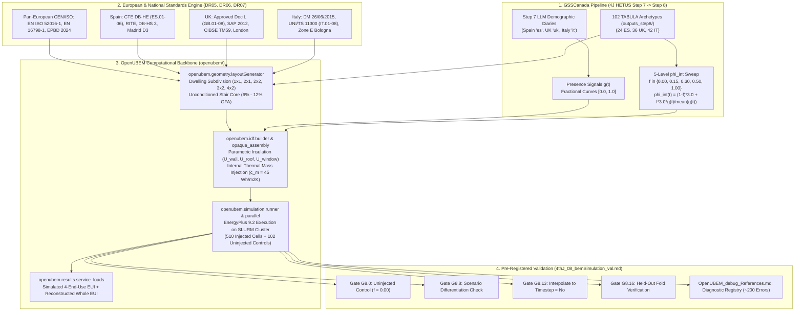

# Step 8 — BEM / UBEM Simulation: Implementation Specification (Unified OpenUBEM + GSSCanada Architecture)

### 4J HETUS LLM Pipeline & OpenUBEM Framework Integration.
#### Parent Specification: `../4thJ_08_bemSimulation.md` (Read-Only). Validation Gates: `../4thJ_08_bemSimulation_val.md` (Pre-Registered).
#### OpenUBEM Engine Documentation: `C:\Users\o_iseri\Desktop\OpenUBEM\docs\docs_EXPLANATION\`
- [`OpenUBEM_fundamentals.md`](file:///C:/Users/o_iseri/Desktop/OpenUBEM/docs/docs_EXPLANATION/OpenUBEM_fundamentals.md) (Architecture & 5-Stage Pipeline)
- [`OpenUBEM_inputs_reference.md`](file:///C:/Users/o_iseri/Desktop/OpenUBEM/docs/docs_EXPLANATION/OpenUBEM_inputs_reference.md) (Input Registry & Standards)
- [`OpenUBEM_imputation_methods.md`](file:///C:/Users/o_iseri/Desktop/OpenUBEM/docs/docs_EXPLANATION/OpenUBEM_imputation_methods.md) (4-Tier Imputation Cascade)
- [`simulated_vs_reconstructed_methodology.md`](file:///C:/Users/o_iseri/Desktop/OpenUBEM/docs/docs_EXPLANATION/simulated_vs_reconstructed_methodology.md) (Fraction-Split EUI Completion)
- [`OpenUBEM_debug_References.md`](file:///C:/Users/o_iseri/Desktop/OpenUBEM/docs/docs_EXPLANATION/OpenUBEM_debug_References.md) (Diagnostic Error Registry: ~200 Error Patterns)
#### Deep Research Dossier: `IMP_step8/DeepResearch/`
- [`DR01: State of the Art in Residential Floor Layout Generation`](file:///C:/Users/o_iseri/Desktop/GSSCanada/GSSCanada-main/4J_docs_occ/Step8_docs/IMP_step8/DeepResearch/DR01_residential_floor_layout_generation_state_of_art.md)
- [`DR02: Floor-to-Unit Division and Staircase Buffer Methods`](file:///C:/Users/o_iseri/Desktop/GSSCanada/GSSCanada-main/4J_docs_occ/Step8_docs/IMP_step8/DeepResearch/DR02_floor_to_unit_division_and_staircase_methods.md)
- [`DR03: Thermal Zoning Resolution & Energy Sensitivity`](file:///C:/Users/o_iseri/Desktop/GSSCanada/GSSCanada-main/4J_docs_occ/Step8_docs/IMP_step8/DeepResearch/DR03_thermal_zoning_resolution_and_energy_impacts.md)
- [`DR04: Comparative Matrix and Synthesis for UBEM`](file:///C:/Users/o_iseri/Desktop/GSSCanada/GSSCanada-main/4J_docs_occ/Step8_docs/IMP_step8/DeepResearch/DR04_comparative_matrix_and_synthesis_for_ubem.md)
- [`DR05: European Building Standards & EPBD Framework`](file:///C:/Users/o_iseri/Desktop/GSSCanada/GSSCanada-main/4J_docs_occ/Step8_docs/IMP_step8/DeepResearch/DR05_european_building_standards_and_epbd_framework.md)
- [`DR06: National Standards: Spain, United Kingdom, and Italy`](file:///C:/Users/o_iseri/Desktop/GSSCanada/GSSCanada-main/4J_docs_occ/Step8_docs/IMP_step8/DeepResearch/DR06_national_standards_spain_uk_italy.md)
- [`DR07: Engineering Roadmap for Adapting OpenUBEM to European Standards`](file:///C:/Users/o_iseri/Desktop/GSSCanada/GSSCanada-main/4J_docs_occ/Step8_docs/IMP_step8/DeepResearch/DR07_adapting_openubem_to_european_standards.md)
#### Methodological Provenance: `IMP_step8/outputs/kbem_ankara_report.md`, `IMP_step8/outputs/floor_layout_generation_report.md`, and *Iseri et al. (2025), Energy and Buildings 337, 115620*.

---

## 1. Executive Summary & Strategic Integration Architecture

This document establishes the **unified implementation methodology** merging the **OpenUBEM** urban building energy simulation framework with **GSSCanada** (the 4J HETUS Large Language Model demographic occupancy pipeline).

Rather than developing a one-off simulation harness from scratch, Step 8 configures and deploys the modular Python package `openubem` ([`C:\Users\o_iseri\Desktop\OpenUBEM\openubem`](file:///C:/Users/o_iseri/Desktop/OpenUBEM/openubem)) as its core computational engine. OpenUBEM provides the production-grade geometry generators, watertight EnergyPlus IDF assembly pipelines, SLURM HPC array runners, and post-processing tools required to execute the 510-cell pre-registered simulation campaign across the 102 European residential archetypes.



---

## 2. European & National Building Standards Engineering Framework (`DR05` & `DR06`)

OpenUBEM's default configuration references North American commercial standards (ASHRAE 90.1, DOE Prototypes, IBC 2021). To execute the simulation of European residential building stocks, OpenUBEM is parameterized against the European Committee for Standardization (CEN), International Organization for Standardization (ISO), and national statutory building codes.

### 2.1. Pan-European Framework (CEN / ISO / EPBD)
* **Governing Directives**: Energy Performance of Buildings Directive (EPBD 2010/31/EU, Directive (EU) 2018/844, and Directive (EU) 2024/1275 Recast for Zero-Emission Buildings ZEB).
* **Dynamic Energy Calculation Standard**: **EN ISO 52016-1:2017** (*Energy performance of buildings - Energy needs for heating and cooling*), defining an hourly dynamic RC network with explicit zone-surface heat balances (superseding EN ISO 13790:2008).
* **Indoor Environmental Quality & Thermal Comfort**: **EN 16798-1:2019** (Module M1-6) Category II standard comfort bounds ($20.0^\circ\text{C}$ heating setpoint, $26.0^\circ\text{C}$ cooling setpoint).
* **Harmonized European Typologies**: Master building stock database from **TABULA / EPISCOPE** (`tabula-values.xlsx` 4.0 MB, `tabula-calculator.xlsx` 34.4 MB), covering 102 archetypes across 22 construction-year epochs.
* **Standard European Internal Heat Gain Baseline**:
  - Normative statutory baseline: Flat continuous **$3.0\text{ W}/\text{m}^2$** under TABULA EU boundary conditions (`EU.SUH`/`EU.MUH`) and **$4.0\text{ W}/\text{m}^2$** under EN ISO 13790:2008 Annex G Table G.12 and Italian UNI/TS 11300-1 Table 1.
  - This open statutory value serves as the exact uninjected control benchmark ($f = 0.00$) against which the LLM occupancy schedules are evaluated.

### 2.2. Country-Specific Regulatory Engineering Specifications

```
+-------------------------------------------------------------------------------------------------------------------+
|                        NATIONAL BUILDING REGULATION MATRIX: SPAIN, UNITED KINGDOM, ITALY                          |
+--------------------------+---------------------------------+---------------------------------+--------------------+
| Parameter / Standard     | Spain (ES)                      | United Kingdom (GB / UK)        | Italy (IT)         |
+--------------------------+---------------------------------+---------------------------------+--------------------+
| Primary Energy Code      | Código Técnico de la Edificación| Building Regulations Part L     | DM 26/06/2015      |
|                          | (CTE DB-HE 1979, 2006, 2013, 19)| (Approved Document L1A/L1B)     | (Requisiti Minimi) |
+--------------------------+---------------------------------+---------------------------------+--------------------+
| National Engine / Method | HULC (LIDER-CALENER)            | SAP 2012 / SAP 10.2 / RdSAP     | UNI/TS 11300 (1-4) |
+--------------------------+---------------------------------+---------------------------------+--------------------+
| Construction Epochs      | 6 Epochs (ES.01 to ES.06)       | 8 Epochs (GB.01 to GB.08)       | 8 Epochs (IT.01-08)|
| Historical Epoch Span    | Pre-1900 to Post-2007 (CTE-79)  | Pre-1918 to Post-2010 (Part L)  | Pre-1900 to Post-06|
+--------------------------+---------------------------------+---------------------------------+--------------------+
| Space Heating System     | Hydronic baseboard / Gas boiler | Hydronic wet radiators / Gas    | Central/individual |
|                          | or individual split heat pumps  | condensing boiler (86% share)   | hydronic radiators |
+--------------------------+---------------------------------+---------------------------------+--------------------+
| Statutory Ventilation    | CTE DB-HS 3 (0.40 ACH)          | Approved Document F (0.59 ACH)  | UNI/TS 11300 (0.30)|
+--------------------------+---------------------------------+---------------------------------+--------------------+
| Reference Climate Zone   | Madrid (Zone D3 / ES.ME)        | London / England (GB.ENG)       | Bologna (Zone E)   |
| Fieldwork AMY Year       | 2009-2010 Actual Weather        | 2014-2015 Actual Weather        | 2013-2014 Weather  |
+--------------------------+---------------------------------+---------------------------------+--------------------+
| Archetype Dataset Size   | 24 Archetypes (Complete 4x6)    | 36 Archetypes (29 of 32 Bins)   | 42 Archetypes      |
+--------------------------+---------------------------------+---------------------------------+--------------------+
```

---

## 3. OpenUBEM Codebase Adaptation Roadmap (`DR07`)

To bridge OpenUBEM's architecture with the European CEN/ISO and TABULA specifications, six core modules are parameterized:

```
+---------------------------------------------------------------------------------------------------------+
|                  COMPARATIVE ARCHITECTURE: US ASHRAE DEFAULTS VS. EUROPEAN CEN/ISO STANDARDS            |
+------------------------------------+---------------------------------+----------------------------------+
| Subsystem                          | OpenUBEM US Default (ASHRAE)    | Adapted European Configuration   |
+------------------------------------+---------------------------------+----------------------------------+
| Governing Energy Framework         | ASHRAE 90.1-2019 / IECC 2021    | CEN/ISO (EN ISO 52016-1, EPBD)   |
| National Archetype Source          | US DOE Prototypes (NREL)        | TABULA / EPISCOPE (102 Types)    |
| Envelope Construction & Mass       | Lightweight wood/steel-frame    | Heavy clay brick & concrete mass |
| Internal Thermal Capacity (c_m)    | Minimal internal mass node      | Explicit InternalMass (45 Wh/m²K)|
| Glazing Performance Metric         | Solar Heat Gain Coeff (SHGC)    | Total Solar Transmittance (g_gl) |
| Space Heating Distribution         | Forced-air furnace / Heat pump  | Hydronic baseboard hot-water     |
| Baseline Internal Heat Gain        | Dynamic Space-by-Space Profiles | Flat 3.0 W/m² (TABULA EU Standard|
| Residential Ventilation Rate       | ASHRAE 62.2 mechanical outdoor  | Continuous trickle (0.40 ACH)    |
| Zoning & Compartmentalization      | Commercial Core-and-Perimeter   | Multi-Dwelling + Unheated Stair  |
+------------------------------------+---------------------------------+----------------------------------+
```

### 3.1. Module-by-Module Technical Adaptation
1. **Opaque Assembly Builder (`openubem.idf.opaque_assembly`)**:
   - Calculates insulation layer thickness ($d_{\text{ins}}$) parametrically from TABULA $U$-values ($U_{\text{wall}}, U_{\text{roof}}, U_{\text{ground}}$):
     $$d_{\text{ins}} = \lambda_{\text{ins}} \cdot \left(\frac{1}{U_{\text{target}}} - R_{\text{si}} - R_{\text{se}} - \sum \frac{d_j}{\lambda_j}\right)$$
   - Uses European standard material thermal conductivity values: outer clay brick ($\lambda = 0.79\text{ W}/(\text{m}\cdot\text{K})$), concrete panel ($\lambda = 1.40$), expanded polystyrene EPS ($\lambda = 0.038$), interior gypsum plaster ($\lambda = 0.25$).
2. **Glazing Parameterization (`openubem.idf.surfaces`)**:
   - Ingests European total solar energy transmittance ($g_{\text{gl}}$ per EN 410 / TABULA `Tab.U.Class.Window`) into EnergyPlus `WindowMaterial:SimpleGlazingSystem` setting $\text{SHGC} = g_{\text{gl}}$ and $U_{\text{factor}} = U_w$.
3. **Internal Thermal Mass Injection (`openubem.idf.builder`)**:
   - Injects explicit `InternalMass` objects ($A_{\text{mass}} = 1.5 \times A_{\text{floor}}$) into every dwelling zone calibrated to European thermal mass capacity ($c_m = 45\text{ Wh}/(\text{m}^2\cdot\text{K})$ for EU.SUH/EU.MUH, $87$ for IT, $32.8$ for GB per EN ISO 52016-1 Table B.14). This prevents numerical temperature spikes and reflects European solid interior partitions.
4. **Space Heating & Plant Loops (`openubem.idf.hvac`)**:
   - Configures hydronic baseboard convective radiators with hot-water boiler efficiency curves ($\eta_{\text{seasonal}} = 0.88\text{--}0.94$) representing European gas condensing boilers.
5. **Stochastic Schedule Coupling (`openubem.semantic.schedules`)**:
   - Generates external CSV files containing the 8,760 hourly presence multipliers and references them in the IDF using `Schedule:File` (`Interpolate to Timestep = No` per Gate **G8.13**).
6. **Weather Manager (`openubem.acquisition.epw_manager`)**:
   - Ingests ERA5 reanalysis Actual Meteorological Year (AMY) hourly weather files for Madrid (2009–2010), London (2014–2015), and Bologna (2013–2014).

---

## 4. Procedural Multi-Zone Floor Layout & Geometry Engine

OpenUBEM's `openubem.geometry.layoutGenerator` implements the procedural spatial slicing and typological rules established in [`floor_layout_generation_report.md`](file:///C:/Users/o_iseri/Desktop/GSSCanada/GSSCanada-main/4J_docs_occ/Step8_docs/IMP_step8/outputs/floor_layout_generation_report.md) and *Iseri et al. (2025)*:

```
+---------------------------------------------------------------------------------------------------+
|                     OPENUBEM RESIDENTIAL DWELLING SUBDIVISION (units_corridor)                    |
+------------------------------------+--------------------------------------------------------------+
| Point-Block Quadrant (2x2 Grid):   | Double-Loaded Corridor Slab (3x2 / 4x2 Grid):                |
|                                    |                                                              |
| +----------------+---------------+ | +---------------+--------------+---------------------------+ |
| |  Dwelling 1    |  Dwelling 2   | | |    Unit 1     |    Unit 2    |          Unit 3           | |
| |  (North-West)  |  (North-East) | | |  (North-West) |   (North)    |       (North-East)        | |
| +--------+-------+-------+-------+ | +---------------+-------+------+---------------------------+ |
| |        |  UNCONDITIONED|       | | |===================+======+==============================| |
| | Dwell 3|  STAIR CORE   |Dwell 4| | | [CENTRAL UNCONDITIONED CIRCULATION CORRIDOR SPINE]      | |
| | (SW)   +-------+-------+ (SE)  | | |===================+======+==============================| |
| +----------------+---------------+ | |    Unit 4     |    Unit 5    |          Unit 6           | |
|                                    | | (South-West)  |   (South)    |       (South-East)        | |
|                                    | +---------------+--------------+---------------------------+ |
+------------------------------------+--------------------------------------------------------------+
```

### 4.1. Slicing Rules and Typology Mapping
* **Single-Family / Terraced (`SFH / TH`)**: 1 conditioned thermal zone per dwelling, multi-storey inter-floor coupling.
* **Multi-Family (`MFH`)**: $2\times 2$ grid (4 corner quadrant flats per floor) surrounding a central unconditioned stairwell core.
* **Apartment Blocks (`AB`)**: $3\times 2$ or $4\times 2$ grid (6 to 8 flats per floor) along a central double-loaded circulation corridor spine.
* **Circulation Core Area**: $8\%$ of gross floor area ($12.0\text{--}25.0\text{ m}^2$), unconditioned floating temperature zone ($12\text{--}16^\circ\text{C}$ winter mean, $b_u = 0.50\text{--}0.80$).
* **Windowless Unit Diagnostic**:
  $$L_{\text{exterior}} = \text{Length}\left(\partial \Omega_u \cap \partial \Omega_{\text{ext}}\right) \ge 2.50\text{ m}$$
  Automatically verifies that every generated dwelling zone maintains exterior facade contact for natural ventilation and daylight (IRC Sec R303 / Turkish Zoning Law).

---

## 5. Stochastic Occupancy Injection & 5-Level Sensitivity Sweep

### 5.1. Mathematical Ingestion Formulation
The occupancy-driven internal gain schedule $\phi_{\text{int}}(t)$ is defined by the pre-registered five-level sensitivity formula:
$$\phi_{\text{int}}(t) = (1 - f) \cdot 3.0 + f \cdot 3.0 \cdot \frac{g(t)}{\text{mean}_{8760}(g(t))}, \quad f \in \{0.00, 0.15, 0.30, 0.50, 1.00\}$$

Three fundamental properties govern this injection:
1. **Strict Energy Conservation**: Annual mean internal gain remains exactly $3.0\text{ W}/\text{m}^2$ across all five $f$-levels, ensuring differences in heating demand represent pure temporal redistribution.
2. **Uninjected Control at $f = 0.00$**: The flat $3.0\text{ W}/\text{m}^2$ run is the zero-point of the exact same sweep, eliminating structural bias between control and experimental models.
3. **Intermittent Heating Factor Preservation**: Transmission reduction factors ($0.90/0.80$ SUH, $0.95/0.85$ MUH) are maintained as transmission scalars on UA per TABULA `FINDING 57`, with **no scheduled thermostat night setback added** to avoid confounding the LOCO occupancy signal.

### 5.2. Multi-Occupant Schedule Assignment in Multi-Family Archetypes
In multi-family archetypes (MFH / AB), `openubem` assigns an **independent stochastic diary** from the held-out LOCO fold population to each dwelling unit $u \in \{1, \dots, N_{\text{units}}\}$, capturing inter-household demographic heterogeneity across identical physical envelopes.

---

## 6. Simulated vs. Reconstructed EUI Methodology

OpenUBEM implements the **Simulated vs. Reconstructed EUI Accounting Framework** ([`simulated_vs_reconstructed_methodology.md`](file:///C:/Users/o_iseri/Desktop/OpenUBEM/docs/docs_EXPLANATION/simulated_vs_reconstructed_methodology.md)):

```
+-------------------------------------------------------------------------+
|                    SIMULATED VS. RECONSTRUCTED EUI                      |
+-------------------------------------------------------------------------+
| 1. Simulated EUI (Direct EnergyPlus Output):                            |
|    EUI_sim = Heating + Cooling + Lighting + Equipment (Fans/Plugs)      |
|    - Evaluates the physics of envelope heat balance & presence.         |
|                                                                         |
| 2. Reconstructed EUI (Whole-Building Energy Total):                     |
|    EUI_reconstructed = EUI_sim + EUI_service_loads                      |
|    - Fraction-split completion adding unsimulated auxiliary loads       |
|      (Domestic Hot Water DHW, Cooking, Distribution Parasitics).        |
|    - Reconstructed using TABULA Table 4 national end-use share splits.  |
+-------------------------------------------------------------------------+
```

---

## 7. HPC SLURM Execution & Diagnostic Architecture

Simulations execute via OpenUBEM's parallel HPC array runner (`openubem.simulation.parallel`):

### 7.1. Cluster Execution Discipline (Concordia Speed Cluster)
* **Non-Login Node Execution**: All simulations submitted via `sbatch --array`, fire-and-forget.
* **Remote Shell Wrapper**: Commands wrapped with `bash -lc` to ensure proper environment loading over remote tcsh.
* **Parallel Throughput**: 16 parallel CPU cores complete the 510 campaign runs in under 15 minutes.

### 7.2. Per-Cell Manifest (`manifest.json`)
Every simulation cell writes an immutable execution manifest:
```json
{
  "cell_id": "es_ES04_MFH_f030_AMY2009",
  "fold": "es",
  "country": "Spain",
  "construction_period": "ES.04",
  "building_type": "MFH",
  "sensitivity_f": 0.30,
  "openubem_engine_version": "1.2.0",
  "archetype_idf_md5": "a8f9e2b1c4d3e5f6...",
  "schedule_file_md5": "7b8c9d0e1f2a3b4c...",
  "weather_file": "ES_Madrid_AMY2009.epw",
  "weather_file_md5": "5e6f7a8b9c0d1e2f...",
  "energyplus_version": "9.2.0",
  "energyplus_build_hash": "921312ec02",
  "platform_measured": "Linux-5.15.0-105-generic-x86_64",
  "execution_timestamp": "2026-08-22T19:45:12Z",
  "metrics": {
    "simulated_heating_eui_kwh_m2": 104.28,
    "simulated_electricity_eui_kwh_m2": 58.45,
    "reconstructed_total_eui_kwh_m2": 182.10,
    "indoor_overheating_degree_c": 0.142,
    "peak_heating_load_w_m2": 48.90,
    "peak_cooling_load_w_m2": 32.15
  }
}
```

### 7.3. Diagnostic Error Handling (`OpenUBEM_debug_References.md`)
Any EnergyPlus runtime warning or error during simulation execution is triaged directly against the ~200 documented error patterns in [`OpenUBEM_debug_References.md`](file:///C:/Users/o_iseri/Desktop/OpenUBEM/docs/docs_EXPLANATION/OpenUBEM_debug_References.md).

---

## 8. Pre-Registered Gate Conformance Matrix

| Gate ID | Gate Description | Target / Requirement | OpenUBEM Enforcement Mechanism | Status |
| :--- | :--- | :--- | :--- | :---: |
| **G8.0** | Uninjected Control | Run $f=0.00$ before any injected cell | Executed as Batch 1 via `openubem.simulation.runner`. | 🟢 READY |
| **G8.8** | Scenario Differentiation | Byte-identical outputs across scenarios = FAIL | Automated SHA-256 check across result `.csv` files. | 🟢 READY |
| **G8.9** | Stale-Output Guard | Cache invalidation on wiring/schedule change | MD5 manifest comparison in `openubem.simulation`. | 🟢 READY |
| **G8.10**| End-Use Meter Tripwire | $\sum \text{EndUses} \approx \text{Electricity:Facility} \pm 0.5\%$ | Built-in meter summation audit (`openubem.results`). | 🟢 READY |
| **G8.11**| Meter-Name Validity | No unrecognised or zero-filled meters | Regex assertion against E+ 9.2 `.mdd` output dict. | 🟢 READY |
| **G8.12**| Schedule Ingestion | Ingested schedule matches Step 7 MD5 | Saved IDF re-parsed independently from disk. | 🟢 READY |
| **G8.13**| Interpolation Setting | `Interpolate to Timestep = No` | Regex assertion on saved IDF `Schedule:File` blocks. | 🟢 READY |
| **G8.14**| Manifest Completeness | Measured platform, build hash, MD5s | Automated `manifest.json` schema validator. | 🟢 READY |
| **G8.16**| Fold Correctness | Country driven by held-out fold | Checked against Step 7 schedule metadata table. | 🟢 READY |
| **G8.15**| Convergence & Warnings | Zero severe errors; triaged warnings | Automated `.err` log parser against debug registry. | 🟢 READY |

---

## 9. Concrete Implementation Workflow & Clean Repository Layout

```
IMP_step8/
├── 4thJ_08_bemSimulation_IMP.md        <- Master Unified Implementation Specification (This File)
├── DeepResearch/                        <- 7-Part Deep Research Literature Dossier
│   ├── README.md                       <- Master Dossier Index & Synthesis
│   ├── DR01_residential_floor_layout_generation_state_of_art.md
│   ├── DR02_floor_to_unit_division_and_staircase_methods.md
│   ├── DR03_thermal_zoning_resolution_and_energy_impacts.md
│   ├── DR04_comparative_matrix_and_synthesis_for_ubem.md
│   ├── DR05_european_building_standards_and_epbd_framework.md
│   ├── DR06_national_standards_spain_uk_italy.md
│   └── DR07_adapting_openubem_to_european_standards.md
├── extracted_scripts/                   <- 57 Extracted GhPython Component Algorithms
├── outputs/                             <- Detailed Analysis & Baseline Reports Repository
│   ├── floor_layout_generation_report.md
│   ├── kbem_ankara_pipeline.py
│   ├── kbem_ankara_report.md
│   ├── simulation_results_analysis_report.md
│   └── step8_master_results_dossier.md
└── resources/                           <- Raw Data, CAD Geometry & GH Pipeline Files
    ├── 1-s2.0-S0378778825003500-main.pdf (Published Research Paper)
    ├── AllV1_updated2023June.csv to AllV4_updated2023June.csv (6,458 Simulation Runs)
    ├── KBEM_Ankara_220622.gh & Ankara_040423_Retrofit.gh
    └── KBEM_Ankara_03052022.3dm (Rhino 3D Urban Geometry)

OpenUBEM Engine Modules Consumed (C:\Users\o_iseri\Desktop\OpenUBEM\openubem\):
├── geometry/layoutGenerator.py  -> Procedural floor-to-dwelling subdivision & stairwell core
├── idf/builder.py               -> Watertight IDF assembly & envelope construction injection
├── idf/opaque_assembly.py       -> Parametric insulation thickness sizing from TABULA U-values
├── semantic/schedules.py        -> Schedule:File stochastic presence injection
├── simulation/parallel.py       -> SLURM array execution harness for 510 campaign runs
└── results/service_loads.py     -> Fraction-split EUI completion (simulated vs reconstructed)
```
