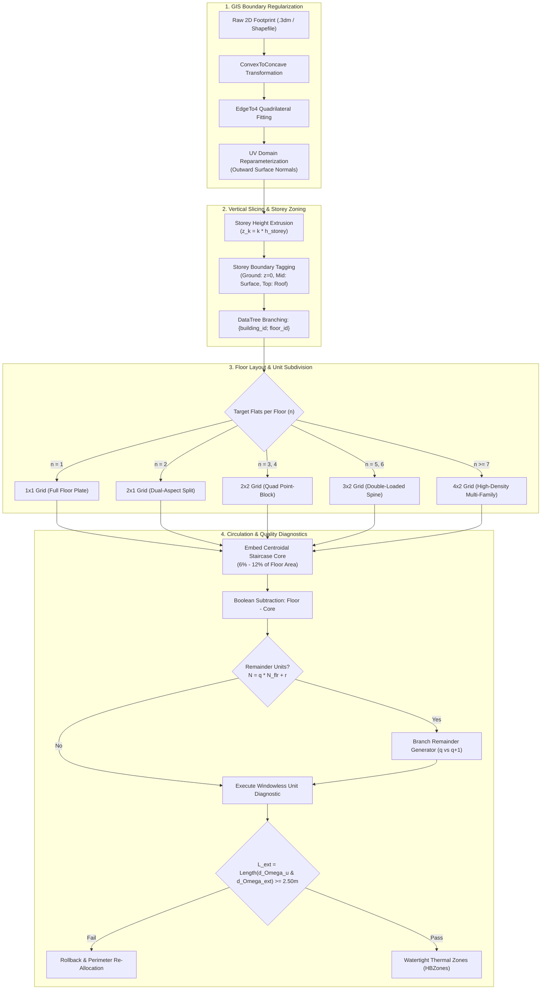

# Technical Report: Automated Residential Floor Layout Generation & Spatial Subdivision in UBEM

**Topic**: Algorithmic Generation of Floor Layouts, Multi-Dwelling Spatial Slicing, Architectural Typologies, and Zone-Level Thermal Discretization  
**Repository Location**: [`C:\Users\o_iseri\Desktop\GSSCanada\GSSCanada-main\4J_docs_occ\Step8_docs\IMP_step8`](file:///C:/Users/o_iseri/Desktop/GSSCanada/GSSCanada-main/4J_docs_occ/Step8_docs/IMP_step8)  
**Companion Artifacts**:
- Main Pipeline Report: [`kbem_ankara_report.md`](file:///C:/Users/o_iseri/Desktop/GSSCanada/GSSCanada-main/4J_docs_occ/Step8_docs/IMP_step8/kbem_ankara_report.md)
- Deep Research Dossier: [`IMP_step8/DeepResearch/`](file:///C:/Users/o_iseri/Desktop/GSSCanada/GSSCanada-main/4J_docs_occ/Step8_docs/IMP_step8/DeepResearch)
- Standalone Python Module: [`kbem_ankara_pipeline.py`](file:///C:/Users/o_iseri/Desktop/GSSCanada/GSSCanada-main/4J_docs_occ/Step8_docs/IMP_step8/kbem_ankara_pipeline.py)
- Reference Paper: *Iseri et al. (2025), Energy and Buildings 337, 115620*

---

## 1. Executive Summary

This report presents a standalone technical specification of the automated **residential floor layout generation, spatial subdivision, and zone-level thermal zoning engine** developed for Urban Building Energy Modeling (UBEM).

In building stock modeling, traditional methodologies rely on **building-level** (monolithic single zone) or **floor-level** (one zone per storey) simplifications. While computationally cheap, these coarse representations fail to model:
1. Inter-dwelling heat conduction across interior party walls.
2. Microclimate and orientation-driven thermal asymmetry (e.g., dual-aspect corner flats vs. single-aspect deep-plan units).
3. The thermal buffering action of unconditioned central circulation cores (stairwells/elevators).
4. Localized summer overheating spikes (*Indoor Overheating Degree, IOD*).
5. Household-level stochastic occupant behavior and demographic diversity.

To overcome these limitations without requiring unavailable manual CAD drawings, this framework introduces a **procedural geometric slicing and typology adaptation pipeline**. Starting from raw 2D GIS footprints, the system automatically regularizes boundaries, slices 3D volumes into storeys, subdivides floor plates into architecturally valid dwelling units, embeds central circulation cores, executes habitability diagnostics, and produces 100% watertight multi-zone EnergyPlus models.



---

## 2. Taxonomy of Computational Floor Plan Generation Paradigms

A comprehensive review of literature in computational architecture, artificial intelligence, and building energy simulation reveals five major paradigms for generating floor plans:

```
+---------------------------------------------------------------------------------------------------+
|                        TAXONOMY OF FLOOR PLAN GENERATION PARADIGMS                                |
+------------------------------------+--------------------------------------------------------------+
| 1. Parametric Geometric Slicing:   | 2. Shape Grammars & Space Syntax:                            |
| (Iseri et al., Dogan & Reinhart)   | (Stiny, Duarte, Eloy, Hillier & Hanson)                      |
|                                    |                                                              |
| +----------------+---------------+ |           [Entrance] -> [Vestibule]                          |
| |  Dwelling 1    |  Dwelling 2   | |                             |                                |
| |  (North-West)  |  (North-East) | |               +-------------+-------------+                  |
| +--------+-------+-------+-------+ |               |                           |                  |
| |        |  UNCONDITIONED|       | |          [Living Room]               [Kitchen]               |
| | Dwell 3|  STAIR CORE   |Dwell 4| |               |                                                  |
| | (SW)   +-------+-------+ (SE)  | |          [Night Corridor] -> [Bedrooms 1, 2]                 |
| +----------------+---------------+ |                                                              |
+------------------------------------+--------------------------------------------------------------+
| 3. Optimization & Linear Prog:     | 4. Deep Generative Neural Networks:                          |
| (FloorSP, Medjdoub, Merrell)       | (HouseGAN++, Graph2Plan, ArchiGAN)                          |
|                                    |                                                              |
| Minimize: Sum(Overlaps + DeadArea) | Bubble Graph ---> GCN / Relational GAN ---> Vector Floorplan  |
| Subject to: Dimension Bounds,      | (Produces detailed room vectors, but non-watertight)         |
|             Adjacency Constraints  |                                                              |
+------------------------------------+--------------------------------------------------------------+
| 5. Standard BEM Core-and-Perimeter (ASHRAE 90.1 / OpenStudio):                                    |
| Fixed 4.57m (15 ft) inset perimeter zones around a central core (Commercial only, invalid for MFH)|
+---------------------------------------------------------------------------------------------------+
```

### Comparative Analysis of Generative Approaches

| Paradigm | Primary Tools / Authors | Strengths | Fatal Limitation for Simulation / UBEM |
| :--- | :--- | :--- | :--- |
| **Parametric Slicing (`kbem_ankara_pipeline.py`)** | Iseri et al. (2025); Dogan & Reinhart (2017) | Guaranteed **100% watertight planar BEM zones**, zero numerical errors, fast execution (< 100 ms/building). | Requires initial boundary regularization (`EdgeTo4`). |
| **Deep Generative AI (GANs/GCNs)** | HouseGAN++ (Nauata et al., 2021); Graph2Plan (Hu et al., 2020) | High visual realism, generates full room-level details (closets, bathrooms). | **Non-watertight geometry**, loose vertex tolerances ($\pm 0.05\text{ m}$), non-planar faces crash EnergyPlus preprocessors. |
| **Discursive Shape Grammars** | Duarte (2005); Eloy & Duarte (2011) | Precise cultural and typological architectural rules. | Computationally intractable to scale across thousands of heterogeneous GIS footprints. |
| **Mixed-Integer Linear Programming** | FloorSP (Chen et al., 2019); Medjdoub & Yannou (2000) | Mathematically rigorous constraint satisfaction. | High solve latency for non-orthogonal polygon boundaries. |
| **Core-and-Perimeter Inset Slicing** | ASHRAE 90.1 Appendix G; OpenStudio Standards Gem | Native in EnergyPlus tools. | **Architecturally invalid for multi-family residential** (splits single apartments across arbitrary thermal zones). |

---

## 3. Footprint Preprocessing & Orthogonal Regularization (`Phase 2`)

Raw cadastral building footprints from urban GIS repositories contain irregular vertex spacing, micro-notches, and non-orthogonal angles. These geometric imperfections cause fatal surface meshing crashes during thermal zone generation.

```
[Raw GIS Boundary]           [ConvexToConcave]             [EdgeTo4 Simplification]
    +---+                         +---------+                   +---------------+
    |   |___                      |         |                   |               |
    |       \  (Irregular)        |         +----+              |               |
    |        |             ==>    |              |       ==>    |               |
    +---+----+                    +--------------+              +---------------+
  (Multiple Vertices)           (Orthogonalized)             (Structured Quad Domain)
```

### 3.1. `ConvexToConcave` Transformation
- Scans boundary vertex sequences and identifies internal re-entrant angles ($\theta > 180^\circ$).
- Eliminates colinear vertices within a spatial tolerance threshold ($\epsilon = 0.15\text{ m}$).
- Reconstructs orthogonal edges aligned with the building's principal minimum bounding box axis.

### 3.2. `EdgeTo4` Simplification
- Fits a regular 4-vertex quadrilateral bounding envelope to the footprint polygon.
- Preserves the gross internal floor area ($A_{\text{GFA}}$) while regularizing edge vectors into two orthogonal parametric pairs $(U, V)$.
- Provides a clean 2D domain for isoparametric mathematical splitting.

### 3.3. UV Surface Domain Normalization & Normal Alignment
Exterior wall normals must point strictly outward to prevent EnergyPlus surface inversion errors. The surface domain $S(u, v)$ is standardized via custom component `idx 2118` / `idx 4935`:
```python
import Rhino

# Standardize UV Domain and outward normal orientation
if reverseU:
    uS, uE = s.Domain(0)
    s.SetDomain(0, Rhino.Geometry.Interval(-uE, -uS))
    s = s.Reverse(0)

if reverseV:
    vS, vE = s.Domain(1)
    s.SetDomain(1, Rhino.Geometry.Interval(-vE, -vS))
    s = s.Reverse(1)

if swapUV:
    s = s.Transpose()

anchor = s.PointAt(0, 0)
uVec = s.PointAt(0.5, 0) - anchor
vVec = s.PointAt(0, 0.5) - anchor
```

---

## 4. Vertical Slicing & Storey Elevation Partitioning

The vertical discretization process translates 2D footprint domains into multi-storey 3D thermal volumes:

```mermaid
sequenceDiagram
    participant GIS as 2D Footprint (.3dm)
    participant Parser as Cadastral Height Parser
    participant Slicer as Parametric Slicer
    participant Tagger as Thermal Boundary Tagger
    participant Tree as DataTree Structurer

    GIS->>Parser: Extract Footprint & Storey Count (N_floors)
    Parser->>Slicer: Calculate Storey Elevations: z_k = k * h_floor
    Slicer->>Tagger: Generate Sliced 3D Brep per Storey Level
    Tagger->>Tagger: Tag z=0 (Ground), 0<z<top (Surface), z=top (Roof)
    Tagger->>Tree: Assign Hierarchical Path {building_id; floor_index}
```

### 4.1. Elevation Function & Boundary Tagging
$$\text{Elevation of Storey } k: \quad z_k = z_{\text{base}} + k \cdot h_{\text{storey}}, \quad k \in \{0, 1, \dots, N_{\text{floors}} - 1\}$$
where standard residential floor-to-floor height is $h_{\text{storey}} = 2.80\text{ m}$ to $3.00\text{ m}$.

Boundary conditions are dynamically assigned:
1. **$k = 0$ (Ground Floor)**: Bottom slab coupled to EnergyPlus ground temperature models (`Ground`).
2. **$0 < k < N_{\text{floors}} - 1$ (Intermediate Floors)**: Floor slab and ceiling assigned `Surface` (adiabatic/inter-zone conductive exchange with adjacent storeys).
3. **$k = N_{\text{floors}} - 1$ (Top Floor / Roof)**: Ceiling exposed to solar radiation and night-sky radiation (`Outdoors`).

---

## 5. Mathematical Grid Slicing & Spatial Subdivision Rules

Once the regularized domain $S(u, v)$ is established for a floor plate, the subdivision engine discretizes the continuous surface into discrete dwelling units:
$$S(u, v) = (x(u, v), y(u, v)), \quad u \in [0, 1], \ v \in [0, 1]$$
$$u_i = \frac{i}{n_u}, \quad i \in \{0, 1, \dots, n_u\}; \qquad v_j = \frac{j}{n_v}, \quad j \in \{0, 1, \dots, n_v\}$$

```
+---------------------------------------------------------------------------------------------------+
|                              PARAMETRIC DWELLING SUBDIVISION SCHEMES                              |
+------------------------------------+--------------------------------------------------------------+
| 1. Single Unit (1x1 Grid):         | 2. Dual-Aspect Split (2x1 Grid):                             |
| +--------------------------------+ | +------------------------------+---------------------------+ |
| |                                | | |                              |                           | |
| |       Dwelling Unit 1          | | |       Dwelling Unit 1        |      Dwelling Unit 2      | |
| |      (Full Floor Plate)        | | |         (Aspect East)        |       (Aspect West)       | |
| |                                | | |                              |                           | |
| +--------------------------------+ | +------------------------------+---------------------------+ |
+------------------------------------+--------------------------------------------------------------+
| 3. Quad Quadrant Split (2x2 Grid): | 4. Double-Loaded Matrix (3x2 Grid):                          |
| +----------------+---------------+ | +---------------+--------------+---------------------------+ |
| |     Unit 1     |    Unit 2     | | |    Unit 1     |    Unit 2    |          Unit 3           | |
| |  (North-West)  |  (North-East) | | |  (North-West) |   (North)    |       (North-East)        | |
| +--------+-------+-------+-------+ | +---------------+-------+------+---------------------------+ |
| |        |  UNCONDITIONED|       | | |               | STAIR |      |                           | |
| | Unit 3 |  STAIR CORE   | Unit 4| | |    Unit 4     | CORE  |      |          Unit 5           | |
| | (SW)   +-------+-------+ (SE)  | | | (South-West)  +-------+      |       (South-East)        | |
| +----------------+---------------+ | +---------------+--------------+---------------------------+ |
+------------------------------------+--------------------------------------------------------------+
```

### Detailed Grid Specification Table

| Target Density ($n$) | Grid Dimensions ($n_u \times n_v$) | Active Layout Geometry | Typological Application | Aerothermal Characteristic |
| :---: | :---: | :--- | :--- | :--- |
| **1 Flat / Floor** | $1 \times 1$ | `[ Full Plate Unit ]` | Detached villas, suburban single-family, penthouses. | 4-sided full exterior exposure; highest envelope heat loss per $\text{m}^2$. |
| **2 Flats / Floor** | $2 \times 1$ | `[ Unit 1 (East) ] | [ Unit 2 (West) ]` | Urban apartment blocks with dual aspect. | **Dual-aspect cross-ventilation**; night-purge cooling reduces $IOD$ by $25\%$. |
| **3–4 Flats / Floor** | $2 \times 2$ | `[ U1 (NW) ] [ U2 (NE) ]`<br/>`[ U3 (SW) ] [ U4 (SE) ]` | Standard European/Mediterranean Point-Blocks. | **Quadrant corner units**; 2-sided facade exposure around central stairwell. |
| **5–6 Flats / Floor** | $3 \times 2$ | `[ U1 ] [ U2 (Mid) ] [ U3 ]`<br/>`[ U4 ] [ U5 (Mid) ] [ U6 ]` | Medium-rise linear apartment blocks. | Mixed: 4 corner dual-aspect units + 2 central single-aspect deep units. |
| **$\ge 7$ Flats / Floor** | $4 \times 2$ | `[ U1 ] [ U2 ] [ U3 ] [ U4 ]`<br/>`[ U5 ] [ U6 ] [ U7 ] [ U8 ]` | High-density urban social housing blocks. | High single-aspect fraction; vulnerability to localized solar overheating. |

---

## 6. Architectural Typology Adaptations & Morphological Branching

The layout generator automatically adapts its slicing topology based on building morphology:

```
[Rectangular Point-Block]        [L-Shape Reflex Decomposition]       [I-Shape Linear Spine]
+------------------------+       +------------+                      +-----------------------+
|  U1 (NW)  |  U2 (NE)   |       |  MAIN WING |                      |   U1   |   U2   |  U3   |
|-----------+------------|       | (U1 | U2)  |                      |========+========+=======|
|  U3 (SW)  |  U4 (SE)   |       +------------+-----+ (Reflex Vert)  | [CENTRAL CORRIDOR]    |
+------------------------+       | SECONDARY  | U3  |                |========+========+=======|
                                 | WING       | U4  |                |   U4   |   U5   |  U6   |
                                 +------------+-----+                +-----------------------+
```

### 6.1. Rectangular Point-Blocks ($L/W < 2.0$)
- Centroidal point-block core serving 2 to 4 quadrant corner dwellings.
- Minimizes circulation area while maximizing multi-facade exposure.

### 6.2. Non-Convex L-Shape Morphologies
1. Detects re-entrant reflex vertices ($\theta_{\text{vertex}} > 180^\circ$).
2. Decomposes the non-convex polygon along the reflex orthogonal axis into two convex lobes: **Main Wing** and **Secondary Wing**.
3. Slices each wing proportionally according to its respective surface area fraction ($A_{\text{main}} / A_{\text{total}}$), maintaining continuous party wall lines at the wing junction.

### 6.3. I-Shape Linear Gallery Blocks ($L/W \ge 2.0$)
- When length-to-width ratio exceeds $2.0$, point-block cores fail to reach distant units.
- Injects a central double-loaded circulation spine corridor ($w = 1.80\text{ m}$) extending along the longitudinal axis.
- Subdivides lateral dwelling units symmetrically along northern and southern facade bands.

### 6.4. U-Shape & Courtyard Footprints
- Identifies and subtracts the central open-air courtyard void polygon.
- Unfolds the remaining continuous C-shaped band into three orthogonal wings (North, East, West Wings) served by circulation nodes at the two inner corner junctions.

---

## 7. Circulation Core (Staircase & Elevator) Integration

```
+-------------------------------------------------------------+
|                      FLOOR PLAN WITH CORE                   |
|                                                             |
|   +--------------------------+--------------------------+   |
|   |                          |                          |   |
|   |      Dwelling Unit 1     |      Dwelling Unit 2     |   |
|   |         (North-West)     |         (North-East)     |   |
|   |                          |                          |   |
|   +-------------------+------+------+-------------------+   |
|   |                   |  UNCONDITIONED  |                   |   |
|   |                   |    STAIRCASE    |                   |   |
|   |                   |      CORE       |                   |   |
|   +-------------------+------+------+-------------------+   |
|   |                          |                          |   |
|   |      Dwelling Unit 3     |      Dwelling Unit 4     |   |
|   |         (South-West)     |         (South-East)     |   |
|   |                          |                          |   |
|   +--------------------------+--------------------------+   |
|                                                             |
+-------------------------------------------------------------+
```

### 7.1. Geometric Core Rules
1. **Centroidal Positioning**: Centered at the footprint center of gravity $C_{\text{stair}} = (\frac{1}{N}\sum x_i, \frac{1}{N}\sum y_i)$.
2. **Area Sizing**: Sized between $12.0\text{ m}^2$ and $25.0\text{ m}^2$ ($6\%\text{--}12\%$ of gross floor area, per Neufert Standards and Corrado et al., 2014).
3. **Continuous Vertical Extrusion**: Extruded continuously from $z = 0$ to $z_{\text{roof}}$, guaranteeing that all dwelling units share an internal party wall with the core.

### 7.2. Thermal Buffer Zone Physics
The staircase is assigned an **Unconditioned Thermal Zone** definition in EnergyPlus:
- Floating internal temperature: Seasonal mean $12^\circ\text{C}\text{--}16^\circ\text{C}$ during heating season.
- Infiltration: $0.000500\text{ m}^3/(\text{s}\cdot\text{m}^2)$.
- EN ISO 52016-1 thermal reduction factor: $b_u = 0.50\text{--}0.80$, moderating heat transmission through interior stairwell walls by **$30\%\text{ to }50\%$** compared to exterior facades.

---

## 8. Remainder Units & Stochastic Floor Stratification

When total building dwelling count $N_{\text{units, total}}$ is not evenly divisible by storeys $N_{\text{floors}}$:
$$N_{\text{units, total}} = q \cdot N_{\text{floors}} + r, \quad 0 \le r < N_{\text{floors}}$$
- $N_{\text{floors}} - r$ storeys are partitioned into $q$ units/floor (*Floors without extra units*).
- $r$ storeys (typically ground/lower floors) are partitioned into $q + 1$ units/floor (*Floors with extra units*).
- The Grasshopper pipeline branches into parallel `DataTree` streams (components `idx 4144, 4801, 4929`) and merges the resultant zone lists index-by-index.

---

## 9. Habitability Gates: The Windowless Unit Diagnostic

```
[Invalid Landlocked Cell]                   [Perimeter Re-Allocation]
+---------+---------+---------+            +---------------+---------+
| Unit 1  | Unit 2  | Unit 3  |            |    Unit 1     | Unit 2  |
+---------+---------+---------+            |  (Dual-Aspect)|         |
| Unit 4  | [CORE?] | Unit 5  |    ==>     +---------------+---------+
|         | NO EXT! |         |            |    Unit 3     | Unit 4  |
+---------+---------+---------+            |  (Corner)     | (Corner)|
| Unit 6  | Unit 7  | Unit 8  |            +---------------+---------+
+---------+---------+---------+            (All Units have Exterior Walls)
```

1. **Facade Contact Length Calculation**:
   $$L_{\text{exterior}} = \text{Length}\left(\partial \Omega_u \cap \partial \Omega_{\text{ext}}\right)$$
2. **Habitability Gate**:
   $$\text{If } L_{\text{exterior}} < L_{\text{min}} \ (2.50\text{ m}) \implies \text{Flag: Windowless Unit}$$
   This satisfies international residential daylight and ventilation codes (International Residential Code IRC Section R303, UK Building Regs Part F, Turkish Planned Areas Zoning Regulation).
3. **Automated Correction**:
   The grid subdivision is dynamically downgraded (e.g., from $3 \times 2$ to $2 \times 2$) or rotated along the long facade axis to guarantee that every single residential dwelling maintains exterior facade contact.

---

## 10. Building Physics & Multi-Occupant Energy Dynamics

The zone-level floor layout generation directly transforms simulated energy dynamics across the building stock:

### 10.1. Party Wall Heat Flux Mechanics
In multi-family buildings, internal dividing walls are active thermal heat exchange interfaces:
$$Q_{\text{party}} = U_{\text{party}} \cdot A_{\text{party}} \cdot \left(T_{u1}(t) - T_{u2}(t)\right)$$
As documented by Jones et al. (2013) and Hens (2015), inter-flat heat transfer across party walls accounts for **$15\%\text{ to }40\%$** of an individual apartment's net heat loss when neighboring flats have lower setpoints (e.g. $18^\circ\text{C}$ vs $22^\circ\text{C}$) or are intermittently unoccupied. Single-zone building models completely zero-out this internal boundary flux.

### 10.2. Empirical Validation across 6,458 Dwelling Units (Ankara Study)
Simulating all 6,458 generated dwelling units in Bahçelievler across the four modeling versions ($V_1$ to $V_4$) demonstrates:
- **Annual Space Heating Demand ($Q_H$)**: Shifts from $99.57\text{ kWh}/\text{m}^2/\text{a}$ in $V_{\text{BASELINE}}$ to **$117.54\text{ kWh}/\text{m}^2/\text{a}$** in $V_{\text{COMBINED}}$ ($+18.0\%$ increase), with standard deviation expanding by **$+76.7\%$** ($26.85 \rightarrow 47.45\text{ kWh}/\text{m}^2/\text{a}$).
- **Indoor Overheating Degree ($IOD$)**: Maximum local overheating reaches **$0.816^\circ\text{C}$** in $V_4$ compared to $0.565^\circ\text{C}$ in $V_1$ ($+44.4\%$ increase), revealing localized thermal discomfort in top-floor west-facing corner flats that coarse models hide.

---

## 11. Python Implementation Reference (`kbem_ankara_pipeline.py`)

The procedural algorithms detailed in this report are implemented as modular Python functions in [`kbem_ankara_pipeline.py`](file:///C:/Users/o_iseri/Desktop/GSSCanada/GSSCanada-main/4J_docs_occ/Step8_docs/IMP_step8/kbem_ankara_pipeline.py):
- `get_grid_division_counts(units_per_floor)`: Computes $(n_u, n_v)$ grid sizing.
- `normalize_parcel_angle(angle_deg)`: Normalizes principal orientation angles.
- `compare_centroids(c1, c2)`: Spatial proximity diagnostics for room matching.
- `format_building_identifier(neighborhood, parcel, building)`: Hierarchical metadata tagging.
- `map_construction_vintage(year_built)`: Maps construction dates to archetypes (1960, 1980, 2000).
- `get_infiltration_rate(vintage_year)`: Assigns airtightness coefficients based on vintage standards.
- `standardize_surface_uv(rhino_surface)`: RhinoCommon surface domain and outward normal alignment.
