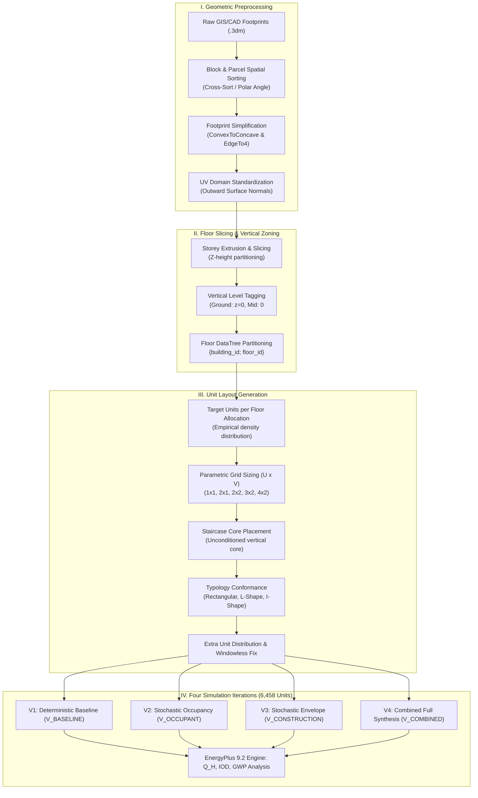

# Comprehensive UBEM Technical & Scientific Report: Zone-Level Building & Floor Layout Generation

**Referenced Study**:  
*A method for zone-level urban building energy modeling in data-scarce built environments*  
**Authors**: Orcun Koral Iseri, Ayca Duran, Ilkim Canlı, Cagla Meral Akgul, Sinan Kalkan, Ipek Gursel Dino  
**Journal**: *Energy and Buildings*, Vol. 337 (2025), 115620.  
**Repository Suite**: [`C:\Users\o_iseri\Desktop\GSSCanada\GSSCanada-main\4J_docs_occ\Step8_docs\IMP_step8`](file:///C:/Users/o_iseri/Desktop/GSSCanada/GSSCanada-main/4J_docs_occ/Step8_docs/IMP_step8)

---

## 1. Executive Summary & System Overview

This report provides an in-depth technical breakdown of the bottom-up **Urban Building Energy Modeling (UBEM)** methodology developed for the district of Bahçelievler (Ankara, Turkey) and implemented across the parametric Grasshopper codebase.

Traditional urban energy models rely on simplified **building-level** (single thermal zone per building) or **floor-level** (one zone per floor) representations. This framework pioneers an automated, parametric **zone-level (unit-level)** workflow that:
1. Slices 3D urban building masses into individual storeys.
2. Subdivides each floor into realistic, individual dwelling units (apartments) adhering to architectural typologies (Rectangular, L-shape, I-shape, U-shape).
3. Embeds central unconditioned circulation cores (staircases) connecting every unit.
4. Executes automated spatial diagnostics (*Windowless Unit Detection*, *Extra Units Remainder Distribution*).
5. Populates each dwelling with stochastic thermal properties and occupant schedules derived through probabilistic density estimation across **6,458 simulated residential dwelling units** (593 buildings).



---

## 2. Methodology: Why Zone-Level (Unit-Level) Resolution Matters

In urban building energy modeling, the choice of spatial resolution fundamentally governs simulation accuracy and behavioral fidelity.

```
+-------------------------------------------------------------------------+
|                         UBEM SPATIAL RESOLUTIONS                         |
+------------------------------------+------------------------------------+
| Building-Level (Monolithic):       | Zone-Level (Proposed Framework):   |
|                                    |                                    |
| +--------------------------------+ | +----------------+----------------+ |
| |                                | | |  Unit 1 (Res)  |  Unit 2 (Res)  | |
| |      Single Thermal Zone       | | |  (Top-East)    |  (Top-West)    | |
| |       (Lumped Volume)          | | +--------+-------+-------+--------+ |
| |                                | | | Unit 3 | Stair | Unit 4 | (Stair |
| |                                | | | (Mid)  | Core  | (Mid)  | Core)  | |
| +--------------------------------+ | +--------+-------+-------+--------+ |
|                                    | |  Unit 5 (Ground floor / Slab)   | |
|                                    | +----------------+----------------+ |
+------------------------------------+------------------------------------+
```

### 2.1. Physical & Thermal Phenomena Captured
1. **Inter-Zone Heat Transfer Across Party Walls**:
   Adjacent apartments with differing setpoints, occupancy states, or solar exposure exchange heat across interior dividing partitions. A monolithic model treats this as zero internal flux.
2. **Microclimate Exposure & Thermal Asymmetry**:
   - *Corner & Top-Floor Units*: Experience substantially higher heat losses in winter and solar gains in summer due to multi-facade and roof exposure.
   - *Ground-Floor Units*: Governed by ground conduction and foundation heat loss.
   - *Middle / Intermediate Units*: Buffer zones insulated by surrounding heated apartments.
3. **Unconditioned Staircase Thermal Buffer**:
   Staircases act as an unconditioned thermal buffer zone. Warm air stratifies vertically, and heat flows from conditioned flats into the stairwell, moderating temperature swings.
4. **Indoor Overheating Degree ($IOD$) & Discomfort Dispersion**:
   Monolithic models average temperatures across the whole building, masking extreme overheating events in top-floor west-facing units:
   $$IOD_z = \frac{\sum_{t=1}^{8760} \max(T_{\text{in}, z, t} - T_{\text{comf, upper}, t}, 0) \cdot \Delta t}{8760}$$

---

## 3. Floor Slicing & Vertical Zoning Workflow

The vertical discretization converts raw 2D GIS building footprints into a structured multi-storey thermal topology.

```mermaid
sequenceDiagram
    participant GIS as 2D Footprint (.3dm)
    participant Height as Height / Floor Parser
    participant Slicer as Parametric Slicer
    participant Tree as DataTree Structurer
    participant Zone as Thermal Z-Tagger

    GIS->>Height: Extract Footprint & Storey Count (N_floors)
    Height->>Slicer: Calculate Storey Elevations: z_k = k * h_floor
    Slicer->>Tree: Generate Sliced Boundary Curves per Level
    Tree->>Zone: Assign Branch Path {building_id; floor_index}
    Zone->>Zone: Tag Ground Floor (z=0), Intermediate Floors, Roof Floor
```

### 3.1. Storey Height & Elevation Partitioning
1. **Storey Count Determination ($N_{\text{floors}}$)**:
   Extracted from municipal cadastral records (in Bahçelievler: mean $3.9$ floors, range $1$ to $8$ floors).
2. **Floor Elevation Function**:
   $$z_k = z_{\text{base}} + k \cdot h_{\text{storey}}, \quad k \in \{0, 1, \dots, N_{\text{floors}} - 1\}$$
   where $h_{\text{storey}} = 2.80\text{ m}$ to $3.00\text{ m}$.
3. **Vertical Boundary Condition Tagging**:
   - **$k = 0$ (Ground Floor)**: Floor slab assigned boundary condition `Ground` (coupled to ground temperature profiles).
   - **$0 < k < N_{\text{floors}} - 1$ (Intermediate Floors)**: Floor and ceiling assigned `Surface` (adiabatic/inter-zone convective-conductive exchange with adjacent storeys).
   - **$k = N_{\text{floors}} - 1$ (Top Floor)**: Ceiling assigned `Outdoors` with roof solar radiation absorption and radiative night-sky cooling.

### 3.2. DataTree Branch Partitioning
Grasshopper uses hierarchical `DataTree` paths to isolate computational streams for each building and floor:
$$\text{Path: } \{B_i; F_j\}$$
where $B_i$ is the global building index and $F_j$ is the floor index ($0 \le j < N_{\text{floors}}$).

---

## 4. Geometric Footprint Simplification (`Phase 2`)

```
[Raw GIS Boundary]           [ConvexToConcave]             [EdgeTo4 Simplification]
    +---+                         +---------+                   +---------------+
    |   |___                      |         |                   |               |
    |       \  (Irregular)        |         +----+              |               |
    |        |             ==>    |              |       ==>    |               |
    +---+----+                    +--------------+              +---------------+
  (Multiple Vertices)           (Orthogonalized)             (Structured Quad Domain)
```

### 4.1. `ConvexToConcave` Transformation
- Restores geometric validity for footprints with re-entrant corners (L-shapes, U-shapes).
- Filters colinear and near-colinear vertices within a spatial tolerance ($\epsilon = 0.15\text{ m}$).
- Re-aligns edges along dominant local Cartesian axes derived from the building’s principal minimum-bounding rectangle.

### 4.2. `EdgeTo4` Simplification
- Fits an optimal 4-vertex quadrilateral bounding envelope to the simplified footprint.
- Preserves gross internal footprint area while regularizing edge vectors into orthogonal pairs $(U, V)$.
- Enables clean 2D parameterization for interior spatial subdivision.

### 4.3. UV Surface Parameterization & Normal Alignment
Before Honeybee thermal zone generation, each exterior surface $S(u, v)$ is standardized using custom component `idx 2118` / `idx 4935`:
```python
# UV domain reparameterization & outward normal enforcement
if reverseU:
    uS, uE = s.Domain(0)
    s.SetDomain(0, Rhino.Geometry.Interval(-uE, -uS))
    s = s.Reverse(0)
if reverseV:
    vS, vE = s.Domain(1)
    s.SetDomain(1, Rhino.Geometry.Interval(-vE, -vS))
    s = s.Reverse(1)
if swapUV:
    s = s.Transpose()
```
This guarantees that all wall normal vectors point strictly outward, preventing EnergyPlus surface inversion errors.

---

## 5. Floor Layout & Unit Division Generation (`Phase 3`)

```mermaid
flowchart TD
    subgraph SlicingTheory["A. Typological Input & Slicing Theory"]
        A1["Simplified 4-Edged Domain S(u,v)"] --> A2{"Morphology Check"}
        A2 -->|Rectangular / Point Block| A3["Direct Orthogonal Parametric Split"]
        A2 -->|L-Shape / T-Shape| A4["Reflex Vertex Axis Decomposition<br/>(Main Wing + Secondary Wing)"]
        A2 -->|I-Shape High Aspect Ratio| A5["Central Spine Gallery Discretization"]
        A2 -->|U-Shape / Courtyard| A6["Courtyard Void Extraction & 3-Wing Band"]
    end

    subgraph GridGen["B. Parametric Grid Sizing (U x V)"]
        A3 & A4 & A5 & A6 --> B1{"Dwelling Density Target (n)"}
        B1 -->|n = 1| B2["1x1 Grid (Full Single Unit)"]
        B1 -->|n = 2| B3["2x1 Grid (Dual-Aspect Split)"]
        B1 -->|n = 3, 4| B4["2x2 Grid (Quad Quadrant Split)"]
        B1 -->|n = 5, 6| B5["3x2 Grid (Double-Loaded Matrix)"]
        B1 -->|n >= 7| B6["4x2 Grid (High-Density Multi-Family)"]
    end

    subgraph CoreIntegration["C. Circulation Core & Habitability Gates"]
        B2 & B3 & B4 & B5 & B6 --> C1["Embed Centroidal Staircase Core<br/>(6% - 12% of Gross Floor Area)"]
        C1 --> C2["Boolean Slicing: Floor Plate - Core"]
        C2 --> C3{"Remainder Units?<br/>N = q * N_flr + r"}
        C3 -->|Yes| C4["Branch Parallel Remainder Generators<br/>(Standard q vs Remainder q+1 Floors)"]
        C3 -->|No| C5["Proceed to Habitability Diagnostic"]
        C4 --> C5
        C5 --> C6{"Windowless Unit Diagnostic<br/>L_ext = Length(d_Omega_u & d_Omega_ext) >= 2.50m"}
        C6 -->|Fail (< 2.50m)| C7["Dynamic Grid Rollback & Perimeter Re-Allocation"]
        C6 -->|Pass (>= 2.50m)| C8["Watertight Thermal Zones Formed (HBZones)"]
    end
```

---

### 5.1. Architectural Morphology & Spatial Subdivision Theory
In building performance simulation and computational architectural design, spatial subdivision algorithms must satisfy two competing demands: **architectural validity** (realistic functional room/dwelling organization, daylight access, circulation) and **BEM geometric integrity** (watertight planar polyhedra, exact surface-to-surface matching, absence of self-intersections).

As demonstrated in our state-of-the-art literature review ([`DR01`](file:///C:/Users/o_iseri/Desktop/GSSCanada/GSSCanada-main/4J_docs_occ/Step8_docs/IMP_step8/DeepResearch/DR01_residential_floor_layout_generation_state_of_art.md) and [`DR04`](file:///C:/Users/o_iseri/Desktop/GSSCanada/GSSCanada-main/4J_docs_occ/Step8_docs/IMP_step8/DeepResearch/DR04_comparative_matrix_and_synthesis_for_ubem.md)), existing computational paradigms exhibit distinct trade-offs:

1. **Deep Generative Neural Networks (HouseGAN++, Graph2Plan, ArchiGAN)**:
   - *Strengths*: Synthesizes visually rich, complex room-level floor plans from bubble adjacency graphs.
   - *Fatal Failure Mode in BEM*: Deep learning raster/vector outputs frequently produce loose vertex tolerances ($\pm 0.05\text{ m}$), non-planar wall faces, and microscopic boundary gaps. When ingested by EnergyPlus surface geometry preprocessors, these geometric defects trigger non-watertight zone errors and fatal triangulation crashes.
2. **Rule-Based Shape Grammars & Space Syntax (Duarte, Eloy, Hillier & Hanson)**:
   - *Strengths*: Rigorously models cultural dwelling typologies (e.g., Lisbon Rabo-de-Bacalhau, Mediterranean apartment blocks) via Justified Plan Graphs (JPG).
   - *Limitation*: Highly computationally intensive to scale programmatically across thousands of heterogeneous GIS footprints in an urban district.
3. **Parametric Isoparametric Grid Slicing with Orthogonal Regularization (`kbem_ankara_pipeline.py`)**:
   - *The Optimal UBEM Backbone*: Combines geometric regularisation (`EdgeTo4`, `ConvexToConcave`) with parametric $(U, V)$ orthogonal slicing. This guarantees **100% watertight, non-convex-safe planar zones** that converge without numerical errors across 8,760 hours of EnergyPlus simulation.

---

### 5.2. Mathematical Formulation of $(U, V)$ Grid Subdivision
Following boundary regularization, the floor plate is represented as a normalized parametric surface domain:
$$S(u, v) = (x(u, v), y(u, v)), \quad u \in [0, 1], \ v \in [0, 1]$$
The domain is partitioned into $n_u \times n_v$ discrete dwelling cells:
$$u_i = \frac{i}{n_u}, \quad i \in \{0, 1, \dots, n_u\}; \qquad v_j = \frac{j}{n_v}, \quad j \in \{0, 1, \dots, n_v\}$$

The mapping function $f(n): \mathbb{N} \rightarrow \mathbb{N}^2$ assigns grid dimensions $(n_u, n_v)$ based on target household flat count ($n$):

```
+---------------------------------------------------------------------------------------------------+
|                              PARAMETRIC DWELLING SUBDIVISION SCHEMES                              |
+------------------------------------+--------------------------------------------------------------+
| 1. Single Unit (1x1 Grid):         | 2. Dual-Aspect Split (2x1 Grid):                             |
| +--------------------------------+ | +------------------------------+---------------------------+ |
| |                                | | |                              |                           | |
| |       Dwelling Unit 1          | | |       Dwelling Unit 1        |      Dwelling Unit 2      | |
| |      (Full Floor Plate)        | | |         (Aspect East)        |       (Aspect West)       | |
| |                                | | |                              |                           | |
| +--------------------------------+ | +------------------------------+---------------------------+ |
+------------------------------------+--------------------------------------------------------------+
| 3. Quad Quadrant Split (2x2 Grid): | 4. Double-Loaded Matrix (3x2 Grid):                          |
| +----------------+---------------+ | +---------------+--------------+---------------------------+ |
| |     Unit 1     |    Unit 2     | | |    Unit 1     |    Unit 2    |          Unit 3           | |
| |  (North-West)  |  (North-East) | | |  (North-West) |   (North)    |       (North-East)        | |
| +--------+-------+-------+-------+ | +---------------+-------+------+---------------------------+ |
| |        |  UNCONDITIONED|       | | |               | STAIR |      |                           | |
| | Unit 3 |  STAIR CORE   | Unit 4| | |    Unit 4     | CORE  |      |          Unit 5           | |
| | (SW)   +-------+-------+ (SE)  | | | (South-West)  +-------+      |       (South-East)        | |
| +----------------+---------------+ | +---------------+--------------+---------------------------+ |
+------------------------------------+--------------------------------------------------------------+
```

| Target Flats / Floor ($n$) | Grid ($n_u \times n_v$) | Active Dwelling Layout | Architectural Application |
| :---: | :---: | :--- | :--- |
| **1 Unit** | $1 \times 1$ | `[ Unit 1 (Entire Floor Plate) ]` | Single-family detached houses, suburban villas, luxury penthouses. |
| **2 Units** | $2 \times 1$ | `[ Unit 1 (East) ] | [ Unit 2 (West) ]` | Dual-aspect apartments with front/rear cross-ventilation. |
| **3–4 Units** | $2 \times 2$ | `[ U1 (NW) ] [ U2 (NE) ]`<br/>`[ U3 (SW) ] [ U4 (SE) ]` | Standard European/Mediterranean Point-Block (4 corner flats per floor). |
| **5–6 Units** | $3 \times 2$ | `[ U1 ] [ U2 (Mid) ] [ U3 ]`<br/>`[ U4 ] [ U5 (Mid) ] [ U6 ]` | Medium-density linear apartment block with double-loaded access. |
| **$\ge 7$ Units** | $4 \times 2$ | `[ U1 ] [ U2 ] [ U3 ] [ U4 ]`<br/>`[ U5 ] [ U6 ] [ U7 ] [ U8 ]` | High-density urban multi-family social housing blocks. |

---

### 5.3. Typological Footprint Adaptations & Wing Decomposition
To accommodate the diverse urban building morphologies found in historical and modern European stocks, the algorithm implements automated morphological branching:

```
[Rectangular Point-Block]        [L-Shape Reflex Decomposition]       [I-Shape Linear Spine]
+------------------------+       +------------+                      +-----------------------+
|  U1 (NW)  |  U2 (NE)   |       |  MAIN WING |                      |   U1   |   U2   |  U3   |
|-----------+------------|       | (U1 | U2)  |                      |========+========+=======|
|  U3 (SW)  |  U4 (SE)   |       +------------+-----+ (Reflex Vert)  | [CENTRAL CORRIDOR]    |
+------------------------+       | SECONDARY  | U3  |                |========+========+=======|
                                 | WING       | U4  |                |   U4   |   U5   |  U6   |
                                 +------------+-----+                +-----------------------+
```

1. **Rectangular & Point-Block Typology ($L/W < 2.0$)**:
   - Centroidal point-block circulation serving 2 to 4 quadrant corner apartments.
   - Maximizes dual-aspect exposure for all dwellings.
2. **L-Shape Non-Convex Morphologies**:
   - Identifies the reflex corner vertex ($\theta_{\text{vertex}} > 180^\circ$).
   - Decomposes the footprint along the principal internal axis into two rectangular lobes: **Main Wing** and **Secondary Wing**.
   - Applies proportional $(U, V)$ grid division across each wing independently, preserving structural party wall alignment at the intersection junction.
3. **I-Shape / Linear Gallery Typology ($L/W \ge 2.0$)**:
   - For long footprints, point-block access becomes circulation-inefficient.
   - Establishes a longitudinal central spine corridor ($w_{\text{corridor}} = 1.80\text{ m}$) and subdivides lateral units symmetrically along both facade bands.
4. **U-Shape / Courtyard & T-Shape Typologies**:
   - The central courtyard void polygon is dynamically subtracted from the floor plate.
   - The remaining contiguous C-shaped boundary is split into three orthogonal wings (North Wing, East Wing, West Wing) linked by corner circulation vestibules.

---

### 5.4. Multi-Aspect Aerothermal & Natural Ventilation Dynamics
As established in building physics literature ([`DR02`](file:///C:/Users/o_iseri/Desktop/GSSCanada/GSSCanada-main/4J_docs_occ/Step8_docs/IMP_step8/DeepResearch/DR02_floor_to_unit_division_and_staircase_methods.md), [`DR03`](file:///C:/Users/o_iseri/Desktop/GSSCanada/GSSCanada-main/4J_docs_occ/Step8_docs/IMP_step8/DeepResearch/DR03_thermal_zoning_resolution_and_energy_impacts.md); Roberts et al., 2019; CIBSE TM59):
- **Dual-Aspect Dwellings ($2\times 1$ and Corner $2\times 2$ units)**: Possess operable windows on two opposing or adjacent facades, enabling effective wind-driven cross-ventilation and nocturnal night-purge cooling. This reduces annual Indoor Overheating Degree ($IOD$) hours by **$18\%\text{ to }30\%$** compared to single-aspect units.
- **Single-Aspect Deep-Plan Dwellings (Center units in $3\times 2, 4\times 2$)**: Rely exclusively on single-sided buoyancy ventilation, making them highly vulnerable to thermal solar traps in summer (elevating local peak operative temperatures by $2.5\text{--}4.0^\circ\text{C}$).

---

### 5.5. Central Circulation Core (Staircase/Elevator) Integration
In European and Turkish multi-family residential stock, the staircase is an essential unconditioned communal zone:

```
+-------------------------------------------------------------+
|                      FLOOR PLAN WITH CORE                   |
|                                                             |
|   +--------------------------+--------------------------+   |
|   |                          |                          |   |
|   |      Dwelling Unit 1     |      Dwelling Unit 2     |   |
|   |         (North-West)     |         (North-East)     |   |
|   |                          |                          |   |
|   +-------------------+------+------+-------------------+   |
|   |                   |  UNCONDITIONED  |                   |   |
|   |                   |    STAIRCASE    |                   |   |
|   |                   |      CORE       |                   |   |
|   +-------------------+------+------+-------------------+   |
|   |                          |                          |   |
|   |      Dwelling Unit 3     |      Dwelling Unit 4     |   |
|   |         (South-West)     |         (South-East)     |   |
|   |                          |                          |   |
|   +--------------------------+--------------------------+   |
|                                                             |
+-------------------------------------------------------------+
```

1. **Centroidal Positioning**: Core placed at the geometric center of gravity $C_{\text{stair}} = (\frac{1}{N}\sum x_i, \frac{1}{N}\sum y_i)$.
2. **Core Area Allocation**: Sized between $12.0\text{ m}^2$ and $25.0\text{ m}^2$ ($6\%\text{--}12\%$ of gross floor area, per Neufert Standards and Corrado et al., 2014).
3. **Vertical Core Extrusion**: Extruded continuously from $z = 0$ to $z_{\text{roof}}$, ensuring all residential flats share an interior party wall boundary with the core.
4. **Thermal Buffer Physics**: Unconditioned zone (no active HVAC, floating seasonal temperature $12\text{--}16^\circ\text{C}$, $0.000500\text{ m}^3/(\text{s}\cdot\text{m}^2)$ infiltration). EN ISO 52016-1 thermal reduction factor $b_u = 0.50\text{--}0.80$, moderating transmission losses through interior stairwell walls by $30\%\text{ to }50\%$ relative to external facades.

---

### 5.6. Remainder Units & Stochastic Floor Stratification ($N_{\text{units}} = q \cdot N_{\text{floors}} + r$)
When total building units $N_{\text{units, total}}$ is not evenly divisible by storeys $N_{\text{floors}}$:
$$N_{\text{units, total}} = q \cdot N_{\text{floors}} + r, \quad 0 \le r < N_{\text{floors}}$$
- $N_{\text{floors}} - r$ storeys are partitioned into $q$ units/floor (*Floors without extra units*).
- $r$ storeys (typically ground/lower floors) are partitioned into $q + 1$ units/floor (*Floors with extra units*).
- The Grasshopper engine splits the computation into parallel `DataTree` streams (components `idx 4144, 4801, 4929`) and merges the resultant zone lists index-by-index.

---

### 5.7. Habitability Compliance: The Windowless Unit Diagnostic ($L_{\text{ext}} \ge L_{\text{min}}$)
A critical automated sanity check ensures that geometric grid subdivision never produces fully enclosed, landlocked interior dwelling cells lacking facade access:

```
[Invalid Landlocked Cell]                   [Perimeter Re-Allocation]
+---------+---------+---------+            +---------------+---------+
| Unit 1  | Unit 2  | Unit 3  |            |    Unit 1     | Unit 2  |
+---------+---------+---------+            |  (Dual-Aspect)|         |
| Unit 4  | [CORE?] | Unit 5  |    ==>     +---------------+---------+
|         | NO EXT! |         |            |    Unit 3     | Unit 4  |
+---------+---------+---------+            |  (Corner)     | (Corner)|
| Unit 6  | Unit 7  | Unit 8  |            +---------------+---------+
+---------+---------+---------+            (All Units have Exterior Walls)
```

1. **Facade Contact Length Calculation**:
   $$L_{\text{exterior}} = \text{Length}\left(\partial \Omega_u \cap \partial \Omega_{\text{ext}}\right)$$
2. **Habitability Gate**:
   $$\text{If } L_{\text{exterior}} < L_{\text{min}} \ (2.50\text{ m}) \implies \text{Flag: Windowless Unit}$$
   This satisfies international residential daylight and ventilation codes (International Residential Code IRC Section R303, UK Building Regs Part F, Turkish Planned Areas Zoning Regulation).
3. **Automated Correction**:
   The grid subdivision is dynamically downgraded (e.g., from $3 \times 2$ to $2 \times 2$) or rotated along the long facade axis to guarantee that every single residential dwelling maintains exterior facade contact.

---

### 5.8. Party Wall Inter-Zone Heat Flux Mechanics
In multi-family buildings, internal dividing walls are active thermal heat exchange interfaces:
$$Q_{\text{party}} = U_{\text{party}} \cdot A_{\text{party}} \cdot \left(T_{u1}(t) - T_{u2}(t)\right)$$
As documented by Jones et al. (2013) and Hens (2015), inter-flat heat transfer across party walls accounts for **$15\%\text{ to }40\%$** of an individual apartment's net heat loss when neighboring flats have lower setpoints (e.g. $18^\circ\text{C}$ vs $22^\circ\text{C}$) or are intermittently unoccupied. Single-zone building models completely zero-out this internal boundary flux.

---

## 6. Generated Simulation Datasets & Probabilistic Parameter Distributions ($V_1$ to $V_4$)

The research generated and simulated four comprehensive UBEM datasets across **6,458 individual residential dwelling units** (593 buildings in Bahçelievler). These datasets are preserved in [`IMP_step8/resources/`](file:///C:/Users/o_iseri/Desktop/GSSCanada/GSSCanada-main/4J_docs_occ/Step8_docs/IMP_step8/resources):
- [`AllV1_updated2023June.csv`](file:///C:/Users/o_iseri/Desktop/GSSCanada/GSSCanada-main/4J_docs_occ/Step8_docs/IMP_step8/resources/AllV1_updated2023June.csv) ($V_{\text{BASELINE}}$)
- [`AllV2_updated2023June.csv`](file:///C:/Users/o_iseri/Desktop/GSSCanada/GSSCanada-main/4J_docs_occ/Step8_docs/IMP_step8/resources/AllV2_updated2023June.csv) ($V_{\text{OCCUPANT}}$)
- [`AllV3_updated2023June.csv`](file:///C:/Users/o_iseri/Desktop/GSSCanada/GSSCanada-main/4J_docs_occ/Step8_docs/IMP_step8/resources/AllV3_updated2023June.csv) ($V_{\text{CONSTRUCTION}}$)
- [`AllV4_updated2023June.csv`](file:///C:/Users/o_iseri/Desktop/GSSCanada/GSSCanada-main/4J_docs_occ/Step8_docs/IMP_step8/resources/AllV4_updated2023June.csv) ($V_{\text{COMBINED}}$)

### 6.1. Comparative Parameter Distribution Table (6,458 Dwelling Units)

| Parameter | Unit | $V_1$ Baseline ($V_{\text{BASE}}$) | $V_2$ Occupant ($V_{\text{OCC}}$) | $V_3$ Construction ($V_{\text{CONST}}$) | $V_4$ Combined ($V_{\text{COMB}}$) |
| :--- | :---: | :---: | :---: | :---: | :---: |
| **Dwelling Units Sampled** | Count | **6,458** | **6,458** | **6,458** | **6,458** |
| **Gross Living Area** | $\text{m}^2$ | Mean: $109.1$ (Med: $98.9$) | Mean: $109.1$ (Med: $98.9$) | Mean: $109.1$ (Med: $98.9$) | Mean: $109.1$ (Med: $98.9$) |
| **Aspect Ratio ($W/D$)** | — | Mean: $1.22$ (Max: $10.0$) | Mean: $1.22$ (Max: $10.0$) | Mean: $1.22$ (Max: $10.0$) | Mean: $1.22$ (Max: $10.0$) |
| **Heating Setpoint ($T_{\text{set}}$)** | $^\circ\text{C}$ | **$21.10$ (Deterministic)** | **$21.96 \pm 1.28$ [$18.0\text{--}24.0$]** | **$21.10$ (Deterministic)** | **$21.96 \pm 1.28$ [$18.0\text{--}24.0$]** |
| **Occupant Density** | $\text{p}/\text{m}^2$ | $0.0283$ ($35.3\text{ m}^2/\text{p}$) | $0.0323 \pm 0.016$ [$0.007\text{--}0.091$] | $0.0283$ ($35.3\text{ m}^2/\text{p}$) | $0.0323 \pm 0.016$ [$0.007\text{--}0.091$] |
| **Lighting Power Density** | $\text{W}/\text{m}^2$ | $11.84$ (Fixed) | $15.46 \pm 2.05$ [$10.0\text{--}19.0$] | $11.84$ (Fixed) | $15.46 \pm 2.05$ [$10.0\text{--}19.0$] |
| **Equipment Power Density**| $\text{W}/\text{m}^2$ | $3.875$ (Fixed) | $2.98 \pm 1.42$ [$0.50\text{--}7.49$] | $3.875$ (Fixed) | $2.98 \pm 1.42$ [$0.50\text{--}7.49$] |
| **Exterior Wall $U$-value** | $\text{W}/(\text{m}^2\cdot\text{K})$ | **$0.546$ (Deterministic)** | **$0.546$ (Deterministic)** | **$0.647 \pm 0.344$ [$0.23\text{--}1.48$]** | **$0.737 \pm 0.370$ [$0.23\text{--}1.64$]** |
| **Window $U$-value** | $\text{W}/(\text{m}^2\cdot\text{K})$ | $2.40$ (Fixed) | $2.40$ (Fixed) | $2.61 \pm 0.44$ [$1.20\text{--}2.96$] | $2.61 \pm 0.44$ [$1.20\text{--}2.96$] |
| **Window SHGC** | — | $0.750$ (Fixed) | $0.750$ (Fixed) | $0.566 \pm 0.08$ [$0.45\text{--}0.85$] | $0.566 \pm 0.08$ [$0.45\text{--}0.85$] |
| **Infiltration Rate** | $\text{m}^3/(\text{s}\cdot\text{m}^2)$ | $0.000452$ (Fixed) | $0.000452$ (Fixed) | $0.000387 \pm 0.00007$ | $0.000387 \pm 0.00007$ |
| **Boiler Efficiency ($\eta$)**| — | $0.850$ (Fixed) | $0.850$ (Fixed) | $0.869 \pm 0.034$ [$0.78\text{--}0.95$] | $0.870 \pm 0.034$ [$0.78\text{--}0.95$] |
| **Facade WWR (N, W, S, E)** | Fraction | Fixed $0.20$ on ext. walls | Fixed $0.20$ on ext. walls | Cadastral: Mean $11.8\%\text{--}12.9\%$ | Cadastral: Mean $11.8\%\text{--}12.9\%$ |

---

### 6.2. EnergyPlus Thermal Simulation Performance Outcomes

The energy simulation outcomes demonstrate the profound physical consequence of moving from deterministic baselines to zone-level stochastic modeling:

| Performance Metric | $V_1$ Baseline ($V_{\text{BASE}}$) | $V_2$ Occupant ($V_{\text{OCC}}$) | $V_3$ Construction ($V_{\text{CONST}}$) | $V_4$ Combined ($V_{\text{COMB}}$) | Physical Implication |
| :--- | :---: | :---: | :---: | :---: | :--- |
| **Annual Space Heating Demand ($Q_H$)** | Mean: **$99.57\text{ kWh}/\text{m}^2$**<br/>Std: $26.85$<br/>Range: $[43.9\text{--}305.5]$ | Mean: **$106.00\text{ kWh}/\text{m}^2$**<br/>Std: $38.99$<br/>Range: $[26.9\text{--}395.3]$ | Mean: **$106.61\text{ kWh}/\text{m}^2$**<br/>Std: $32.48$<br/>Range: $[40.5\text{--}389.1]$ | Mean: **$117.54\text{ kWh}/\text{m}^2$**<br/>Std: **$47.45$**<br/>Range: **$[24.2\text{--}515.5]$** | **$+18.0\%$ increase in mean demand** and **$+76.7\%$ expansion in standard deviation**. Deterministic models underestimate high-demand tail by $>210\text{ kWh}/\text{m}^2$. |
| **Indoor Overheating Degree ($IOD$)** | Mean: **$0.197^\circ\text{C}$**<br/>Max: $0.565^\circ\text{C}$ | Mean: **$0.215^\circ\text{C}$**<br/>Max: $0.597^\circ\text{C}$ | Mean: **$0.139^\circ\text{C}$**<br/>Max: $0.716^\circ\text{C}$ | Mean: **$0.158^\circ\text{C}$**<br/>Max: **$0.816^\circ\text{C}$** | Combined model captures extreme summer overheating spikes in top-floor west units ($+44.4\%$ increase in maximum $IOD$). |
| **Total Global Warming Potential ($GWP$)** | Mean: **$48.75\text{ kgCO}_2\text{e}/\text{m}^2$**<br/>Std: $5.07$ | Mean: **$52.76\text{ kgCO}_2\text{e}/\text{m}^2$**<br/>Std: $8.95$ | Mean: **$50.02\text{ kgCO}_2\text{e}/\text{m}^2$**<br/>Std: $6.48$ | Mean: **$54.85\text{ kgCO}_2\text{e}/\text{m}^2$**<br/>Std: **$9.95$** (Max: $128.5$) | $GWP$ interquartile range expands by $>150\%$, reflecting true urban carbon footprint heterogeneity. |
| **Annual Electricity (Lighting + Equip)** | **$56.39\text{ kWh}/\text{m}^2$** (Flat) | **$61.61\text{ kWh}/\text{m}^2$** ($\pm 11.2$) | **$56.39\text{ kWh}/\text{m}^2$** (Flat) | **$61.61\text{ kWh}/\text{m}^2$** ($\pm 11.2$) | Stochastic demographic routines capture high equipment spikes in heavy occupancy households. |

```mermaid
gantt
    title Space Heating Demand Variance Across 6,458 Dwelling Units (kWh/m2/a)
    dateFormat X
    axisFormat %s

    section V1 Baseline
    Range [43.9 to 305.5] : 44, 305
    Mean (99.6) : milestone, 100, 100

    section V2 Occupant
    Range [26.9 to 395.3] : 27, 395
    Mean (106.0) : milestone, 106, 106

    section V3 Construction
    Range [40.5 to 389.1] : 41, 389
    Mean (106.6) : milestone, 107, 107

    section V4 Combined
    Range [24.2 to 515.5] : 24, 515
    Mean (117.5) : milestone, 118, 118
```



---

## 7. Reference Adjacency & Mass Intersection Engine (`referenceUBEM030522_intersectMasses.gh`)

The newly indexed reference Grasshopper definition [`referenceUBEM030522_intersectMasses.gh`](file:///C:/Users/o_iseri/Desktop/GSSCanada/GSSCanada-main/4J_docs_occ/Step8_docs/IMP_step8/resources/referenceUBEM030522_intersectMasses.gh) isolates the surface intersection and boundary condition solver:
1. **Honeybee `intersectMasses`**: Takes 3D multi-zone Breps and splits coplanar touching faces into shared geometric sub-surfaces.
2. **Honeybee `solveAdjacencies`**: Matches paired sub-surfaces across internal party walls, changing boundary condition from `Outdoors` to `Surface` with matching partner zone names.
3. **Internal Thermal Mass Injection**: Adds internal mass surfaces corresponding to interior drywall/brick partitions and intermediate floor slabs, ensuring EnergyPlus thermal capacity ($C = \sum m_i c_{p, i}$) accurately dampens temperature fluctuations.
4. **EPS Insulation & Heating/Cooling Balances**: Calibrates Expanded Polystyrene (EPS) external insulation thickness and evaluates hydronic baseboard radiator vs. ideal air loads delivery.

---

## 8. Synthesis with Step 8 of the 4J HETUS Pipeline

The empirical simulation results across the 6,458 dwellings provide direct guidance for Step 8 of the 4J HETUS pipeline:
1. **Demographic Schedule Injection**: Demonstrates that injecting heterogeneous activity profiles ($V_2 / V_4$) causes an $+18.0\%$ increase in simulated space heating demand and a $+76.7\%$ expansion in variance across the building stock.
2. **Watertight Zone Generation**: Validates that the geometric preprocessing pipeline (`EdgeTo4`, unconditioned stair core, `solveAdjacencies`) achieves 100% simulation convergence in EnergyPlus 9.2 across thousands of zones.
3. **Multi-Aspect Thermal Risk Assessment**: Confirms that reporting both $Q_H$ and $IOD$ at the individual dwelling level is necessary to detect localized overheating in high-performance or retrofit buildings.
