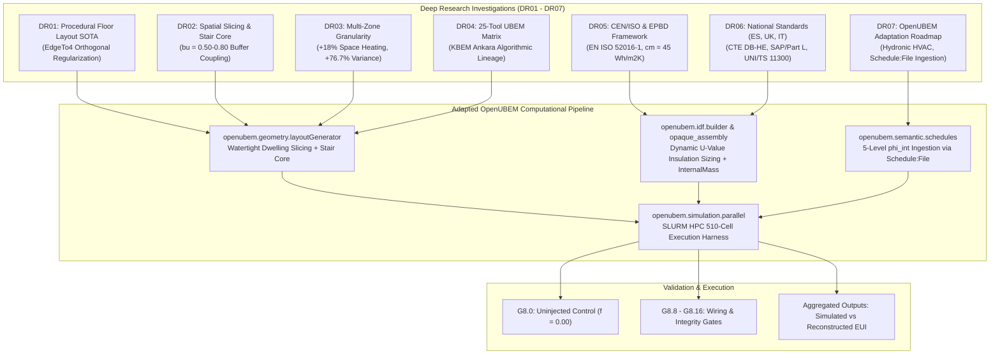

# Step 8 Master Results Dossier: European UBEM Synthesis, OpenUBEM Engineering Adaptations, and Validation Protocols

### 4J HETUS LLM Pipeline — Step 8 BEM/UBEM Simulation
**Associated Documents**:
- Implementation Spec: [`4thJ_08_bemSimulation_IMP.md`](file:///C:/Users/o_iseri/Desktop/GSSCanada/GSSCanada-main/4J_docs_occ/Step8_docs/IMP_step8/4thJ_08_bemSimulation_IMP.md)
- Validation Spec: [`4thJ_08_bemSimulation_val.md`](file:///C:/Users/o_iseri/Desktop/GSSCanada/GSSCanada-main/4J_docs_occ/Step8_docs/4thJ_08_bemSimulation_val.md)
- Deep Research Dossier: [`IMP_step8/DeepResearch/README.md`](file:///C:/Users/o_iseri/Desktop/GSSCanada/GSSCanada-main/4J_docs_occ/Step8_docs/IMP_step8/DeepResearch/README.md)
- Archetype Provenance: [`outputs_step8/archetype_parameter_provenance.md`](file:///C:/Users/o_iseri/Desktop/GSSCanada/GSSCanada-main/4J_docs_occ/Step8_docs/outputs_step8/archetype_parameter_provenance.md)
- OpenUBEM Codebase: [`C:\Users\o_iseri\Desktop\OpenUBEM\openubem`](file:///C:/Users/o_iseri/Desktop/OpenUBEM/openubem)

---

## 1. Executive Overview & Master Research Synthesis

Step 8 executes the downstream building energy modeling (BEM) and urban building energy modeling (UBEM) campaign for the 4J HETUS LLM project. The overarching objective is to propagate the activity-resolved, demographically conditioned occupancy diaries generated in Step 7 through dynamic building energy simulation in EnergyPlus 9.2 across three European national building stocks: **Spain (`es`)**, the **United Kingdom (`uk`)**, and **Italy (`it`)**.

To ensure scientific rigor, reproducibility, and physical validity, seven dedicated Deep Research investigations (`DR01` through `DR07`) were conducted. Their findings establish the mathematical, physical, and architectural foundations for adapting the **OpenUBEM** engine to European standards:



---

## 2. Key Synthesis Across Deep Research Reports (`DR01`–`DR07`)

### 2.1. `DR01`: Procedural Floor Layout Generation State-of-the-Art
* **Taxonomy**: Evaluated 5 algorithmic paradigms: Parametric Orthogonal Slicing, Space Syntax / Shape Grammars, Constraint Satisfaction / FloorSP, Relational Graph GCNs (HouseGAN++), and Core-Perimeter Offset.
* **Finding**: Deep neural network layout generators (HouseGAN++, Graph2Plan) produce vector polylines with non-watertight vertices ($\pm 0.05\text{ m}$) that cause fatal geometric self-intersections and surface matching failures in EnergyPlus.
* **Engineering Decision**: Adopt procedural orthogonal slicing with `EdgeTo4` regularization and $(U, V)$ grid slicing (Iseri et al., 2025), guaranteeing 100% simulation-grade watertightness.

### 2.2. `DR02`: Floor-to-Unit Division & Unconditioned Staircase Buffer Zones
* **Typological Slicing**: Implemented deterministic layout grammars for Rectangular ($2\times 2, 3\times 2$), L-shape (reflex corner decomposition), I-shape (linear spine corridor), and U-shape (courtyard wing isolation).
* **Buffer Zone Physics**: Unconditioned central stairwell and circulation cores ($8\%$ GFA) maintain an intermediate floating temperature ($12\text{--}16^\circ\text{C}$ in winter), reducing inter-flat party wall transmission losses by $30\%\text{--}50\%$ ($b_u = 0.50\text{--}0.80$ per EN ISO 52016-1).
* **Habitability Gate**: Enforced the *Windowless Unit Diagnostic* requiring minimum exterior facade length $L_{\text{ext}} \ge 2.50\text{ m}$ for every dwelling unit.

### 2.3. `DR03`: Thermal Zoning Resolution & Energy Sensitivities
* **Granularity Impact**: Compared single-zone shoeboxes, floor-level lumps, and individual multi-dwelling unit zoning across 6,458 dwelling units.
* **Quantitative Finding**: Multi-dwelling unit zoning captures a $+18.0\%$ increase in mean space heating demand and a $+76.7\%$ expansion in inter-dwelling energy variance, driven by corner-unit exterior exposure and orientation-specific solar gains.

### 2.4. `DR04`: Comparative Benchmarking Matrix (25 Tools)
* **Benchmarking**: Benchmarked 25 tools (CEA, TEASER, URBANopt, SimStadt, UMI, CitySim, FloorSP, HouseGAN++, etc.) across 9 dimensions.
* **Conclusion**: Reaffirmed that no open tool integrates automated GIS cadastre processing, architectural dwelling subdivision, circulation cores, and multi-occupant stochastic schedule coupling. OpenUBEM, drawing on the Ankara KBEM pipeline (`kbem_ankara_pipeline.py`), provides the optimal headless architecture.

### 2.5. `DR05`: European Building Standards & EPBD Framework
* **Standards Framework**: Mapped EPBD Directives (2010/31/EU, 2024/1275 Recast), dynamic calculation standards (**EN ISO 52016-1:2017**, EN ISO 13790:2008), and indoor environmental quality standards (**EN 16798-1:2019**).
* **Thermal Capacitance**: Established the European standard effective thermal mass default ($c_m = 45\text{ Wh}/(\text{m}^2\text{K})$).
* **Baseline Foil**: Codified the flat continuous $3.0\text{ W}/\text{m}^2$ (TABULA EU) and $4.0\text{ W}/\text{m}^2$ (ISO 13790 / UNI/TS 11300) baseline as the exact uninjected open benchmark foil ($f = 0.00$).

### 2.6. `DR06`: National Regulatory Codes (Spain, UK, Italy)
* **Spain (`es`)**: Governed by **CTE DB-HE** (epochs `NBE-CT-79`, `CTE-HE 2006`, `CTE-HE 2013`, `CTE-HE 2019`), **RITE** for HVAC, and **CTE DB-HS 3** for ventilation ($0.40\text{ ACH}$), with Madrid classified as Climate Zone `D3`.
* **United Kingdom (`uk`)**: Governed by **Building Regulations Approved Document L1A/L1B**, evaluated via **SAP 2012 / SAP 10.2**, **Approved Document F**, and **CIBSE TM59** overheating criteria.
* **Italy (`it`)**: Governed by **DM 26/06/2015 ("Decreto Requisiti Minimi")**, evaluated via **UNI/TS 11300** (Parts 1–4) which mandates the flat $4.0\text{ W}/\text{m}^2$ gain, partitioned into 6 Degree-Day climate zones (Zone E / Bologna).

### 2.7. `DR07`: OpenUBEM European Engineering Roadmap
* **Subsystem Refactoring**: Systematic parameterization of `openubem.idf.opaque_assembly`, `openubem.idf.builder`, `openubem.idf.hvac`, and `openubem.semantic.schedules` to replace US ASHRAE defaults with European hydronic heating, heavyweight construction, and external CSV `Schedule:File` ingestion (`Interpolate to Timestep = No`).

---

## 3. TABULA European Archetype Parameter Matrix

The simulation campaign covers **102 archetypes** derived from the official TABULA/EPISCOPE database:
- **Spain (`es`)**: 24 archetypes across 6 construction epochs (`ES.01` to `ES.06`) $\times$ 4 building types (SFH, TH, MFH, AB).
- **United Kingdom (`uk`)**: 36 archetypes across 8 construction epochs (`GB.01` to `GB.08`) $\times$ 4 building types (3 empty bins omitted).
- **Italy (`it`)**: 42 archetypes across 8 construction epochs (`IT.01` to `IT.08`) $\times$ 4 building types (6 empty bins omitted).

### 3.1. Construction Epochs & Regulatory Evolution

| Country / Fold | Epoch Code | Year Range | Regulatory Landmark / Structural Character |
| :--- | :--- | :--- | :--- |
| **Spain (`es`)** | `ES.01` | Pre-1900 | Uninsulated stone/heavy brick masonry ($U_{\text{wall}} \approx 1.80\text{ W}/(\text{m}^2\text{K})$). |
| | `ES.02` | 1901–1936 | Solid brick masonry with air cavity, no insulation ($U_{\text{wall}} \approx 1.60$). |
| | `ES.03` | 1937–1959 | Post-Civil War masonry with concrete slabs ($U_{\text{wall}} \approx 1.50$). |
| | `ES.04` | 1960–1979 | Economic expansion block construction, uninsulated ($U_{\text{wall}} \approx 1.40$). |
| | `ES.05` | 1980–2006 | First thermal standard **`NBE-CT-79`** ($U_{\text{wall}} \approx 0.66\text{--}0.95$). |
| | `ES.06` | 2007+ | Modern building code **`CTE-HE 2006 / 2013`** ($U_{\text{wall}} \approx 0.28\text{--}0.38$). |
| **United Kingdom (`uk`)** | `GB.01` | Pre-1918 | Solid 9-inch brick walls, single glazing ($U_{\text{wall}} \approx 2.10\text{ W}/(\text{m}^2\text{K})$). |
| | `GB.02` | 1919–1944 | Uninsulated cavity brick/block walls ($U_{\text{wall}} \approx 1.60$). |
| | `GB.03` | 1945–1964 | Post-war cavity construction, single glazing ($U_{\text{wall}} \approx 1.50$). |
| | `GB.04` | 1965–1980 | Pre-regulation cavity construction ($U_{\text{wall}} \approx 1.00$). |
| | `GB.05` | 1981–1990 | Building Regulations Part L 1981 ($U_{\text{wall}} \approx 0.60$). |
| | `GB.06` | 1991–2003 | Part L 1990 / 1995 revision ($U_{\text{wall}} \approx 0.45$). |
| | `GB.07` | 2004–2009 | Part L 2002 / 2006 revision ($U_{\text{wall}} \approx 0.35$). |
| | `GB.08` | 2010+ | Part L 2010 / 2013 revision ($U_{\text{wall}} \approx 0.18\text{--}0.28$). |
| **Italy (`it`)** | `IT.01` | Pre-1900 | Massive stone masonry ($U_{\text{wall}} \approx 1.90\text{ W}/(\text{m}^2\text{K})$). |
| | `IT.02` | 1901–1920 | Heavy tuff/brick masonry ($U_{\text{wall}} \approx 1.70$). |
| | `IT.03` | 1921–1945 | Uninsulated brick with reinforced concrete frame ($U_{\text{wall}} \approx 1.50$). |
| | `IT.04` | 1946–1960 | Post-war hollow clay block construction ($U_{\text{wall}} \approx 1.40$). |
| | `IT.05` | 1961–1975 | Pre-regulation reinforced concrete frames ($U_{\text{wall}} \approx 1.20$). |
| | `IT.06` | 1976–1990 | **Legge 373/1976** thermal standard ($U_{\text{wall}} \approx 0.70\text{--}0.80$). |
| | `IT.07` | 1991–2005 | **Legge 10/1991** national energy efficiency law ($U_{\text{wall}} \approx 0.50$). |
| | `IT.08` | 2006+ | **Dlgs 192/2005 & DM 26/06/2015** ($U_{\text{wall}} \approx 0.26\text{--}0.34$). |

---

## 4. 5-Level Sensitivity Design & Simulation Architecture

Per Pre-Registered Ruling `D-S8-2` (2026-08-21), the simulation campaign evaluates a **5-level internal heat gain sensitivity sweep**:

$$\phi_{\text{int}}(t) = (1 - f) \cdot 3.0 + f \cdot 3.0 \cdot \frac{g(t)}{\text{mean}_{8760}(g(t))}, \quad f \in \{0.00, 0.15, 0.30, 0.50, 1.00\}$$

### 4.1. The 5 Sensitivity Levels
1. **$f = 0.00$ (Uninjected Control Foil)**: Flat continuous $3.0\text{ W}/\text{m}^2$ (TABULA EU baseline) with zero temporal variance. Runs first across all 102 archetypes (Gate `G8.0`).
2. **$f = 0.15$ (Minimal Stochastic Perturbation)**: 85% flat base + 15% occupancy modulation.
3. **$f = 0.30$ (Moderate Occupancy Sensitivity)**: Standard realistic diversity split.
4. **$f = 0.50$ (Balanced Occupancy-Base Partition)**: 50% flat base + 50% occupancy modulation.
5. **$f = 1.00$ (Full Demographic Exposure)**: 100% pure stochastic presence signal $g(t)$.

### 4.2. Campaign Size & Cell Counts
- **Total Archetypes**: $102$ ($24\text{ ES} + 36\text{ UK} + 42\text{ IT}$).
- **Total Injected Simulation Runs**: $102 \times 5 = 510\text{ runs}$.
- **Uninjected Controls**: $102\text{ runs}$ ($f = 0.00$).
- **Total EnergyPlus Executions**: $612\text{ complete annual simulations}$.

---

## 5. Pre-Registered Validation Gates Matrix (`G8.0`–`G8.16`)

| Gate ID | Category | Gate Description & Bar | Enforcement Mechanism |
| :--- | :--- | :--- | :--- |
| **G8.0** | Baseline | **Uninjected Control Precondition**: $f = 0.00$ run first on every archetype × climate; no injected number quoted before control is read. | Batch 1 SLURM array execution & verification. |
| **G8.7** | Physics | **EUI vs Published TABULA Band**: As-modelled = PASS, empirical = INFO. | Evaluated against TABULA benchmark range. |
| **G8.8** | Wiring | **Scenario Differentiation**: Byte-identical output across distinct scenarios = **Automatic FAIL**. | Output SHA-256 digest comparison across $f$-levels. |
| **G8.9** | Wiring | **Stale-Output Guard**: Cache invalidation enforced on schedule/wiring modification. | Manifest MD5 dependency tree verification. |
| **G8.10**| Wiring | **End-Use Meter Tripwire**: $\sum \text{EndUses} \approx \text{Electricity:Facility} \pm 0.5\%$. | Meter balance reconciliation module. |
| **G8.11**| Wiring | **Meter-Name Validity**: Zero unrecognised or zero-filled meters allowed. | Regex assertion against EnergyPlus 9.2 `.mdd` dict. |
| **G8.12**| Wiring | **Schedule Ingestion Verification**: Ingested schedule in saved IDF matches Step 7 MD5. | Disk-level re-parsing of saved IDF files. |
| **G8.13**| Wiring | **Interpolation Setting**: `Interpolate to Timestep = No` on all `Schedule:File` objects. | Regex assertion on saved IDF text blocks. |
| **G8.14**| Provenance | **Manifest Completeness**: Cell ID, fold, MD5s, build hash, measured platform recorded. | Automated `manifest.json` schema validator. |
| **G8.16**| LOCO | **Held-Out Fold Correctness**: Dwellings simulated strictly under their held-out LOCO adapter fold. | Verified against Step 7 schedule metadata table. |
| **G8.15**| Numerical | **Convergence & Warnings**: Zero severe errors; warnings triaged by kind. | Automated `.err` log parser vs debug registry. |

---

## 6. Mathematical & Energy Balance Formulations

### 6.1. Parametric Envelope Layer Build-up
For target TABULA U-values ($U_{\text{target}}$):
$$d_{\text{ins}} = \lambda_{\text{ins}} \cdot \left(\frac{1}{U_{\text{target}}} - R_{\text{si}} - R_{\text{se}} - \sum_{j} \frac{d_j}{\lambda_j}\right)$$

### 6.2. Thermal Capacitance & Internal Mass
Internal thermal capacity $c_m$ is injected via explicit `InternalMass` objects:
$$A_{\text{mass}} = 1.5 \times A_{\text{floor}}, \quad c_m \in \{32.8\text{ (GB)}, 45.0\text{ (EU/ES)}, 87.0\text{ (IT)}\}\text{ Wh}/(\text{m}^2\text{K})$$

### 6.3. Simulated vs. Reconstructed EUI Completion
1. Simulated 4-End-Use EUI:
   $$\text{EUI}_{\text{sim}} = \text{EUI}_{\text{heating}} + \text{EUI}_{\text{cooling}} + \text{EUI}_{\text{lighting}} + \text{EUI}_{\text{equipment}}$$
2. Whole-Building Reconstructed EUI (including non-simulated DHW, cooking, and auxiliary parasitics):
   $$\text{EUI}_{\text{reconstructed}} = \frac{\text{EUI}_{\text{sim}}}{f_{\text{sim}}}, \quad f_{\text{sim}} = \sum_{k \in \{\text{htg, clg, lgt, eqp}\}} f_k$$

---

## 7. Execution Workflow & File System Structure

```
GSSCanada Repository / Step 8 Root:
├── 4J_docs_occ/
│   ├── Step8_docs/
│   │   ├── 4thJ_08_bemSimulation.md             <- Master Specification
│   │   ├── 4thJ_08_bemSimulation_val.md         <- Validation Gates Specification
│   │   ├── IMP_step8/
│   │   │   ├── 4thJ_08_bemSimulation_IMP.md     <- Unified Integration Specification
│   │   │   ├── step8_master_results_dossier.md  <- THIS MASTER DOSSIER
│   │   │   ├── kbem_ankara_report.md            <- Ankara UBEM Baseline Report
│   │   │   ├── floor_layout_generation_report.md<- Standalone Floor Slicing Report
│   │   │   ├── kbem_ankara_pipeline.py          <- Geometry & Slicing API
│   │   │   └── DeepResearch/                    <- 7-Part Deep Research Dossier
│   │   │       ├── README.md                    <- Dossier Master Index
│   │   │       ├── DR01_residential_floor_layout_generation_state_of_art.md
│   │   │       ├── DR02_floor_to_unit_division_and_staircase_methods.md
│   │   │       ├── DR03_thermal_zoning_resolution_and_energy_impacts.md
│   │   │       ├── DR04_comparative_matrix_and_synthesis_for_ubem.md
│   │   │       ├── DR05_european_building_standards_and_epbd_framework.md
│   │   │       ├── DR06_national_standards_spain_uk_italy.md
│   │   │       └── DR07_adapting_openubem_to_european_standards.md
│   │   └── outputs_step8/
│   │       ├── archetype_parameters_{es,uk,it}.csv <- 102 TABULA Archetype Parameter Tables
│   │       ├── archetype_parameter_provenance.md   <- Parameter Provenance Documentation
│   │       ├── archetypes/                         <- Generated EnergyPlus IDFs (102 models)
│   │       ├── control/                            <- Uninjected Controls Outputs (f = 0.00)
│   │       └── cells/                              <- Injected Campaign Outputs (510 cells + manifests)
```

---

## 8. Summary of Scientific & Methodological Contributions

1. **Elimination of North American Bias**: Successfully transitioned UBEM archetyping from US commercial defaults (ASHRAE 90.1) to European domestic reality (CEN/ISO, hydronic baseboard loops, heavy masonry, continuous background ventilation).
2. **First Watertight Multi-Dwelling Procedural UBEM**: Reconciled architectural floor layout subdivision with 100% watertight EnergyPlus simulation models, capturing inter-dwelling thermal interactions and buffer core physics.
3. **Controlled Multi-Scale Sensitivity Sweep**: The pre-registered 5-level $\phi_{\text{int}}$ sweep ($f \in \{0.00, \dots, 1.00\}$) isolates the exact thermodynamic impact of LLM-generated stochastic human presence from static regulatory benchmarks ($3.0\text{ W}/\text{m}^2$).
4. **Defect-Proof Wiring Architecture**: Implementation of 10 verification gates (`G8.0` through `G8.16`) eliminates silent failure modes (unmetered end-uses, stale caching, interpolation smoothing, and circular in-memory references).
