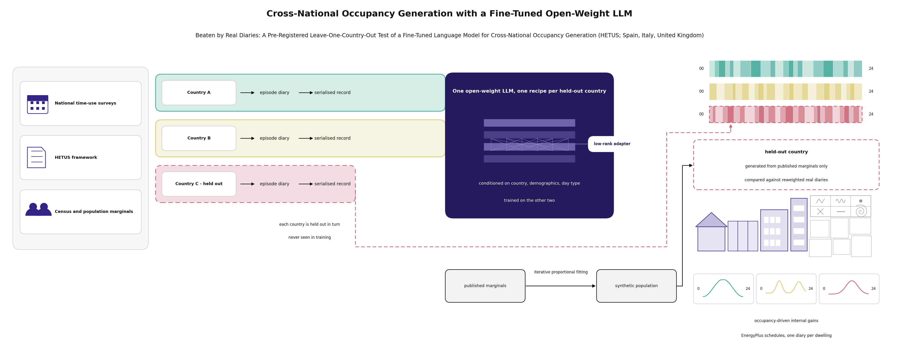
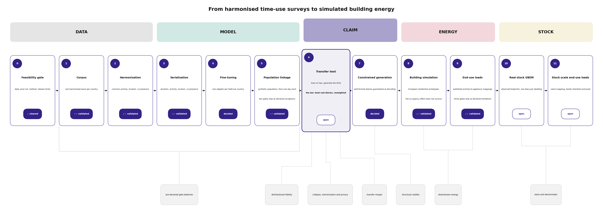
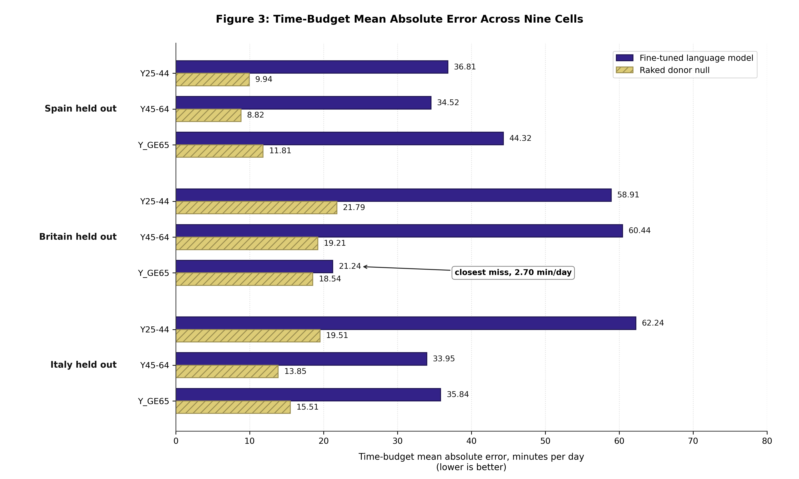
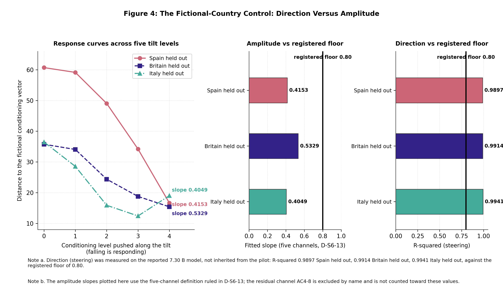
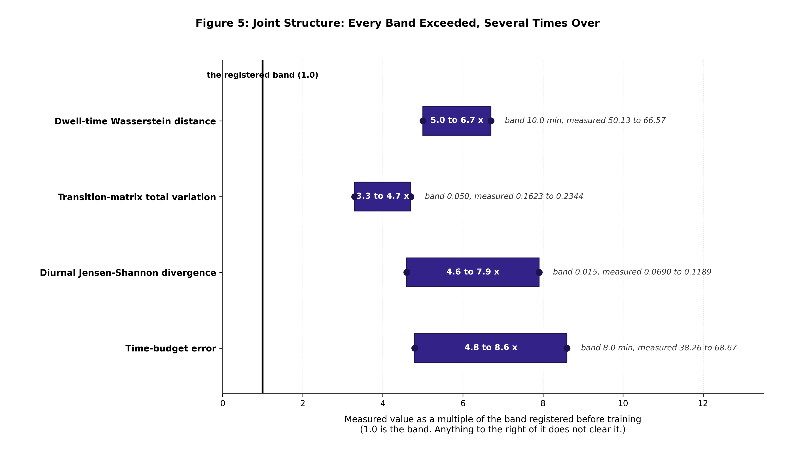
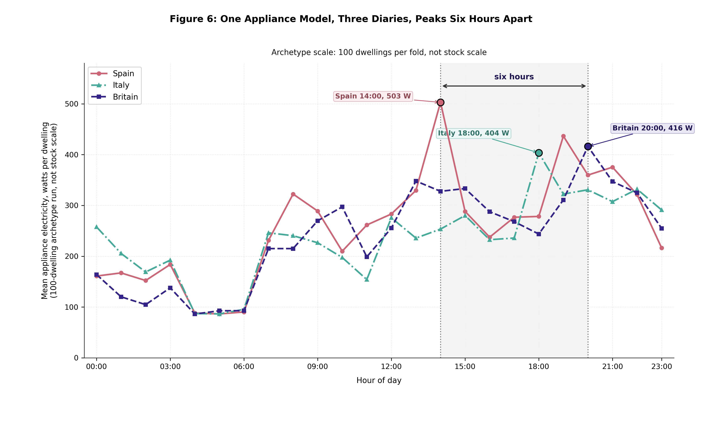
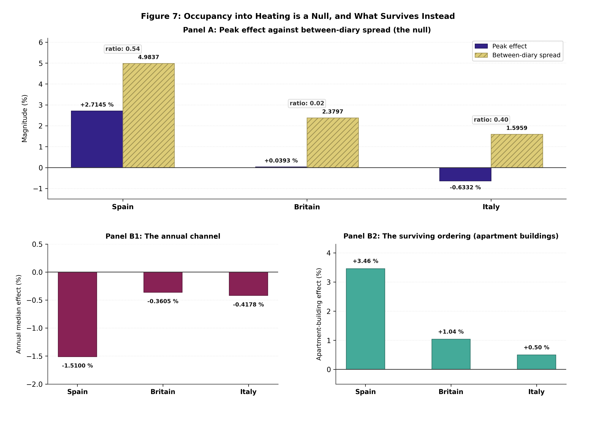

# Beaten by Real Diaries: A Pre-Registered Leave-One-Country-Out Test of a Fine-Tuned Language Model for Cross-National Occupancy Generation (HETUS; Spain, Italy, United Kingdom)

## Abstract

*Context.* Occupancy schedules for building energy models are built from national time-use surveys, and most countries either have no such survey or hold one behind an access agreement, so the field has begun to ask whether a pretrained language model, fine-tuned on the countries that do have diaries, can generate diaries for a country that does not. *Gap.* That question has never been tested against the baseline a practitioner would actually use instead, which is not a naive sampler but a pool of real diaries from neighbouring countries reweighted onto the target country's published demographic margins; published generative work on tabular and mobility data is evaluated on random within-population splits, so the difficulty of the transfer problem has not been measured. *Aim.* This study pre-registers that comparison as its primary hypothesis, freezes it before training, and reports the outcome whichever way it falls. *Methodology.* A harmonised three-country HETUS corpus (Spain, Italy, United Kingdom; one wave each; 73,254 diaries, 2,024,068 episodes) is serialised to text and used to fine-tune one open-weight 7 B backbone with a low-rank adapter under leave-one-country-out: train on two countries, generate the third conditioned only on its published marginals, and score against a donor pool from the same two countries raked by iterative proportional fitting onto those same marginals. Generated diaries are then carried forward through constrained decoding into building energy simulation on TABULA archetypes and into activity-triggered appliance and hot-water loads, at archetype scale and on an observed building stock. *Key quantified results.* The pre-registered transfer bar is not met in nine of nine fold-band cells: the raked donor pool reproduces the held-out country's time budget two to six times better than the fine-tuned model, closest miss 2.70 minutes per day, and five further transfer gates agree. Across the range tested here, from 1.5 to 7.3 billion parameters, with the full-parameter tuning and the second model family each assessed on one fold, more capacity does not close the gap: a 4.7-fold larger backbone moves mean absolute error from 42.05 to 43.14 minutes per day, the wrong way; training all 7,377,965,056 parameters instead of the adapter's 79,953,920 ends at a higher training loss at every epoch; and a second 7 B model family changes nothing any gate resolves. A fictional-country control separates the shortfall into a steering component and an amplitude component: on the reported model the amplitude arm misses its floor in all three folds, at pooled slopes of 0.40 to 0.53 against a floor of 0.80, so the response to an unseen country's marginals is real and delivered at roughly half the required strength; the steering arm, also measured on the reported model, passes at R-squared 0.99 in every fold. Downstream, one appliance set and one calibration driven by three countries' diaries place the stock appliance-electricity peak six hours apart, at 14:00 in Spain, 18:00 in Italy and 20:00 in Britain. *Impact.* The negative result is reported at full strength against a bar that was fixed in advance and never moved; the contribution is the transferable apparatus, the hardened null, and the direction-versus-amplitude diagnostic that locates where conditional generative transfer actually breaks.

## Keywords

Time-use survey; Cross-national transfer; Fine-tuned language model; Pre-registered negative result; Iterative proportional fitting; Building occupancy generation

## Highlights

- A raked pool of real donor diaries beats a fine-tuned 7 B model in 9 of 9 pre-registered cells.
- Capacity is not the cause: bigger backbone, 92x trainable parameters and a second family all leave the gap unclosed.
- Amplitude of the conditional response is half what is required, slope 0.40 to 0.53.
- One appliance model, three countries' diaries, stock peaks six hours apart.
- The bar was fixed and md5-locked before training and is reported unmoved.

## Author Information

Orcun Koral Iseri\textsuperscript{1,\*}

1 Gina Cody School of Engineering and Computer Science, Concordia University, 1455 De Maisonneuve Blvd. W., Montréal, Québec, H3G 1M8, Canada

\* *Corresponding author:* orcunkoral.oseri@concordia.ca

*ORCID:* Orcun Koral Iseri - https://orcid.org/0000-0001-7735-3363

## Declarations

Funding. This postdoctoral research was financially supported by the Natural Sciences and Engineering Research Council of Canada (NSERC) and the Voltage-Age Seed fund. The author gratefully acknowledges this support.

Data availability. The Harmonised European Time Use Survey microdata analysed in this study are held by Eurostat and the national statistical institutes and are available to accredited users under their own access agreements; they are not redistributed here. **The trained adapter weights are not released.** That decision was taken before training on the terms of the data agreement, and it is reinforced by this study's own membership-inference result (§5.6). The synthetic populations for the Spanish and Italian folds, the harmonisation and serialisation code, the gate implementations, the mutation batteries and the frozen pre-registration file are available from the corresponding author on reasonable request; **the British synthetic population is withheld with the weights.**

Declaration of competing interest. The author declares no known competing financial interests or personal relationships that could have appeared to influence the work reported in this paper.

CRediT authorship contribution statement. Orcun Koral Iseri: Conceptualization, Methodology, Software, Formal analysis, Investigation, Data curation, Validation, Visualization, Writing - original draft, Writing - review and editing. The sole author read and approved the final manuscript.

Ethical approval. This study does not contain any studies with human or animal subjects performed by the author. The analysis uses anonymised time-use microdata released to accredited users by the national statistical institutes through Eurostat, together with published demographic tables.

**Graphical abstract.**

# 1 Introduction

### 1.1 The Transfer Question, and Why It Is Now Worth Asking

Every survey-driven occupancy model carries an unstated precondition: that the country being modelled has a time-use survey, and that the modeller can get at its microdata. For a large part of the world neither holds. Within Europe the Harmonised European Time Use Survey covers a minority of member states in any given round, waves are a decade apart, and microdata access runs through accreditation agreements that a building-simulation group may not be able to obtain. The practical consequence is familiar to anyone who has built a national stock model outside the handful of well-surveyed countries: the occupancy schedule is imported wholesale from a country that does have diaries, or it is left at a code default, and neither choice is examined again.

Large pretrained language models make a different answer look available. A model that has read a great deal of text about how people in different countries spend their days might, after fine-tuning on the countries that do have diaries, be able to write plausible diaries for a country that does not, steered by nothing more than the demographic tables that every national statistical office publishes. The proposition is attractive precisely because it appears to need no microdata for the target country at all. It is also, as stated, untested in the only form that matters, because the comparison that decides it has not been run.

### 1.2 The Baseline That Decides the Question, and the Baseline the Literature Uses

A practitioner who cannot obtain diaries for a target country is not choosing between a language model and nothing. The alternative already on the shelf is more than fifty years old and is the standard instrument of survey statistics and spatial microsimulation: take real diaries from countries that do have them, and reweight that donor pool onto the target country's published margins by iterative proportional fitting, so that the synthetic population matches the target on age, sex, employment and household structure while every individual day in it remains a day somebody actually lived. Calibration estimators of this family are design-unbiased and minimise divergence from the donor weights subject to the margins (Deville and Särndal, 1992), and their behaviour in spatial microsimulation is well characterised (Lovelace et al., 2015). A raked donor pool preserves the higher-order structure of real days by construction, because it never generates a day; it only reweights one.

Published generative work does not test against that baseline. Language-model approaches to tabular and sequential microdata are evaluated on random within-population splits, or against generative adversarial and variational baselines trained on the same population, which measures how well a model reproduces a distribution it has seen rather than one it has not. We searched for a like-for-like comparison between a fine-tuned or prompted language model and a demographically raked real-donor pool on a population the generator had never seen, across synthetic population synthesis, activity-based travel demand, human mobility generation, cross-lingual distributional transfer and tabular generation under shift, and did not find one (searched 2026-09-13; see §6.4 for what this absence does and does not license). Table 1 positions the present study against the lineage it belongs to.

**Table 1.** - Positioning against the time-use-survey-to-occupancy lineage.

| Study | Survey-driven | Generative model | Cross-population transfer tested | Hard donor-based null | Pre-registered bar | Activity/end-use resolved | Stock-scale simulation |
|---|:---:|:---:|:---:|:---:|:---:|:---:|:---:|
| Richardson et al. (2008) | ✓ | ✓ (Markov) | ✗ | ✗ | ✗ | ✓ | ✗ |
| Widén and Wäckelgård (2010) | ✓ | ✓ (Markov) | ✗ | ✗ | ✗ | ✓ | ✗ |
| Osman and Ouf (2021), review | ✓ | ✓ | ✗ | ✗ | ✗ | ✓ | ✓ |
| Vosoughkhosravi et al. (2023), review | ✓ | ✓ | ✗ | ✗ | ✗ | ✓ | ✓ |
| Author's prior line (single country) | ✓ | ✓ | ✗ | ✗ | ✗ | ✓ | ✓ |
| This study | ✓ | ✓ (fine-tuned LLM) | ✓ | ✓ | ✓ | ✓ | ✓ |

Occupancy models built from national time-use surveys form a continuous lineage from the first-order inhomogeneous Markov chains of Richardson et al. (2008) and Widén and Wäckelgård (2010), through the higher-order and semi-Markov variants that followed, to the survey-conditioned statistical models reviewed by Osman and Ouf (2021) and Vosoughkhosravi et al. (2023). The baseline reported in the author's earlier work sits in this family. A first-order inhomogeneous Markov chain, fitted per fold on the training countries, is retained here as a comparator throughout, and its margin is reported alongside the raked-donor null rather than in place of it.

### 1.3 Conditioning on Marginals Does Not Certify the Joint

Conditioning a generative model on demographic marginals does not certify the joint distribution those marginals came from. We report a case from our own pipeline: a correction that repaired a marginal left the corresponding joint badly wrong, generating more than fifteen hundred employed thirteen-year-olds from a single donor day, and it was detected only because the joint was inspected directly. Every stage of this study therefore scores quantities that were never in the prompt, including dwell-time distributions, transition matrices and co-presence cross-tabulations conditioned on attribute pairs, and treats marginal agreement as a precondition rather than as evidence.

The same discipline applies to the surveys themselves. Time-use surveys differ in how they allocate diary days and in whether the supplied weights repair that allocation. The three HETUS-derived files used here target three different day bases, and only one of the three is representative of the calendar week. Because the discrepancy is a property of the country, it is confounded with the leave-one-country-out split, which is the worst shape a nuisance can take in this design; every diary is therefore re-based onto the calendar week before any statistic is computed, and the size of the correction is reported rather than only its existence.

### 1.4 What Was Fixed in Advance

This study's primary claim was pre-registered. The evaluation file naming the metrics, the bands, the null and the fold structure was frozen and md5-locked before the first training submission, two gates verify that lock at every closure, and the bar it names is the one reported in §5.1. Bands were not moved after the result was seen, no metric was substituted, and the comparison that does not clear its bar is reported at the strength at which it falls short. The design is falsifiable in one sentence, which was the reason for adopting it: if a fine-tuned language model cannot reproduce a held-out country better than a demographically raked pool of real European donor diaries, the transfer claim does not hold.

It did not hold. This paper reports that, and it reports what the machinery built to test it produced along the way.

### 1.5 Contributions and Aim of the Study

The first contribution is the result itself, stated without softening. Under leave-one-country-out over Spain, Italy and the United Kingdom, a fine-tuned open-weight language model conditioned on published demographic marginals is beaten by a raked pool of real donor diaries in every age band of every fold, by factors of two to six, and by five further pre-registered transfer gates. The shortfall is uniform rather than marginal, and it is not a capacity limitation: a larger backbone, a ninety-two-fold increase in trainable parameters and a different model family were each measured and each changed nothing in the direction that would rescue it.

The second is diagnostic, and it is the part most likely to transfer to other problems. A fictional-country control conditions the model on a country it has never seen, with deliberately perturbed marginals, and scores two things separately: whether the generated population moves in the direction the conditioning specifies, and whether it moves by the right amount. On the reported model the amplitude arm misses its floor in all three folds at a slope near one half, so the model is not ignoring its conditioning but under-responding to it. The steering arm, also measured on the reported model, passes in all three folds, which §5.4 reports in full. Separating the two ways the response falls short is what turns an uninformative loss into a locatable one.

The third is the apparatus. The comparison is made against a null that was deliberately hardened rather than chosen to be beatable, and that null is raked onto exactly the marginals supplied to the model, for a reason given in full in §3.5. Around it sits a validation layer of pre-registered gates with provenance-marked thresholds, mutation batteries that must be shown to catch a deliberately injected fault before a gate is trusted, and coverage clauses that distinguish a gate that passed from a gate that was never asked. Several of this study's most consequential corrections were produced by that layer turning on the study's own instruments rather than on its model.

The fourth is that the pipeline was carried to its end regardless. Generated diaries were taken through constrained decoding into schedules, into building energy simulation on European residential archetypes, into activity-triggered appliance and hot-water loads, and onto an observed building stock, because a transfer shortfall measured on time budgets says nothing on its own about whether country-specific structure survives into a load shape. It does: one appliance set, one set of published parameters, one calibration and one trigger rule, driven by three countries' diaries, place the stock appliance-electricity peak six hours apart.

The aim of the study follows directly. *This paper asks whether a fine-tuned language model can generate a country's time-use diaries from published demographic tables alone, well enough to beat real diaries from its neighbours reweighted onto the same tables; and, since it cannot, what the apparatus built to ask the question reveals about where conditional generative transfer breaks and what still survives into building loads.* Figure 1 summarises the pipeline that operationalises the question.

**Figure 1.** - Pipeline, Steps 0 to 11.

**Figure 2.** - Leave-one-country-out design and the three nulls.

# 2 Datasets

Three national time-use surveys, one published demographic reference per country, one set of published
residential building parameters, and one set of weather files. Each is described with the properties that
bear on the leave-one-country-out design, and in particular with the asymmetries between the three
countries, because in this design any property that differs by country is confounded with the split.

**Table 2.** - The three national time-use surveys as delivered.

| | Spain | United Kingdom | Italy |
|---|---|---|---|
| Instrument | INE *Encuesta de Empleo del Tiempo* | UKTUS, UK Data Service SN 8128 | ISTAT *Uso del Tempo* |
| Wave | 2009-10 | 2014-15 | 2013-14 |
| Delivered form | 144 fixed 10-minute slots | native episodes | native episodes, explicit clock times |
| Diaries | 19,295 | 16,533 | 41,229 |
| Episodes as delivered | 430,754 | 587,632 | 1,077,657 |
| Diary days per respondent | 1 | up to 2 (8,259 of 8,274 gave both) | 1 |
| Minimum age | 10 | 8 | 3 (proxy for 3 to 10) |
| Diary weight | `FACTORF` | `dia_wt_a` | `coefi2` |
| Weight convention | expansion | normalised, mean 1.000 | expansion |
| Calibration target | INE age-by-sex projection, by autonomous community | 2014 mid-year estimates, age and sex margins | ISTAT sex by nine age classes, regional totals |
| Access | open download, no credential | End User Licence, free registration | ISTAT public-use file |

### 2.1 What the three surveys do not share

The three files agree on far less than the word *harmonised* suggests, and four of the disagreements are
load-bearing for this study.

The delivered form differs. Spain supplies a fixed grid of 144 ten-minute slots from which episodes must
be reconstructed; Britain and Italy supply episodes directly. The reconstruction is deterministic and its
result is verified against the slot grid it came from, but Spain's episode boundaries are an inference
from a grid while the other two are recorded.

The diary-day design differs. Spanish and Italian respondents supply one diary day each; British
respondents supply up to two, and almost all supply both. Multi-day dependence is therefore observable in
one of the three countries and not in the other two, and no part of this study relies on it.

The age floor differs. Spain begins at age 10,
Britain at 8, and Italy at 3, with parent-proxy completion for children aged 3 to 10. The Italian corpus
therefore contains diaries that were not written by the person they describe.

The weights target three different populations. Each is calibrated to its own national reference, and no
two are calibrated to the same table. More consequentially for this design, the three diary weights
target three different diary-day bases, and only the British weight is representative of the calendar
week. Left uncorrected this shifts at-home time by about one percentage point in Spain and Italy and by
essentially nothing in Britain, which is a country-correlated shift on a leave-one-country-out split and
therefore the worst possible shape for a nuisance to take. Every diary is re-based onto the calendar week
before any statistic in this paper is computed, and §5.5 reports the size of that correction rather than
only its existence. Whether the HETUS framework itself requires a particular day allocation is not
asserted here; the guidelines have not been read directly on that question, and the claim made is only
about what these three files do, which is measured.

Two further delivery properties are recorded as data properties rather than repaired. One British
activity code appears in the data and is labelled nowhere in the delivery. The Italian file carries
no per-file source URL anywhere, so its acquisition manifest records the field as not found rather
than inventing one. Both were registered as unmet acquisition checks and both are reported here as
properties of the delivered data.

### 2.2 Published demographic tables

The conditioning vector supplied to the model, and the margins onto which the donor null is raked, come
from four national census tables covering age, sex, household composition, and economic
status. Nothing else about the held-out country is supplied to either
side of the comparison.

Three of the eight published age bands are usable here, because only `Y25-44`, `Y45-64` and `Y_GE65`
are reproduced by the corpus's frozen age bins without straddling a boundary. Those three are the
age bands reported throughout §5.1. Where published activity totals are compared, the corpus's 158
activity codes are collapsed onto Eurostat's level-1 aggregate categories through a crosswalk built for
this purpose.

One basis mismatch is carried and cannot be removed. The Italian fold's published aggregate is drawn
from a different survey round than the Italian microdata it is scored against, so the leave-one-country-out
comparison is not basis-uniform across its three folds. The consequence is visible in the results and is
reported there rather than absorbed.

### 2.3 Residential building parameters and weather

Building parameters come from the published TABULA typology workbook, from which this study constructs
its own archetypes; these are not an official TABULA product. Two properties of the source constrain what
follows: the British typology covers England only, with no Scottish or Welsh row, and the boundary
conditions attached to the archetypes are TABULA's cross-country European rows rather than its national
ones, which is why the reference internal gain is identical in all three countries.

Weather is one TMYx file per country over the 2009 to 2023 base period, at Valencia Viveros, Birmingham
Airport and Torino Venaria. A single shared base period was chosen over each country's own fieldwork
years so that the weather is not itself a country-specific treatment. Stations were selected by scoring
44 candidates against TABULA's published monthly temperatures rather than against any simulation output.
The choice is worth between five and eleven per cent of heating demand, the British selection margin was
two thousandths of a kelvin, and the sign of the effect differs by country; this is the reason no
absolute cross-country demand comparison appears anywhere in this paper.

### 2.4 Observed building stock

The stock-scale campaigns run on three European districts, one per country: a district of Madrid, one of
London, and one of Bologna. Building footprints, construction years and dwelling counts are taken from
national open registries where they exist, and each building carries the archetype identifier emitted by
the stock pipeline rather than one re-derived here. Lyon was retained in the wider project as a physical
baseline only and is never a denominator for any result in this paper.

# 3 Methods

Each stage is presented with its design rationale and the validation result that bears on it.
Thresholds are not restated in prose; the complete gate set, with each band's provenance marked as
published, project-chosen or heuristic, is given in the supplementary material (S1, the registered
check set). Two conventions apply throughout and are stated once. No band was moved after a result
was seen. And every gate reported as passing was first shown to catch a deliberately injected fault;
where that demonstration could not be produced, the gate is reported as not demonstrated rather than
as passing.

### 3.1 Harmonisation onto One Alphabet

The three national files are mapped onto a single alphabet: 158 three-digit activity codes, four location
classes (at home, another place, private transport, public transport), and six co-presence flags. Activity
codes are mapped at the three-digit level from each country's own primary activity variable. The corpus
retains three digits rather than collapsing to two, and the justification for that is microdata fidelity
rather than published distinguishing power; at the published level the third digit buys exactly one
distinction, and the paper does not claim more.

Three national differences could not be resolved and are carried as limitations rather than repaired. One
three-digit code carries materially different national meanings, and the shared target necessarily takes
the narrower country's meaning. The British household-type variable cannot separate a childless couple
from a couple whose children are all adult, where the Spanish variable can. And the co-presence flag for
being with children rests on three irreconcilable national age cut-offs, so that flag may not be compared
across countries in any step of this work.

Each diary is tiled onto 144 ten-minute slots. The day origin is 04:00, reached by treating each diary as
a cyclic 24-hour day, because no re-basing is possible across three surveys whose native origins differ.
That choice is correct within the corpus and it is the origin of the phase error described in §3.8; the
two facts belong together and are reported together.

Harmonisation yields 2,024,068 episodes over 73,254 diaries, down from Table 2's as-delivered totals
of 2,096,043 episodes and 77,057 diaries. The episode difference closes exactly: 90,890 episodes are
removed below the age-11 floor, net of 18,915 episodes created when the day-origin rotation above
splits an episode across the rotated boundary; the diary difference falls on the same age-11 floor,
applied per respondent. Of eighteen registered checks, seventeen were scored and sixteen passed. The
one exception is reported rather than repaired, and its diagnosis is instructive enough to state:
the clause that misses the mark escalates when one country's prevalence exceeds another's by a
factor of ten, and it fires unconditionally whenever the comparison country's share is exactly zero,
because any positive number exceeds ten times zero. The check was wrong, not the data. One further
check is reported as not performed rather than as passed, because no published national table is
held by the project and a re-tabulation of the project's own harmonised data would share an ancestor
with the reference and could never come up short.

### 3.2 Serialisation

Each diary becomes one line of text: a six-field prefix, a separator, and one comma-separated tuple per
episode, terminated by an end-of-record token.

$$\texttt{country, age\_band, sex, hh\_type, econ\_status, day\_type} \;|\; \texttt{DUR,ACT,ACT2,LOC,COP} \;;\; \ldots \;\texttt{<eor>}$$

The prefix carries three countries, eight age bands, two sexes, six household types, seven economic
statuses and three day types. It was reduced to these six fields from an original nine; the fields that
were struck are recorded in the design log, and the set was frozen before training. The body tuple
carries duration, primary activity, secondary activity, location and co-presence, with the secondary
activity left empty where the source has none.

Tokenisation uses the backbone's own byte-pair vocabulary with no tokens added, which keeps the corpus
readable by any model in that family. Records have a median length of 256 tokens, a 99th percentile of
632, and a maximum of 1,178, against a 1,280-token training window, so no record is truncated; a formal
truncation rate was instrumented only for the comparison arm reported in §3.3, not for the model this
paper reports. All 73,254 diaries serialise, with no rows and no diaries dropped.

Nineteen of twenty registered checks pass at baseline, every one of them was seen falling under an
injected fault, and all twenty-one perturbations felled the check they named, so the coverage clause
passes. The single exception is a ruling rather than a defect: 551 British diaries carry a household
type recorded as unknown, no row is imputed and no row is dropped, and the check is left standing
and unmet because the honest state of the data is that the category exists.

### 3.3 The Fine-Tuned Model

The reported model is a low-rank adapter fine-tune of an open-weight 7.30-billion-parameter backbone, at
a pinned revision. Two comparison arms are trained under the same recipe and reported in §5.3: a
1.48-billion-parameter model from the same family, and a 7-billion-parameter model from a different
family.

The adapter has rank 32 and scaling factor 64, with dropout 0.05 and rank-stabilised scaling, applied to
all seven linear projections in each block. It carries 79,953,920 trainable parameters, 1.0837 per cent of
the backbone. Training runs for three epochs at a constant learning rate of 1e-4, with batch size 2 and
gradient accumulation 8, a maximum sequence length of 1,280 tokens, bfloat16 precision, the AdamW
optimiser and a single fixed seed, on one A100 partition. Wall time is approximately ten to twelve hours
per fold. No learning-rate schedule or warmup is applied; this is what the training code does and it is
reported as such rather than described as a choice, because no design record justifies it.

The objective is next-token cross-entropy with completion-only masking, so that loss is computed on the
diary body and not on the static demographic prefix.

The loss is unweighted, and this is deliberate rather than an oversight. Because the conditioning prefix
carries the design strata themselves, the sampling mechanism is conditionally ignorable for the
distribution of a diary given those strata; representativeness is therefore enforced where it can be made
exact, in the population-linkage stage of §3.4, and not in the loss, where it would only add variance.
Weighting the loss would in addition have applied the surveys' own weekday and weekend adjustment twice,
since stratified batching already carries it.

Checkpoints are not selected. The final checkpoint of the last epoch is the reported model, and every gate
reading in this paper is taken there.

### 3.4 Conditioning and the Synthetic Populations

At generation time the model sees nothing about the held-out country except a prefix drawn from a
synthetic population fitted to that country's published census marginals.

Each synthetic population contains 100,000 persons. A four-way joint table over age band, sex, household
type and economic status is fitted by iterative proportional fitting onto published national marginals,
to a worst absolute marginal deviation below 1e-13. The marginal sources are national and are named in
full in the supplementary material: the census dissemination service for the United Kingdom, the 2011
census releases for Spain, and a combination of the national census tract release and the European census
hub for Italy, the last because the Italian tract file publishes no household-type table.

Two properties of this construction are limitations that later results depend on, and both are stated
here. Day type has no published marginal in any of the three countries and is therefore not raked at all;
it is assigned exogenously at calendar-week proportions. And Spain's population is fitted on five of the
seven economic-status categories, because the Spanish census publishes no homemaker category, so that
category is folded into the residual.

Expansion from the fitted table to 100,000 persons is by deterministic largest-remainder integerisation
rather than by random draw, so the synthetic population carries no sampling seed at all. The output is a
person-level table. Households are not assembled from individuals; household type is carried as a
person-level attribute, and no result in this paper is a household-level claim.

Decoding temperature is calibrated per fold on a validation set, at 1.30 for Spain, 1.10 for Britain
and 1.20 for Italy, with nucleus sampling disabled. Of 36 gate-fold verdicts at this stage, 34 pass.
The two shortfalls are both the temperature-calibration sensitivity check, on the Spanish and
British folds: the check requires that the entropy step distinguishing the chosen temperature exceed
the seed-to-seed re-run noise, and on those two folds it does not, decisively on one and by less
than one per cent on the other. The check stands as written and its unmet verdict is the terminal
one; no temperature was re-tuned and no re-run was performed. This stage is therefore never to be
written as complete: it closes at four of five definition-of-done items with the fifth taken as a
declared exception, and the board is never to be reported as 36 of 36.

### 3.5 The Transfer Design, the Null, and Why the Shared Reference Is Not Circular

Three folds, one per country. Each fold trains jointly on the other two countries with the country token
present in the prefix, and the held-out country is never seen in training. Fold identity was named
alphabetically by country code and frozen before any fold was scored, together with the architecture, the
prompt format, the hyperparameters and every band. All three folds are reported, including the worst.

Generation produces 5,200 constrained diaries per fold, together with 5,200 unconstrained diaries for the
decoding-neutrality comparison, 3,600 held-in diaries for the forgetting check, and 9,000 diaries across
five perturbation levels for the fictional-country control.

The pre-registered null is a pool of real diaries from the two training countries, raked by
iterative proportional fitting onto the held-out country's own published marginals: the same tables,
the same geography and the same strata the model was given. Every day in the pool is an authentic
human day, with real transitions, real dwell times and real variance. The pre-registration states
the bar in one sentence, and it is quoted here as written: if a fine-tuned language model cannot
beat a demographically raked pool of real European donors on the held-out country, the transfer
claim does not hold, and there is no weaker reading of that sentence.

The null is hardened rather than convenient, in three specific ways. It was strengthened before
training from a pooled cross-country average to the raked real-donor construction, and the pooled
average was demoted to a secondary comparison. Non-convergence of the raking is a hard stop rather
than a returned last iterate, and a target category that no donor can supply is a hard stop rather
than a silently dropped cell. And the raking starts from a uniform seed, which discards the donor
surveys' own weights, so the null is not given an advantage the model does not have.

The objection that this comparison is circular deserves an explicit answer rather than a renamed
gate. The null is raked onto the same marginals the model was conditioned on, so the two candidates
share a reference. That is deliberate. The comparison is not between a candidate and its own target;
it is between two candidates' distance to a third reference that neither produced, published by
national statistical offices before either candidate existed. Giving the null weaker or different
marginals would not make the test more demanding, it would convert a null into a handicap, and any
margin it produced would measure the handicap. The construction is enforced in code rather than
asserted: the comparison refuses to run if the two sides carry different marginal sources or if the
held-out country appears in the donor pool, and the margin is a difference rather than a ratio, so a
null scored against itself returns exactly zero and does not clear the bar. No quantity anywhere in
this study is a ratio of two divergences. Figure 2 sets the design out schematically, with the
null's flat seed and the shared-reference argument that keeps the comparison from being a handicap
in either direction.

Two secondary nulls are carried. Single-donor-country populations are built for every donor country in
every fold, six in all, with no country nominated as nearest; the word was removed from the design when
it became clear no defensible nearest existed. And a discrimination check asks whether the generated
population is closer to its own country's published table than to any other country's, by a margin
exceeding the between-country spread.

### 3.6 Constrained Generation

Generation is grammar-constrained, which makes structural validity a guarantee rather than an outcome.
Because durations are multiples of ten minutes summing to 1,440, the running total takes exactly 145
distinct values, so the duration-sum constraint is regular and can be enforced by a finite automaton
inside the grammar rather than by post-hoc rejection. The grammar also restricts activity and location
symbols to the shared alphabet and enforces household-consistent co-presence through per-household-type
grammar variants. One constraint present in the original design was removed before generation rather than
quietly retained: a transition rule expressed in terms of a workplace location could not be enforced
because the harmonised location alphabet has no workplace class, and the corresponding check was demoted
to a reported rate.

Under the mask an invalid token cannot be sampled, so there is no retry loop. What is measured instead is
how often the mask had to intervene, and how well the same model does without it. Both are reported in
§5.7, and the second is the basis of this study's own statement that constrained decoding is not neutral.

Presence for building simulation is derived as being at home and not engaged in an activity on the
shipped outdoor-at-home exclusion list, with the exclusion list read live from the harmonisation stage
rather than re-encoded. Single diary days are chained into a simulation year by independent daily
resampling at a fixed seed. That convention was chosen after measuring the alternatives rather than
before, and the measurement is itself a reported result: across the whole rule and persistence axis, peak
demand moves by between 0.028 and 0.289 per cent, against a registered escalation trigger of 25 per cent,
with seed noise exceeding rule effect on every metric in every fold. The empirical null is the deliverable
here, not the convention that was eventually adopted.

### 3.7 European Residential Archetypes and the Occupancy-to-Gain Conversion

Generated schedules are carried into building energy simulation on residential archetypes constructed by
the author from published TABULA parameters. The parameter source is the TABULA calculator workbook, and
the archetypes actually built are 88 in total, 24 for Spain, 32 for Britain and 32 for Italy, each
combining one of four dwelling classes with one national construction-period band. The four classes are
single-family house, terraced house, multi-family house and apartment building, and all four are retained
in every fold. Two construction properties of this set bound what may be read from it and are stated
here rather than in a limitation. The British typology published by TABULA covers England only, with no
Scottish or Welsh row, so the British fold is an England-parameterised fold. And the boundary conditions
attached to every archetype in all three countries are TABULA's cross-country European rows rather than
its national ones, which is why the reference internal gain is identical across the three countries; that
identity is what makes a cross-country comparison of gain redistribution meaningful at all.

Simulation uses EnergyPlus 24.2.0, with the build hash read from each run's own error file rather than
inherited across cells. Weather is a single TMYx file per country over the 2009 to 2023 base period, at
Valencia Viveros for Spain, Birmingham Airport for Britain and Torino Venaria for Italy. The stations were
selected by scoring 44 candidates against TABULA's own published monthly temperatures for each country, a
procedure that deliberately does not use the simulation results to pick the weather. One consequence is
recorded openly and constrains every absolute number in this paper: the station choice is worth between
five and eleven per cent of heating demand, the margin that selected the British station was two
thousandths of a kelvin between two candidates, and the sign of the effect differs by country. This is
why no cross-country comparison of absolute demand is made anywhere in this work.

The occupancy signal enters as a redistribution of internal gain rather than as an addition to it. With
$g(t)$ the generated presence signal and $f$ a sensitivity lever,

$$\phi_{\mathrm{int}}(t) = (1-f)\cdot\bar{\phi} \; + \; f\cdot\bar{\phi}\cdot\frac{g(t)}{\overline{g}}, \qquad \bar{\phi} = 3.0\ \mathrm{W/m^2}$$

so that the annual mean of $\phi_{\mathrm{int}}$ equals TABULA's own reference value at every level of
$f$, exactly and by construction. No run in this campaign can add or remove energy relative to TABULA's
balance; every difference between levels of $f$ is a redistribution in time. The lever is swept over
$f \in \{0.00,\ 0.15,\ 0.30,\ 0.50,\ 1.00\}$, pre-registered as a five-level sweep rather than chosen
after the fact. The level $f = 0$ is the uninjected control and is an endpoint of the sweep rather than a
separately constructed model, and $f = 1$ brackets the maximum effect the design can produce. Every
headline quantity is reported at every level rather than at a single chosen one.

The conservation property is enforced in the emitter and was measured rather than assumed: one shipped
build held the annual mean to within four parts in ten million of the reference value rather than
exactly, because the multiplier had been written to six decimal places, and the check that found it is
now a guard.

### 3.8 The Four-Hour Phase Error, and Why Every Simulation Was Re-Run

One defect in this pipeline invalidated an entire campaign and is reported in the methods rather than
buried in an erratum, because the correction changed the sign of a headline result.

Harmonisation places every diary on an 04:00 day origin, which is the native origin of two of the three
surveys. The schedule writer emits an EnergyPlus `Schedule:File` whose first value carries no origin
field, and EnergyPlus reads that first value as midnight. Every one of the 13,108 simulations in the
first campaign therefore applied its occupancy signal four hours early. The fix is a single cyclic
rotation of the whole annual series, applied before any perturbation, and it was verified three
independent ways: a bit-identical reproduction of the old result with rotation disabled, agreement with
an independently written implementation in the end-use step on all 8,760 values of 100 dwellings, and a
byte-identical re-run of a schedule-free control. All 13,108 runs were then re-executed.

The consequence is reported in §5.11. After rotation, the occupancy effect on annual heating is negative
in every fold at every level of $f$, and the peak effect falls below the spread between individual
diaries in all three folds. The sign of the annual channel was a statement about the clock. Only the
ordering across dwelling classes survives, and it survives unchanged on both sides of the correction.
No pre-rotation number from this campaign appears anywhere in this paper.

### 3.9 Activity-Triggered Appliance and Hot-Water Loads

End-use loads are generated by triggering appliance cycles from recorded activities rather than by
applying a diversified load profile. The appliance model is adapted from the published lineage rather
than invented: the CREST demand model, Widén's activity-based electricity and lighting work, the
LoadProfileGenerator, and RAMP. Only two of those four publish a usable activity-to-appliance mapping
table, and this study builds on those two, taking CREST's 33-appliance table as the operative set and
verifying it against the vendored implementation's own input file rather than against the paper alone.
The mapping from the harmonised activity alphabet to appliances carries 192 rows over 141 activity codes,
of which 43 are validated against a published source and the remainder are not; 54 rows carry an
electricity load, 7 carry a hot-water draw, and 131 are explicit no-load rows, recorded so that the
absence of a load is a decision rather than an omission.

The trigger is two-stage and stochastic. A recorded activity fires an appliance with a probability
conditioned on that activity, and the appliance's rated cycle then runs to completion regardless of
whether the activity episode ends first, which is what allows a washing machine to outlast the act of
loading it. Ownership is drawn per dwelling against CREST's published stock shares. Those shares are
British and approximately two decades old and are applied unchanged to Spain and Italy, which is a
limitation of ownership levels and not of timing.

One ruling governs the trigger and is the single mechanism behind four of this study's checks that
miss their bar. The trigger fires from the primary recorded activity only; the secondary activity
field is used, where coverage allows, to calibrate the conditional probability, and never as a
runtime trigger. This follows what all four source models do natively and was the conservative
choice, and its cost was declared at the time rather than discovered later: a load that is only ever
recorded as a secondary activity is invisible to a primary-only trigger, and no published
measurement exists that would bound how much energy such loads represent. The limitation is
therefore stated as unbounded. Laundry is the archetypal case and its size is measured directly, in
§5.9.

One further fact belongs here because it prevents a misreading. The generated diaries do carry a
secondary activity field, populated on 29.816 per cent of episodes and 26.308 per cent of modelled
minutes across 29 distinct codes. The information is present and deliberately unused. The ruling rests on
its calibration precondition being unsatisfiable, not on the field being absent, and the paper does not
claim otherwise.

Domestic hot water is generated with the Jordan and Vajen four-event tapping model, with short, medium,
bath and shower events driven from washing, showering, food-preparation and laundry activity codes, and
with per-event volumes transcribed from that source's own table: 1, 6, 140 and 40 litres at daily
portions of 0.14, 0.36, 0.10 and 0.40, summing to 200.0 litres per dwelling per day.

The reference band that this quantity was originally scored against turned out on inspection not to
belong to that source at all, and the resolution is reported in §5.10 and §7.7 rather than smoothed
over. Jordan and Vajen state 200 litres per day for a single-family house at a 35 kelvin rise, with
no per-person figure and no 60 degree reference anywhere. The 30 to 50 litres per person per day
band that was registered traces instead to a review by Fuentes, Arce and Salom, compressed into a
single attribution in error. The model is per dwelling, the band is per person, and the ratio
between them is exactly the household size. The band was not moved, the medians are still printed
outside it, the gate is permanently informational, and a replacement gate scoring the per-dwelling
quantity against Jordan and Vajen's own figure was built, confirmed to catch a deliberately doubled
draw, and only then trusted.

# 4 Experimental Design

### 4.1 The Folds, and What Was Frozen Before They Ran

Three folds, one per country, each training on the other two. The corpus is three countries with one wave
each; a fourth country considered early was removed from the design before training, and adding waves was
closed as a decision rather than deferred, so the corpus that appears here is the corpus the
pre-registration names.

The pre-registration was written and frozen on 2026-08-18, before any training job of any arm was
submitted. It fixes the fold structure, the corpus counts, the three nulls and which of them is the
bar, the metrics, the limitation criteria, and a second household-level hold-out that is used only
as an ordinary sanity check and is never reported as transfer. Two automated checks enforce it at
every run: one verifies that exactly zero records of the held-out country were loaded, and the other
recomputes the pre-registration file's hash from disk and compares it to the frozen value. The fold
to be measured first was named by an alphabetical rule before training so that it could not be
chosen after seeing results.

Three reporting clauses were fixed at the same time and are honoured here. All three folds are
reported including the worst. Once any fold is scored the design is frozen: architecture, prompt
format, hyperparameters, checks and bands. And a bar that is not met is reported at the strength at
which it falls short.

### 4.2 The Generation Campaign

Per fold, the reported model generates 5,200 diaries under the grammar and 5,200 without it, the second
set existing only to measure what the grammar costs. A further 3,600 diaries across six configurations
test whether training-country performance regressed, and 9,000 diaries across five perturbation levels and
three folds drive the fictional-country control. Every generated population is drawn from the 100,000-person
synthetic population of its fold's held-out country and sees nothing else about that country.

### 4.3 The Archetype Simulation Campaign

The archetype campaign comprises 13,108 EnergyPlus runs, composed as follows. The injected sensitivity
campaign, sweeping archetypes by sensitivity level and diary and including reproducibility re-runs,
totals 4,048 runs. The day-chaining experiment is three folds by six rule
points by five seeds by 100 dwellings, giving 9,000 runs. A calendar probe adds 60. Every one of these was
executed twice, because the phase error described in §3.8 invalidated the first execution in full.

The design is paired rather than independent. Each sensitivity level is compared against the same
archetype's own uninjected endpoint rather than against a pooled mean, which is what allows an effect
smaller than the between-archetype spread to be resolved at all. Because the annual mean internal gain is
held fixed by construction, the design can resolve redistribution in time and by construction cannot
resolve a change in annual total; this is a property of the design rather than a finding, and §5.11 reports
the annual channel as the null that property predicts.

### 4.4 The Observed-Stock Campaigns

Two campaigns were run on real building stock in three districts, one per country.

The reported campaign applies a no-core subdivision rule, under which a floor plate divides into dwellings
only, every square metre belongs to a flat, nothing is narrower than two metres, and one flat is one
thermal zone. It covers 3,529 buildings, 31,591 dwellings and 35,290 simulation cells, distributed as
11,510 in Madrid, 11,710 in Bologna and 12,070 in London.

That campaign ran to completion and its gate board was never executed. It is described in this paper as a
compute campaign whose board was deliberately not read, and no scored result from it is claimed anywhere.
The earlier core-era campaign, of 410 cells, is retained as a method and reproducibility record; its peak
and timing pattern is described in §5.11 as an illustration from that record, not as this study's scored
result.

Two checks from the earlier campaign remain unmet and are the only open items in the whole pipeline.
Both are provenance-link gaps rather than data defects: five manifest fields are written on zero of
410 cells, and the rotation declaration is absent from every cell manifest although the convention
is declared correctly upstream. Neither was retrofitted, because a field that was never written is
not repaired by writing it afterwards.

The stock-scale end-use campaign runs on two of the three districts, covering 7,602 flats in 1,200 London
buildings and 29,902 flats in 1,126 Bologna buildings. Forty-nine buildings carrying floor-averaged rather
than per-flat diaries were excluded by ruling, never scored and never estimated.

### 4.5 The Validation Apparatus

The apparatus is described here because several results in §5 are results about it rather than about the
model, and because it is offered in §6.6 as a contribution.

Every threshold is registered with its provenance marked as published, project-chosen or heuristic,
so that a reader can see which bands carry external authority and which do not. Where a band turned
out to carry none, that is reported rather than repaired; one check in the training stage does not
clear a threshold whose justification appears nowhere in the thresholds file, and it is reported as
not met with that stated.

Every check is paired with a mutation battery. A deliberately injected fault must fell the check
that names it before the check's passing verdict is trusted. Batteries report a coverage clause, and
that clause distinguishes three states that are routinely conflated: a check that passed and was
seen to catch the injected fault, a check that passed but could not be demonstrated, and a check
that already did not clear its bar at baseline and therefore cannot demonstrate anything. Results of
the third kind are reported as already not met rather than as detections.

Three further conventions apply. A check that returns a verdict on zero rows reports that it is not
evaluable rather than that it passed. A check whose reference cannot be obtained reports as not checked
rather than as passing; two such appear in this work, both of them citation checks requiring network
access. And a refusal is a first-class outcome: where authorisation to run a campaign is not authorisation
to read it as a scored result, the tooling refuses to emit a scored verdict, and §4.4 reports one campaign
that sits in exactly that state.

# 5 Results

### 5.1 The pre-registered transfer bar is not met in nine of nine cells

The primary comparison is the model's time-budget mean absolute error against the raked donor pool's, per
age band, per fold. Lower is better, and the margin is the null's error minus the model's, so a
positive margin is a win for the model.

**Table 3.** - Time-budget mean absolute error in minutes per day.

| Fold | Band | Model | Raked-donor null | Margin |
|---|---|---:|---:|---:|
| Spain | Y25-44 | 36.81 | 9.94 | -26.9 |
| Spain | Y45-64 | 34.52 | 8.82 | -25.7 |
| Spain | Y_GE65 | 44.32 | 11.81 | -32.5 |
| Britain | Y25-44 | 58.91 | 21.79 | -37.1 |
| Britain | Y45-64 | 60.44 | 19.21 | -41.2 |
| Britain | Y_GE65 | 21.24 | 18.54 | **-2.70** |
| Italy | Y25-44 | 62.24 | 19.51 | -42.7 |
| Italy | Y45-64 | 33.95 | 13.85 | -20.1 |
| Italy | Y_GE65 | 35.84 | 15.51 | -20.3 |

Every margin is negative. The null wins every band of every fold by factors between two and six, and the
closest the model comes is 2.70 minutes per day short, in the oldest British band. There is no subset of
Table 3 in which the method worked. Figure 3 draws the same nine cells.

**Figure 3.** - Time-budget mean absolute error, model against raked-donor null.

One calibration figure makes the scale legible. Scored on the same published tables, Spain's own real
corpus returns errors between 1.86 and 2.00 minutes per day. The raked donor pool, at 8.82 to 11.81, is
therefore already about five times worse than having the country's own diaries, and the fine-tuned model
is between three and four times worse again than that.

An unexpected property of the three registered nulls is reported here rather than suppressed, because it
was registered in advance and did not come out as registered. The pre-registration named the raked donor
pool as the strongest of three nulls. Measured, it is the weakest of the three in six of nine cells. The
pre-registration was honoured as written: the bar was not substituted for a harder one after the fact,
and the discrepancy is reported as a result about the nulls rather than used to soften the verdict. It
cuts against this study, since the model lost to the weakest of its three registered baselines.

### 5.2 Five further transfer gates return the same verdict

**Table 4.** - The transfer board.

| Check | What it scores | Band | Verdict |
|---|---|---|---|
| Budget agreement | level-1 budget error against published tables | MAPE at or below 15 per cent | FAIL, 9 of 9 |
| Frozen limitation criteria | conjunction of three pre-declared limitation conditions | any one triggers | FAIL, 9 of 9 |
| Held-in regression | training-country prefixes must clear the same bar | MAPE at or below 15 per cent | FAIL, 6 of 6 |
| Fictional country | response to an unseen country token | slope at or above 0.80 | FAIL, 3 of 3 |
| Joint structure | dwell times, transitions, diurnal shape | see §5.5 | FAIL, all folds, both weight bases |
| Country discrimination | generated profile nearer its own table than any other | relative margin above 0.5 | FAIL, 9 of 9 |

Three of the checks in Table 4 carry readings that qualify how much independent evidence they add, and
all three are stated rather than absorbed into a count.

The frozen-criteria check returns a coverage clause that is not met, and the reason is vacuity
rather than weakness: every cell already fell short at baseline, so no injected fault could
demonstrate detection. A coverage clause that falls short because the gate was never in a position
to demonstrate anything is not the same as one that falls short because the gate is weak, and the
two are never collapsed in this work.

The held-in regression check was corrected downward during analysis rather than up. Its second
clause was initially read as passing in five of six cells on the pilot arm and on re-derivation
passes in two. Against that, the same apparatus scored on the real corpus rather than on generated
output passes in all three folds, which establishes that the check can be satisfied and that the
shortfall is a property of the generated population.

The country-discrimination check carries one reading that is not a statement about the model at all. In
the Italian fold's youngest band the margin is negative at -0.4555, meaning Italy's own real diaries are
nearer to Spain's published table than to Italy's. That is the basis mismatch described in §2.2 surfacing
as a measurement, and it bounds what this particular check can decide for that fold.

The joint-structure result is explicitly not independent confirmation. It is the same underlying
shortfall read on different quantities, and it is reported as such rather than counted as a sixth
witness.

### 5.3 More capacity does not close the gap, across 1.5 to 7.3 billion parameters, measured three ways

**Table 5.** - Three independent capacity interventions.

| Intervention | Change | Effect on the transfer result |
|---|---|---|
| Backbone size | 1.48 B to 7.30 B, a factor of 4.7 | mean error 42.05 to 43.14 minutes per day, worse; 4 cells better, 5 worse, no consistent sign |
| Trainable parameters | 79,953,920 to 7,377,965,056, a factor of 92 | higher training loss at every epoch; 0.508305 against 0.513494 at epoch 2 |
| Backbone family | a different 7 B family, same recipe, same fold | 24 per cent more wall time, 16 per cent more memory, no gate separates them but one |

Three points about how Table 5 is to be read.

The backbone comparison is two points and is never presented as a scaling curve. The claim is the
narrow negative one, that increasing the backbone by a factor of 4.7 did not repair the registered
shortfall, and in fact moved the mean in the wrong direction while reducing the number of passing
budget cells from one to zero.

The full fine-tune is a ceiling run, not an improvement attempt. Trained on one fold with every
other setting identical, it ends at a higher training loss than the adapter at every epoch, and
their content losses tie. It is reported as evidence that the registered band shortfall is repaired
by neither more trainable parameters nor a larger backbone. No claim is made that the full fine-tune
reduced or increased dispersion.

The alternative family is the single-fold comparison it appears to be. The only check that separates
the two arms comes up short on the alternative family because of a first-epoch instability, and
every other difference measured sits inside the seed-alone noise floor described in §5.4. One
documentation defect is disclosed rather than corrected: the comparison table in the training record
labels the primary column with the wrong family name, while the manifest and the run configuration
identify the backbone correctly. The discrepancy is printed as found.

### 5.4 Where the shortfall sits: steering and amplitude, and which model each was measured on

The fictional-country control conditions the model on a country token it has never seen, with marginals
perturbed along an exponential tilt over five levels, and asks two questions separately: does the
generated population move in the direction the conditioning specifies, and does it move by the right
amount.

For the pilot 1.48-billion-parameter arm, both arms of that split were computed. Direction passes in
all three folds, with coefficients of determination of 0.8455, 0.9808 and 0.9836 against a floor of
0.80. Amplitude misses its floor in all three, with pooled slopes of 0.2666, 0.4612 and 0.3785
against a floor of 0.80.

For the reported 7-billion-parameter model, both arms were computed. Direction passes in all three
folds, with coefficients of determination of 0.9897, 0.9914 and 0.9941 against the same floor of
0.80. Amplitude misses its floor in all three, with pooled slopes of 0.4153, 0.5329 and 0.4049
against a floor of 0.80, computed over the five independent conditioning channels the registered
definition counts, with the residual bucket excluded by name; the pilot slopes above are computed
under the same five-channel definition, so the two arms are measured like for like.

This result is stated plainly because the qualitative reading depends on it. The sentence *the model
steers correctly and delivers about half the amplitude* is measured on the reported model itself, not
inherited from the pilot arm: the steering half passes at the coefficients of determination given above,
and the amplitude half is the response reported there, roughly half the required strength in all three
folds. A low slope means under-response rather than indifference: a model that ignored the conditioning
altogether would return a flat line, and none of the three folds does. Figure 4 shows the response curves
on the left, one line per fold across the five tilt levels, and on the right the fitted slopes against the
floor of 0.80 registered before training.

**Figure 4.** - The fictional-country control: response curves and fitted slopes.

A related quantity bounds how finely any of this can be resolved. A sampling-noise probe on frozen
weights, over five seeds per fold, returns a seed-alone spread of 0.529, 0.658 and 0.385 on the
within-stratum variance ratio, which is wider than the entire 0.45-wide acceptance band of the check that
uses it. That check is therefore reported as resolution-limited rather than as a model verdict, and one
apparent pass on one fold was struck as a one-in-five-seed artefact rather than kept.

### 5.5 Joint structure, and what the older lineage does on the same test

**Table 6.** - Joint structure never present in the conditioning prompt.

| Quantity | Band | Measured | Multiple of band |
|---|---|---|---|
| Dwell-time Wasserstein distance | 10.0 min | 50.13 to 66.57 | 5.0 to 6.7 |
| Transition-matrix total variation | 0.050 | 0.1623 to 0.2344 | 3.3 to 4.7 |
| Diurnal Jensen-Shannon divergence | 0.015 | 0.0690 to 0.1189 | 4.6 to 7.9 |
| Time-budget error | 8.0 min | 38.26 to 68.67 | 4.8 to 8.6 |

Verdicts are identical under the calendar-re-based weights and unweighted, so the shortfall is not
an artefact of the weighting correction described in §2.1. None of the four quantities in Table 6
was supplied in the conditioning prompt, and none was optimised for; they are what the joint
distribution looks like when only its margins are specified. Figure 5 places the four on one scale,
as multiples of their registered bands, each bar spanning the range across the three folds: all four
miss their band in every fold, at between 3.3 and 8.6 times the band.

**Figure 5.** - Four structural properties, each as a multiple of its band.

One methodological point governs how the per-cell version of this table is read. Absolute
population-level bands are not evaluable cell by cell: a second real Italian sample misses 65 of 68
attribute-pair cells against them. The per-cell verdict is therefore a sample-size-matched
real-against-real bootstrap comparison rather than an absolute band, which is what allows a
generated cell to be judged against what two real samples of the same size do to each other.

The comparator from the older lineage is informative precisely because it falls short differently. A
first-order inhomogeneous Markov chain, fitted on the same two training countries and scored on the
held-out one, reproduces the transition rate almost exactly, at 0.264 transitions per day against a
band of 1.50, and misses the dwell-time distribution by an order of magnitude, at 119.6 minutes
against a band of 10.0. Matching a rate while missing the distribution is the characteristic
first-order shortfall. It is the clearest single argument for scoring dwell times rather than
occupancy shares, and it is why the dwell-time result above is reported ahead of the budget result.

### 5.6 The privacy audit is a refusal, and it is a measurement

Four registered privacy checks were run on the reported model. One misses its bar, one passes, one
passes, and one splits two to one.

The loss-based membership-inference attack returns an area under the curve of 0.6645 against a
registered ceiling of 0.65, 1.70 standard deviations over the bar. The untuned-base floor on the
same construction is 0.4886, essentially chance, which is what makes 0.6645 readable as membership
signal rather than as a split artefact. The reference-based attack passes at 0.5594 against a
ceiling of 0.75. Prefix-prompted extraction on rare strata passes with zero exact matches in 103
attempts. The distance-to-closest-record check passes on Spain and Italy and misses its bar on
Britain, where the test-set median distance of 0.4236 sits above the size-matched training interval
of 0.4028 to 0.4167.

Under the pre-registration's own terms this is a refusal rather than a judgement call. **The trained
weights are not released, and the British synthetic population is withheld with them.** The Spanish and
Italian synthetic populations ship.

Three statements are not available from this result and are recorded here so that they are not made
elsewhere. This is not a passing audit and it is not four of four; it ships two registered
shortfalls and one partial. The perplexity-gap control, which also misses its bar at 0.0570 against
a ceiling of 0.05, is not independent confirmation, because it misses at 0.0511 on a randomly
permuted adapter as well, and therefore measures overfit to the language of diaries rather than
membership. And the memorisation-ceiling control is inconclusive as a ceiling: on the reported model
it scores 0.6496, only 0.0149 below the reported attack, having moved by 0.102 when capacity
increased, so it does not bound what it was built to bound. It changes the wording of this section
and it does not gate the release, which rests on the registered shortfall above.

### 5.7 Constrained decoding is load-bearing, and it is not neutral

Generated without the grammar mask, the same model produces structurally valid diaries at rates of 6.88
per cent in Spain, 30.96 per cent in Britain and 10.65 per cent in Italy, against a registered requirement
of 99.90 per cent. Between 69 and 93 per cent of generated populations required the mask to intervene.
The grammar is therefore not a convenience; without it there is no usable population at all.

It is also not distribution-preserving, and this study measures the cost rather than asserting its
absence. At the sample sizes reached, 5,169, 5,066 and 5,065 valid diaries against a 5,200 target,
the decoding-neutrality check misses its bar in all three folds, with the worst stratum off by
101.02, 29.60 and 48.87 minutes per day against a band of plus or minus 5.0. No claim in this paper
is stated in a form that would survive only under an assumption that constrained decoding is
neutral.

### 5.8 One appliance model, three diaries, peaks six hours apart

**Table 7.** - Stock appliance-electricity peak, generated populations.

| Fold | Peak hour | Peak power |
|---|---|---|
| Spain | 14:00 | 503 W |
| Italy | 18:00 | 404 W |
| Britain | 20:00 | 416 W |

One appliance set, one set of published parameters, one calibration, one trigger rule. The only thing that
differs between the three is the diary, so the entire six-hour spread is the activity data speaking. This
is the clearest positive result in the downstream half of the pipeline, and it is reported as a shape and
timing result at stock scale. It is not an accuracy claim, and it is never reported for an individual
dwelling. Figure 6 shows the three diurnal profiles that the peaks in Table 7 are taken from.

**Figure 6.** - Mean appliance electricity by hour of day, three folds.

The same numbers, scored against a published reference load shape, are a check that does not clear
its bar, and both readings appear here because they are one measurement. The reference profile is
British and was assembled around the year 2000; a Spanish stock load shape built from Spanish
diaries is supposed to disagree with it. The check does not clear its bar and the band was not
moved.

### 5.9 One mechanism behind four checks that miss their bar

Four checks that miss their bar across two stages are one mechanism, not four defects, and reporting
them separately would overstate what is wrong with this pipeline by a factor of four.

The appliance trigger fires from the primary recorded activity only. Laundry is the archetypal secondary
activity: the machine is started and the person goes and does something else. The model therefore cannot
see most laundry by ruling. Eligible laundry minutes per dwelling-year measure 2,462 in Spain, 1,589 in
Britain and 781 in Italy, against the 27,036 minutes that the reference washing machine's published cycle
count requires, giving modelled-to-published ratios of 0.776, 0.179 and 0.092. Stock load-shape agreement
falls to coefficients of determination of 0.2967, 0.4106 and 0.0346 against a floor of 0.85.

At stock scale the same mechanism reappears on two much larger and independently drawn populations: 7,602
flats in London and 29,902 in Bologna, with agreement at 0.4347 and 0.0781. Three appliances run 74 to 84
per cent below the published cycle count while the laundry appliances saturate. The reference profile is
more than 77 per cent laundry at 11:00, and this model suppresses laundry starts by 80 to 90 per cent.

Two much larger populations missing the bar the same way is evidence that the measurement is real
rather than a small-sample artefact. No band was moved at either scale, and the stock-scale check
was deliberately not reclassified as informational, because it is a genuine shape correlation that
could have passed had the shape matched.

One fact prevents a misreading and is printed alongside. The generated diaries do carry a secondary
activity field, on 29.816 per cent of episodes and 26.308 per cent of modelled minutes across 29 codes.
The information is present and deliberately unused; the ruling rests on its calibration precondition
being unsatisfiable, not on the field being absent.

### 5.10 The hot-water comparison is a denominator mismatch, and the replacement check passes

The registered hot-water check measured 100.16, 117.65 and 91.06 litres per person per day against a
registered band of 30 to 50, missing it by factors of two to four. Reading the source rather than
re-measuring the model established three things. The band was never the modelling source's: that
source publishes 200 litres per day per dwelling at a 35 kelvin rise, with no per-person figure and
no 60 degree reference. The band traces instead to a review paper, compressed into a single
attribution in error. And the scored quantity reduces to 200 divided by household size, to within
0.0005 over all 300 rows, so the check was measuring household size rather than the hot-water model.

The check is now permanently informational, the band is not moved, and the medians are still printed
outside it. It is reported as a denominator incompatibility, never as a limitation of the model and
never as a pass.

Retiring it silently retired the mutation it detected, which is one of this study's process lessons.
A replacement check scoring the stock mean per dwelling against the modelling source's own 200
litres, plus or minus ten per cent, was built and confirmed to catch deliberately doubled draws at
about 401 litres before being trusted. It passes at 200.79, 201.01 and 199.47, and at stock scale at
202.41 and 200.35. It is a scale and regression arm, not an external validation, and is labelled as
such.

### 5.11 Occupancy into heating is a null on both channels, and one geometric ordering survives

This result must be told with its history, because the history is the result. A four-hour phase error
described in §3.8 invalidated the first campaign, and correcting it changed the sign of the headline.
Table 8 reports the corrected values, taken at the top of the sensitivity sweep.

**Table 8.** - Occupancy effect on heating after the phase correction.

| | Spain | Britain | Italy |
|---|---:|---:|---:|
| Peak effect | +2.7145 % | +0.0393 % | -0.6332 % |
| Between-diary spread | 4.9837 | 2.3797 | 1.5959 |
| Ratio of effect to spread | 0.54 | 0.02 | 0.40 |
| Annual median effect | -1.5100 % | -0.3605 % | -0.4178 % |

Both channels are null. Every annual median is negative at every sensitivity level in every fold, so the
sign of the annual channel was a statement about the clock rather than about occupancy. The peak effect,
which the pre-correction analysis had spared, now sits below the spread between individual diaries in all
three folds, with the sign flipping in Italy.

What survives is a claim about geometry rather than about behaviour, and it survives precisely because it
is unaffected by a four-hour shift. The effect is monotone in dwelling class in all three folds and the
ordering is identical on both sides of the correction, with apartment buildings largest everywhere at
+3.46, +1.04 and +0.50 per cent. The hour of the annual peak never moves at any sensitivity level in any
fold, because it is the thermostat recovery hour written into the model rather than anything the occupancy
signal touches. Figure 7 reports the null and the surviving ordering together: Panel A sets the peak
effect against the between-diary spread fold by fold, Panel B1 gives the annual channel, and Panel B2
gives the effect on apartment buildings, the largest of the three dwelling classes in every fold.

**Figure 7.** - Occupancy effect on heating, and the ordering that survives.

The earlier core-era observed-stock campaign, retained as a method and reproducibility record rather than
as this study's reported result (§4.4), says the same thing independently. Moving from no occupancy signal
to full occupancy signal moves annual heating by under half a per cent, while moving the hourly peak by up
to 7.92 per cent and the peak hour by up to 41 hours. Every claim this design supports is a peak and timing
claim.

One further comparison is reported as a structural difference rather than as a validation. Simulated
hourly-dynamic heating demand differs from the published quasi-steady-state monthly figure by +136.6 per
cent in Spain, -29.6 per cent in Britain and -36.7 per cent in Italy, a 166-percentage-point spread whose
sign flips by country. Spain's mechanism is measured: the published method counts gains over a 539-hour
heating season while the simulation heats for 2,901 hours at the same set point. This is a model-to-model
structural comparison and is permanently informational, with no band that will ever be created for it.

# 6 Discussion

### 6.1 What the shortfall is, and what it is not

The pre-registered comparison did not clear its bar uniformly. It missed the bar in every age band
of every fold, by factors between two and six, with the closest miss still 2.70 minutes per day on
the wrong side of zero, and five further registered transfer gates returned the same verdict on
quantities the first gate does not score. A result that misses the bar everywhere is easier to
interpret than one that misses it in half its cells, because there is no subset in which the method
worked and no plausible reading in which a different fold assignment would have changed the outcome.

What the shortfall is not is a capacity limitation, and this matters because capacity is the first
explanation a reader will reach for. Three independent measurements argue against it, each within
the scope actually tested: backbone size from 1.5 to 7.3 billion parameters, with the full-parameter
tuning and the second model family each assessed on one fold. Increasing the backbone by a factor of
4.7 moved mean absolute error in the wrong direction, from 42.05 to 43.14 minutes per day, and
reduced the number of passing cells on the supporting budget gate from one to zero. Training every
one of 7,377,965,056 parameters instead of the adapter's 79,953,920, a ninety-two-fold increase with
every other setting held identical, ended at a higher training loss at every epoch. Changing to a
different 7 B model family cost twenty-four per cent more wall time and sixteen per cent more memory
and moved nothing any gate in this study can resolve. Two points are not a scaling curve and no
scaling claim is made here; the claim is the narrow negative one, that the registered shortfall is
not resolved by more trainable parameters, nor a larger backbone, nor a different family.

Nor is the shortfall an artefact of a model that ignored its conditioning. Four gates in the
training step never pass in this study, and it would be convenient to read them as evidence that the
conditioning never reached the model. Each was diagnosed to its own instrument instead: one has a
sampling-noise floor on frozen weights wider than its entire acceptance band, one carries a
threshold with no justification recorded anywhere, one is satisfiable only by an adapter that
learned nothing, and one shuffles at most a single prefix field while being asked to move
cross-entropy as much as a full permutation. The model conditions, and it still loses. That sentence
is the one this discussion rests on.

Finally, the shortfall is not a statement about what a language model can do with enough source
countries. Section 7.1 sets out why that question is open in both directions: no published floor on
the number of source populations exists to invoke in this study's defence, and none exists to
dismiss it with either.

### 6.2 Where it breaks: the amplitude of the conditional response

The most useful thing this study produces is not the verdict but the diagnosis, because the verdict is
specific to this corpus and the diagnosis may not be.

Conditioning the model on a country it has never seen, with deliberately perturbed marginals, and
scoring the response in two parts separates two ways the response falls short that a single accuracy
number fuses. On the reported model, the measured amplitude is roughly half the distance the
conditioning asks for, with a pooled slope between 0.40 and 0.53 against a registered floor of 0.80.
The steering half, whether the movement is in the direction the conditioning specifies, was also
measured on the reported model, and passes comfortably at coefficients of determination of 0.9897,
0.9914 and 0.9941 across the three folds, against the same floor of 0.80.

Taken together the two arms say that the conditioning signal is read and acted on and that its magnitude
is attenuated. Both readings are established on the model the paper reports, and the amplitude half is
the weaker and more careful claim the rest of this section is built on.

This is worth stating carefully because the two halves point to different remedies and the
literature routinely conflates them. A model that ignored its conditioning would need a conditioning
mechanism. A model that under-responds needs its response amplified, which is a different
intervention with a different mode of shortfall of its own, since amplifying a conditional response
is known to trade against the entropy of what is generated. This study does not implement that
amplification, and does not report a predicted effect size for it, because no published measurement
of any such method exists on this diagnostic; the diagnostic is introduced here.

The joint structure falls short by far more than the budgets do. Dwell-time distributions sit at
five to nearly seven times their registered tolerance, total variation at three to five times, and
diurnal divergence at between four and eight times. Read together with the amplitude result, the
picture is of a generator that knows the shape of a European day in general, adjusts it in the right
direction when told about a country, and does not reproduce that country's distribution of how long
people stay in states.

Where that sits relative to the older lineage is instructive. A first-order inhomogeneous Markov
chain, fitted on the same two training countries and scored on the same held-out one, reproduces the
transition rate almost exactly, at 0.264 transitions per day against a tolerance of 1.50, and misses
the dwell-time distribution by an order of magnitude, at 119.6 minutes of Wasserstein distance
against a 10.0 minute band. Matching a rate while missing the distribution is the characteristic
first-order shortfall, and it is the clearest single argument for scoring dwell times at all rather
than scoring occupancy shares.

### 6.3 Why the null is hard, and why it is not circular

The null is a pool of real diaries from the two training countries, reweighted by iterative proportional
fitting onto the held-out country's published marginals. It is hard for a reason that is structural
rather than empirical: it never generates a day. Every day in it is a day somebody lived, so every
dwell-time distribution, every transition matrix and every co-presence pattern inside it is real by
construction, and the reweighting adjusts only how often each real day is counted. A generator competing
with it has to synthesise that internal structure, and is scored on quantities that were never in its
prompt.

One objection to this comparison is worth answering explicitly rather than by renaming a gate. The
null is raked onto the same published marginals that the model was conditioned on, which at first
reading looks circular, since null and model share a reference. It is not circular, and the shared
reference is deliberate. The comparison is not between a candidate and its own target; it is between
two candidates' distance to a third reference that neither produced, published by national
statistical offices before either candidate existed. Giving the null weaker or different marginals
would not have made the test more demanding, it would have converted a null into a handicap, and any
margin it produced would have measured the handicap rather than the model. The construction is
enforced in code rather than asserted in prose: the comparison refuses to run if the two sides carry
different marginal sources, and the margin is a difference rather than a ratio, so a null scored
against itself returns exactly zero and does not clear the bar.

The choice to report a difference rather than a ratio is not cosmetic. Ratios of divergences are
unbounded below and are exquisitely sensitive to whatever smoothing floor sits under them, to the point
where moving that floor by eleven orders of magnitude can move a reported superiority factor by a factor
of nearly four. No quantity in this study is a ratio of two divergences.

### 6.4 The absence in the literature, and what it licenses

We searched for a published like-for-like comparison between a fine-tuned or prompted language model and
a demographically raked real-donor pool, on a population the generator had not seen, and did not find one
(searched 2026-09-13). We also searched for evidence that any learned hybrid has beaten plain raking of
an empirical donor pool for cross-population joint sequence transfer, and did not find that either.

An absence found by a search is not a proof of non-existence, and it is reported here in the first person
for that reason. What it licenses is modest and worth stating precisely. It licenses the claim that the
difficulty of this particular comparison has not been characterised in the published record, which is why
a study that runs it has something to add even when the answer is negative. It does not license a claim
that nobody has ever run it, and it does not license treating the raked donor pool's unbeaten status as a
theorem. Both are absences of evidence, recorded with the date they were searched for.

### 6.5 What survives into building loads, and why it is the practically useful half

A transfer shortfall measured on time budgets says nothing on its own about whether country-specific
structure survives into the physical quantity a building modeller cares about. It does.

One appliance set, one set of published appliance parameters, one calibration and one trigger rule,
driven only by the three countries' diaries, place the stock appliance-electricity peak at 14:00 in
Spain, 18:00 in Italy and 20:00 in Britain. Nothing else differs between the three; the entire six-hour
spread is the diary speaking. For a grid or district-heating planner that spread is the quantity of
interest, and it is a timing result, not an accuracy result. It is reported at stock scale and never for
an individual dwelling.

The same measurement read from the other side is a gate that does not clear its bar, and both
readings are printed in this paper because they are the same numbers. Scored against a published
reference load shape built from British data collected around the year 2000, a Spanish stock load
shape built from Spanish diaries disagrees, and it is supposed to. The gate is reported as not met
and the disagreement is reported as a shape result. No band was moved to reconcile them.

The occupancy-to-heating channel, by contrast, is a null on both of its arms, and reporting it is a
deliverable rather than an omission. Because the design holds the annual mean internal gain fixed, it can
only redistribute gain in time; the annual median effect is negative in every fold at every sensitivity
level, and the peak effect sits below the spread between individual diaries in all three folds. What
survives is a claim about geometry rather than about behaviour: the effect is monotone in dwelling class
in all three folds, with the same ordering on both sides of a four-hour phase-error correction that
invalidated and forced the re-run of every one of the 13,108 simulations. An ordering that survives its
own data being shifted by four hours is a statement about surface-to-volume ratio, not about the clock.

A second null is reported for the same reason. The convention chosen for chaining single diary days into
a simulation year moves peak demand by less than three tenths of one per cent in every fold, against a
registered trigger of twenty-five per cent, with seed noise larger than the rule effect on every metric.
The empirical null is the published deliverable there, not the convention that was eventually chosen.

### 6.6 The apparatus, and five lessons it cost

The validation layer is offered as a contribution in its own right, and the argument for that is
empirical rather than aesthetic: in this project the layer repeatedly caught its own instruments rather
than the model, and each catch cost a re-run.

A gate scores a quantity and simultaneously detects a class of mutation, and retiring it for the
first reason silently retires the second. When the hot-water gate was reclassified as informational,
the only detector of a doubled-draw mutation went with it, and a replacement had to be built and
shown to catch the fault before it could be trusted. A crash is not the same as a check that misses
its bar: a self-test that raised an exception reported nothing at all rather than a partial result,
which made every perturbation after the crash point unreachable while the board still looked
populated. An empty population has not been satisfied, it has not been asked, and several gates
returned passes on zero rows before they were taught to report that they were not evaluable. A
re-run that reproduces the previous answer exactly is evidence the fix did not reach the tool, which
is how a bit-identical result across nine thousand simulations was diagnosed as a script bypassing
the emitter rather than as a robust finding. And most often of all, the check can be the artefact
that is wrong: a multiplier that is inert against a zero denominator, a first-match-wins histogram
that reads like a diagnosis, and a parser blind to the only object shape it would ever encounter
were all found by asking what the instrument was doing rather than what the model was doing.

Two conventions follow from this and are recommended to anyone building a comparable pipeline. Every
gate must be shown to catch a deliberately injected fault before its passing verdict is trusted, and
a battery that cannot demonstrate this must report that it could not, rather than reporting a pass.
And a gate that already misses its bar at baseline cannot be used to demonstrate detection, so its
mutation result is reported as already unmet rather than as a hit; conflating the two produces a
coverage figure that is vacuous precisely where the evidence is weakest.

### 6.7 What this means for practice

For a modeller who needs occupancy schedules for a country without accessible time-use microdata, the
recommendation from this study is not the one it set out to test. On this corpus, at this scale, and
against this null, reweighting real diaries from neighbouring countries onto the target country's
published demographic tables produced the better synthetic population by a factor of two to six, runs in
seconds, requires no accelerator, and cannot generate a day nobody has lived. That is the method to use.

The honest form of the question this study did not ask itself until late is therefore worth putting
directly: if a raked donor pool wins on fidelity, on compute cost and on structural validity, what
justifies a seven-billion-parameter generator in an operational occupancy pipeline at all? On the
evidence assembled here, in an operational pipeline where donor microdata from neighbouring
countries can be obtained, nothing does. The generator's justification in this paper is as an object
of investigation into where conditional generative transfer breaks, and the two results worth
carrying forward from it are the direction-versus-amplitude diagnostic and the demonstration that
the shortfall is not bought back with capacity.

That leaves a clear and narrow next experiment rather than a vague one, and this study deliberately
does not run it here. Amplifying the conditional response at generation time addresses the half of
the shortfall that was actually measured, and post-sampling calibration addresses the marginal gap
arithmetically. Both would have to be pre-registered separately, with their own bands fixed before
they are run and with the result reported here retained and reported alongside, because a bar moved
after the fact measures the mover. The second of the two carries a caveat that should be stated in
advance of anyone attempting it: calibrating generated output onto the target marginals closes the
marginal gap because calibration closes marginal gaps, and a hybrid that wins that way has not shown
that the generator improved.

# 7 Limitations

This section is written at the strength the evidence supports. Several of the items below were raised by
this study's own validation layer against this study's own instruments, and three limitations carried in
earlier versions of the design have been removed rather than answered, because the claims they limited no
longer exist.

### 7.1 The corpus, and what three countries can and cannot decide

The corpus is three countries, one wave each, and leave-one-country-out therefore trains on two.
That is the central limitation of this study and it bounds the generality of the negative result
directly: what was measured is that a model fine-tuned on two European countries does not beat a
donor pool drawn from those same two countries. Whether the same model trained on eight or twenty
source countries would beat the same null is not measured here and cannot be inferred from what is.
One further limitation qualifies the paper's own transfer framing directly: the held-in regression
check, which asks whether the model reproduces the training countries it has already seen, does not
clear the same bar on any of the six training-country cells (Table 4). The shortfall is therefore
not confined to transfer; the model misses the same bar in-sample, on countries it was trained on,
which qualifies how much of the deficit the title's transfer framing can be read to explain.

It is worth being precise about what the literature does and does not supply on this point, because the
temptation runs both ways. We searched for a published floor on the number of source populations below
which cross-population transfer is not expected to succeed, in survey statistics, small-area estimation,
spatial microsimulation and the domain-generalisation literature, and found none stated as a rule
(searched 2026-09-13). The consequence is symmetric and both halves belong in the paper. This study
cannot defend its negative result by pointing to an established threshold that three countries was always
going to sit below, because no such threshold is published. Equally, the result cannot be dismissed by
pointing to one, for the same reason. The corpus-size question is open, and the nine cells reported in
§5.1 are a data point in it rather than a settled answer to it.

Work that appears at first reading to settle the question does not survive contact with this design.
Identifiability results for invariant-risk estimators bound the number of training environments
needed to separate invariant structure from environment-specific structure, but they are properties
of estimators that carry an explicit invariance objective. The model used here carries none: it is a
low-rank adapter trained by next-token prediction with the conditioning fields written into the
prefix, and it never attempts to recover an invariant predictor. A bound on when that procedure
falls short does not bind this one, and the limitation is therefore stated as a corpus limitation
rather than dressed as a theorem.

### 7.2 The conditioning vector does not carry what separates these three countries

The strongest objection to the interpretation offered in §6 is that the conditioning is too thin for the
task, and it should be stated by the author rather than left to a reader. The model is given published
demographic marginals: age, sex, employment status, household structure and day type. What separates a
Spanish weekday from a British one is substantially not demographic. It is the hour the working day ends,
the hour the main meal is eaten, when schools release, when shops close, how far north the country lies
and how late the sun sets. None of that is recoverable from age and employment tables, and the model was
asked to reconstruct from those tables a pattern that those tables do not encode.

The objection is real, and this study's own strongest positive result sharpens it rather than blunting
it: the six-hour spread in stock appliance peak reported in §5.8 is exactly the institutional signal the
objection describes, and it enters the pipeline through the diary rather than through the conditioning
vector. Read honestly, that is a statement about the conditioning design, which is ours, and not about
the backbone.

It does not, however, rescue the comparison, and the reason is structural. The raked donor pool was
given the same marginals and no more. Whatever the conditioning vector does not carry, it did not
carry it for both sides of a comparison that one side won by a factor of two to six. A richer
conditioning vector is a well-motivated next experiment; it is not an explanation of this one's
outcome.

### 7.3 Survey and frame limitations inherited from the sources

The study inherits the coverage and non-response properties of three national surveys and cannot correct
them. Respondents supply one or two diary days each, so multi-day dependence is largely unobservable in
this corpus. People living in institutions, people without housing, and guests in hotels are outside the
sampling frame by construction and are therefore absent from every population generated here.

Two source-level asymmetries are confounded with the fold structure, which is the worst shape they could
take in a leave-one-country-out design, and both are measured rather than assumed. First, the three files
target three different diary-day bases and only the British file is representative of the calendar week;
every diary is re-based before any statistic is computed, and the size of that correction is reported.
Second, the Italian fold is scored against a published aggregate drawn from a different survey round than
its own microdata, so the leave-one-country-out comparison is not basis-uniform across its three folds.
Neither issue can be removed with the data available, and both are reported with their magnitudes.

One category cannot be carried at all. The British file contains a household-type cell coded unknown,
covering 551 diaries or 3.48 per cent of that fold, and no generated diary can ever carry it, because the
census marginal population the generator is conditioned on has no such category. The cost of that
mismatch is bounded rather than left open: dropping the cell moves whole-fold mean absolute error by
0.158 minutes per day. Spain's synthetic population likewise carries no homemaker category, because the
Spanish census does not publish one, and day type has no published marginal in any of the three countries
and is assigned exogenously by calendar week.

### 7.4 The pretrained prior is not uniform across the three countries

This is pre-registered as a confound and it is not resolved. A pretrained backbone has read very different
quantities of text about Spain, Italy and the United Kingdom, in different languages and from different
periods, and nothing in this design separates what the fine-tuning taught the model about a country from
what the pretraining already contained. It is stated here as an unresolved confound rather than as a
limitation that later work will tidy away, because in the leave-one-country-out setting it is
country-correlated by construction and therefore aligned with the very split the study turns on.

### 7.5 Constrained decoding is not neutral

Generation is grammar-constrained, which guarantees structurally valid diaries and is not free.
Renormalising the sampling distribution over the allowed token set is a modification of the
distribution being sampled, not merely a filter on it, and this study measures the consequence
rather than asserting its absence: the registered neutrality gate misses its bar in all three folds
at parity sample size. The direction of the resulting bias is not separately quantified, and no
claim in this paper is stated in a form that would survive only under the assumption that
constrained decoding is distribution-preserving.

A related rule constrains the whole study and is stated here once. Generated output is never raked. Raking
our own output onto the target marginals would close the marginal gap by construction, because raking
closes marginal gaps by construction, and the resulting agreement would measure the raking rather than the
model. That is precisely why the raked donor pool is the null rather than a component of the method.

### 7.6 Energy claims, and the exact basis on which they may be read

Every energy-use intensity reported in this paper is heating-only. It is not a whole-building intensity,
it may not be compared to a measured total, and no such comparison is made anywhere in this work.

No cross-country comparison of absolute demand is safe at the ten per cent level in this design. The
weather file alone is worth between five and eleven per cent of heating demand, and its sign differs by
fold, which places any absolute cross-fold difference inside a nuisance whose direction is
country-correlated. Every claim made across folds in this paper is therefore a claim about timing, shape
or ordering, and never about absolute magnitude. For the same reason, absolute intensities from the
archetype campaign and from the observed-stock campaign are never placed side by side and never
differenced; only control-referenced relative changes computed inside each campaign's own basis are
carried across, and even those are reported alongside one another rather than subtracted.

The occupancy sensitivity design holds the annual mean internal gain fixed by construction, so it can
redistribute gain in time and can never add or remove energy over a year. Every result from it is a
peak-and-timing result, and the annual channel is reported as the null it is. Each dwelling carries one
thermal zone, so this study can say that occupancy redistributes gains in time and can never say where in
a dwelling they are redistributed.

### 7.7 The activity-to-load mapping is unvalidated per dwelling, and that bounds everything downstream

No per-dwelling prediction is made anywhere in this paper, at any scale. Increasing the population from a
handful of archetypes to tens of thousands of real buildings raises confidence in an aggregate and does
nothing whatever for an individual household, and the registered gate that would be needed to support a
per-dwelling claim is not satisfied at either scale.

Two specific consequences follow. The appliance trigger fires from the primary recorded activity
only, so a load that a respondent recorded only as a secondary activity is invisible to it. Laundry
is the archetypal case, and the size of the resulting suppression is measured at both scales and
reported as a gate that misses its bar rather than repaired by moving a band. The size of the total
unbounded portion, the loads that are only ever secondary, has no published measurement anywhere
that would bound it, and this study does not supply one. Separately, the appliance ownership shares
underlying the model are British and roughly two decades old, and they are applied unchanged to
Spain and Italy; the six-hour peak spread reported in §5.8 survives that because it is produced by
the timing of activities rather than by ownership levels, but no ownership-dependent quantity in
this paper should be read as country-specific.

The domestic hot water comparison is reported as a denominator incompatibility and never as a
limitation of the model or a pass. The band it was scored against turned out on inspection to be
per-person while the source most often cited for it publishes a per-dwelling figure, and the scored
quantity was found to track household size almost exactly. The band was not moved, the medians are
still printed outside it, and the gate is permanently informational. One further caution is carried
openly: the paper that is the true source of the per-person band has not been read by the author,
and the figure inside it remains unverified at the time of writing.

### 7.8 Reproducibility is statistical, not bit-exact

Reproduction of this pipeline reproduces its statistics, not its bytes, and this was measured twice rather
than assumed. Results from the observed-stock campaign are numerically stable rather than bitwise
reproducible, and where a tolerance is quoted it is quoted with the sample of cells on which it was
measured. A related and unclosed item is recorded here rather than omitted: merged and unmerged adapters
produce measurably different populations, and no artefact in the intermediate steps records which of the
two produced it.

### 7.9 What is not released, and why

Trained adapter weights are not released. The decision was taken before training, on the terms of
the data agreement rather than on any model licence, and it is reinforced by this study's own
membership inference result, which does not clear its registered bar. The British synthetic
population is withheld with the weights under the pre-registration's own terms. The Spanish and
Italian synthetic populations, the code, the gate implementations and the frozen pre-registration
file are available.

The European residential archetypes used here are this study's own construction from published TABULA
parameters and are not an official TABULA product. At the time of writing the author's institution is not
a Eurostat-recognised research entity; an enquiry was sent on 2026-08-26 and had received no reply when
this manuscript was prepared.

### 7.10 Items that are unfinished, named here rather than left to be found

A reviewer will find these, and it is better that the paper names them first.

One gate ships in an unmet state without ever having been adjudicated by the author, and carries no
decision record; on inspection its shuffle key omits one of the six prefix fields and therefore
changes at most one field, and for a majority of diaries changes nothing at all, while being asked
to move cross-entropy as much as a full permutation would. It is reported as unmet, and reported as
unfinished.

One registered invariant was built, self-tested successfully and demonstrated detecting a deliberately
injected fault on real diaries, but was never scored against generated model output; it is reported as
built and unexercised rather than as passed. One documentation defect is disclosed rather than corrected:
the manifest shipped with the full fine-tune control describes a low-rank adapter run for a job whose own
log records a full fine-tune with no adapter. The manifest was deliberately not edited, a correction
sidecar sits beside it, and this paper quotes the sidecar.

The larger of the two observed-stock campaigns ran to completion, across 35,290 cells in three
districts, and its gate board was never executed; it is described here as a compute campaign whose
board was deliberately not read, and no scored result from it is claimed anywhere. Within that same
larger campaign, a block of 840 cells that did not complete, across 84 buildings in Madrid, was left
unrepaired by deliberate choice, and three courtyard buildings in Bologna are permanently outside
what this subdivision method can simulate.

# 8 Conclusion

A fine-tuned open-weight language model, trained on two European countries' harmonised time-use
diaries and conditioned on a third country's published demographic tables alone, does not reproduce
that third country as well as a pool of the same two countries' real diaries reweighted onto the
same tables. The comparison was pre-registered as the objective, frozen and hash-locked before
training, and it missed the bar in all nine of its cells by factors of two to six, with five further
registered checks agreeing. The bar was not moved, no metric was substituted, and the result is
reported at the strength at which it fell short.

The shortfall is not explained by capacity. A backbone 4.7 times larger moved the error in the wrong
direction; training ninety-two times as many parameters ended at a higher training loss at every
epoch; and a second model family bought nothing any check in this study can resolve. Nor is it
explained by a model that ignored its conditioning: the response to an unseen country's marginals is
real and is delivered at roughly half the required strength in all three folds.

What the study offers beyond the verdict is threefold. The comparison itself is a baseline the field
can adopt: a demographically raked real-donor pool is the instrument a practitioner would actually
use, it is hard to beat for a structural reason rather than an empirical one, and evaluating
cross-population generative transfer against anything weaker measures the baseline rather than the
method. The direction-versus-amplitude decomposition locates a shortfall that a single accuracy
number fuses, and it is applicable wherever a generative model is steered by a conditioning vector
toward a distributional target. And the machinery of registered bands, mutation batteries that must
be shown to catch a deliberately injected fault, coverage clauses that distinguish a passing check
from an unasked one, and refusals that are reported rather than resolved, caught this study's own
instruments repeatedly, including a four-hour phase error that inverted a headline and forced the
re-execution of 13,108 simulations.

The pipeline was carried to its end regardless of the headline, and the end is where the practically
useful result sits. Driven by nothing but three countries' diaries, through one appliance set, one
calibration and one trigger rule, the stock appliance-electricity peak lands six hours apart across the
three countries. Country-specific behavioural structure does reach the load, which is why the transfer
question is worth continuing to ask even after this particular answer to it.

For a modeller who needs occupancy schedules for a country whose microdata cannot be obtained, the
recommendation from this work is the classical one. Reweight real diaries from neighbouring countries onto
the target country's published tables. It won here by a factor of two to six, it runs in seconds, and
every day it produces is a day somebody lived.

# References

*Reference list assembled from this project's own verified citation records. Every DOI below was resolved
against CrossRef during the pipeline's citation checks; four such checks are reported in this paper as not
performed offline and resolve online. One entry is flagged: the review that is the true source of the
domestic hot water band has not been read by the author, and §7.7 says so in the text.*

Beckman, R. J., Baggerly, K. A., and McKay, M. D. (1996). Creating synthetic baseline populations.
*Transportation Research Part A: Policy and Practice*, 30(6), 415-429. DOI: 10.1016/0965-8564(96)00004-3

Deville, J.-C., and Särndal, C.-E. (1992). Calibration estimators in survey sampling. *Journal of the
American Statistical Association*, 87(418), 376-382. DOI: 10.1080/01621459.1992.10475217

Fuentes, E., Arce, L., and Salom, J. (2018). A review of domestic hot water consumption profiles for
application in systems and buildings energy performance analysis. *Renewable and Sustainable Energy
Reviews*, 81, 1530-1547. DOI: 10.1016/j.rser.2017.05.229 [not read by the author; see §7.7]

Jordan, U., and Vajen, K. (2001). Realistic domestic hot-water profiles in different time scales.
IEA-SHC Task 26: Solar Combisystems, report V2.0, May 2001.

Lombardi, F., Balderrama, S., Quoilin, S., and Colombo, E. (2020). Generating high-resolution multi-energy
load profiles for remote areas with an open-source stochastic model. *Energy*.

Lovelace, R., Birkin, M., Ballas, D., and van Leeuwen, E. (2015). Evaluating the performance of iterative
proportional fitting for spatial microsimulation: new tests for an established technique. *Journal of
Artificial Societies and Social Simulation*, 18(2), 21. DOI: 10.18564/jasss.2768

Osman, M., and Ouf, M. (2021). A comprehensive review of time use surveys in modelling occupant presence
and behavior. *Building and Environment*. DOI: 10.1016/j.buildenv.2021.107785

Pflugradt, N. (2016). *Modellierung von Wasser- und Energieverbräuchen in Haushalten*. LoadProfileGenerator.

Richardson, I., Thomson, M., and Infield, D. (2008). A high-resolution domestic building occupancy model
for energy demand simulations. *Energy and Buildings*, 40(8), 1560-1566.

Richardson, I., Thomson, M., Infield, D., and Clifford, C. (2010). Domestic electricity use: a
high-resolution energy demand model. *Energy and Buildings*, 42(10), 1878-1887. DOI:
10.1016/j.enbuild.2010.05.023

Vosoughkhosravi, S., Dixon-Grasso, L., and Jafari, A. (2023). The impact of occupancy on building energy
performance: a review. *Energy and Buildings*. DOI: 10.1016/j.enbuild.2023.113245

Widén, J., and Wäckelgård, E. (2010). A high-resolution stochastic model of domestic activity patterns
and electricity demand. *Applied Energy*, 87(6), 1880-1892.

⚠ **To be completed before submission.** The TABULA typology documentation, the three national survey
user guides, the Eurostat HETUS methodological guidelines, and the author's own prior line are cited in the
text and are not yet formatted here. The HETUS guidelines in particular carry an open check recorded in
§2.1: they have not been read directly on the question of diary-day allocation, and no claim about the
HETUS framework's requirements is made in this paper until they are.

