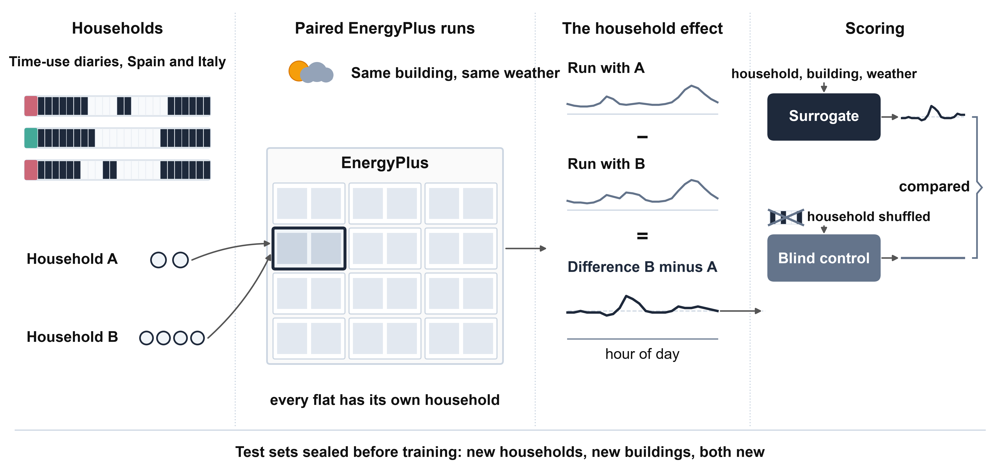
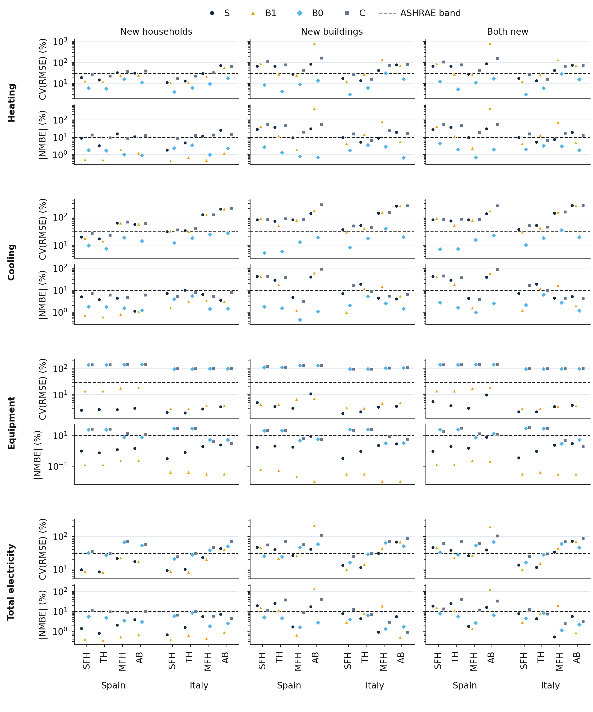
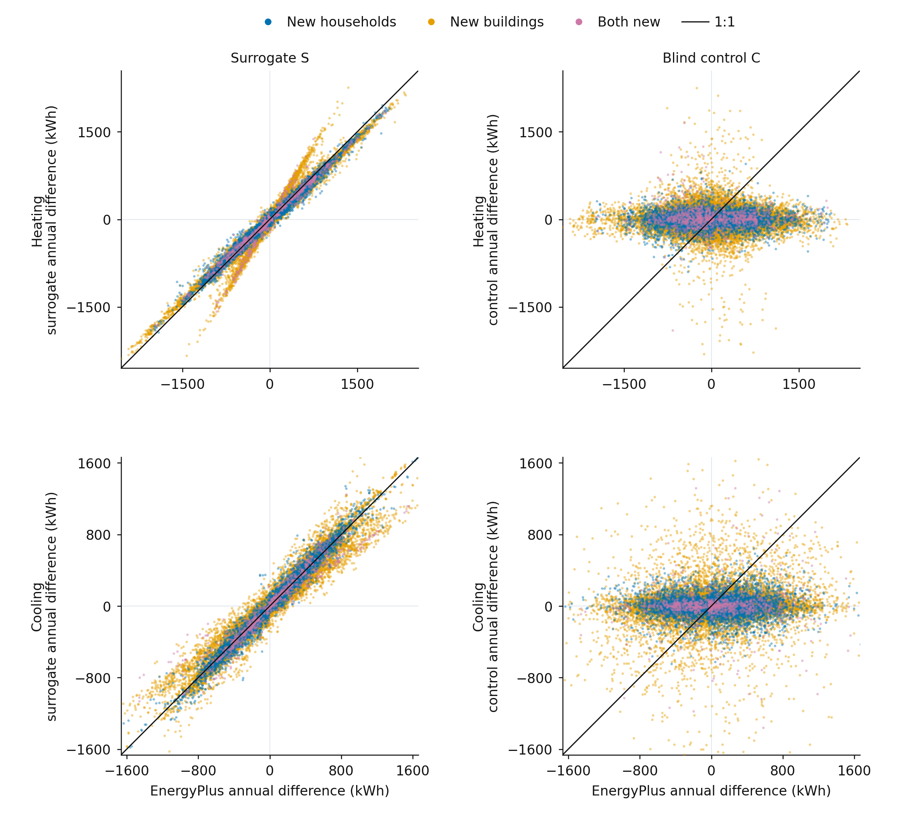
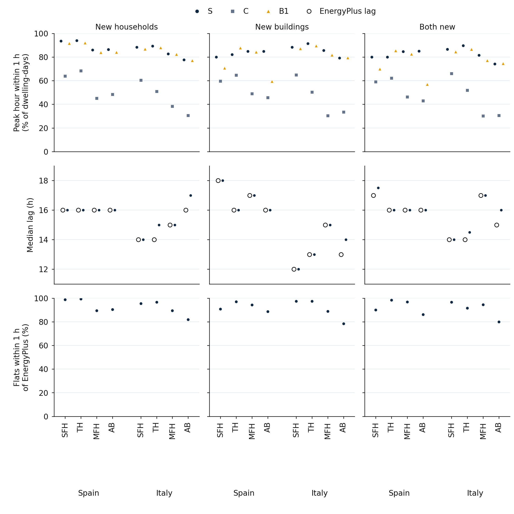
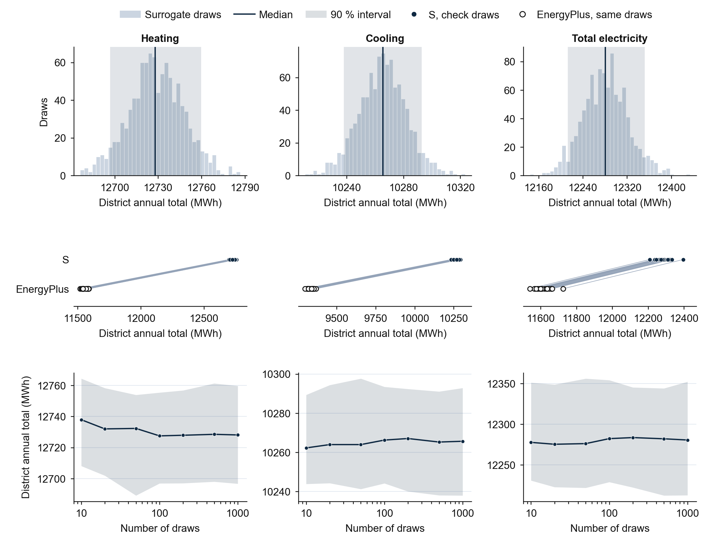

# An EnergyPlus surrogate that reproduces what households do to building loads better than it reproduces the loads

## Author Information

Orcun Koral Iseri\textsuperscript{1,\*}

1 Gina Cody School of Engineering and Computer Science, Concordia University, 1455 De Maisonneuve Blvd. W., Montréal, Québec, H3G 1M8, Canada

\* *Corresponding author:* orcunkoral.oseri@concordia.ca

*ORCID:* Orcun Koral Iseri - https://orcid.org/0000-0001-7735-3363

## Abstract

A stock energy model needs many occupancy samples, and each costs one EnergyPlus run. Surrogates are fast but usually scored on the load, not on the difference occupancy makes. This study builds 9,269 paired EnergyPlus runs for Spain and Italy, changing only the household, and trains a temporal convolution network on them. The surrogate is scored on the hourly difference between two households in one flat, against a blind control given shuffled household inputs. In sealed tests of new households, new buildings and both, it gets the occupancy effect right in 31 of 32, 31 of 32 and 26 of 28 cells; the control passes in none. Hourly load meets the ASHRAE Guideline 14 bands in only 21, 14 and 14 of 32 cells. Household size and appliance level explain 73 to 98 % of the annual effect. In a Madrid district of archetype twins, it follows the draw-to-draw spread of EnergyPlus (correlation 0.97 to 0.9999), with level errors where twins leave the training range, and is 61 times faster on a GPU slice. A model trained in Spain does not carry over to Italy, and one trained in Italy only in part. Two other seeds pass far fewer cells.

## Highlights

- Surrogate gets the household effect on loads right in 31 of 32 test cells
- A blind control, given shuffled household inputs, passes the effect test nowhere
- Hourly load meets the ASHRAE bands in only 14 to 21 of 32 test cells
- Household size and appliance level explain 73 to 98 % of the annual effect
- Other training seeds and a new country pass far fewer cells

## Keywords

Building energy simulation; Surrogate model; Occupancy; Time-use survey; Paired simulation; Stock energy model; Temporal convolution network

# 1 Introduction

## 1.1 Occupancy samples are the cost of a stock model

Residential stock energy models need an hourly description of who is at home and what they do, for each type of household. These schedules usually come from national time-use surveys, in which respondents record their activities over a day (Osman and Ouf, 2021; Vosoughkhosravi et al., 2023). The modelling lineage starts with Markov-chain models of occupancy and domestic activity (Richardson et al., 2008; Widén and Wäckelgård, 2010). It continues with survey-conditioned statistical models, including the author's earlier work (Iseri et al., 2026).

Households differ, and the difference reaches the simulated load. He et al. (2015) coupled a stochastic occupancy model to EnergyPlus and ran the same house under five occupancy profiles. The hourly thermal demand differed visibly between profiles, and about 100 profiles were needed for a stable mean. A stock model that wants the spread of demand under occupancy uncertainty therefore needs many simulations per building. That cost is the reason most studies run one average schedule and lose the spread. The paired design of He et al. is the one used here: building and weather are held fixed and only the household changes, so that every difference in load belongs to the household.

## 1.2 Surrogates are fast, and are scored on the load

A learned surrogate of the simulation would remove the cost. Surrogates of building simulation exist and are fast. Pan et al. (2024) trained one bidirectional long short-term memory network per building prototype on hourly electricity and heat emission in Los Angeles County, with weather variables as the features. They reported significantly higher error rates for residential buildings than for buildings with regular operating schedules. Govindarajan et al. (2025) trained seven model types on 2,000 simulated Singapore precinct designs, hourly, with 23 independent variables covering climate, spatial logic and model parameters. Li et al. (2021) built a multilayer perceptron and a recurrent surrogate of one research test building from 4,000 runs, with 107 input variables, to study the effect of sensor errors.

In the works read for this study, none of these surrogates is scored on differences between households. In Pan et al. occupancy is not an input and the schedules are fixed by prototype. Govindarajan et al. do not name occupancy among their inputs. The abstract of Li et al. does not list the 107 inputs, and its purpose is sensitivity to sensor errors, not to households. Two works couple stochastic occupancy to EnergyPlus without a surrogate: He et al. (2015), above, and Dabirian et al. (2025), who learn an occupancy generator for office buildings from campus electricity and score occupant counts. A surrogate can match the total load closely while ignoring occupancy, because occupancy moves the load only a little. Park and Park (2023) made the same point for retrofit design. Four neural surrogates with low root-mean-square error did not predict the causal relationships between input variables and energy use, that is, the savings that a design change brings. They proposed a workflow to check whether a surrogate reproduces these relationships. The idea of scoring on differences comes from that work. This study applies it to occupancy, and adds a control that must fail: a model of the same design that is not allowed to see the household. Table A.1 in Appendix A positions the study against the works read.

## 1.3 Aim and contributions

The study asks whether a surrogate trained on paired EnergyPlus runs reproduces the effect that a household has on hourly heating, cooling and electricity, and how this compares with its accuracy on the load itself. The score rules, the claim rule and the test sets were fixed before any model saw a test run. The study makes four contributions, stated as what was done and found.

1. It builds a paired campaign of 9,269 EnergyPlus runs for Spain and Italy, with sealed test sets for new households, new buildings and both. Every flat of every apartment building is a test unit, with its own household.
2. It shows that a temporal convolution network gets the occupancy effect right in 31 of 32, 31 of 32 and 26 of 28 test cells, while its absolute hourly load meets the ASHRAE Guideline 14 bands in 21, 14 and 14 of 32 cells.
3. It shows that the occupancy-effect test measures something. The blind control passes in no cell, and a stand-in made from EnergyPlus plus 10 % noise meets the load bands in 32 of 32 validation cells but fails the occupancy effect in 15 of 32.
4. It reports the limits of the result: dependence on the training seed, no transfer from Spain to Italy and only partial transfer from Italy to Spain, and an annual effect that is mostly a level effect of household size and appliance use. It also tests the surrogate on a district of archetype twins of 100 Madrid buildings: the draw-to-draw spread of EnergyPlus is followed, the level is biased most where twins lie outside the training range, and the speed gain needs a GPU.

Section 2 sets out the data, the campaign, the models and the scoring. Sections 3 and 4 report and discuss the results, Section 5 states the limitations and Section 6 concludes.

# 2 Methods

Figure 1 summarises the design. One building and one weather year are held fixed, many households are run through them with EnergyPlus, and the surrogate is trained and scored on the hourly difference between two households. Every threshold used in scoring was fixed in writing before the test sets were opened. The test sets were sealed before any model was trained.

**Figure 1.** - Design of the study. One building and one weather year receive different households; the surrogate is scored on the hourly difference between two households in the same flat.

## 2.1 Household data and schedules

The occupancy source is the Harmonised European Time Use Surveys (HETUS; Eurostat, 2009) diaries of two countries: Spain 2009-10 (INE, 2011) and Italy 2013-14 (ISTAT, 2016). Both are anonymised microdata released by their publishers, and no data were collected from people for this study. The Spanish diaries comprise 430,754 episodes and the Italian diaries 1,077,657 episodes. [Author ruling pending (finding 5J-3): the generated diary days come from a generator that was very probably trained with the United Kingdom Time Use Survey among its data; how this is stated depends on the ruling.]

Each household keeps its real HETUS composition. Every person-day of a household is drawn, with replacement, from one pool of 5,200 generated days per country, produced by the diary generator of the preceding study of the series. The pool is shared by all splits (Section 5). The diary-to-schedule tools of that study turn each household-year into two hourly series per flat: the fraction of members present and the fraction of the appliance load that is active. Appliance electricity follows the activities recorded in the diary, with the secondary activity included, and appliance cycles are calibrated to the published stock mean of the CREST demand model (Richardson et al., 2010). Diaries start in the early morning and EnergyPlus reads from midnight, so each year of schedules is rotated to midnight once. The drivers given to the building are the number of people at home (members times presence) and the appliance power (the household's appliance design level times the active fraction). Lighting is not modelled.

Each country has 60 households, drawn with the survey weights in strata by household size. They are split 40, 10 and 10 into development, validation and test households. The household weight is the person weight of the lowest-numbered member. Households have one to five members; Spain has none above four. Besides the real households, each country has one average household, whose schedule is the mean of its 60 households. The Spanish average household has 1.97 people and an appliance use of 2307 kWh per dwelling-year, and the Italian one has 2.07 people and 2094 kWh.

## 2.2 Buildings and simulation

Buildings are TABULA residential archetypes (Loga et al., 2016). Each country has 40 buildings, ten in each of four classes: single-family house (SFH), terraced house (TH), multi-family house (MFH) and apartment building (AB). The 40 Spanish buildings are built from 24 TABULA codes and the 40 Italian buildings from 32. Infiltration is sampled between 0.3 and 1.0 air changes per hour, and orientation is sampled. Buildings are split into 30 development, 5 validation and 5 test buildings per country, and every class appears in every split.

Every building has floors and thermal zones. A building has as many floors as TABULA gives for it. For MFH and AB the number of dwellings per floor is the TABULA dwelling count divided by the number of storeys, rounded half up and at least one, so that the modelled dwelling count follows TABULA to within three flats in the buildings where rounding changes it. Each dwelling is one thermal zone, with its own household. For SFH and TH one dwelling is modelled, as one zone per floor. The largest buildings hold 77 dwellings in Spain and 48 in Italy. A modelled building therefore has several flats that exchange heat through shared floors and party walls, and every flat is a training or test row.

Simulations use EnergyPlus 23.1 (Crawley et al., 2001; U.S. Department of Energy, 2023) through a wrapper built on the preceding study's archetype builder. Heating is set at 20 °C and cooling at 26 °C, delivered by ideal loads without capacity limit. The fixed internal gain of the archetype is set to zero, and the internal gain comes from the people and appliances of the household. There is no shading and no night ventilation. Each flat is scored on four hourly targets over one year (8,760 values): heating, cooling and equipment electricity from EnergyPlus, and total electricity, which is equipment plus heating divided by 3.0 plus cooling divided by 3.0. The value 3.0 is an assumed seasonal efficiency for both heating and cooling. The interior-wall resistance is also an assumption. A run takes from 4 s for a house to 75 s for the 77-dwelling building. The weekday of 1 January in the input files is set to Sunday, and no schedule or setting in the input reads the weekday, so no result depends on it. The surrogate receives the true calendar weekday of the diary year.

## 2.3 Campaign, splits and seal

Each country has three climates, each an ERA5 weather year (Hersbach et al., 2020) converted to an EnergyPlus weather file: Madrid, Valencia and Seville for 2010, and Bologna, Turin and Milan for 2014. The root-mean-square error of the monthly mean dry-bulb temperature against TABULA's published monthly values is 4.73, 1.62 and 2.30 °C for Madrid, Valencia and Seville, and 3.67, 2.96 and 3.17 °C for Bologna, Turin and Milan.

For SFH and TH, all 60 households of the country run once in every building and climate, which gives 1,800 runs per class and country. For MFH and AB, every flat is tested. Each run fills the flats of one building from one household pool, in permutations of that pool. Every household sits in at least three distinct flats of every MFH and AB building, and the placement is the same in the three climates of a country. In addition, every country has one run per building and climate with the average household in every flat, and 100 replicate runs: 10 inputs, each run 10 times. The replicates measure the noise of the engine. Table 1 gives the counts.

**Table 1.** - Campaign and splits, by country.

| | Spain | Italy |
|---|---:|---:|
| Climates | 3 | 3 |
| Buildings (SFH, TH, MFH, AB, 10 each) | 40 | 40 |
| Households (development, validation, test) | 40, 10, 10 | 40, 10, 10 |
| Buildings (development, validation, test) | 30, 5, 5 | 30, 5, 5 |
| SFH runs | 1,800 | 1,800 |
| TH runs | 1,800 | 1,800 |
| MFH runs (development, validation, test) | 318, 87, 87 | 312, 84, 84 |
| AB runs (development, validation, test) | 288, 84, 84 | 123, 39, 39 |
| Average-household runs | 120 | 120 |
| Replicate runs | 100 | 100 |
| Total runs | 4,768 | 4,501 |

All 9,269 runs completed, with zero severe errors and 8,760 hourly values per flat. The 200 replicate runs gave identical results, so the spread of EnergyPlus on identical input is 0 kWh for every target and class. The test runs are in three lists. A test run is new in its household, its building or both. The list of new households has 1,107 runs, the list of new buildings 813 and the list of both new 207. In the last list, new households live in new buildings, which is the case that a stock model meets. All lists were written to read-only files before any model was trained, and the data loader refused to open a test list until the scoring rules had been frozen by checksum.

## 2.4 Models

Four models are compared. All take the same inputs and predict the same three targets, and the total electricity is computed from them.

**Inputs.** For every flat and hour the model receives what EnergyPlus receives, and nothing that EnergyPlus computes. The household drivers are the presence fraction, the appliance fraction, the member count and the appliance design level. The neighbour drivers are the mean number of people at home and the mean appliance power of the flats on the same floor, on the floor above and on the floor below, with a flag when such a flat does not exist. The weather variables are dry-bulb temperature, dew point, relative humidity, global horizontal, direct normal and diffuse horizontal radiation, and wind speed. Calendar variables are the hour of the day and the day of the year, each as sine and cosine, and the weekday of the diary calendar. The static vector holds the class, every numeric field of the building and archetype rows, the north axis as sine and cosine, the number of floors, the dwellings per floor, the flat's floor index, flags for top and ground floor, and the flat's conditioned floor area from the builder geometry. No household, building or run identifier is an input, and no EnergyPlus output, past or present, is an input. A window holds 168 hours of drivers before the day and the 24 hours predicted, and the model predicts 24 hours. For the opening seven days of the year, the history is taken from the end of the same year.

Static inputs are standardised with the development mean and standard deviation and then clipped to the development range of each column, for every split, so that a network is not asked to extrapolate a linear input far beyond training. Without the clip, windows with any static input more than ten standard deviations from the training mean carried about ten times the validation error of the rest (Section 5, TABULA volume). The tree baseline already bins every value above the training maximum into its last bin, so the clip gives the network the information that the trees have, and no more.

**B0, the average household.** B0 predicts, for each flat, the run with the average household in the same building and climate. Its occupancy effect is zero by construction.

**B1, boosted trees.** B1 is one histogram-based gradient-boosted regression tree model per target (Pedregosa et al., 2011; Ke et al., 2017), trained on hourly rows with the current drivers, lags of 1, 2, 3, 6, 12, 24, 48 and 168 hours of the people at home, appliance power and dry-bulb temperature, rolling 24 and 168 hour means, the neighbour drivers, the calendar variables and the static vector. Training uses a fixed random sample of at most 6 million flat-hours. Twenty random configurations of learning rate, leaf count, minimum leaf size and regularisation were tried, and the best on a fixed sample of 2 million validation flat-hours was kept. B1 is the reference for the skill score in Section 2.5. Its outputs are clipped at zero for heating, cooling and equipment, and its total electricity is computed from the clipped values, exactly as for the network. Unclipped, B1 predicted below zero in 29 % of the heating hours and 36 % of the cooling hours of the validation runs. The network was chosen against the unclipped B1, and the same network is chosen against the clipped one.

**S, the surrogate.** S is a sequence model in two families on the same windows: a temporal convolution network with dilated causal convolutions (Bai et al., 2018) and a receptive field of at least 192 hours, and a Transformer encoder (Vaswani et al., 2017) over the 192 hours with the static vector as one extra token. The grid has 8 configurations per family: width 64 or 128, depth small or large (8 or 16 convolution blocks; 3 or 6 Transformer layers) and a pair-loss weight of 0 or 1. The loss is the mean squared error on standardised targets, summed over the three targets, plus the pair-loss weight times the mean squared error of the paired difference. Each batch holds pairs of development runs in the same building, climate and flat, with different households, on the same day, and the pair term compares the difference of the predictions with the difference of EnergyPlus. Training uses the AdamW optimiser, a learning rate of 1e-3 with cosine decay, at most 30 epochs of 400,000 windows, early stopping with patience 4 on the validation loss (level plus pair term) and a limit of 4 GPU-hours per configuration, on one 20 GB slice of an A100 GPU. The three heating, cooling and equipment outputs are clipped at zero. Seed 1 is used for the grid.

The three best configurations of each family by validation loss were written out for all validation runs and scored by the frozen scorer. The pinned model is the one with the most passing cells on the occupancy effect, then the highest median R² over the heating and cooling cells. It is a temporal convolution network of width 64 with 16 blocks, pair-loss weight 1, seed 1, trained to the best epoch (16 of 20). A reload of the saved weights reproduces its validation loss exactly. Its weights, and those of every other model in this study, are Spain- and Italy-trained only.

**C, the blind control.** C has the configuration of S and differs only in its training data. For every flat of every development run, the household drivers and the neighbour drivers are taken from a random other development run of the same country. Building, weather and targets are unchanged. The same rule shuffles the validation and test inputs. C is trained with seeds 1, 2 and 3.

**Seeds and one-country models.** S is also trained with seeds 2 and 3. These runs are reported next to the pinned model and are never used to change a claim. For the new-country test, the pinned configuration and B1 are trained on the development runs of one country only, with the climate one-hot columns dropped and the static statistics taken from that country.

Two asymmetries between the models are stated. B1 is tuned on hourly error alone, whereas S also sees the pair term and is chosen on it. The configuration for the one-country models was chosen on validation data that include the held-out country.

## 2.5 Scoring

**Unit.** A pair is two runs in the same building and climate that have different households in the same flat. For SFH and TH, where a run holds one dwelling, this is exactly the paired design of He et al. (2015). For MFH and AB, the neighbours of the flat differ between the two runs, so the difference contains a neighbour effect, which is a limitation and is not removed. Every score is computed per class (SFH, TH, MFH, AB), per country and per target, called a cell, and is never pooled across classes, countries or targets. The occupancy effect of a pair is the hourly difference between the two households in the flat.

**Load accuracy.** For each run and target, the coefficient of variation of the root-mean-square error CV(RMSE) and the normalised mean bias error NMBE are computed over all dwelling-hours of the run. A cell passes when its median run is inside both ASHRAE Guideline 14 hourly bands: CV(RMSE) of at most 30 % and an absolute NMBE of at most 10 % (ASHRAE, 2002, clause 5.3.2.4 f). The guideline is written for calibration against measured data, so the bands are used as a reference.

**Occupancy effect.** For each cell, the coefficient of determination R² is computed on the hourly pair differences, pooled over all pairs of the cell, as one minus the sum of squared errors of the predicted difference over the sum of squares of the EnergyPlus difference about its mean. The annual sign agreement is the share of pairs above the noise floor for which the predicted annual difference has the sign of the EnergyPlus one. The skill over B1 is the R² of S minus the R² of B1, with a 95 % percentile interval from 2,000 two-way cluster bootstrap resamples (Davison and Hinkley, 1997) that draw buildings and households with replacement, independently, so that hours and runs are never the resampling unit. A cell passes the occupancy effect when R² is at least 0.5, the sign agreement is at least 80 % and the skill interval excludes 0. A cell with fewer than 30 pairs above the floor, or with an undefined R², is not evaluable and counts as not passed.

The noise floor is the spread of the annual total over the 10 repeats of one input. It was measured as 0 kWh for every target and class, so a pair is above the floor when its annual difference is not zero at the resolution of the files (eight significant digits, with a guard of 0.001 kWh per pair-year). The replicate inputs include no terraced house, and the terraced-house floor is taken equal to that of the other classes.

**Blind control.** C is scored exactly as S, with the same pairs, the same B1 and the same bootstrap. The control does its job when it fails the occupancy effect. If it passed, the occupancy-effect test would measure nothing and would be withdrawn.

**Peak.** For each dwelling and day, the hour of the largest total electricity value is compared between S and EnergyPlus. A day is a hit when the hours differ by at most one hour, circularly over 24 hours, and a cell passes when at least 70 % of its dwelling-days are hits.

**Reported analyses.** Three analyses are reported without a pass rule. The presence-heating timing lag is the lag of the maximum of the cross-correlation between the people at home and the hourly heating, for S against EnergyPlus, flat by flat. It is a like-for-like check and not a building time constant. The share of the annual pair effect explained by level is the share of the variance of the annual pair effect that is explained by the pair's difference in annual mean people at home and in annual appliance energy, in a regression on the EnergyPlus truth and the same for S. Cooling in the milder climates is reported per climate and class. A timing-only control with the drivers replaced by their annual means is not used, because constant drivers lie far outside anything the network saw in training.

**Claim rule.** The claim rule was written before any test prediction existed. For each target and test list, S's passing cells are counted over its eight cells (two countries by four classes). The claim holds when at least 6 of 8 cells pass and at least 3 of 4 cells pass in each country. It holds partly when 3 to 5 cells pass, or when 6 or more pass with one country below 3 of 4. It does not hold when 2 or fewer pass. A cell that is not evaluable counts as not passed and is named. If the blind control passes in 2 or more of the 8 cells, the claim for that target and list is withdrawn. Heating and cooling on the list of both new, the case a stock model meets, lead the results. Equipment and total electricity are reported in their own sentence: their hourly values follow the input schedule, so passing says little about building physics.

**Checks of the scorer.** Before any model was trained, the scorer was run on stand-ins made from the validation truth. A stand-in made of EnergyPlus plus Gaussian noise with a standard deviation of 10 % of the run's hourly standard deviation, independent per run, meets the load bands in 32 of 32 validation cells. The scorer was also run on null pairs of two independent copies of such a stand-in, and 99.98 % of 6,400 skill intervals contained 0, against a requirement of 93 %. The scorer's pair statistics were checked against a direct computation from the files on 20 random pairs.

**Test scoring.** The sealed test lists were scored once, with a test mode of the frozen scorer that differs from it only in the lists it accepts and in the check that the freeze checksum exists. The scorer records every test-truth file it opens.

## 2.6 District demonstration

The district demonstration tests what the speed of the surrogate buys: the spread of district demand under occupancy uncertainty, and whether the surrogate reproduces EnergyPlus on it.

The district is built from archetype twins of 100 real Madrid buildings. The 100 buildings are sampled from the 1,151 eligible buildings of the Madrid stock of the preceding study (11,976 dwellings), stratified by class in proportion, with at least 5 per class and a fixed seed, and the list is sealed before any surrogate or EnergyPlus run. Each real building becomes a twin: the archetype builder of Section 2.2 is fed with the building's TABULA code, infiltration and orientation are sampled as in the campaign, because they are unknown for real buildings, and the weather is Madrid 2010. Geometry, dwelling count and envelope come from TABULA. What is real is the mix of classes and construction periods. The real dwelling count of each building is listed next to its twin's. A twin is out of range when any of its static inputs is clipped, and seen when its code was a development building.

The household pool holds the 60 campaign households of Spain and 500 further Spanish households, drawn from the 9,541 in the same weighted manner as the campaign households. A draw gives every dwelling of every twin one household, sampled with replacement from the pool with equal probability, each dwelling independently. The pool is itself a weighted sample of the Spanish households, so a second weighting would count the survey weights twice.

The pinned surrogate predicts every dwelling of the district for each draw, and the district hourly demand of a draw is the sum over its dwellings, for heating, cooling, equipment and total electricity. The number of draws is the largest of 1,000, 500 and 200 whose surrogate time fits a budget of 24 GPU slice-hours in total, set from the timing of 10 draws. The budget allowed 1,000 draws. Reported quantities are the median and 90 % interval of the annual and the peak-hour district demand, and the running median and interval width against the number of draws.

The surrogate is checked against EnergyPlus on 20 draws chosen by a recorded seed before any surrogate output exists. Every twin of these draws is run through EnergyPlus with the archetype builder, which makes 2,000 runs. After an integrity check, S and EnergyPlus are compared per dwelling and per draw (CV(RMSE) and NMBE per target), on the district total of annual and peak-hour demand, and on whether the 20-draw spread of the annual total is reproduced. Results are split by in range and out of range, and by seen and new code and household. Speed is the median wall time per dwelling-year of EnergyPlus (build, run and extract, on one CPU) against the surrogate on one slice of an A100 GPU and on one CPU core. On the GPU the surrogate is timed with district output only (district hourly totals and annual totals per dwelling) and with an hourly file for each dwelling; on the CPU core it is timed with district output. Loading the model and the data, prediction and writing are in the time of the surrogate. Building the input table of a draw is not.

The sample holds 5 single-family, 5 terraced, 5 multi-family and 85 apartment-building twins, built from 14 TABULA codes. Of the 100 twins, 78 have a code that was a development building and 22 have a code that was not. Each twin has the dwelling count of its archetype, so the 100 twins hold 2,034 dwellings per draw against 1,173 in the real buildings (single-family 5 against 7, terraced 5 against 5, multi-family 62 against 43, apartment buildings 1,962 against 1,118). Seventeen twins, holding 871 of the 2,034 dwellings, are out of range, mostly the ten twins of the largest apartment-block archetype, which has 77 dwellings. All 2,000 EnergyPlus runs of the check completed and passed the integrity check; its two tests that need replicate runs and average-household runs do not apply to a district.

# 3 Results

Section 3.1 gives the model selection on validation data. Sections 3.2 to 3.4 give the scores of the sealed test sets, in the order of the research questions: load accuracy, occupancy effect and blind control. Section 3.5 gives peaks and timing, Section 3.6 separates level from timing, Section 3.7 gives the new country, and Section 3.8 gives the district demonstration. Verdicts are reported as the scorer printed them. Table 2 counts, per model and test list, the cells that pass.

## 3.1 Model selection on validation data

Sixteen configurations were trained, eight per family. The six shortlisted configurations passed the occupancy-effect test in 29, 30, 30, 30, 22 and 30 of 32 validation cells. Four configurations tie at 30 cells, and the pinned model was chosen from them by the highest median R² over heating and cooling, 0.820 against 0.795, 0.753 and 0.767 for the other three. Scored against B1 clipped at zero, as from the test stage on, the six pass in 28, 30, 30, 30, 20 and 29 cells, and the choice is the same. The two temporal convolution networks that differ only in the pair-loss weight (width 64, large) pass 29 cells without the pair term and 30 with it, so the pair term is not the main source of the advantage. On the validation runs the pinned model passes the occupancy effect in 30 of 32 cells and the load bands in 19 of 32. The average-household baseline B0 passes the load bands in 18 of 32 cells and the occupancy effect in none. The tree baseline B1 passes the load bands in 22 cells and the occupancy effect in 25, measured against B0, and in 26 once clipped at zero.

The training seed matters. The same configuration trained with seeds 1, 2 and 3 passes the occupancy effect in 30, 22 and 13 of 32 validation cells, with median heating and cooling R² of 0.82, 0.73 and 0.67. Seeds 2 and 3 stopped early, at epochs 4 and 2. The blind control passes in no validation cell at any of its three seeds, and its median heating and cooling R² is -0.10, -0.10 and -0.13. Part of the pinned model's validation margin is therefore seed luck plus selection on the same data. For this reason seeds 2 and 3 are also scored on the test sets.

## 3.2 Load accuracy on the test sets

**Table 2.** - Cells that pass, by model and test list. Load accuracy: median run inside the ASHRAE Guideline 14 hourly bands. Occupancy effect: hourly R², annual sign and skill over B1. B1 is the reference of the skill score. Seeds 2 and 3 are the pinned configuration retrained.

| Model | Load accuracy, new households (of 32) | Load accuracy, new buildings (of 32) | Load accuracy, both new (of 32) | Occupancy effect, new households (of 32) | Occupancy effect, new buildings (of 32) | Occupancy effect, both new (of 28) |
|---|---:|---:|---:|---:|---:|---:|
| S, pinned (seed 1) | 21 | 14 | 14 | 31 | 31 | 26 |
| S, seed 2 | | | | 17 | 23 | 14 |
| S, seed 3 | | | | 11 | 21 | 11 |
| C, blind control | 6 | 2 | 2 | 0 | 0 | 0 |
| B1, boosted trees | 24 | 14 | 14 | | | |
| B0, average household | 19 | 19 | 18 | 0 | 0 | 0 |

The pinned model meets the load bands in 21 of 32 cells for new households and in 14 of 32 for new buildings and for both new. The tree baseline meets them in 24, 14 and 14, and the average household in 19, 19 and 18. On new buildings the pinned model therefore meets the bands in fewer cells than the average household does. On new buildings S misses the bands for heating and cooling in most Spanish classes, with a median absolute NMBE of 28 to 42 % for SFH, TH and AB, and for cooling in the Italian MFH and AB classes, with a CV(RMSE) of 135 to 252 %. The model that cannot see the household, C, meets the bands in 6, 2 and 2 cells. Figure 2 shows the median CV(RMSE) and NMBE of each cell against the bands.

**Figure 2.** - Load accuracy on the sealed test sets: median hourly CV(RMSE) and median |NMBE| of each class, country and target for S, B1, B0 and the blind control C, on a log scale, against the ASHRAE Guideline 14 hourly bands (dashed: 30 % and 10 %).

## 3.3 Occupancy effect on the test sets

Figure 3 shows the key result. For the list of new households, S passes the occupancy-effect test in 31 of 32 cells. For new buildings it passes in 31 of 32 and for both new in 26 of 28. The four cells of the Italian apartment buildings on the list of both new are not evaluable, because that class has no pairs in that list. The three lists hold 6,285, 18,975 and 1,059 pairs.

**Figure 3.** - Occupancy effect on the sealed test sets: annual difference between two households in the same flat, predicted by S (left) and by the blind control C (right) against the EnergyPlus difference, for each target.

Each cell that does not pass has its own cause. For new households, the Italian apartment-building heating cell has an R² of 0.81, which meets the R² bar, but its skill interval over B1 contains 0. For new buildings and for both new, the Spanish single-family heating cell has an R² of 0.42 and 0.38, and B1 does better, with a skill interval below 0. For both new, the Spanish apartment-building heating cell has a skill interval that contains 0. All of these are heating cells.

By the claim rule of Section 2.5 the claim holds in 11 of 12 target and list combinations (Table 3). Heating on the list of both new holds only partly, with 5 of 8 cells (Spain 2 of 4, Italy 3 of 4, and the Italian apartment-building cell not evaluable). Heating holds on new households (7 of 8 cells) and on new buildings (7 of 8). Cooling holds on all three lists, and so do equipment and total electricity. The blind control never triggers the withdrawal of a claim. Equipment and total electricity follow the input schedule, so their agreement says little about building physics, and the claim rests on heating and cooling.

**Table 3.** - Claim table. Cells of S that pass the occupancy-effect test, out of 8 (2 countries by 4 classes), and the verdict of the claim rule. Seeds 2 and 3 are the pinned configuration retrained and are reported only.

| List | Target | S: cells passed | Spain (of 4) | Italy (of 4) | Not evaluable | S: verdict | Seed 2: cells, verdict | Seed 3: cells, verdict |
|---|---|---:|---:|---:|---|---|---|---|
| Both new | Heating | 5 | 2 | 3 | Italy AB | partly | 0, does not hold | 0, does not hold |
| Both new | Cooling | 7 | 4 | 3 | Italy AB | holds | 4, partly | 2, does not hold |
| Both new | Equipment | 7 | 4 | 3 | Italy AB | holds | 5, partly | 4, partly |
| Both new | Total electricity | 7 | 4 | 3 | Italy AB | holds | 5, partly | 5, partly |
| New households | Heating | 7 | 4 | 3 | none | holds | 1, does not hold | 0, does not hold |
| New households | Cooling | 8 | 4 | 4 | none | holds | 4, partly | 3, partly |
| New households | Equipment | 8 | 4 | 4 | none | holds | 5, partly | 4, partly |
| New households | Total electricity | 8 | 4 | 4 | none | holds | 7, holds | 4, partly |
| New buildings | Heating | 7 | 3 | 4 | none | holds | 4, partly | 4, partly |
| New buildings | Cooling | 8 | 4 | 4 | none | holds | 5, partly | 4, partly |
| New buildings | Equipment | 8 | 4 | 4 | none | holds | 7, holds | 6, holds |
| New buildings | Total electricity | 8 | 4 | 4 | none | holds | 7, holds | 7, holds |

The claim belongs to the pinned model. The same configuration trained with seed 2 passes the occupancy-effect test in 17, 23 and 14 cells on the three lists, and with seed 3 in 11, 21 and 11 (Table 2). By the claim rule, seed 2 holds in 3 of the 12 target and list combinations and seed 3 in 2, and neither holds for heating on any list. The success of the configuration therefore depends strongly on the training seed. Every claim in this paper is a claim about the pinned model, and the three-seed range stands next to each of them.

## 3.4 The blind control and the scorer

The blind control C passes the occupancy-effect test in 0 of 32, 0 of 32 and 0 of 28 cells, and its three seeds pass none on the validation runs. In every one of these cells the control does not pass, as it must (32 of 32, 32 of 32 and 28 of 28 control lines, the last list having 4 cells that are not evaluable). The test therefore separates a model that sees the household from one that does not.

Two checks on the scorer support the same reading. A stand-in made of EnergyPlus plus 10 % independent noise meets the load bands in 32 of 32 validation cells, and fails the occupancy-effect test in 15 of the 32, in every heating and cooling cell but one. Independent noise of this size in each run swamps the small hourly occupancy effect. The average household, with no occupancy information, meets the load bands in 18 of 32 validation cells and in 19, 19 and 18 test cells. A pass on the load bands therefore does not show that a model has used the household.

## 3.5 Peaks and presence-heating timing

The daily peak of total electricity is within one hour of EnergyPlus on at least 70 % of dwelling-days in 8 of 8 cells on each of the three lists.

The presence-heating timing lag of S equals that of EnergyPlus in most cells. The median lags of EnergyPlus lie between 12 and 18 hours, and between 78 % and 99 % of the flats of a cell have an S lag within one hour of the EnergyPlus lag. The widest gap is in the Italian apartment buildings on the list of new buildings, where the median lag is 13 hours for EnergyPlus and 14 hours for S, with 78 % of flats within one hour. A check that plants a 6 hour shift in the heating series was detected on the lists of new households and of both new. On the list of new buildings it could not run, because the chosen flat's lag left no room for a 6 hour shift, so the check is not evaluable there; the reported lags are unaffected.

Cooling in the milder climates is reported per climate and class on the list of new buildings. The R² of the annual cooling pair effect lies between 0.7216 (Turin, apartment buildings) and 0.9988 (Bologna, single-family houses). The annual cooling total itself is less well reproduced: its median relative error runs from -44 % (Madrid, single-family houses) to +205 % (Turin, apartment buildings).

**Figure 4.** - Top: share of dwelling-days whose peak total-electricity hour is within one hour of the EnergyPlus peak, for S, C and B1. Middle: median presence-heating lag of EnergyPlus (open circles) and S by country and class. Bottom: share of flats whose S lag is within one hour of the EnergyPlus lag. Columns: the three test sets; within each panel, Spain (left) and Italy (right).

## 3.6 Size versus timing

Two households differ in size and appliance level as well as in timing. For each cell, the share of the variance of the annual pair effect that is explained by the pair's difference in annual mean people at home and in annual appliance energy is 73 to 98 % in EnergyPlus and 79 to 98 % for S, over the three test lists, heating and cooling. Most of the occupancy effect on annual energy is therefore a level effect. A smaller part, 2 to 27 % in EnergyPlus, is left for timing. A passing cell on the occupancy effect shows that the surrogate reproduces the hourly difference between households, which includes this level effect. It does not show that it reproduces timing alone.

## 3.7 A new country

Table 4 gives the scores of the one-country models on the test lists of the held-out country, reported and not gated. Only the lines of the held-out country count.

**Table 4.** - Cells that pass, for models trained on the development runs of one country and scored on the other country (16 cells per list).

| Trained on, scored on | Occupancy effect: new households | Occupancy effect: new buildings | Occupancy effect: both new | Load accuracy: new households | Load accuracy: new buildings | Load accuracy: both new |
|---|---:|---:|---:|---:|---:|---:|
| Spain, Italy | 0 | 3 | 2 | 2 | 4 | 4 |
| Italy, Spain | 9 | 10 | 9 | 3 | 4 | 4 |

The surrogate trained in Spain does not carry to Italy: it passes the occupancy-effect test in 0 to 3 of 16 cells (12 evaluable for both new). The surrogate trained in Italy partly carries to Spain, in 9 to 10 of 16 cells. The load accuracy is low in both directions. These models have half the training runs of the pinned model, so the comparison with the two-country result mixes a new country with less data.

## 3.8 District demonstration

The district holds 2,034 dwellings per draw, and the 1,000 draws differ only in the households. The district annual demand has a median and 90 % interval of 12,728 MWh (12,697 to 12,760) for heating, 10,266 MWh (10,238 to 10,293) for cooling, 4,616 MWh (4,549 to 4,688) for equipment and 12,281 MWh (12,213 to 12,352) for total electricity. The district peak-hour demand has 8,935 kWh (8,926 to 8,945) for heating, 10,714 kWh (10,692 to 10,736) for cooling, 1,308 kWh (1,265 to 1,357) for equipment and 4,327 kWh (4,292 to 4,367) for total electricity. The intervals are narrow: 0.5 % of the median for annual heating and cooling and 3.0 % for annual equipment, because the households of 2,034 dwellings average out. The medians settle fast: from 100 draws on they stay within 0.1 % of their value at 1,000 draws for every annual total and for the peak hour of heating, cooling and total electricity, and within 0.3 % for the equipment peak; He et al. (2015) needed about 100 profiles for a stable mean of one house. The width of the 90 % interval settles more slowly: the width from the first 500 draws is within 6 % of the width from all 1,000 draws for every target, and within 5 % for five of the eight. For the twins in range alone, the annual medians and 90 % intervals are 7,788 MWh (7,764 to 7,811) for heating, 5,921 MWh (5,902 to 5,940) for cooling, 2,588 MWh (2,541 to 2,642) for equipment and 7,158 MWh (7,112 to 7,211) for total electricity. Figure 5 shows the distributions. These medians carry the level error of the surrogate reported below.

The surrogate was checked against EnergyPlus on 20 draws, 40,680 dwelling-years in all, after the integrity check of the 2,000 runs (Section 2.6). Table 5 gives the scores per dwelling. Over all dwellings the median CV(RMSE) is 38.6 % for heating, 106.3 % for cooling, 3.5 % for equipment and 29.9 % for total electricity, and the pooled annual NMBE is +10.2, +10.0, -0.7 and +5.8 %. The error depends on where the twin lies. For twins in range the median CV(RMSE) is 27.1 % for heating and 21.9 % for total electricity, with a pooled NMBE of -7.6 and -2.5 %. For twins out of range it is 165.1 % and 67.0 %, with +58.1 and +20.0 %. Splitting by building code gives the same picture: codes that were development buildings have a heating CV(RMSE) of 25.7 % and a pooled NMBE of -9.8 %, and codes never seen in development 164.3 % and +64.0 %. For total electricity, 72 % of the dwelling-years in range are inside both ASHRAE bands, against 9 % out of range. Cooling is not accurate even in range, with a median CV(RMSE) of 75.5 %. Households that the model was trained on score like new ones: the median heating CV(RMSE) is 39.2 % for trained households and 38.5 % for new ones, and for total electricity 29.8 % and 29.9 %.

**Table 5.** - Agreement of the surrogate with EnergyPlus per dwelling over the 20 checked draws: median CV(RMSE) and pooled annual NMBE, in per cent. Range: the twin has no static input clipped to the development range. Code: the TABULA code of the twin was, or was not, a development building.

| Dwellings | Dwelling-years | Heating CV(RMSE) | Heating NMBE | Cooling CV(RMSE) | Cooling NMBE | Equipment CV(RMSE) | Equipment NMBE | Total electricity CV(RMSE) | Total electricity NMBE |
|---|---:|---:|---:|---:|---:|---:|---:|---:|---:|
| All | 40,680 | 38.6 | +10.2 | 106.3 | +10.0 | 3.5 | -0.7 | 29.9 | +5.8 |
| In range | 23,260 | 27.1 | -7.6 | 75.5 | +5.4 | 3.3 | -2.6 | 21.9 | -2.5 |
| Out of range | 17,420 | 165.1 | +58.1 | 263.2 | +17.0 | 3.9 | +1.9 | 67.0 | +20.0 |
| Code seen in development | 23,060 | 25.7 | -9.8 | 74.1 | +3.4 | 3.2 | -1.9 | 21.1 | -3.6 |
| Code never seen | 17,620 | 164.3 | +64.0 | 260.3 | +20.1 | 4.4 | +0.9 | 66.9 | +21.7 |

At district level, the 20 annual totals of the surrogate and of EnergyPlus follow each other. The Pearson correlation over the draws is 0.97 for heating, 0.98 for cooling, 0.9999 for equipment and 0.999 for total electricity, and the range of the surrogate over the 20 draws is 0.88, 0.84, 1.00 and 1.01 times that of EnergyPlus. The surrogate therefore follows the draw-to-draw spread, with a somewhat narrower spread for heating and cooling. The level has a bias, and it is largest for the twins outside the training range or with codes never seen in development. For heating, the district annual total of the surrogate is 7.6 % below EnergyPlus for the twins in range and 58.1 % above for the twins out of range, which gives +10.2 % over all twins. The twins out of range keep a correlation of 0.99 for heating, with a range ratio of 0.80: for them the level is off while the order of the draws is kept. The district peak hour of heating falls in the same hour in the surrogate and in EnergyPlus in 20 of the 20 draws, and the peak value of the surrogate is on average 9.5 % above that of EnergyPlus. The cooling peak hour falls in the same hour in none of the 20 draws, with a peak value 3.6 % above on average. For total electricity the peak hour is the same in 9 of 20 draws, with a value 0.8 % above on average, and for equipment in 17 of 20 draws, with 0.7 %.

EnergyPlus took a median of 1.675 s per dwelling-year over the 2,000 check runs (build, run and extract on one CPU core; 1.083 s for EnergyPlus alone), 18.8 CPU-hours in all. The surrogate took 0.0275 s per dwelling-year on one 20 GB slice of an A100 GPU with district output, which is 61 times faster. With an hourly file for each dwelling it took 0.121 s, 14 times faster, because most of that time is spent writing the files. On one CPU core it took 1.384 s, 1.2 times faster, which is about the speed of EnergyPlus. The speed gain of the surrogate therefore needs a GPU. Its time includes loading and writing and does not include building its input table, which takes a few seconds per draw on a CPU. The 1,000 draws of the district, with 2,034 dwelling-years each, took the surrogate 15.6 GPU slice-hours. EnergyPlus at its median time would need about 950 CPU-hours for the same draws.

**Figure 5.** - District annual heating, cooling and total electricity of the Madrid twin district over 1,000 draws of households. Top: distribution of the surrogate totals, with median and 90 % interval. Middle: the 20 draws also simulated with EnergyPlus (surrogate filled, EnergyPlus open), joined per draw. Bottom: running median and 90 % interval against the number of draws.

# 4 Discussion

## 4.1 The difference is right, the level is weak

The central result is a contrast. On the sealed test sets the surrogate reproduces the effect of the household in 31, 31 and 26 cells, and meets the load bands in 21, 14 and 14. The two scores measure different things. The load bands ask whether the absolute hourly load is near the EnergyPlus load, and the occupancy-effect test asks whether the difference between two households in the same flat is. The difference is a small part of the load, and it is the part that a stock model needs when it wants the spread of demand. A surrogate can miss the level of the load and still be useful for the spread, if the level error is shared by the two households of a pair and so cancels in the difference.

The scorer checks show why the two scores are not interchangeable. A stand-in that is accurate on the load bands, with 10 % independent noise, fails the occupancy-effect test in 15 of 32 cells, and the average household, which has no occupancy information, passes the load bands in 18 or 19 of 32. Park and Park (2023) reported the same pattern for retrofit design, where low-error surrogates did not reproduce the savings. The contribution here is the occupancy version, with a control that must fail and does.

## 4.2 Why the baseline differs

B1 passes the load bands in as many cells as S on new buildings and on both new (14), and in more on new households (24 against 21). On the difference, S is better: a cell passes only if the skill interval of S over B1 excludes 0, and S passes 31, 31 and 26 cells. The cell in which B1 is clearly better is the Spanish single-family heating cell on new buildings. The sequence structure of S, with a receptive field of at least 192 hours and a 24 hour output, is one candidate reason for the advantage. The pair-loss term is not the main reason, because the configuration without it reaches 29 of 32 validation cells against 30 with it. Two asymmetries limit the comparison: B1 is tuned on hourly error only, and S also sees the pair term and is chosen on it. The experiments here do not isolate the cause of the advantage.

## 4.3 What the seed spread means for practice

The pinned model is a selected draw. Its validation result of 30 of 32 cells, and its test result of 31, 31 and 26, are not the typical result of its configuration, since the same configuration trained with two other seeds passes 22 and 13 validation cells and 17 and 11, 23 and 21, and 14 and 11 test cells. For practice the lesson is to train several seeds, to score each on a held-out validation set with the occupancy-effect test, and to use a model only if it passes. A model that passes the load bands says little about the difference between households, so the check on the difference is needed for every seed.

## 4.4 What the shared day pool means for a new household

A new household in this study has a new composition and a new sequence of days. It does not have new day content: every person-day is drawn from one pool of 5,200 generated days per country, shared by all splits, so training households used many of the same generated days. The schedule is an input to both EnergyPlus and the surrogate, and the target is the EnergyPlus response on that building, weather and calendar, so the pool does not leak the scored truth. It does limit the claim. The surrogate is shown to generalise to new households drawn from the same day distribution, not to behaviour that the pool does not hold.

## 4.5 Where the surrogate is, and is not, a stand-in

Most of the annual household effect, 73 to 98 % in EnergyPlus, is explained by household size and appliance level. A surrogate that reproduces that effect has reproduced mostly a level. These results are consistent with its use for the spread of annual household energy, where the buildings are of the kind in the campaign and the households come from the same day distribution. They do not support its use for absolute loads, for a country without training data, or for conclusions that depend on timing alone. The district test (Section 3.8) points the same way. The surrogate follows the draw-to-draw spread of the district annual totals, and the error in their level is largest for twins outside the training range or with building codes never seen in development. The speed gain of the surrogate needs a GPU: on one CPU core it is about as fast as EnergyPlus. The surrogate trained in Spain scores 0 to 3 of 16 cells in Italy, and the one trained in Italy 9 to 10 of 16 cells in Spain. A stock study in a new country needs a campaign for that country.

# 5 Limitations

This work has ten limitations. The four listed at the start bear on what the claim covers; the others concern inputs, the engine and the district demonstration.

**The truth is a simulation, built from archetypes.** The surrogate is only as good as the engine and the archetypes. Buildings are TABULA archetypes with sampled infiltration and orientation, not real geometry. The result is fidelity to EnergyPlus on these buildings, not to meter data. The district demonstration uses archetype twins of real buildings, and the dwelling count of a twin comes from TABULA: the 100 twins hold 2,034 dwellings against 1,173 in the real buildings, almost all of the gap in apartment buildings (Section 2.6). The gap is listed per building and not corrected.

**New households are new compositions, not new days.** Every person-day comes from one pool of 5,200 generated days per country, shared by all splits (Section 4.4). Test households have not been seen, but the days they live have, in part. The result holds for households drawn from the same day distribution.

**The training seed changes the result.** The pinned model passes 31, 31 and 26 cells on the three test lists. Two other seeds of the same configuration pass 17 and 11, 23 and 21, and 14 and 11, and hold for heating on no list. Each seed was trained once, and the pinned model was chosen on validation data, with part of its margin due to the seed.

**Two countries, one wave each, and limited transfer between them.** Spain and Italy are the only countries, each with one survey wave. A model trained in Spain alone does not carry to Italy, and one trained in Italy carries to Spain only in part (Section 3.7). The one-country models have half the training runs, so the transfer test mixes a new country with less data. The configuration of the one-country models was chosen on validation data that include the held-out country.

**One weather year per city.** Each climate is one ERA5 year (2010 for Spain, 2014 for Italy). The summer of 2014 in Turin is colder than TABULA's monthly values, as it is in Bologna, and this is largely the real year. A surrogate that has seen one year of each climate has not seen interannual variation.

**Ideal loads, fixed set points and assumed efficiency.** Heating and cooling are ideal loads without limit at 20 and 26 °C. There is no shading, no night ventilation and no lighting. The efficiency of 3.0 for heating and cooling, which turns the loads into total electricity, and the interior-wall resistance are assumptions. Madrid cooling per floor area is high in the pilot runs and is a property of this model. Equipment electricity is a pass-through of the schedule times the appliance design level, so agreement on equipment and total electricity says little about building physics.

**Neighbours differ between the two runs of a pair.** For apartment buildings the neighbours of a flat differ between the two runs of a pair, so the difference of a pair includes a neighbour effect, which is not removed. The effect against the average household, in which all neighbours are equal, is a secondary score that is not gated. For cells with one building, such as the single test building of a class, the bootstrap interval reflects the households only.

**The noise floor is zero.** The replicate runs gave identical results, so any non-zero pair difference is above the floor. The terraced-house floor is taken from the other classes, because no replicate input is a terraced house. EnergyPlus gave one wet-bulb warning per Madrid and Turin run at a single time step, and the weather rows there are plausible.

**One archetype has an inconsistent volume.** The TABULA conditioned volume of the largest Spanish apartment-block archetype is 151,909.56 m³ for a reference floor area of 7,507.5 m², or 20.2 m of volume per m², where all other buildings lie between 2.3 and 5.5. Its static inputs lay at 47 standard deviations against a development maximum of 2.8. EnergyPlus does not read this volume, so the simulated loads are not affected, but the surrogate does. The value is kept as the source gives it, the static inputs are clipped to the development range, and 693 validation rows of that building were clipped. The Italian dwelling counts that TABULA gives differ from the modelled count by one to three flats in four archetypes.

**The district demonstration covers one city and one weather year, and part of it lies outside what the surrogate saw.** It covers the Madrid stock for 2010, it inherits the limits above, and its twins carry TABULA geometry and not the real geometry. Part of the twins lie outside the training range or have a building code that was never a development building, and for these the level of the surrogate is poor (Section 3.8). The agreement with EnergyPlus rests on 20 draws, which differ only in the households. The speed comparison sets a GPU slice against one CPU core and leaves out the building of the input table of the surrogate. The number of draws is set by a compute budget (Section 2.6).

# 6 Conclusion

This study asked whether a surrogate trained on paired EnergyPlus runs reproduces what a household does to hourly heating, cooling and electricity, and how that compares with its accuracy on the load itself (Section 1.3). The score rules and the claim rule were fixed before the test sets were opened. The principal findings are as follows.

1. A temporal convolution network gets the occupancy effect right in 31 of 32 test cells for new households, 31 of 32 for new buildings and 26 of 28 for both new. By the claim rule the claim holds in 11 of 12 target and list combinations, and holds partly for heating on both new.
2. The blind control, given shuffled household inputs, passes the occupancy-effect test in no cell, so the test measures the use of the household.
3. The absolute hourly load meets the ASHRAE Guideline 14 bands in only 21, 14 and 14 of 32 cells. The surrogate is better on the difference between households than on the load itself.
4. Household size and appliance level explain 73 to 98 % of the annual occupancy effect in EnergyPlus. Most of the effect on annual energy is a level effect.
5. The result belongs to the pinned model. Two other seeds of the same configuration pass 17 and 11, 23 and 21, and 14 and 11 cells.
6. A surrogate trained in Spain does not carry to Italy (0 to 3 of 16 cells), and one trained in Italy partly carries to Spain (9 to 10 of 16).
7. In a district of archetype twins of 100 Madrid buildings, the surrogate follows the draw-to-draw spread of EnergyPlus over 20 checked draws (correlation 0.97 to 0.9999), with a level error that is largest for twins outside the training range or with building codes never seen in development. It is 61 times faster than EnergyPlus on one GPU slice and 1.2 times faster on one CPU core.

The practical message is that an occupancy-aware surrogate is a usable stand-in for the spread of annual household energy within the kind of buildings, climates and day distribution it was trained on, once every seed is checked against the difference between households and not against the load. It is not a stand-in for absolute load, nor for a country without a campaign. For a district, it is usable for the spread where the buildings lie within the range of the campaign, and its speed gain needs a GPU.

Three items remain for future work. One is a campaign with real building geometry, which would test the archetype limitation. Another is several training seeds and an ensemble, which would address the seed dependence. A third is a campaign in more countries, which would test whether transfer improves with more training countries.

# Nomenclature

| Symbol or abbreviation | Meaning |
|---|---|
| AB | apartment building (dwelling class) |
| ASHRAE | American Society of Heating, Refrigerating and Air-Conditioning Engineers |
| B0 | baseline: the run with the average household in the same building and climate |
| B1 | baseline: boosted regression trees |
| C | blind control: the surrogate trained and scored with household inputs shuffled across runs |
| cell | one class, one country and one target, the unit of every score |
| COP | assumed seasonal efficiency, 3.0, that turns heating and cooling loads into electricity |
| CREST | demand model of Richardson et al. (2010) |
| CV(RMSE) | coefficient of variation of the root-mean-square error, per cent |
| ERA5 | reanalysis weather data used to build the weather files |
| HETUS | Harmonised European Time Use Surveys |
| MFH | multi-family house (dwelling class) |
| NMBE | normalised mean bias error, per cent |
| pair | two runs in the same building and climate with different households in the same flat |
| R² | coefficient of determination of the hourly pair difference, one minus the sum of squared errors over the sum of squares of the EnergyPlus difference about its mean |
| S | the surrogate: a sequence model trained on the campaign |
| SFH | single-family house (dwelling class) |
| TABULA | European residential building typology |
| TCN | temporal convolution network |
| TH | terraced house (dwelling class) |
| occupancy effect | the hourly difference in load between two households in the same flat of one building and weather |
| skill over B1 | R² of S minus R² of B1 on the same pairs |

# Appendix A. Positioning table

**Table A.1.** - Positioning against the nearest works read: simulation with stochastic occupancy, surrogates of building simulation, and the score on differences.

| Work | Learned surrogate of the simulation | Occupancy sequence enters the simulation or the model | Time-use diaries as occupancy source | Hourly residential loads | Scored on differences between cases | Blind control |
|---|:---:|:---:|:---:|:---:|:---:|:---:|
| He et al. (2015) | ✗ | ✓ (Markov model, simulation input) | ✓ | ✓ (heating) | ✗ (shown, not scored) | ✗ |
| Dabirian et al. (2025) | ✗ | ✓ (occupant counts, offices) | ✗ | ✗ | ✗ | ✗ |
| Li et al. (2021) | ✓ | - | - | - | ✗ | - |
| Park and Park (2023) | ✓ | ✗ | ✗ | - | ✓ (retrofit savings) | ✗ |
| Pan et al. (2024) | ✓ | ✗ | ✗ | ✓ | ✗ | ✗ |
| Govindarajan et al. (2025) | ✓ | - | - | ✓ | - | - |
| This study | ✓ | ✓ (model input) | ✓ | ✓ | ✓ | ✓ |

Columns are scored as follows. Learned surrogate of the simulation: a trained model that replaces the simulation run. Occupancy sequence enters the simulation or the model: a time series of occupancy is an input. Time-use diaries as occupancy source: the occupancy comes from time-use survey diaries. Hourly residential loads: the targets are hourly loads of dwellings. Scored on differences between cases: the model is scored on the difference between two cases and not only on the level. Blind control: a model of the same design with the relevant input removed or shuffled is scored alongside. A dash marks a point that the part of the source that was read does not state.

# CRediT authorship contribution statement

Orcun Koral Iseri: Conceptualization, Methodology, Software, Formal analysis, Investigation, Data curation, Validation, Visualization, Writing - original draft, Writing - review and editing.

# Declaration of competing interest

The author declares no known competing financial interests or personal relationships that could have appeared to influence the work reported in this paper.

# Funding

This research did not receive any specific grant from funding agencies in the public, commercial, or not-for-profit sectors.

# Data availability

The Spanish survey is available from INE (open download under CC BY 4.0) and the Italian public-use file from ISTAT, under their own terms. They are not redistributed here. [Author ruling pending (finding 5J-3): what can be shared depends on whether outputs of a generator trained with UK diaries count as UK-derived.] The code for the campaign, the surrogate and the scorer is released with the paper.

# Declaration of generative AI and AI-assisted technologies in the manuscript preparation process

During the preparation of this work the author used Claude (Anthropic) in order to assist with writing analysis code and with drafting and improving the grammar and readability of the text, and Gemini (Google) in order to run literature searches from research prompts written by the author. Every source named in those searches and in the drafting was checked by the author against the source records before use. After using these tools, the author reviewed and edited the content as needed and takes full responsibility for the content of the published article.

# Acknowledgements

The author thanks the Instituto Nacional de Estadística (INE, Spain) and the Istituto Nazionale di Statistica (ISTAT, Italy) for the time-use microdata. Spanish data: Elaboración propia con datos extraídos del sitio web del INE: www.ine.es. Italian data: source ISTAT; the data were processed by the author and changes were made.

# References

ASHRAE. (2002). *ASHRAE Guideline 14-2002: Measurement of Energy and Demand Savings*. Atlanta, GA: American Society of Heating, Refrigerating and Air-Conditioning Engineers.

Bai, S., Kolter, J. Z., and Koltun, V. (2018). An empirical evaluation of generic convolutional and recurrent networks for sequence modeling. arXiv:1803.01271.

Crawley, D. B., Lawrie, L. K., Winkelmann, F. C., Buhl, W. F., Huang, Y. J., Pedersen, C. O., Strand, R. K.,
Liesen, R. J., Fisher, D. E., Witte, M. J., and Glazer, J. (2001). EnergyPlus: creating a new-generation
building energy simulation program. *Energy and Buildings*, 33(4), 319-331. DOI: 10.1016/s0378-7788(00)00114-6

Dabirian, S., Alamatsaz, K., and Eicker, U. (2025). Enhancing Urban Building Energy Simulations: Advanced Evaluation of Stochastic Occupancy Models with Real Occupancy Data. In *IBPC 2024*, Lecture Notes in Civil Engineering 553, pp. 3-12. DOI: 10.1007/978-981-97-8309-0_1

Davison, A. C., and Hinkley, D. V. (1997). *Bootstrap Methods and Their Application*. Cambridge: Cambridge University Press. DOI: 10.1017/CBO9780511802843

Eurostat. (2009). *Harmonised European Time Use Surveys: 2008 Guidelines*. Methodologies and Working Papers, KS-RA-08-014-EN-N. Luxembourg: Office for Official Publications of the European Communities.

Govindarajan, P., Ortner, F. P., and Han, J. M. (2025). Surrogate modeling: hourly energy performance prediction for residential precincts in tropical cities using synthetic data. *Energy and Buildings*, 347, 116366. DOI: 10.1016/j.enbuild.2025.116366

He, M., Lee, T., Taylor, S., Firth, S. K., and Lomas, K. (2015). Coupling a stochastic occupancy model to EnergyPlus to predict hourly thermal demand of a neighbourhood. In *Building Simulation 2015 (BS2015)*, pp. 2101-2108. DOI: 10.26868/25222708.2015.2655

Hersbach, H., Bell, B., Berrisford, P., et al. (2020). The ERA5 global reanalysis. *Quarterly Journal of the Royal Meteorological Society*, 146(730), 1999-2049. DOI: 10.1002/qj.3803

INE (Instituto Nacional de Estadistica). (2011). *Encuesta de Empleo del Tiempo 2009-2010: Metodologia*.
Madrid: INE.

Iseri, O. K., Gursel Dino, I., and Kalkan, S. (2026). Occupancy modeling using population statistics and
machine learning for urban residential built environment. *Energy and Buildings*, 357, 117155. DOI:
10.1016/j.enbuild.2026.117155

ISTAT (Istituto Nazionale di Statistica). (2016). *I tempi della vita quotidiana: L'uso del tempo in Italia
- Anno 2013-2014: Metodologia e primi risultati*. Roma: ISTAT.

Ke, G., Meng, Q., Finley, T., Wang, T., Chen, W., Ma, W., Ye, Q., and Liu, T.-Y. (2017). LightGBM: A highly efficient gradient boosting decision tree. In *Advances in Neural Information Processing Systems 30*, pp. 3146-3154.

Li, Y., Bae, Y., and Im, P. (2021). *Surrogate Model of Flexible Research Platform EnergyPlus Models to Enable Sensitivity Analysis*. ORNL/LTR-2021/1923. DOI: 10.2172/1817464

Loga, T., Stein, B., and Diefenbach, N. (2016). TABULA building typologies in 20 European countries -
Making energy-related features of residential building stocks comparable. *Energy and Buildings*, 132,
4-12. DOI: 10.1016/j.enbuild.2016.06.094

Osman, M., and Ouf, M. (2021). A comprehensive review of time use surveys in modelling occupant presence
and behavior: Data, methods, and applications. *Building and Environment*, 196, 107785. DOI: 10.1016/j.buildenv.2021.107785

Pan, X., Xu, Y., and Hong, T. (2024). Surrogate modelling for urban building energy simulation based on the bidirectional long short-term memory model. *Journal of Building Performance Simulation*, 19(5), 875-893. DOI: 10.1080/19401493.2024.2359985

Park, C.-H., and Park, C. S. (2023). Limitations and issues of conventional artificial neural network-based surrogate models for building energy retrofit. *Journal of Building Performance Simulation*, 17(3), 361-370. DOI: 10.1080/19401493.2023.2282078

Pedregosa, F., Varoquaux, G., Gramfort, A., Michel, V., Thirion, B., Grisel, O., Blondel, M., Prettenhofer, P., Weiss, R., Dubourg, V., Vanderplas, J., Passos, A., Cournapeau, D., Brucher, M., Perrot, M., and Duchesnay, E. (2011). Scikit-learn: Machine learning in Python. *Journal of Machine Learning Research*, 12, 2825-2830.

Richardson, I., Thomson, M., and Infield, D. (2008). A high-resolution domestic building occupancy model
for energy demand simulations. *Energy and Buildings*, 40(8), 1560-1566. DOI: 10.1016/j.enbuild.2008.02.006

Richardson, I., Thomson, M., Infield, D., and Clifford, C. (2010). Domestic electricity use: a
high-resolution energy demand model. *Energy and Buildings*, 42(10), 1878-1887. DOI:
10.1016/j.enbuild.2010.05.023

U.S. Department of Energy. (2023). *EnergyPlus Version 23.1.0 Documentation: Engineering Reference*. Washington, DC: U.S. Department of Energy.

Vaswani, A., Shazeer, N., Parmar, N., Uszkoreit, J., Jones, L., Gomez, A. N., Kaiser, L., and Polosukhin, I. (2017). Attention is all you need. In *Advances in Neural Information Processing Systems 30*, pp. 5998-6008.

Vosoughkhosravi, S., Jafari, A., and Zhu, Y. (2023). Application of American time use survey (ATUS) in
modelling energy-related occupant-building interactions: a comprehensive review. *Energy and Buildings*,
294, 113245. DOI: 10.1016/j.enbuild.2023.113245

Widén, J., and Wäckelgård, E. (2010). A high-resolution stochastic model of domestic activity patterns
and electricity demand. *Applied Energy*, 87(6), 1880-1892. DOI: 10.1016/j.apenergy.2009.11.006
